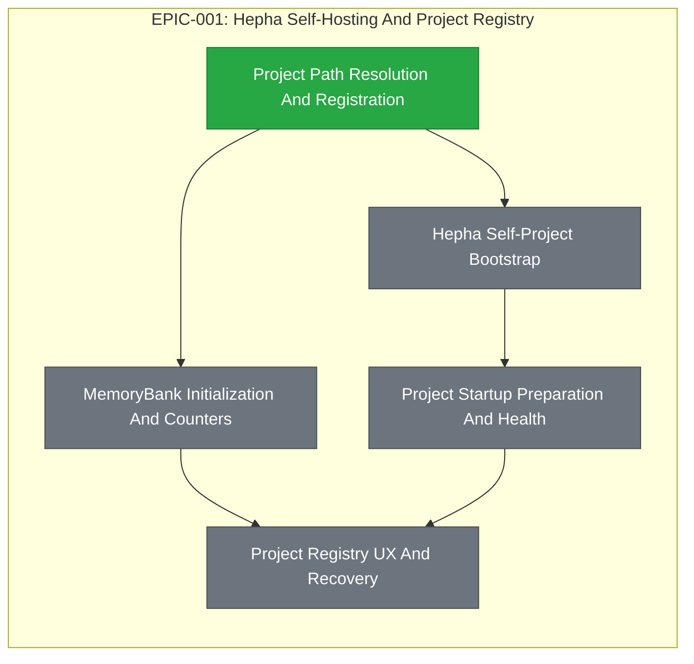

# EPIC-001: Hepha Self-Hosting And Project Registry

| Field | Value |
|-------|-------|
| Epic ID | EPIC-001 |
| State | Completed |
| Created | 2026-06-28 |
| Target Completion | TBD - define during planning |
| Owner | Paulo Aboim Pinto |
| Priority | Critical |
| External Reference | docs/product/vision.md; docs/product/dashboard-definition.md |

## Executive Summary

Make Hepha reliable enough to manage Hepha itself as a first-class project. This epic covers project registration, path resolution, MemoryBank bootstrapping, startup preparation, and recovery behavior so Hepha can safely operate on its own repository.

Project registration must persist canonical paths for execution while retaining the original user-entered path for UX, auditability, and troubleshooting. Startup must tolerate invalid registered projects by continuing service startup, marking affected projects unhealthy, and exposing actionable recovery messages.

## Problem Statement

Hepha cannot become the development harness if it cannot register and reason about its own project consistently. Recent path issues showed that user-entered paths, home-relative paths, canonical paths, and MemoryBank locations need deterministic handling. Without this foundation, later EPIC and FEAT automation will fail in confusing ways or write to the wrong project.

## Success Criteria

- [x] Hepha can register the AgenticDevelopmentProcess repository using absolute and home-relative paths.
- [x] Project root and MemoryBank paths are resolved predictably and stored as canonical paths for execution.
- [x] Original user-entered paths are retained for display, troubleshooting, and recovery flows.
- [x] Missing MemoryBank folders and counters can be initialized without overwriting existing work.
- [x] Startup preparation validates all registered projects, continues when one or more projects are invalid, and reports recoverable problems clearly.
- [x] Hepha can display and operate on its own MemoryBank without manual file edits.

## Features Breakdown

| Feature ID | Title | Status | Dependencies | Priority |
|------------|-------|--------|--------------|----------|
| FEAT-001 | Project Path Resolution And Registration | COMPLETED | None | P1 |
| TBD | Hepha Self-Project Bootstrap | COMPLETED | Project Path Resolution And Registration | P1 |
| TBD | MemoryBank Initialization And Counters | COMPLETED | Project Path Resolution And Registration | P1 |
| TBD | Project Startup Preparation And Health | COMPLETED | Hepha Self-Project Bootstrap | P1 |
| TBD | Project Registry UX And Recovery | COMPLETED | MemoryBank Initialization And Counters; Project Startup Preparation And Health | P2 |

> The four TBD rows were never extracted as separate FEATs; their scope was delivered by platform FEATs (see Progress Tracking notes) and the epic was completed on 2026-08-10.

> FEAT extraction should create exactly one child FEAT for each listed feature and preserve the documented dependency order. Feature IDs are assigned when created via the future `create-epic-features` workflow.

## Epic Progress

**State:** Completed
**Progress:** 100% (5/5 features complete)

| Status | Count | Features |
|--------|-------|----------|
| Completed | 5 | Project Path Resolution And Registration; Hepha Self-Project Bootstrap; MemoryBank Initialization And Counters; Project Startup Preparation And Health; Project Registry UX And Recovery |
| In Progress | 0 | - |
| Ready | 0 | - |
| Submitted | 0 | - |

## Dependency Flow Diagram

## Feature Details

### Feature 1: Project Path Resolution And Registration

**User Story:** As a Hepha user, I want project paths to resolve deterministically while preserving what I entered so that project registration cannot silently target the wrong folder and I can troubleshoot path issues.

**Scope:**
- Canonical resolution for absolute, relative, and home-relative paths.
- Persist canonical project root and MemoryBank paths for execution.
- Retain original user-entered path values for UX, troubleshooting, and recovery.
- Clear validation errors for missing folders or invalid project roots.
- Regression tests for supported path behavior.

**Dependencies:** None

### Feature 2: Hepha Self-Project Bootstrap

**User Story:** As a Hepha builder, I want Hepha registered inside Hepha so that future development can use the same process being built.

**Scope:**
- Register AgenticDevelopmentProcess as a local project.
- Confirm canonical project root, canonical MemoryBank path, original entered path metadata, and project metadata.
- Ensure Hepha can discover and display its own MemoryBank.
- Document the self-hosting setup.

**Dependencies:** Project Path Resolution And Registration

### Feature 3: MemoryBank Initialization And Counters

**User Story:** As a project owner, I want Hepha to initialize missing MemoryBank structure safely so that new projects can start without manual folder setup.

**Scope:**
- Create missing workflow folders.
- Initialize EPIC and FEAT counters without overwriting existing values.
- Detect next available IDs from existing folders when counters are absent.
- Preserve existing MemoryBank files, folders, and counter values.
- Surface initialization results and skipped existing resources clearly.

**Dependencies:** Project Path Resolution And Registration

### Feature 4: Project Startup Preparation And Health

**User Story:** As a Hepha user, I want startup checks to validate registered projects so that broken configuration is visible before agent work starts without preventing healthy projects from being used.

**Scope:**
- Validate project roots and MemoryBank folders on orchestrator startup.
- Start the service even when one or more registered projects are invalid.
- Mark broken projects unhealthy.
- Report project-specific errors in health/status responses.
- Provide actionable recovery messages for stale paths, missing roots, missing MemoryBank folders, and counter issues.
- Avoid crashing the service for one broken project.

**Dependencies:** Hepha Self-Project Bootstrap

### Feature 5: Project Registry UX And Recovery

**User Story:** As a Hepha user, I want project registration errors and recovery actions in the dashboard so that I can fix project setup without editing JSON manually.

**Scope:**
- Display registered project status, including healthy and unhealthy projects.
- Show canonical paths, original entered paths, and MemoryBank validation messages.
- Provide safe update/retry flows for stale or invalid project paths.
- Allow users to trigger safe MemoryBank initialization where applicable.
- Confirm recovery actions before changing stored project records.
- Refresh project health after recovery actions.

**Dependencies:** MemoryBank Initialization And Counters; Project Startup Preparation And Health

## FEAT Extraction Plan

| Extraction Order | Feature Title | Required Dependency State |
|------------------|---------------|---------------------------|
| 1 | Project Path Resolution And Registration | None |
| 2 | Hepha Self-Project Bootstrap | Feature 1 submitted/designed |
| 3 | MemoryBank Initialization And Counters | Feature 1 submitted/designed |
| 4 | Project Startup Preparation And Health | Feature 2 submitted/designed |
| 5 | Project Registry UX And Recovery | Features 3 and 4 submitted/designed |

## Out of Scope

- Cloud-hosted project registry.
- Multi-user project permissions.
- Full GitHub project-board integration.
- Cross-project knowledge selection, which belongs to EPIC-010.

## Risks and Mitigations

| Risk | Impact | Likelihood | Mitigation |
|------|--------|------------|------------|
| Path handling differs between Windows, WSL, and Linux | High | Medium | Add platform-aware tests and avoid hardcoded drive letters. |
| Existing project records contain stale absolute paths | Medium | High | Treat stale paths as recoverable validation errors, not crashes. |
| Initialization overwrites user-created MemoryBank content | High | Low | Only create missing folders and counters; never replace existing files. |
| Canonical paths and original entered paths diverge in confusing ways | Medium | Medium | Display both clearly in UX and use canonical paths only for execution. |

## Progress Tracking

| Feature ID | Status | Started | Completed | Notes |
|------------|--------|---------|-----------|-------|
| FEAT-001 | COMPLETED | 2026-06-28 | 2026-06-30 | Project path resolution and registration foundation |
| TBD | COMPLETED | - | - | Self-host Hepha as a managed project — AgenticDevelopmentProcess runs HEPHA on itself (registry, MemoryBank, boards) |
| TBD | COMPLETED | - | - | Safe MemoryBank initialization — MemoryBank folders and NEXT_*_ID counters (FEAT-002 + init workflows) |
| TBD | COMPLETED | - | - | Startup validation and health — bootstrap validation + orchestrator health route |
| TBD | COMPLETED | - | - | User-facing recovery flow — web app project registry UX and recovery |

**Overall Progress:** 100% (5/5 features complete)

## Next Steps

1. ✅ COMPLETED: Project Path Resolution And Registration (FEAT-001).
2. ✅ COMPLETED: Hepha Self-Project Bootstrap — AgenticDevelopmentProcess runs HEPHA on itself.
3. ✅ COMPLETED: MemoryBank Initialization And Counters — MemoryBank folders and NEXT_*_ID counters.
4. ✅ COMPLETED: Project Startup Preparation And Health — bootstrap validation and health route.
5. ✅ COMPLETED: Project Registry UX And Recovery — web app project registry.
