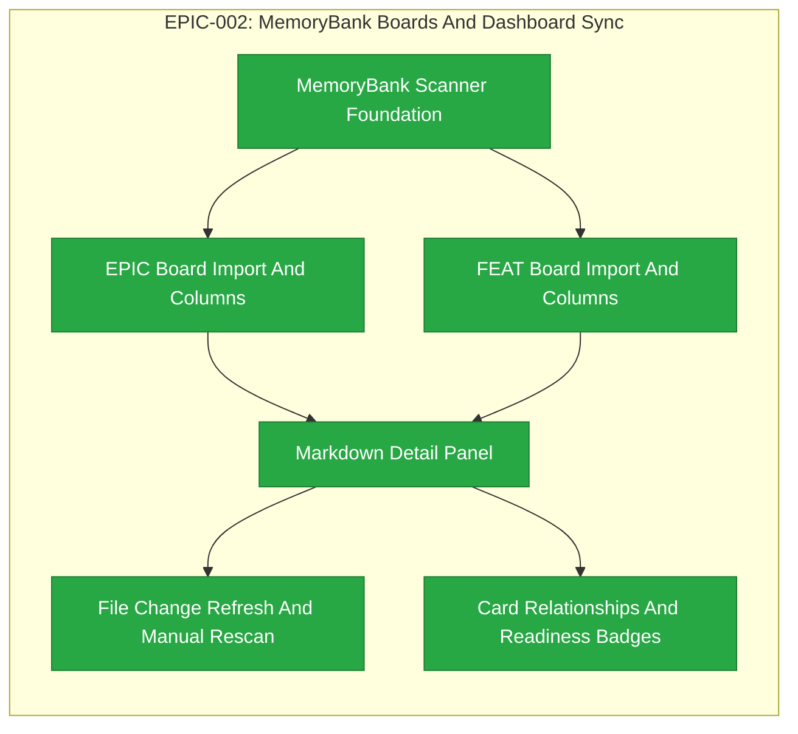

# EPIC-002: MemoryBank Boards And Dashboard Sync

| Field | Value |
|-------|-------|
| Epic ID | EPIC-002 |
| State | Completed |
| Created | 2026-06-28 |
| Target Completion | TBD - define during planning |
| Owner | Paulo Aboim Pinto |
| Priority | Critical |
| External Reference | docs/product/dashboard-definition.md |

## Executive Summary

Build the dashboard and synchronization layer that turns MemoryBank Markdown folders into usable EPIC and FEAT boards. This epic makes Hepha a product surface instead of a set of commands by showing current work, source documents, relationships, validation readiness, and disk-backed document changes.

## Problem Statement

The MemoryBank is the durable source of truth, but it is not enough to browse Markdown folders manually. Hepha needs to scan existing EPICs and FEATs, populate boards, render details, and stay current when files change outside the dashboard. Without this, the orchestrator has no trustworthy user-facing operating surface.

The first implementation baseline is reliable initial scan, manual rescan, and refresh-on-selection from disk. Automatic file watcher complexity can be added later only after the baseline is stable.

## Success Criteria

- [x] The dashboard scans `MemoryBank/Features/00_EPICS` and FEAT state folders into board columns.
- [x] EPIC and FEAT cards show title, ID, state, validation readiness, and relationship hints.
- [x] The detail panel renders current Markdown from disk with source-path access.
- [x] External edits and folder moves are reflected through reliable initial scan, manual rescan, and refresh-on-selection without restarting Hepha.
- [x] Dashboard state reflects MemoryBank folder moves and document updates after rescan or disk refresh.
- [x] Readiness counts are calculated live from the current EPIC or FEAT Markdown file backing each card.

## Acceptance Strategy

EPIC success criteria must be mapped into extracted FEAT acceptance criteria. Each extracted FEAT should explicitly mark relevant EPIC criteria as implemented, deferred, or out of scope.

| EPIC Criterion | Primary FEAT Mapping | Extraction Requirement |
|----------------|----------------------|------------------------|
| Scan `MemoryBank/Features/00_EPICS` and FEAT state folders into board columns | MemoryBank Scanner Foundation; EPIC Board Import And Columns; FEAT Board Import And Columns | Implement as explicit acceptance criteria. |
| Cards show title, ID, state, validation readiness, and relationship hints | EPIC Board Import And Columns; FEAT Board Import And Columns; Card Relationships And Readiness Badges | Implement across board/card FEATs with clear field-level acceptance criteria. |
| Detail panel renders current Markdown from disk with source-path access | Markdown Detail Panel | Implement as explicit rendering and source-path acceptance criteria. |
| External edits and folder moves are reflected through scan/rescan/selection refresh | File Change Refresh And Manual Rescan | Implement manual rescan and refresh-on-selection baseline; defer automatic file watchers unless separately planned. |
| Dashboard state reflects folder moves and document updates without manual restart | File Change Refresh And Manual Rescan | Implement through rescan and disk refresh; no process restart required. |
| Readiness counts are calculated live from backing Markdown file | Card Relationships And Readiness Badges | Implement from current backing document only; do not aggregate from linked children, caches, or summaries. |

## Canonical MemoryBank Fixture

Extracted FEATs must use the configured project MemoryBank as the acceptance fixture and source of truth.

Planning requirements:
- Resolve the canonical MemoryBank path from the registered/configured project.
- If multiple aliases are available, such as a repository-relative `MemoryBank` and a configured project path, verify they point to the same location using inode identity.
- Document the canonical path in each FEAT plan that depends on MemoryBank scanning or rendering.
- Treat the canonical MemoryBank as the fixture for acceptance tests and manual validation.

## Implementation Audit (2026-07-01)

**Audit status:** Existing implementation is present. Treat this EPIC as an
implementation audit, hardening, and acceptance-coverage effort, not a
greenfield board build.

**Observed implementation:**
- The orchestrator already exposes `GET /api/projects/:projectId/work-items`
  and scans `MemoryBank/Features` state folders into `WorkItemCard` records.
- The dashboard already renders MemoryBank work-board columns, EPIC board
  columns, selected-card detail views, Markdown rendering, manual Rescan, and
  card relationship/validation badges.
- Project-level SSE refresh exists through the MemoryBank events endpoint, with
  manual rescan as the reliable baseline.

**Completed audit/hardening work:**
- Verified each EPIC success criterion against the scanner, card, detail,
  refresh, and badge behavior using Hepha's configured MemoryBank as the
  fixture.
- Added or tightened automated coverage for invalid folders, folder moves,
  document updates, source-path display, readiness-count freshness, and
  relationship hints.
- Recorded discovered gaps as formal implementation tasks inside the extracted
  FEATs instead of rebuilding the board layer from scratch.

## Features Breakdown

| Feature ID | Title | Status | Dependencies | Priority |
|------------|-------|--------|--------------|----------|
| FEAT-002 | MemoryBank Scanner Foundation | COMPLETED | EPIC-001 Project Path Resolution And Registration | P1 |
| FEAT-003 | EPIC Board Import And Columns | COMPLETED | MemoryBank Scanner Foundation | P1 |
| FEAT-004 | FEAT Board Import And Columns | COMPLETED | MemoryBank Scanner Foundation | P1 |
| FEAT-005 | Markdown Detail Panel | COMPLETED | EPIC Board Import And Columns; FEAT Board Import And Columns | P1 |
| FEAT-006 | File Change Refresh And Manual Rescan | COMPLETED | Markdown Detail Panel | P2 |
| FEAT-007 | Card Relationships And Readiness Badges | COMPLETED | Markdown Detail Panel | P2 |

> Feature IDs are assigned when created via the future `create-epic-features` workflow.

## Epic Progress

**State:** Completed
**Progress:** 100% (6/6 features complete, 0 in progress)

| Status | Count | Features |
|--------|-------|----------|
| Completed | 6 | MemoryBank Scanner Foundation; EPIC Board Import And Columns; FEAT Board Import And Columns; Markdown Detail Panel; File Change Refresh And Manual Rescan; Card Relationships And Readiness Badges |
| In Progress | 0 | - |
| Ready | 0 | - |
| Submitted | 0 | - |

## Dependency Flow Diagram

## Feature Details

### Feature 1: MemoryBank Scanner Foundation

**User Story:** As a Hepha user, I want the dashboard to scan MemoryBank folders so that existing work appears automatically.

**Scope:**
- Resolve and document the canonical configured project MemoryBank path.
- Verify repo/path aliases by inode when aliases are present.
- Read EPIC and FEAT folders from the configured MemoryBank.
- Parse IDs, titles, states, paths, and basic metadata.
- Return scan results through the orchestrator API.

**Acceptance Criteria to Extract:**
- Initial scan reads EPICs from `MemoryBank/Features/00_EPICS`.
- Initial scan reads FEATs from configured FEAT state folders.
- Scanner output includes ID, title, state, document path, and source type.
- Acceptance validation uses the canonical configured MemoryBank fixture.
- Path aliases are verified by inode when applicable.

**Dependencies:** EPIC-001 Project Path Resolution And Registration

### Feature 2: EPIC Board Import And Columns

**User Story:** As a product owner, I want EPICs shown in lifecycle columns so that strategic work is visible and actionable.

**Scope:**
- Populate EPIC board columns from MemoryBank source.
- Display EPIC card summaries.
- Handle empty and invalid EPIC folders.

**Acceptance Criteria to Extract:**
- EPIC board columns are populated from scanner results.
- EPIC cards show title, ID, state, validation readiness, and relationship hints when available.
- Empty EPIC folders render an empty board state instead of an error.
- Invalid EPIC documents are surfaced safely with source-path access for inspection.

**Dependencies:** MemoryBank Scanner Foundation

### Feature 3: FEAT Board Import And Columns

**User Story:** As a developer, I want FEATs shown in lifecycle columns so that daily implementation work is organized by state.

**Scope:**
- Populate FEAT board columns from state folders.
- Surface parent EPIC references when present.
- Preserve folder-based workflow semantics.

**Acceptance Criteria to Extract:**
- FEAT board columns are populated from scanner results.
- FEAT cards show title, ID, state, validation readiness, and relationship hints when available.
- FEAT folder location determines lifecycle column/state unless a stronger canonical rule is defined in planning.
- Parent EPIC references are displayed when present in the FEAT Markdown.

**Dependencies:** MemoryBank Scanner Foundation

### Feature 4: Markdown Detail Panel

**User Story:** As a Hepha user, I want to inspect the current source Markdown so that dashboard state is auditable.

**Scope:**
- Render Markdown tables, task lists, code blocks, and links.
- Provide a source/debug view.
- Refresh from disk on selection.
- Display the canonical source path for the selected EPIC or FEAT.

**Acceptance Criteria to Extract:**
- Selecting an EPIC or FEAT card loads the current Markdown from disk.
- Detail panel renders Markdown tables, task lists, code blocks, and links.
- Detail panel exposes the selected document source path.
- Re-selecting or refreshing a selected card reflects disk changes without restarting Hepha.

**Dependencies:** EPIC Board Import And Columns; FEAT Board Import And Columns

### Feature 5: File Change Refresh And Manual Rescan

**User Story:** As a Hepha user, I want external edits to appear without restarting so that Hepha cooperates with manual editing and other tools.

**Scope:**
- Implement reliable initial scan, manual rescan, and refresh-on-selection as the first synchronization baseline.
- Update boards after folder moves and file writes when a manual rescan is triggered.
- Refresh detail content from disk when a card is selected or reselected.
- Defer automatic file watcher complexity unless separately planned.

**Acceptance Criteria to Extract:**
- Manual rescan reloads EPIC and FEAT board state from the canonical MemoryBank.
- Manual rescan reflects folder moves without restarting Hepha.
- Manual rescan reflects document updates without restarting Hepha.
- Refresh-on-selection loads the current backing Markdown from disk.
- Automatic file watcher behavior is marked deferred unless implemented by a later FEAT.

**Dependencies:** Markdown Detail Panel

### Feature 6: Card Relationships And Readiness Badges

**User Story:** As a Hepha user, I want cards to show relationships and validation readiness so that I know what can safely move next.

**Scope:**
- Show parent EPIC and linked FEAT signals.
- Count unresolved validation markers live from the current EPIC or FEAT Markdown file backing the card.
- Do not derive readiness counts from linked child documents, generated summaries, caches, or historical scan results.
- Surface deep-dive freshness and phase status badges when present in the backing document.

**Acceptance Criteria to Extract:**
- EPIC and FEAT cards show relationship hints derived from the current backing Markdown.
- Readiness counts are recalculated from the current backing Markdown during scan, rescan, and refresh.
- Readiness counts do not aggregate linked child documents.
- Readiness counts do not use generated summaries, caches, or historical scan results.
- Deep-dive freshness and phase status badges are shown when source metadata is present.

**Dependencies:** Markdown Detail Panel

## Out of Scope

- Rich observability timelines, which belong to EPIC-007.
- Full implementation automation, which belongs to EPIC-008.
- Cloud collaboration or external project boards.
- Aggregated readiness scoring across linked EPIC and FEAT hierarchies.
- Automatic file watcher implementation beyond the manual rescan and refresh-on-selection baseline, unless separately planned in a later FEAT.

## Risks and Mitigations

| Risk | Impact | Likelihood | Mitigation |
|------|--------|------------|------------|
| Markdown formats vary between old and new projects | Medium | High | Build tolerant parsers and preserve source links for inspection. |
| Multiple MemoryBank path aliases point to different locations | High | Medium | Resolve configured canonical MemoryBank path and verify aliases by inode. |
| File watching is unreliable on external drives | Medium | Medium | Use manual rescan, initial scan, and refresh-on-selection as the reliability baseline. |
| Dashboard cards become overloaded with paths and metadata | Medium | Medium | Put detailed paths in the panel; keep cards focused on state and readiness. |
| Readiness badges become stale after external edits | Medium | Medium | Calculate counts live from the backing Markdown document during scan, rescan, and refresh. |
| EPIC acceptance criteria are lost during FEAT extraction | High | Medium | Map each EPIC success criterion into extracted FEAT acceptance criteria with implemented/deferred/out-of-scope status. |

## Progress Tracking

| Feature ID | Status | Started | Completed | Notes |
|------------|--------|---------|-----------|-------|
| FEAT-002 | COMPLETED | 2026-07-01 | 2026-07-01 | Scanner foundation; canonical MemoryBank fixture, inode alias validation, and work-items API output verified |
| FEAT-003 | COMPLETED | 2026-07-01 | 2026-07-02 | EPIC board import |
| FEAT-004 | COMPLETED | 2026-07-02 | 2026-07-02 | FEAT board import |
| FEAT-005 | COMPLETED | 2026-07-02 | 2026-07-02 | Markdown detail panel; dedicated endpoint, UI reload from disk, source path display |
| FEAT-006 | COMPLETED | 2026-07-02 | 2026-07-02 | File change refresh and manual rescan; scanner/document-read freshness and folder move coverage |
| FEAT-007 | COMPLETED | 2026-07-02 | 2026-07-02 | Card relationships and readiness badges; project-aware Pi skill prompt routing |

**Overall Progress:** 6/6 features complete (100%); 0 features in progress

## Next Steps

1. Keep EPIC-002 behavior covered by the completed FEAT regression tests.
2. Carry any new dashboard workflow improvements into later EPICs instead of reopening this completed EPIC.

## Hepha Deep-Dive Decisions

Recorded: 2026-07-01T07:41:57.469Z

Hepha applied these saved Deep-Dive answers directly because the full-document model rewrite did not finish.
Fallback reason: Source document is 15387 characters; deterministic update is used above 12000 characters.

### implementation posture

Question: Should extracted FEATs treat the existing dashboard implementation as audit-and-hardening work rather than greenfield delivery?

Decision: **Audit-first hardening** - Verify current behavior against EPIC criteria, add missing coverage, and create implementation tasks only for discovered gaps.

### canonical MemoryBank fixture

Question: Which MemoryBank source should FEAT acceptance validation use?

Decision: **Registered canonical MemoryBank with inode checks** - Resolve from the configured project, verify aliases by inode, and document the canonical path in every dependent FEAT plan.

### acceptance traceability gates

Question: How should EPIC criteria and review-prevention rules be carried into extracted FEATs?

Decision: **Strict per-FEAT traceability gates** - Each FEAT maps relevant EPIC criteria as implemented/deferred/out-of-scope and includes gates for env restoration, stale test counts, serialized commands, and pure API error helpers when applicable.
