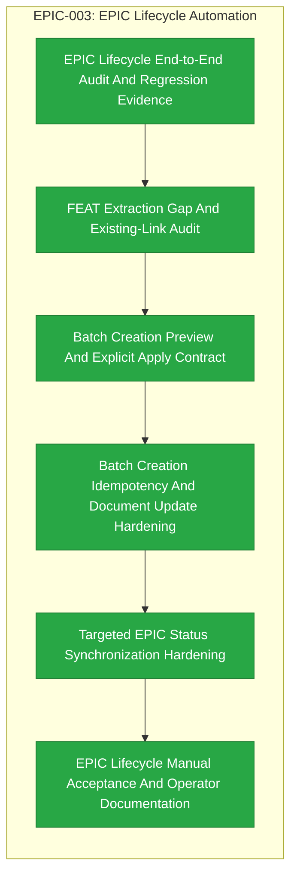

# EPIC-003: EPIC Lifecycle Automation

| Field | Value |
|-------|-------|
| Epic ID | EPIC-003 |
| State | Completed |
| Created | 2026-06-28 |
| Target Completion | 2026-07-04 |
| Owner | Paulo Aboim Pinto |
| Priority | High |
| External Reference | DevCycleManager/Prompts/submit-epic.md; DevCycleManager/Prompts/create-epic-features.md |

## Executive Summary

Convert the old DevCycle MCP EPIC workflow into native Hepha behavior. This epic covers EPIC creation, clarification, document update, validation tracking, FEAT extraction, batch feature creation, and EPIC status synchronization.

## Problem Statement

EPICs are the strategic entry point for Hepha's process, but today they must be created manually. The old MCP project already defined useful EPIC procedures, but Hepha needs to own them natively through dashboard state, MemoryBank artifacts, and orchestrator runs. Without EPIC automation, HEPHA cannot reliably turn strategic ideas into executable FEATs.

## Success Criteria

- [x] Hepha can create a new EPIC folder and `EpicDescription.md` from a dashboard or API request.
- [x] EPIC deep-dive questions are generated, answered, and applied to the EPIC document.
- [x] Validation markers and deep-dive freshness are tracked for EPIC cards.
- [x] Hepha can extract candidate FEATs from an approved EPIC.
- [x] Batch FEAT creation updates both EPIC and child FEAT documents consistently.
- [x] EPIC status updates when linked FEATs move through the lifecycle.

## Implementation Audit (2026-07-01)

**Audit status:** Substantial implementation already exists. Treat this EPIC as
an audit and hardening pass over native EPIC lifecycle behavior, with formal new
implementation only for missing confirmation, sync, or edge-case gaps found
during the audit.

**Observed implementation:**
- Native EPIC submission exists through the submit-epic API/UI path, including
  idea-mode and structured prompts, EPIC ID assignment, folder creation, and
  `EpicDescription.md` rendering.
- EPIC deep-dive sessions, question capture, document update, and freshness
  metadata are implemented through the shared deep-dive workflow and SQLite
  metadata.
- FEAT extraction and missing-feature creation exist, including child FEAT
  document rendering with EPIC backlinks.
- EPIC state parsing, insertion, derivation from linked FEAT folders, and sync
  helpers are present.

**Remaining audit/gap work:**
- Prove the end-to-end lifecycle from submit EPIC through deep-dive, FEAT
  extraction, batch FEAT creation, and EPIC status sync with tests and manual
  acceptance evidence.
- Audit whether batch creation has the right user confirmation semantics,
  preserves document shape, updates all relevant EPIC tables/diagrams, and
  handles existing FEAT links without duplicates.
- Any missing behavior should be handled as targeted formal implementation in
  the extracted FEAT; do not reimplement the already-working submission,
  deep-dive, extraction, or state-sync foundations.

## Features Breakdown

| Feature ID | Title | Status | Dependencies | Priority |
|------------|-------|--------|--------------|----------|
| FEAT-008 | EPIC Lifecycle End-to-End Audit And Regression Evidence | COMPLETED | EPIC-002 MemoryBank Scanner Foundation | P1 |
| FEAT-009 | FEAT Extraction Gap And Existing-Link Audit | COMPLETED | EPIC Lifecycle End-to-End Audit And Regression Evidence | P1 |
| FEAT-010 | Batch Creation Preview And Explicit Apply Contract | COMPLETED | FEAT Extraction Gap And Existing-Link Audit | P1 |
| FEAT-011 | Batch Creation Idempotency And Document Update Hardening | COMPLETED | Batch Creation Preview And Explicit Apply Contract | P1 |
| FEAT-012 | Targeted EPIC Status Synchronization Hardening | COMPLETED | Batch Creation Idempotency And Document Update Hardening | P1 |
| FEAT-013 | EPIC Lifecycle Manual Acceptance And Operator Documentation | COMPLETED | Targeted EPIC Status Synchronization Hardening | P2 |

## Epic Progress

**State:** Completed
**Progress:** 100% (6/6 features complete)

| Status | Count | Features |
|--------|-------|----------|
| Completed | 6 | FEAT-008, FEAT-009, FEAT-010, FEAT-011, FEAT-012, FEAT-013 |
| Ready | 0 | - |
| In Progress | 0 | - |
| Submitted | 0 | - |

## Dependency Flow Diagram

## Feature Details

### Feature 1: EPIC Lifecycle End-to-End Audit And Regression Evidence (FEAT-008)
**User Story:** As a Hepha operator, I want the native EPIC lifecycle audited end-to-end so that I can trust the existing implementation before adding more automation.

**Scope:**
- Exercise the lifecycle from submit EPIC through deep-dive, document update, FEAT extraction, batch creation, and status sync.
- Add regression tests for the critical lifecycle paths.
- Record defects, edge cases, and missing behavior as targeted follow-up work.
- Confirm which foundations are already implemented and must not be reimplemented unnecessarily.

**Dependencies:** EPIC-002 MemoryBank Scanner Foundation
**Status:** COMPLETED

### Feature 2: FEAT Extraction Gap And Existing-Link Audit (FEAT-009)
**User Story:** As a product owner, I want FEAT extraction to propose only real remaining work so that already implemented EPIC lifecycle foundations are not duplicated.

**Scope:**
- Verify extraction behavior against clarified EPIC documents.
- Ensure extracted FEAT candidates reflect audit/hardening gaps.
- Detect existing child FEAT links and avoid duplicate candidates.
- Preserve parent EPIC references and dependency order.

**Dependencies:** EPIC Lifecycle End-to-End Audit And Regression Evidence
**Status:** COMPLETED

### Feature 3: Batch Creation Preview And Explicit Apply Contract (FEAT-010)
**User Story:** As a Hepha user, I want to preview the exact batch FEAT creation plan before anything is written so that bulk EPIC updates remain safe and intentional.

**Scope:**
- Generate a deterministic creation/update plan before file writes.
- Show child FEAT folders to be created, EPIC rows to be updated.
- Require one explicit confirmation before writes.
- Ensure cancellation leaves the filesystem unchanged.

**Dependencies:** FEAT Extraction Gap And Existing-Link Audit
**Status:** COMPLETED

### Feature 4: Batch Creation Idempotency And Document Update Hardening (FEAT-011)
**User Story:** As a Hepha user, I want batch FEAT creation to be resume-safe and duplicate-safe so that repeated runs do not corrupt EPIC planning artifacts.

**Scope:**
- Create missing child FEAT folders in dependency order.
- Update EPIC feature tables, details, progress, and Mermaid diagram consistently.
- Preserve useful existing sections, links, and manual edits.
- Handle partially created child FEATs without duplicate rows.

**Dependencies:** Batch Creation Preview And Explicit Apply Contract
**Status:** COMPLETED

### Feature 5: Targeted EPIC Status Synchronization Hardening (FEAT-012)
**User Story:** As a product owner, I want EPIC progress to update from linked child FEAT states without overwriting manual EPIC content so that strategic status remains accurate and trustworthy.

**Scope:**
- Update only known lifecycle tables, progress values, and Mermaid status classes.
- Recalculate EPIC status from linked child FEAT folders.
- Preserve surrounding Markdown, manual notes, and non-lifecycle sections.
- Handle missing or malformed child FEAT references gracefully.

**Dependencies:** Batch Creation Idempotency And Document Update Hardening
**Status:** COMPLETED

### Feature 6: EPIC Lifecycle Manual Acceptance And Operator Documentation (FEAT-013)
**User Story:** As a Hepha operator, I want acceptance evidence and concise operator guidance so that EPIC lifecycle automation can be used repeatedly with confidence.

**Scope:**
- Capture manual acceptance evidence for the audited lifecycle.
- Document the preview/apply contract for batch FEAT creation.
- Document expected behavior for duplicate FEAT links, partial creation, and status sync.
- Record known limitations and confirm EPIC readiness to close.

**Dependencies:** Targeted EPIC Status Synchronization Hardening
**Status:** COMPLETED

> **Delivery note (2026-08-10):** FEAT-013 was delivered via direct commits to the AgenticDevelopmentProcess repository (`524a3121`, `2abe308a`, `c18baa7a`) — no pull request was created. The CodeWhale EPIC-style issue [Hmbown/CodeWhale#2870](https://github.com/Hmbown/CodeWhale/issues/2870) referenced this work as "Layer 5.4"; that entry was struck out and marked **Skipped** by decision on 2026-08-10 (justification recorded in the FEAT-013 FeatureDescription deep-dive and in the issue itself). FEAT-013 remains COMPLETED — all 12/12 manual acceptance checks were accepted and the closure evidence is on file.

## Out of Scope

- FEAT implementation automation.
- Git branch or worktree management.
- Global second-brain learning.
- Fully automatic EPIC approval without human review.

## Risks and Mitigations

| Risk | Impact | Likelihood | Mitigation |
|------|--------|------------|------------|
| Batch creation writes many files incorrectly | High | Medium | Require confirmation and make the operation resume-safe. |
| EPIC document parsing is brittle | Medium | Medium | Use tolerant parsing and preserve source sections when uncertain. |
| Status sync overwrites manual edits | High | Medium | Make targeted edits to known tables and preserve document shape. |

## Progress Tracking

| Feature ID | Status | Started | Completed | Notes |
|------------|--------|---------|-----------|-------|
| FEAT-008 | COMPLETED | 2026-07-03 | 2026-07-03 | End-to-end lifecycle audit, regression coverage, and evidence |
| FEAT-009 | COMPLETED | 2026-07-03 | 2026-07-03 | FEAT extraction gap audit and existing-link handling |
| FEAT-010 | COMPLETED | 2026-07-03 | 2026-07-03 | Deterministic preview and explicit apply confirmation |
| FEAT-011 | COMPLETED | 2026-07-03 | 2026-07-04 | Batch creation idempotency and EPIC document update hardening |
| FEAT-012 | COMPLETED | 2026-07-04 | 2026-07-04 | Targeted EPIC status synchronization and manual-edit preservation |
| FEAT-013 | COMPLETED | 2026-07-04 | 2026-07-04 | Manual acceptance evidence, operator documentation, closure evidence, workflow failure recovery |

**Overall Progress:** 6/6 features complete (100%)

> EPIC-003 Features Breakdown table and Progress Tracking were updated on 2026-07-04 as part of the FEAT-013 complete-feature transition.

## Next Steps

1. FEAT-008 (EPIC Lifecycle End-to-End Audit And Regression Evidence) — complete.
2. FEAT-009 (FEAT Extraction Gap And Existing-Link Audit) — complete.
3. FEAT-010 (Batch Creation Preview And Explicit Apply Contract) — complete.
4. FEAT-011 (Batch Creation Idempotency And Document Update Hardening) — complete.
5. FEAT-012 (Targeted EPIC Status Synchronization Hardening) — complete.
6. FEAT-013 (EPIC Lifecycle Manual Acceptance And Operator Documentation) — complete.

**EPIC-003 lifecycle automation is complete.** All 6 FEATs are in `04_COMPLETED`. Non-blocking follow-up work (L001–L005) is documented in `limitations-and-follow-ups.md`. Future lifecycle work beyond EPIC-003 scope (FEAT removal, bulk cancellation, automatic file watchers) should be planned as a new EPIC.

## Closure Note (2026-08-10)

EPIC-003 remains **Completed** with 6/6 features complete; FEAT-013 was **not** reclassified as skipped. The skip decision applies only to the optional CodeWhale-side PR delivery ("Layer 5.4" in [Hmbown/CodeWhale#2870](https://github.com/Hmbown/CodeWhale/issues/2870)): the FEAT-013 work itself (manual acceptance notes, operator documentation, closure evidence, limitations/follow-ups) was delivered and accepted in this repository via direct commits (`524a3121`, `2abe308a`, `c18baa7a`), so no CodeWhale PR was pursued. Layer 5.4 was struck out (not deleted) in #2870 with a dated justification, and Layer 5.3 (PR #5255) was marked merged on the same pass. No production code was changed by this decision.
