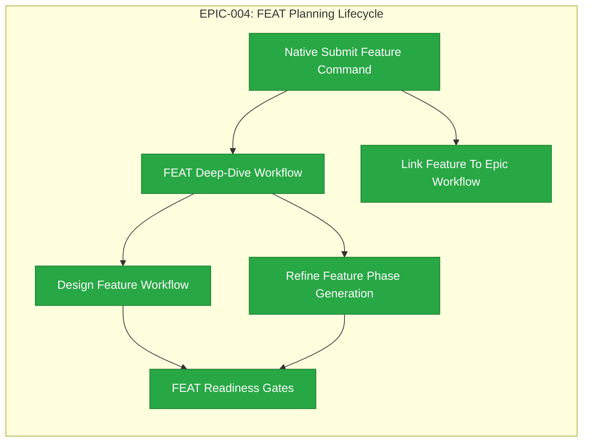

# EPIC-004: FEAT Planning Lifecycle

| Field | Value |
|-------|-------|
| Epic ID | EPIC-004 |
| State | Completed |
| Created | 2026-06-28 |
| Target Completion | TBD - define during planning |
| Owner | Paulo Aboim Pinto |
| Priority | High |
| External Reference | docs/product/vision.md; .hepha/commands/refine-feature.md; .hepha/commands/deep-dive-feature.md; .hepha/commands/design-feature.md; .hepha/commands/start-feature.md; .hepha/commands/continue-implementation.md |

## Executive Summary

Make FEATs move from submitted idea to implementation-ready plan through native Hepha workflows. This epic covers feature submission, clarification, design, refinement, readiness gates, and EPIC relationship management.

EPIC-004 should be extracted into six audit-first FEATs. Each FEAT starts by auditing the current partial implementation, proving what already works, and defining exact implementation gaps before adding new behavior.

## Problem Statement

Implementation automation is only useful when the feature specification is clear, reviewed, and decomposed into executable phases. The old DevCycle workflow already had deep-dive, design, and refine steps, but Hepha needs native state, dashboard visibility, and validation gates around those steps. Without this FEAT planning lifecycle, implementation agents will receive vague or stale instructions.

Several planning workflows already exist partially in Hepha. This epic must therefore avoid rebuilding proven behavior and instead formalize the lifecycle through audit-first FEATs that validate existing command templates, API routes, dashboard actions, workflow state, artifacts, and enforcement gaps.

## Hepha Deep-Dive Decisions

Recorded: 2026-07-06T11:44:58.053Z

Hepha applied these saved Deep-Dive answers directly because the full-document model rewrite did not finish.
Fallback reason: Source document is 21248 characters; deterministic update is used above 12000 characters.

### extraction posture

Question: EPIC-004 already lists all six child FEATs as completed. What should happen before FEAT extraction proceeds?

Decision: **Skip duplicate extraction and close audit** - Treat EPIC-004 as already extracted/completed and avoid creating duplicate FEATs.

### canonical source sections

Question: The document has duplicate Feature Details sections and mixed state fields. Which section should be canonical for any future planning?

Decision: **Use completed FEAT table as canonical** - Use FEAT-014 through FEAT-019 status/evidence as the source of truth and ignore older duplicate detail blocks.

### follow-up scope

Question: How should the listed Next Steps be handled now that EPIC-004 is complete?

Decision: **Move to a separate follow-up EPIC** - Create a new planning container for multi-parent support, source hash guards, Playwright coverage, and cleanup work.

## Success Criteria

- [x] Hepha can create and import FEATs with stable metadata and parent EPIC references.
- [x] Standalone FEAT submission works through the dashboard/API surface while reusing existing counters and folder conventions.
- [x] FEAT deep-dive produces actionable clarification questions and durable document updates.
- [x] Design workflow creates durable design artifacts when needed and can be skipped or minimized for non-UI work.
- [x] Refinement creates `FeatureTasks.md` and numbered phase files with acceptance criteria and required evidence.
- [x] Backend workflow routes block start/continue implementation until required artifacts and validations are present.
- [x] Dashboard cards/buttons mirror FEAT readiness state clearly.
- [x] Existing standalone FEATs can be linked to EPICs bidirectionally, including relinking cleanup and EPIC progress sync.

## Implementation Audit (2026-07-01)

**Audit status:** All 6 EPIC-004 child FEATs are completed. Full lifecycle from submission through readiness gates and EPIC relationship management is implemented and tested.

**Observed implementation:**
- FEAT documents can already be created from EPIC feature extraction and missing feature creation, including parent EPIC references.
- FEAT deep-dive uses the same deep-dive session infrastructure as EPICs and feeds validation freshness into cards.
- Design and refine feature workflows are wired through dedicated API routes, workflow YAML, `.hepha` command templates, context packs, schemas, model routing, and dashboard actions.
- Refinement can move submitted FEAT folders to Ready To Develop, and readiness checks are represented in dashboard workflow state.
- Relationship parsing exists for parent EPIC IDs and EPIC child FEAT IDs.

**Completed FEATs within EPIC-004:**
- ✅ COMPLETED (FEAT-014): Native standalone submit-feature path implemented in dashboard/API surface.
- ✅ COMPLETED (FEAT-015): FEAT deep-dive workflow audited and hardened. 58 new additive tests.
- ✅ COMPLETED (FEAT-016): Design feature workflow audited and hardened. 113 new additive tests.
- ✅ COMPLETED (FEAT-017): Refine feature artifact contract validated. 47 tests, 4 test files.
- ✅ COMPLETED (FEAT-018): FEAT readiness gates implemented in backend routes and dashboard display. 37 tests, 2 test files.
- ✅ COMPLETED (FEAT-019): Standalone FEAT-to-EPIC linking, relinking, unlink/cleanup, and EPIC progress sync. 66 new additive tests (4 files).

## Features Breakdown

| Feature ID | Title | Status | Dependencies | Priority |
|------------|-------|--------|--------------|----------|
| FEAT-014 | Native Submit Feature Command | COMPLETED |  |  |
| FEAT-015 | FEAT Deep-Dive Workflow | COMPLETED |  |  |
| FEAT-016 | Design Feature Workflow | COMPLETED |  |  |
| FEAT-017 | Refine Feature Phase Generation | COMPLETED |  |  |
| FEAT-018 | FEAT Readiness Gates | COMPLETED | 2026-07-04 | |
| FEAT-019 | Link Feature To Epic Workflow | COMPLETED |  |  |

> Feature IDs are assigned when created via the `create-epic-features` workflow. Each extracted FEAT must include an initial audit phase before implementation work.

## Epic Progress

**State:** Completed
**Progress:** 100% (6/6 features complete)

| Status | Count | Features |
|--------|-------|----------|
| Completed | 6 | Native Submit Feature Command; FEAT Deep-Dive Workflow; Design Feature Workflow; Refine Feature Phase Generation; FEAT Readiness Gates; Link Feature To Epic Workflow |
| Ready | 0 | - |
| Submitted | 0 | - |

## Dependency Flow Diagram

## Feature Details

### Feature 1: Native Submit Feature Command (FEAT-014)

**User Story:** Implement or validate standalone FEAT submission from dashboard/API, reusing existing counters and folder conventions. Support optional parent EPIC metadata and produce FeatureDescription.md under 01_SUBMITTED.

**Scope:** Generated from EPIC EPIC-004 - FEAT Planning Lifecycle.
**Backlink:** - EPIC: EPIC-004 - FEAT Planning Lifecycle
**Dependencies:** None

### Feature 2: FEAT Deep-Dive Workflow (FEAT-015)

**User Story:** Audit and enhance FEAT deep-dive session infrastructure to generate clarification questions, capture answers, update FeatureDescription.md, track validation freshness, and resolve markers. Ensure it works for standalone and EPIC-derived FEATs.

**Scope:** Generated from EPIC EPIC-004 - FEAT Planning Lifecycle.
**Backlink:** - EPIC: EPIC-004 - FEAT Planning Lifecycle
**Dependencies:** None

### Feature 3: Design Feature Workflow (FEAT-016)

**User Story:** Produce design artifacts for UI-heavy FEATs and enable skip/minimize for non-UI features. Audit and enhance existing design-feature routes, templates, and dashboard actions, generating design notes, screen inventory, interaction decisions, and UI constraints.

**Scope:** Generated from EPIC EPIC-004 - FEAT Planning Lifecycle.
**Backlink:** - EPIC: EPIC-004 - FEAT Planning Lifecycle
**Dependencies:** None

### Feature 4: Refine Feature Phase Generation (FEAT-017)

**User Story:** Audit and improve refine-feature workflow to generate FeatureTasks.md and numbered phase files with tasks, acceptance criteria, dependencies, and required evidence. Move refined FEATs to Ready To Develop only when artifacts are complete.

**Scope:** Generated from EPIC EPIC-004 - FEAT Planning Lifecycle.
**Backlink:** - EPIC: EPIC-004 - FEAT Planning Lifecycle
**Dependencies:** None

### Feature 5: FEAT Readiness Gates (FEAT-018)

**User Story:** Enforce readiness gates in backend routes and mirror state in dashboard cards/buttons. Validate required documents, unresolved markers, stale deep-dive metadata, missing design artifacts, and block start/continue implementation when not ready.

**Scope:** Generated from EPIC EPIC-004 - FEAT Planning Lifecycle.
**Backlink:** - EPIC: EPIC-004 - FEAT Planning Lifecycle
**Dependencies:** None

### Feature 6: Link Feature To Epic Workflow (FEAT-019) ✅ COMPLETED

**User Story:** Implement bidirectional standalone FEAT-to-EPIC linking, relinking cleanup, and EPIC progress synchronization. Audit existing relationship parsing and ensure consistent metadata updates in both FEAT and EPIC documents.

**Completion Evidence:** 66 additive tests (4 files), FEAT-019 fully completed 2026-07-06.
**Scope:** Generated from EPIC EPIC-004 - FEAT Planning Lifecycle.
**Backlink:** - EPIC: EPIC-004 - FEAT Planning Lifecycle
**Dependencies:** None

### Feature 1: Native Submit Feature Command

**User Story:** As a Hepha user, I want to submit a FEAT from a standalone idea or EPIC extraction so that deliverable work enters the process consistently.

**Scope:**
- Audit existing FEAT creation paths, counters, folder conventions, metadata schemas, and dashboard/API surfaces.
- Validate or implement standalone FEAT submission from the dashboard/API.
- Reuse existing FEAT ID counters.
- Create `FeatureDescription.md` under `01_SUBMITTED`.
- Support optional parent EPIC metadata when supplied.
- Preserve compatibility with EPIC feature extraction and missing feature creation flows.

**Acceptance Criteria:**
- A standalone FEAT can be created without requiring EPIC extraction.
- The submitted FEAT receives a stable FEAT ID from the existing counter system.
- The submitted FEAT is created in the expected `01_SUBMITTED` folder.
- Optional parent EPIC metadata is written when supplied and omitted cleanly when not supplied.
- Dashboard/API behavior is covered by tests or documented manual verification.

**Dependencies:** EPIC-002 FEAT Board Import And Columns

### Feature 2: FEAT Deep-Dive Workflow

**User Story:** As a product owner, I want Hepha to resolve FEAT ambiguity before design or implementation so that downstream agents receive clear requirements.

**Scope:**
- Audit existing FEAT deep-dive session infrastructure, command templates, saved answers, metadata sync, and dashboard state.
- Generate FEAT-specific clarification questions.
- Capture answers and update `FeatureDescription.md`.
- Track validation freshness.
- Preserve or remove validation markers based on answered decisions.
- Ensure the workflow can run independently for standalone FEATs and EPIC-derived FEATs.

**Acceptance Criteria:**
- FEAT deep-dive can generate actionable question rounds from unresolved markers or readiness gaps.
- Saved answers can be applied to the FEAT document without generating a new question round.
- Validation freshness is reflected in backend metadata and dashboard cards.
- The resulting FEAT document is ready for design/refinement handoff.

**Dependencies:** Native Submit Feature Command

### Feature 3: Design Feature Workflow

**User Story:** As a builder, I want UI and interaction-heavy FEATs to produce design artifacts so that implementation has an approved target.

**Scope:**
- Audit existing design-feature API routes, workflow YAML, command templates, context packs, schemas, model routing, and dashboard actions.
- Produce design notes, screen inventory, interaction decisions, and UI constraints when the FEAT requires design.
- Respect existing product and frontend quality guidance.
- Skip or minimize design for non-UI features based on FEAT type and user decision.
- Preserve design artifacts as durable planning evidence for refinement and readiness gates.

**Acceptance Criteria:**
- UI-heavy FEATs produce durable design artifacts.
- Non-UI FEATs can explicitly skip or minimize design with a recorded reason.
- Design output is discoverable from the FEAT card or workflow state.
- Design artifacts provide enough detail for refinement and implementation planning.

**Dependencies:** FEAT Deep-Dive Workflow

### Feature 4: Refine Feature Phase Generation ✅ COMPLETED

**User Story:** As an implementation lead, I want a refined FEAT to include executable phases and tasks so that agents can work incrementally.

**Completion Evidence:**
- Created `refine-artifact-validator.ts` — pure validation module with 12 error taxonomy codes.
- Integrated validator into orchestrator's promote-ready node and timeout recovery path.
- Structured error format `[CODE] path: message` with relative paths only.
- 47 focused tests across 4 test files (data layer, business logic, API contract, integration).
- All 12 FEAT-017 acceptance criteria satisfied with test evidence.

**Scope:**
- Audit existing refine-feature workflow behavior against real Hepha FEATs.
- Generate `FeatureTasks.md`.
- Generate numbered phase documents.
- Define phase-level tasks, acceptance criteria, dependencies, and required evidence.
- Move or mark refined FEATs as Ready To Develop only when planning artifacts are complete.
- Ensure refinement output is specific enough for autonomous implementation agents.

**Acceptance Criteria:**
- ✅ Refinement creates or updates `FeatureTasks.md`.
- ✅ Refinement creates numbered phase files with clear task boundaries.
- ✅ Each phase includes acceptance criteria and required evidence.
- ✅ The workflow identifies missing clarification/design inputs instead of producing vague plans.
- ✅ Real Hepha FEAT fixtures demonstrate acceptable refinement output quality.

**Dependencies:** FEAT Deep-Dive Workflow

**Deliverables:** `apps/orchestrator/src/refine-artifact-validator.ts`, 4 focused test files (47 tests), updated orchestrator promote-ready/recovery paths.

### Feature 5: FEAT Readiness Gates ✅ COMPLETED

**User Story:** As a Hepha user, I want implementation blocked until the FEAT is truly ready so that agents do not code from incomplete plans.

**Completion Evidence:**
- Created `feat-readiness-evaluator.ts` — pure readiness evaluation module with 10 failure codes.
- Integrated readiness gates into backend route guards (`runStartImplementing`, `runContinueImplementing`) before workflow metadata writes.
- Exposed `FeatureReadinessSummary` on shared `FeatureWorkflowSummary` for dashboard consumption.
- Added readiness reason display in dashboard Start/Continue Implementation action panels.
- 37 focused tests across 2 test files (15 data-layer + 22 integration), all passing.
- 877 total tests passing across 68 test files.

**Scope:**
- Audit current readiness checks in workflow state, dashboard cards, and implementation routes.
- Validate required documents, including `FeatureDescription.md`, `FeatureTasks.md`, and required phase files.
- Check unresolved validation markers.
- Check stale deep-dive metadata.
- Check missing design artifacts or explicit design skip decisions where applicable.
- Block `start-feature` and `continue-implementation` through backend workflow routes when readiness fails.
- Mirror readiness state in dashboard cards, buttons, and user-facing messages.

**Acceptance Criteria:**
- ✅ Backend routes refuse to start implementation when required planning artifacts are missing.
- ✅ Backend routes refuse to continue implementation when readiness metadata is stale or invalid.
- ✅ Dashboard cards/buttons clearly show whether a FEAT is blocked or ready.
- ✅ Readiness failures explain the exact missing or stale artifacts.
- ✅ A ready FEAT can proceed to implementation without false blocking.

**Dependencies:** Design Feature Workflow; Refine Feature Phase Generation

### Feature 6: Link Feature To Epic Workflow ✅ COMPLETED

**User Story:** As a product owner, I want standalone FEATs linked to EPICs so that strategic progress and feature detail stay synchronized.

**Completion Evidence:**
- Created `feature-epic-linking.ts` — pure Markdown patch planning module (24 data-layer tests)
- Created `feature-epic-linking-orchestrator.ts` — backend orchestration for link/relink/unlink (16 business-logic tests)
- Added API route `POST /api/projects/:projectId/features/:cardId/link-epic` with shared types (14 API contract tests)
- Added LinkEpicPanel UI component in dashboard (apps/web/src/main.tsx)
- 20 isolated integration tests covering all link/relink/unlink/cleanup scenarios, scanner consistency, and EPIC progress sync
- 66 total FEAT-019 tests across 4 files

**Scope:**
- Audit existing relationship parsing for parent EPIC IDs and EPIC child FEAT IDs.
- Update both FEAT and EPIC documents when linking.
- Handle relinking with cleanup from the previous EPIC.
- Preserve current FEAT status in EPIC feature tables.
- Synchronize EPIC progress after link, unlink, or relink operations.
- Verify behavior for standalone FEATs and EPIC-derived FEATs.

**Acceptance Criteria:**
- ✅ A standalone FEAT can be linked to an EPIC.
- ✅ FEAT metadata and EPIC feature tables remain consistent after linking.
- ✅ Relinking removes stale references from the previous EPIC.
- ✅ Current FEAT status is preserved in EPIC tables.
- ✅ EPIC progress is recalculated or synchronized after relationship changes.

**Dependencies:** Native Submit Feature Command; EPIC-003 Epic Status Synchronization

## Cross-FEAT Requirements

- Each FEAT starts with an audit phase that records existing behavior, missing behavior, and verification evidence.
- Existing working Hepha behavior should be reused rather than rebuilt.
- New implementation must preserve current MemoryBank folder conventions and workflow metadata.
- Dashboard actions and backend routes must remain consistent.
- Readiness and relationship changes must be deterministic and testable.
- All generated planning artifacts must be suitable for downstream autonomous implementation.

## Out of Scope

- Source code implementation inside this EPIC document.
- Automated release or PR creation.
- Global knowledge promotion.
- Complex portfolio-level planning across projects.
- Replacing the MemoryBank folder model.
- Rebuilding working deep-dive, design, or refinement infrastructure without an audit-proven gap.

## Risks and Mitigations

| Risk | Impact | Likelihood | Mitigation |
|------|--------|------------|------------|
| Agents produce large but vague refinement docs | High | Medium | Require phase tasks, acceptance criteria, required evidence, and fixture-based audits. |
| Design workflow becomes mandatory for non-UI work | Medium | Medium | Add explicit skip/minimize logic based on FEAT type and user decision. |
| Linking creates inconsistent EPIC/FEAT references | Medium | Medium | Treat bidirectional updates as one operation with verification and EPIC progress sync. |
| Existing partial implementation is duplicated instead of reused | Medium | Medium | Make the first phase of each FEAT an implementation audit. |
| Readiness appears blocked in the dashboard but not in backend routes | High | Medium | Enforce gates in backend routes and mirror state in dashboard cards/buttons. |
| Backend blocks valid implementation because readiness signals are stale or incomplete | Medium | Medium | Return precise readiness failure reasons and provide metadata refresh paths. |

## Progress Tracking

| Feature ID | Status | Started | Completed | Notes |
|------------|--------|---------|-----------|-------|
| FEAT-014 | COMPLETED | 2026-07-04 | 2026-07-05 | |
| FEAT-015 | COMPLETED | 2026-07-04 | 2026-07-05 | Audited and hardened FEAT deep-dive infrastructure. 58 new additive tests. |
| FEAT-016 | COMPLETED | 2026-07-04 | 2026-07-06 | Audited and hardened design-feature workflow. 113 new additive tests. |
| FEAT-017 | COMPLETED | 2026-07-04 | 2026-07-06 | Audited and hardened refine-feature workflow artifact contract. 47 new additive tests (4 files). |
| FEAT-018 | COMPLETED | 2026-07-04 | 2026-07-06 | |
| FEAT-019 | COMPLETED | 2026-07-04 | 2026-07-06 | Standalone FEAT-to-EPIC linking, relinking, unlink/cleanup, and EPIC progress sync. 66 new additive tests (4 files). |
**Overall Progress:** 6/6 features complete (100%)

## Next Steps

All 6 EPIC-004 child FEATs are completed. Consider follow-up enhancements:
1. Multi-parent EPIC support for FEAT documents (beyond single primary parent).
2. Source document hash guard for concurrent dashboard-driven writes.
3. Playwright E2E browser test coverage for the dashboard LinkEpicPanel component.
4. Progress Tracking and Mermaid section full cleanup in data-layer helpers.
