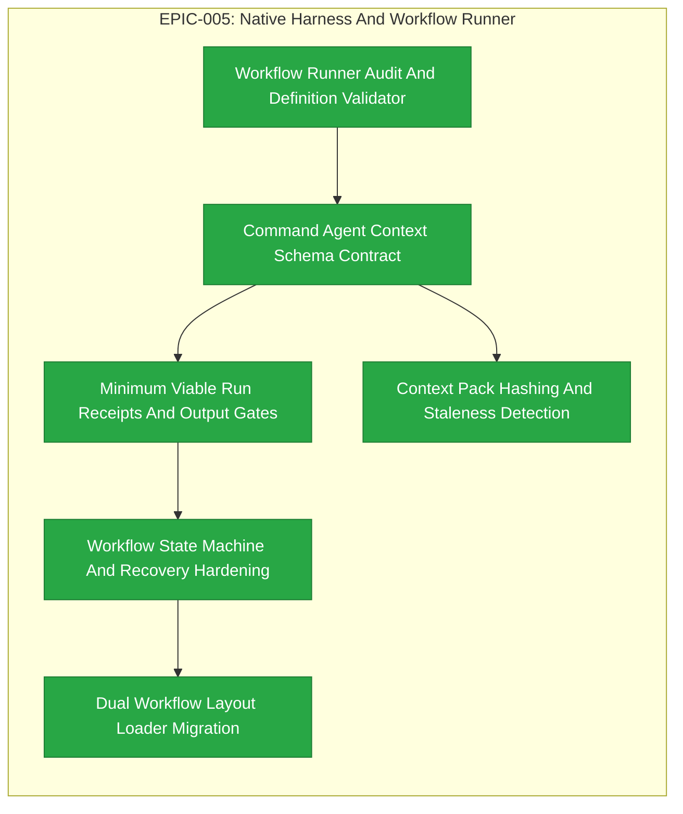

# EPIC-005: Native Harness And Workflow Runner

| Field | Value |
|-------|-------|
| Epic ID | EPIC-005 |
| State | Completed |
| Created | 2026-06-28 |
| Target Completion | TBD - define during planning |
| Owner | Paulo Aboim Pinto |
| Priority | Critical |
| External Reference | docs/architecture/hepha-harness-contract.md; docs/architecture/workflow-definition-runner.md |

## Executive Summary

Turn Hepha into a deterministic harness with versioned workflow files, command templates, agent definitions, context packs, schemas, gates, and run receipts. This epic gives Hepha the reliability layer needed to run repeatable agentic development workflows instead of one-off prompts.

EPIC-005 is an audit-first hardening epic. The existing `.workflows` runner, `.hepha` assets, workflow state tracking, logs, and recovery behavior already satisfy part of the target architecture. Each child FEAT must begin by auditing the current implementation, recording what is already satisfied, and implementing only verified gaps.

## Problem Statement

The old MCP process worked because it behaved like a recipe book, but Hepha must own runtime state and recovery natively. Current workflow logic is partly code-driven and partly documented. To scale safely, Hepha needs a formal workflow runner that loads process definitions, validates outputs, records receipts, and recovers from failure predictably.

The current `.workflows` runner is not throwaway work. FEAT extraction must preserve the implemented runner, harden its contracts, and migrate layout only through tested compatibility. The immediate goal is not to rebuild the runner, but to make the existing runner auditable, schema-backed, receipt-driven, and ready for safer autonomous execution.

## Hepha Deep-Dive Decisions

Recorded: 2026-07-06T12:53:36.659Z

Hepha applied these saved Deep-Dive answers directly because the full-document model rewrite did not finish.
Fallback reason: Source document is 19165 characters; deterministic update is used above 12000 characters.

### Canonical FEAT source

Question: Which EPIC-005 feature list should FEAT extraction treat as canonical, given the duplicated Feature Details and Progress Tracking sections?

Decision: **Use FEAT-020 to FEAT-025 as canonical** - Extract/update exactly the six named FEATs with assigned IDs and use duplicate lower sections only as supporting scope detail.

### Audit-first implementation threshold

Question: What rule should each EPIC-005 child FEAT follow before planning production changes?

Decision: **Require audit and verified gap table** - Each FEAT must record already-satisfied criteria, explicit gaps, and only implement verified missing behavior.

### Dependency source of truth

Question: Which dependency model should extracted FEATs use when the document contains mixed dependency statements?

Decision: **Use dependency flow diagram** - Apply F1→F2→F3→F4→F6 and F2→F5 as the authoritative sequencing for FEAT-020 through FEAT-025.

## Success Criteria

- [x] Workflow definitions are loaded and validated from repository-owned files.
- [x] Existing `.workflows/*.workflow.yaml` behavior is audited before any replacement work is planned.
- [x] Commands, agents, context packs, and schemas follow a consistent `.hepha` contract.
- [ ] Each workflow node has explicit inputs, outputs, gates, model policy, and failure behavior.
- [ ] Run receipts are required before state transitions and include artifacts, selected context, context hashes, command results, gates, status, and next state.
- [ ] Recovery behavior is explicit, auditable, and tested.
- [ ] Context-pack freshness and staleness checks are available where workflow outputs depend on selected files.
- [x] `.hepha/workflows/` is supported through dual-load compatibility and parity tests before `.workflows/` references are removed.
- [x] Each extracted FEAT records already-satisfied criteria and implements only verified gaps.

## Implementation Audit (2026-07-01)

**Audit status:** Major implementation already exists. Treat this EPIC as an implementation audit, contract-hardening, and migration-planning effort, with formal new implementation reserved for missing receipts, schema enforcement, hashing, and `.hepha/workflows` migration gaps.

**Observed implementation:**
- Workflow definitions are loaded from committed `.workflows/*.workflow.yaml` files and validated for node IDs, dependencies, prompt assets, context packs, and schema references.
- `.hepha` command templates, agent files, context packs, and schemas are present and are used by deep-dive, design, refine, start, continue, and complete workflows.
- The orchestrator has reusable workflow runners that record current node, current step, run ID, status, and workflow progress into SQLite-backed card metadata.
- Failure recovery, code-review rerun behavior, workflow console logs, prompt logs, and Pi stream summaries are already implemented for core lifecycle commands.

**Remaining audit/gap work:**
- Verify that each workflow node has explicit inputs, outputs, gates, model policy, failure behavior, and test coverage.
- ✅ FEAT-022 completed: Run receipts are formalized with minimum viable receipt fields (artifacts, selected context, context hashes, command results, gates, status, next state) and transition gates enforce receipt validation.
- Add context-pack hashing/staleness detection where missing.
- ✅ FEAT-025 completed: Add `.hepha/workflows/` loading while preserving `.workflows/` compatibility.
- ✅ FEAT-025 completed: Add parity tests proving `.workflows/` and `.hepha/workflows/` definitions resolve consistently before any references are migrated.

## Features Breakdown

| Feature ID | Title | Status | Dependencies | Priority |
|------------|-------|--------|--------------|----------|
| FEAT-020 | Workflow Runner Audit And Definition Validator | COMPLETED |  |  |
| FEAT-021 | Command Agent Context Schema Contract | COMPLETED | FEAT-020 |  |
| FEAT-022 | Minimum Viable Run Receipts And Output Gates | COMPLETED | FEAT-021 |  |
| FEAT-023 | Workflow State Machine And Recovery Hardening | COMPLETED | FEAT-022 |  |
| FEAT-024 | Context Pack Hashing And Staleness Detection | COMPLETED | FEAT-021 |  |
| FEAT-025 | Dual Workflow Layout Loader Migration | COMPLETED | FEAT-023 |  |

> Feature IDs are assigned when created via the future `create-epic-features` workflow. Each extracted FEAT must start with an implementation audit phase and must not rebuild already-working runner behavior without evidence of a gap.

## Epic Progress

**State:** Completed
**Progress:** 100% (6/6 features complete)

| Status | Count | Features |
|--------|-------|----------|
| Completed | 6 | FEAT-020 (Workflow Runner Audit); FEAT-021 (Command Agent Context Schema Contract); FEAT-022 (Minimum Viable Run Receipts And Output Gates); FEAT-023 (Workflow State Machine And Recovery Hardening); FEAT-024 (Context Pack Hashing And Staleness Detection); FEAT-025 (Dual Workflow Layout Loader Migration) |
| Ready | 0 | - |
| Submitted | 0 | - |

## Dependency Flow Diagram

## Feature Details

### Feature 1: Workflow Runner Audit And Definition Validator (FEAT-020)

**User Story:** Audit the existing .workflows/*.workflow.yaml loader and validator. Record which validation rules are already implemented, then fill only verified gaps such as duplicate/conflicting definitions and missing required fields. Expose workflow shape to the orchestrator and dashboard. Harden or add tests around existing behavior.

**Scope:** Generated from EPIC EPIC-005 - Native Harness And Workflow Runner.
**Backlink:** - EPIC: EPIC-005 - Native Harness And Workflow Runner
**Dependencies:** None

### Feature 2: Command Agent Context Schema Contract (FEAT-021)

**User Story:** Audit existing .hepha command templates, agent definitions, context packs, and schemas used by lifecycle workflows. Record which workflow nodes already reference valid assets. Implement missing contract checks and reference validation. Add tests for missing, invalid, or incompatible assets, and make contract errors actionable for workflow authors.

**Scope:** Generated from EPIC EPIC-005 - Native Harness And Workflow Runner.
**Backlink:** - EPIC: EPIC-005 - Native Harness And Workflow Runner
**Dependencies:** None

### Feature 3: Minimum Viable Run Receipts And Output Gates (FEAT-022)

**User Story:** Audit current SQLite workflow metadata, prompt logs, console logs, Pi stream summaries, and generated artifacts. Record what receipt-like evidence already exists. Implement the minimum viable auditable receipt fields (artifacts, selected context, context hashes, command results, gates, status, next state) and prevent state transitions when required fields are missing or invalid.

**Scope:** Generated from EPIC EPIC-005 - Native Harness And Workflow Runner.
**Backlink:** - EPIC: EPIC-005 - Native Harness And Workflow Runner
**Dependencies:** None

### Feature 4: Workflow State Machine And Recovery Hardening (FEAT-023)

**User Story:** Audit existing workflow run state, current-node tracking, current-step tracking, cancel behavior, recovery behavior, and code-review rerun handling. Record which recovery scenarios are already deterministic. Implement missing state-machine guards and recovery tests for retry, block, fail, cancel, resume, and recovery. Use run receipts as precondition for transitions.

**Scope:** Generated from EPIC EPIC-005 - Native Harness And Workflow Runner.
**Backlink:** - EPIC: EPIC-005 - Native Harness And Workflow Runner
**Dependencies:** None

### Feature 5: Context Pack Hashing And Staleness Detection (FEAT-024)

**User Story:** Audit existing context-pack selection and prompt assembly. Record whether selected context is already persisted in logs or metadata. Add hashing of selected context files. Record context pack IDs and file hashes in run receipts. Detect stale context before continuing workflows that depend on previous context. Add tests for changed, missing, and unchanged files.

**Scope:** Generated from EPIC EPIC-005 - Native Harness And Workflow Runner.
**Backlink:** - EPIC: EPIC-005 - Native Harness And Workflow Runner
**Dependencies:** None

### Feature 6: Dual Workflow Layout Loader Migration (FEAT-025)

**User Story:** Audit every existing .workflows/ reference in commands, tests, docs, API routes, and orchestrator code. Keep .workflows/ compatibility while adding dual-load support for .hepha/workflows/. Prove parity through tests before migrating canonical references. Update docs and references only after compatibility is verified.

**Scope:** Generated from EPIC EPIC-005 - Native Harness And Workflow Runner.
**Backlink:** - EPIC: EPIC-005 - Native Harness And Workflow Runner
**Dependencies:** None

### Feature 1: Workflow Runner Audit And Definition Validator

**User Story:** As a Hepha maintainer, I want workflow files loaded and validated so that process changes are explicit and testable.

**Audit-first focus:**
- Audit the existing `.workflows/*.workflow.yaml` loader and validator.
- Record which validation rules are already implemented.
- Identify only missing validation rules and dashboard/orchestrator exposure gaps.

**Scope:**
- Parse workflow YAML.
- Validate node IDs, dependencies, required fields, prompt assets, context packs, schema references, and duplicate/conflicting definitions.
- Expose workflow shape to orchestrator and dashboard.
- Add or harden tests around existing behavior instead of replacing the runner.

**Dependencies:** EPIC-004 FEAT Planning Lifecycle

### Feature 2: Command Agent Context Schema Contract

**User Story:** As a workflow author, I want commands, agents, context packs, and schemas to follow a consistent contract so that every agent run is bounded.

**Audit-first focus:**
- Audit the existing `.hepha` command templates, agent definitions, context packs, and schemas used by lifecycle workflows.
- Record which workflow nodes already reference valid assets.
- Implement only missing contract checks and reference validation.

**Scope:**
- Define and enforce file contracts for commands, agents, context packs, schemas, and workflow-node references.
- Validate references between workflow nodes and `.hepha` assets.
- Add tests for missing, invalid, or incompatible assets.
- Make contract errors actionable for workflow authors.

**Dependencies:** Workflow Runner Audit And Definition Validator

### Feature 3: Minimum Viable Run Receipts And Output Gates

**User Story:** As a Hepha user, I want worker outputs validated and recorded before state moves so that malformed or unauditable agent results cannot corrupt the workflow.

**Audit-first focus:**
- Audit current SQLite workflow metadata, prompt logs, console logs, Pi stream summaries, and generated artifacts.
- Record what receipt-like evidence already exists.
- Implement the missing minimum viable auditable receipt fields.

**Scope:**
- Validate JSON and artifact outputs before workflow state transitions.
- Record generated and changed files.
- Attach run receipts to workflow history.
- Require receipts to include artifacts, selected context, context hashes, command results, gates, status, and next state.
- Prevent state transitions when required receipt fields are missing or invalid.
- Keep receipt storage compatible with existing workflow logs and card metadata.

**Dependencies:** Command Agent Context Schema Contract

### Feature 4: Workflow State Machine And Recovery Hardening

**User Story:** As a Hepha user, I want workflows to resume or fail predictably so that interrupted runs do not lose progress.

**Audit-first focus:**
- Audit existing workflow run state, current-node tracking, current-step tracking, cancel behavior, recovery behavior, and code-review rerun handling.
- Record which recovery scenarios are already deterministic.
- Implement missing state-machine guards and recovery tests.

**Scope:**
- Store workflow run and node state.
- Support retry, block, fail, cancel, resume, and recovery states.
- Prevent duplicate unsafe runs.
- Use run receipts as the precondition for state transitions.
- Make failed and blocked states visible in dashboard workflow history.
- Add tests for interruption, retry, duplicate-run prevention, and recovery paths.

**Dependencies:** Minimum Viable Run Receipts And Output Gates

### Feature 5: Context Pack Hashing And Staleness Detection

**User Story:** As a Hepha user, I want context freshness tracked so that agent outputs can be trusted against the files they used.

**Audit-first focus:**
- Audit existing context-pack selection and prompt assembly.
- Record whether selected context is already persisted in logs or workflow metadata.
- Add hashing only where selected context is used for decisions or artifact generation.

**Scope:**
- Hash selected context files.
- Record context pack IDs and file hashes in run receipts.
- Detect stale deep-dive, design, refinement, implementation, and review context.
- Surface stale-context warnings before continuing workflows that depend on previous context.
- Add tests for changed files, missing files, and unchanged context.

**Dependencies:** Command Agent Context Schema Contract

### Feature 6: Dual Workflow Layout Loader Migration

**User Story:** As a Hepha maintainer, I want workflow definitions to live under `.hepha` so that all harness assets are grouped and versioned consistently.

**Audit-first focus:**
- Audit every existing `.workflows/` reference in commands, tests, docs, API routes, and orchestrator code.
- Preserve existing command execution while adding `.hepha/workflows/` support.
- Prove parity before changing canonical references.

**Scope:**
- Keep compatibility with `.workflows/` during migration.
- Add dual-load support for `.hepha/workflows/`.
- Move or mirror workflow files under `.hepha/workflows/` only after parity tests pass.
- Add tests proving equivalent workflow resolution from both locations.
- Update docs and references after compatibility is verified.

**Dependencies:** Workflow State Machine And Recovery Hardening

## Out of Scope

- Pi package publishing.
- Second-brain knowledge vault.
- Cloud workflow execution.
- Replacing MemoryBank Markdown as the human-readable source.
- Rebuilding the existing `.workflows` runner from scratch without an audited gap.

## Risks and Mitigations

| Risk | Impact | Likelihood | Mitigation |
|------|--------|------------|------------|
| Workflow definitions become too abstract to debug | High | Medium | Keep node operations explicit and expose rendered steps in the dashboard. |
| Schema validation blocks useful partial progress | Medium | Medium | Separate recoverable validation errors from hard failures. |
| Migration breaks existing commands | High | Low | Support old and new workflow locations until all references are updated and parity tests pass. |
| Receipt requirements add friction before the schema is stable | Medium | Medium | Start with the minimum viable auditable receipt and expand only after core transitions are reliable. |
| Audit-first FEATs duplicate already completed work | Medium | Medium | Require every FEAT to record already-satisfied criteria before implementation tasks are created. |

## Progress Tracking

| Feature ID | Status | Started | Completed | Notes |
|------------|--------|---------|-----------|-------|
| TBD | SUBMITTED | - | - | Audit existing `.workflows` loader and harden definition validation |
| TBD | SUBMITTED | - | - | Audit and enforce command, agent, context-pack, and schema contracts |
| TBD | SUBMITTED | - | - | Implement minimum viable auditable receipts and output gates |
| TBD | SUBMITTED | - | - | Harden state machine, recovery, retry, block, fail, cancel, and resume behavior |
| TBD | SUBMITTED | - | - | Add selected-context hashing and staleness detection |
| TBD | SUBMITTED | - | - | Add dual-load `.workflows` and `.hepha/workflows` support with parity tests |
| FEAT-020 | COMPLETED | 2026-07-06 | 2026-07-06 | |
| FEAT-021 | COMPLETED | 2026-07-06 | 2026-07-06 | |
| FEAT-022 | COMPLETED | 2026-07-06 | 2026-07-07 | |
| FEAT-023 | COMPLETED | 2026-07-06 | 2026-07-07 | |
| FEAT-024 | COMPLETED | 2026-07-06 | 2026-07-07 |
| FEAT-025 | COMPLETED | 2026-07-06 | 2026-07-08 | |

**Overall Progress:** 6/6 features complete (100%)

## Next Steps

1. Extract audit-first FEATs from this epic.
2. Start with Workflow Runner Audit And Definition Validator to establish the validated baseline.
3. Implement the minimum viable auditable receipt contract before expanding autonomous state transitions.
4. Add `.hepha/workflows/` dual-load support only after the existing `.workflows` behavior is covered by tests.
