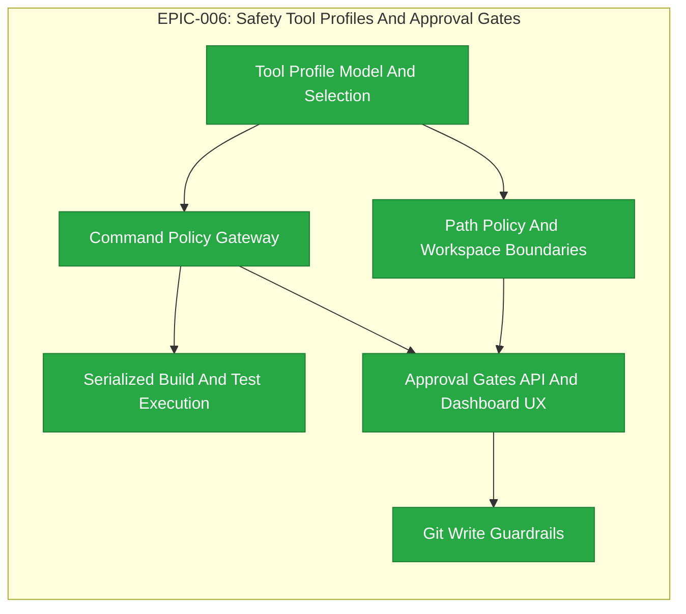

# EPIC-006: Safety Tool Profiles And Approval Gates

| Field | Value |
|-------|-------|
| Epic ID | EPIC-006 |
| State | Completed |
| Created | 2026-06-28 |
| Target Completion | TBD - define during planning |
| Owner | Paulo Aboim Pinto |
| Priority | Critical |
| External Reference | docs/architecture/hepha-harness-contract.md; docs/research/hepha-ai-development-video-lessons.md |

## Executive Summary

Define and enforce the runtime safety layer for Hepha's agentic workflows. This epic covers named tool profiles, workspace path policy, command policy, approval gates, serialized build/test execution, and git write guardrails.

The first enforceable safety seam is the Hepha orchestrator policy gateway. Tool, path, and command decisions are made before workers execute actions, and each decision is recorded in workflow history and run receipts.

## Problem Statement

Increasing autonomy without safety contracts would make Hepha unpredictable. Agents need clear tool boundaries, command execution rules, project path limits, and approval gates before they can run implementation and recovery loops safely. Without this epic, the platform risks destructive writes, unsafe shell behavior, stale build evidence, and accidental remote actions.

Normal implementation phases should not need destructive actions because project code is under GitHub and can usually be reverted. Even so, Hepha must explicitly gate irreversible and privileged actions so automation remains auditable and under human control.

## Hepha Deep-Dive Decisions

Recorded: 2026-07-08T07:47:08.662Z

Hepha applied these saved Deep-Dive answers directly because the full-document model rewrite did not finish.
Fallback reason: Source document is 17869 characters; deterministic update is used above 12000 characters.

### Canonical FEAT source

Question: Which EPIC section should be treated as canonical for FEAT extraction, given the duplicate feature detail blocks and mixed TBD/FEAT-026 IDs?

Decision: **Use FEAT-026..031 as canonical** - Extract exactly the six listed FEAT IDs and treat duplicate narrative blocks as supporting detail only.

### Dependency graph

Question: How should the inconsistent dependency fields be handled during extraction?

Decision: **Apply Mermaid dependency flow** - Use the diagram and extraction notes as the source of truth: FEAT-026 before FEAT-027/028, FEAT-028 before FEAT-029, FEAT-027/028 before FEAT-030, FEAT-030 before FEAT-031.

### Safety MVP boundary

Question: What enforcement boundary should the extracted FEATs preserve as the EPIC MVP contract?

Decision: **Gateway-first with narrow approvals** - Implement the orchestrator policy gateway first, record tool/path/command decisions in receipts, and require approval only for irreversible, privileged, remote-write, and PR actions.

## Success Criteria

- [x] Hepha defines named tool profiles for discovery, documentation, tests, source edits, git writes, and privileged actions.
- [x] Workflow nodes and agent roles select an explicit tool profile before worker execution.
- [x] Path policies prevent writes outside approved project, worktree, and MemoryBank boundaries. (Completed: FEAT-027)
- [x] Command policies serialize build/test commands and block dangerous operations by default. (Completed: FEAT-028)
- [x] Approval gates are required for remote writes, destructive filesystem commands, privileged commands, and PR actions. (Completed: FEAT-030)
- [x] Policy-approved local edits and tests can run without manual approval. (Completed: FEAT-030)
- [x] Git branch, commit, push, and PR actions have explicit workflow state and user approval rules. (Completed: FEAT-031)
- [x] Safety decisions are recorded in workflow history and run receipts.

## Implementation Audit (2026-07-01)

**Audit status:** Only a narrow safety slice is implemented. Treat most of this
EPIC as formal new implementation, while preserving and extending the existing
command-safety work.

**Observed implementation:**
- Cargo command serialization is partially enforced through prompt rules, the
  serialized-build-commands Pi skill, `countCargoInvocations`, and Pi event
  safety checks for implementation-profile runs.
- Implementation and recovery prompts include project LessonsLearned execution
  constraints, Cargo validation ladder guidance, timeout handling rules, and
  local dev-server restrictions.
- The orchestrator can cancel active workflow Pi processes by run ID.

**Remaining formal implementation:**
- ✅ COMPLETED: Define named tool profiles and select them per workflow node/agent role.
- Implement path policy and workspace boundary enforcement for source,
  MemoryBank, worktree, and sibling-project writes.
- Build a general orchestrator command policy gateway beyond Cargo-specific checks.
- ✅ COMPLETED: Add approval records, dashboard approval UX, and resumable approval decisions
  for privileged/destructive actions.
- [x] COMPLETED: Add git branch, commit, push, and PR guardrails with explicit state and
  receipts. Existing prompts mention git behavior, but that is not the same as
  an enforced approval-gated safety layer.

## Features Breakdown

| Feature ID | Title | Status | Dependencies | Priority |
|------------|-------|--------|--------------|----------|
| FEAT-026 | Tool Profile Model And Selection | COMPLETED |  |  |
| FEAT-027 | Path Policy And Workspace Boundaries | COMPLETED | Tool Profile Model And Selection |  |
| FEAT-028 | Command Policy Gateway | COMPLETED |  |  |
| FEAT-029 | Serialized Build And Test Execution | COMPLETED |  |  |
| FEAT-030 | Approval Gates API And Dashboard UX | COMPLETED |  |  |
| FEAT-031 | Git Write Guardrails | COMPLETED |  |  |

> Feature IDs are assigned when created via the future `create-epic-features` workflow.

## Epic Progress

**State:** Completed
**Progress:** 100% (6/6 features complete)

| Status | Count | Features |
|--------|-------|----------|
| Completed | 6 | FEAT-026 (Tool Profile Model And Selection); FEAT-027 (Path Policy And Workspace Boundaries); FEAT-028 (Command Policy Gateway); FEAT-029 (Serialized Build And Test Execution); FEAT-030 (Approval Gates API And Dashboard UX); FEAT-031 (Git Write Guardrails) |
| In Progress | 0 | - |
| Ready | 0 | - |
| Submitted | 0 | - |

## Dependency Flow Diagram

## Feature Details

### Feature 1: Tool Profile Model And Selection (FEAT-026)

**User Story:** Define named profile categories for discovery, documentation, tests, source edits, git writes, and privileged actions. Define the capability model used by profiles. Select profile by workflow node and agent role. Pass selected profile into worker context before execution. Record selected profile in run receipts. Dependencies: EPIC-005 Command Agent Context Schema Contract.

**Scope:** Generated from EPIC EPIC-006 - Safety Tool Profiles And Approval Gates.
**Backlink:** - EPIC: EPIC-006 - Safety Tool Profiles And Approval Gates
**Dependencies:** None

### Feature 2: Path Policy And Workspace Boundaries (FEAT-027)

**User Story:** Define read/write path allowlists by tool profile. Validate project root, MemoryBank, worktree, and sibling-project boundaries. Block writes outside approved boundaries before worker execution. Surface blocked path attempts in workflow history and receipts. Support project-specific path rules without hardcoding machine-specific absolute paths. Dependencies: Tool Profile Model And Selection.

**Scope:** Generated from EPIC EPIC-006 - Safety Tool Profiles And Approval Gates.
**Backlink:** - EPIC: EPIC-006 - Safety Tool Profiles And Approval Gates
**Dependencies:** None

### Feature 3: Command Policy Gateway (FEAT-028)

**User Story:** Implement an orchestrator policy gateway as the first enforceable safety decision point. Classify commands as allowed, approval-required, or blocked. Block dangerous shell patterns by default. Allow project-specific verification commands through policy. Attach policy decisions to workflow history and run receipts before worker execution. Dependencies: Tool Profile Model And Selection.

**Scope:** Generated from EPIC EPIC-006 - Safety Tool Profiles And Approval Gates.
**Backlink:** - EPIC: EPIC-006 - Safety Tool Profiles And Approval Gates
**Dependencies:** None

### Feature 4: Serialized Build And Test Execution (FEAT-029)

**User Story:** Enforce one shared-state build/test command at a time. Apply project lessons for Cargo and similar tools. Detect and prevent concurrent commands that share cache, lock, build, or package-manager state. Record command result evidence in workflow history and receipts. Preserve and extend existing Cargo-specific serialization work into the general command policy system. Dependencies: Command Policy Gateway.

**Scope:** Generated from EPIC EPIC-006 - Safety Tool Profiles And Approval Gates.
**Backlink:** - EPIC: EPIC-006 - Safety Tool Profiles And Approval Gates
**Dependencies:** None

### Feature 5: Approval Gates API And Dashboard UX (FEAT-030)

**User Story:** Create approval request records for approval-required policy decisions. Show pending approvals in the dashboard. Support approve, deny, and timeout/fail decisions. Resume or fail workflow based on the approval decision. Require approval for remote writes, destructive filesystem commands, privileged commands, and PR actions. Allow policy-approved local edits and tests without approval. Dependencies: Path Policy And Workspace Boundaries; Command Policy Gateway.

**Scope:** Generated from EPIC EPIC-006 - Safety Tool Profiles And Approval Gates.
**Backlink:** - EPIC: EPIC-006 - Safety Tool Profiles And Approval Gates
**Dependencies:** None

### Feature 6: Git Write Guardrails (FEAT-031) ✅ COMPLETED

**User Story:** Gate branch changes, commits, pushes, and PR creation through workflow state and approval policy. Require approval for remote writes and PR actions. Show dirty state and pending remote actions. Record git decisions in receipts. Keep local repository inspection and policy-approved local status checks available without approval. Dependencies: Approval Gates API And Dashboard UX.

**Scope:** Generated from EPIC EPIC-006 - Safety Tool Profiles And Approval Gates.
**Backlink:** - EPIC: EPIC-006 - Safety Tool Profiles And Approval Gates
**Dependencies:** None

**Status:** COMPLETED (2026-07-08). See MemoryBank/Features/04_COMPLETED/FEAT-031-git-write-guardrails/completion-report.md for full details.

### Feature 1: Tool Profile Model And Selection (FEAT-026) ✅ COMPLETED

**User Story:** As a Hepha orchestrator, I want each workflow node to declare a tool profile so that workers only receive the authority they need.

**Scope:**
- Define named profile categories for discovery, documentation, tests, source edits, git writes, and privileged actions.
- Define the capability model used by profiles.
- Select profile by workflow node and agent role.
- Pass selected profile into worker context before execution.
- Record selected profile in run receipts.

**Dependencies:** EPIC-005 Command Agent Context Schema Contract

**Extraction Notes:** Create this as the first FEAT. It establishes the profile model consumed by path and command policy.

**Status:** COMPLETED (2026-07-08). See MemoryBank/Features/04_COMPLETED/FEAT-026-tool-profile-model-and-selection/completion-report.md for full details.

### Feature 2: Path Policy And Workspace Boundaries

**User Story:** As a Hepha user, I want agents blocked from writing outside approved paths so that local files and sibling projects stay safe.

**Scope:**
- Define read/write path allowlists by tool profile.
- Validate project root, MemoryBank, worktree, and sibling-project boundaries.
- Block writes outside approved boundaries before worker execution.
- Surface blocked path attempts in workflow history and receipts.
- Support project-specific path rules without hardcoding machine-specific absolute paths.

**Dependencies:** Tool Profile Model And Selection

**Extraction Notes:** Create this after tool profiles. It depends on profile capabilities and is required before approval UX can safely expose blocked or approval-required file actions.

### Feature 3: Command Policy Gateway

**User Story:** As a Hepha user, I want commands to run through policy so that dangerous shell patterns are blocked and project rules are enforced.

**Scope:**
- Implement an orchestrator policy gateway as the first enforceable safety decision point.
- Classify commands as allowed, approval-required, or blocked.
- Block dangerous shell patterns by default.
- Allow project-specific verification commands through policy.
- Attach policy decisions to workflow history and run receipts before worker execution.

**Dependencies:** Tool Profile Model And Selection

**Extraction Notes:** Create this after tool profiles and in parallel dependency order with path policy. This feature is the central enforcement seam for command decisions.

### Feature 4: Serialized Build And Test Execution

**User Story:** As a developer, I want build and test commands serialized when they share state so that evidence is reliable and locks are respected.

**Scope:**
- Enforce one shared-state build/test command at a time.
- Apply project lessons for Cargo and similar tools.
- Detect and prevent concurrent commands that share cache, lock, build, or package-manager state.
- Record command result evidence in workflow history and receipts.
- Preserve and extend the existing Cargo-specific serialization work into the general command policy system.

**Dependencies:** Command Policy Gateway

**Extraction Notes:** Create this after the command gateway. It formalizes the existing narrow Cargo safety slice into the general policy layer.

### Feature 5: Approval Gates API And Dashboard UX ✅ COMPLETED

**User Story:** As a Hepha user, I want privileged actions to request approval through the dashboard so that automation remains under human control.

**Scope:**
- Create approval request records for approval-required policy decisions.
- Show pending approvals in the dashboard.
- Support approve, deny, and timeout/fail decisions.
- Resume or fail workflow based on the approval decision.
- Require approval for remote writes, destructive filesystem commands, privileged commands, and PR actions.
- Allow policy-approved local edits and tests without approval.

**Dependencies:** Path Policy And Workspace Boundaries; Command Policy Gateway

**Extraction Notes:** Create this after path and command policy exist. The approval UX should consume policy decisions rather than duplicate command/path classification logic.

**Status:** COMPLETED (2026-07-08). See MemoryBank/Features/04_COMPLETED/FEAT-030-approval-gates-api-and-dashboard-ux/completion-report.md for full details.

### Feature 6: Git Write Guardrails ✅ COMPLETED

**User Story:** As a Hepha user, I want git writes controlled by workflow state so that commits, pushes, and PRs happen intentionally.

**Scope:**
- Gate branch changes, commits, pushes, and PR creation through workflow state and approval policy.
- Require approval for remote writes and PR actions.
- Show dirty state and pending remote actions.
- Record git decisions in receipts.
- Keep local repository inspection and policy-approved local status checks available without approval.

**Dependencies:** Approval Gates API And Dashboard UX

**Extraction Notes:** Create this last. It depends on approval records and dashboard decisions because git writes are intentional workflow transitions, not background automation side effects.

**Status:** COMPLETED (2026-07-08). See MemoryBank/Features/04_COMPLETED/FEAT-031-git-write-guardrails/completion-report.md for full details.

## Out of Scope

- Enterprise permission management.
- Sandbox virtualization.
- Cloud secrets management.
- Automatic production deployment.
- Full operating-system isolation.
- Replacing GitHub or git history as the rollback mechanism.

## Risks and Mitigations

| Risk | Impact | Likelihood | Mitigation |
|------|--------|------------|------------|
| Safety rules block legitimate work too often | Medium | Medium | Provide explicit approval paths and profile overrides with audit logs. Allow policy-approved local edits and tests without approval. |
| Command classification misses dangerous variants | High | Medium | Start conservative and add tests for known unsafe patterns. Record policy decisions for review. |
| Agents bypass policy by using raw tools | High | Medium | Route execution through the orchestrator policy gateway before worker execution, tool profiles, and extensions where available. |
| Approval flow interrupts normal implementation too frequently | Medium | Medium | Limit MVP approvals to irreversible and privileged actions: remote writes, destructive filesystem commands, privileged commands, and PR actions. |
| Git guardrails are treated as prompts instead of enforcement | High | Medium | Implement explicit workflow state, approval records, and receipts for branch, commit, push, and PR actions. |

## Progress Tracking

| Feature ID | Status | Started | Completed | Notes |
|------------|--------|---------|-----------|-------|
| FEAT-026 | COMPLETED | 2026-07-08 | 2026-07-08 | Tool profile model and workflow-node profile selection |
| FEAT-026 | COMPLETED | 2026-07-08 | 2026-07-08 | |
| FEAT-027 | COMPLETED | 2026-07-08 | 2026-07-08 | Path policy schema, evaluator, guardWriteOperation, integration tests, 142 new tests. |
| FEAT-028 | COMPLETED | 2026-07-08 | 2026-07-08 | Command policy gateway schema, evaluator, guard wrapper, receipt integration, 115 new tests. |
| FEAT-029 | COMPLETED | 2026-07-08 | 2026-07-08 | Pure serialization evaluator, conflict detection, 105 tests, E2E integration. |
| FEAT-030 | COMPLETED | 2026-07-08 | 2026-07-08 | Pure approval resolver, API/dashboard UX, 23 integration + 9 E2E tests, additive receipt evidence. |
| FEAT-031 | COMPLETED | 2026-07-08 | 2026-07-08 | Git action classifier, state guard, guard adapter, dirty-state API, dashboard component, additive receipt evidence, 127 new tests. |

**Overall Progress:** 6/6 features complete (100%)

## Next Steps

1. ✅ COMPLETED: Tool Profile Model And Selection (FEAT-026)
2. ✅ COMPLETED: Path Policy And Workspace Boundaries (FEAT-027)
3. ✅ COMPLETED: Command Policy Gateway (FEAT-028)
4. ✅ COMPLETED: Serialized Build And Test Execution (FEAT-029)
5. ✅ COMPLETED: Approval Gates API And Dashboard UX (FEAT-030)
6. ✅ COMPLETED: Git Write Guardrails (FEAT-031)
