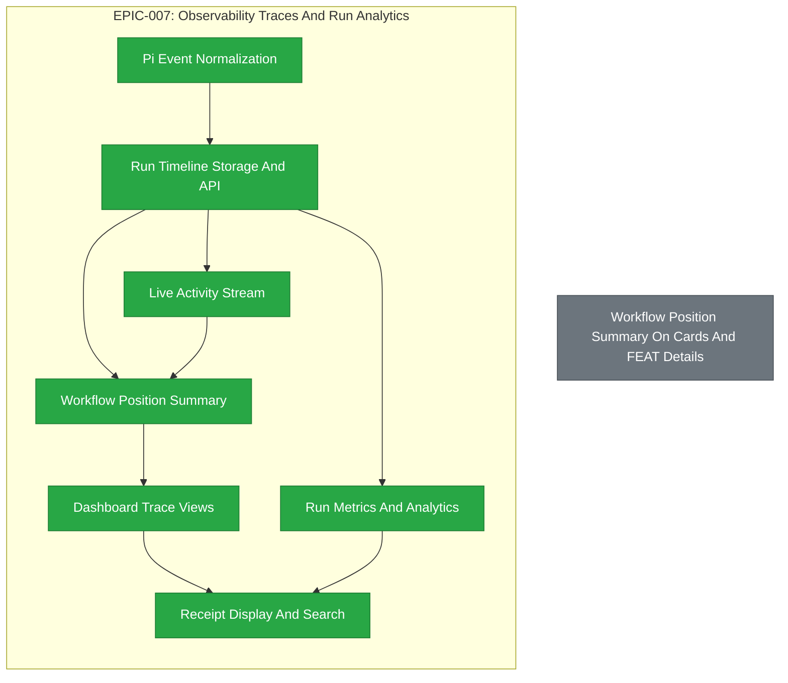

# EPIC-007: Observability Traces And Run Analytics

| Field | Value |
|-------|-------|
| Epic ID | EPIC-007 |
| State | Completed |
| Created | 2026-06-28 |
| Target Completion | TBD - define during planning |
| Owner | Paulo Aboim Pinto |
| Priority | High |
| External Reference | docs/architecture/system-architecture.md; docs/product/dashboard-definition.md |

## Executive Summary

Make every agent run observable, auditable, and measurable. This epic covers Pi event normalization, persistent run timelines, phase/workflow event propagation hooks, live activity streams, workflow-position summaries on cards and detail panels, trace views, analytics, and receipt visibility.

## Problem Statement

Agentic systems cannot be trusted when the user cannot see what ran, which model was used, what tools were called, what files changed, and why the workflow moved. Hepha needs observability as product infrastructure, not as debug logs after the fact. Without this epic, failures will be hard to diagnose and review capacity will become the bottleneck.

A current UX gap is that a FEAT card can keep showing a stale command label such as `STARTING AUTONOMOUS IMPLEMENTATION LOOP` even after the workflow has moved into the running implementation loop and a specific phase such as Phase 3. The FEAT detail panel also does not provide an immediate pinned summary of the current phase/workflow position; the user must scroll down to phase sections to understand where the run stands.

A related alignment gap appears after autonomous implementation completes all phase documents but supporting ledgers lag behind. For example, a card can show `Phase 0: Health Check` because `FeatureTasks.md` still has a stale phase inventory row while every phase file is already `COMPLETED`. The same card can show quality gaps and `deep-dive stale` without explaining that these are post-implementation quality gates or without distinguishing real requirement/scope changes from workflow metadata changes such as status updates, commit notes, receipts, or completion evidence.

The root product capability needed here is a reliable workflow event projection path: when a phase changes state, completes, is skipped, fails, or opens post-implementation quality gates, the workflow runner must emit a durable event and the dashboard card/detail projection must update from that event without waiting for a manual rescan or stale ledger parsing.

## Success Criteria

- [ ] Pi worker events are normalized into a stable Hepha event envelope.
- [ ] Every workflow run has a queryable timeline with model, context, tool, command, and error events.
- [ ] Every Pi agent launch records command text, workflow node, phase, agent role, model, started timestamp, ended timestamp, duration, exit status, and output/receipt references.
- [ ] A phase can show every agent invocation it launched, including repeated code-review, recovery, and verification agents with their own model and duration.
- [ ] Dashboard live activity updates without polling as the primary mechanism.
- [ ] Phase lifecycle hooks emit durable events for phase started, completed, skipped, blocked, failed, quality-gate-opened, and quality-gate-resolved transitions.
- [ ] FEAT card/detail projections update from phase/workflow events immediately and remain reconstructable from durable state after refresh or orchestrator restart.
- [ ] FEAT cards show the current workflow command, execution state, active phase number/title, and next expected step as separate concepts instead of relying on a stale command label.
- [ ] FEAT cards and detail panels resolve phase position from a defined source-of-truth precedence so stale planning ledgers cannot override newer phase document statuses.
- [ ] FEAT detail panels show a pinned workflow-position synopsis near the top, including current phase, current workflow node, running/blocked/failed/done state, elapsed time, quality-gate state, and links to the active log/receipt when available.
- [ ] Deep-Dive freshness distinguishes content-affecting requirement/scope changes from workflow lifecycle metadata changes such as state transitions, commit notes, receipts, run history, or quality-evidence bookkeeping.
- [ ] Card detail panels can open trace views for recent runs.
- [x] Run metrics expose duration, retries, findings, command results, and model usage.
- [ ] Receipts are searchable and linked to EPICs, FEATs, phases, and workflow nodes.
- [ ] Gherkin E2E integration tests and unit tests cover workflow-position display, stale-label prevention, semantic Deep-Dive freshness, phase source-of-truth precedence, refresh/reconnect behavior, and fallback states.

## Testing and Acceptance Requirements

This epic must be verified with production-like workflow fixtures instead of only component snapshots.

- Add Gherkin feature files for the dashboard journeys, including:
  - active autonomous implementation has moved from `start-implementing` setup into a numbered implementation phase;
  - the card shows `Running` plus the active phase instead of `Starting autonomous implementation loop` as the primary status;
  - the FEAT detail header shows the same workflow-position synopsis without scrolling to the phase list;
  - refresh/reconnect preserves the workflow-position summary from durable state;
  - a phase completion hook fires, persists a `phase.completed` event, and the card updates to the next phase or post-implementation state without manual rescan;
  - all phase files are complete while `FeatureTasks.md` still contains a stale `PENDING` row, and the card/detail summary still reports all phases complete or the correct post-implementation quality-gate state;
  - Deep-Dive freshness remains current when only lifecycle metadata changes, including FEAT state, workflow history, receipt links, commit notes, phase status bookkeeping, or quality-gate evidence, while still becoming stale for requirement, scope, acceptance, dependency, or user-story content changes;
  - failed, blocked, waiting-for-approval, and completed runs show clear fallback states.
- Add E2E integration tests that drive the real dashboard against MemoryBank/run fixtures and assert visible card/detail text, not only internal state.
- Add unit tests for workflow-position selectors, state reducers, metadata parsers, semantic source-hash/canonicalization helpers, and label formatters so command label, execution state, workflow node, active phase, quality-gate state, and Deep-Dive freshness cannot be conflated again.
- Add API/store tests for run timeline and card metadata payloads used by the dashboard summary.
- Add event-projection tests proving phase events update card summaries and can be replayed/reconstructed after process restart.

## Implementation Audit (2026-07-01)

**Audit status:** Partial/prototype observability exists. This EPIC is not an
audit-only effort. Treat it as an audit of current live feedback and console
behavior plus formal new implementation for missing observability capabilities:
durable normalized timelines, phase lifecycle event hooks, event-to-card
projection, workflow-position summaries, semantic Deep-Dive freshness,
analytics, receipt search, and trace indexing.

**Observed implementation:**
- Workflow progress is recorded in SQLite card metadata and surfaced on
  dashboard cards, workflow history, and step trackers.
- Project-level SSE exists for MemoryBank/workflow change notifications.
- Pi JSONL output and stream logs are rendered into workflow console files,
  exposed through `/api/workflow-console/:runId`, and displayed in the
  dashboard.
- The dashboard already shows recent workflow history, active agent logs,
  phase timing, findings, and project-level runtime statistics.

**Remaining formal implementation:**
- Define and persist a canonical Hepha event envelope rather than relying on
  console log files as the primary trace store.
- Add queryable run timelines by project, card, run, agent, model, node, and
  time.
- Persist an explicit agent invocation ledger whenever the orchestrator starts
  a Pi process, including the submitted command/prompt, selected model,
  workflow command, workflow node, FEAT/EPIC ID, phase file/phase number when
  present, agent role, start/end timestamps, duration, exit code/status, log
  path, receipt path, and parent invocation for sub-agent/review loops.
- Build reconnect-safe live activity streams for job/run/question/tool/phase lifecycle events,
  not only project change notifications.
- Add metrics and receipt search surfaces linked to EPICs, FEATs, phases, and
  workflow nodes.
- Add redaction and retention policy for raw traces before treating
  observability as an audit-grade source.

## Features Breakdown

| Feature ID | Title | Status | Dependencies | Priority |
|------------|-------|--------|--------------|----------|
| FEAT-032 | Pi Event Normalization | COMPLETED |  |  |
| FEAT-033 | Run Timeline Storage And API | COMPLETED |  |  |
| FEAT-034 | Live Activity Stream | COMPLETED |  |  |
| FEAT-035 | Workflow Position Summary On Cards And FEAT Details | COMPLETED |  |  |
| FEAT-036 | Dashboard Trace Views | COMPLETED |  |  |
| FEAT-037 | Run Metrics And Analytics | COMPLETED |  |  |
| FEAT-038 | Receipt Display And Search | COMPLETED |  |  |

> Feature IDs are assigned when created via the future `create-epic-features` workflow.

## Epic Progress

**State:** Completed
**Progress:** 100% (7/7 features complete)

| Status | Count | Features |
|--------|-------|----------|
| Completed | 7 | FEAT-032, FEAT-033, FEAT-034, FEAT-035, FEAT-036, FEAT-037, FEAT-038 |
| In Progress | 0 | |
| Ready | 0 | |
| Submitted | 0 | |

## Dependency Flow Diagram

## Feature Details

### Feature 1: Pi Event Normalization (FEAT-032)

**User Story:** Define a canonical Hepha event envelope, translate Pi JSONL output and orchestrator-side launch events into normalized events. Emit stable agent.started, agent.finished, agent.failed, and agent.timeout events carrying workflow command, node, phase, agent role, model, PID, log path, and receipt path. Preserve raw event references for debugging.

**Scope:** Generated from EPIC EPIC-007 - Observability Traces And Run Analytics.
**Backlink:** - EPIC: EPIC-007 - Observability Traces And Run Analytics
**Dependencies:** None

### Feature 2: Run Timeline Storage And API (FEAT-033)

**User Story:** Store normalized run events in SQLite with a durable agent_invocations timeline. Provide queries by project, card, run, agent, model, and time. Link events to workflow nodes and receipts. Support many invocations per phase (implementation, code-review, recovery, verification) and expose API endpoints for phase detail panels and completed FEAT evidence.

**Scope:** Generated from EPIC EPIC-007 - Observability Traces And Run Analytics.
**Backlink:** - EPIC: EPIC-007 - Observability Traces And Run Analytics
**Dependencies:** None

### Feature 3: Live Activity Stream (FEAT-034)

**User Story:** Stream job, run, question, tool, phase lifecycle, quality-gate, and file-change events via project-level subscriptions. Persist phase lifecycle events before broadcasting so reconnecting clients can reconstruct missed SSE messages. Do not require polling from the dashboard.

**Scope:** Generated from EPIC EPIC-007 - Observability Traces And Run Analytics.
**Backlink:** - EPIC: EPIC-007 - Observability Traces And Run Analytics
**Dependencies:** None

### Feature 4: Workflow Position Summary On Cards And FEAT Details (FEAT-035)

**User Story:** Define a workflow-position view model from durable run timeline state and phase lifecycle events. Keep command labels, execution state, active phase number/title, and quality-gate state as separate concepts. Update FEAT cards to show a compact status stack and add a pinned synopsis in the FEAT detail header. Establish phase status precedence (durable events > phase documents > card metadata > FeatureTasks planning rows). Define semantic Deep-Dive freshness so lifecycle metadata changes (status, commits, receipts) do not force a new deep-dive while requirement/scope changes do.

**Scope:** Generated from EPIC EPIC-007 - Observability Traces And Run Analytics.
**Backlink:** - EPIC: EPIC-007 - Observability Traces And Run Analytics
**Dependencies:** None

### Feature 5: Dashboard Trace Views (FEAT-036)

**User Story:** Provide a readable trace view for each run showing messages, tool calls, command results, errors, and summaries. Link from card detail panels and workflow-position synopses. In FEAT phase cards, replace predicted model/completion with actual model, start/end times, elapsed duration, and invocation status. Provide an expandable invocation list per phase with links to console logs, code-review reports, receipts, and changed-file evidence.

**Scope:** Generated from EPIC EPIC-007 - Observability Traces And Run Analytics.
**Backlink:** - EPIC: EPIC-007 - Observability Traces And Run Analytics
**Dependencies:** None

### Feature 6: Run Metrics And Analytics (FEAT-037)

**User Story:** Track run duration, retries, model usage, findings, and command results. Summarize review bottleneck and recovery loop counts. Aggregate metrics by FEAT, phase, workflow command, agent role, and model. Surface phase-level outliers, repeated review attempts, timeout counts, and model/runtime mix comparisons.

**Scope:** Generated from EPIC EPIC-007 - Observability Traces And Run Analytics.
**Backlink:** - EPIC: EPIC-007 - Observability Traces And Run Analytics
**Dependencies:** None

### Feature 7: Receipt Display And Search (FEAT-038)

**User Story:** Display run receipts in detail views, searchable by artifact, command, model, and knowledge rule. Link receipts to EPIC, FEAT, phase, and workflow node. Include the agent invocation ledger in receipts so completion evidence proves which commands ran, which models were used, and which review/recovery agents were involved.

**Scope:** Generated from EPIC EPIC-007 - Observability Traces And Run Analytics.
**Backlink:** - EPIC: EPIC-007 - Observability Traces And Run Analytics
**Dependencies:** None

### Feature 1: Pi Event Normalization
**User Story:** As a Hepha maintainer, I want Pi JSON events normalized so that worker traces are stable even if the underlying agent output changes.

**Scope:**
- Define canonical event envelope.
- Translate Pi JSONL output.
- Preserve raw event references for debugging.
- Normalize orchestrator-side Pi launch events before stream output starts so
  runs with no JSONL output still have a command, model, start timestamp, and
  failure/timeout status.
- Emit explicit `agent.started`, `agent.finished`, `agent.failed`, and
  `agent.timeout` events with stable fields for workflow command, workflow node,
  phase, agent role, model, PID/process handle, log path, and receipt path.

**Dependencies:** EPIC-005 Workflow State Machine And Recovery

### Feature 2: Run Timeline Storage And API
**User Story:** As a Hepha user, I want run events persisted so that I can inspect completed and failed workflows later.

**Scope:**
- Store events in SQLite.
- Query by project, card, run, agent, model, and time.
- Link events to workflow nodes and receipts.
- Store a durable `agent_invocations` timeline linked to project, card,
  workflow run, workflow command, workflow node, FEAT/EPIC ID, phase file,
  phase number, phase title, agent role, model, prompt/command text, start/end
  timestamps, duration, status, exit code, timeout marker, log path, receipt
  path, parent invocation, and related code-review report path.
- Support many invocations per phase so implementation, code-review, recovery,
  rerun review, final verification, and completion agents can all be shown in
  order.
- Provide API queries for phase detail panels to fetch invocations by FEAT and
  phase, and for completed FEATs to show historical timing/model evidence.

**Dependencies:** Pi Event Normalization

### Feature 3: Live Activity Stream
**User Story:** As a Hepha user, I want live progress updates so that long-running agent work is visible without refreshing.

**Scope:**
- Stream job, run, question, tool, phase lifecycle, quality-gate, and file-change events.
- Persist phase lifecycle events before broadcasting them so missed SSE messages can be reconstructed from the timeline.
- Support dashboard subscription per project.
- Handle reconnects gracefully.

**Dependencies:** Run Timeline Storage And API

### Feature 4: Workflow Position Summary On Cards And FEAT Details
**User Story:** As a Hepha user supervising an autonomous implementation, I want the card and FEAT detail header to show exactly where the workflow is now so that I do not confuse the startup command with the current running phase.

**Scope:**
- Define a workflow-position view model derived from durable run timeline state, phase lifecycle events, and card metadata, including workflow command, execution state, active workflow node, current phase number/title/file, current task when known, last completed node, next expected step, elapsed time, quality-gate state, active log link, and receipt link.
- Keep command/action labels separate from execution state labels. For example, show `Start implementing` as the workflow command, `Running` as the execution state, and `Phase 3: Business Logic` as the current position rather than treating `Starting autonomous implementation loop` as the primary status after setup has completed.
- Define phase status precedence for display and continuation decisions. Fresh phase document status and durable phase-run metadata must win over stale planning inventory rows; `FeatureTasks.md` can be used as a fallback/planning ledger, not as an override that rewinds a completed phase to `PENDING`.
- Update FEAT cards to show a compact status stack: workflow command, live state, active phase/current node, post-implementation quality-gate state, and attention state such as blocked, waiting for approval, failed, or done.
- Add a pinned FEAT detail synopsis above workflow history and phase sections so the operator can see the active phase and workflow node without scrolling.
- Preserve the summary after refresh/reconnect by reading durable state and replaying event projections, not only in-memory worker events.
- Provide clear fallbacks when a FEAT has no active run, no phase metadata yet, stale metadata, a completed/failed workflow, or all implementation phases are complete but quality gates/code review/manual acceptance remain open.
- Avoid duplicating phase sections; the synopsis should link or scroll to the detailed phase/run trace when deeper evidence is needed.
- Define semantic Deep-Dive freshness for FEATs and EPICs. Requirement/scope/acceptance/dependency changes should mark Deep-Dive stale; lifecycle-only changes such as board state, workflow history, status fields, commit references, receipts, generated evidence, and quality-gate bookkeeping should not force a new Deep-Dive.
- When freshness is stale, show which content class changed and why a new Deep-Dive or explicit understanding confirmation is required.

**Testing Requirements:**
- Gherkin E2E integration tests must cover a FEAT that has entered Phase 3 while the card previously displayed a startup label, and must assert that both the card and detail header show the active phase without scrolling.
- Gherkin E2E integration tests must cover a FEAT where all phase files are `COMPLETED`, `FeatureTasks.md` still has a stale `PENDING` Phase 0 row, and the board/detail summary does not rewind the operator to Phase 0.
- E2E integration tests must cover refresh/reconnect, failed/blocked/waiting/completed states, post-implementation quality-gate-open states, and no-active-run fallbacks.
- Unit tests must cover workflow-position selectors, stale-label prevention, status/phase formatter output, semantic Deep-Dive source hashing/canonicalization, and precedence rules between active run state, phase-run metadata, phase documents, and planning ledgers.
- API/store tests must prove the summary can be reconstructed from durable run timeline/card metadata after process restart and that lifecycle-only document changes do not require a new Deep-Dive.

**Dependencies:** Live Activity Stream; Run Timeline Storage And API

### Feature 5: Dashboard Trace Views
**User Story:** As a Hepha user, I want a readable trace view for each run so that I can understand what the agent did and where it failed.

**Scope:**
- Show messages, tool calls, command results, errors, and summaries.
- Link from card detail panel and workflow-position synopsis.
- Keep raw details expandable.
- In FEAT phase cards, show model, started time, ended time, elapsed duration,
  command/workflow action, and invocation status instead of only predicted
  model and completion state.
- Provide an expandable invocation list per phase, including repeated
  code-review/recovery agents, with links to console logs, code-review reports,
  receipts, and changed-file evidence when available.

**Dependencies:** Workflow Position Summary On Cards And FEAT Details

### Feature 6: Run Metrics And Analytics
**User Story:** As a Hepha maintainer, I want metrics on agent work so that bottlenecks and repeated failures become visible.

**Scope:**
- Track run duration, retries, model usage, findings, and command results.
- Summarize review bottleneck and recovery loop counts.
- Expose metrics for dashboard views.
- Aggregate duration and model usage by FEAT, phase, workflow command, agent
  role, model, and code-review loop.
- Surface phase-level outliers, repeated review attempts, timeout counts, and
  model/runtime mix so users can compare fast direct Pi skill runs with slower
  orchestrated runs.

**Dependencies:** Run Timeline Storage And API

### Feature 7: Receipt Display And Search
**User Story:** As a Hepha user, I want receipts linked to cards so that acceptance decisions can be traced to evidence.

**Scope:**
- Display run receipts in detail views.
- Search receipts by artifact, command, model, and knowledge rule.
- Link receipts to EPIC, FEAT, phase, and workflow node.
- Include the agent invocation ledger in receipts so completion evidence can
  prove which commands ran, which models were selected, how long each phase
  took, and which code-review/recovery agents were involved before acceptance.

**Dependencies:** Dashboard Trace Views; Run Metrics And Analytics

## Out of Scope

- External telemetry upload.
- Cloud analytics service.
- Real-time multi-user monitoring.
- Cost billing integrations.

## Risks and Mitigations

| Risk | Impact | Likelihood | Mitigation |
|------|--------|------------|------------|
| Event volume grows too fast | Medium | Medium | Store compact normalized events and support pruning later. |
| Raw traces expose secrets | High | Medium | Apply redaction rules before persistence and display. |
| Observability blocks worker progress | High | Low | Make event delivery best-effort with retry and non-blocking persistence. |

## Progress Tracking

| Feature ID | Status | Started | Completed | Notes |
|------------|--------|---------|-----------|-------|
| TBD | SUBMITTED | - | - | Event normalization |
| TBD | SUBMITTED | - | - | Timeline storage |
| TBD | SUBMITTED | - | - | Live stream |
| TBD | SUBMITTED | - | - | Workflow-position summary on cards and FEAT details |
| TBD | SUBMITTED | - | - | Trace views |
| TBD | SUBMITTED | - | - | Metrics |
| TBD | SUBMITTED | - | - | Receipt search |
| FEAT-032 | COMPLETED | 2026-07-08 | 2026-07-08 | |
| FEAT-033 | COMPLETED | 2026-07-08 | 2026-07-08 | |
| FEAT-034 | COMPLETED | 2026-07-08 | 2026-07-08 | |
| FEAT-035 | COMPLETED | 2026-07-08 | 2026-07-09 | |
| FEAT-036 | COMPLETED | 2026-07-08 | 2026-07-09 | |
| FEAT-037 | COMPLETED | 2026-07-08 | 2026-07-09 | |
| FEAT-038 | COMPLETED | 2026-07-08 | 2026-07-09 | |

**Overall Progress:** 7/7 features complete (100%)

## Next Steps

1. Deep-dive event schema and workflow-position view model before adding richer dashboard views.
2. Implement timeline storage and durable card metadata reconstruction before analytics.
3. Prioritize the workflow-position summary before general trace views so active FEAT status is clear on cards and detail panels.
4. Use receipts as the acceptance trace for future autonomous runs.
5. FEAT-036 (Dashboard Trace Views) is complete — trace views are rendered read-only from existing durable timeline data. Next observability features (FEAT-037 metrics, FEAT-038 receipt search) should reuse the same timeline queries and ArtifactLink pattern.

## Hepha Deep-Dive Decisions

Recorded: 2026-07-09T11:35:38.894Z

Hepha applied these saved Deep-Dive answers directly because the full-document model rewrite did not finish.
Fallback reason: Source document is 27015 characters; deterministic update is used above 12000 characters.

### EPIC extraction mode

Question: EPIC-007 says 7/7 FEATs are complete but still has InProgress/TBD and next-step text. What should extraction do now?

Decision: **Reconcile completed FEAT set** - Treat FEAT-032 through FEAT-038 as canonical, fix stale EPIC metadata, and do not create new implementation FEATs.

### Canonical source sections

Question: The document contains duplicate Feature Details, TBD progress rows, and an extra F8 diagram node. Which section should be canonical?

Decision: **Canonicalize FEAT-032 to FEAT-038** - Use the completed FEAT-032 through FEAT-038 table and details as the source of truth; demote/remove legacy duplicate sections during cleanup.

### Acceptance evidence boundary

Question: Which acceptance gaps, if any, must become new FEATs rather than completion/documentation evidence for existing FEATs?

Decision: **Only extract verified evidence gaps** - Create follow-up FEATs only for audited missing acceptance evidence, with exact fix steps and tests to prevent vague deferred gaps.
