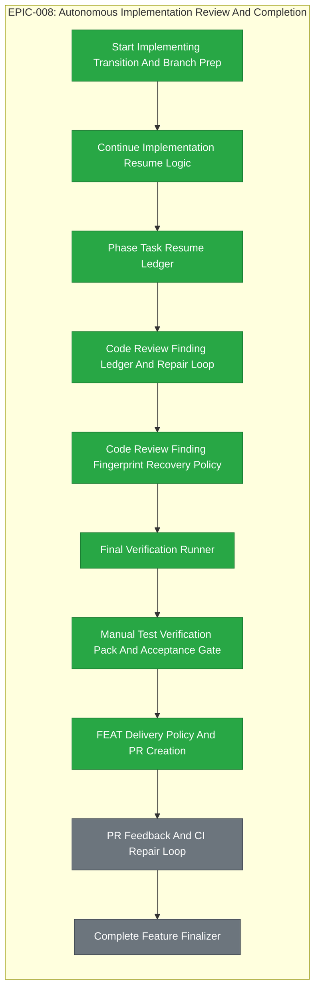

# EPIC-008: Autonomous Implementation Review And Completion

| Field | Value |
|-------|-------|
| Epic ID | EPIC-008 |
| State | Completed |
| Created | 2026-06-28 |
| Target Completion | TBD - define during planning |
| Owner | Paulo Aboim Pinto |
| Priority | High |
| External Reference | docs/architecture/autonomous-implementation-runner.md |

## Executive Summary

Deliver the autonomous FEAT implementation pipeline from implementation trigger to final completion. This epic covers start/continue workflows, phase resume logic, review findings, repair loops, final verification, manual test verification packs, human review, and completion finalization.

## Problem Statement

Hepha's biggest value appears when implementation can proceed through planned phases without constant manual prompting. That requires strict state ownership, resumable phase ledgers, code-review gates, verification evidence, manual acceptance evidence, and final acceptance. Without these controls, autonomy becomes a long opaque prompt instead of a recoverable development process.

The final acceptance step must also be practical for the user. When implementation phases are complete, the user should not have to reconstruct what to test from phase notes, Gherkin files, code-review reports, or acceptance criteria. Hepha must provide a current Manual Test Verification pack, including a PDF, that lists the happy-path manual tests needed to accept the FEAT or EPIC. If the manual tests fail, the same screen must route the user into the existing finding loop instead of leaving an ambiguous active error state.

## Success Criteria

- [ ] Moving a ready FEAT to implementation starts an orchestrator-owned workflow.
- [ ] Continue implementation resumes the first incomplete phase without restarting completed work.
- [x] Phase task checkboxes form a durable FeatureTasks.md resume ledger (FEAT-041). Hepha metadata integration remains for FEAT-042 code review finding ledger.
- [ ] Code-review findings are stored, decided, fixed, and reviewed again before phase advancement.
- [ ] Code-review recovery continues while findings are changing or shrinking, and stops only when the same unresolved finding fingerprint repeats without concrete recovery progress or recovery explicitly blocks.
- [x] Final verification runs configured build/test/lint checks when known (FEAT-044: profile-driven runner with YAML schema, serial execution, fail-fast, and non-blocking audit persistence).
- [ ] EPIC and FEAT deep-dive/refinement workflows require concrete acceptance tests and manual tests, or ask the user targeted questions before marking the work ready.
- [x] Manual Test Verification packs are generated from acceptance criteria, Gherkin/E2E scenarios, implementation evidence, and linked EPIC acceptance tests.
- [x] The dashboard provides the current Manual Test Verification PDF before the user can record `Manual Tests`.
- [x] Failed manual verification creates or updates Human Review Findings instead of leaving stale active errors.
- [ ] Complete Feature produces final artifacts, lessons, and status updates only after gates pass.
- [ ] FEAT delivery policy supports direct merge and pull-request delivery.
- [ ] PR-delivery FEATs can fetch review feedback and CI state before final completion.

## Implementation Audit (2026-07-01)

**Audit status:** A large part of the autonomous implementation pipeline already
exists, but the EPIC now also contains newer acceptance, manual verification,
delivery, and PR-feedback requirements that still need formal implementation.
Treat start/continue/review/finding/completion behavior as audit and hardening;
treat Manual Test Verification packs and PR delivery as new implementation.

**Observed implementation:**
- Start Implementing and Continue Implementing API routes and workflow runners
  exist, including folder moves into In Progress and resume behavior.
- Phase files, `FeatureTasks.md`, phase status, task checkboxes, and SQLite
  implementation task/phase metadata are used as a durable resume ledger.
- Code-review gates, review-finding extraction, recovery prompts, rerun rules,
  and progressive retry behavior are implemented for implementation phases.
- Human Review Findings, finding detail, finding resolution, and human review
  timestamps for User Code-Review and Manual Tests exist in API and dashboard
  state.
- Complete Feature is implemented as a workflow that checks phase resolution,
  closed findings, user review/manual-test timestamps, LessonsLearned output,
  and final MemoryBank completion work.

**Remaining formal implementation:**
- Generate and track Manual Test Verification Markdown/PDF packs, including
  freshness metadata, stale detection, open/download actions, and fail-to-finding
  handoff.
- Make EPIC/FEAT deep-dive and refinement enforce concrete acceptance/manual
  tests before implementation readiness.
- Harden code-review recovery so retry limits are based on repeated unresolved
  finding fingerprints, not a flat count of total code-review reports.
- Implement a durable delivery policy for direct merge versus pull request.
- Implement PR creation/update, PR feedback import, CI status import, repair
  loops, and completion gates for PR-delivery FEATs.
- Connect the newer manual verification requirements to completion receipts so
  `Manual Tests` means the user reviewed an actual verification pack, not only
  a timestamp button.

## Features Breakdown

| Feature ID | Title | Status | Dependencies | Priority |
|------------|-------|--------|--------------|----------|
| FEAT-039 | Start Implementing Transition And Branch Prep | COMPLETED |  |  |
| FEAT-040 | Continue Implementation Resume Logic | COMPLETED |  |  |
| FEAT-041 | Phase Task Resume Ledger | COMPLETED |  |  |
| FEAT-042 | Code Review Finding Ledger And Repair Loop | COMPLETED |  |  |
| FEAT-043 | Code Review Finding Fingerprint Recovery Policy | COMPLETED | 2026-07-10 | 2026-07-10 |
| FEAT-044 | Final Verification Runner | COMPLETED |  |  |
| FEAT-045 | Manual Test Verification Pack And Acceptance Gate | COMPLETED | 2026-07-10 | 2026-07-10 |
| FEAT-046 | FEAT Delivery Policy And PR Creation | COMPLETED | 2026-07-10 | 2026-07-10 |
| TBD | PR Feedback And CI Repair Loop | SUBMITTED | FEAT Delivery Policy And PR Creation; EPIC-007 Run Timeline Storage And API | P1 |
| TBD | Complete Feature Finalizer | SUBMITTED | PR Feedback And CI Repair Loop; EPIC-010 Cross-Project Lessons Curator | P2 |

> Feature IDs are assigned when created via the future `create-epic-features` workflow.

## Epic Progress

**Progress:** 100% (8/8 features complete)

**State:** Completed
**Progress:** 80% (8/10 features complete)

| Status | Count | Features |
|--------|-------|----------|
| Completed | 8 | FEAT-039, FEAT-040, FEAT-041, FEAT-042, FEAT-043, FEAT-044, FEAT-045, FEAT-046 |
| In Progress | 0 | - |
| Submitted | 0 | - |

## Dependency Flow Diagram

## Feature Details

### Feature 1: Start Implementing Transition And Branch Prep (FEAT-039)

**User Story:** Validate FEAT readiness before moving folder to In Progress. Prepare branch or worktree according to project delivery policy (direct_merge vs pull_request). Record branch metadata and workflow run start in Hepha state.

**Scope:** Generated from EPIC EPIC-008 - Autonomous Implementation Review And Completion.
**Backlink:** - EPIC: EPIC-008 - Autonomous Implementation Review And Completion
**Dependencies:** None

### Feature 2: Continue Implementation Resume Logic (FEAT-040)

**User Story:** Read phase files and FeatureTasks.md to determine the first incomplete phase. Skip completed and skipped phases. Resume a blocked or failed phase with the original context. Prevent restarting already passed phases.

**Scope:** Generated from EPIC EPIC-008 - Autonomous Implementation Review And Completion.
**Backlink:** - EPIC: EPIC-008 - Autonomous Implementation Review And Completion
**Dependencies:** None

**Status:** COMPLETED — Phase files, FeatureTasks.md, additive resume metadata, pure selector, I/O adapter, and integration tests are implemented. 101 FEAT-040-specific tests pass.

### Feature 3: Phase Task Resume Ledger (FEAT-041)

**User Story:** Interpret FeatureTasks.md checkboxes as a durable queue. Render pending and completed tasks. Prevent re-running checked tasks by default. Allow invalidation when evidence or changed files require a task re-run.

**Scope:** Generated from EPIC EPIC-008 - Autonomous Implementation Review And Completion.
**Backlink:** - EPIC: EPIC-008 - Autonomous Implementation Review And Completion
**Dependencies:** None

**Status:** COMPLETED — FeatureTasks.md canonical checkbox rows are parsed into a durable resume ledger. Pure parser, selector with deterministic invalidation, I/O adapter, and 72 FEAT-041-specific tests are implemented. Backend-only additive integration; no UI or DB migration.

### Feature 4: Code Review Finding Ledger And Repair Loop (FEAT-042)

**User Story:** Store review findings per phase, classify decisions (blocker, required, note, deferred, accepted risk, rebutted, follow-up), and re-run review after fixes when required. Integrate with existing run timeline storage.

**Scope:** Generated from EPIC EPIC-008 - Autonomous Implementation Review And Completion.
**Backlink:** - EPIC: EPIC-008 - Autonomous Implementation Review And Completion
**Dependencies:** None

### Feature 5: Code Review Finding Fingerprint Recovery Policy (FEAT-043)

**User Story:** Replace flat code-review retry count with fingerprint-based progress detection. Normalize findings, classify progress (new, shrinking, changed, same-with-progress, same-no-progress, approved, blocked), and continue recovery while findings are demonstrably changing. Stop only when identical unresolved fingerprints repeat without progress or explicit BLOCKED. Record decisions in workflow history.

**Scope:** Generated from EPIC EPIC-008 - Autonomous Implementation Review And Completion.
**Backlink:** - EPIC: EPIC-008 - Autonomous Implementation Review And Completion
**Dependencies:** None

### Feature 6: Final Verification Runner (FEAT-044)

**User Story:** Run the configured full build, test, and lint checks before completion. Apply serialized command policy. Block completion if verification fails. Record evidence.

**Scope:** Generated from EPIC EPIC-008 - Autonomous Implementation Review And Completion.
**Backlink:** - EPIC: EPIC-008 - Autonomous Implementation Review And Completion
**Dependencies:** None

**Status:** COMPLETED — Profile-driven final verification with YAML verification profile, schema validation, pure policy helpers, deterministic serial execution, fail-fast semantics, safe presentation with secret redaction, non-blocking SQLite audit persistence, and ~82 focused tests across business logic, presentation, and integration layers.

### Feature 7: Manual Test Verification Pack And Acceptance Gate (FEAT-045)

**Status:** COMPLETED — Manual Test Verification Pack And Acceptance Gate implemented with 124 tests across policy, presentation, acceptance-traceability, and adapter-renderer suites. Includes deterministic source discovery, Markdown/PDF generation, source-hash staleness detection, explicit pack review, failed-test-to-finding routing, and UI panel.

**User Story:** Generate a durable Manual Test Verification artifact (Markdown and PDF) listing happy-path manual tests derived from acceptance criteria, Gherkin scenarios, and EPIC-level tests. Store metadata, detect staleness, expose open/download actions, require pack review before recording Manual Tests, and route failed tests to Human Review Findings.

**Scope:** Generated from EPIC EPIC-008 - Autonomous Implementation Review And Completion.
**Backlink:** - EPIC: EPIC-008 - Autonomous Implementation Review And Completion
**Dependencies:** None

### Feature 8: FEAT Delivery Policy And PR Creation (FEAT-046)

**User Story:** Add a durable Hepha Delivery section to FEAT documents supporting direct_merge and pull_request modes. Automatically create or update a PR after User Code-Review and accepted Manual Test Verification when PR mode is selected. Link PRs to GitHub issues. Keep PR-delivery FEATs in progress until PR gates pass.

**Scope:** Generated from EPIC EPIC-008 - Autonomous Implementation Review And Completion.
**Backlink:** - EPIC: EPIC-008 - Autonomous Implementation Review And Completion
**Dependencies:** None

### Feature 1: Start Implementing Transition And Branch Prep
**User Story:** As a Hepha user, I want ready FEATs to enter implementation with correct state and branch setup so that code changes are isolated.

**Scope:**
- Validate readiness before folder move.
- Prepare branch or worktree according to project policy.
- Record branch metadata and workflow run start.

**Dependencies:** EPIC-004 FEAT Readiness Gates; EPIC-006 Git Write Guardrails

### Feature 2: Continue Implementation Resume Logic
**User Story:** As a Hepha user, I want interrupted implementation to resume from the first incomplete phase so that work is not repeated blindly.

**Scope:**
- Read phase files and `FeatureTasks.md`.
- Skip completed and skipped phases.
- Resume blocked or failed phases with context.

**Dependencies:** Start Implementing Transition And Branch Prep

### Feature 3: Phase Task Resume Ledger
**User Story:** As an implementation worker, I want phase checkboxes interpreted as a durable queue so that retries know what remains.

**Scope:**
- Render pending and completed task ledger.
- Prevent rerunning checked tasks by default.
- Allow invalidation when evidence or changed files require it.

**Dependencies:** Continue Implementation Resume Logic

### Feature 4: Code Review Finding Ledger And Repair Loop
**User Story:** As a Hepha user, I want review findings tracked and resolved systematically so that code quality is not dependent on memory.

**Scope:**
- Store review findings by phase.
- Classify blocker, required, note, deferred, accepted risk, rebutted, and follow-up decisions.
- Rerun review after fixes when required.

**Dependencies:** Phase Task Resume Ledger; EPIC-007 Run Timeline Storage And API

### Feature 5: Code Review Finding Fingerprint Recovery Policy
**User Story:** As a Hepha user, I want code-review recovery to keep working while findings are changing, shrinking, or being partially fixed so that autonomous implementation does not stop just because a fixed retry count was reached.

**Problem To Solve:**
- The current behavior can stop after a configured number of code-review/recovery attempts even when each review report is different and the finding set is making progress.
- A flat total retry count treats three different reports as equivalent to the same report repeated three times.
- This is wrong for autonomous repair: a new review report with different findings is new information and should reset the same-finding repeat counter.
- A review report with fewer blocking findings is progress and should continue.
- A review report with the exact same unresolved findings after a recovery that made no concrete change is the true signal that the loop may be stuck.

**Scope:**
- Replace the flat "N code-review attempts" stop condition with a review-finding fingerprint policy.
- Parse each code-review report into normalized finding fingerprints.
- Track the latest fingerprint set, previous fingerprint sets, repeat counts, and whether recovery made concrete changes before rerun.
- Continue autonomous recovery when the latest review report has new findings, fewer findings, different required changes, changed severity, or evidence that the previous recovery fixed at least one prior blocker.
- Stop only when the same unresolved fingerprint set repeats beyond the configured same-finding repeat limit without concrete recovery progress, or when recovery returns `BLOCKED`.
- Preserve a high absolute safety cap to prevent runaway loops, but do not let the default flat cap stop a workflow that is demonstrably making progress.
- Record the reason for continuing or stopping in workflow history and agent-run summaries so the user can understand whether Hepha is making progress or stuck.

**Finding Fingerprint Requirements:**
- A fingerprint represents the substance of a code-review finding, not the timestamped report file.
- Inputs should include normalized severity, finding type, normalized file/path location when present, normalized line/section when reliable, and normalized required-change text.
- Ignore volatile fields such as report timestamp, code-review report path, run ID, commit hash, incidental line-number drift, and reviewer wording that does not change the requested fix.
- Normalize Markdown table rows and prose findings into the same internal shape where possible.
- Treat `BLOCKER` and `REQUIRED` findings as blocking fingerprints. Treat `WITH_NOTES`, `NON_BLOCKING`, `POLISH`, and equivalent advisory findings as non-blocking unless project rules explicitly escalate them.
- A finding is considered "same" when the normalized blocking fingerprint matches a previous unresolved blocking fingerprint.
- A finding is considered "changed" when severity, type, location, or required-change meaning changes enough that the next recovery worker needs different action.
- A finding is considered "resolved" when it disappears from the latest blocking fingerprint set or is superseded by an approved review.
- A finding is considered "new" when it was absent from the previous unresolved blocking fingerprint set.

**Progress Classification:**
- `approved`: latest review is `APPROVED` or `APPROVED_WITH_NOTES`; phase may advance according to existing gate rules.
- `new_findings`: latest blocking fingerprint set contains at least one new blocking fingerprint; continue recovery and reset same-finding repeat count for the new set.
- `shrinking_findings`: latest blocking fingerprint set is a strict subset of the previous blocking set; continue recovery because prior fixes worked.
- `changed_findings`: latest blocking fingerprint set is not equal to the previous set and is not a strict subset, for example a location or required-change changed; continue recovery and record the changed signature.
- `same_findings_with_progress`: latest blocking fingerprint set equals the previous set, but recovery changed files, phase state, review-finding decisions, or committed artifacts after the previous review; continue until the same-finding repeat limit is reached.
- `same_findings_no_progress`: latest blocking fingerprint set equals the previous set and recovery made no concrete change before rerun; increment same-finding repeat count and stop when the configured threshold is reached.
- `blocked`: recovery explicitly requires human judgment, credentials, destructive action, unavailable tooling, or unresolved merge/conflict state; stop and surface the blocker.

**Concrete Recovery Progress Signals:**
- A tracked file changed in the owning repository after the reviewed report timestamp.
- Phase status, phase ledger, `FeatureTasks.md`, planning report, review-finding decision ledger, or LessonsLearned text changed in a way related to the findings.
- A focused local commit was created for the recovery fixes.
- A previously untracked generated artifact became tracked or the completion claim was downgraded honestly.
- Whitespace, command-output, or documentation checks that previously failed now pass and are recorded.
- A previous finding is explicitly marked fixed, not applicable with rationale, accepted risk, or blocked with a reason.

**Non-Progress Signals:**
- The recovery agent only restates the review report.
- The recovery agent changes unrelated files.
- The recovery agent edits only timestamps or run IDs.
- The recovery agent writes a retry plan but does not apply the required fix.
- The same blocking fingerprint repeats and no changed-file evidence exists between the previous review and the new review.

**Retry Policy:**
- Keep `HEPHA_CODE_REVIEW_RECOVERY_ATTEMPTS` only as the same-finding repeat threshold or rename it to a clearer variable during implementation.
- Add or use a separate high absolute safety cap, for example `HEPHA_CODE_REVIEW_TOTAL_SAFETY_ATTEMPTS`, to prevent infinite loops across changing reports.
- Add or use a progressive cap for changing reports, but default it high enough that ordinary review refinement is not cut off.
- Reset the same-finding repeat counter when the blocking fingerprint set changes materially.
- Do not reset the absolute safety cap.
- Do not mark a workflow failed solely because three code-review reports happened; the failure reason must mention repeated same fingerprints, no progress, explicit `BLOCKED`, or safety-cap exhaustion.

**Workflow History And UI Requirements:**
- Workflow history should show why a retry continued or stopped: new findings, shrinking findings, changed findings, same findings with progress, same findings without progress, blocked, or safety cap.
- Agent console and run summaries should name the latest code-review report path and the fingerprint decision.
- The Work Board card error should distinguish "Review findings need fixes" from "Recovery stopped because the same findings repeated without progress."
- When stopped, the error must include the exact unresolved findings and the last recovery attempt summary.
- The future global Runs view from EPIC-007 should be able to show current retry count, same-finding repeat count, latest report, and latest fingerprint decision.

**Implementation Notes:**
- Build on existing code-review report parsing where possible instead of inventing a second parser.
- Prefer a small pure helper for fingerprint generation and comparison so it can be unit-tested without running Pi.
- Store enough fingerprint state in SQLite or the workflow failure brief to survive orchestrator restart.
- Preserve backward compatibility with existing reports that only have prose findings; if structured extraction fails, use conservative normalized excerpts rather than treating the report as empty.
- Avoid editing watched Hepha backend source while a self-hosted workflow is running under `tsx watch`; implementation should happen in a controlled dev window or non-watch runner.

**Acceptance Criteria:**
- Given review report A has findings `{F1, F2}` and report B has `{F2}`, Hepha classifies B as `shrinking_findings` and continues recovery.
- Given report A has `{F1}` and report B has `{F1, F3}`, Hepha classifies B as `new_findings` or `changed_findings` and continues recovery.
- Given report A and report B have the same blocking fingerprint set but recovery changed relevant files between them, Hepha classifies B as `same_findings_with_progress` and retries until the same-finding threshold is reached.
- Given report A and report B have the same blocking fingerprint set and no relevant recovery change occurred, Hepha increments the same-finding repeat counter and eventually stops with a clear same-finding-no-progress error.
- Given report C is `APPROVED`, Hepha clears the unresolved review blocker and advances the phase according to existing completion rules.
- Given recovery returns `BLOCKED`, Hepha stops immediately and surfaces the recovery report.
- A workflow with three different code-review reports does not fail only because the total report count reached three.
- A workflow with repeated identical findings and no changes fails with an error that names the repeated fingerprints and points to the latest review report.

**Required Automated Coverage:**
- Unit tests for fingerprint normalization from Markdown table findings.
- Unit tests for fingerprint normalization from prose findings.
- Unit tests for changed, new, shrinking, same-with-progress, same-no-progress, approved, and blocked classifications.
- Unit tests proving volatile report paths, timestamps, run IDs, and commit hashes do not create new fingerprints.
- Unit tests proving line-number-only drift does not incorrectly reset the same-finding repeat counter when the requested fix is unchanged.
- Integration tests around `attemptImplementationAutoRecovery` showing continued recovery after changing findings beyond the old flat limit.
- Regression test reproducing the FEAT-009 pattern: repeated reviews that narrowed findings must continue until approved or same-finding-no-progress.
- Regression test proving true infinite-loop protection still stops after repeated identical findings without recovery changes.

**Dependencies:** Code Review Finding Ledger And Repair Loop

### Feature 6: Final Verification Runner
**User Story:** As a Hepha user, I want final verification evidence before completion so that a FEAT cannot be marked done from incomplete checks.

**Scope:**
- Run configured full build/test/lint checks.
- Apply serialized command policy.
- Block completion on failed verification.

**Dependencies:** Code Review Finding Fingerprint Recovery Policy; EPIC-006 Serialized Build And Test Execution

### Feature 7: Manual Test Verification Pack And Acceptance Gate
**User Story:** As a Hepha user, I want a current PDF checklist of the manual happy-path tests required for acceptance so that I can verify a completed FEAT or EPIC deliberately, record success, or submit a finding with the failed scenario.

**Scope:**
- Add a durable Manual Test Verification artifact for each FEAT, with an implementation-selected final path. Preferred path: `ManualTestVerification.md` in the FEAT folder, with a generated PDF artifact stored beside the FEAT or under a clearly named generated-artifacts directory.
- Generate or refresh the Manual Test Verification artifact when all numbered implementation phases are completed and before `Manual Tests` can be recorded.
- Generate a PDF version for the user at the manual verification gate. The PDF must avoid browser/tool headers and footers such as file paths, titles, URLs, or timestamps; page numbering is allowed.
- Make the dashboard Manual Tests flow open or download the current PDF/checklist before recording success. The current button can remain the final acknowledgement, but the user must have access to the verification pack first.
- Keep `Submit Finding` available next to the Manual Tests action. A failed manual test should create a Human Review Finding, preferably prefilled with the manual test ID, step, expected result, actual result, and user notes.
- Treat a source document, acceptance criteria, phase file, test mapping, implementation diff, or linked EPIC acceptance-test change after PDF generation as making the pack stale. A stale pack must be regenerated before acceptance can be recorded.
- Store verification-pack metadata in Hepha state, including document path, PDF path, generated timestamp, source hash or freshness marker, stale/current status, and manual acceptance timestamp.
- Preserve the existing distinction between automated verification and human acceptance: automated tests prove behavior at machine boundaries, while Manual Test Verification confirms the user-facing happy path.

**Manual Test Content Requirements:**
- Every manual test has a stable ID, short title, purpose, preconditions, user role, setup data, exact steps, expected result, pass/fail field, and optional notes/evidence.
- Tests are grouped by user workflow rather than source file or implementation phase.
- The default manual pack emphasizes the happy path required for user acceptance. Edge cases appear only when they are acceptance-critical or cannot be trusted solely to automated tests.
- Each manual test maps to at least one of: Product Owner acceptance criterion, EPIC acceptance test, FEAT acceptance criterion, Gherkin/E2E scenario, integration test, regression test, static check, or explicit manual-only rationale.
- Each automated coverage link names the exact test/check where possible, not a generic statement such as "covered by tests."
- Manual-only items must explain why they remain manual, for example visual inspection, user judgment, browser/device behavior, external integration, or acceptance of copy/UX.
- The pack includes a clear "How to fail this verification" section telling the user to submit a finding instead of clicking Manual Tests when any acceptance-critical step fails.

**Deep-Dive And Refinement Contract:**
- EPIC deep-dive must check whether EPIC-level acceptance tests exist, are concrete, and include the happy-path user verification expected at EPIC acceptance time.
- FEAT deep-dive must check whether FEAT acceptance tests and manual tests exist, are concrete, and are linked to the parent EPIC acceptance tests when applicable.
- If EPIC or FEAT acceptance/manual tests are missing, vague, contradictory, or not user-verifiable, Hepha must either draft them from the current context or ask the user targeted questions before marking the artifact ready.
- Readiness validation must keep validation markers visible until the user or product owner accepts the proposed acceptance/manual tests.
- Refine Feature must map every applicable acceptance/manual test to phases, Gherkin/E2E scenarios, automated checks, or manual-only rationale before implementation starts.
- Implementation workers must not mark a phase complete when an assigned acceptance test lacks implementation evidence or a deliberate manual-only mapping.
- Code review must treat missing acceptance/manual-test traceability as a required finding when the FEAT claims completion.

**EPIC-Level Verification:**
- EPICs may have their own `EpicAcceptanceTests.md` or equivalent acceptance-test artifact. If absent, EPIC deep-dive must create a draft or ask the user for acceptance expectations.
- EPIC Manual Test Verification rolls up child FEAT manual packs and adds cross-FEAT happy-path scenarios that prove the EPIC outcome, not only individual FEAT completion.
- EPIC acceptance should remain blocked while required child FEAT manual packs are missing, stale, failed, or not linked to the EPIC acceptance tests.
- The EPIC PDF should summarize child FEAT verification status, list remaining manual tests, and clearly separate completed child evidence from outstanding EPIC-level acceptance work.

**Dashboard And API Behavior:**
- Show an explicit Manual Test Verification status once all phases are complete: missing, generating, current, stale, accepted, or failed/finding-open.
- Provide actions to open/download the PDF, regenerate the pack, record Manual Tests, and submit a finding.
- Disable or warn on `Manual Tests` when the pack is missing or stale.
- After the user records Manual Tests, show the accepted timestamp and prevent stale old findings from remaining as an active error.
- If the user submits a finding, keep the FEAT in progress, create or update the Human Review Findings phase, and route repair work through the existing finding loop.
- For PR-delivery FEATs, PR creation/update remains gated behind User Code-Review and Manual Tests, but Manual Tests now means the verification pack was reviewed and accepted.

**PDF Generation Requirements:**
- The generated PDF must be deterministic enough for review: same source content should produce stable ordering and section headings.
- The PDF must include FEAT/EPIC ID, title, source document path, generation timestamp, stale/current status, and verification-pack version or source hash.
- The PDF must include all manual test IDs and coverage mappings, but it must avoid dumping long logs or code-review reports.
- The PDF should be readable on screen and when printed, with compact tables for tests and short narrative instructions.
- The generation pipeline must work locally without requiring external SaaS.

**Acceptance Criteria:**
- A FEAT with missing acceptance/manual tests is flagged during deep-dive or refinement and cannot become implementation-ready without a draft accepted by the user or marked as requiring validation.
- A completed implementation exposes a current Manual Test Verification PDF before Manual Tests can be recorded.
- A stale pack is detected after relevant source, phase, acceptance, or implementation evidence changes.
- Recording Manual Tests persists the acceptance timestamp and unblocks the existing delivery/completion gate only when User Code-Review is also satisfied and findings are closed.
- Submitting a failed manual test creates a Human Review Finding and does not mark Manual Tests complete.
- `complete-feature` consumes the recorded Manual Tests state and includes the manual verification pack in the completion receipt.
- EPIC verification can aggregate child FEAT manual packs and identify missing or stale child evidence.

**Required Automated Coverage:**
- Unit tests for acceptance/manual-test extraction, missing-test detection, stale-pack detection, and coverage mapping validation.
- API tests for generating, retrieving, regenerating, accepting, and failing a Manual Test Verification pack.
- Dashboard/component tests for the Manual Tests button, PDF/open action, stale state, accepted state, and Submit Finding handoff.
- Gherkin or E2E tests for the happy path: phases complete, pack generated, user opens PDF, user records Manual Tests, completion gate unlocks.
- Gherkin or E2E tests for the failure path: user fails a manual test, submits finding, repair loop runs, pack regenerates, user accepts.
- Regression tests proving old review errors or stale findings are not shown as active after successful manual verification and completion.

**Dependencies:** Final Verification Runner; EPIC-004 Refine Feature Phase Generation; EPIC-003 EPIC Document Update And Validation Hash

### Feature 8: FEAT Delivery Policy And PR Creation
**User Story:** As a Hepha user, I want to choose whether a FEAT ships through direct merge or pull request so that completion matches the project's collaboration model.

**Scope:**
- Add a durable `Hepha Delivery` section to FEAT documents.
- Support `direct_merge` and `pull_request` delivery modes.
- Automatically create or update a PR after User Code-Review and accepted Manual Test Verification when PR delivery is selected.
- Link PRs to GitHub issues and update issues conservatively.
- Keep PR-delivery FEATs in progress until PR completion gates pass.

**Dependencies:** Manual Test Verification Pack And Acceptance Gate; EPIC-006 Git Write Guardrails

### Feature 9: PR Feedback And CI Repair Loop
**User Story:** As a Hepha user, I want Hepha to fetch PR review comments and failed CI checks so that PR feedback can be fixed systematically.

**Scope:**
- Add a manual `Fetch PR Feedback` action for linked PRs.
- Import unresolved review threads, review states, PR comments, CI/check status, and mergeability.
- Add a PR feedback ledger to the FEAT workflow state.
- Add a manual repair action that fixes comments and red checks, replies to handled threads, and resolves threads after verified fixes.
- Block completion while unresolved blocking feedback or red required checks remain.

**Dependencies:** FEAT Delivery Policy And PR Creation; EPIC-007 Run Timeline Storage And API

### Feature 10: Complete Feature Finalizer
**User Story:** As a Hepha user, I want completed FEATs to produce final summaries and lessons so that future work can learn from the delivery.

**Scope:**
- Update final MemoryBank artifacts.
- Move feature to completed state only after direct-merge gates or PR completion gates pass, including accepted Manual Test Verification.
- Produce LessonsLearned and completion receipt.

**Dependencies:** PR Feedback And CI Repair Loop; EPIC-010 Cross-Project Lessons Curator

## Out of Scope

- Fully unattended release.
- Arbitrary work outside the selected FEAT.
- Replacing human verification where required.
- Treating the manual test PDF as a replacement for executable tests.
- Requiring every edge case to be retested manually when automated coverage already proves it.
- Production deployment automation.

## Risks and Mitigations

| Risk | Impact | Likelihood | Mitigation |
|------|--------|------------|------------|
| Autonomous loop repeats work or skips required tasks | High | Medium | Use phase ledger plus explicit evidence gates. |
| Review findings become stale or duplicated | Medium | Medium | Store finding decisions and rerun review from changed files. |
| Code-review recovery stops while findings are still changing | High | Medium | Use normalized finding fingerprints, same-finding repeat counts, progress detection, and explicit blocked states instead of a flat total retry count. |
| Code-review recovery loops forever on the same unresolved issue | High | Medium | Stop after repeated identical blocking fingerprints without concrete recovery progress, and keep a high absolute safety cap. |
| Final verification is slow or flaky | Medium | Medium | Serialize commands, record exact evidence, and distinguish flaky infrastructure from code failure. |
| Manual verification packs become stale after implementation or documentation changes | High | Medium | Store source freshness metadata and require regeneration before Manual Tests can be accepted. |
| Manual tests become too broad and slow for the user | Medium | Medium | Default to happy-path acceptance tests and link edge cases to automated coverage unless manual judgment is required. |
| Missing acceptance tests are discovered too late | High | Medium | Make EPIC/FEAT deep-dive and refinement validate acceptance/manual tests before readiness. |
| Generated PDFs diverge from current FEAT state | High | Medium | Generate from the durable Markdown/checklist artifact and include source hash/status in the PDF. |
| PR feedback is missed or incorrectly marked resolved | High | Medium | Use explicit fetch/repair actions, store GitHub thread IDs, and only resolve after verified fixes. |
| Red CI is ignored during completion | High | Medium | Gate PR completion on required checks being green or the PR already being merged. |

## Progress Tracking

| Feature ID | Status | Started | Completed | Notes |
|------------|--------|---------|-----------|-------|
| TBD | SUBMITTED | - | - | Start implementation |
| TBD | SUBMITTED | - | - | Continue resume |
| FEAT-041 | COMPLETED | 2026-07-09 | 2026-07-09 | Phase task resume ledger |
| TBD | SUBMITTED | - | - | Review findings loop |
| TBD | SUBMITTED | - | - | Code-review finding fingerprint recovery policy |
| TBD | SUBMITTED | - | - | Final verification |
| TBD | SUBMITTED | - | - | Manual test verification pack and acceptance gate |
| TBD | SUBMITTED | - | - | Delivery policy and PR creation |
| TBD | SUBMITTED | - | - | PR feedback and CI repair |
| TBD | SUBMITTED | - | - | Completion finalizer |
| FEAT-039 | COMPLETED | 2026-07-09 | 2026-07-09 | Transition-only start workflow implemented. |
| FEAT-040 | COMPLETED | 2026-07-09 | 2026-07-09 | Resume selector, data layer, presentation, adapter, and integration tests implemented. |
| FEAT-041 | COMPLETED | 2026-07-09 | 2026-07-09 | Parser, selector, invalidation, adapter, and 72 tests implemented. |
| FEAT-042 | COMPLETED | 2026-07-09 | 2026-07-10 | DB persistence, pure helpers, presentation, adapter, wiring, and 59 tests implemented. |
| FEAT-043 | COMPLETED | 2026-07-10 | 2026-07-10 | |
| FEAT-044 | COMPLETED | 2026-07-09 | 2026-07-10 | Profile-driven final verification runner with YAML profile schema, pure policy helpers, deterministic serial execution, fail-fast semantics, safe presentation with secret redaction, non-blocking SQLite audit persistence, and 82+ focused tests. |
| FEAT-045 | COMPLETED | 2026-07-09 | 2026-07-10 | Manual Test Verification Pack And Acceptance Gate implemented with 124 tests. |
| FEAT-046 | COMPLETED | 2026-07-09 | 2026-07-10 | |

**Overall Progress:** 8/10 features complete (80%)

## Next Steps

1. Deep-dive this EPIC after safety profiles and observability are underway.
2. Implement start/continue in small vertical slices.
3. Harden code-review recovery around finding fingerprints before relying on long autonomous review/fix loops.
4. Require final verification, manual verification packs, and receipts before marking FEATs done.

## Hepha Deep-Dive Decisions

Recorded: 2026-07-10T09:38:57.509Z

Hepha applied these saved Deep-Dive answers directly because the full-document model rewrite did not finish.
Fallback reason: Source document is 42391 characters; deterministic update is used above 12000 characters.

### EPIC scope baseline

Question: Which feature set is the authoritative remaining scope for EPIC-008 given the conflicting 8/8 and 8/10 progress records?

Decision: **Keep FEAT-047 and FEAT-048** - Extract PR Feedback/CI Repair and Complete Feature Finalizer as the two remaining FEATs; correct all stale 8/8 records.

### EPIC acceptance evidence

Question: What concrete EPIC-level acceptance and manual verification artifact must be approved before the remaining FEATs can become Ready?

Decision: **Create EpicAcceptanceTests.md** - Define cross-FEAT PR feedback, green-CI, repair, manual acceptance, and finalization scenarios with explicit manual-test mappings.

### PR completion contract

Question: Which PR state must block Complete Feature after feedback import and repair, so the finalizer has deterministic gates rather than ambiguous GitHub status handling?

Decision: **Block on unresolved required feedback and required checks** - Require no unresolved blocking review items and all configured required checks green; surface non-blocking comments separately.
