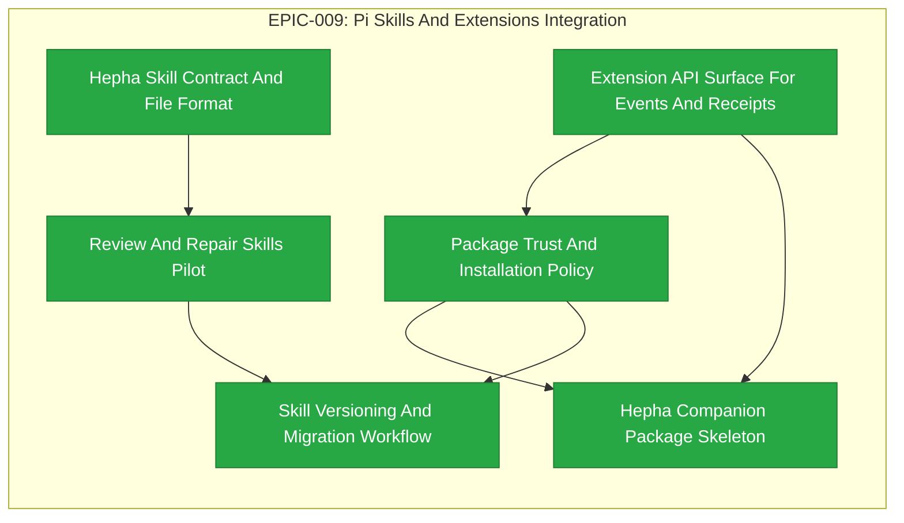

# EPIC-009: Pi Skills And Extensions Integration

| Field | Value |
|-------|-------|
| Epic ID | EPIC-009 |
| State | Completed |
| Created | 2026-06-28 |
| Target Completion | TBD - define during planning |
| Owner | Paulo Aboim Pinto |
| Priority | High |
| External Reference | docs/architecture/pi-skills-extensions-and-second-brain.md; docs/architecture/hepha-harness-contract.md |

## Executive Summary

Use Pi skills and extensions as Hepha worker capabilities without moving workflow authority out of Hepha. This epic converts stable Hepha procedures into skills, defines extension APIs for events and receipts, and prepares a small companion package only after safety contracts, approval handling, and package trust policy are stable.

## Problem Statement

The Archon/Pi direction shows that skills and extensions can carry process knowledge closer to the coding agent. Hepha should benefit from that, but not by letting Pi own workflow state, safety, or cross-project memory. Without a clear integration layer, skills could become hidden process authority and extensions could bypass the orchestrator.

## Success Criteria

- [x] Hepha validates a complete executable skill contract before a skill can run: declared reads, writes, outputs, gates, safety profile, version, and receipt fields.
- [ ] Stable workflows can be represented as Pi skills while Hepha remains the state owner.
- [x] Review and repair skills are evaluated through parallel audited comparisons with command-template paths against equivalent fixtures.
- [x] Extension APIs route event, receipt, context, question, and knowledge operations through Hepha.
- [x] Extension APIs and any installable companion package require orchestrator-mediated APIs, tool-profile enforcement, versioned receipt visibility, explicit approval handling, and package trust policy.
- [x] Package trust, installation, and versioning rules are documented and enforced.
- [x] Skills and extensions are visible in run receipts and dashboard traces.

## Implementation Audit (2026-07-01)

**Audit status:** Mostly formal new implementation. One pilot Pi skill exists and should be treated as the audit fixture for future skill-contract work, not as completion of the full EPIC.

**Observed implementation:**
- A local `pi-skill-serialized-build-commands` package exists under `pi-packages/` and is injected into implementation workers when not disabled.
- Workflow prompts and safety rules already treat the serialized build command skill as mandatory for shared-state build/test tools.
- `.hepha` command templates, context packs, agents, and schemas provide a local contract style that future Pi skill contracts can reuse.

**Remaining formal implementation:**
- ✅ [COMPLETED] Define and enforce the general executable Hepha skill contract with declared reads, writes, outputs, gates, safety profile, version, and receipt fields; reject incomplete skills before launch. (FEAT-047)
- Pilot review and repair skills through parallel audited comparisons with equivalent command-template fixtures, comparing gate outcomes, receipts, findings, and recovery behavior before adoption.
- ✅ [COMPLETED] Implement extension-facing APIs for event emission, receipt recording, context retrieval, questions, and knowledge lookup while preserving Hepha state ownership. (FEAT-049)
- ✅ [COMPLETED] Enforce orchestrator-mediated APIs, tool-profile enforcement, versioned receipt visibility, explicit approval handling, and package trust policy before exposing installable extension or companion-package capabilities. Package trust policy (FEAT-051) completed. Companion package skeleton (FEAT-050) completed.
- ✅ [COMPLETED] Add package trust, installation, versioning, and migration policy, and expose selected skills/extensions in dashboard traces and receipts.

## Features Breakdown

| Feature ID | Title | Status | Dependencies | Priority |
|------------|-------|--------|--------------|----------|
| FEAT-047 | Hepha Skill Contract And File Format | COMPLETED |  |  |
| FEAT-048 | Review And Repair Skills Pilot | COMPLETED |  |  |
| FEAT-049 | Extension API Surface For Events And Receipts | COMPLETED |  |  |
| FEAT-050 | Hepha Companion Package Skeleton | COMPLETED |  |  |
| FEAT-051 | Package Trust And Installation Policy | COMPLETED |  |  |
| FEAT-052 | Skill Versioning And Migration Workflow | COMPLETED | FEAT-048, FEAT-051 |  |

> Feature IDs are assigned when created via the future `create-epic-features` workflow.

## Epic Progress

**State:** Completed
**Progress:** 100% (6/6 features complete)

| Status | Count | Features |
|--------|-------|----------|
| Completed | 6 | FEAT-047, FEAT-048, FEAT-049, FEAT-050, FEAT-051, FEAT-052 |
| In Progress | 0 | -
| Ready | 0 | -
| Submitted | 0 | - |

## Dependency Flow Diagram

## Feature Details

### Feature 1: Hepha Skill Contract And File Format (FEAT-047)

**User Story:** Define a strict executable format for Hepha skills with mandatory metadata (reads, writes, outputs, gates, safety profile, version, receipt fields). Link skills from workflow nodes. Validate the complete executable contract before launch and reject incomplete skills, including gate and context alignment.

**Scope:** Generated from EPIC EPIC-009 - Pi Skills And Extensions Integration.
**Backlink:** - EPIC: EPIC-009 - Pi Skills And Extensions Integration
**Dependencies:** None

### Feature 2: Review And Repair Skills Pilot (FEAT-048)

**User Story:** Create review-phase and repair-review-findings skills that use active LessonsLearned constraints. Run skill-backed and command-template paths against equivalent fixtures, compare gate outcomes, receipts, findings, and recovery behavior, and record the audited comparison before adoption.

**Scope:** Generated from EPIC EPIC-009 - Pi Skills And Extensions Integration.
**Backlink:** - EPIC: EPIC-009 - Pi Skills And Extensions Integration
**Dependencies:** None

### Feature 3: Extension API Surface For Events And Receipts (FEAT-049)

**User Story:** Define orchestrator-mediated extension APIs for event emission, receipt recording, context retrieval, question handling, and knowledge lookup, preserving Hepha state ownership and explicit approval handling. Enforce tool profiles for extension operations and surface versioned extension activity in receipts and dashboard traces.

**Scope:** Generated from EPIC EPIC-009 - Pi Skills And Extensions Integration.
**Backlink:** - EPIC: EPIC-009 - Pi Skills And Extensions Integration
**Dependencies:** None

### Feature 4: Hepha Companion Package Skeleton (FEAT-050)

**User Story:** Create a small companion package skeleton only after extension APIs, tool-profile enforcement, versioned receipt visibility, explicit approval handling, and package trust policy are stable. Include only stable pilot skills and extensions, with documented local installation and update flow that does not grant workflow-state authority.

**Scope:** Generated from EPIC EPIC-009 - Pi Skills And Extensions Integration.
**Backlink:** - EPIC: EPIC-009 - Pi Skills And Extensions Integration
**Dependencies:** None

### Feature 5: Package Trust And Installation Policy (FEAT-051)

**User Story:** Define a trusted package list with version pinning, explicit approval for new extension capabilities, and records for review, update, revocation, and trust decisions. Require installed package versions to appear in run receipts and dashboard traces before exposing installable companion-package capabilities.

**Scope:** Generated from EPIC EPIC-009 - Pi Skills And Extensions Integration.
**Backlink:** - EPIC: EPIC-009 - Pi Skills And Extensions Integration
**Dependencies:** None

### Feature 6: Skill Versioning And Migration Workflow (FEAT-052)

**User Story:** Version skill files, record skill versions in run receipts, provide migration notes for changed procedures, define compatibility and migration handling for workflow-node references, and preserve historical receipt interpretation across skill-version changes.

**Scope:** Generated from EPIC EPIC-009 - Pi Skills And Extensions Integration.
**Backlink:** - EPIC: EPIC-009 - Pi Skills And Extensions Integration
**Dependencies:** None

### Feature 1: Hepha Skill Contract And File Format

**User Story:** As a workflow author, I want Hepha skills to have a strict executable format so that procedure knowledge is portable, reviewable, and safe to launch.

**Scope:**
- Define skill frontmatter and body requirements.
- Require declared reads, writes, outputs, gates, safety profile, version, and receipt fields.
- Link skills from workflow nodes.
- Validate the complete executable contract before launch and reject incomplete skills.
- Validate required reads, writes, outputs, and gates against the workflow context and safety model.

**Dependencies:** EPIC-005 Command Agent Context Schema Contract

### Feature 2: Review And Repair Skills Pilot

**User Story:** As a Hepha maintainer, I want to pilot skills on review and repair workflows so that the first skills improve safety-critical work.

**Scope:**
- Create review-phase and repair-review-findings skills.
- Use active LessonsLearned constraints.
- Run skill-backed and command-template paths against equivalent fixtures.
- Compare gate outcomes, receipts, findings, and recovery behavior before deciding whether skills replace or supplement command templates.
- Record the audited comparison and adoption decision in run evidence.

**Dependencies:** Hepha Skill Contract And File Format

### Feature 3: Extension API Surface For Events And Receipts

**User Story:** As a Pi worker, I want safe extension calls into Hepha so that events, receipts, context, and questions route through the orchestrator.

**Scope:**
- Define orchestrator-mediated extension APIs.
- Support event emission and receipt recording.
- Support context retrieval, question handling, and knowledge lookup through Hepha-owned interfaces.
- Enforce applicable tool profiles for extension operations.
- Preserve Hepha state ownership and explicit approval handling.
- Make versioned extension activity visible in receipts and dashboard traces.

**Dependencies:** EPIC-007 Pi Event Normalization; EPIC-006 Tool Profile Model And Selection

### Feature 4: Hepha Companion Package Skeleton

**User Story:** As a Hepha maintainer, I want a small companion package so that vetted skills and extensions can be installed consistently.

**Scope:**
- Create the package skeleton only after extension APIs, tool-profile enforcement, versioned receipt visibility, explicit approval handling, and package trust policy are complete.
- Include only stable pilot skills and extensions.
- Document local installation and update flow.
- Ensure installation does not grant workflow-state authority or bypass orchestrator controls.

**Dependencies:** Extension API Surface For Events And Receipts; Package Trust And Installation Policy

### Feature 5: Package Trust And Installation Policy

**User Story:** As a Hepha user, I want package installation to be explicit and auditable so that extensions do not become hidden authority.

**Scope:**
- Define a trusted package list and version pinning.
- Record installed package versions in run receipts and dashboard traces.
- Require explicit approval for new extension capabilities.
- Define package review, update, revocation, and trust-decision records.
- Establish the package trust policy required before installable companion-package capabilities are exposed.

**Dependencies:** Extension API Surface For Events And Receipts

### Feature 6: Skill Versioning And Migration Workflow

**User Story:** As a workflow owner, I want skills versioned and migrated intentionally so that process changes remain explainable.

**Scope:**
- Version skill files.
- Record skill versions in run receipts.
- Provide migration notes for changed procedures.
- Define compatibility and migration handling for workflow-node references.
- Preserve historical receipt interpretation across skill-version changes.

**Dependencies:** Review And Repair Skills Pilot; Package Trust And Installation Policy

## Out of Scope

- Moving workflow state into Pi.
- Giving extensions direct SQLite write access.
- Publishing a broad public package before local contracts, approval handling, and package trust policy are stable.
- Replacing `.hepha` command templates immediately.
- Adopting skills without audited comparison evidence for safety-critical review and repair workflows.

## Risks and Mitigations

| Risk | Impact | Likelihood | Mitigation |
|------|--------|------------|------------|
| Skills drift from workflow definitions | High | Medium | Validate the complete executable contract, version skills, and validate workflow references before launch. |
| Extensions bypass Hepha safety gates | High | Medium | Route all operations through orchestrator APIs, enforce tool profiles, and require explicit approval handling. |
| Package work distracts from product reliability | Medium | Medium | Gate packaging on stable APIs, safety controls, versioned receipts, and package trust policy. |
| Skill adoption weakens review or recovery quality | High | Medium | Use parallel audited comparisons with equivalent command-template fixtures before adoption. |

## Progress Tracking

| Feature ID | Status | Started | Completed | Notes |
|------------|--------|---------|-----------|-------|
| TBD | SUBMITTED | - | - | Executable skill contract and validation |
| TBD | SUBMITTED | - | - | Parallel audited review/repair skill pilot |
| TBD | SUBMITTED | - | - | Orchestrator-mediated extension API |
| TBD | SUBMITTED | - | - | Gated companion package skeleton |
| TBD | SUBMITTED | - | - | Package trust and installation policy |
| TBD | SUBMITTED | - | - | Skill versioning and migration workflow |
| FEAT-047 | COMPLETED | 2026-07-10 | 2026-07-10 | |
| FEAT-048 | COMPLETED | 2026-07-10 | 2026-07-10 | |
| FEAT-049 | COMPLETED | 2026-07-10 | 2026-07-11 | |
| FEAT-050 | COMPLETED | 2026-07-10 | 2026-07-11 | |
| FEAT-051 | COMPLETED | 2026-07-10 | 2026-07-11 | |
| FEAT-052 | COMPLETED | 2026-07-10 | 2026-07-11 | Skill versioning and migration workflow implemented, verified, and completed. | |

**Overall Progress:** 6/6 features complete (100%)

## Next Steps

1. ✅ [COMPLETED] Define the executable skill contract and pre-launch validation against the harness and context-schema contracts. (FEAT-047)
2. ✅ [COMPLETED] Build the review and repair pilot with equivalent fixtures for audited parallel comparison against command-template runs.
3. ✅ [COMPLETED] Define orchestrator-mediated extension APIs with tool-profile enforcement, approval handling, and versioned receipt visibility. (FEAT-049)
4. ✅ [COMPLETED] Establish package trust policy before creating any installable companion-package capability. (FEAT-051)
5. ✅ [COMPLETED] Create companion package skeleton with approved stable skills and documented local lifecycle. (FEAT-050)
6. Keep the orchestrator as the state and safety authority throughout implementation.

## Hepha Deep-Dive Decisions

Recorded: 2026-07-10T09:47:36.647Z

Hepha applied these saved Deep-Dive answers directly because the full-document model rewrite did not finish.
Fallback reason: Source document is 15356 characters; deterministic update is used above 12000 characters.

### Feature dependency baseline

Question: Which dependency graph should govern FEAT extraction where the feature table conflicts with the detailed dependency sections?

Decision: **Use detailed dependencies** - Make FEAT-048 depend on FEAT-047; FEAT-049 on EPIC-006/007; FEAT-050 on FEAT-049/051; FEAT-051 on FEAT-049; and FEAT-052 on FEAT-048/051.

### Skill-contract pilot boundary

Question: What is the required initial scope for the executable skill contract before review and repair pilots may begin?

Decision: **Enforce full contract before pilot** - FEAT-047 must validate metadata, context alignment, safety profile, gates, version, and receipt fields before any skill-backed pilot run.

### Pilot adoption evidence

Question: What outcome should permit review and repair skills to progress from audited parallel comparison into normal workflow use?

Decision: **Require equivalence with explicit approval** - Adopt only when equivalent fixtures show matching gate outcomes, receipt completeness, findings, and recovery behavior, followed by recorded human approval.
