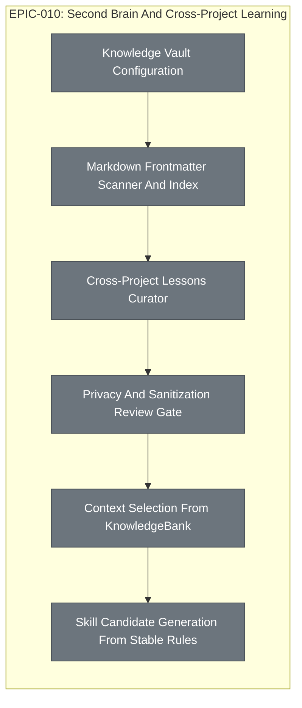

# EPIC-010: Second Brain And Cross-Project Learning

| Field | Value |
|-------|-------|
| Epic ID | EPIC-010 |
| State | NotStarted |
| Created | 2026-06-28 |
| Target Completion | TBD - define during planning |
| Owner | Paulo Aboim Pinto |
| Priority | High |
| External Reference | docs/architecture/pi-skills-extensions-and-second-brain.md; docs/prompts/lessons-learned-curator.md |

## Executive Summary

Build the Obsidian-compatible second brain that lets future projects benefit from lessons learned across prior projects. This epic covers global knowledge configuration, Markdown frontmatter scanning, LessonsLearned promotion, privacy review, context selection, and skill candidate generation.

## Problem Statement

Each project accumulates valuable lessons, but those lessons often stay trapped in that project. Hepha needs a curated, privacy-safe knowledge layer that can select reusable rules and patterns for future FEATs without dumping private history into prompts. Without this, every new project starts with too little memory and repeated mistakes continue.

## Success Criteria

- [ ] Hepha can locate a configured KnowledgeBank or use a safe local default.
- [ ] Markdown notes with frontmatter are scanned into a deterministic knowledge index.
- [ ] Project LessonsLearned can be promoted into sanitized global candidates.
- [ ] Human review gates prevent private or client-specific material from becoming active global knowledge.
- [ ] Future context packs select relevant active rules and patterns by command, agent, stack, tools, and task vocabulary.
- [ ] Run receipts record which knowledge notes influenced a run.

## Implementation Audit (2026-07-01)

**Audit status:** Mostly formal new implementation. Project-local
LessonsLearned selection exists and should be treated as a precursor and
acceptance fixture, but the global KnowledgeBank/second-brain system is not yet
implemented.

**Observed implementation:**
- Feature completion requires a per-FEAT LessonsLearned document.
- Workflow prompts already inject project-local `MemoryBank/LessonsLearned`
  context, prefer `LessonsLearned/Active` rule files when present, score active
  rules by focus, and use raw lesson files as fallback audit context.
- Curator prompt documentation exists for bootstrapping project active rules,
  post-complete project rule updates, and cross-project candidate promotion.

**Remaining formal implementation:**
- Add `HEPHA_KNOWLEDGE_VAULT_PATH` and a safe default `KnowledgeBank` location.
- Implement deterministic Markdown frontmatter scanning and indexing for the
  global vault.
- Promote sanitized project LessonsLearned into global candidate notes with
  privacy-preserving source references.
- Add human privacy/sanitization review gates before activating global rules.
- Select global active rules and patterns into context packs by command, agent,
  stack, tools, phase, and task vocabulary.
- Record selected global knowledge IDs in run receipts and expose skill
  candidate generation from stable rules.

## Features Breakdown

| Feature ID | Title | Status | Dependencies | Priority |
|------------|-------|--------|--------------|----------|
| TBD | Knowledge Vault Configuration | SUBMITTED | EPIC-001 Project Registry UX And Recovery | P1 |
| TBD | Markdown Frontmatter Scanner And Index | SUBMITTED | Knowledge Vault Configuration | P1 |
| TBD | Cross-Project Lessons Curator | SUBMITTED | Markdown Frontmatter Scanner And Index | P1 |
| TBD | Privacy And Sanitization Review Gate | SUBMITTED | Cross-Project Lessons Curator; EPIC-006 Approval Gates API And Dashboard UX | P1 |
| TBD | Context Selection From KnowledgeBank | SUBMITTED | Privacy And Sanitization Review Gate; EPIC-005 Context Pack Hashing And Staleness Detection | P1 |
| TBD | Skill Candidate Generation From Stable Rules | SUBMITTED | Context Selection From KnowledgeBank; EPIC-009 Hepha Skill Contract And File Format | P2 |

> Feature IDs are assigned when created via the future `create-epic-features` workflow.

## Epic Progress

**State:** NotStarted
**Progress:** 0% (0/6 features complete)

| Status | Count | Features |
|--------|-------|----------|
| Completed | 0 | - |
| In Progress | 0 | - |
| Ready | 0 | - |
| Submitted | 0 | TBD |

## Dependency Flow Diagram

## Feature Details

### Feature 1: Knowledge Vault Configuration
**User Story:** As a Hepha user, I want to configure a cross-project knowledge vault so that reusable lessons have a durable home outside any one project.

**Scope:**
- Support `HEPHA_KNOWLEDGE_VAULT_PATH`.
- Provide safe default `KnowledgeBank` location.
- Store project import/export settings.

**Dependencies:** EPIC-001 Project Registry UX And Recovery

### Feature 2: Markdown Frontmatter Scanner And Index
**User Story:** As a Hepha orchestrator, I want to scan knowledge notes deterministically so that context selection is based on metadata, not prompt dumping.

**Scope:**
- Parse YAML frontmatter.
- Validate required note fields.
- Index notes by type, scope, status, tags, tools, stacks, and triggers.

**Dependencies:** Knowledge Vault Configuration

### Feature 3: Cross-Project Lessons Curator
**User Story:** As a Hepha user, I want reusable project lessons proposed as global candidates so that completed work improves future projects.

**Scope:**
- Read completed FEAT lessons and project active rules.
- Write sanitized candidate notes under `KnowledgeBank/Inbox/raw-candidates`.
- Preserve source references without copying private details.

**Dependencies:** Markdown Frontmatter Scanner And Index

### Feature 4: Privacy And Sanitization Review Gate
**User Story:** As a consultant, I want private client and project details reviewed before global promotion so that the second brain remains safe.

**Scope:**
- Require human review before active global rules.
- Detect common private-data risks.
- Record approval or rejection decisions.

**Dependencies:** Cross-Project Lessons Curator; EPIC-006 Approval Gates API And Dashboard UX

### Feature 5: Context Selection From KnowledgeBank
**User Story:** As a Hepha worker, I want relevant global rules selected into context so that each run benefits from prior projects without receiving irrelevant memory.

**Scope:**
- Select active rules by command, agent, phase, stack, tools, and task vocabulary.
- Limit selected notes by configured caps.
- Record selected note IDs in run receipts.

**Dependencies:** Privacy And Sanitization Review Gate; EPIC-005 Context Pack Hashing And Staleness Detection

### Feature 6: Skill Candidate Generation From Stable Rules
**User Story:** As a Hepha maintainer, I want stable rules to become skill candidates so that repeated knowledge can turn into executable procedure.

**Scope:**
- Identify stable active rules.
- Generate candidate skill notes under KnowledgeBank or `.hepha/skills` review area.
- Require review before active skill adoption.

**Dependencies:** Context Selection From KnowledgeBank; EPIC-009 Hepha Skill Contract And File Format

## Out of Scope

- Unbounded autonomous memory.
- Storing credentials, private contacts, screenshots, or client-sensitive material in the global vault.
- Vector search as the primary source of truth.
- Automatically activating global rules without review.

## Risks and Mitigations

| Risk | Impact | Likelihood | Mitigation |
|------|--------|------------|------------|
| Private project details leak into global knowledge | High | Medium | Require sanitization review and default to project-local storage. |
| Too many rules pollute agent context | Medium | High | Select by metadata and cap injected rules and patterns. |
| Lessons become stale or harmful | Medium | Medium | Track confidence, review dates, noisy selections, and deprecation. |

## Progress Tracking

| Feature ID | Status | Started | Completed | Notes |
|------------|--------|---------|-----------|-------|
| TBD | SUBMITTED | - | - | Knowledge vault config |
| TBD | SUBMITTED | - | - | Frontmatter scanner |
| TBD | SUBMITTED | - | - | Cross-project curator |
| TBD | SUBMITTED | - | - | Privacy review gate |
| TBD | SUBMITTED | - | - | Context selection |
| TBD | SUBMITTED | - | - | Skill candidates |

**Overall Progress:** 0/6 features complete (0%)

## Next Steps

1. Deep-dive the KnowledgeBank structure before implementation.
2. Start with read-only scanning and candidate generation.
3. Keep global activation behind human review.
