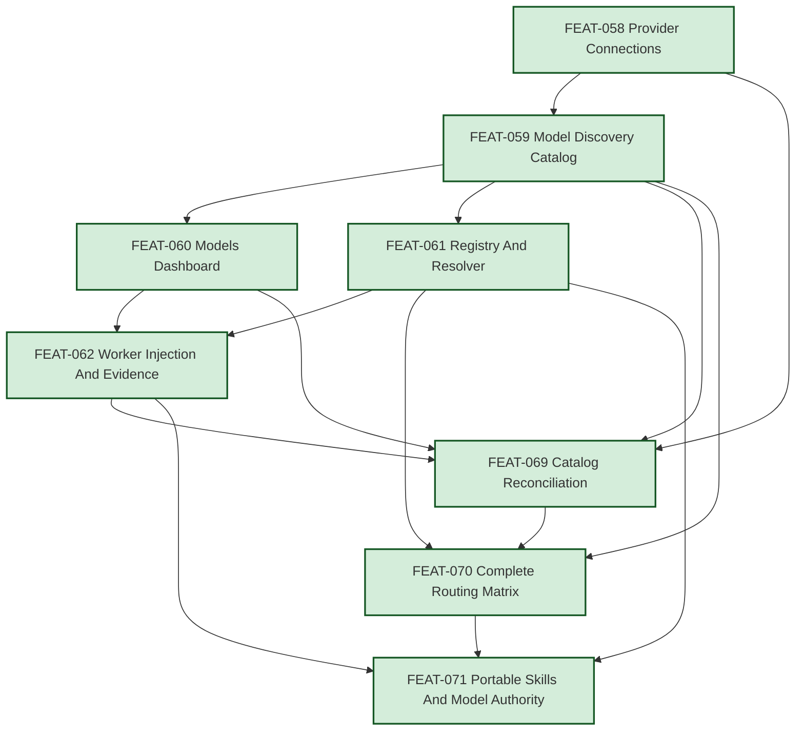

# EPIC-011: Model Catalog And Hierarchical Action Routing

| Field | Value |
|-------|-------|
| Epic ID | EPIC-011 |
| State | Completed |
| Created | 2026-07-10 |
| Reopened | 2026-07-24 |
| Target Completion | TBD - after FEAT-069 through FEAT-071 |
| Owner | Paulo Aboim Pinto |
| Priority | High |
| External Reference | docs/architecture/hepha-harness-contract.md; docs/architecture/workflow-definition-runner.md; docs/architecture/epic-011-model-authority-and-portable-skill-execution.md |

## Executive Summary

Create a durable, operator-managed model capability for Hepha. A new **Models**
area in the dashboard navigation (initially under Settings, while preserving the
ability for the active template to place it elsewhere) will let an operator:

1. configure known or OpenAI-compatible model suppliers;
2. use an already authenticated local Pi session without entering an API key;
3. scan and inspect available models; and
4. assign deterministic Global, action-type, and action-specific model routes. A centralized **Agent Registry** will map
stable action IDs to agent roles, action types, and capability requirements
without embedding provider/model IDs in skills or workflows.

The orchestrator remains the only authority that resolves the provider, model,
and applicable authentication connection for a Pi worker. **Before every Pi
Coding Agent launch**, it must resolve and validate the user-selected route,
prepare the exact model plus provider API-key/session authentication context,
and only then spawn Pi. Policy changes affect only the next worker invocation.
The exact provider, model, policy source, catalog snapshot, outcome, and
duration are recorded at spawn/finish so the dashboard never confuses planned
routing with actual execution.

EPIC-011 was reopened on 2026-07-24 after production inspection showed that
completed child FEATs did not expose every active provider, did not project the
full Agent Registry into Routing Defaults, and did not clearly separate direct
coding-agent model authority from orchestrator-injected model authority. The
corrective scope is captured by FEAT-069 through FEAT-071.

## Problem Statement

Hepha currently keeps model knowledge in static orchestrator code, local
environment defaults, and workflow definitions. Operators cannot manage a
provider connection, inspect a live catalog, understand which model will be
used, or safely recover when a configured model disappears.

Provider setup and model routing must not be hidden in source code or workflow
YAML. At the same time, credentials must never be exposed in the UI, APIs,
logs, prompts, traces, or process command lines.

## Reopened Gap Assessment

The original product direction remains valid, but three completion claims were
not true in the running product:

1. **Catalog reconciliation gap.** Existing active connections were not all
   scanned or shown. Startup cataloged only the Pi installation default, so a
   valid active DeepSeek connection remained absent while OpenAI appeared.
2. **Routing matrix gap.** The canonical Agent Registry contained 17 actions
   across five action types, but the persisted policy contained only Global
   Default and the UI rendered only persisted selectors. Missing selectors
   meant `Inherit` to the resolver but meant “not visible” to the operator.
3. **Model-authority gap.** Portable skills, workflow definitions, command
   templates, and agent roles need action identity but must not choose models.
   Direct execution in Pi, Codex, or Claude Code must use the model selected in
   that host. Hepha-orchestrated execution must resolve and inject the selected
   route before launch.

The implementation and acceptance tests missed production-shaped cases: an
upgraded installation with an unscanned active connection, a real Global-only
bootstrap combined with the complete registry, and one model-neutral skill
executed in both direct-host and orchestrated modes. See
[`docs/architecture/epic-011-model-authority-and-portable-skill-execution.md`](../../../../docs/architecture/epic-011-model-authority-and-portable-skill-execution.md)
for the accepted solution and migration boundaries.

## Product Decisions

### Scope And Inheritance

EPIC-011 introduces one **installation-wide Global Default Model**. It is the
mandatory fallback for every operation in every registered project. Project
model defaults are explicitly future work.

The resolution order is:

```text
Action-specific override
  -> Action-type override
    -> Global Default Model
```

Every action-type and action selector defaults to **Inherit**. `Inherit` walks
to the next level above it. The Global Default cannot inherit.

### Zero-Interruption Bootstrap

HEPHA is intentionally non-interactive: it does not ask for confirmation before
performing a safe, deterministic routing operation. On a fresh installation,
the Global Default is initially unset only until the first valid HEPHA launch
context is available. The resolver atomically seeds it from that context:

- an explicit Hepha launcher invoked from a Pi session may supply that
  session's validated provider/model/authentication-connection identity;
- a Web UI launch uses the installation's configured Pi Session default route.

A normal direct-host skill invocation does not seed or consult Hepha routing;
it stays on the model selected in the active Pi, Codex, or Claude Code session.

This seeds the route, not an API key or token, and writes durable bootstrap
runtime evidence. Concurrent first launches use a transaction: the first valid
route becomes Global Default and all other launches resolve against it. There
is no confirmation dialog and no arbitrary fallback model. If an installation
cannot supply either valid Pi launch context, it is a deterministic installation
fault that must be repaired before dispatch; it is not a prompt to the user and
must never cause a silent provider/model substitution.

Once seeded, the Global Default is mandatory and every `Inherit` selector
resolves through it. Operators may later deliberately change the Global Default
in Models settings; that configuration operation affects future workers only.

### Failure Rerouting

HEPHA remains operational when a non-global configured route fails. Every
non-global action/action-type route has an inherited failure policy with these
choices:

- **Reroute once to Global Default** (the initial default);
- **Reroute once to a selected available connection/model**; or
- **Fail immediately**.

A Global Default always fails immediately: it cannot reroute further. The UI
prevents a fallback cycle, a fallback to the primary route, or a fallback to an
unavailable route. A route failure may be detected during a model scan or at Pi
launch/runtime, including authentication, payment/quota, rate-limit, provider,
or endpoint failures. On a failed scan, Hepha removes that provider catalog and
resets affected non-global primary routes to `Inherit`; the resulting Global
fallback is intentional, automatic, and auditable.

Before a worker has performed substantive work, HEPHA automatically launches
one new pinned fallback worker. After substantive work has begun, it creates a
recovery handoff instead: the fallback worker reads the durable phase/run
context and continues safely without repeating an unsafe operation. In either
case it records the failed primary connection/model, exact classified reason,
configured failure policy, selected fallback, timestamps, and outcome in the
FEAT/phase Details view. It never asks permission and never performs a second
fallback from the Global Default.

### Initial Action Types And Actions

| Action Type | Actions |
|-------------|---------|
| Discovery & Planning | Deep-Dive, Submit EPIC, Submit Feature, Design Feature, Refine Feature |
| Implementation | Start Feature, Continue Implementing, finding fixes and phase workers |
| Review | Code Review |
| Completion | Complete Feature |
| Knowledge & Documentation | Phase Lessons Capture, Feature Lessons Writer, Post-Complete LessonsLearned Curator |

The registry is extensible: new worker actions must be registered centrally and
appear in the routing screen rather than creating hidden model defaults.

### Agent Registry And Launch Paths

An **agent** is a stable, versioned role/instruction contract, not a model
choice. Initial roles are Product Architect (Submit EPIC/Feature),
Requirements Agent (Deep-Dive), UX/Design Agent (Design Feature), Planning
Agent (Refine Feature), Implementation Agent (Start/Continue and finding fixes),
Code Review Agent, Completion Agent, Phase Lessons Capture Agent, Feature
Lessons Writer Agent, and Post-Complete LessonsLearned Curator Agent. Each
skill/workflow declares an action ID and agent role; the registry maps that
action to its action type and capability requirements. The SQLite routing policy
resolves the model separately.

### LessonsLearned Nested-Worker Boundaries

The initial workflow uses three distinct knowledge actions. They are not a
single generic documentation task and may therefore receive different routes:

1. **Phase Lessons Capture** runs after each resolved phase. It gathers only
   the phase's evidence, failures, fixes, review decisions, and prevention
   candidates, then updates the phase's `## LessonsLearned` evidence. It does
   not promote rules.
2. **Feature Lessons Writer** compiles the completed phase lesson entries,
   code-review/finding records, and completion evidence into the raw,
   per-feature audit document:
   `MemoryBank/LessonsLearned/<feat-id>-lessons-learned.md`.
3. **Post-Complete LessonsLearned Curator** runs only after that raw document
   exists and the FEAT is complete. It updates the project-wide active rule
   summaries under `MemoryBank/LessonsLearned/Active/`, without reopening the
   completed FEAT.

`LessonsLearned/Active` is project-wide knowledge, not the future cross-project
Second Brain. Cross-project promotion remains owned by EPIC-010 and its
sanitization/export policy. The resolver/context builder selects relevant active
rules for every agent role, including Deep-Dive, Design Feature, and Refine
Feature—not only implementation. A curated active rule may require refinement
to add/reorder a phase or add a verification gate; it is therefore a first-class
planning input, with the selected rule IDs persisted in the planning/run
receipt.

The same portable skill supports two explicit execution modes with different
model authorities.

**Direct host mode** begins when the user invokes the skill in an existing Pi,
Codex, or Claude Code session. The active coding-agent session owns the model.
The skill does not query Hepha routing policy, compare routes, switch models, or
automatically hand off to another worker. It contains no provider/model or
model-policy declaration. Direct state-sync helpers may update deterministic
workflow state, but Hepha must not fabricate orchestrated runtime evidence; an
unobservable direct model is recorded as `not recorded`.

**Hepha-orchestrated mode** begins only when the dashboard or an explicit Hepha
launcher creates the worker:

```text
Web UI or explicit Hepha launcher
  -> registered action ID + agent role
  -> SQLite Action -> Action Type -> Global route resolution
  -> catalog/capability/authentication validation
  -> exact route injection at the worker-adapter launch boundary
  -> durable approved and actual runtime evidence
```

The current production adapter launches Pi with the resolved `--provider` and
`--model`. The workflow, command, agent definition, and skill remain
model-neutral. Future Codex or Claude Code adapters must consume the same
resolved launch contract; portable direct use does not imply those adapters
already exist.

Nested work launched by the orchestrator is always a new independently resolved
worker and must not inherit the parent worker's model merely because the parent
spawned it. The initial nested actions are Code Review, Phase Lessons Capture
at the end of each phase, Feature Lessons Writer, and Post-Complete
LessonsLearned Curator. Direct-host subagent behavior remains under the active
coding agent unless the user explicitly requests a Hepha-orchestrated launch.

### Provider Connections

The Models screen has three sections.

1. **Provider Connections**
   - A known-provider catalog opens an Add Supplier overlay.
   - Initial known suppliers: OpenAI, Anthropic, Google Gemini, DeepSeek,
     Mistral, xAI, Cohere, Groq, OpenRouter, Together AI, Fireworks AI,
     Perplexity, Hugging Face Inference, Ollama, LM Studio, Azure OpenAI, AWS
     Bedrock, Google Vertex AI, and Abacus.AI.
   - A custom supplier is limited initially to an OpenAI-compatible API: name,
     base URL, and API key; discovery uses its documented `/v1/models` API.
   - **Pi Session** is a first-class connection type. It uses an already
     authenticated local Pi session, requests no API key, stores no Pi token,
     and discovers the full catalog through Pi's supported `/models` model
     catalog capability.
   - Saving or changing a supplier triggers a model scan. A manual **Scan
     Models** action is always available.
   - Upgrade reconciliation scans each active connection that has neither a
     catalog result nor a diagnostic exactly once. Every active connection is
     visible with an honest `never_scanned`, `scanning`, `available`, `empty`,
     or `failed` state even when it currently has no model rows.

2. **Available Models**
   - Shows provider and model name, for example `DeepSeek · deepseek-v4-flash`
     or `OpenRouter · Qwen3.7 Plus`.
   - Shows about ten rows in a fixed-height scroll area, with filtering/search
     available when needed.
   - Selecting a row reveals the supplier-provided model description and
     metadata beside or below the list: connection label, endpoint identity,
     last scan/availability, context window, maximum output, input modalities,
     reasoning controls, tool/API compatibility, and provider pricing when
     supplied.
   - Routing uses the immutable identity `connection ID + model ID`, never a
     provider/model display name alone. The catalog is informational and is
     the source for routing selectors and capability eligibility warnings.

3. **Routing Defaults**
   - Global Default Model selector at the top.
   - A server-projected row for every registered action type and every
     registered action, even when sparse policy persistence has no explicit row.
   - Missing non-global selectors project as `Inherit`; they never disappear.
   - Action-type defaults and individual action overrides are grouped in a
     clear routing table. Each non-global selector offers `Inherit` plus
     available eligible models.
   - The effective inherited route, friendly connection label, immutable
     connection/model identity, policy source, capability eligibility, and
     applicable failure policy are visible before saving.
   - New Agent Registry actions appear automatically as inherited rows without
     requiring a policy data migration.

### Credentials And Scan Failure Behavior

An API key is stored in retrievable plaintext server-side because Hepha must
provide it to the Pi worker environment. It is masked in the UI and must never
be returned by an API, emitted in logs/prompts/traces, written to command-line
arguments, or copied from a Pi session. Pi receives a key only through its
spawned-process environment when required.

A failed provider scan shows the concrete error (for example timeout,
unreachable URL, authentication failure, HTTP error, or malformed response).
Hepha immediately removes that provider's previously discovered models; it
does not retain a stale catalog as selectable.

Affected action/action-type routes reset to `Inherit`. This is an intentional
automatic reroute to the Global Default, not an unrecorded substitution: the
route-change event names the failed connection/model and reason, the inherited
replacement, policy revision, and timestamps, and is visible beside the phase
in FEAT Details. If the unavailable model is the Global Default, routing is
blocked until another available Global Default is selected. The UI must record
and surface a durable attention state: a short two-to-three pulse/blink on
refresh, followed by a persistent warning until the operator resolves or
acknowledges it.

A provider cannot be deleted while one of its models is the Global Default.
The confirmation must explain that a replacement Global Default is required.
Deleting a non-global provider removes its models and resets affected overrides
to `Inherit` after confirmation.

Provider secrets support creation, rotation, revocation, and deletion. They are
excluded from exports/backups by default and protected at rest through the
host's secure-secret facility when available. A custom-provider scan must not
send a key across a redirected host or protocol downgrade. Local endpoints such
as Ollama/LM Studio are explicitly identified as local; remote custom endpoints
require secure endpoint validation.

HEPHA launches Pi with `--provider` and `--model`, but never `--api-key`. For a
custom/API-key connection it creates an isolated per-worker Pi configuration
root, not a mutation of the user's `~/.pi` configuration. Any temporary
`models.json` contains only connection/model metadata and an environment-variable
reference; the actual key is injected only into that child process environment.
The temporary root/session context is unique per worker, safe for parallel
launches, and cleaned up after exit. This lets an operator use Pi's existing
login for providers already authenticated in Pi, while HEPHA can supply a
separately stored key for providers not logged into Pi.

## Phase Runtime Evidence Contract

For every Pi invocation associated with a phase or task, persist and expose:

- planned primary route, effective policy source, and immutable policy revision;
- actual connection ID/provider/model at every Pi spawn boundary;
- catalog snapshot and scan timestamp;
- action ID/action type and agent-role/prompt version;
- selected active LessonsLearned rule IDs when they informed the worker;
- parent invocation/phase correlation when the worker is nested;
- authentication connection identity (never the API key or token itself);
- every route-change/failure/fallback event, including classified cause, policy,
  primary and fallback routes, and timestamps;
- invocation start, finish, outcome, and measured duration.

Phase views aggregate durable invocation evidence into actual model or models,
total elapsed time, invocation count, and outcome. They distinguish **not yet
run**, **not recorded** for legacy or uninstrumented direct-host evidence, and
**failed/timed out**. Direct-host execution is identified separately from an
orchestrated invocation. Predicted models, routing defaults, and document
timestamps must never be displayed as actual direct or orchestrated runtime
facts.

## Success Criteria

- [ ] The dashboard exposes a Models navigation destination with Provider Connections, Available Models, and Routing Defaults.
- [ ] Operators can configure known providers, OpenAI-compatible custom providers, or an already authenticated Pi Session connection.
- [ ] API keys are masked and never exposed through UI, API responses, logs, prompts, traces, command arguments, redirects, default exports/backups, or temporary Pi configuration files.
- [ ] Supplier changes and manual scans discover models; failed scans remove that supplier's selectable catalog and show actionable diagnostics.
- [ ] A versioned upgrade reconciliation scans every active connection that has never produced a catalog result, and every active connection remains visible with an honest scan state even when it has no model rows.
- [ ] The available-model list shows connection/model identity, scrolls within a roughly ten-row viewport, and displays capability, compatibility, availability, endpoint, and provider-supplied pricing details on selection.
- [ ] The installation-wide Global Default applies to all projects and operations; its first valid Pi launch context seeds it automatically, without a confirmation dialog.
- [ ] Action-type and action selectors default to Inherit; the resolver applies Action -> Action Type -> Global deterministically after Global Default bootstrap.
- [ ] Routing Defaults projects every registered action type and action even when policy persistence is sparse, groups actions under friendly labels, and shows configured selector, effective route, policy source, eligibility, and failure policy before save.
- [ ] Adding an Agent Registry action automatically produces an inherited routing row without a policy data migration.
- [ ] Each non-global route has an inherited failure policy: reroute once to Global Default, reroute once to a selected available route, or fail immediately. Global Default failure is terminal.
- [ ] Initial actions are Deep-Dive, Submit EPIC, Submit Feature, Design Feature, Refine Feature, Start Feature, Continue Implementing, Code Review, Complete Feature, Phase Lessons Capture, Feature Lessons Writer, and Post-Complete LessonsLearned Curator.
- [ ] A central Agent Registry maps each action to a stable, versioned agent role/prompt, action type, and capability requirements without naming a model.
- [ ] Phase Lessons Capture, Feature Lessons Writer, and Post-Complete LessonsLearned Curator each resolve their own route and persist their own nested-invocation evidence.
- [ ] Relevant curated active LessonsLearned rules are selected for Deep-Dive, Design, Refine, implementation, review, and completion; rules may prescribe refinement phase/order/gate templates and selected rule IDs are recorded.
- [ ] Direct-host and Hepha-orchestrated execution are explicit modes: direct Pi, Codex, or Claude Code skills use the current host-selected model, while orchestrated workers use the SQLite-backed resolved route injected at launch.
- [ ] Workflow, command, agent, and lifecycle-skill assets declare action identity and contain no provider/model/model-policy routing fields; capability requirements live in the Agent Registry.
- [ ] A directly invoked skill never queries routing policy, silently switches model, or automatically hands off because its host model differs from Hepha policy; only an explicit Hepha launcher creates orchestrated work.
- [ ] Code Review and LessonsLearned nested workers resolve independently through their own action policy rather than inheriting a parent worker's model.
- [ ] The current post-complete curator updates project-level `MemoryBank/LessonsLearned/Active` only; cross-project Second Brain promotion remains separately governed future work.
- [ ] Unavailable non-global routes reset to Inherit; unavailable/deleted Global Default routes block dispatch until replaced, with durable visual attention.
- [ ] Before every Pi Coding Agent launch, the orchestrator resolves the selected policy route, validates the model and provider connection, and prepares the exact model plus applicable API-key/session context before spawning Pi.
- [ ] A failure-policy reroute is automatic, occurs at most once, and records the primary failure, fallback route, policy revision, start/end timestamps, and outcome in FEAT/phase Details; no unrecorded substitution occurs.
- [ ] Routing changes affect only future worker invocations; active workers retain their launch-time provider/model/authentication connection. A post-start failure creates a durable recovery handoff rather than replaying unsafe work.
- [ ] Workflow definitions contain action identity, not exact runtime provider/model IDs or model-policy aliases; portable skills run unchanged in direct and orchestrated modes.
- [ ] Receipts, traces, and FEAT phase Details show actual invocation connection/model(s), action/agent-role version, policy revision, outcome, start/end timestamps, individual and aggregate measured duration, and route/fallback history separately from planned policy. They distinguish not-yet-run, legacy-not-recorded, and failed evidence.
- [ ] Unit, integration, static asset, deterministic harness, Gherkin, and Playwright coverage proves catalog reconciliation, complete registry projection, supplier errors, inheritance, bootstrap races, connection identity, deletion, unavailable models, reroute/fail-immediately/global-terminal policies, nested workers, direct-host model preservation, orchestrator injection, isolated parallel Pi configuration, secret non-leak, human-visible attention, and next-worker-only routing changes.
- [ ] Every relevant child FEAT implements and traces the applicable scenario IDs in [EpicAcceptanceTests.md](EpicAcceptanceTests.md); browser-visible scenarios use Playwright with deterministic provider/Pi fixtures and never real credentials.

## Acceptance Test Contract

[**EpicAcceptanceTests.md**](EpicAcceptanceTests.md) is the canonical Gherkin
acceptance-test template for this EPIC. During refinement, each child FEAT must
copy the scenarios it owns into a focused `apps/web/e2e/features/feat-<id>-*.feature`
file, implement the matching Playwright test, and retain an explicit
scenario-to-FEAT acceptance mapping. Resolver, launch-isolation, and secret
transport assertions additionally require focused orchestrator integration
tests; browser assertions of their receipts do not replace those tests.

## Implementation Posture

This is formal new implementation plus corrective migration. Existing
`modelOptions`, environment variables, workflow/command/agent model-policy
fields, Pi command resolution, SQLite catalog/policy rows, run records, and
trace views are migration inputs only. FEAT-058 through FEAT-062 remain
completed historical foundations; FEAT-069 through FEAT-071 must close the
observed gaps without rewriting their audit evidence.

## Features Breakdown

| Feature ID | Title | Status | Dependencies | Priority |
|------------|-------|--------|--------------|----------|
| FEAT-058 | Provider Connections And Secret-Safe Configuration | COMPLETED |  | P1 |
| FEAT-059 | Pi And OpenAI-Compatible Model Discovery Catalog | COMPLETED | FEAT-058 | P1 |
| FEAT-060 | Models Dashboard And Catalog Recovery UX | COMPLETED | FEAT-059 | P1 |
| FEAT-061 | Agent Registry, Hierarchical Routing Policy, And Deterministic Resolver | COMPLETED | FEAT-059 | P1 |
| FEAT-062 | Worker Injection, Runtime Evidence, And Migration | COMPLETED | FEAT-060, FEAT-061 | P1 |
| FEAT-069 | Active Connection Catalog Reconciliation And Scan State | COMPLETED | FEAT-058, FEAT-059, FEAT-060, FEAT-062 | P1 |
| FEAT-070 | Registry-Projected Routing Matrix And Policy Editor | COMPLETED | FEAT-059, FEAT-061, FEAT-069 | P1 |
| FEAT-071 | Portable Skills And Explicit Model Authority | COMPLETED | FEAT-061, FEAT-062, FEAT-070 | P1 |

> Feature IDs are assigned when created through the FEAT workflow.

## Epic Progress

**Progress:** 100% (8/8 features complete)

**State:** Completed

| Status | Count | Features |
|--------|-------|----------|
| Completed | 8 | FEAT-058, FEAT-059, FEAT-060, FEAT-061, FEAT-062, FEAT-069, FEAT-070, FEAT-071 |
| In Progress | 0 | - |
| Ready | 0 | - |
| Submitted | 0 | - |

## Dependency Flow Diagram



## Feature Details


### Feature 1: Provider Connections And Secret-Safe Configuration (FEAT-058)

**User Story:** Created from the titled TBD row in EPIC-011's Features Breakdown.

**Scope:** Generated from EPIC EPIC-011 - Model Catalog And Hierarchical Action Routing.
**Backlink:** - EPIC: EPIC-011 - Model Catalog And Hierarchical Action Routing
**Dependencies:** None


### Feature 2: Pi And OpenAI-Compatible Model Discovery Catalog (FEAT-059)

**User Story:** Created from the titled TBD row in EPIC-011's Features Breakdown.

**Scope:** Generated from EPIC EPIC-011 - Model Catalog And Hierarchical Action Routing.
**Backlink:** - EPIC: EPIC-011 - Model Catalog And Hierarchical Action Routing
**Dependencies:** FEAT-058


### Feature 3: Models Dashboard And Catalog Recovery UX (FEAT-060)

**User Story:** Created from the titled TBD row in EPIC-011's Features Breakdown.

**Scope:** Generated from EPIC EPIC-011 - Model Catalog And Hierarchical Action Routing.
**Backlink:** - EPIC: EPIC-011 - Model Catalog And Hierarchical Action Routing
**Dependencies:** FEAT-059


### Feature 4: Agent Registry, Hierarchical Routing Policy, And Deterministic Resolver (FEAT-061)

**User Story:** Created from the titled TBD row in EPIC-011's Features Breakdown.

**Scope:** Generated from EPIC EPIC-011 - Model Catalog And Hierarchical Action Routing.
**Backlink:** - EPIC: EPIC-011 - Model Catalog And Hierarchical Action Routing
**Dependencies:** FEAT-059


### Feature 5: Worker Injection, Runtime Evidence, And Migration (FEAT-062)

**User Story:** Created from the titled TBD row in EPIC-011's Features Breakdown.

**Scope:** Generated from EPIC EPIC-011 - Model Catalog And Hierarchical Action Routing.
**Backlink:** - EPIC: EPIC-011 - Model Catalog And Hierarchical Action Routing
**Dependencies:** FEAT-060, FEAT-061

### Feature 1: Provider Connections And Secret-Safe Configuration

**User Story:** As an operator, I want to configure known, custom, or Pi Session
providers without exposing credentials so that Hepha can discover models safely.

**Scope:** provider overlay, named connection identities, known supplier
catalog, OpenAI-compatible custom provider validation, Pi Session status,
secure secret lifecycle and isolated Pi configuration injection, masked key
presentation, non-disclosure rules, supplier deletion guards, endpoint/redirect
protection, and explicit diagnostics.

### Feature 2: Pi And OpenAI-Compatible Model Discovery Catalog

**User Story:** As an operator, I want to scan each configured provider and see
its current full catalog so that I select models that are actually available.

**Scope:** Pi `/models` discovery adapter, OpenAI-compatible `/v1/models`
adapter, immutable sanitized snapshots, immediate catalog removal on failed
scan, model detail metadata, action-capability eligibility facts, and catalog
freshness/availability facts.

### Feature 3: Models Dashboard And Catalog Recovery UX

**User Story:** As an operator, I want an informative Models screen and visible
recovery state so that provider/model failures are understandable and fixable.

**Scope:** navigation, three-screen sections, ten-row model viewport, model
details, Scan Models action, unavailable-model attention state, and provider
error/recovery UX.

### Feature 4: Agent Registry, Hierarchical Routing Policy, And Deterministic Resolver

**User Story:** As an operator, I want stable agent roles plus one Global
Default and inherited action-type/action overrides so that every future worker
has an explicit, explainable route whether launched from the dashboard or Pi.

**Scope:** Agent Registry; versioned action-to-role/prompt/type/capability
mapping; policy persistence and immutable revision audit; inheritance resolver;
automatic first-launch Global Default bootstrap; Global Default validation;
deletion/reset behavior; failure-reroute policy and loop prevention; dry-run
effective-route display; explicit Hepha resolver/launcher handoff; independently
resolved Code Review and LessonsLearned nested workers; and coverage for every
precedence/error path. Its original automatic direct-skill mismatch behavior is
superseded by Feature 8's explicit direct-host/orchestrated boundary.

### Feature 5: Worker Injection, Runtime Evidence, And Migration

**User Story:** As an operator, I want Pi workers and phase views to record the
actual model used so that policy and runtime evidence remain trustworthy.

**Scope:** remove static runtime model IDs; before each Pi Coding Agent spawn,
resolve the effective user-selected action route, validate model availability
and the supplier connection, prepare the required model plus API-key/session
authentication context, and inject it only through an isolated process environment and per-worker Pi
configuration boundary. Preserve active worker routes, persist invocation,
handoff, failure, fallback, start/end timestamp, and policy-revision evidence,
and migrate existing model setup.

### Feature 6: Active Connection Catalog Reconciliation And Scan State (FEAT-069)

**User Story:** As an operator with existing configured providers, I want every
active connection reconciled and visibly classified so that an unscanned model
supplier cannot silently disappear from Available Models or routing choices.

**Why it is needed:** Startup currently scans only the Pi installation default.
The live OpenAI/DeepSeek installation proved that a valid active connection can
have no models and no diagnostic until Scan Models is invoked manually.

**Where it is used:** upgrade startup, Provider Connections, Available Models,
connection save/change, manual scan retry, catalog validation, and Global
Default dispatch safety.

**Scope:** versioned one-time reconciliation for never-scanned active
connections; durable scan-state projection; honest `never_scanned`, `scanning`,
`available`, `empty`, and `failed` UI states; isolated failure handling;
idempotent restart and migration/browser evidence.

**Dependencies:** FEAT-058, FEAT-059, FEAT-060, FEAT-062.

### Feature 7: Registry-Projected Routing Matrix And Policy Editor (FEAT-070)

**User Story:** As an operator, I want every registered action type and action
visible with its configured and effective route so that I can assign models to
Planning, Implementation, Review, Completion, Start Feature, Continue
Implementing, and every nested worker.

**Why it is needed:** The registry has 17 actions and five action types, but a
Global-only sparse policy causes `RoutingDefaultsPanel` to render only Global.
The current UI cannot create the missing overrides, shows connection UUIDs,
and does not complete the failure-policy editor contract.

**Where it is used:** every future dashboard worker launch, direct inspection
of planned policy, action-type inheritance, action override, capability refusal,
provider reset, fallback policy, and nested-worker routing.

**Scope:** complete server-side matrix projection over sparse persistence;
registry labels/order; grouped accessible editor; friendly connection labels;
effective route/source; capability and failure-policy editing; production-shaped
Global-only/canonical-registry tests.

**Dependencies:** FEAT-059, FEAT-061, FEAT-069.

### Feature 8: Portable Skills And Explicit Model Authority (FEAT-071)

**User Story:** As a user of Pi, Codex, Claude Code, or the Hepha dashboard, I
want the same lifecycle skill to respect the selected execution mode so that a
direct skill uses my current coding-agent model while an orchestrated worker
uses the route I configured in Hepha.

**Why it is needed:** The original direct-Pi mismatch handoff conflated portable
skill use with orchestrated launch. Managed commands/agents also retain
`model_policy` hints that compete with the SQLite routing authority, and Claude
Code skills can override the current turn when `model` frontmatter is present.

**Where it is used:** Submit EPIC/Feature, Deep-Dive, Design, Refine, Start,
Continue, phase work, finding repair, Code Review, Complete Feature, and all
LessonsLearned actions, whether invoked directly or by the dashboard.

**Scope:** explicit `direct_host` versus `orchestrated` authority; action-ID-only
workflow/command/agent/skill assets; model-routing-field validation and
migration; portable Pi/Codex/Claude Code skill fixtures; orchestrated Pi route
injection/evidence hardening; no fabricated direct-host runtime evidence; an
adapter-neutral future launch contract without claiming Codex/Claude Code
orchestrator adapters are implemented.

**Dependencies:** FEAT-061, FEAT-062, FEAT-070.

## Out of Scope

- Provider subscription purchase, billing, or account administration.
- Project-specific routing defaults; this is future work.
- Autonomous cost/benchmark-driven model selection.
- Changing a model for an already spawned worker.
- Custom supplier protocols other than OpenAI-compatible model APIs in the
  first release.
- Production Hepha launch adapters for Codex or Claude Code; FEAT-071 defines an
  adapter-neutral contract and direct skill portability while Pi remains the
  production orchestrated worker adapter.
- Inferring or enforcing the model selected by a user in a direct coding-agent
  session.

## Risks and Mitigations

| Risk | Impact | Likelihood | Mitigation |
|------|--------|------------|------------|
| Secret leaks through diagnostics or arguments | H | M | Mask UI; omit from APIs/logs/traces/prompts; environment-only Pi injection. |
| Provider catalog scan fails | H | M | Clear catalog immediately, show exact error, reset non-global routes, block invalid Global Default. |
| Global Default provider is deleted | H | L | Block deletion until a replacement Global Default is selected. |
| Pi catalog interface changes | M | M | Isolate Pi discovery adapter and cover normalized catalog fixtures. |
| Policy changes affect running work | H | L | Resolve/pin model and authentication connection only at spawn; record the launch-time route. |
| Pi launches with an unintended model or provider | H | M | Require pre-spawn deterministic route/authentication resolution; allow only the configured one-time fallback and record it durably. |
| Custom-provider setup leaks a secret or mutates a user Pi configuration | H | M | Environment-only secret injection, per-worker configuration roots, redirect protection, cleanup, and secret-leak tests. |
| UI presents planned routing as actual execution | H | M | Persist and render actual invocation evidence separately. |
| Existing active connection is never scanned | H | M | Versioned one-time reconciliation plus visible connection scan state. |
| Sparse policy hides registered routes | H | H | Project the full registry server-side; missing selectors render as Inherit. |
| Portable skill changes a host-selected model | H | M | Prohibit model routing fields and separate direct-host from orchestrated authority. |
| Direct execution is recorded as orchestrated | H | M | Require explicit launch origin and never infer actual model evidence. |

## Progress Tracking

| Feature ID | Status | Started | Completed | Notes |
|------------|--------|---------|-----------|-------|
| FEAT-058 | COMPLETED | 2026-07-12 | 2026-07-13 | Provider connections and secret-safe foundation |
| FEAT-059 | COMPLETED | 2026-07-12 | 2026-07-22 | Pi And OpenAI-Compatible Model Discovery Catalog |
| FEAT-060 | COMPLETED | 2026-07-12 | 2026-07-23 | Models Dashboard And Catalog Recovery UX |
| FEAT-061 | COMPLETED | 2026-07-12 | 2026-07-23 | Agent Registry, Hierarchical Routing Policy, And Deterministic Resolver |
| FEAT-062 | COMPLETED | 2026-07-12 | 2026-07-24 | Worker Injection, Runtime Evidence, And Migration |
| FEAT-069 | COMPLETED | 2026-07-24 | 2026-07-24 | Reconciled active connections and exposed authoritative scan state |
| FEAT-070 | COMPLETED | 2026-07-25 | 2026-07-26 | Complete registry-projected routing hierarchy and policy editor |
| FEAT-071 | COMPLETED | 2026-07-26 | 2026-07-27 | Make skills portable and model authority explicit |
**Overall Progress:** 8/8 features complete (100%)

## Next Steps

1. FEAT-071 is now completed. All 8 child FEATs are delivered.
2. Re-run every new EPIC acceptance scenario to confirm all corrective scenarios pass.
3. EPIC-011 may now be returned to Completed.

## Reopening Decisions — 2026-07-24

- EPIC-011 is reopened because its original success criteria are observably
  incomplete, not because a new unrelated enhancement was requested.
- FEAT-058 through FEAT-062 remain completed historical foundations. Their
  evidence is not rewritten; corrective behavior is delivered by new FEATs.
- FEAT-069 owns active-connection catalog reconciliation and scan-state UX.
- FEAT-070 owns the complete registry-projected routing matrix and editor.
- FEAT-071 owns model-neutral portable assets and the direct-host versus
  orchestrated model-authority contract.
- Direct Pi, Codex, and Claude Code skill execution uses the model selected in
  that host session. Normal direct invocation never auto-hands off on a Hepha
  policy mismatch.
- Hepha-orchestrated execution uses the registered action route and injects the
  exact provider/model at the launch-adapter boundary. Pi remains the production
  adapter for this EPIC; future Codex/Claude Code adapters consume the same
  contract but are not claimed as delivered.

## Hepha Deep-Dive Decisions

Recorded: 2026-07-12T06:57:34.496Z

Hepha applied these saved Deep-Dive answers directly because the full-document model rewrite did not finish.
Fallback reason: Source document is 28033 characters; deterministic update is used above 12000 characters.

### Feature extraction readiness

Question: How should Hepha resolve this EPIC topic before feature extraction? Confirm whether the current EPIC is complete enough to extract FEATs.

Decision: **Accept current** - Accept the current direction and remove the validation marker.

### Success criteria

Question: How should Hepha resolve this EPIC topic before feature extraction? Confirm whether the success criteria are measurable enough for downstream FEATs.

Decision: **Accept current** - Accept the current direction and remove the validation marker.

### Scope boundaries

Question: How should Hepha resolve this EPIC topic before feature extraction? Confirm whether any remaining scope should be explicitly out of scope.

Decision: **Accept current** - Accept the current direction and remove the validation marker.
