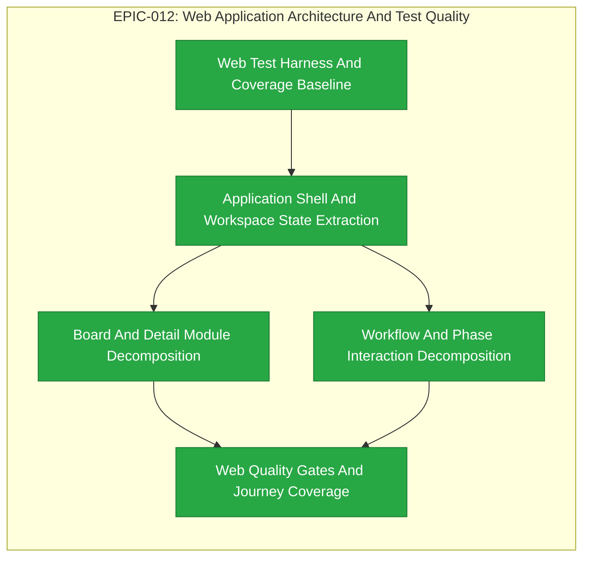

# EPIC-012: Web Application Architecture And Test Quality

| Field | Value |
|-------|-------|
| Epic ID | EPIC-012 |
| State | Completed |
| Created | 2026-07-10 |
| Target Completion | TBD - define during planning |
| Owner | Paulo Aboim Pinto |
| Priority | High |
| External Reference | apps/web/src/main.tsx; docs/product/dashboard-definition.md; docs/workflow/lifecycle.md |

## Executive Summary

Refactor the Hepha web application from a large, tightly coupled dashboard entry
module into focused, testable modules with clear ownership. Establish reliable
web coverage measurement, component/unit testing, Gherkin acceptance scenarios,
and Playwright browser integration coverage for the workflows operators depend
on.

This is architecture and quality work. It must preserve the existing Hepha
board, workflow, review, trace, and MemoryBank behaviour while making future
work such as Second Brain and Model Catalog safer to implement and review.

## Problem Statement

`apps/web/src/main.tsx` currently combines application bootstrapping, project
loading, polling/live-event state, API actions, board rendering, detail blades,
workflow controls, phase presentation, forms, and formatting helpers. This
makes ownership unclear, increases change risk, and prevents focused tests.

Web coverage cannot currently be measured reliably because coverage reporting
was not configured, and an existing React component test dependency was missing.
The browser suite covers selected flows but does not yet provide a complete
operator-facing safety net for board lifecycle, phase recovery, workflow
controls, review, and completion behaviour.

## Architecture And File-Size Contract

Every extracted production module must have one primary concern, stated in its
module documentation or colocated test description. If a file owns more than
one of application state, API transport, domain selection, rendering,
interaction, or formatting, it must be split again rather than accumulating
another concern.

Size is a review guardrail, not permission to create arbitrary fragments:

| Production file size | Rule |
|---|---|
| 0-500 lines | Normal target |
| 501-750 lines | Review the module boundary; split when two concerns are present |
| 751-1,000 lines | Explicit FEAT rationale and reviewer approval required |
| More than 1,000 lines | Not permitted for new or materially modified production modules; split in the same FEAT |

`main.tsx` must become a bootstrap-only entry point, targeting fewer than 200
lines. The application composition root must target fewer than 500 lines.
Generated files, test fixtures, and intentionally data-heavy static catalogs
are excluded only when their role is documented.

## Test And Acceptance Contract

Each extracted concern must have automated evidence appropriate to its role:

- Pure selectors, formatters, reducers, API mappers, and domain policies need
  focused unit tests, including error and boundary paths.
- Stateful hooks, API adapters, and workflow-action components need integration
  tests with controlled API/event fixtures.
- Every user-visible capability affected by an extraction needs a Gherkin
  scenario and Playwright browser integration coverage for its operator journey.
- A pure non-visual helper does not need a meaningless browser test of its own;
  its owning user journey must still be covered end-to-end and linked to the
  helper/component test evidence.
- Every extracted module must identify its test owner. No module may be moved
  without tests or an explicit, reviewed rationale for why a test type is not
  applicable.

V8 coverage reporting must be configured and retained in CI. The Deep-Dive
will set the initial baseline from a passing suite. Thereafter coverage may not
decrease; new or materially changed web modules must target at least 80% line
and function coverage and 70% branch coverage, with a documented exception only
for browser-only, error-boundary, or generated code that cannot be measured
meaningfully.

## Success Criteria

- [x] Web coverage reporting is reproducible locally and in CI, including text,
  machine-readable, and HTML reports; the existing React test suite runs without
  missing dependencies.
- [ ] `main.tsx` is reduced to bootstrap/composition responsibility and remains
  below 200 lines.
- [ ] Project workspace state, API transport, live-event handling, board
  rendering, detail rendering, workflow controls, and display/domain helpers
  have separate named ownership boundaries.
- [ ] No new or materially modified production module exceeds 1,000 lines; all
  751-1,000 line exceptions are recorded and reviewed.
- [ ] Every extracted concern has focused unit or integration evidence and a
  documented test owner.
- [ ] Gherkin scenarios and Playwright tests cover board navigation, workflow
  actions, blocked/recovered phases, manual review, completion, refresh, and
  error/retry states affected by this refactor.
- [ ] Existing dashboard behaviour, API contracts, accessibility labels, live
  activity, and MemoryBank refresh behaviour remain compatible.
- [ ] CI fails when web typechecks, unit/integration tests, required Playwright
  scenarios, or coverage ratchet rules fail.

## Implementation Posture

This is formal refactoring and quality-hardening work. The current dashboard is
valuable product infrastructure, so this EPIC must use small behaviour-
preserving slices rather than a rewrite. Deep-Dive must establish the measured
coverage baseline, the exact CI threshold/ratchet policy, the component
boundaries, and the high-risk user journeys before child FEATs begin.

## Features Breakdown

| Feature ID | Title | Status | Dependencies | Priority |
|------------|-------|--------|--------------|----------|
| FEAT-053 | Web Test Harness And Coverage Baseline | COMPLETED |  |  |
| FEAT-054 | Application Shell And Workspace State Extraction | COMPLETED |  |  |
| FEAT-055 | Board And Detail Module Decomposition | COMPLETED |  |  |
| FEAT-056 | Workflow And Phase Interaction Decomposition | COMPLETED |  |  |
| FEAT-057 | Web Quality Gates And Journey Coverage | COMPLETED | 2026-07-11 | 2026-07-11 |

> Feature IDs are assigned when created via the future `create-epic-features`
> or `submit-feature` workflow.

## Epic Progress

**State:** Completed
**Progress:** 100% (5/5 features complete)

| Status | Count | Features |
|--------|-------|----------|
| Completed | 5 | FEAT-053, FEAT-054, FEAT-055, FEAT-056, FEAT-057 |
| Submitted | 0 | |

## Dependency Flow Diagram

## Feature Details

### Feature 1: Web Test Harness And Coverage Baseline (FEAT-053)

**User Story:** Restore missing web test dependencies, configure a browser-like unit test environment, set up V8 coverage reporting (text, JSON, HTML), record a passing baseline, establish CI coverage ratchet policy, and inventory existing tests to map each high-risk journey to evidence or documented gaps.

**Scope:** Generated from EPIC EPIC-012 - Web Application Architecture And Test Quality.
**Backlink:** - EPIC: EPIC-012 - Web Application Architecture And Test Quality
**Dependencies:** None

### Feature 2: Application Shell And Workspace State Extraction (FEAT-054)

**User Story:** Reduce main.tsx to a bootstrap/composition entry point (<200 lines). Extract project loading, selection, refresh, error notices, pending actions, and live-event handling into separated hooks, state modules, and API adapters with single concerns. Preserve existing request contracts, cancellation, error handling, accessibility, and dashboard behavior. Add unit and integration tests for workspace state transitions and API/event failure paths.

**Scope:** Generated from EPIC EPIC-012 - Web Application Architecture And Test Quality.
**Backlink:** - EPIC: EPIC-012 - Web Application Architecture And Test Quality
**Dependencies:** None

### Feature 3: Board And Detail Module Decomposition (FEAT-055)

**User Story:** Extract board columns/cards, work-item selection, EPIC/FEAT detail blades, document preview, and display selectors into single-concern modules. Preserve MemoryBank refresh, card state, relationships, trace access, and accessibility labels. Add Gherkin and Playwright journeys for board navigation, refresh, detail selection, stale-document recovery, and visible error states.

**Scope:** Generated from EPIC EPIC-012 - Web Application Architecture And Test Quality.
**Backlink:** - EPIC: EPIC-012 - Web Application Architecture And Test Quality
**Dependencies:** None

### Feature 4: Workflow And Phase Interaction Decomposition (FEAT-056)

**User Story:** Extract workflow history, readiness, phase list, lifecycle controls, blocked recovery, manual tests, user review, and findings UI into focused modules. UI components must render facts and request actions without duplicating workflow policy. Add unit/integration evidence plus Gherkin and Playwright journeys for start, continue, blocked dependency recovery, deterministic phase reconciliation, manual review, finding submission, and completion readiness.

**Scope:** Generated from EPIC EPIC-012 - Web Application Architecture And Test Quality.
**Backlink:** - EPIC: EPIC-012 - Web Application Architecture And Test Quality
**Dependencies:** None

### Feature 5: Web Quality Gates And Journey Coverage (FEAT-057)

**User Story:** Complete the test-ownership matrix for every extracted production module. Enforce the size contract, coverage ratchet, typecheck, unit/integration suite, and required Playwright/Gherkin scenarios in CI. Verify accessibility labels, keyboard interaction, loading, error, retry, and reconnect states for affected workflows. Publish the final architecture map and measured coverage report.

**Scope:** Generated from EPIC EPIC-012 - Web Application Architecture And Test Quality.
**Backlink:** - EPIC: EPIC-012 - Web Application Architecture And Test Quality
**Dependencies:** None

### Feature 1: Web Test Harness And Coverage Baseline

**User Story:** As a Hepha maintainer, I want a reliable web test and coverage
baseline so that refactoring decisions are measured rather than guessed.

**Scope:**
- Restore missing web test dependencies and configure the browser-like unit test
environment.
- Configure V8 text, JSON, and HTML coverage reports for the web application.
- Record a passing baseline and CI coverage ratchet policy.
- Inventory the current test suite and map each high-risk existing journey to
unit, integration, Gherkin, and Playwright evidence or a documented gap.

**Dependencies:** None

### Feature 2: Application Shell And Workspace State Extraction

**User Story:** As a web developer, I want application bootstrap, workspace
state, API transport, and live-event handling separated so that each concern can
be changed and tested independently.

**Scope:**
- Reduce `main.tsx` to bootstrap/composition responsibility.
- Extract project loading, selection, refresh, notices/errors, pending actions,
and live-event handling into focused hooks, reducer/state modules, and API
adapters.
- Preserve request contracts, cancellation/error handling, accessibility, and
existing dashboard behaviour.
- Add unit and integration tests for workspace state transitions and API/event
failure handling.

**Dependencies:** Web Test Harness And Coverage Baseline

### Feature 3: Board And Detail Module Decomposition

**User Story:** As an operator, I want board and detail views to remain clear
and reliable while their implementation is divided into focused modules.

**Scope:**
- Extract board columns/cards, work-item selection, EPIC/FEAT detail blades,
document preview, and display selectors into single-concern modules.
- Preserve MemoryBank refresh, card state, relationships, trace access, and
accessibility labels.
- Add Gherkin and Playwright journeys for board navigation, refresh, detail
selection, stale-document recovery, and visible error states.

**Dependencies:** Application Shell And Workspace State Extraction

### Feature 4: Workflow And Phase Interaction Decomposition

**User Story:** As an operator, I want workflow, phase, review, and completion
controls to remain safe and understandable while their UI logic becomes
testable.

**Scope:**
- Extract workflow history, readiness, phase list, lifecycle controls, blocked
recovery, manual tests, user review, and findings UI into focused modules.
- Preserve orchestrator-owned decisions; UI components must render facts and
request actions without duplicating workflow policy.
- Add unit/integration evidence plus Gherkin and Playwright journeys for start,
continue, blocked dependency recovery, deterministic phase reconciliation,
manual review, finding submission, and completion readiness.

**Dependencies:** Application Shell And Workspace State Extraction

### Feature 5: Web Quality Gates And Journey Coverage

**User Story:** As a product owner, I want durable quality gates and browser
journey coverage so that modularization improves confidence rather than merely
moving code.

**Scope:**
- Complete the test-ownership matrix for every extracted production module.
- Enforce the size contract, coverage ratchet, typecheck, unit/integration
suite, and required Playwright/Gherkin scenarios in CI.
- Verify accessibility labels, keyboard interaction, loading, error, retry,
and reconnect states for affected dashboard workflows.
- Publish the final architecture map and measured coverage report.

**Dependencies:** Board And Detail Module Decomposition; Workflow And Phase Interaction Decomposition

## Out of Scope

- Redesigning product workflows or changing orchestrator business policy except
where a bug is found during behaviour-preserving extraction.
- Replacing React, Vite, or the existing dashboard visual design.
- Combining Model Catalog, Second Brain, or unrelated product capabilities into
this refactor.
- Lowering coverage or bypassing tests to make a mechanical extraction pass.

## Risks and Mitigations

| Risk | Impact | Likelihood | Mitigation |
|------|--------|------------|------------|
| Refactor changes operator behaviour | H | M | Small slices, baseline coverage, Gherkin journeys, Playwright regression tests, and reviewable commits. |
| Meaningless test duplication | M | M | Require tests appropriate to each concern; link pure-module tests to owning browser journey rather than forcing superficial E2E tests. |
| Coverage target blocks urgent safe fixes | M | M | Use ratchet policy and documented time-bounded exceptions; never silently reduce the baseline. |
| New modules grow into replacement god files | H | M | Enforce single concern, 500-line target, 1,000-line hard cap, and FEAT review checkpoints. |
| Browser tests become slow or flaky | M | M | Keep deterministic fixtures, isolate network/API responses, and reserve full journeys for critical operator paths. |
| Accessibility regresses during extraction | H | M | Include labels, keyboard operation, and visible status/error assertions in component and Playwright tests. |

## Progress Tracking

| Feature ID | Status | Started | Completed | Notes |
|------------|--------|---------|-----------|-------|
| TBD | SUBMITTED | - | - | Web Test Harness And Coverage Baseline |
| TBD | COMPLETED | - | 2026-07-11 | Application Shell And Workspace State Extraction |
| TBD | COMPLETED | - | 2026-07-11 | Board And Detail Module Decomposition |
| TBD | SUBMITTED | - | - | Workflow And Phase Interaction Decomposition |
| TBD | SUBMITTED | - | - | Web Quality Gates And Journey Coverage |
| FEAT-053 | COMPLETED | 2026-07-11 | 2026-07-11 | |
| FEAT-054 | COMPLETED | 2026-07-11 | 2026-07-11 | |
| FEAT-055 | COMPLETED | 2026-07-11 | 2026-07-11 | |
| FEAT-056 | COMPLETED | 2026-07-11 | 2026-07-11 | |
| FEAT-057 | COMPLETED | 2026-07-11 | 2026-07-11 |

**Overall Progress:** 4/5 features complete (80%)

## Next Steps

1. Refine and implement the next child FEAT (FEAT-054 — Application Shell And
   Workspace State Extraction), which depends on this FEAT's coverage baseline
   and test harness.
2. Complete FEAT-057 (Web Quality Gates And Journey Coverage) as the final
   integration and quality step.

## Hepha Deep-Dive Decisions

Recorded: 2026-07-11T07:51:58.253Z

Hepha applied these saved Deep-Dive answers directly because the full-document model rewrite did not finish.
Fallback reason: Source document is 13539 characters; deterministic update is used above 12000 characters.

### Feature extraction readiness

Question: How should Hepha resolve this EPIC topic before feature extraction? Confirm whether the current EPIC is complete enough to extract FEATs.

Decision: **Accept current** - Accept the current direction and remove the validation marker.

### Success criteria

Question: How should Hepha resolve this EPIC topic before feature extraction? Confirm whether the success criteria are measurable enough for downstream FEATs.

Decision: **Accept current** - Accept the current direction and remove the validation marker.

### Scope boundaries

Question: How should Hepha resolve this EPIC topic before feature extraction? Confirm whether any remaining scope should be explicitly out of scope.

Decision: **Accept current** - Accept the current direction and remove the validation marker.
