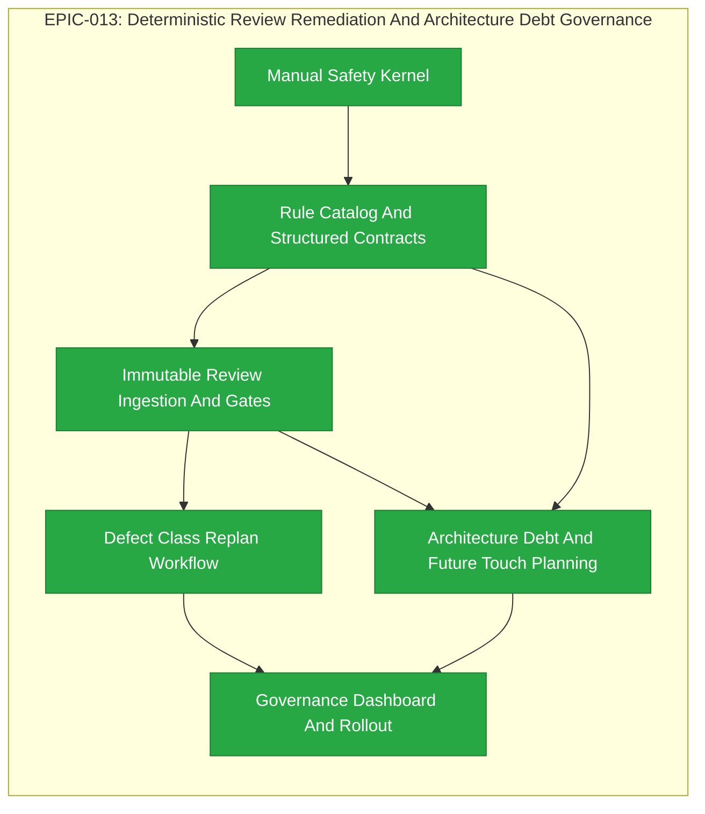

# EPIC-013: Deterministic Review Remediation And Architecture Debt Governance

| Field | Value |
|-------|-------|
| Epic ID | EPIC-013 |
| State | Completed |
| Created | 2026-07-10 |
| Target Completion | TBD - define during planning |
| Owner | Paulo Aboim Pinto |
| Priority | Critical |
| External Reference | docs/architecture/code-review-remediation-and-architecture-debt-overview.md; docs/architecture/code-review-remediation-and-architecture-debt-implementation-plan.md |

## Executive Summary

Harden Hepha code review and recovery so a valid review cannot degrade into an unbounded sequence of narrow fixes and newly discovered sibling defects. The EPIC introduces structured, immutable review decisions; explicit local-versus-cross-cutting remediation scope; defect-class recurrence detection and replan escalation; and owned architecture-debt records for untouched historical noncompliance.

The immediate outcome is a manually implemented Safety Kernel that makes future autonomous review/recovery safe to enable. FEAT-058 is completed and remains retrospective evidence only; it will not be reopened or retroactively migrated. The broader outcome is an auditable governance model in which reviewers identify systemic risk, developers receive bounded work, architecture debt is preserved without hijacking a feature, and the orchestrator—not model prose or filename order—owns progression decisions.

## Problem Statement

FEAT-058 Phase 4 exposed a critical workflow failure. A review/fix sequence produced 34 saved review artifacts over more than seven hours: five infrastructure-only `ENOTDIR` artifacts, 28 `NEEDS_CHANGES` reviews, and one final approval. The review findings were mostly correct, and the developer implemented many correct focused repairs. The failure was that the workflow did not require the reviewer to declare whether a finding was local or cross-cutting, enumerate affected endpoints/symbols, define a complete test matrix, or stop normal retries after repeated manifestations of the same defect class.

A task-bounded developer should not silently search the application and expand scope from one endpoint-specific report. Conversely, a reviewer must not repeatedly report another sibling manifestation without declaring the broader defect class and full remediation surface. Current Markdown-derived parsing, progressive retry routing, mutable fixer-response sections, and incomplete structured ledger integration cannot make this distinction safely.

Code review also legitimately discovers untouched historical code that conflicts with newer active rules. Automatically fixing all such code creates scope creep; ignoring it loses architectural knowledge. Hepha needs a durable, architecture-owned debt route that records, triages, and injects relevant debt when future work touches the location.

## Success Criteria

- [ ] A new code review produces a schema-valid, immutable structured manifest before it can affect workflow state; Markdown is rendered evidence, not the authoritative decision source.
- [ ] Every blocking or scope-expansion finding declares a cited rule/requirement, defect class, root cause, inspected/affected/unaffected surface, required test matrix, and exhaustiveness decision.
- [ ] A second post-fix manifestation of the same defect class, or a second accepted expansion for that class, enters `REMEDIATION_REPLAN_REQUIRED` before a third narrow fixer dispatch.
- [ ] Developers receive only an approved bounded remediation scope and test matrix; suspected siblings are reported rather than silently implemented.
- [ ] Untouched historical noncompliance is recorded as architecture debt with a named architecture owner and does not block the active feature by default.
- [ ] Refinement finds open debt relevant to planned paths/symbols and requires an explicit remediate, prerequisite, waiver, or non-interaction decision before readiness.
- [ ] Phase exit requires a persisted approved review manifest and terminal remediation/replan state; missing or failed mandatory governance storage fails closed.
- [ ] A future pilot feature can complete review/recovery without an uncontrolled rabbit hole, with FEAT-058 retained as regression history.

## Implementation Posture

**Formal new implementation for missing behavior, with an old-school bootstrap.**

Do not use the current autonomous HEPHA review/recovery loop to implement the safeguards that determine whether that loop is safe. The first child feature, the Safety Kernel, is implemented manually with direct human supervision, focused tests, explicit review, and atomic commits. It is a bootstrap/trust-root patch.

Creating this EPIC and its child FEATs provides scope, traceability, and future planning. It does not require autonomous HEPHA execution to implement the safety kernel. Only after the kernel is manually accepted may a deliberately selected future pilot feature use automated review/recovery under the new controls.

## Confirmed Governance Decisions

- **Safety Kernel boundary:** Feature 1 is a single manually implemented vertical slice: bootstrap rule snapshot, schema-valid manifest, pre-persistence secret redaction/rejection, append-only ingestion, fail-closed phase gate, recurrence stop, bounded fixer input, and minimal non-blocking debt capture. It excludes dashboard work, general migration UI, and full debt triage.
- **Local human authority:** v1 is loopback-only and single-operator. Paulo holds Feature Owner and Architecture Steward authority; every approval records actor, role, reason, timestamp, and concurrency version. Shared/remote operation requires authentication and RBAC before governance approvals are enabled.
- **Rule authority:** `.hepha/architecture-rules.yaml` is the only machine-enforceable authority for architecture/security/policy findings. Acceptance criteria remain authority for feature correctness. LessonsLearned is guidance unless explicitly promoted to the catalog; rule activation, supersession, and retirement are architecture-steward decisions.
- **Secret safety:** secret safety overrides artifact immutability. Redact or reject before hashing/logging/persistence; post-write detection quarantines/purges unsafe content and retains only a safe incident record.
- **Rollback:** a per-project enforcement flag may stop autonomous dispatch and place affected work in `needs-human`; it must never restore Markdown/fingerprint/progressive retry as automatic authority.

## Features Breakdown

| Feature ID | Title | Status | Dependencies | Priority |
|------------|-------|--------|--------------|----------|
| FEAT-063 | Manual Safety Kernel For Bounded Review Recovery | COMPLETED |  |  |
| FEAT-064 | Active Rule Catalog And Structured Review Contracts | COMPLETED |  | P1 |
| FEAT-065 | Immutable Review Ingestion And Authoritative Phase Gates | COMPLETED |  | P1 |
| FEAT-066 | Defect Class Replan Workflow And Approval Governance | COMPLETED |  | P1 |
| FEAT-067 | Architecture Debt Register And Future Touch Planning | COMPLETED |  | P1 |
| FEAT-068 | Review Governance Dashboard And Operational Rollout | COMPLETED |  | P2 |

> Feature IDs are assigned when created via the future `create-epic-features` or `submit-feature` workflow. The Safety Kernel must be implemented old-school, not by the autonomous recovery loop it hardens.

## Epic Progress

**State:** Completed
**Progress:** 100% (7/7 features complete)

| Status | Count | Features |
|--------|-------|----------|
| Completed | 7 | FEAT-063, FEAT-064, FEAT-065, FEAT-066, FEAT-067, FEAT-068 |
| In Progress | 0 | - |
| Ready | 0 | - |
| Submitted | 0 | - |

## Dependency Flow Diagram

## Feature Details

### Feature 1: Manual Safety Kernel For Bounded Review Recovery

**User Story:** As a Hepha operator, I want a manually validated trust-root slice for review/recovery governance so that a future pilot feature can use automation without relying on the unsafe autonomous loop to repair itself.

**Scope:**
- Create the bootstrap active-rule snapshot, schema-valid review decision manifest, and pre-persistence secret redaction/rejection boundary.
- Persist append-only review evidence and apply a fail-closed phase gate.
- Add a hard defect-class recurrence stop and explicit `REMEDIATION_REPLAN_REQUIRED` outcome.
- Require bounded developer remediation input and a separate response/verification record.
- Route untouched historical noncompliance to a minimal durable non-blocking debt record.
- Integrate the kernel with review retry and phase advancement paths.
- Implement, test, inspect, and commit using direct old-school development; do not invoke autonomous implementation/recovery for this feature.

**Explicit exclusions:** dashboard/queue work, full debt triage, generalized legacy migration UI, shared-user authorization, and changing FEAT-058 history.

**Dependencies:** None

### Feature 2: Active Rule Catalog And Structured Review Contracts

**User Story:** As an architecture steward, I want versioned active rules and schema-validated review contracts so that policy/architecture findings are based on an auditable rule rather than model preference.

**Scope:**
- Add `.hepha/architecture-rules.yaml` and rule snapshot resolution.
- Define versioned schemas and canonical hashing for review manifests, findings, surfaces, responses, receipts, and replan plans.
- Update reviewer, fixer, and replan prompt assets to emit structured artifacts.
- Reject malformed, unbounded, path-unsafe, secret-bearing, unknown-rule, or unknown-version artifacts.

**Dependencies:** Manual Safety Kernel For Bounded Review Recovery

### Feature 3: Immutable Review Ingestion And Authoritative Phase Gates

**User Story:** As a Hepha operator, I want persisted immutable review artifacts and transactional phase decisions so that an approval or retry is auditable and cannot be inferred from mutable Markdown.

**Scope:**
- Add versioned SQLite migrations and immutable content-addressed review artifact storage.
- Persist review runs, findings, observations, remediation cycles/items, and receipts transactionally.
- Render Markdown from valid manifests and retain legacy Markdown only as `legacy_unverified` compatibility history.
- Make phase exit fail closed unless the latest review manifest is approved and its remediation cycle is terminal.

**Dependencies:** Active Rule Catalog And Structured Review Contracts

### Feature 4: Defect Class Replan Workflow And Approval Governance

**User Story:** As a feature owner, I want repeated manifestations of one defect class to trigger a bounded replan and explicit approval so that the workflow cannot enter endless local patch cycles.

**Scope:**
- Track class identity by project, feature, phase, review gate, and defect class.
- Enforce recurrence and scope-expansion thresholds before recovery dispatch.
- Add immutable reviewer-owned replan plans with full surface, exclusions, test matrix, and closure criteria.
- Require architecture-steward approval before dispatching the bounded replan to a developer.
- Retire legacy progressive retry as a routing authority while retaining historic fingerprints for diagnostics.

**Dependencies:** Immutable Review Ingestion And Authoritative Phase Gates

### Feature 5: Architecture Debt Register And Future Touch Planning

**User Story:** As an architecture steward, I want untouched historical noncompliance recorded, triaged, and supplied to relevant future planning so that debt remains visible without silently expanding active features.

**Scope:**
- Add architecture-debt records, locations, observations, triage events, ownership, deduplication, and planning links.
- Support confirm, reject, merge, defer, accept risk, plan/link, close, and supersede actions.
- Query open debt by planned path, symbol, and rule tag during refinement.
- Require a future-touch decision before a feature touching open debt can become Ready To Develop.

**Dependencies:** Active Rule Catalog And Structured Review Contracts; Immutable Review Ingestion And Authoritative Phase Gates

### Feature 6: Review Governance Dashboard And Operational Rollout

**User Story:** As a Hepha operator and architecture steward, I want safe visibility and explicit actions for remediation, replans, and architecture debt so that governance decisions are understandable and auditable.

**Scope:**
- Add safe read/action APIs, remediation/debt detail panels, and an architecture-debt queue.
- Show manifest hashes, disposition/class summaries, recurrence/replan state, receipt status, debt ownership, and future-touch decisions.
- Add safe trace summaries and metrics for review cycles, replans, rule/disposition use, debt ageing, and recovery stop reasons.
- Run shadow-mode parity, migration audit, documentation, and controlled enforcement rollout.

**Dependencies:** Defect Class Replan Workflow And Approval Governance; Architecture Debt Register And Future Touch Planning

## Out of Scope

- Automatically refactoring every historical noncompliance found during a feature review.
- Allowing model preference alone to define a policy or architecture blocker.
- Automatically creating implementation work from architecture debt without architecture triage.
- Replacing necessary human feature-scope or architecture decisions.
- Reopening or retroactively migrating completed FEAT-058 provider-connections source/history.
- Using autonomous HEPHA implementation/recovery to implement the Safety Kernel.

## Risks and Mitigations

| Risk | Impact | Likelihood | Mitigation |
|------|--------|------------|------------|
| A future pilot feature repeats the FEAT-058 rabbit hole before the kernel is ready. | High | Medium | Do not enable autonomous review/recovery for the pilot until the manually tested Safety Kernel is accepted. |
| Bootstrapping safety controls through the same automation creates circular failure. | High | High | Implement Feature 1 old-school: direct controlled edits, focused tests, explicit human review, and atomic commit. |
| The new contract is only prompt prose and remains bypassable. | High | Medium | Enforce schemas and orchestrator state transitions; prompts are guidance, not authority. |
| Structured artifacts expose secrets or unsafe paths. | High | Medium | Validate size/path/schema, redact before persistence, bind artifacts to feature root, and hash-verify reads. |
| Architecture debt becomes an unprioritized dumping ground. | Medium | Medium | Require rule evidence, deduplication, architecture ownership, triage lifecycle, and future-touch planning decisions. |
| Legacy Markdown reports cannot be fully reconstructed. | Medium | High | Preserve and label them `legacy_unverified`; never use them for automatic approvals or recurrence enforcement. |
| Full immutable-governance work delays feature delivery. | Medium | Medium | Deliver the manually validated minimum Safety Kernel first, then evolve the full platform incrementally. |

## Progress Tracking

| Feature ID | Status | Started | Completed | Notes |
|------------|--------|---------|-----------|-------|
_(Obsolete TBD tracking rows removed — use the Features Breakdown table above for current status.)_
| FEAT-063 | COMPLETED | 2026-07-13 | | |
| FEAT-064 | COMPLETED | 2026-07-13 | 2026-07-14 | |
| FEAT-065 | COMPLETED | 2026-07-13 | 2026-07-16 | |
| FEAT-066 | COMPLETED | 2026-07-13 | 2026-07-18 | |
| FEAT-067 | COMPLETED | 2026-07-13 | 2026-07-19 | |
| FEAT-068 | COMPLETED | 2026-07-13 | 2026-07-20 |

**Overall Progress:** 7/7 features complete (100%) — see Features Breakdown table above for current status

## Next Steps

EPIC-013 is now completed. All seven child features (FEAT-063 through FEAT-068) have been implemented, tested, reviewed, and delivered. The governance dashboard, shadow-mode parity, migration auditing, operational documentation, and controlled enforcement pilot are all operational.

Future work that builds on this EPIC should:
- Select a future pilot feature for controlled autonomous review/recovery using the established governance controls.
- Extend the governance model to shared/remote operation when authentication and RBAC are ready.
- Monitor architecture-debt register usage and evolve the touch-planning pipeline as needed.

## Hepha Deep-Dive Decisions

Recorded: 2026-07-13T06:43:28.409Z

Hepha applied these saved Deep-Dive answers directly because the full-document model rewrite did not finish.
Fallback reason: Source document is 17106 characters; deterministic update is used above 12000 characters.

### Safety Kernel acceptance gate

Question: What exact evidence must approve the manual Safety Kernel before any pilot can use autonomous review/recovery?

Decision: **Focused automated tests plus human gate** - Require targeted contract/integration tests, explicit human review, and an atomic acceptance commit.

### Safety Kernel storage boundary

Question: Which durable storage scope belongs in Feature 1 versus later immutable-governance work?

Decision: **Minimum append-only kernel records** - Persist only manifests, safe evidence, recurrence state, bounded remediation, and minimal debt capture needed to fail closed.

### Pilot and recurrence policy

Question: How should the first controlled pilot be selected and stopped when governance detects a repeated defect class?

Decision: **Pre-approved low-risk pilot with fail-closed stop** - Choose a bounded feature in advance; any recurrence threshold or storage failure moves it to needs-human with no automatic dispatch.
