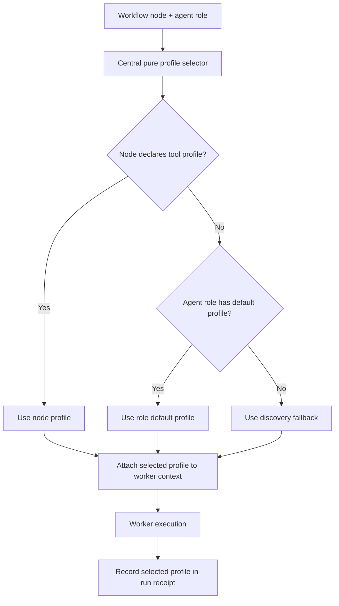

# FEAT-026: Tool Profile Model And Selection

**Feature ID**: FEAT-026  
**Parent Epic**: EPIC-006  
**Status**: Completed

## Summary

Define schema-backed named tool profile categories for discovery, documentation, tests, source edits, git writes, and privileged actions. Define an action-class capability model used by those profiles. Select the effective profile deterministically from workflow node metadata and agent role defaults. Pass the selected profile into worker context before execution. Record the selected profile in run receipts.

Dependencies: EPIC-005 Command Agent Context Schema Contract.

## Source

- EPIC: EPIC-006 - Safety Tool Profiles And Approval Gates
- Created by Hepha unnamed FEAT discovery from the current EPIC document.
- Clarified by Hepha Deep-Dive stage 2 using saved answers.

## Scope

FEAT-026 establishes the focused vertical-slice contract foundation for EPIC-006 tool safety profiles.

This FEAT includes:

- Named tool profile categories for:
  - discovery
  - documentation
  - tests
  - source edits
  - git writes
  - privileged actions
- A schema-backed action-class capability model for profile permissions.
- Central integration with the existing EPIC-005 schema and validator path.
- Selection of the effective profile by workflow node metadata and agent role.
- Deterministic profile selection precedence:
  1. explicit workflow node profile, when present;
  2. agent role default profile;
  3. least-privileged discovery fallback.
- One central, side-effect-free selector helper that resolves the effective profile before worker context creation.
- Passing the selected profile into worker context before execution.
- Recording the selected profile in run receipts.
- Pure validation and selection helpers that can be tested without running workers.
- Focused tests covering the end-to-end profile selection contract.

This FEAT explicitly depends on EPIC-005 schemas for the worker context and run receipt contract.

## Out Of Scope

This FEAT does not include:

- UI controls for selecting or changing profiles.
- Manual profile override workflows.
- Approval-gate implementation beyond the profile data needed by later EPIC-006 work.
- Runtime enforcement of every individual tool operation beyond the selected profile contract.
- Per-tool allowlist or denylist enforcement.
- Migration of existing historical run receipts.

## Hepha Deep-Dive Decisions

| Topic | Decision |
| --- | --- |
| Acceptance Criteria | Use an end-to-end selection contract: define profiles and capabilities, select by workflow node and agent role, pass the selected profile into worker context, and record it in run receipts with focused tests. |
| Validation | Keep FEAT-026 as a focused vertical slice for the EPIC-006 contract foundation, explicitly depending on EPIC-005 schemas and excluding UI/manual overrides. |
| Capability model granularity | Use action-class capabilities. Define schema-backed capability classes such as `read-discover`, `document-write`, `test-run`, `source-edit`, `git-write`, and `privileged-action`; defer per-tool runtime enforcement. |
| Profile selection precedence | Use explicit workflow node profile when present, otherwise agent role default, otherwise least-privileged discovery fallback. Selection must be deterministic and safe. |
| Schema and receipt boundary | Extend EPIC-005 schemas only. Add selected profile fields to worker context and run receipts, backed by pure selection helpers and focused tests. Do not add UI overrides or full enforcement in this FEAT. |
| Schema integration boundary | Define and validate profiles, capabilities, worker-context fields, and receipt fields centrally in the existing EPIC-005 schema/validator path. Do not create a parallel profile contract. |
| Selection integration point | Run deterministic profile selection through one central pure selector before worker context creation. Attach the selector result before the worker starts. |
| Implementation scope and tests | Keep this as a contract slice with focused end-to-end tests for node override, role default, and discovery fallback. Do not add UI behavior or per-tool enforcement. |

## Implementation Summary

FEAT-026 implementation is complete. 68 tests pass across 3 test files (30 data-layer + 22 business-logic + 16 integration). Profile definitions live in `.hepha/safety/tool-profiles.yaml`, the selector in `tool-profiles.ts`, receipt/worker-context integration in `workflow-receipt.ts` and `index.ts`, and shared types in `packages/shared/src/index.ts`.

## Tool Profile Categories

| Profile | Intended Use | Capability Classes |
| --- | --- | --- |
| `discovery` | Reading project state, inspecting files, gathering context, summarizing existing information. | `read-discover` |
| `documentation` | Updating MemoryBank, planning, requirements, design, and other documentation artifacts. | `read-discover`, `document-write` |
| `tests` | Running test, lint, typecheck, and validation commands without source edits. | `read-discover`, `test-run` |
| `source-edits` | Editing implementation source files and related project files. | `read-discover`, `document-write`, `test-run`, `source-edit` |
| `git-writes` | Git write operations such as staging, committing, branch updates, and pushing where allowed by workflow policy. | `read-discover`, `git-write` |
| `privileged-actions` | High-risk or irreversible operations requiring later approval-gate behavior. | `read-discover`, `privileged-action` |

## Capability Model

FEAT-026 defines capability classes at the action-class level, not at the individual tool-operation level.

| Capability | Meaning |
| --- | --- |
| `read-discover` | The worker may inspect existing project state, read files, list directories, and gather context. |
| `document-write` | The worker may create or update documentation, planning, MemoryBank, or non-runtime text artifacts. |
| `test-run` | The worker may run tests, lint, typecheck, build validation, or other verification commands. |
| `source-edit` | The worker may create or modify source code and implementation files. |
| `git-write` | The worker may perform Git write actions such as stage, commit, branch manipulation, or push when allowed by the workflow. |
| `privileged-action` | The worker may request or perform high-risk operations that later EPIC-006 work can route through approval gates. |

The model must be schema-backed and stable enough for later EPIC-006 approval-gate and enforcement work. This FEAT does not implement per-tool runtime enforcement.

## Profile Selection Contract

The effective tool profile is selected before worker execution.

Selection must run through one central, side-effect-free helper before worker context creation. The helper receives the workflow node metadata and agent role/default metadata, resolves the selected profile, and returns a schema-valid selected-profile object that can be attached to the worker context.

Selection precedence:

1. If workflow node metadata explicitly declares a tool profile, use that profile.
2. Otherwise, use the default profile for the selected agent role.
3. Otherwise, fall back to the least-privileged `discovery` profile.

Selection must be deterministic, side-effect free, and testable through pure helper functions.

## Schema Boundary

FEAT-026 must use and extend the EPIC-005 command agent context schema contract. It must not introduce an incompatible parallel contract.

Profiles, capability classes, worker-context selected-profile fields, run-receipt selected-profile fields, and validation helpers must be added centrally to the existing EPIC-005 schema/validator path.

The vertical slice should add schema-backed selected-profile data to:

- worker context before execution;
- run receipts after execution.

The selected-profile data should include enough stable information for audit and later enforcement, including:

- selected profile id;
- selected profile capabilities;
- selection source:
  - workflow node metadata;
  - agent role default;
  - fallback;
- optional workflow node id or role id when already available from EPIC-005 context.

## Implementation Notes For Refinement

Refinement should plan this FEAT around a contract-first vertical slice:

1. Add schema definitions for tool profile ids and capability classes in the EPIC-005 schema area.
2. Add validation helpers for known profile ids, known capability classes, profile definitions, and selected-profile payloads.
3. Define the default named profile catalog in a central location used by validation and selection.
4. Implement one pure selector helper that resolves:
   - workflow node explicit profile;
   - agent role default profile;
   - `discovery` fallback.
5. Attach the selector result during worker context creation before worker execution starts.
6. Persist the same selected-profile result in the run receipt.
7. Add focused tests for:
   - explicit workflow node profile override;
   - agent role default profile when no node profile is present;
   - least-privileged `discovery` fallback when neither node profile nor role default exists;
   - schema validation of profile ids, capability classes, worker context, and run receipt fields.

## Acceptance Criteria

- The system defines named tool profile categories for discovery, documentation, tests, source edits, git writes, and privileged actions.
- Each named profile has an explicit schema-backed action-class capability model.
- Capability classes include `read-discover`, `document-write`, `test-run`, `source-edit`, `git-write`, and `privileged-action`.
- Profiles, capability classes, worker-context fields, and receipt fields are defined and validated through the existing EPIC-005 schema/validator path.
- Workflow execution can select a tool profile from workflow node metadata and agent role.
- Profile selection runs through one central, side-effect-free selector before worker context creation.
- Profile selection precedence is:
  1. workflow node explicit profile;
  2. agent role default profile;
  3. least-privileged `discovery` fallback.
- The selected profile is available in worker context before the worker starts execution.
- Run receipts record the selected profile in a stable, schema-backed field.
- The implementation uses or extends the EPIC-005 command agent context schema contract instead of introducing an incompatible parallel contract.
- Focused tests verify the end-to-end selection flow from workflow node and agent role through worker context and run receipt recording.
- Focused tests verify explicit workflow node profile override.
- Focused tests verify agent role default selection when no workflow node profile is present.
- Focused tests verify the least-privileged `discovery` fallback when no node profile or role default exists.
- Focused tests verify schema validation for selected profile data in worker context and run receipts.
- The FEAT does not introduce UI/manual profile override behavior.
- The FEAT does not implement per-tool runtime enforcement.

## Validation

FEAT-026 is confirmed as a focused vertical slice for EPIC-006. It should proceed to refinement as the contract foundation for safety tool profiles, with EPIC-005 as a required dependency for schema alignment.
