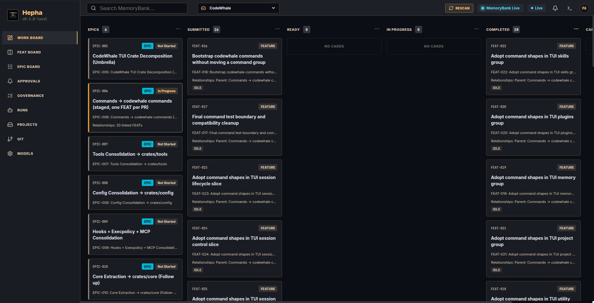
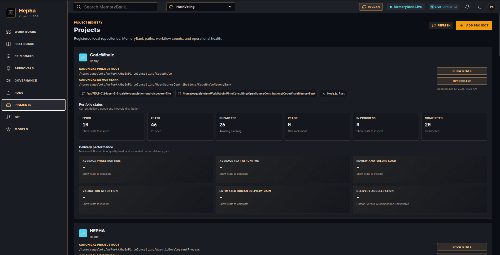
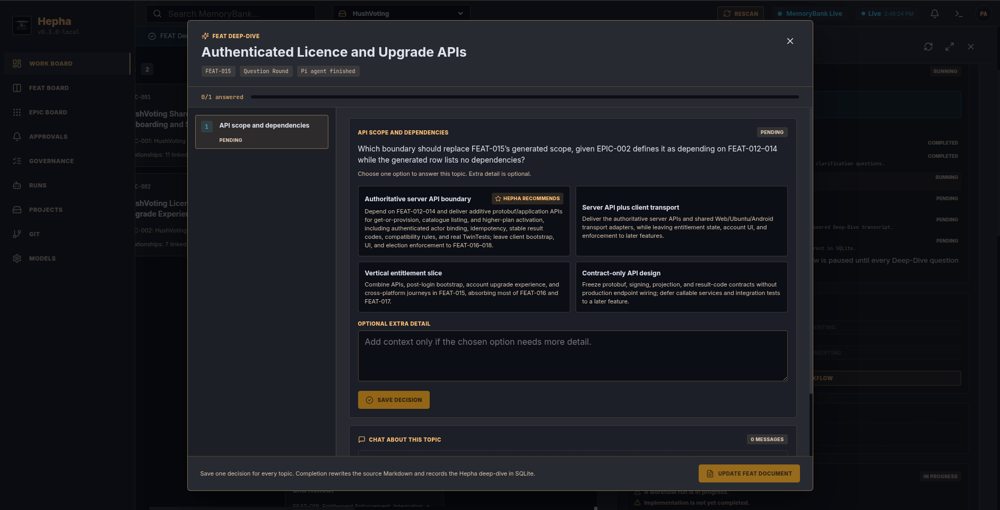
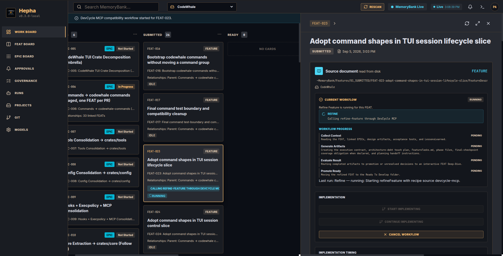
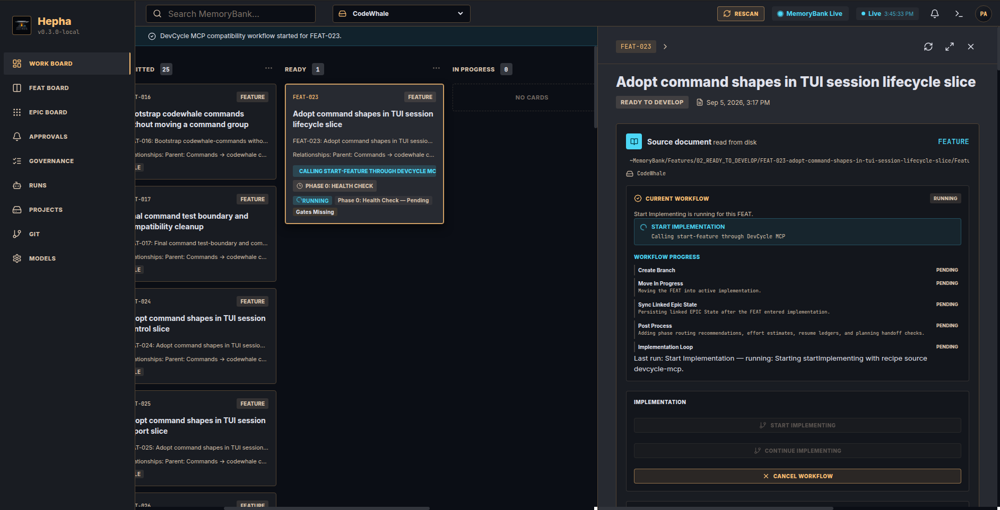
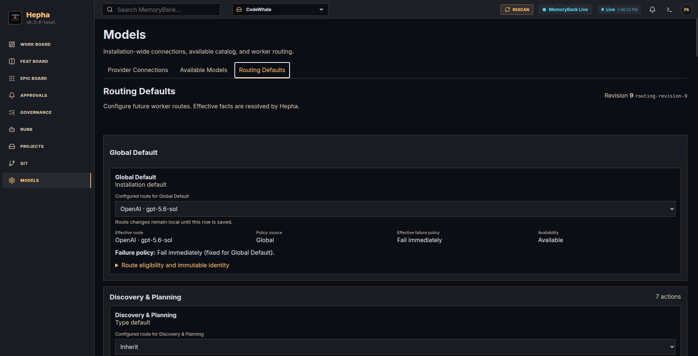

<p align="center">
  
</p>

<h1 align="center">HEPHA</h1>

<p align="center">
  <strong>A local-first, human-supervised software factory.</strong><br>
  Turn product intent into auditable implementation through EPICs, FEATs, phases, and tasks.
</p>

<p align="center">
  <a href="LICENSE"></a>
  <a href="https://github.com/aboimpinto/AgenticDevelopmentProcess/actions/workflows/ci.yml"></a>
  
</p>

HEPHA is an agentic development platform for teams that want meaningful AI
leverage without giving up human judgment. It combines a product-oriented work
board, a durable orchestrator, local coding agents, explicit approval points,
and evidence-based verification in one workflow.

The human decides what should be built, resolves important ambiguity, chooses
when implementation may begin, and retains authority over sensitive or
irreversible actions. Agents handle the repeatable work between those control
points. More autonomy can be granted deliberately; it is never silently
assumed.

> HEPHA is under active development. The core workflow is operational, but the
> interfaces and storage contracts may still change before the first stable
> release.



## From product intent to verified delivery

HEPHA progressively reduces ambiguity until an agent receives work that is
small, bounded, and testable:

```text
EPIC  ->  FEAT  ->  Phase  ->  Task  ->  Implementation  ->  Evidence  ->  Acceptance
 why       what     order      action         agent             proof          human
```

- **EPICs** express a product objective and its boundaries.
- **FEATs** define independently deliverable capabilities.
- **Phases** establish implementation and verification order.
- **Tasks** give agents concrete, executable work.
- **Evidence** connects acceptance criteria to automated or manual proof.

The project MemoryBank remains the portable source of product intent. HEPHA
reads those Markdown artifacts from disk and stores orchestration state,
questions, runs, checkpoints, and recovery information locally.

## A supervised workflow, not a black box

HEPHA uses the board as a control surface rather than treating development as
one long prompt.

1. **Register a local project.** HEPHA discovers its repository, MemoryBank,
   workflow state, and project rules.
2. **Capture an EPIC or FEAT.** Work can originate in HEPHA or in existing
   Markdown files.
3. **Resolve ambiguity.** A Deep-Dive presents focused decisions to the human
   and records the answers in the source document.
4. **Refine the feature.** HEPHA builds the execution contract, phases, tasks,
   dependencies, estimates, and verification obligations.
5. **Authorize implementation.** The human intentionally moves a prepared FEAT
   into implementation.
6. **Run and recover.** Specialist agents implement, test, review, and repair
   in bounded phases while the orchestrator persists progress.
7. **Verify and accept.** Delivery status is based on evidence, not simply on
   whether an artifact or agent response exists.



Read [SUPERVISION.md](SUPERVISION.md) for the current control model and planned
supervision profiles.

## Product tour

### Resolve product decisions with a human in the loop

Deep-Dive turns unresolved scope or dependency questions into explicit choices.
HEPHA can recommend an option and explain the trade-offs, but the decision is
saved only after the human answers.



### Turn an approved feature into an execution contract

Refine Feature reads the FEAT, linked EPICs, design artifacts, acceptance
criteria, project rules, and learned context. It creates bounded phases and
tasks, or routes unresolved decisions back into Deep-Dive.



### Start implementation consciously and follow it live

Implementation begins from an explicit workflow action. HEPHA shows the active
step, keeps durable progress, and exposes pause, cancellation, recovery, and
review states instead of hiding them inside an agent session.



### Route different jobs to appropriate models

Provider connections and model routing are installation-wide configuration.
Routes can be selected globally or by action type, with their effective policy
visible before a worker runs. Credentials must remain local and must never be
committed to the repository.



The screenshot set and its public-use review are documented in
[docs/images/screenshots/README.md](docs/images/screenshots/README.md).

## What HEPHA already provides

- A project registry for multiple local repositories and MemoryBanks.
- EPIC and FEAT boards backed by real filesystem lifecycle state.
- Interactive Deep-Dive clarification with durable decisions.
- UI-requirement classification, design hand-off, and feature refinement.
- Board-driven workflow commands and resumable Pi agent sessions.
- Phase-by-phase implementation, code-review, and remediation loops.
- Acceptance-criterion coverage linked to automated and manual evidence.
- Git, branch, worktree, run, approval, and governance visibility.
- Installation-wide provider configuration and task-aware model routing.
- Deterministic stop conditions for blockers, safety gates, and no-progress
  recovery.

## Architecture

```text
React dashboard (Vite, port 5173)
        |
        | HTTP + server-sent events
        v
TypeScript orchestrator (port 4317)
        |
        +-- workflow state machine and job queue
        +-- approvals, policy gates, and recovery
        +-- project/MemoryBank and Git adapters
        +-- model router and run/event log
        |
        v
Pi coding-agent sessions in the selected local project

SQLite stores local orchestration state; Markdown remains portable project intent.
```

The old DevCycle MCP workflow is migration input and an optional compatibility
recipe source, not HEPHA's product architecture. The direction is native,
versioned workflows with explicit contracts and observable state transitions.

Useful technical references:

- [Product vision](docs/product/vision.md)
- [Workflow lifecycle](docs/workflow/lifecycle.md)
- [Harness contract](docs/architecture/hepha-harness-contract.md)
- [Workflow control-flow map](docs/architecture/workflow-control-flow-map.md)
- [System architecture](docs/architecture/system-architecture.md)
- [Project-local HEPHA assets](docs/architecture/project-setup-and-hepha-assets.md)

## Quick start

For a first end-to-end product-decision walkthrough, use the bundled
[supervised demo](docs/getting-started-supervised-demo.md). It creates a
separate synthetic project, provisions the current project-local workflow
assets, and takes you from registration to a durable Deep-Dive decision without
risking a real codebase.

### Prerequisites

- Linux or WSL
- Node.js 24
- pnpm 11
- Git
- A working [Pi coding agent](https://pi.dev/) installation for agent-backed
  workflows

### Install and run

```bash
git clone https://github.com/aboimpinto/AgenticDevelopmentProcess.git
cd AgenticDevelopmentProcess
pnpm install
cp .env.example .env
pnpm dev:all
```

Open the dashboard at <http://127.0.0.1:5173>. The orchestrator health endpoint
is available at <http://127.0.0.1:4317/api/health>.

`pnpm dev:all` starts the orchestrator first, waits for its health endpoint,
and then starts the dashboard. Run the processes separately when needed:

```bash
pnpm --filter @hepha/orchestrator dev
pnpm --filter @hepha/web dev
```

Provider connections, credentials, and routing are configured from **Models**
inside HEPHA. Do not place API keys in tracked configuration or project
documents. See [SECURITY.md](SECURITY.md) before sharing logs or opening a
security report.

## Development checks

```bash
pnpm typecheck
pnpm test
pnpm build
```

End-to-end tests can be run with `pnpm test:e2e` when the required local test
environment is available.

## Repository layout

```text
apps/
  orchestrator/      Workflow engine, local API, workers, and adapters
  web/               React dashboard
packages/
  agent-runtime/     Agent runtime contracts and integrations
  db/                Prisma and SQLite persistence
  shared/            Shared TypeScript contracts
docs/
  architecture/      Technical contracts and implementation design
  product/           Product vision and experience definitions
  workflow/          Lifecycle and automation policy
  research/          Source research and design lessons
pi-packages/         Project-owned Pi skills, prompts, and workflow assets
```

## Project direction

HEPHA is being developed as a supervised agentic process first. The long-term
goal is not autonomy for its own sake; it is dependable delivery with the least
human intervention appropriate to the work and risk. See [MISSION.md](MISSION.md)
and [ROADMAP.md](ROADMAP.md).

Contributions, design discussion, reproducible bug reports, and workflow case
studies are welcome. Start with [CONTRIBUTING.md](CONTRIBUTING.md), then review
the [governance](GOVERNANCE.md) and [community conduct](CODE_OF_CONDUCT.md)
contracts.

## License

HEPHA is released under the [MIT License](LICENSE).
