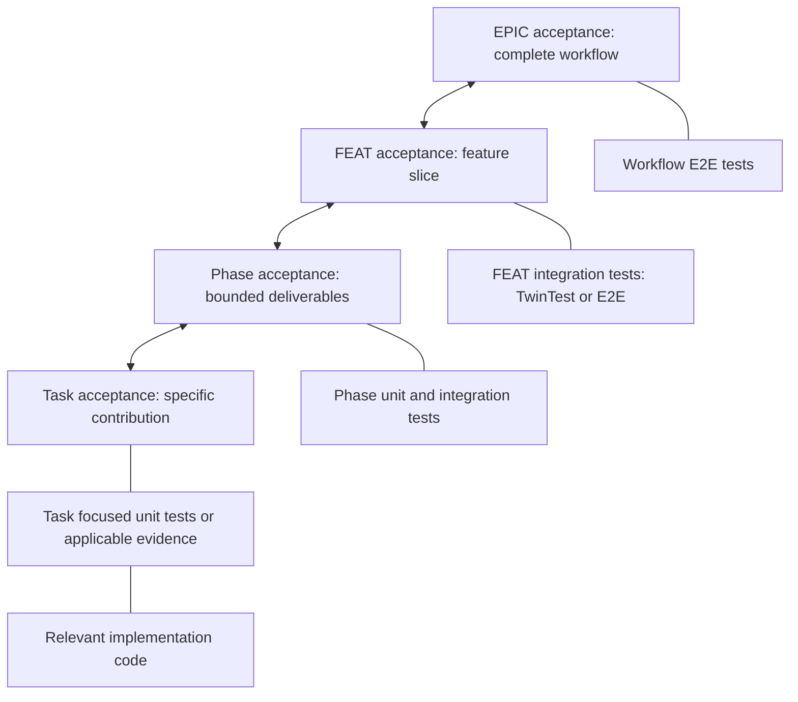
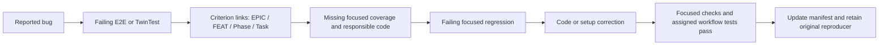

# Acceptance and integration-test traceability: EPIC to Task and back

This is the working guide for planning features, implementing changes and fixing
bugs. The normative responsibilities are defined in
[Acceptance Responsibility Policy](acceptance-responsibility-policy.md).

**Phase and FEAT acceptance can use isolated frontend/backend tests, while EPIC
acceptance maps to the full workflow E2E tests. A passing TwinTest does not replace
that E2E obligation.**

## Responsibility and evidence

| Level | Acceptance owner | Applicable verification | Links to preserve |
| --- | --- | --- | --- |
| EPIC | Complete user/business workflow across its horizontal implementation slices | Its own complete-workflow E2E integration tests; for frontend/backend products, Gherkin/Playwright exercises the connected frontend and backend | EPIC criterion IDs, contributing FEAT criteria, workflow test IDs, execution checkpoint and results |
| FEAT | A defined feature slice and its behavior/contracts | Its own integration tests, using frontend/backend TwinTests or E2E as appropriate | Parent EPIC criterion IDs, contributing Phase criteria, test IDs and relevant workflow contributions |
| Phase | Bounded deliverables and acceptance for one implementation phase | Its own applicable unit and integration tests, together with the tasks' evidence | Parent FEAT criteria, contributing Task criteria, test identities and assigned E2E updates/execution |
| Task | One bounded implementation or documentation contribution | Focused unit tests mapped to Phase acceptance where applicable; document or other checks where appropriate | Parent Phase criteria, exact test identities, implementation locations and results |

A TwinTest isolates the frontend or backend environment so many behavior
alternatives can be tested efficiently. An E2E integration test proves the
connected workflow. Reusing controlled infrastructure is useful, but separate
green frontend and backend tests do not by themselves prove that the applications
work together. The workflow test must exercise the required connection.

These are acceptance responsibilities, not one prescribed test suite per row.
Reuse existing tests that prove a criterion. For non-browser products, use the
project's declared end-to-end surface instead of inventing a browser dependency.

Tests are executable quality gates: meaningful assertions and observed results
prove the agreed behavior. Failed required tests, unexecuted required checks and
missing required acceptance coverage block acceptance. Traceability alone is not
proof, and a green count without the required assertions is not enough.

## Coverage is many-to-many

Twenty TwinTests may cover edge cases and alternatives while five E2E scenarios
prove complete workflows. There is no requirement for one E2E test per TwinTest,
unit test, Phase criterion or Task criterion. One criterion may need several tests;
one test may support several criteria.

Align evidence by **what each assertion proves**, not by equal test counts. The
EPIC workflow tests prove overall composition and outcomes; focused tests can cover
alternatives that do not each need another full browser journey. Every required
criterion must still have sufficient evidence at its declared boundary.

Downward links describe decomposition and test ownership. Upward links show how
bounded contributions support acceptance. They do not allow lower-level passes to
replace a separately required higher-level test.

## Planning and implementing a new feature

1. **Create or refine the EPIC.** Define stable acceptance IDs for the complete
   workflows, expected outcomes and boundary conditions. Identify the connected
   E2E surface and scenarios. Slice the implementation into FEATs and retain which
   EPIC criteria each FEAT contributes to.
2. **Define FEAT acceptance.** Describe that slice's observable behavior and
   contracts. Assign its integration evidence (TwinTest or E2E), and link required
   updates to EPIC workflow tests. A partial slice can contribute to a workflow
   without pretending it already proves the finished EPIC.
3. **Refine phases.** Map each Phase criterion to FEAT criteria. Declare test and
   code-review applicability independently, with scope reasons. Identify the unit
   and integration evidence needed for the phase. Explicitly assign both E2E test
   updates and the phase/checkpoint where the full workflow must execute.
4. **Define tasks.** Map each task to its Phase criterion and planned focused
   tests. Record the implementation boundary to change. A documentation or
   data-declaration task need not invent an executable test when none applies.
5. **Implement and maintain the manifest.** Add or update tests and implementation
   together. Update identities and links when tests or code move, are renamed or
   replaced. Run applicable checks and attach observed results to those tests.
6. **Accept each level against its own obligations.** Task and Phase results
   contribute to FEAT acceptance; FEAT results contribute to EPIC acceptance.
   Run full-workflow E2E at its assigned checkpoint. Preserve any outstanding
   higher-level obligation instead of treating local green tests as its result.

A UI-only phase may require frontend TwinTests **and changes to E2E scenarios**.
It need not run a new browser scenario for every phase criterion. Refinement must
name where the affected E2E scenarios run and pass; their obligation cannot vanish
when the UI phase is accepted.

## Manifest and evidence contract

Use `FeatureDescription.md` as the feature's test-manifest entry point, with links
to existing phase, EPIC and shared project artifacts. Do not create another
unconnected inventory. The storage representation can follow the project's
existing contract; retain these traceability facts:

| Record | Facts to retain |
| --- | --- |
| Acceptance criterion | Stable ID, level, expected behavior, parent criterion IDs and owning feature/phase/task |
| Test | Stable identity and location, verification level/boundary, criterion IDs covered, relevant implementation references, configured check/command and working context |
| Execution ownership | Phase/checkpoint responsible for executing the test; distinguish writing/updating a test from running it |
| Result evidence | Actual outcome and durable execution/report references, including relevant failures and limitations |
| Applicability decision | Required or not applicable, scope reason, and recorded revisions when development changes the decision |

The TestPlan/inventory binds tests through their configured repository, project
or assembly, suite/namespace, source location and native identity where available.
Displayed names need not be unique, including between TwinTests and E2E tests.
Parameterized cases may share a label. Native report occurrences without a
distinct ID receive report-local references; these are evidence addresses, not
stable TestPlan IDs. Preserve many-to-many criterion mappings and inspect the
actual assertions. Neither unique names nor a larger passing count proves that
the inventory is implemented or that its acceptance coverage is sufficient.

`runId` and execution timestamps are useful audit metadata. Missing audit metadata
alone does not negate otherwise valid results. It also does not justify accepting
old or unrelated evidence: bind results to the actual checks and relevant scope.
A file's existence, a generated report or a zero-test command does not prove a pass.

When declaring E2E execution at a later checkpoint, retain the owner and pending
obligation in the manifest. Do not merely mark the earlier phase's E2E row N/A and
lose the higher-level requirement.

## Assess meaningful coverage before every acceptance

The coverage questions are the same for Task, Phase, FEAT and EPIC acceptance,
and for bug repair:

1. Is the evidence sufficient for the agreed acceptance scope?
2. Do the tests assert the important behavior and relevant risks?
3. What important behavior, alternative or failure path is still unproved?

Inspect the actual test setup, actions and assertions. A referenced test name or
green result does not show whether it asserts the required outcome. Explain why
an incorrect implementation would fail the test, and whether the test exercises
the required boundary. Consider relevant alternatives, edge cases, invalid inputs,
failure/recovery paths and integration contracts without inventing requirements
outside the accepted scope.

For every applicable criterion, record either sufficient evidence with exact
assertion references or a specific gap: missing behavior, why it matters, and the
owning task/phase. Add meaningful coverage for required gaps, update the manifest,
run the affected tests and reassess before acceptance. Higher-level E2E execution
remains at its assigned checkpoint; this does not require every alternative to be
retested at every layer. Explicitly non-applicable gates remain non-applicable.

Coverage percentages and counts help find blind spots. They do not decide whether
acceptance behavior is proved. Tests that execute every line but never check the
outcome can miss a critical defect. Conversely, additional tests that repeat an
already-proven assertion solely to increase a number add no acceptance evidence.
Report configured numeric thresholds separately from the behavioral assessment.

## Trace a bug from evidence back to code

1. Reproduce the reported behavior with a failing E2E or TwinTest at the
   appropriate boundary. Retain its setup, action, expected outcome and failure.
2. Follow its criterion links from EPIC/FEAT to the relevant Phase and Task.
   Inspect the mapped implementation references and existing focused tests.
3. Identify what was not covered: a missing alternative, an incorrect assertion,
   a contract mismatch, fixture/configuration issue or an integration boundary.
4. Add an appropriate failing focused regression test. When the defect belongs to
   code behavior, identify the missing unit coverage and responsible code. An
   infrastructure defect may instead need focused integration/configuration
   evidence; do not force a meaningless unit test.
5. Fix the responsible code or setup. Run the focused regression, affected unit
   and integration checks, and the assigned workflow E2E checks. Preserve the
   original higher-level reproducer and confirm that it now passes.
6. Update the manifest, acceptance mappings and evidence. Record why the original
   coverage missed the defect and what now proves the repair.

## Gate decisions and automatic completion

Follow the [common phase completion policy](phase-completion-policy.md).
Need Code Review and Need Test Coverage are independent flags: 0/0, 0/1, 1/0
and 1/1 are all valid. Refine Feature assigns them from intended work. Phase
identifiers, role names, source-file extensions and test counts do not select
gates. Documentation, DTO work and health checkpoints are examples of possible
configurations, never structural exceptions. A checkpoint may run declared build,
lint and existing-test commands even when both flags are 0.

A developer may revise applicability with a scope reason and synchronized contract,
future task declarations and evidence projections. Preserve actual failures and
unresolved findings; they are not reasons to declare a gate irrelevant. A phase
with no applicable test/review obligations can finish automatically once its other
declared tasks and gates are satisfied.

Ordinary missing coverage, failed tests and review findings keep the phase active
in its repair loop; they prevent advancement, not continued repair. Validate
meaningful progress after attempts, reassess repeated unchanged failures, and
escalate a genuine architectural/authority impasse with the exact help needed.
Once the required tasks, both applicable flags and other declared checks are
satisfied, record completion and proceed to the next phase within the workflow's
authority.

## Where this policy is applied

HEPHA shares the policy across native EPIC creation/refinement, FEAT creation and
slicing, Deep-Dive, phase/task planning and verification. New EPIC and FEAT
renderers include its ownership table. The DevCycle MCP injects the same versioned
responsibility policy into planning and delivery recipes, including EPIC creation,
feature slicing, refinement, implementation, review and acceptance.

Existing project acceptance artifacts are not automatically rewritten by this
change. Reconcile them during the next applicable planning or implementation
operation, preserving accepted intent, IDs, actual evidence and outstanding
workflow obligations.

## Project-owned command declarations

Follow the [TestPlan authoring policy](project-test-plan-authoring.md). Refinement discovers commands
statically; developers validate and maintain them in FeatureDescription.md. Phase
files reference check IDs. Preparation, source inputs, generated outputs and evidence
locations belong to the project declarations, not framework-specific HEPHA rules.
This prompt contract does not yet change runtime source snapshot handling.
