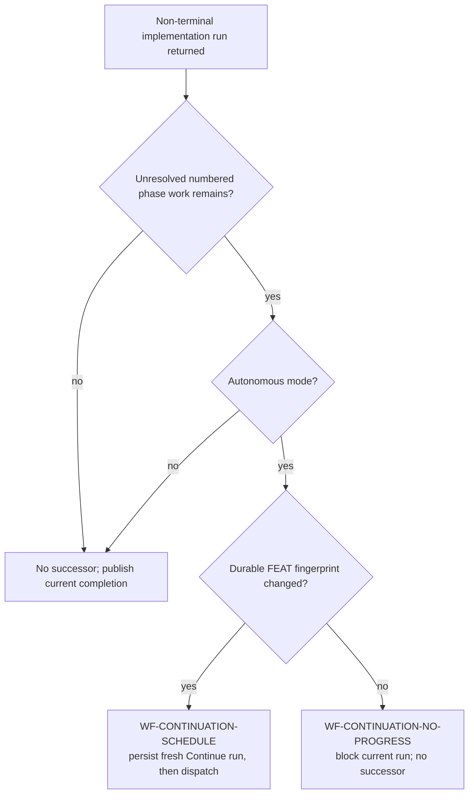

# Terminal And Cross-Run Continuation Circuit

## Purpose

This document defines the normal end of autonomous implementation and the
separate safety circuit that prevents equivalent Continue Implementation runs
from being created forever.

The primary rule is intentionally simple:

> When authoritative reconciliation proves every declared task and numbered
> phase terminal, implementation is complete. Hepha stops dispatching workers
> and asks the user to perform Manual Code Review and Manual Tests.

The no-progress circuit is not an alternative completion policy. It applies
only when phase work is genuinely unresolved after a non-terminal run.

Normative transition IDs:

- `WF-CONTINUE-RECONCILE`
- `WF-CONTINUE-TERMINAL`
- `WF-CONTINUATION-SCHEDULE`
- `WF-CONTINUATION-NO-PROGRESS`
- `WF-PHASE-NO-PROGRESS` for the separate in-run phase circuit

## Authority hierarchy

Terminality must be decided once, at the layer that owns all required evidence.

1. The phase document's explicit `## Phase Task Ledger` owns executable task
   identities and checked state.
2. `PhaseStateReconciliationApplication.reconcile` combines those tasks with
   required phase-gate evidence and phase status.
3. Reconciliation may promote a phase only when every declared task is checked
   and every required blocking gate is settled with justification.
4. When every numbered phase has reached that state, reconciliation returns
   `allTerminal: true` (`all_terminal` at the policy boundary).
5. `ContinueImplementationRunApplication` treats that decision as final and
   records implementation completion.
6. MemoryBank scanner projections may present changed files, reviews, warnings,
   and quality evidence. They cannot reopen an authoritative terminal decision.
7. Coverage percentages and coverage availability are advisory telemetry. A
   `Test coverage` row is not the blocking `Tests` gate.
8. `AutonomousContinuationScheduler` is never consulted by the terminal branch.

This hierarchy prevents two readers from jointly creating a state that neither
reader intended: one reader saying "complete" while another says "schedule
work".

## Normal happy path

```mermaid
sequenceDiagram
  participant User
  participant Continue as ContinueImplementationRunApplication
  participant Reconcile as PhaseStateReconciliationApplication
  participant Phase as Phase document + FeatureTasks
  participant Metadata as Workflow metadata

  User->>Continue: Continue Implementation
  Continue->>Reconcile: reconcile current durable FEAT
  Reconcile->>Phase: read ordered tasks, required gates, phase status
  Phase-->>Reconcile: all tasks checked; gates settled; phases terminal
  Reconcile-->>Continue: allTerminal = true
  Continue->>Metadata: record workflow completion
  Continue-->>User: Manual Code Review and Manual Tests required
  Note over Continue: No worker dispatch
  Note over Continue: No queue re-entry
  Note over Continue: No continuation scheduler call
```

The same terminal check runs after a worker returns. If that worker completed
the final task and reconciliation promotes the final phase, the current run
ends through the same `WF-CONTINUE-TERMINAL` transition.

## Non-terminal continuation path

A fresh autonomous continuation is useful when a productive run has settled one
piece of durable work but another phase task remains. It is not a generic retry.

Before entering a worker/reconciliation boundary, the run captures a SHA-256
fingerprint of the complete FEAT evidence folder. At the outer boundary it
captures the folder again.



`WF-CONTINUATION-SCHEDULE` persists the fresh run before dispatching it. The
fresh run receives a new workflow ID and begins at `refresh-current-feature`.

## Decision table

| Authoritative reconciliation | Unresolved phase work | Autonomous | Fingerprint changed | Outcome |
| --- | --- | --- | --- | --- |
| `all_terminal` | no | either | irrelevant | `WF-CONTINUE-TERMINAL`; request Manual Code Review and Manual Tests |
| non-terminal | no | either | irrelevant | no successor |
| non-terminal | yes | no | irrelevant | no autonomous successor |
| non-terminal | yes | yes | yes | `WF-CONTINUATION-SCHEDULE` |
| non-terminal | yes | yes | no | `WF-CONTINUATION-NO-PROGRESS`; block current run |

There is intentionally no row where a secondary scanner vetoes
`all_terminal`. If required blocking evidence is genuinely missing,
reconciliation must not return `all_terminal` in the first place.

## What counts as durable progress

`capturePhaseDurableProgressFingerprint` hashes every file under the active FEAT
folder in deterministic relative-path order. This includes phase documents,
`FeatureTasks.md`, review artifacts, task/checkpoint evidence, planning evidence,
and other FEAT-owned durable records.

The following do not independently prove workflow progress:

- a new workflow ID;
- an updated SQLite current-step string;
- another dashboard refresh;
- another scheduler invocation;
- CPU activity;
- repeated progress-log text;
- production-source edits that never settle or invalidate corresponding durable
  FEAT evidence.

A run may schedule a successor only after durable workflow evidence changes.
This is evidence-based and has no arbitrary retry count.

## Blocked-state contract

When unresolved autonomous work returns unchanged, the scheduler records the
current workflow run as:

- status: `blocked`;
- node: `continuation-circuit`;
- step: `Awaiting user decision at the continuation boundary`;
- error prefix: `WORKFLOW_AWAITING_USER_DECISION`;
- evidence: before and after fingerprints;
- actions: repair the authority mismatch and choose Continue Implementation, or
  Cancel.

The circuit does not uncheck tasks, reopen completed phases, mutate production
files, or create a successor workflow ID.

## Relationship to the phase-local circuit

There are two different resource-protection boundaries.

| Circuit | Scope | Detects | Transition |
| --- | --- | --- | --- |
| Phase no-progress | Inside one `AutonomousImplementationWorkflowApplication.executePhases` invocation | Same phase, route, decision, and fingerprint after a recovery cycle | `WF-PHASE-NO-PROGRESS` |
| Continuation no-progress | Between workflow runs | Unresolved autonomous work with identical before/after FEAT fingerprints | `WF-CONTINUATION-NO-PROGRESS` |

The phase-local circuit cannot detect a loop that exits the phase executor,
returns `complete`, and then creates a fresh workflow run. Its in-memory
observation state ends with that executor invocation. The outer circuit exists
specifically for this boundary.

Neither circuit handles terminal completion. `all_terminal` exits before both.

## Coverage namespace rule

The Quality Gate Evidence table can contain both lifecycle gates and telemetry:

```text
Tests         | satisfied / waived / not applicable
Test coverage | measured result or missing/unavailable remark
```

`phase-quality-projection.ts` must classify `Tests` as the blocking tests gate
and must ignore `Test coverage` as a lifecycle-gate key. A generic
`label.includes("test")` parser is invalid because the later coverage row can
overwrite the Tests decision in a map.

Coverage may still be shown in the UI and completion evidence. Its percentage,
missing baseline, unavailable report, timeout, or instrumentation failure cannot
block phase or FEAT progression.

## Why the previous documentation and tests missed the loop

The repository had extensive documentation, but its evidence stopped at the
wrong boundaries:

1. **The normal terminal transition was documented but had two predicates.**
   The diagram said all phases resolved, while production additionally asked a
   secondary scanner whether any gate was missing. The registry did not state
   which result won when those predicates disagreed.
2. **The scheduler was treated as an implementation detail.**
   It created a new durable workflow run but had no transition ID, Mermaid edge,
   or responsibility-index entry. Therefore graph review could not reveal its
   cycle.
3. **The same concept had duplicate parsers.**
   Reconciliation correctly separated coverage from Tests after the first
   repair, but `memorybank/phase-quality-projection.ts` retained the broader
   substring parser.
4. **Tests proved components in isolation.**
   Reconciliation tests proved `all_terminal`; scanner tests proved ordinary
   gate parsing; scheduler tests mocked `hasRemainingWork`. No test carried a
   phase table containing both `Tests` and `Test coverage` through
   reconciliation, terminal selection, and scheduler exclusion.
5. **The first no-progress repair covered only the inner phase loop.**
   `WF-PHASE-NO-PROGRESS` was correct within `executePhases`, but the observed
   loop happened after that method returned and before a fresh Continue run.
6. **The workflow-map policy checks traceability, not predicate equivalence.**
   It verifies that documented transitions have owners and tests. It cannot by
   itself prove that two production projections use the same terminal
   authority or that every runtime-created workflow ID has a documented edge.
7. **The UI hid run churn behind one positional label.**
   Rapidly changing workflow IDs repeatedly projected the same Phase 6 step, so
   the dashboard looked frozen even though the host was actively cycling.

The lesson is not that more prose was needed. The missing protection was an
end-to-end authority assertion at the boundary where a new workflow run is
created.

## Required regression evidence

The circuit remains protected by generic tests:

- `phase-quality-projection.test.ts` proves `Test coverage` cannot overwrite
  `Tests`;
- `continue-implementation-run-application.test.ts` proves authoritative
  terminal reconciliation completes before worker dispatch and never calls the
  scheduler, even if a secondary projection claims a missing gate;
- `autonomous-continuation-scheduler.test.ts` proves durable progress schedules
  one successor, unchanged evidence blocks, resolved work does nothing, and
  interactive mode does not autonomously schedule;
- `generic-continue-implementation-run.feature` describes the terminal happy
  path;
- `generic-autonomous-continuation-scheduling.feature` describes the cross-run
  circuit;
- the workflow-map policy requires both continuation transition IDs to retain a
  Mermaid edge, production owner, unit test, and Gherkin evidence.

## Operational diagnosis

If the dashboard appears stuck after a phase reports completion:

1. Verify whether workflow IDs are changing.
2. Verify whether a Pi/runtime worker is actually active.
3. Read the authoritative reconciliation decision.
4. Compare phase task/gate state with the scanner projection.
5. Confirm whether `WF-CONTINUE-TERMINAL` occurred.
6. If unresolved work remains, compare the before/after durable fingerprints.
7. A blocked `continuation-circuit` state is a deliberate pause, not a failed
   worker and not a reason to restart automatically.

Do not infer progress from CPU usage or repeated current-step updates.
