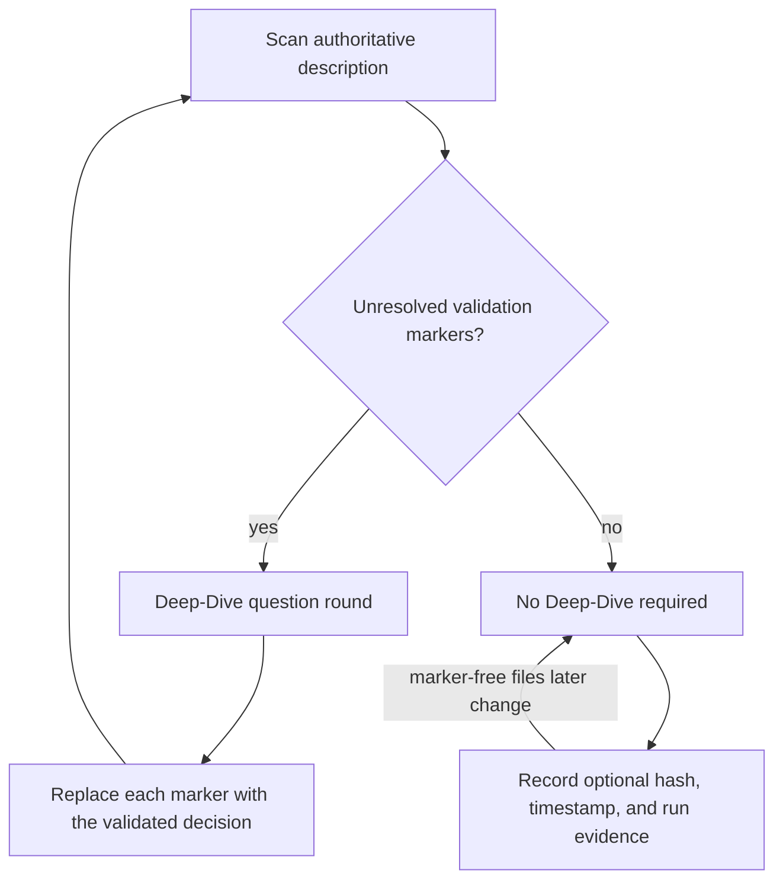

# Validation Markers And Deep-Dive Readiness

## Purpose

This document defines the generic Deep-Dive readiness rule for EPICs and
features. It never depends on a work-item ID, phase number, title, task name,
file timestamp, or historical workflow receipt.

The governing invariant is:

> Deep-Dive is required if and only if the authoritative work-item description
> contains one or more unresolved validation markers.

Both `[NEEDS VALIDATION]` and `[NEEDS_VALIDATION]` are accepted spellings.

## Authority boundary

`EpicDescription.md` or `FeatureDescription.md` owns explicit unresolved
clarification decisions. The scanner counts markers in that description.

The following remain useful evidence but are not Deep-Dive readiness authority:

- source and preparation-document hashes;
- modification timestamps;
- whether SQLite contains a previous Deep-Dive receipt;
- links added to phases or generated artifacts;
- the creation or modification of design documents;
- `FeatureTasks.md`, phase documents, planning reports, and implementation
  evidence that later workflow actions produce.

Design documents can still be supplied to a Deep-Dive worker as context. Their
presence or changed hash does not by itself reopen clarification.

## Required circuit

There is no freshness loop based on file changes. A later edit requires another
Deep-Dive only when that edit introduces a new unresolved validation marker.

## Decision and ownership boundaries

| Responsibility | Production owner | Purpose |
| --- | --- | --- |
| Count explicit unresolved markers | `countNeedsValidationTags` | Recognize both supported marker spellings without interpreting feature prose. |
| Derive readiness | `createValidationSummary` | Project marker presence as the sole Deep-Dive requirement. |
| Keep submitted readiness action-specific | `evaluateFeatReadiness` | Avoid validating files produced by Design, Refine, Start, or Continue while a FEAT is Submitted. |
| Guard preparation actions | `FeatureWorkflowTargetResolver.resolveWorkflow` | Reject only unresolved validation markers, not absent history or hash changes. |
| Project dashboard actions | `FeatureWorkflowSummaryProjector.build` | Expose preparation when marker count is zero. |
| Preserve supporting context | `readDeepDivePreparationSource` | Supply descriptions and existing design artifacts to workers without turning their hashes into gates. |
| Continue implementation | `ContinueImplementationApplication.continue` | Never open source-hash Deep-Dive recovery; marker validation occurs before this boundary. |

The UI renders this policy. It must not infer Deep-Dive necessity from missing
future artifacts, metadata availability, a stale hash, or a failed historical
workflow run.

## Why the previous behavior was wrong

One aggregate readiness evaluator mixed clarification, refinement, start, and
continuation requirements. A newly submitted FEAT therefore displayed missing
`FeatureTasks.md`, phase files, planning reports, architecture-debt artifacts,
Deep-Dive receipts, and current source hashes before the actions that create
those artifacts had run.

Linking generated phases back into a marker-free description changed its hash
and incorrectly reopened Deep-Dive. The content had changed, but no unresolved
decision existed.

## Acceptance evidence

Unit and integration coverage proves that:

- marker-free descriptions are current without SQLite metadata or prior
  Deep-Dive history;
- marker-free source changes do not become stale;
- submitted FEATs do not validate future workflow outputs;
- either supported marker spelling requires clarification;
- unresolved markers block preparation and implementation;
- design documents remain available as worker context without creating a hash
  gate;
- continuation does not invoke source-hash Deep-Dive recovery.

Primary executable specifications:

- `work-item-validation.test.ts`
- `feat-readiness-evaluator.test.ts`
- `feature-workflow-target-resolver.test.ts`
- `feature-workflow-summary-projector.test.ts`
- `continue-implementation-application.test.ts`
- `generic-design-document-deep-dive-freshness.feature`
- `generic-feature-workflow-target.feature`
- `generic-continue-implementation-application.feature`

## Non-goals

- Historical Deep-Dive evidence is not deleted; it remains audit metadata.
- UI-requirement classification may retain its own evidence policy.
- Start and Continue still validate their own execution contracts.
- Deep-Dive does not become mandatory merely because a work item is new.
