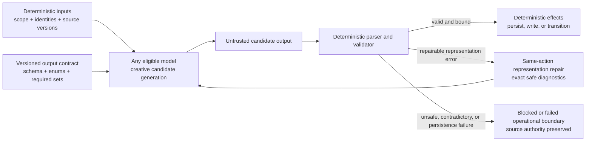

# Model-Agnostic Authority Boundaries

## Purpose

Hepha may route different workflow actions to GPT, DeepSeek, Claude, Qwen,
Kimi, or future models. A workflow must therefore remain correct when the model
on one side of a handoff differs from the model that authored the input,
designed the prompt, or executes the next action.

The governing principle is:

> The model may be creative while producing candidate analysis, questions,
> designs, plans, code, or explanations. Creativity ends at an authority
> boundary. Only a deterministic Hepha contract may validate candidate output,
> persist authority, select a transition, or mutate lifecycle state.

Using the same model for adjacent actions can hide an incomplete boundary. Two
instances of one model family may make the same unstated assumptions and use
the same synonyms, paths, headings, or JSON conventions. Replacing either side
with another capable model exposes those assumptions. That exposure is a
contract defect, not evidence that the new model is incapable of doing the
work.

This document applies to every model-producing action, including:

- Deep-Dive question generation and document update;
- UI-requirement classification and Design Feature;
- Refine Feature and refinement-to-Deep-Dive handoff;
- implementation, verification repair, and phase evidence;
- code review, fixer response, remediation response, and verification receipt;
- lessons, completion, curation, and future workflow actions.

## Creativity and authority

### Model-owned candidate work

A model may:

- analyze ambiguous source material;
- recommend one option and explain consequences;
- draft Markdown or code;
- propose test cases;
- create candidate design and planning artifacts;
- diagnose a failed check;
- summarize evidence for a human.

These outputs are proposals until a deterministic boundary accepts them.

### Hepha-owned authority

Only Hepha may:

- decide whether a response satisfies a versioned schema;
- assign or validate artifact, project, feature, phase, task, and predecessor
  identities;
- decide whether a question round, design artifact set, refinement handoff,
  review result, receipt, or gate is complete;
- persist authoritative workflow state;
- select the next workflow node;
- move a card or phase;
- mark a task, review, gate, or feature complete;
- authorize retry, fallback, recovery, review, or phase exit.

A model's prose, filename, heading, synonym, confidence, or claim of completion
is never transition authority.

## Generic boundary protocol

Every model-to-Hepha boundary should implement the same sequence:

The boundary has five stages:

1. **Bind deterministic input authority.** Supply exact scope, source versions,
   assigned identities, allowed paths, required item sets, and current schema
   version. The model must not invent them.
2. **Publish the complete output contract.** Supply exact object shape, required
   fields, enums, cardinalities, forbidden fields, and one complete valid
   example. Empty arrays are not a substitute for showing nested entry shapes.
3. **Treat output as untrusted.** Parse and validate before using any value for
   a write or transition. Do not infer a missing enum from prose.
4. **Repair representation without changing semantics.** A schema-shape error
   stays on the same action and receives the exact sanitized validation detail.
   It does not become an unexplained phase failure or permission to normalize a
   different business decision.
5. **Apply effects deterministically.** After validation, Hepha—not the
   model—writes authority, updates state, or chooses the next node.

## Required contract package

A model-producing workflow node should have one contract package from which the
runtime validator, prompt projection, examples, and tests are derived:

- `schemaVersion` and artifact/result kind;
- JSON Schema or an equivalent exact runtime schema;
- exact enum tokens and their owning actor;
- `additionalProperties: false` unless extension fields are deliberately
  versioned;
- exact assigned identities and immutable predecessor/source references;
- allowed and required paths;
- minimum and maximum collection sizes;
- cross-field rules that JSON shape alone cannot express;
- safe validation error codes and messages;
- one valid positive example per union variant;
- invalid examples for common cross-model deviations;
- deterministic fallback or repair policy;
- persistence and transition owner.

Handwritten prompt examples must not quietly become a second schema. If a
provider supports native structured output, the adapter should supply the same
schema there. If it does not, the prompt should render the same contract and a
local validator must enforce it.

## Actor-specific vocabularies

Similar words in different artifacts are not interchangeable. The contract
must name the actor and field that owns each vocabulary.

| Boundary | Field or presentation role | Examples |
| --- | --- | --- |
| Reviewer manifest | `result` | `APPROVED`, `NEEDS_CHANGES`, `BLOCKED` |
| Human fixer position | `Fixer Decision` | `FIX_PROPOSED`, `REBUTTAL_PROPOSED`, `BLOCKED_NEEDS_USER` |
| Remediation response item | `decision` | `APPLIED`, `NOT_APPLIED`, `NOT_APPLICABLE` |
| Reviewer follow-up | `Reviewer Decision` | `FIX_ACCEPTED`, `FINDING_OPEN`, `REBUTTAL_REJECTED` |
| Verification receipt | `outcome` | `VERIFIED`, `PASSED`, `FAILED`, `NOT_RUN` |
| Refine Feature result | `outcome` | `COMPLETED`, `NEEDS_DEEP_DIVE` |
| UI requirement | `decision` | `requires_ui`, `no_ui` |

A synonym may be understandable to a human and still be invalid machine
output. Strict rejection is correct at an authority boundary, but the rejection
must produce actionable same-action repair rather than an opaque workflow
failure.

Human-readable progress labels, summaries, and explanations remain
presentation only. Missing or differently formatted presentation text must not
invalidate an otherwise valid authority artifact.

## Preparation pipeline boundaries

The intended preparation sequence is:

```mermaid
flowchart LR
  Source["EPIC or FEAT source"]
  Questions["Deep-Dive candidate questions"]
  Human["Durable human answers and chat"]
  Updated["Validated source update"]
  Classify["UI requirement decision"]
  Design["Design artifact candidates"]
  Freshness["Combined preparation-source freshness"]
  Refine["Refinement candidate result"]
  DeepDiveAgain["Another durable question round"]
  Ready["Validated Ready To Develop handoff"]

  Source --> Questions
  Questions --> Human
  Human --> Updated
  Updated --> Classify
  Classify -->|"requires_ui"| Design
  Classify -->|"no_ui"| Freshness
  Design --> Freshness
  Freshness --> Refine
  Refine -->|"NEEDS_DEEP_DIVE"| DeepDiveAgain
  DeepDiveAgain --> Human
  Refine -->|"COMPLETED + valid artifacts"| Ready
```

At every arrow, the downstream action must consume deterministic persisted
facts, not assumptions that happen to be shared by the currently configured
model family.

### Deep-Dive

Question generation is creative. Hepha owns question identity, bounds,
normalization, durable sessions, answer status, and the decision that all
answers are ready. A model failure may use a deterministic fallback question
round. It must never fabricate user answers or mark clarification complete.

Document rewriting is creative. Hepha owns the source identity, saved answer
transcript, source write, freshness evidence, and completion decision. A model
rewrite failure may use the deterministic decision-section update; model output
alone cannot mark the Deep-Dive current.

### Design Feature

Design analysis and artifact content are creative. Hepha owns the exact
required artifact set, allowed paths, content validation, freshness effect, and
workflow completion. A model's statement that design is complete is not
sufficient.

### Refine Feature

Planning content and topology are creative within accepted FEAT authority.
Hepha owns the `COMPLETED | NEEDS_DEEP_DIVE` result contract, artifact paths,
phase-contract schema, debt touch-plan contract, Ready folder, source
confirmation, and transition receipt.

An unresolved user-owned decision must become a valid `NEEDS_DEEP_DIVE`
handoff, not `FAILED`, guessed planning, or a synonym. A `COMPLETED` claim is
accepted only after independent artifact and transition validation.

## Current implementation audit

This table records the migration state observed in July 2026. It is deliberately
honest about boundaries that appear schema-backed in YAML but are not yet
runtime-equivalent.

| Boundary | Current protection | Cross-model gap to remember |
| --- | --- | --- |
| Deep-Dive questions | Runtime prompt requests JSON; parser normalizes bounded questions; deterministic fallback exists | `.workflows` points to `deep-dive-questions.schema.json`, but that schema currently describes `id/prompt/why` while the runtime prompt/parser use `topic/prompt/recommendedOptionLabel/options`. A model following the declared schema can be rejected or silently replaced by fallback. |
| Deep-Dive document update | Source and answers are deterministic; rewrite failure has deterministic fallback | YAML declares `deep-dive-document-update.schema.json` with a JSON `content` field, while the runtime prompt expects raw Markdown. The declared schema is not the runtime response contract. |
| UI-requirement classification | Prompt requests JSON and code returns one of two internal decisions | Unknown or misspelled decisions currently normalize to `no_ui`; this may silently convert representation error into lifecycle authority. Cross-model-safe behavior should validate the exact enum or use an explicit deterministic classifier decision. |
| Design Feature | Required filenames must exist and be non-empty before completion | YAML declares `design-feature-files.schema.json`, but runtime completion does not parse the worker response against it. It validates filesystem presence only, so response-schema compliance and artifact semantics are not yet one boundary. |
| Refine Feature | Exact runtime parser, exact keys, enum outcomes, path allowlist, artifact validation, transition receipt, deterministic recovery | Strongest preparation boundary. Remaining drift risk comes from separately maintained JSON Schema, command examples, TypeScript parser, and artifact validators. The generic workflow runner validates that `output_schema` exists but does not automatically enforce it for every prompt node. |
| Review remediation | Strict V1 schemas, immutable bindings, response-before-receipt persistence, actionable repair diagnostics | Continue deriving prompt projection and validators from one contract source. Do not let human Fixer Decision fields leak into V1 remediation item fields. |

The existence of `output_schema` in workflow YAML currently proves that the
asset exists and is portable. It does not by itself prove that every runtime
adapter injects the schema into the model request or validates the response
against it. Treat those as separate acceptance requirements.

## Cross-model conformance requirements

Before routing an existing authority-producing action to a new model family,
run a provider-neutral conformance suite that proves:

1. every valid union variant is accepted;
2. enum capitalization and exact tokens are explicit;
3. synonyms are rejected with actionable diagnostics;
4. missing, additional, duplicate, and wrong-type fields are rejected;
5. prose or Markdown fences follow the documented parser policy;
6. assigned IDs, scope, source hashes, and predecessors cannot be replaced;
7. collection bounds and required item sets are enforced;
8. model claims do not bypass filesystem, artifact, receipt, or state checks;
9. repair stays on the same action and does not mutate lifecycle authority;
10. deterministic fallback does not silently claim the model-produced result;
11. the same fixtures pass through every provider adapter;
12. logs identify representation failure separately from semantic, provider,
    persistence, and workflow failures.

Tests should include common model-dependent deviations, for example:

- `needs_changes`, `CHANGES_REQUIRED`, or explanatory prose instead of
  `NEEDS_CHANGES`;
- a human fixer token where a remediation item token is required;
- a schema from an older prompt version;
- a complete-looking response with invented IDs;
- JSON wrapped in commentary;
- valid JSON with additional convenience fields;
- a declared output-schema shape that differs from the runtime parser shape;
- files written correctly but a malformed terminal result;
- a valid terminal result claiming files that were not written;
- a model-selected transition that conflicts with deterministic source state.

## Failure classification

Do not report every boundary rejection as “the phase failed.” Preserve the
actual category:

| Category | Meaning | Expected route |
| --- | --- | --- |
| Representation error | Candidate cannot satisfy the declared shape | Same-action schema repair with exact safe diagnostic |
| Semantic contract error | Shape is valid but required meaning, membership, or cross-field invariant fails | Same action if safely repairable; otherwise explicit blocker |
| Missing user authority | A real product/scope decision is unresolved | Durable Deep-Dive handoff |
| Invalid claimed artifacts | Result claims completion but filesystem/artifact validation fails | Repair/retry; no lifecycle advancement |
| Provider/runtime failure | Model could not run or route safely | Runtime recovery policy; no invented business result |
| Persistence failure | Valid authority could not be committed/read back | Fail closed; candidate output is not authority |
| Stale source | Input authority changed across the handoff | Recompute/re-run the owning action; never apply stale output |

## Diagnostic checklist

When a workflow works with one model but fails with another:

1. Identify the exact boundary and actor-owned output field.
2. Read the workflow node's `output_schema` and the runtime prompt.
3. Compare both with the actual parser and validator—field by field.
4. Check whether the schema is merely asset-validated or actually enforced at
   runtime.
5. Inspect the raw candidate output without treating it as authority.
6. Record the exact validator code/message and whether it reached the repair
   prompt.
7. Verify that no synonym, default, fallback, or normalization silently changed
   the model's decision.
8. Check source, scope, IDs, and predecessor freshness.
9. Run the same contract fixtures through the currently selected provider
   adapter and at least one structurally different fixture.
10. Add a generic unit test at the parser/validator boundary and a Gherkin test
    for the complete workflow route before changing prompts or accepting a new
    interpretation.

## Documentation and change rule

When a model-boundary issue changes routing, retry, recovery, persistence, or
completion behavior:

1. update `workflow-control-flow-map.md`;
2. add or update the transition in `workflow-transition-registry.json`;
3. add a causal record to `workflow-change-justification-log.json`;
4. add generic unit and Gherkin evidence;
5. update the canonical schema first, then derive prompt projection, examples,
   and runtime validation from it.

Model-specific prompt tuning may improve quality, but it must not redefine an
authority contract. Provider adapters may differ in how they request structured
output; they must converge on the same validated Hepha result.
