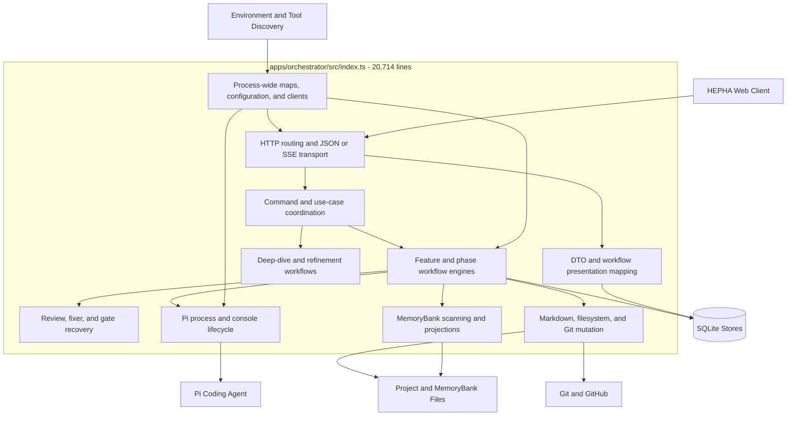
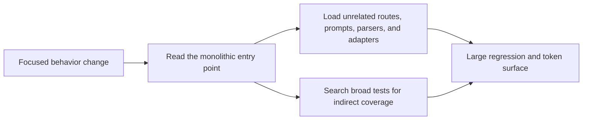
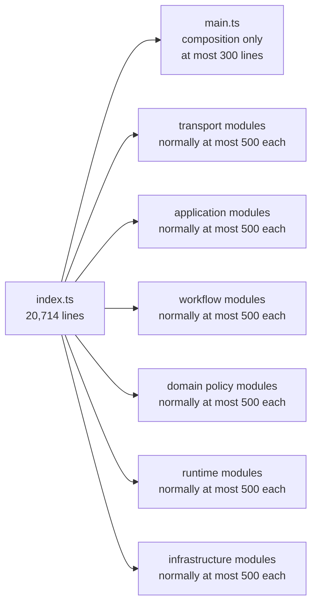
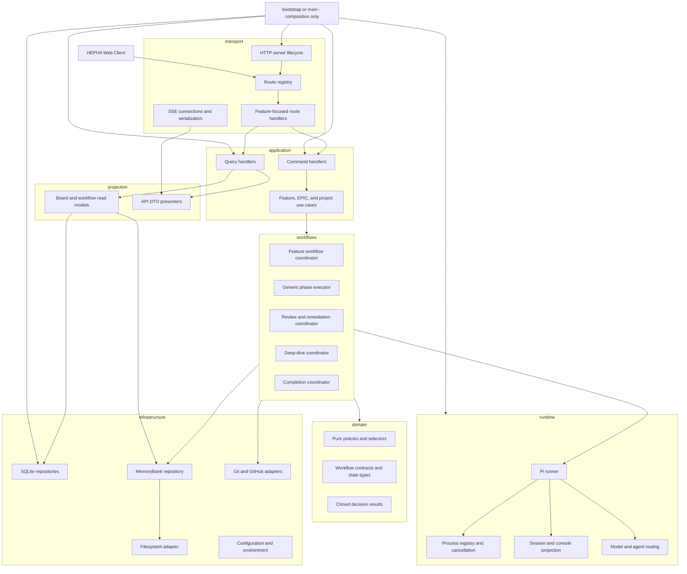
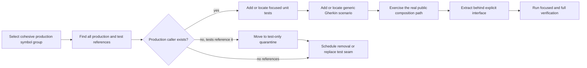
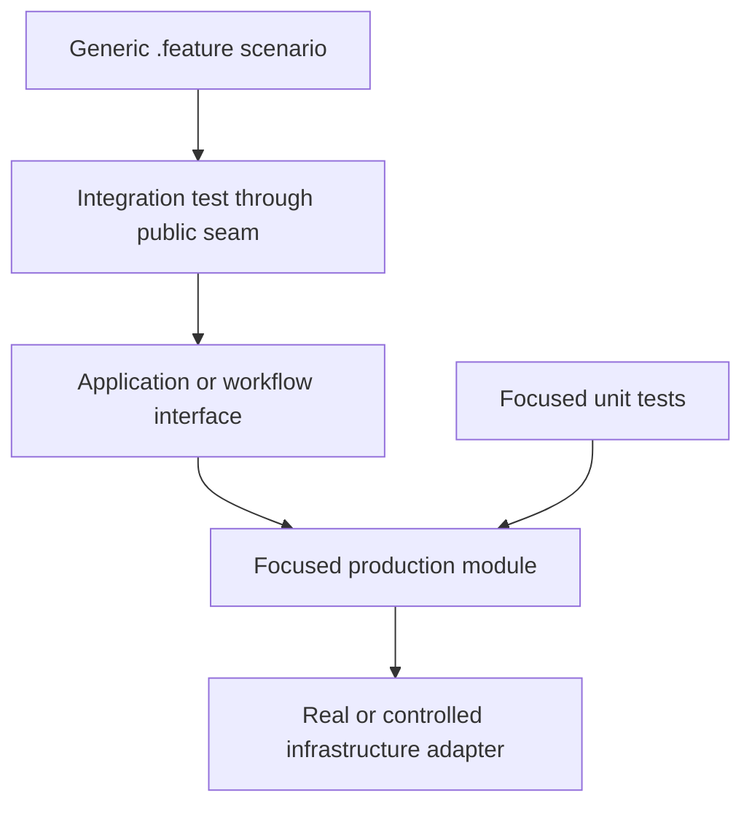

# Orchestrator Modularization Refactor

## Decision

HEPHA's orchestrator was refactored directly rather than through a HEPHA
EPIC or FEAT because the work changes the workflow engine that would otherwise
execute and govern its own refactor.

This is an architectural extraction, not a rewrite. Observable HTTP contracts,
workflow decisions, durable state, recovery behavior, and Pi execution behavior
must remain stable while responsibilities move behind explicit module
boundaries.

The production-file ceiling is 1,000 lines. The preferred size is at most 500
lines. A file between 500 and 1,000 lines requires one cohesive responsibility;
crossing 1,000 lines is a decomposition failure, not a formatting concern.

## Baseline

At the start of this refactor on 2026-07-20:

- `apps/orchestrator/src/index.ts` contains 20,714 lines;
- it contains approximately 677 top-level declarations;
- it owns HTTP routing, process-wide runtime state, workflow application
  services, phase execution, Pi process management, filesystem mutation, Git
  coordination, MemoryBank scanning, SSE projection, and presentation helpers;
- the largest HTTP handler alone spans more than 1,100 lines;
- the same file contains both high-level use-case sequencing and low-level
  parsing, child-process, Markdown, filesystem, and response-writing helpers.

The size is a symptom. The defect is that dependencies point through one
composition unit, so a human or LLM must load unrelated behavior to understand
one workflow seam.

## Current Architecture



### Current change cost



## Target Architecture

`main.ts` or its eventual replacement remains a composition root. It may load
configuration, instantiate adapters, register routes, start the worker loop,
and handle shutdown. It must not contain domain policy, workflow decisions,
Markdown mutation, command-specific orchestration, or child-process parsing.

### End-state size budget

The refactor does **not** move the current monolith into another large file.
The intended end state is:

| Surface | Current | Target |
| --- | ---: | ---: |
| `apps/orchestrator/src/index.ts` | 20,714 lines | Cohesive composition root, never more than 1,000 lines; 957 lines at closure |
| `apps/orchestrator/src/main.ts` | Not present | Optional future entry-point rename; no second composition root is required |
| Typical extracted production module | Mixed into the monolith | At most 500 lines |
| Exceptional cohesive production module | Mixed into the monolith | More than 500 but never more than 1,000 lines |

Crossing 500 lines triggers a responsibility review. Crossing 1,000 lines
requires decomposition before the extraction is considered complete. The
5,458-line `packages/db/src/index.ts` listed later in this document is a
separate existing hotspot, not the proposed size of the extracted orchestrator
entry point.





### Dependency rules

1. Transport depends on application interfaces, never on workflow internals.
2. Application handlers coordinate use cases but contain no filesystem,
   child-process, Markdown, or HTTP implementation details.
3. Workflow coordinators depend on domain policies and infrastructure ports.
4. Domain modules are pure and cannot import transport, database, filesystem,
   process, or environment modules.
5. Infrastructure adapters implement ports owned by application or workflow
   modules; dependency direction never reverses.
6. Projection modules may read domain and persistence data but cannot mutate
   workflow state.
7. Bootstrap is the only layer allowed to instantiate concrete adapters and
   bind them together.

## Proposed Source Layout

The exact names may evolve when a dependency seam proves different, but a file
must remain owned by one responsibility.

```text
apps/orchestrator/src/
  main.ts
  bootstrap/
    create-orchestrator.ts
    runtime-config.ts
    shutdown.ts
  transport/
    http-server.ts
    route-registry.ts
    http-response.ts
    sse/
    routes/
      projects.ts
      work-items.ts
      feature-workflows.ts
      deep-dive.ts
      manual-tests.ts
      provider-connections.ts
      console.ts
  application/
    projects/
    epics/
    features/
    manual-tests/
  workflows/
    feature/
    phase/
    review/
    deep-dive/
    completion/
  runtime/
    pi/
    models/
    processes/
    console/
  infrastructure/
    memory-bank/
    git/
    github/
    filesystem/
    persistence/
  projection/
    board/
    workflow/
    activity/
  domain/
    policy modules remain small and pure
  quarantine/
    test-only-production-symbols.ts
```

`quarantine/test-only-production-symbols.ts` is temporary and cannot become a
general legacy module. A symbol enters it only when repository-wide reference
analysis proves that production code never calls it and tests still do. Every
entry records the original owner, tests that reference it, the date moved, and
the deletion decision still required.

## Extraction Safety Circuit

Every extracted production symbol must have a traceable public behavior and a
known caller. Moving code without this inventory is not accepted.



### Required extraction record

Each extraction change records:

| Evidence | Required content |
| --- | --- |
| Responsibility | One sentence describing what the new module owns |
| Production callers | Every non-test import or call site |
| Unit tests | Focused tests for decisions, parsing, and failure behavior |
| Gherkin feature | Behavior wording independent of a historical FEAT or phase |
| Integration test | Public route, application handler, workflow, or process seam exercised |
| Side effects | Files, SQLite tables, Git operations, processes, and events touched |
| Compatibility | API, persisted state, and workflow behavior proven unchanged |
| Line budget | New file count and largest production file size |

## Migration Order

The order reduces risk by extracting stable outer seams before the central
phase state machine.

1. **HTTP primitives and route registry** — response helpers, JSON parsing,
   headers, route matching, and focused route modules.
2. **Pi runtime** — invocation discovery, argument construction, process
   registry, cancellation, event parsing, and console rendering.
3. **Project and MemoryBank read paths** — project registry, scanners, phase
   projections, and read models; remove duplicate scanner implementations.
4. **Deep-dive and manual-test use cases** — cohesive commands that already
   have clear public API boundaries.
5. **Feature lifecycle commands** — submit, refine, start, continue, complete,
   and cancellation application handlers.
6. **Generic phase workflow** — task ledger, worker dispatch, review/fixer
   loop, verification, exit gate, and Git checkpoint as explicit collaborators.
7. **Runtime bootstrap and global state** — replace module globals with an
   orchestrator context assembled by the composition root.
8. **Bound the compatibility shell** — retain one cohesive entry-point and
   composition responsibility, delete test-only symbols, and keep the root
   below the production hard cap.

The generic phase executor is extracted only after its collaborators have
stable interfaces and characterization coverage. Moving its current thousands
of lines into one new file would only rename the monolith.

## Test Architecture



- Unit tests prove every exported policy, parser, selector, state transition,
  and error classification.
- Gherkin integration tests prove user-observable behavior through a real
  public composition seam. They must not merely search source text.
- Route tests exercise HTTP status, response schema, and durable side effects.
- Workflow tests cover success, recoverable failure, refusal, cancellation,
  restart, and idempotent retry where the behavior supports them.
- Filesystem, Git, Pi, and database adapters use temporary real resources or
  explicit fakes at their port boundary; tests do not reach into module-local
  implementation details.

## Extraction Log

### Slice 1 — Core HTTP transport boundary

**Responsibility:** Decode the main orchestrator's JSON requests, serialize its
JSON responses, apply its base CORS policy, and bind asynchronous dispatch to
its typed process-level error boundary.

| Evidence | Result |
| --- | --- |
| Production callers | 31 `readJson` route calls, the central `sendJson` response path, request-wide `setBaseHeaders`, and `createServer(createOrchestratorRequestListener())` |
| Unit tests | `apps/orchestrator/test/http-transport.test.ts` covers chunked/empty/malformed JSON, serialization, CORS, typed/generic errors, successful dispatch, and rejected dispatch |
| Gherkin | `orchestrator-http-boundary.feature` uses no FEAT, phase, or task identity |
| Integration | `orchestrator-http-boundary.integration.test.ts` starts an ephemeral Node server with the production request listener and exercises successful registration, typed failure, persistence, JSON headers, CORS, and preflight |
| Side effects | The successful scenario writes only to an isolated temporary project store; metadata persistence is disabled and all environment values are restored |
| Compatibility | Request parsing, empty-body behavior, JSON content type, CORS values, status codes, and project-error shape are unchanged |
| Test-only production symbols | None in this selected slice |
| Resulting sizes | `index.ts`: 20,672 lines; extracted files: 8–32 lines each |

The provider-connection HTTP adapter retains its stricter local body parser in
this slice because it deliberately rejects empty and `null` bodies with a
provider-specific sanitized error. It will migrate when provider routes are
extracted, with that different contract preserved explicitly rather than
hidden behind a permissive generic parser option.

### Test-only cleanup — feature-linking fixture builders

Repository-wide reference analysis proved that `buildFeatFixture` and
`buildEpicFixture` had no production caller. Four test suites used them to
construct isolated MemoryBank documents. The builders moved from
`apps/orchestrator/src/feature-epic-linking.ts` to
`apps/orchestrator/test/fixtures/feature-epic-linking.ts`, and every test caller
now imports the test fixture directly. The production module decreased from
1,161 to 1,000 lines without adding a compatibility or quarantine export. Its
74 focused and integration tests remain green.

### Slice 2 — Project collection HTTP route and configured persistence

**Responsibility:** Own the `/api/projects` collection transport contract and
load/save project registrations through one explicit configured store path.

| Evidence | Result |
| --- | --- |
| Production callers | The main dispatcher delegates GET/POST collection requests to `project-collection-route.ts`; all former direct global-map callers use `ProjectRegistry`; project summaries and stack detection use `project-summary.ts`; `batch-preview.ts` and `memorybank-scanner.ts` consume the shared `StoredProject` contract without importing `index.ts` |
| Unit tests | `project-collection-route.test.ts` covers sorted listing, decoded creation, status/schema, and route refusal; `project-store.test.ts` covers missing, malformed, filtered, round-trip, directory creation, and configured-path isolation; `project-registry.test.ts` covers loading, lookup, defensive listing, registration, update identity, persistence, and refusal; `project-summary.test.ts` covers stack detection, counts, initialization state, and relative/external paths |
| Gherkin | `orchestrator-http-boundary.feature` adds a generic project-collection scenario without FEAT, phase, or task identity |
| Integration | `orchestrator-http-boundary.integration.test.ts` registers projects through the production listener, lists them through the extracted route, proves ordering and uniqueness, checks the filesystem-derived summary, and verifies the configured store is durable |
| Side effects | Store writes are restricted to the explicitly selected JSON path; integration tests use an isolated temporary path and restore environment state |
| Defect corrected | Startup loading previously ignored `HEPHA_PROJECT_STORE_PATH` while saving honored it; load and save now resolve the same configured path, preventing workspace registrations from leaking into isolated orchestrator instances |
| Compatibility | GET/POST paths, 200/201 statuses, response schemas, name ordering, canonical path validation, update-by-root behavior, and legacy stored-record acceptance are preserved |
| Resulting sizes | `index.ts`: 20,473 lines; `project-registry.ts`: 64; `project-summary.ts`: 101; `project-collection-route.ts`: 48; `project-store.ts`: 24; `stored-project.ts`: 39 |

The former `model-routing.test.ts` branch-discovery assertion inspected the
literal source text of a private `index.ts` function. Extraction correctly
made that assertion fail. It was removed and replaced with a behavioral test
that invokes the production summary on a non-Git directory and proves the
expected discovery failure returns `unknown` without writing to stderr. No
compatibility wrapper or duplicate function was retained for the test.

### Slice 3 — Project MemoryBank initialization

**Responsibility:** Create the canonical project MemoryBank skeleton and its
initial FEAT/EPIC counters through an idempotent application operation and a
focused HTTP route.

| Evidence | Result |
| --- | --- |
| Production callers | The main dispatcher delegates initialization requests to `project-initialization-route.ts`; later FEAT and EPIC allocation reuse `getNextWorkItemNumber` from `project-memory-bank-initializer.ts` rather than retaining a monolith copy |
| Unit tests | `project-memory-bank-initializer.test.ts` covers all 11 directories, both counters, lifecycle-folder number discovery, repeat idempotency, and counter preservation; `project-initialization-route.test.ts` covers decoded identity, success schema, not-found behavior, and route refusal |
| Gherkin | `orchestrator-http-boundary.feature` defines initialization without a historical FEAT, phase, task, or fixed project topology |
| Integration | `orchestrator-http-boundary.integration.test.ts` registers a project through the production listener, initializes it, verifies every returned path, observes the refreshed readiness summary, changes a counter, repeats initialization, and proves the counter is not overwritten |
| Side effects | Creates only the declared MemoryBank directories and missing counter files beneath the registered `memoryBankPath`; repeat execution performs no writes to existing counter files |
| Compatibility | Route and 201/404 responses, canonical directory names, next-ID derivation, counter format, and idempotency match the previous inline implementation |
| Resulting sizes | `index.ts`: 20,377 lines; `project-memory-bank-initializer.ts`: 98; `project-initialization-route.ts`: 37 |

### Slice 4 — Project work-item collection

**Responsibility:** Expose a registered project's scanned work-item collection
and its current project/scan projection through one focused read route.

| Evidence | Result |
| --- | --- |
| Production callers | The dispatcher delegates the collection endpoint to `project-work-item-collection-route.ts`; scanner and board consumers import `toWorkItemListResponse` from `work-item-list-response.ts` rather than the composition root |
| Unit tests | `project-work-item-collection-route.test.ts` covers decoded project identity, scan/projection delegation, JSON success, not-found behavior, and route refusal; the existing `work-items-api-contract.test.ts` directly covers the extracted response projection |
| Gherkin | `orchestrator-http-boundary.feature` describes listing a generic valid work item through a registered project, independent of historical FEAT or phase topology |
| Integration | `orchestrator-http-boundary.integration.test.ts` registers and initializes a temporary project, writes a valid work-item document, calls the production listener, and verifies the item, scan status, timestamp, project identity, and filesystem-derived count |
| Side effects | The GET route is read-only apart from the established metadata reconciliation performed by its injected scanner; the HTTP integration disables metadata persistence and uses temporary filesystem state |
| Compatibility | Route path, 200/404 statuses, work-item list schema, project summary, scan status, source issues, and scan timestamp are unchanged |
| Resulting sizes | `index.ts`: 20,349 lines; `work-item-list-response.ts`: 28; `project-work-item-collection-route.ts`: 36 |

### Slice 5 — Project work-item document route

**Responsibility:** Resolve a registered project and encoded card identity at
the HTTP boundary, then return the canonical current document projection.

| Evidence | Result |
| --- | --- |
| Production callers | The dispatcher delegates the document endpoint to `project-work-item-document-route.ts`, injecting the existing focused `work-item-document-read.ts` application reader |
| Unit tests | `project-work-item-document-route.test.ts` covers decoded project/card identities, reader delegation, JSON success, missing project, collection-route refusal, and unsupported methods; existing document-reader unit tests remain direct |
| Gherkin | `orchestrator-http-boundary.feature` describes reading the current Markdown for an item returned by the generic project collection |
| Integration | The production-listener journey lists a real temporary work item, uses its returned opaque card ID to request the document, and verifies card identity, external identity, and current Markdown content |
| Side effects | Read-only filesystem projection; no database, Git, process, or document write occurs |
| Compatibility | Route shape, URL decoding, 200/404 statuses, structured missing-document responses, and `WorkItemDocumentDetail` schema are unchanged |
| Resulting sizes | `index.ts`: 20,336 lines; `project-work-item-document-route.ts`: 31 |

### Slice 6 — Project MemoryBank event-stream route

**Responsibility:** Resolve a registered project at the HTTP boundary and hand
the open request/response lifecycle to the established MemoryBank SSE engine.

| Evidence | Result |
| --- | --- |
| Production callers | The dispatcher delegates `/memory-bank-events` to `project-memory-bank-events-route.ts`, injecting the existing watcher/SSE engine without moving or duplicating it |
| Unit tests | `project-memory-bank-events-route.test.ts` covers decoded identity, exact request/response handoff, missing project, sibling-route refusal, and unsupported methods |
| Gherkin | `orchestrator-http-boundary.feature` describes opening the event stream for a generic registered and initialized project |
| Integration | The production-listener test registers and initializes a temporary project, opens a real SSE response, verifies its content type and initial `memorybank.connected` event/project identity, then aborts the client and exercises cleanup |
| Side effects | Opens the existing filesystem watcher/polling and heartbeat lifecycle only after project resolution; the integration uses a temporary MemoryBank and explicitly closes the stream |
| Compatibility | Route, URL decoding, 200/404 statuses, SSE headers, initial event name/payload, and downstream watcher lifecycle are unchanged |
| Resulting sizes | `index.ts`: 20,328 lines; `project-memory-bank-events-route.ts`: 31 |

### Slice 7 — Project live-activity stream route

**Responsibility:** Resolve a registered project and hand the open HTTP
lifecycle to the established live-activity SSE engine.

| Evidence | Result |
| --- | --- |
| Production callers | The dispatcher delegates `/live-activity` to `project-live-activity-route.ts`, injecting the existing replay/broadcast engine |
| Unit tests | `project-live-activity-route.test.ts` covers decoded identity, exact handoff, missing project, sibling-route refusal, and unsupported methods |
| Gherkin | The generic HTTP feature describes opening live activity for a registered project |
| Integration | A real production-listener SSE connection verifies content type, `live-activity.connected`, project identity, and client-abort cleanup |
| Side effects | Registers the existing transient SSE client only after project resolution; integration closes it explicitly |
| Compatibility | Route, cursor-preserving request handoff, statuses, headers, initial event, and stream lifecycle are unchanged |
| Resulting sizes | `index.ts`: 20,320 lines; `project-live-activity-route.ts`: 25 |

### Slice 8 — Missing-feature batch HTTP routes

**Responsibility:** Decode and serialize the preview/apply transport contracts
for missing-feature batches while delegating all planning and mutation decisions
to injected application operations.

| Evidence | Result |
| --- | --- |
| Production callers | The main dispatcher delegates both `/api/missing-features/preview` and `/api/missing-features` to `missing-feature-batch-routes.ts`; the existing `previewMissingFeatures` and `createMissingFeatures` application operations remain the only production implementations |
| Unit tests | `missing-feature-batch-routes.test.ts` covers input decoding, preview/apply delegation, 200/201 response contracts, unrelated paths, and unsupported methods |
| Gherkin | The generic HTTP feature describes a batch-command failure without naming a historical FEAT, phase, task, or fixed phase topology |
| Integration | A real production-listener request reaches the extracted preview route with an unknown registered-project identity and proves the application exception crosses the route into the shared JSON error boundary |
| Side effects | The extracted route owns none; preview remains read-only and apply retains its existing application-layer MemoryBank writes and Pi discovery behavior |
| Compatibility | Paths, POST-only matching, request types, response types, 200/201 statuses, and shared error handling are unchanged |
| Resulting sizes | `index.ts`: 20,310 lines; `missing-feature-batch-routes.ts`: 39 |

### Slice 9 — Work-item submission HTTP routes

**Responsibility:** Decode EPIC and FEAT submission commands and serialize the
created work-item projections while leaving authoring and persistence in the
injected application operations.

| Evidence | Result |
| --- | --- |
| Production callers | The main dispatcher delegates `/api/submit-epic` and `/api/submit-feature` to `work-item-submission-routes.ts`; the web client remains the public caller of both unchanged endpoints |
| Unit tests | `work-item-submission-routes.test.ts` covers typed EPIC/FEAT decoding, exact application delegation, 201 JSON responses, unrelated paths, and unsupported methods; existing EPIC and FEAT submission policy tests remain green |
| Gherkin | The generic HTTP feature describes a work-item submission failure without relying on a specific EPIC, FEAT number, phase, or task topology |
| Integration | A real listener request reaches the extracted FEAT submission route and proves an unknown-project application error is handled by the shared JSON error boundary |
| Side effects | The route owns none; EPIC Pi authoring and both application operations' existing MemoryBank allocation, document writes, scans, and change notifications remain behind injected functions |
| Compatibility | Paths, POST-only matching, input/output contracts, 201 statuses, and shared error propagation are unchanged |
| Resulting sizes | `index.ts`: 20,300 lines; `work-item-submission-routes.ts`: 39 |

### Slice 10 — Feature-to-EPIC relationship HTTP route

**Responsibility:** Resolve the project and feature identities for a
feature-to-EPIC relationship command, decode its operation, and serialize the
application result.

| Evidence | Result |
| --- | --- |
| Production callers | The main dispatcher delegates the project-scoped `/features/:cardId/link-epic` endpoint to `feature-epic-link-route.ts`, injecting the registry lookup and existing `handleLinkFeatureToEpic` application operation |
| Unit tests | `feature-epic-link-route.test.ts` covers URL decoding, project/card resolution, exact application delegation, 200 response, not-found short circuit, sibling paths, and unsupported methods; all existing relationship policy, contract, API, and integration tests remain green |
| Gherkin | The generic HTTP feature describes project-boundary resolution for a relationship command without relying on a historical work-item identity |
| Integration | A real production-listener request reaches the extracted relationship route and verifies its stable 404 JSON response before any mutation is dispatched |
| Side effects | The route owns none; relationship document mutation, scanning, EPIC synchronization, and scanner verification remain in the injected application operation |
| Compatibility | Project-scoped path, URL decoding, POST-only matching, 200/404 statuses, input/output contracts, and missing-project short circuit are unchanged |
| Resulting sizes | `index.ts`: 20,286 lines; `feature-epic-link-route.ts`: 38 |

### Slice 11 — EPIC refinement HTTP route

**Responsibility:** Decode one EPIC refinement command and serialize its
created refinement projection while delegating authoring to the application
layer.

| Evidence | Result |
| --- | --- |
| Production callers | The main dispatcher delegates `/api/epic-refinements` to `epic-refinement-route.ts`, injecting the existing `submitEpicRefinement` operation |
| Unit tests | `epic-refinement-route.test.ts` covers typed decoding, exact delegation, 201 serialization, sibling-route refusal, and unsupported methods; existing refinement parser/rendering and EPIC lifecycle tests remain green |
| Gherkin | The generic HTTP feature describes an EPIC refinement application failure independently of a historical EPIC or feature topology |
| Integration | A real production-listener request reaches the extracted route and proves the unknown-project application exception passes through the shared JSON error boundary |
| Side effects | The route owns none; Pi authoring, EPIC document replacement, refinement-history append, scanning, and notifications remain in the injected operation |
| Compatibility | Path, POST-only matching, input/output contracts, 201 status, and shared error propagation are unchanged |
| Resulting sizes | `index.ts`: 20,283 lines; `epic-refinement-route.ts`: 24 |

### Slice 12 — Feature lifecycle action HTTP routes

**Responsibility:** Map the eight feature/EPIC lifecycle command paths to
their typed application operations and preserve each command's established
HTTP status.

| Evidence | Result |
| --- | --- |
| Production callers | The main dispatcher delegates UI classification, design, refine, start, continue, feature completion, EPIC completion, and cancellation to `feature-workflow-action-routes.ts`; the existing application functions are injected individually |
| Unit tests | `feature-workflow-action-routes.test.ts` table-tests all eight path/operation/status mappings, input decoding, response serialization, unrelated paths, and unsupported methods |
| Gherkin | The generic HTTP feature describes a lifecycle command application failure without fixing a phase name, number, or topology |
| Integration | A real listener request reaches the extracted UI-classification route and proves an unknown-project exception crosses the route into the shared JSON error boundary |
| Side effects | The route owns none; workflow decisions, state transitions, SQLite writes, Pi workers, filesystem operations, receipts, notifications, completion, and cancellation remain in the injected application operations |
| Test-only cleanup | Four `ui-requirement-design-presentation.test.ts` assertions that only searched `index.ts` for route strings/call syntax were removed; the extracted route is now exercised as code by unit and public-listener integration tests |
| Compatibility | All paths, POST-only matching, input/output contracts, 200/201 distinctions, dispatch targets, and shared error propagation are unchanged |
| Resulting sizes | `index.ts`: 20,231 lines; `feature-workflow-action-routes.ts`: 50 |

### Slice 13 — Feature human-review HTTP routes

**Responsibility:** Decode and dispatch human-review completion, finding
creation/detail/resolution, and finding-phase acceptance commands while
preserving their distinct schemas and statuses.

| Evidence | Result |
| --- | --- |
| Production callers | The main dispatcher delegates the five `/api/feature-human-review` and `/api/feature-findings...` endpoints to `feature-review-routes.ts`; both the app shell and focused web workflow API remain callers of the unchanged paths |
| Unit tests | `feature-review-routes.test.ts` table-tests all five typed inputs, exact application dispatch, 200/201 statuses, response serialization, unrelated paths, and unsupported methods; existing findings policy/presentation tests remain green |
| Gherkin | The generic HTTP feature describes a human-review application failure without a historical feature or phase identity |
| Integration | A real listener request reaches the extracted human-review route and proves an unknown-project exception passes through the shared JSON error boundary |
| Side effects | The route owns none; review metadata, finding persistence, workflow gates, scans, and project notifications remain in the injected application functions |
| Compatibility | All five paths, POST-only matching, their different request contracts, 200/201 statuses, response contract, and shared error propagation are unchanged |
| Resulting sizes | `index.ts`: 20,200 lines; `feature-review-routes.ts`: 56 |

### Slice 14 — Manual-test verification HTTP routes

**Responsibility:** Own the public HTTP contracts for verification-pack
generation/review, pass/fail recording, status lookup, and Markdown/PDF
artifact retrieval.

| Evidence | Result |
| --- | --- |
| Production callers | The dispatcher delegates all six `/api/manual-test-verification/...` endpoints to `manual-test-verification-routes.ts`, injecting the established verification application handlers and raw artifact sender |
| Unit tests | `manual-test-verification-routes.test.ts` covers generation/review success-dependent 200/400 mapping, pass/fail result selection, status query validation/delegation, artifact format/download validation and raw response handoff, and unrelated-route refusal |
| Gherkin | The generic HTTP feature describes missing-parameter validation for a manual-test status query without historical FEAT identity |
| Integration | A real production-listener GET reaches the extracted status route and verifies its stable 400 JSON validation contract before application dispatch |
| Side effects | The route owns none; pack rendering, SQLite review/result records, completion triggering, scanning, notifications, and artifact reads remain in injected application functions |
| Compatibility | All paths and methods, success-dependent statuses, query validation messages, pass/fail selection, status schema, artifact formats, download flag, and raw response ownership are unchanged |
| Resulting sizes | `index.ts`: 20,152 lines; `manual-test-verification-routes.ts`: 82 |

### Slice 15 — Workflow-console HTTP routes

**Responsibility:** Resolve encoded workflow-run identities for console reads
and decode the console-cleanup retention command.

| Evidence | Result |
| --- | --- |
| Production callers | The dispatcher delegates `/api/workflow-console/:runId` and `/api/workflow-console-cleanup` to `workflow-console-routes.ts`; the app shell remains the caller of both unchanged endpoints |
| Unit tests | `workflow-console-routes.test.ts` covers run-ID decoding, exact read delegation, 200 serialization, cleanup decoding, omitted-retention normalization, sibling paths, and unsupported methods; the existing console rendering/routing suite remains green |
| Gherkin | The generic HTTP feature describes reading a valid workflow run with no captured console files |
| Integration | A real listener request uses a valid generic workflow UUID and verifies the empty typed console projection and refreshed timestamp through the extracted route |
| Side effects | Console reads are filesystem-read-only; cleanup deletion remains wholly in the injected cleanup operation and is not invoked by public integration |
| Compatibility | Routes, methods, URL decoding, run-ID application validation, 200 statuses, cleanup `null` normalization, and response schemas are unchanged |
| Resulting sizes | `index.ts`: 20,141 lines; `workflow-console-routes.ts`: 34 |

### Slice 16 — Deep-dive session HTTP routes

**Responsibility:** Decode deep-dive session/question identities and command
bodies, then serialize a consistent session response envelope for start, read,
answer, chat, and completion operations.

| Evidence | Result |
| --- | --- |
| Production callers | The dispatcher delegates all five deep-dive route shapes to `deep-dive-session-routes.ts`, injecting the established session operations and a composition-root projection for persisted sessions |
| Unit tests | `deep-dive-session-routes.test.ts` covers 201 start, decoded GET/complete identities, decoded answer/chat session and question identities, typed bodies, response envelopes, sibling routes, and unsupported methods; existing deep-dive lifecycle/validation tests remain green |
| Gherkin | The generic HTTP feature describes a deep-dive lookup when required metadata storage is unavailable |
| Integration | A real production-listener GET reaches the extracted session route and proves the storage-precondition application error passes through the shared JSON error boundary |
| Side effects | The route owns none; SQLite session persistence, Pi question/chat work, document updates, lifecycle checks, and completion remain in injected operations |
| Compatibility | All route shapes/methods, URL decoding, 200/201 statuses, response envelope, persisted-session projection, and shared error behavior are unchanged |
| Resulting sizes | `index.ts`: 20,091 lines; `deep-dive-session-routes.ts`: 68 |

### Slice 17 — Delivery application and HTTP boundary

**Responsibility:** Resolve delivery cards and their document/persisted state,
assemble PR eligibility evidence, invoke the delivery adapter, publish delivery
notifications, and expose those use cases through two thin HTTP routes.

| Evidence | Result |
| --- | --- |
| Production callers | The dispatcher delegates `/api/delivery/status` and `/api/delivery/prepare` to `delivery-routes.ts`; the route invokes `delivery-application.ts` with project registry, metadata, PR adapter, clock, and notification ports |
| Unit tests | `delivery-application.test.ts` covers document projection, persisted overlay, non-blocking store failure, project/card/feature failures, phase evidence, conservative human gates, approval state, adapter arguments, outcome statuses, and notifications; `delivery-routes.test.ts` covers query validation, body decoding, status preservation, and route refusal |
| Gherkin | The generic HTTP feature describes delivery-query parameter validation without a historical FEAT identity |
| Integration | A real production-listener GET reaches the extracted delivery route and verifies the stable missing-card 400 JSON contract |
| Side effects | Status is filesystem-read-only with optional SQLite projection; preparation reads feature/phase files and delegates all Git/GitHub/document/SQLite mutation to the established PR adapter; notifications remain explicit ports |
| Compatibility | Paths, methods, validation/error messages, persisted-metadata fallback, eligibility defaults, phase parsing, adapter arguments, 200/400/404 outcomes, and delivery notifications are unchanged |
| Resulting sizes | `index.ts`: 19,927 lines; `delivery-application.ts`: 192; `delivery-routes.ts`: 42 |

### Slice 18 — Agent-task HTTP routes

**Responsibility:** Expose task collection creation/listing, item lookup, and
execute/cancel commands while delegating registry and process control.

| Evidence | Result |
| --- | --- |
| Production callers | The dispatcher delegates all five `/api/tasks...` route shapes to `agent-task-routes.ts`, injecting the existing task map, creator, starter, and canceller |
| Unit tests | `agent-task-routes.test.ts` covers typed collection listing/creation, decoded task identity, execute/cancel dispatch, refreshed 202 projection, item lookup, missing-task short circuit, sibling paths, and unsupported methods |
| Gherkin | The generic HTTP feature describes listing the empty task registry without a historical feature or task identity |
| Integration | A real production-listener GET reaches the extracted collection route and returns the typed empty task list |
| Side effects | Collection/item reads are in-memory only; creation and Pi process start/cancel remain explicit injected operations |
| Compatibility | Paths, methods, URL decoding, 200/201/202/404 statuses, sort supplied by the registry adapter, response envelopes, and process dispatch are unchanged |
| Resulting sizes | `index.ts`: 19,873 lines; `agent-task-routes.ts`: 60 |

### Slice 19 — Approval application and HTTP boundary

**Responsibility:** Finalize elapsed approvals, project persisted approval
records into safe DTOs, decide resolution outcomes, and expose list/resolve use
cases through a transport-only route adapter.

| Evidence | Result |
| --- | --- |
| Production callers | The dispatcher delegates `/api/approvals` and `/api/approvals/:id/resolve` to `approval-routes.ts`; `approval-application.ts` receives explicit clock and metadata-store ports for all decisions and persistence |
| Unit tests | `approval-application.test.ts` covers disabled storage, timeout finalization, DTO projection, decision validation, missing/final/timed-out records, successful persistence, and persistence failure; `approval-routes.test.ts` covers defaults, bounded filters, URL/body decoding, status serialization, and route refusal |
| Gherkin | The generic HTTP feature describes approval listing with optional metadata storage unavailable, without a historical feature or workflow topology |
| Integration | A real production-listener GET reaches the extracted route with SQLite metadata disabled and returns the typed empty approval collection |
| Side effects | Listing finalizes timeouts before reading; resolution writes only through the injected metadata port; the route owns no storage or clock behavior |
| Compatibility | Paths, methods, defaults, 200/400/404/409/500 statuses, validation/error messages, timeout semantics, DTO schema, and the established resolution messages are unchanged |
| Resulting sizes | `index.ts`: 19,778 lines; `approval-application.ts`: 146; `approval-routes.ts`: 42 |

### Slice 20 — Timeline application and HTTP boundary

**Responsibility:** Query phase/completed-feature invocation evidence, collect
normalized events, build timeline projections, and expose them through two
read-only project-scoped routes.

| Evidence | Result |
| --- | --- |
| Production callers | The dispatcher delegates phase and completed timeline URLs to `timeline-routes.ts`; `timeline-application.ts` receives invocation/event query ports and composes the existing pure timeline builders |
| Unit tests | `timeline-application.test.ts` covers phase filters, per-invocation event queries, arbitrary stored titles, generic empty-phase fallback, and completed projection; `timeline-routes.test.ts` covers URL decoding, phase-number parsing, serialization, stable endpoint errors, and route refusal |
| Gherkin | The generic HTTP feature describes reading an empty numbered phase timeline when optional metadata storage is unavailable, without prescribing a phase name |
| Integration | A real production-listener GET reaches the extracted phase route and returns the empty typed phase projection from the disabled metadata adapter |
| Side effects | Both use cases are read-only; database queries are explicit ports and timeline building remains pure |
| Compatibility | Paths, methods, URL decoding, title fallback, query ordering, response schemas, 200/500 statuses, endpoint-specific errors, and error logging are unchanged |
| Resulting sizes | `index.ts`: 19,709 lines; `timeline-application.ts`: 65; `timeline-routes.ts`: 65 |

### Slice 21 — Run-analytics application and HTTP boundary

**Responsibility:** Query scoped invocation records, construct run metrics,
and expose filterable project analytics while validating grouping dimensions
at the transport boundary.

| Evidence | Result |
| --- | --- |
| Production callers | The dispatcher delegates `/api/projects/:projectId/analytics/runs` to `run-analytics-route.ts`; `run-analytics-application.ts` injects the invocation query into the existing pure metrics builder |
| Unit tests | `run-analytics-application.test.ts` covers storage filters, explicit grouping, card projection, and default grouping; `run-analytics-routes.test.ts` covers URL/query decoding, allowed/unknown group dimensions, 200 serialization, stable failure mapping, and route refusal |
| Gherkin | The generic HTTP feature describes empty project analytics when optional invocation storage is unavailable |
| Integration | A real production-listener GET returns an empty typed metrics projection with zero invocations through the extracted route |
| Side effects | Read-only invocation query; aggregation remains deterministic and side-effect free |
| Compatibility | Path, GET-only matching, all filters, allowed group dimensions, default grouping, response schema, 200/500 statuses, error text, and logging are unchanged |
| Resulting sizes | `index.ts`: 19,669 lines; `run-analytics-application.ts`: 37; `run-analytics-route.ts`: 41 |

### Slice 22 — Receipt application and HTTP boundary

**Responsibility:** Search receipt evidence, derive the existing invocation
fallback, resolve receipt identity, construct receipt detail, and expose both
read models through project-scoped routes.

| Evidence | Result |
| --- | --- |
| Production callers | The dispatcher delegates receipt collection/detail URLs to `receipt-routes.ts`; `receipt-application.ts` owns invocation lookup, fallback projection, status translation, not-found decisions, and composition of the existing receipt builders |
| Unit tests | `receipt-application.test.ts` covers query scope, invocation fallback projection, the 50-row limit, not-found detail, invocation/run identity, and detail status translation; `receipt-routes.test.ts` covers filter/identity decoding, status preservation, endpoint-specific errors, and route refusal |
| Gherkin | The generic HTTP feature describes an empty receipt collection when optional invocation storage is unavailable |
| Integration | A real production-listener GET returns the typed empty receipt search response through the extracted route |
| Side effects | Read-only invocation queries; receipt search/detail builders remain deterministic and no artifact loading or writes are introduced |
| Compatibility | Paths, methods, filters, 50-row fallback, invocation/run matching, response schemas, 200/404/500 statuses, error texts, and logging are unchanged |
| Resulting sizes | `index.ts`: 19,562 lines; `receipt-application.ts`: 97; `receipt-routes.ts`: 63 |

### Slice 23 — Provider-connection HTTP routes

**Responsibility:** Match the provider-connection collection, item, secret,
validation, diagnostic, deletion-preflight, and deletion route family and
delegate each request to the established safe HTTP/service adapter.

| Evidence | Result |
| --- | --- |
| Production callers | The dispatcher now makes one call to `provider-connection-routes.ts`, injecting the existing `ProviderConnectionService`; all validation, redaction, vault, endpoint-policy, and response behavior remains in the focused provider-connection modules |
| Unit tests | `provider-connection-routes.test.ts` table-tests all collection/item/secret/validation/preflight operations, diagnostics limit parsing, exact handler signatures, unrelated paths, and unsupported methods; the existing 150+ adapter/service integration tests remain green |
| Gherkin | The generic HTTP feature describes listing an empty provider-connection registry |
| Integration | A real production-listener GET reaches the extracted collection route and returns an empty list using the configured provider service/store |
| Side effects | The route owns none; encrypted secret operations, diagnostics, endpoint validation, persistence, and deletion remain in the injected service/adapter |
| Compatibility | All eleven route/method mappings, raw connection identity behavior, diagnostics limit parsing, handler contracts, statuses, validation, and safe-error responses are unchanged |
| Resulting sizes | `index.ts`: 19,467 lines; `provider-connection-routes.ts`: 102 |

### Slice 24 — Orchestrator-health application and HTTP route

**Responsibility:** Project environment capability, metadata backend, Pi CLI
resolution diagnostics, and runtime paths into one health read model exposed
through a single transport-only route.

| Evidence | Result |
| --- | --- |
| Production callers | `/api/health` delegates to `orchestrator-health-route.ts`, which invokes `orchestrator-health-application.ts` with explicit environment, filesystem, Pi-resolution, metadata, and runtime-value ports |
| Unit tests | `orchestrator-health-application.test.ts` covers available/missing Pi projections, environment booleans, auth-file detection, diagnostics, and render short-circuit; `orchestrator-health-route.test.ts` covers serialization and route refusal |
| Gherkin | The generic HTTP feature describes a healthy runtime projection |
| Integration | A real production-listener GET returns environment capability, Pi diagnostics/status, and `ok: true` through the extracted route |
| Side effects | Read-only environment/filesystem/CLI resolution checks; no process is spawned |
| Test-only cleanup | A legacy source-string assertion that required `piCommandStatus` to remain inside `index.ts` was removed; the health application and real listener now exercise that behavior directly |
| Compatibility | Path, GET-only matching, response fields, Pi available/missing semantics, metadata projection, and 200 status are unchanged |
| Resulting sizes | `index.ts`: 19,460 lines; `orchestrator-health-application.ts`: 43; `orchestrator-health-route.ts`: 17 |

### Slice 25 — Pi invocation resolver

**Responsibility:** Discover the Pi CLI across configured, local, Node-global,
nvm, PATH, and Windows npm locations and format auditable invocation/missing/
spawn diagnostics without starting a process.

| Evidence | Result |
| --- | --- |
| Production callers | Health projection, task execution, workflow execution, retry recovery, and spawn-error reporting import `runtime/pi/pi-invocation-resolver.ts`; no compatibility wrapper remains in `index.ts` |
| Unit tests | `pi-invocation-resolver.test.ts` covers configured absolute/PATH commands, nvm discovery, candidate diagnostics, missing-CLI failure, invocation rendering, and spawn-error evidence |
| Gherkin | `pi-runtime-boundary.feature` describes configured discovery and missing diagnostics without a feature, phase, or task topology |
| Integration | The production resolver selects a real temporary executable and separately proves a missing host returns diagnostics without process creation |
| Side effects | Read-only filesystem and environment inspection; explicitly no child process spawn |
| Test-only cleanup | The legacy model-routing source-string test for resolver implementation placement was removed; behavior is now exercised through the resolver API and filesystem integration |
| Compatibility | Candidate priority, Linux/WSL/Windows locations, configured/PATH behavior, duplicate suppression, diagnostic text, render format, and error messages are unchanged |
| Resulting sizes | `index.ts`: 19,244 lines; `pi-invocation-resolver.ts`: 200 |

### Slice 26 — Pi argument builder

**Responsibility:** Construct deterministic Pi CLI argument lists and the
generic agent-task prompt for tool-free tasks, isolated prompts, implementation
profiles, resumable sessions, declared skills, and explicit model routing.

| Evidence | Result |
| --- | --- |
| Production callers | Agent-task execution and both one-shot and detached workflow prompts import `runtime/pi/pi-argument-builder.ts`; the implementation profile passes its environment-derived isolation policy and declared runtime skill paths explicitly |
| Unit tests | `pi-argument-builder.test.ts` covers tool-free task arguments and prompt text, the isolated default profile, implementation sessions and skills, and every isolation toggle |
| Gherkin | `pi-runtime-boundary.feature` describes a generic implementation profile receiving declared runtime skills and explicit model routing |
| Integration | The Gherkin integration invokes the production argument builder and verifies provider/model selection, multiple declared skills, and implementation approval without a feature, phase, or task identity |
| Side effects | None; argument and prompt construction are pure and receive all environment-derived configuration as values |
| Test-only cleanup | Source-location assertions for `buildPiPromptArgs` and literal provider/model flags in `index.ts` were removed; public behavior is covered through the extracted API and generic integration scenario |
| Compatibility | Argument ordering, tool isolation, extension/settings/skill toggles, print/json mode, session handling, approval flag, skill ordering, provider/model selection, and task prompt text are unchanged |
| Resulting sizes | `index.ts`: 19,150 lines; `pi-argument-builder.ts`: 98 |

### Slice 27 — Pi event parser

**Responsibility:** Parse newline-delimited Pi JSON, extract visible assistant
text, reduce incremental and terminal output, and interpret terminal provider
errors through the generic worker-result policy.

| Evidence | Result |
| --- | --- |
| Production callers | One-shot prompts, detached prompts, task streaming, and workflow-console rendering import `runtime/pi/pi-event-parser.ts`; no parser compatibility wrapper remains in `index.ts` |
| Unit tests | `pi-event-parser.test.ts` covers malformed/non-object lines, visible versus internal deltas, string/block messages, latest-assistant selection, output precedence, newline-delimited output, and recovered/terminal provider errors |
| Gherkin | `pi-runtime-boundary.feature` describes a generic Pi stream recovering from a transient error and ending with usable assistant output |
| Integration | The production stream parser returns the recovered output and no terminal error for the Gherkin event sequence |
| Side effects | None; event parsing and reduction are pure, with terminal policy delegated to the existing generic worker reducer |
| Test-only cleanup | Source-location assertions requiring prompt-output and error-parser functions inside `index.ts` were removed; parser behavior and generic terminal policy are exercised directly |
| Compatibility | Object-only JSON parsing, visible-delta rules, message block normalization, output precedence, malformed-line tolerance, and latest-terminal-error semantics are unchanged |
| Resulting sizes | `index.ts`: 18,989 lines; `pi-event-parser.ts`: 145 |

### Slice 28 — Pi console renderer

**Responsibility:** Project parsed Pi events and plain stdout into bounded,
human-readable operator-console text while hiding internal model activity and
preventing duplicate streamed/final assistant output.

| Evidence | Result |
| --- | --- |
| Production callers | One-shot workflow logging, persisted stream-console rendering, and session tool summaries import `runtime/pi/pi-console-renderer.ts`; `index.ts` retains only file append and console use-case composition |
| Unit tests | `pi-console-renderer.test.ts` covers streamed/final deduplication, terminal-only messages, hidden thinking/agent events, tool starts and outcomes, command/path/JSON arguments, circular values, errors, and bounded stdout |
| Gherkin | The generic Pi runtime feature states that internal thinking is hidden while concrete tool execution remains visible |
| Integration | Production renderer state and event projections prove a thinking delta yields no console text and a tool-read event yields an actionable summary |
| Side effects | None; rendering mutates only the caller-owned stream counter and performs no filesystem or process work |
| Test-only cleanup | Workflow-console tests no longer assert implementation comments or local function placement in `index.ts`; renderer behavior is verified directly |
| Compatibility | Text-delta rendering, final-message deduplication, tool/error labels, argument normalization, truncation thresholds, and malformed/circular argument tolerance are unchanged |
| Resulting sizes | `index.ts`: 18,893 lines; `pi-console-renderer.ts`: 106 |

### Slice 29 — Pi workflow process registry

**Responsibility:** Associate live Pi child processes with workflow runs,
unregister completed children, expose active run identities, and terminate all
live children when a workflow is cancelled.

| Evidence | Result |
| --- | --- |
| Production callers | One-shot and detached prompt runners register/unregister children through `PiWorkflowProcessRegistry`; workflow cancellation calls `cancel`, and console cleanup protects `activeRunIds` |
| Unit tests | `pi-process-registry.test.ts` covers grouped registration, absent run identities, partial/final unregister, absent-run tolerance, live versus already-killed cancellation, termination count, and cleanup |
| Gherkin | The generic Pi runtime feature describes cancelling a workflow with multiple attached live Pi processes |
| Integration | An injected termination port proves every registered live child is terminated and the workflow is removed from the active registry |
| Side effects | Registry mutation is isolated in the class; actual process-tree termination is one explicit adapter with Windows `taskkill` and portable signal fallback |
| Compatibility | Run grouping, undefined-run no-op behavior, already-killed filtering, cancellation count, registry cleanup, and Windows process-tree termination are unchanged |
| Resulting sizes | `index.ts`: 18,829 lines; `pi-process-registry.ts`: 79 |

### Slice 30 — Pi prompt materializer

**Responsibility:** Decide when Pi prompts must be file-backed and persist a
complete, uniquely named, workflow-correlated prompt artifact under the runtime
session directory.

| Evidence | Result |
| --- | --- |
| Production callers | One-shot and detached Pi runners import `runtime/pi/pi-prompt-materializer.ts` before constructing CLI arguments |
| Unit tests | `pi-prompt-materializer.test.ts` covers inline prompts, the exact 8,000-character boundary, oversized prompts, mandatory implementation materialization, workflow-prefixed paths, timestamps, unique IDs, content writes, and absent run identities |
| Gherkin | The generic Pi runtime feature describes materializing a workflow implementation prompt as a session artifact |
| Integration | The production materializer writes the complete prompt to a real temporary session directory and returns the matching `@file` Pi argument |
| Side effects | The policy decision is pure; file creation is isolated behind a small clock/identity/write host with production defaults |
| Compatibility | Implementation/length decision, 8,000-character threshold, filename timestamp normalization, optional run prefix, UUID uniqueness, UTF-8 content, and `@path` syntax are unchanged |
| Resulting sizes | `index.ts`: 18,817 lines; `pi-prompt-materializer.ts`: 34 |

### Slice 31 — Pi implementation tool-safety policy

**Responsibility:** Observe assistant and tool-execution events, serialize Cargo
invocations, retain timed-out calls as active hazards, and reject unsafe
parallel or compound Cargo execution independently of any phase topology.

| Evidence | Result |
| --- | --- |
| Production callers | The one-shot implementation runner imports `runtime/pi/pi-tool-safety-policy.ts` and supplies only the parsed event plus its active Cargo-call set |
| Unit tests | `pi-tool-safety-policy.test.ts` covers a single tracked call, multiple assistant calls, concurrent calls, successful result cleanup, timeout retention, execution start/end tracking, compound shell calls, non-Cargo commands, and malformed events |
| Gherkin | The generic Pi runtime feature describes a timed-out Cargo tool remaining an active safety blocker |
| Integration | Production policy returns a retry-blocking error and preserves the tracked call after Pi reports a timeout |
| Side effects | None outside the caller-owned active-call set; Cargo command recognition delegates to the existing focused `cargo-safety` parser |
| Test-only cleanup | The source-location test that inspected private safety helpers in `index.ts` was removed and replaced by direct event-policy behavior tests |
| Compatibility | Safety messages, assistant/tool event coverage, parallel-call blocking, compound-command blocking, timeout wording, and active-call lifecycle are unchanged |
| Resulting sizes | `index.ts`: 18,622 lines; `pi-tool-safety-policy.ts`: 157 |

### Slice 32 — Pi one-shot prompt runner

**Responsibility:** Execute one foreground Pi prompt attempt, materialize and
stream its artifacts, enforce total/idle/tool-safety limits, reduce provider
events, resolve the generic terminal result, and release process ownership.

| Evidence | Result |
| --- | --- |
| Production callers | The composition root constructs `createPiOneShotPromptRunner` with explicit model, environment, invocation, timeout, skill, registry, session, and workspace dependencies; all existing refinement, design, deep-dive, discovery, and workflow callers use that configured function |
| Unit tests | `pi-one-shot-runner.test.ts` starts real Node child processes and covers transient-error recovery, stream-log completion, plain-stdout fallback, non-zero exit precedence, authentication short-circuit, caller timeout, implementation idle timeout, and registry release |
| Gherkin | The generic Pi runtime feature describes one process attempt recovering from a transient provider error to terminal success |
| Integration | A real child process emits error then success JSON; the production runner returns success, starts exactly one invocation, and leaves no active workflow process |
| Side effects | Child spawn, session artifact/log writes, timers, and registry ownership are confined to the runtime module and supplied configuration; orchestration sees a `Promise<string>` |
| Test-only cleanup | Runner source slicing and private implementation assertions were removed from model, workflow-console, and generic-worker tests; behavior now runs through real child-process tests and the generic terminal policy API |
| Compatibility | Model fallback/auth, invocation diagnostics, prompt files, CLI args, cwd/env, stream projection, bounded stdout, total/idle timeouts, Cargo safety, terminal recovery, errors, and cleanup are unchanged |
| Resulting sizes | `index.ts`: 18,398 lines; `pi-one-shot-runner.ts`: 264 |

### Slice 33 — Pi detached prompt runner

**Responsibility:** Launch a detached Pi prompt with file-backed logging,
register workflow ownership, detach the child from the orchestrator event loop,
record exit/error evidence, and release ownership when the process terminates.

| Evidence | Result |
| --- | --- |
| Production callers | Complete-feature launch composition uses `createPiDetachedPromptRunner` with explicit models, environment, invocation, skills, registry, session, and workspace dependencies |
| Unit tests | `pi-detached-runner.test.ts` starts real detached Node children and covers PID/log projection, output and exit evidence, registry register/unregister, authentication short-circuit, and invocation-resolution failure logging |
| Gherkin | The generic Pi runtime feature describes a detached worker releasing workflow ownership after exit |
| Integration | A real detached child writes output to its stream artifact, exits, and is removed from the production process registry within the bounded observation window |
| Side effects | Detached spawn, file descriptor lifecycle, stream writes, child event listeners, `unref`, and registry ownership are confined to the runtime module |
| Test-only cleanup | Workflow-console assertions no longer require detached spawn and `unref` implementation inside `index.ts`; real child-process behavior provides the contract |
| Compatibility | Model/auth fallback, prompt materialization, invocation diagnostics, argument/cwd/env selection, detached stdio, PID response, exit/error labels, logging tolerance, descriptor cleanup, and registry cleanup are unchanged |
| Resulting sizes | `index.ts`: 18,281 lines; `pi-detached-runner.ts`: 145 |

### Slice 34 — Pi process environment

**Responsibility:** Assemble the environment for each Pi process from runtime,
local dotenv, and user-level values; enforce Pi runtime defaults; discover a
Windows Cargo executable; and expose it through an executable shell shim.

| Evidence | Result |
| --- | --- |
| Production callers | Agent-task, one-shot, detached, model-availability, and retry-recovery paths receive `createPiProcessEnvironment`/`ensureCargoShimDirectory` through composition-root functions |
| Unit tests | `pi-process-environment.test.ts` covers dotenv reload/quotes, user fallback, runtime/default Pi flags, explicit flag preservation, Cargo discovery, executable shim content/mode, PATH prepend, and missing Cargo |
| Gherkin | The generic Pi runtime feature describes exposing a discovered Cargo executable through a shim without discarding PATH |
| Integration | Production environment assembly creates a real shim under temporary local state and preserves the pre-existing PATH entry |
| Side effects | Environment projection is per-spawn; dotenv reads and shim filesystem mutation are isolated in the runtime module, while Windows registry lookup remains an injected port |
| Test-only cleanup | Model-routing no longer requires the environment implementation to remain in `index.ts`; direct unit/integration behavior and composition wiring replace those source assertions |
| Compatibility | Per-spawn dotenv precedence, user-variable fallback keys, telemetry/version defaults, Cargo candidates, shim script/mode/location, PATH ordering, and failure tolerance are unchanged |
| Resulting sizes | `index.ts`: 18,235 lines; `pi-process-environment.ts`: 109 |

### Slice 35 — Agent-task runtime

**Responsibility:** Own the local agent-task registry, task identity and event
projection, queued/running/completed/failed/cancelled lifecycle, foreground Pi
process execution, heartbeat, timeout, output reduction, and active-run cleanup.

| Evidence | Result |
| --- | --- |
| Production callers | Agent-task HTTP routes and deep-dive connection projection delegate to one composed `AgentTaskRuntime`; `index.ts` no longer owns task or active-process maps |
| Unit tests | `agent-task-runtime.test.ts` covers prompt validation, identity/defaults, find/list, model fallback, a real streaming/completing child, lifecycle events, auth failure, active-run reporting, cancellation/idempotence, and non-zero process diagnostics |
| Gherkin | The generic Pi runtime feature describes an unauthenticated queued task failing before process creation |
| Integration | Production task runtime records the credential reason, performs zero invocation resolutions, and exposes no active process for the Gherkin scenario |
| Side effects | Task/event state and child/timer ownership are encapsulated in the runtime instance; model, environment, invocation, formatting, timeout, session, and workspace dependencies are explicit |
| Compatibility | ADP/RUN numbering, defaults, task projections, event names/text, streaming progress, diagnostics, timeout, terminal output/error precedence, token/duration estimates, cancellation, and route behavior are unchanged |
| Resulting sizes | `index.ts`: 17,773 lines; `agent-task-runtime.ts`: 345 |

### Slice 36 — Work-item query application

**Responsibility:** Scan project MemoryBank work items, reconcile optional
SQLite card metadata, read phase/agent/finding projections resiliently,
decorate and relation-hydrate cards, and order the resulting read model by
lifecycle and external identity.

| Evidence | Result |
| --- | --- |
| Production callers | HTTP work-item collection and every lifecycle/workflow caller now use one composed `WorkItemQueryApplication`; the orchestrator no longer owns scan/reconciliation/query helpers |
| Unit tests | `work-item-query-application.test.ts` covers reconciliation, all metadata query ports, lifecycle/identity ordering, disabled storage, reconciliation failure, and isolated optional-projection failure |
| Gherkin | The generic work-item query feature specifies that optional metadata failure preserves filesystem work items and reports the degraded store |
| Integration | The production application receives generic filesystem cards, a failing reconciliation port, and returns every card in lifecycle order with unavailable metadata projections |
| Side effects | Filesystem scanning and SQLite access are explicit injected ports; warnings are injectable evidence, and the application itself performs no workflow mutation |
| Test-only cleanup | The source-slicing workflow-console assertion was removed; scan purity and failure degradation now execute directly through the production application |
| Dead-code cleanup | The duplicate private `readWorkItem` implementation in `index.ts` had no production or test callers and was deleted; the canonical disk reader remains in `memorybank-scanner.ts` |
| Compatibility | Scanner issues/status, metadata availability semantics, per-projection fallback, workflow/validation decoration, relation hydration, lifecycle ordering, and every production refresh point are preserved |
| Resulting sizes | `index.ts`: 17,599 lines; `work-item-query-application.ts`: 142 |

### Slice 37 — Generic phase document scanning

**Responsibility:** Parse arbitrary phase Markdown and FeatureTasks fallback
metadata, normalize phase status, routing, timing, title, and number, then scan
phase files into numeric-prefix order without assuming any phase name.

| Evidence | Result |
| --- | --- |
| Production callers | The canonical MemoryBank scanner delegates every feature phase folder to `scanFeaturePhases`; implementation-evidence projection consumes the same returned `PhaseSummary` records |
| Unit tests | `phase-document-parser.test.ts` covers filename/heading numbers, arbitrary titles, routing/timing fields, explicit status, evidence-derived completion, unresolved gates, and status aliases |
| Gherkin | The generic phase-document feature states that unrelated names remain valid and only the numeric prefix determines phase order |
| Integration | Real temporary phase files with unrelated names are read by the production scanner and projected in numeric order with title, status, estimate, and agent routing |
| Side effects | Phase filesystem traversal is isolated in `phase-scanner.ts`; Markdown field/section primitives are isolated in `markdown-parsing.ts`; status and routing decisions remain pure in `phase-document-parser.ts` |
| Compatibility | Preferred phase-document status, FeatureTasks fallback, completion inference, estimated timing precedence, routing fields, relative paths, timestamps, null model projection, unknown phases, and ordering are unchanged |
| Resulting sizes | `memorybank-scanner.ts`: 1,109 lines; `phase-document-parser.ts`: 382; `phase-scanner.ts`: 79; `markdown-parsing.ts`: 72 |

### Slice 38 — Implementation evidence projection

**Responsibility:** Discover declared changed-file evidence, normalize and
classify paths, merge evidence-source lineage, project code reviews, and derive
phase-scoped quality-gate decisions and warnings.

| Evidence | Result |
| --- | --- |
| Production callers | Work-item disk reading delegates feature evidence to `scanFeatureImplementationEvidence`; the canonical scanner now owns only work-item traversal, document identity, validation, and source-issue reporting |
| Unit tests | Dedicated path, quality-projection, and evidence-scanner tests cover bounded Markdown sections, normalization/rejection, classifiers, explicit/fallback gates, warnings, source merging, review parsing, and phase scoping |
| Gherkin | The generic implementation-evidence feature specifies deduplicated changed files with auditable source lineage and phase-scoped review/gate projections |
| Integration | Real temporary phase, task-ledger, and review documents pass through the production evidence scanner and preserve phase, task-ledger, and code-review lineage |
| Side effects | Evidence filesystem reads are isolated in `implementation-evidence-scanner.ts`; path rules are pure in `implementation-evidence-paths.ts`; gate policy is isolated in `phase-quality-projection.ts` |
| Dead-code cleanup | The unused `firstSeen` evidence counter/property was removed during extraction rather than retained as compatibility state |
| Compatibility | Declared evidence sources, FeatureTasks phase scoping, artifact classification, path normalization, review result/title projection, gate precedence, missing-gate warnings, ordering, and relative-path behavior are preserved |
| Resulting sizes | `memorybank-scanner.ts`: 447 lines; `implementation-evidence-scanner.ts`: 290; `implementation-evidence-paths.ts`: 163; `phase-quality-projection.ts`: 264 |

### Slice 39 — Deep-dive session application

**Responsibility:** Load and project stored deep-dive sessions, validate and
record option answers, advance answer readiness, and append clarification chat
while keeping model reply generation behind an injected port.

| Evidence | Result |
| --- | --- |
| Production callers | Deep-dive HTTP get/answer/chat routes delegate to one `DeepDiveSessionApplication`; document completion reuses its authoritative stored-session loader; start/completion projections use the extracted projector |
| Unit tests | `deep-dive-session-application.test.ts` covers disabled/missing storage, stored-question normalization, malformed record filtering, final-answer readiness, invalid question/option rejection, mutation boundaries, and two-sided chat identities |
| Gherkin | The generic deep-dive session feature defines final-answer readiness and clarification-chat preservation without a feature, phase, or task topology |
| Integration | A stored generic session advances through the production answer application, persists the answered question, becomes ready for update, and invokes readiness exactly once |
| Side effects | Clock, identity generation, chat reply generation, readiness workflow handoff, and metadata persistence are explicit ports; session validation and transition decisions are application-owned |
| Compatibility | SQLite-required errors, missing session/question/option errors, trimmed nullable answers, readiness timing, chat status/messages, stored-question defaults, public projection, and completion loader behavior are unchanged |
| Resulting sizes | `index.ts`: 17,442 lines; `deep-dive-session-application.ts`: 164 |

### Slice 40 — Manual-test verification application

**Responsibility:** Resolve project/work-item verification targets, enforce
phase readiness, assemble feature/EPIC sources, generate and review packs,
record pass/fail results, project current status, and hand successful all-pass
evidence to feature completion.

| Evidence | Result |
| --- | --- |
| Production callers | Manual-test generate/review/pass/fail/status HTTP routes delegate to one `ManualTestVerificationApplication`; binary artifact streaming remains in transport-facing code pending its resolver slice |
| Unit tests | `manual-test-verification-application.test.ts` covers target errors, phase-readiness rejection, linked-source generation, required review/result identities, all-pass review persistence, refreshed completion handoff, status projection, and contained adapter failure |
| Gherkin | The generic manual-test lifecycle feature defines all-pass completion handoff and unresolved-phase generation rejection |
| Integration | The production application records manual-test human-review evidence and offers the refreshed generic work item to completion exactly once |
| Side effects | Project lookup, work-item query, metadata store, adapter operations, notifications, and completion handoff are explicit dependencies; HTTP response and artifact byte streaming stay outside the application |
| Compatibility | Typed success/failure bodies, readiness wording, linked EPIC discovery, source defaults, pack-state mapping, human-review evidence, refresh-before-completion, event names, and exception containment are unchanged |
| Resulting sizes | `index.ts`: 17,098 lines; `manual-test-verification-application.ts`: 241 |

### Slice 41 — Manual-test artifact resolver

**Responsibility:** Resolve the requested current verification artifact from
the work item's immutable archive, reject missing/out-of-root files, and return
transport-neutral filename, MIME type, and disposition metadata.

| Evidence | Result |
| --- | --- |
| Production callers | The manual-test artifact HTTP handler delegates project/card/pack/archive resolution to `ManualTestArtifactResolver`; transport only reads the approved path and writes the response |
| Unit tests | `manual-test-artifact-resolver.test.ts` covers missing project/card/pack, current completed-folder archive resolution, sanitized filename/disposition, and refusal to follow a stale persisted artifact path |
| Gherkin | The generic artifact feature specifies serving from the current work-item archive after the item moved and forbids following the historical path |
| Integration | A real archive under a completed generic work item is resolved while an intentionally missing historical persisted path is ignored |
| Side effects | Project/card/pack lookup is explicit; filesystem canonicalization and file validation are application-owned; byte reading and HTTP response mutation remain transport-owned |
| Compatibility | Current-folder recovery after lifecycle moves, pack-version archive layout, requested-format availability, canonical root containment, file check, filename sanitization, MIME type, inline/download behavior, and 404 fallback are unchanged |
| Resulting sizes | `index.ts`: 17,065 lines; `manual-test-artifact-resolver.ts`: 79 |

### Slice 42 — Feature-workflow target resolver

**Responsibility:** Resolve the current project and work item for feature
preparation, implementation, and cancellation commands while applying only the
readability and validation policy that belongs to that command family.

| Evidence | Result |
| --- | --- |
| Production callers | Design, refine, start, continue, review, finding, completion, cancellation, and background refresh paths delegate to one composed `FeatureWorkflowTargetResolver`; the duplicated target helpers were removed from `index.ts` |
| Unit tests | `feature-workflow-target-resolver.test.ts` covers project/card/document failures, preparation versus implementation validation, generic cancellation, current-state refresh, and fallback behavior |
| Gherkin | The generic target feature specifies that durable implementation can continue with stale deep-dive evidence and that cancellation is not restricted to feature-shaped work items |
| Integration | The production resolver applies distinct preparation and implementation readiness rules to the same generic work item without any FEAT, phase, or task identity |
| Side effects | Project lookup and MemoryBank scanning are explicit ports; the resolver performs no metadata or filesystem mutation |
| Compatibility | Existing error text, full work-item return set, preparation deep-dive gate, implementation marker gate, cancellation behavior, and refresh fallback are preserved |
| Resulting sizes | `index.ts`: 16,998 lines; `feature-workflow-target-resolver.ts`: 65 |

### Slice 43 — Feature-workflow cancellation application

**Responsibility:** Interrupt an active local workflow, project interrupted and
unstarted phase states, persist cancellation, close a matching deep-dive
session, reconcile linked state, and return the refreshed work-item view.

| Evidence | Result |
| --- | --- |
| Production callers | The feature-workflow HTTP route delegates cancellation to one composed `FeatureWorkflowCancellationApplication`; the cancellation use case and its deep-dive specialization were removed from `index.ts` |
| Unit tests | `feature-workflow-cancellation-application.test.ts` covers process interruption, running/pending/completed phase treatment, durable cancellation, feature versus EPIC reconciliation, deep-dive cleanup, absent runs, and terminal-run rejection |
| Gherkin | The generic cancellation feature specifies interruption-before-persistence and preservation of work that never started or already completed |
| Integration | The production application executes cancellation ordering and phase-state projection against generic workflow data without a named FEAT, phase, or task |
| Side effects | Process registry, cancellation signal, metadata store, target resolution, EPIC reconciliation, notification, clock, scan, and presentation are explicit ports |
| Test-only cleanup | Receipt-policy source slicing now uses the next surviving workflow boundary; cancellation behavior is tested directly through production code |
| Compatibility | Transition guard, synchronous interruption ordering, stale-process wording, best-effort phase/deep-dive writes, pending-state preservation, feature-only EPIC sync, notification, and response shape are unchanged |
| Resulting sizes | `index.ts`: 16,912 lines; `feature-workflow-cancellation-application.ts`: 117 |

### Slice 44 — Feature completion application

**Responsibility:** Refresh completion state, make repeated completion
idempotent, reject conflicting or incomplete work, validate transition
evidence, start finalization, and return the refreshed project view.

| Evidence | Result |
| --- | --- |
| Production callers | The complete-feature HTTP action delegates to one composed `FeatureCompletionApplication`; `index.ts` retains only the receipt adapter and background finalizer pending their own workflow slices |
| Unit tests | `feature-completion-application.test.ts` covers receipt-before-dispatch ordering, idempotent existing completion, conflicting work, missing quality gates, unresolved readiness, and failed finalizer dispatch |
| Gherkin | The generic completion feature specifies validated finalization and idempotent repeated requests without prescribing a phase or task topology |
| Integration | The production application demonstrates transition validation before finalizer dispatch and returns the refreshed completion response |
| Side effects | Target refresh, receipt assertion, readiness policy, finalizer dispatch, scanning, command formatting, and presentation are explicit ports |
| Test-only cleanup | Receipt traceability now follows the named completion transition adapter; application sequencing is executed directly rather than inferred from the monolith |
| Compatibility | Active-run conflict/idempotence, gate-specific error, general readiness error, receipt requirement, dispatch failure, response wording, and scan timing are unchanged |
| Resulting sizes | `index.ts`: 16,871 lines; `feature-completion-application.ts`: 78 |

### Slice 45 — Feature human-review application

**Responsibility:** Validate review timing and check identity, persist human
review evidence, notify observers, offer the feature to completion, and return
the refreshed view.

| Evidence | Result |
| --- | --- |
| Production callers | The human-review HTTP route delegates check recording to one composed `FeatureHumanReviewApplication`; the corresponding use case was removed from `index.ts` |
| Unit tests | `feature-human-review-application.test.ts` covers code-review and manual-test evidence, completion handoff, unresolved phase rejection, and invalid runtime input |
| Gherkin | The generic human-review feature specifies persistence-before-completion after all declared work is resolved |
| Integration | The production application records generic review evidence before invoking completion and does not assume a named feature, phase, or task |
| Side effects | Target resolution, metadata persistence, notification, completion handoff, scanning, and presentation are explicit ports |
| Compatibility | Phase-readiness gate, supported checks, stored card identity, notification, completion wording, and response shape are unchanged |
| Resulting sizes | `index.ts`: 16,846 lines; `feature-human-review-application.ts`: 58 |

### Slice 46 — Feature finding application

**Responsibility:** Govern submission, follow-up, user resolution, and phase
acceptance for durable human-review findings while treating Markdown mutation
and agent execution as explicit ports.

| Evidence | Result |
| --- | --- |
| Production callers | All four feature-finding HTTP commands delegate to one composed `FeatureFindingApplication`; their application sequencing, validation, and response construction were removed from `index.ts` |
| Unit tests | `feature-finding-application.test.ts` covers normalization/title limits, storage readiness, phase readiness, submit/dispatch, follow-up state guards, user resolution, completion handoff, phase acceptance, running-agent rejection, and missing phase/finding errors |
| Gherkin | The generic finding feature specifies persistence/documentation before dispatch and prevents agents from closing user acceptance |
| Integration | The production application records durable and document evidence before recording and dispatching one generic finding response |
| Side effects | Metadata store, finding-phase document repository, target resolver, agent executor, identity/clock, notifications, completion, scanning, and presentation are explicit ports |
| Test-only cleanup | Receipt source slicing now ends at the stable phase-dispatch boundary; finding behavior is executed directly through its production application |
| Compatibility | Error messages, UUID prefixes, title limit, durable event ordering, fire-and-forget agent dispatch, finding status guards, user-only closure, acceptance behavior, completion handoff, notifications, and response wording are unchanged |
| Resulting sizes | `index.ts`: 16,642 lines; `feature-finding-application.ts`: 245 |

### Slice 47 — Feature preparation application

**Responsibility:** Record UI classification against current source, enforce
design/refinement eligibility, persist preparation workflow identity, dispatch
one background worker, notify observers, and return the refreshed view.

| Evidence | Result |
| --- | --- |
| Production callers | UI evaluation, design, and refine HTTP actions delegate to one composed `FeaturePreparationApplication`; their guards and dispatch sequencing were removed from `index.ts` while background skill executors remain for their workflow slice |
| Unit tests | `feature-preparation-application.test.ts` covers UI evidence persistence, source hashing, design eligibility/artifact conflicts, refinement lifecycle/UI guards, concurrent-run rejection, durable run creation, and worker dispatch |
| Gherkin | The generic preparation feature specifies durable refinement state before a single worker dispatch and observer notification |
| Integration | The production application demonstrates persist-dispatch-notify ordering for an unnamed submitted work item |
| Side effects | Target resolution, classification/model call, metadata store, identity, worker executors, notification, scanning, hashing, and presentation are explicit ports |
| Test-only cleanup | Sixty-two source-string guard assertions and obsolete monolith function-location checks were removed; the same decisions now execute directly in focused UnitTests and generic integration |
| Compatibility | Classification persistence, design/refinement guards and wording, workflow IDs/summaries, fire-and-forget dispatch, notifications, and response shapes are unchanged |
| Resulting sizes | `index.ts`: 16,538 lines; `feature-preparation-application.ts`: 109 |

### Slice 48 — EPIC completion application

**Responsibility:** Resolve aggregate completion, diagnose missing, ambiguous,
or incomplete linked work, synchronize EPIC state, verify the refreshed result,
and report idempotent completion.

| Evidence | Result |
| --- | --- |
| Production callers | The complete-EPIC HTTP action delegates to one composed `EpicCompletionApplication`; aggregate completion and blocker policy were removed from `index.ts` |
| Unit tests | `epic-completion-application.test.ts` covers synchronization/verification, changed-file projection, notification, idempotence, project/card failures, failed verification, and deterministic missing/ambiguous/incomplete blockers |
| Gherkin | The generic aggregate feature specifies post-synchronization verification and rejection of duplicated linked identities with conflicting lifecycle states |
| Integration | Production blocker policy rejects a generic linked identity observed in two different lifecycle folders |
| Side effects | Project lookup, work-item query, state synchronization, notification, path normalization, and presentation are explicit ports |
| Compatibility | Blocker wording/order, duplicate-link normalization, lifecycle ambiguity detection, post-write rescan, idempotent summary, changed-file response, and notification behavior are unchanged |
| Resulting sizes | `index.ts`: 16,433 lines; `epic-completion-application.ts`: 100 |

### Slice 49 — Generic phase task ledger

**Responsibility:** Parse durable Markdown checkbox work state, assign stable
phase-scoped task identities, and render bounded resume context without making
assumptions about phase names or work-item domains.

| Evidence | Result |
| --- | --- |
| Production callers | Workflow context and task-cursor execution import `workflows/phases/phase-task-ledger.ts`; parsing, identity, and prompt projection were removed from `index.ts` |
| Unit tests | `phase-task-ledger.test.ts` covers headings, every checkbox marker, duplicate IDs, unknown-phase IDs, text bounds, unchecked-first rendering, relative paths, arbitrary titles, and human-review exclusion by filename |
| Gherkin | The generic phase-ledger feature specifies lifecycle mapping, unresolved-first resume ordering, and identity independent of a fixed phase name |
| Integration | The production parser and renderer consume a real arbitrary phase document and preserve completed, active, and pending state in the resume context |
| Side effects | Filesystem reads are confined to context rendering; parsing and stable identity are pure |
| Test-only cleanup | Monolith source-location assertions for the parser and renderer were removed; their behavior is exercised directly through the production API |
| Compatibility | Checkbox syntax and marker mapping, heading cleanup, 240-character task text bound, duplicate suffixes, prompt limits, human-review exclusion, relative paths, and resume rules are unchanged |
| Resulting sizes | `index.ts`: 16,260 lines; `phase-task-ledger.ts`: 134 |

### Slice 50 — Phase task document repository

**Responsibility:** Persist the phase document as the durable task plan by
reading its contract-declared queue, updating checkbox/status state, and
projecting operational task-run evidence into one idempotent Markdown section.

| Evidence | Result |
| --- | --- |
| Production callers | The generic task executor, cursor resolver, contract helpers, and phase-state reconciliation import `workflows/phases/phase-task-document-repository.ts`; document mutation and task-state rendering were removed from `index.ts` |
| Unit tests | `phase-task-document-repository.test.ts` covers contract filtering/order, arbitrary titles, phase/FeatureTasks status updates, stable-identity checkbox mutation, escaped table cells, timestamps, duration, and idempotent section replacement |
| Gherkin | The generic phase-task-document feature specifies one selected checkbox transition and durable operational evidence without a fixed phase name |
| Integration | The production repository mutates a real phase document, renders a completed stored run, and proves repeated synchronization creates one task-state section |
| Side effects | Contract/document reads and atomic file rewrites are confined to this repository; metadata persistence remains outside it |
| Test-only cleanup | Monolith source-string assertions for the task-state heading and columns were removed in favor of direct table and disk behavior tests |
| Compatibility | Contract-declared filtering/order, legacy all-checkbox fallback, status-line insertion/replacement, FeatureTasks projection, stable-ID checkbox lookup, table schema, timestamp/duration formatting, and section idempotence are unchanged |
| Resulting sizes | `index.ts`: 16,139 lines; `phase-task-document-repository.ts`: 150 |

### Slice 51 — Phase task execution application

**Responsibility:** Own the operational lifecycle of one durable phase task at
a time: reconcile checked evidence, claim/resume, complete, skip, record a
recoverable failure, and complete a declared review task only when it is next.

| Evidence | Result |
| --- | --- |
| Production callers | The autonomous workflow and next-task cursor use one composed `PhaseTaskExecutionApplication`; six metadata-backed task lifecycle functions were removed from `index.ts` |
| Unit tests | `phase-task-execution-application.test.ts` covers checked-state bootstrap, first-unresolved selection, active-task resume, completion, recoverable failure, explicit skip, ordered review completion, and every resolved-state source |
| Gherkin | The generic phase-task-execution feature specifies that a recoverable failure resumes the same item, completion advances exactly one checkbox, and the next call selects the following item |
| Integration | The production application and document repository execute claim-fail-resume-complete-next against a real arbitrary phase document and an in-memory task-run store |
| Side effects | Task-run storage and workflow-progress publication are explicit ports; durable Markdown writes are delegated to the phase-task document repository |
| Test-only cleanup | Monolith function-location assertions were removed or changed to composition wiring; task lifecycle behavior is now exercised through the application API |
| Dead-code removal | The legacy `final_validation` task-cardinality branch was removed because every contract version accepted by the current parser rejects that obsolete task kind; current contracts declare a `verification` task |
| Compatibility | Checked-Markdown reconciliation, active-task precedence, progress wording, completion/skip checkbox updates, failure-as-in-progress behavior, review ordering, stored task fields, and error messages are unchanged |
| Resulting sizes | `index.ts`: 15,853 lines; `phase-task-execution-application.ts`: 216 |

### Slice 52 — Phase task cursor resolver

**Responsibility:** Resolve the next durable implementation position across
contract-ordered phases, review reruns, planning repair, phase gates, human
review findings, missing quality evidence, and final verification.

| Evidence | Result |
| --- | --- |
| Production callers | Both pre-worker and post-worker continuation paths call one composed `PhaseTaskCursorResolver`; next-position selection was removed from `index.ts` |
| Unit tests | `phase-task-cursor-resolver.test.ts` covers Markdown bootstrap, active-task precedence, review rerun, planning repair, missing ledger, settled task gates, human review, missing quality gates, final verification, and forced recovery |
| Gherkin | The generic next-task-cursor feature specifies supplied execution order across arbitrary phase titles and selection of the first unresolved durable task |
| Integration | The production resolver receives phases in contract order different from their numeric and scanned order, skips the resolved first phase, and selects pending work from the second |
| Side effects | Task-run reads, checked-state reconciliation, phase ordering, planning/review policies, and missing-gate discovery are explicit ports; task-state document projection remains in its repository |
| Test-only cleanup | Source extraction of the former private cursor was removed; composition wiring and direct resolver behavior replace implementation-location assertions |
| Compatibility | Forced recovery, ordered remaining-phase filtering, review/planning precedence, bootstrap annotation, active-run precedence, gate/human-review/final summaries, and progress wording are unchanged |
| Resulting sizes | `index.ts`: 15,748 lines; `phase-task-cursor-resolver.ts`: 105 |

### Slice 53 — Phase worker session evidence reader

**Responsibility:** Locate persisted Pi sessions bound to an exact work item
and phase, extract the latest assistant response from append-only JSONL, and
return the newest complete gate-evidence handoff available for recovery.

| Evidence | Result |
| --- | --- |
| Production callers | Interrupted phase-gate recovery calls one configured `PhaseWorkerSessionEvidenceReader`; directory scanning and JSONL extraction were removed from `index.ts` |
| Unit tests | `phase-worker-session-evidence-reader.test.ts` covers assistant-only extraction, latest response, partial lines, newest valid selection, interrupted-attempt fallback, exact phase/feature binding, file filtering, and absent directories |
| Gherkin | The generic worker-session feature specifies fallback from a newer interrupted attempt to an older matching complete handoff without phase-title inference |
| Integration | The production reader scans real timestamped session files and parses the older exact-bound valid handoff after rejecting the newer incomplete response |
| Side effects | Read-only session-directory and file access is confined to the reader; gate parsing remains delegated to the strict handoff contract |
| Compatibility | JSON-file filtering, newest-first ordering, exact prompt/feature markers, malformed/partial JSON tolerance, last-assistant selection, invalid-handoff fallback, and null-on-absence behavior are unchanged |
| Resulting sizes | `index.ts`: 15,679 lines; `phase-worker-session-evidence-reader.ts`: 60 |

### Slice 54 — Phase gate recovery application

**Responsibility:** Apply exact persisted worker handoffs only when durable
task and missing-gate preconditions agree, reconcile Gherkin/Playwright gate
decisions from recorded evidence, and refresh the work item after mutation.

| Evidence | Result |
| --- | --- |
| Production callers | Continue Implementation delegates both interrupted-session repair and recorded-Gherkin reconciliation to one composed `PhaseGateRecoveryApplication`; those mutation loops were removed from `index.ts` |
| Unit tests | `phase-gate-recovery-application.test.ts` covers exact handoff application, precondition denial before session lookup, Gherkin reconciliation, idempotent no-refresh behavior, literal missing-row detection, and absent documents |
| Gherkin | The generic gate-recovery feature specifies checked durable work plus missing worker-owned gates as prerequisites for exact persisted evidence repair |
| Integration | The production application updates a real arbitrary phase document from injected exact-bound evidence and returns the refreshed work item |
| Side effects | Phase document reads/writes and refresh sequencing are confined to the application; phase ordering, missing-gate policy, checked-ledger policy, and session evidence are explicit ports |
| Compatibility | First-eligible-phase repair, checked-task/Changed-files/Tests prerequisites, strict handoff application, Gherkin derivation, refresh-only-after-change, and unchanged-feature fallback are preserved |
| Resulting sizes | `index.ts`: 15,597 lines; `phase-gate-recovery-application.ts`: 59 |

### Slice 55 — Phase review handoff application

**Responsibility:** Select the first contract-ordered phase eligible for an
independent review handoff while preserving unresolved review findings as the
authority for the fixer/reviewer circuit.

| Evidence | Result |
| --- | --- |
| Production callers | Both Continue Implementation reconciliation points call one composed `PhaseReviewHandoffApplication`; the baseline-review handoff loop was removed from `index.ts` |
| Unit tests | `phase-review-handoff-application.test.ts` covers first-eligible selection, every handoff prerequisite, unresolved NEEDS_CHANGES/BLOCKED authority, refresh behavior, and ordered fallback to a later eligible item |
| Gherkin | The generic review-handoff feature specifies an arbitrary execution-contract order and preservation of existing findings without fixed FEAT, phase, task, or title policy |
| Integration | The production application receives scan order different from contract order, marks only the first supplied eligible item, and returns the refreshed work item |
| Side effects | Phase mutation and feature refresh are explicit ports; review requirement, readiness, missing-gate, latest-result, and ordering policies remain independently testable collaborators |
| Test-only cleanup | Traceability now asserts composition wiring instead of requiring the deleted private monolith function |
| Compatibility | First-eligible handoff, review-required/readiness/missing-gate prerequisites, already-awaiting denial, NEEDS_CHANGES/BLOCKED preservation, one mutation, and refresh-after-mutation behavior are unchanged |
| Resulting sizes | `index.ts`: 15,580 lines; `phase-review-handoff-application.ts`: 42 |

### Slice 56 — Phase state reconciliation application

**Responsibility:** Reconcile durable phase Markdown and its SQLite task-run
mirror repeatedly until the contract-ordered workflow converges, while failing
closed on unsafe state and bounding broken persistence loops.

| Evidence | Result |
| --- | --- |
| Production callers | Pre-run, post-worker, review, and verification paths call one composed `PhaseStateReconciliationApplication`; the convergence loop and task-run record mapping were removed from `index.ts` |
| Unit tests | `phase-state-reconciliation-application.test.ts` covers unchanged selection, mutation/refresh/rescan, all-terminal detection, blocked failure, non-convergence bounds, and complete reset/completion task records |
| Gherkin | The generic reconciliation-application feature specifies durable checked work promotion, next-item selection, and bounded non-convergence without relying on a fixed feature, phase, task, or title |
| Integration | The production application, disk adapter, ledger repository, and in-memory operational store promote a real arbitrary document, update FeatureTasks, persist the task mirror, refresh, and converge as all-terminal |
| Side effects | Disk reconciliation, task-run persistence, phase ordering, review policy, ledger reads, and feature refresh are explicit collaborators; the application owns their ordering and convergence invariant |
| Test-only cleanup | Continuation traceability now follows the composed application rather than the deleted private reconciliation function |
| Compatibility | Contract ordering, autonomous-review requirement, durable-ledger IDs, stale-run reset, checked-task completion records, refresh after every mutation, blocked error wording, all-terminal result, and phase-count convergence bound are preserved |
| Resulting sizes | `index.ts`: 15,487 lines; `phase-state-reconciliation-application.ts`: 108 |

### Slice 57 — Phase execution queue policy

**Responsibility:** Select executable phases from supplied contract order and
durable eligibility facts, then route an exhausted queue to compatibility gate
recovery, human review, or completion without interpreting phase names.

| Evidence | Result |
| --- | --- |
| Production callers | The autonomous workflow builds explicit per-phase facts and delegates queue selection and exhausted-queue routing to `selectPhaseExecutionQueue` |
| Unit tests | `phase-execution-queue-policy.test.ts` covers every execution reason, supplied-order preservation, ordered-workflow compatibility denial, legacy gate priority, legacy human review, and completion |
| Gherkin | The generic execution-queue feature specifies arbitrary names, mixed eligibility reasons, contract order, omission of settled work, and no invented undeclared recovery task |
| Integration | The production policy selects non-numeric contract order with normal and forced-recovery work while ignoring an unrelated settled item |
| Side effects | None; branch, git, planning, quality-gate, recovery, and review facts are evaluated by explicit upstream collaborators before pure queue selection |
| Compatibility | Unresolved, forced recovery, missing planning artifact, missing required git checkpoint, legacy missing-gate, legacy human-review, and already-complete routes retain their existing priority |
| Resulting sizes | `index.ts`: 15,493 lines; `phase-execution-queue-policy.ts`: 38. The composition call is six lines larger because previously implicit predicates are now visible named facts; the workflow decision itself left the monolith. |

### Slice 58 — Phase template dispatch application

**Responsibility:** Normalize only safely recoverable machine fields, run a
constrained structural-alignment worker when diagnostics remain, verify the
repair, refresh durable state, and apply the selected-phase dispatch gate.

| Evidence | Result |
| --- | --- |
| Production callers | The generic autonomous loop delegates pre-dispatch normalization/repair/verification to one `PhaseTemplateDispatchApplication`; the selected-phase gate is exported by its existing gate module and reused after worker boundaries |
| Unit tests | `phase-template-dispatch-application.test.ts` covers safe normalization, refresh and phase replacement, constrained repair progress/worker inputs, failure-context publication, exact remaining diagnostics, and dispatch denial |
| Gherkin | The generic template-dispatch feature specifies safe no-worker normalization and constrained structural repair without fixed feature identity, phase name, or phase count |
| Integration | The production application normalizes a malformed status and review decision in a real arbitrary `phase-<number>-<random>.md`, validates it, opens selected-item dispatch, and proves no worker launches |
| Side effects | Normalization, repair planning, worker execution, validation, progress, refresh, and dispatch assertion are explicit collaborators owned in one pre-dispatch application |
| Test-only cleanup | Model-routing traceability follows composition/application use instead of private call text; workflow-receipt slices no longer use the deleted private assertion as a source boundary |
| Compatibility | Truthful safe defaults, exact diagnostics, constrained agent role/prompt, post-repair validation, error wording, refresh timing, selected numeric-prefix validation, and outer failure context are preserved |
| Resulting sizes | `index.ts`: 15,445 lines; `phase-template-dispatch-application.ts`: 103; `phase-template-dispatch-gate.ts`: 58 |

### Slice 59 — Declared verification task application

**Responsibility:** Execute one declared full verification task, persist every
checkpoint projection, run focused repairs for non-green results, and rerun the
complete profile until it passes or the repair worker reports a genuine blocker.

| Evidence | Result |
| --- | --- |
| Production callers | The ordered phase executor delegates its full-profile verification branch to one composed `DeclaredVerificationTaskApplication`; the nested repair/rerun loop was removed from `index.ts` |
| Unit tests | `declared-verification-task-application.test.ts` covers immediate pass, projection/task completion, three consecutive repair cycles before green, exact evidence prompt/worker binding, control-plane yielding, and explicit blocker preservation |
| Gherkin | The generic declared-verification feature specifies repeat-until-green behavior without an arbitrary retry cap and task preservation on a genuine external blocker |
| Integration | The production application holds one arbitrary stable task through two failed complete-profile attempts, launches two repairs, passes the third attempt, and completes exactly that task |
| Side effects | Verification, projection, task completion, repair prompting/worker execution, progress, and cancellation yielding are explicit ports; the application owns their strict sequence |
| Compatibility | Full-profile-only handling, progress wording, review-hash projection, complete-profile rerun after every repair, exact BLOCKED sentinel, blocker wording, active-task completion, and same-phase redispatch are preserved |
| Resulting sizes | `index.ts`: 15,401 lines; `declared-verification-task-application.ts`: 75 |

### Slice 60 — Phase exit application

**Responsibility:** Provide the sole terminal authorization boundary that binds
declared task exhaustion, durable completion evidence, quality gates, and an
exact persisted review receipt before allowing a phase to become complete.

| Evidence | Result |
| --- | --- |
| Production callers | The autonomous workflow delegates its post-review terminal checkpoint and completion mutation to one composed `PhaseExitApplication`; authoritative-store opening/closing and ordered/legacy checkpoint branching left `index.ts` |
| Unit tests | `phase-exit-application.test.ts` covers ordered completion, unresolved-task denial, legacy missing-gate denial, missing V1 receipt/store denial, store closure, exact scope propagation, progress status, and mutation only after authorization |
| Gherkin | The generic phase-exit feature specifies declared-work completion, fail-closed durable evidence, and the prohibition on substituting generic Markdown evidence for authoritative review |
| Integration | The production application uses the real ordered-exit and phase-checkpoint policies to complete exhausted arbitrary work, refresh it, and deny the same item while a declared task remains |
| Side effects | Review-store lifecycle, progress, terminal Markdown mutation, and feature refresh are explicit ports; pure ordered and authoritative checkpoint policies remain reusable collaborators |
| Compatibility | Declared-task sentinel, generic missing-gate wording, V1 gate sentinel, exact-scope receipt binding, store close, checkpoint/blocked progress, ordered completion, authorized-review completion, and refresh timing are preserved |
| Resulting sizes | `index.ts`: 15,316 lines; `phase-exit-application.ts`: 122 |

### Slice 61 — Phase git checkpoint application

**Responsibility:** Run the optional post-exit commit/push boundary and keep
every version-control failure as a resumable checkpoint rather than a phase
implementation failure.

| Evidence | Result |
| --- | --- |
| Production callers | The autonomous workflow delegates checkpoint attempt, pending-progress publication, and summary construction to one composed `PhaseGitCheckpointApplication` |
| Unit tests | `phase-git-checkpoint-application.test.ts` covers success, reported pending publication, and an unexpected adapter exception contained as pending |
| Gherkin | The generic application feature specifies verified publication and temporarily unavailable git without fixed feature, phase, task, or title |
| Integration | The production application receives an arbitrary failed checkpoint, returns pending, and records checkpoint progress without phase-failure status |
| Side effects | Git operations remain in the existing adapter; progress publication is an explicit application port and the workflow owns only continue-or-return routing |
| Compatibility | Existing commit/push summary wording, checkpoint status, active-phase clearing, resumable return, and successful continuation are preserved |
| Resulting sizes | `index.ts`: 15,307 lines; `phase-git-checkpoint-application.ts`: 66 |

### Slice 62 — Phase failure recording application

**Responsibility:** Publish phase/task failure telemetry best-effort while
preserving the workflow's original error and keeping template-alignment
blockers from corrupting the selected task.

| Evidence | Result |
| --- | --- |
| Production callers | The autonomous workflow catch boundary delegates exclusion policy, default failure context, blocked/failed progress, and task-failure publication to one composed `PhaseFailureRecordingApplication` |
| Unit tests | `phase-failure-recording-application.test.ts` covers ordinary failure, template-invalid blocking, excluded/no-active-phase no-op, and telemetry-store failures |
| Gherkin | The generic feature specifies ordinary execution failure, structural template blocking, and unavailable telemetry without fixed feature, phase, task, or title |
| Integration | The production application records blocked progress for an arbitrary template error while leaving its selected task unfailed |
| Side effects | Phase-run and task-run persistence are explicit best-effort ports; cancellation and rethrow remain the workflow boundary's responsibility |
| Compatibility | Review/fixer/predecessor exclusions, planning-model fallback for phase 1, exact template-blocked wording, task preservation, persistence-error swallowing, and original-error rethrow are preserved |
| Resulting sizes | `index.ts`: 15,286 lines; `phase-failure-recording-application.ts`: 69 |

### Slice 63 — Implementation completion application

**Responsibility:** Refresh durable feature state, require every numbered
phase to be terminal, and close the run according to the declared workflow
without inventing an undeclared final checkpoint.

| Evidence | Result |
| --- | --- |
| Production callers | The autonomous loop delegates terminal refresh, all-phase assertion, ordered completion, legacy final verification, and summary rendering to one composed `ImplementationCompletionApplication` |
| Unit tests | `implementation-completion-application.test.ts` covers ordered completion, legacy green verification, unresolved durable state, and non-green final verification |
| Gherkin | The generic completion feature specifies contract-owned checkpoints, legacy verification, and durable unresolved denial without fixed identities |
| Integration | The production application refreshes an arbitrary item, closes an ordered workflow, and proves no undeclared verification is run |
| Side effects | Feature refresh, workflow progress, and final-verification execution are explicit ports; the autonomous loop owns only phase iteration and error routing |
| Test-only cleanup | Ordered-task traceability follows the extracted completion application instead of requiring its policy text to remain in `index.ts` |
| Compatibility | Exact unresolved-phase and final-verification errors, progress wording, legacy verification summary, and ordered all-declared-tasks summary are preserved |
| Resulting sizes | `index.ts`: 15,266 lines; `implementation-completion-application.ts`: 59 |

### Slice 64 — Phase progress recorder

**Responsibility:** Check cancellation and persist one phase transition through
append-only audit, durable phase-run state, and workflow-level projection in a
single strict order.

| Evidence | Result |
| --- | --- |
| Production callers | Every phase application continues through the same `recordImplementationPhaseProgress` composition port, now backed by a dedicated `PhaseProgressRecorder` |
| Unit tests | `phase-progress-recorder.test.ts` covers operation order, complete field mapping, optional null normalization, and cancellation before side effects |
| Gherkin | The generic progress feature specifies active-run ordered persistence and cancelled-run denial without fixed identities |
| Integration | The production recorder publishes an arbitrary transition in active/audit/phase/workflow order |
| Side effects | Cancellation assertion, JSONL audit, phase-run persistence, and workflow projection are explicit ports owned by one recorder sequence |
| Test-only cleanup | Model-routing traceability follows the recorder module instead of a deleted private monolith function |
| Compatibility | Exact phase-progress audit fields, null storage values, durable phase-run fields, workflow summary projection, and cancellation-before-write behavior are preserved |
| Resulting sizes | `index.ts`: 15,207 lines; `phase-progress-recorder.ts`: 60 |

### Slice 65 — Phase execution audit writer

**Responsibility:** Append a deliberately narrow operational JSONL event for
phase progress and Pi attempts without recording prompts, output, tool
arguments, credentials, or other worker content.

| Evidence | Result |
| --- | --- |
| Production callers | The phase progress recorder and implementation worker share the imported `appendPhaseExecutionAudit` writer; filesystem and event-schema construction left `index.ts` |
| Unit tests | `phase-execution-audit.test.ts` covers directory creation, exact schema, deterministic time, sensitive-field absence, append order, and optional command omission |
| Gherkin | The generic audit feature specifies secret-safe phase progress and ordered Pi attempt events without fixed identities |
| Integration | The production writer appends an arbitrary worker event to the project's `logs/phase-execution.jsonl` path |
| Side effects | Directory creation and append-only JSONL writes are the module's sole responsibility; clock injection is available for deterministic verification |
| Test-only cleanup | Model-routing traceability follows the audit writer module instead of a deleted private monolith function |
| Compatibility | Log location, event names, operational fields, ISO timestamp, optional workflow command, append semantics, and deliberate content exclusions are preserved |
| Resulting sizes | `index.ts`: 15,175 lines; `phase-execution-audit.ts`: 36 |

### Slice 66 — Human review findings phase application

**Responsibility:** Run one declared human-review-findings phase, then require
the refreshed document to contain complete finding evidence and either await
user acceptance or already be resolved.

| Evidence | Result |
| --- | --- |
| Production callers | The phase execution queue retains a small compatibility entry point that delegates progress, context, worker launch, refresh, handoff-state validation, evidence validation, and summary to one `HumanReviewFindingsPhaseApplication` |
| Unit tests | `human-review-findings-phase-application.test.ts` covers successful user handoff, invalid status, incomplete durable evidence, and already-resolved completion |
| Gherkin | The generic findings-phase feature specifies ready-for-user, invalid handoff, and incomplete evidence without fixed identities |
| Integration | The production application executes an arbitrary findings phase and returns its validated worker summary |
| Side effects | Feature refresh, workflow progress, scanning, context/prompt construction, and worker execution are explicit ports; the application owns their ordering and exit invariants |
| Compatibility | Existing agent identity, model route, failure-brief context, exact progress/exit wording, refreshed-phase preference, evidence denial, and output summary are preserved |
| Resulting sizes | `index.ts`: 15,141 lines; `human-review-findings-phase-application.ts`: 61 |

### Slice 67 — Implementation worker failure policy

**Responsibility:** Format worker failures against the model boundary that
actually failed, with an explicit distinction for independent code-review
providers.

| Evidence | Result |
| --- | --- |
| Production callers | Detached complete-feature and synchronous implementation workers share the pure imported `formatImplementationWorkerFailure` policy |
| Unit tests | `implementation-worker-failure.test.ts` covers exact review-model attribution and ordinary implementation attribution |
| Gherkin | The generic worker-failure feature specifies independent review-model and normal implementation-model failures without fixed identities |
| Integration | The production policy formats an arbitrary review provider failure with the required non-implementation-model distinction |
| Side effects | None; model selection and provider lookup remain composition concerns while message policy receives the resolved model context |
| Test-only cleanup | Model-routing traceability follows the pure policy module instead of a deleted private monolith function |
| Compatibility | Existing agent prefix, model/provider context, raw error preservation, and exact code-review scope explanation are preserved |
| Resulting sizes | `index.ts`: 15,120 lines; `implementation-worker-failure.ts`: 12 |

### Slice 68 — Implementation worker application

**Responsibility:** Own one synchronous implementation-worker lifecycle from
skill-contract validation through running persistence, cancellation-safe Pi
attempt telemetry, terminal persistence, and failure attribution.

| Evidence | Result |
| --- | --- |
| Production callers | Existing worker call sites retain one small `runImplementationWorker` composition port backed by a composed `ImplementationWorkerApplication`; the 160-line lifecycle left `index.ts` |
| Unit tests | `implementation-worker-application.test.ts` covers exact success ordering, blocked skill validation, provider failure attribution/persistence, and cancellation rethrow without false failure state |
| Gherkin | The generic worker-application feature specifies completion, pre-launch skill denial, and cooperative cancellation without fixed identities |
| Integration | The production application runs an arbitrary worker through running audit and completed audit/state transitions |
| Side effects | ID/session construction, model resolution, skill validation, agent-run persistence, Pi execution, audit, cancellation, summaries, and failure formatting are explicit ports owned in one lifecycle sequence |
| Test-only cleanup | Model-routing traceability follows the application module instead of requiring Pi attempt internals inside the composition wrapper |
| Compatibility | FEAT-047 denial wording, fallback model, tool-profile summaries, session naming, timeout options, attempt statuses, cancellation behavior, best-effort failed persistence, and worker output are preserved |
| Resulting sizes | `index.ts`: 14,960 lines; `implementation-worker-application.ts`: 109 |

### Slice 69 — Detached completion worker application

**Responsibility:** Persist and launch one detached complete-feature worker
without falsely reporting the feature or agent run complete before independent
terminal evidence arrives.

| Evidence | Result |
| --- | --- |
| Production callers | The complete-feature path retains one small launch wrapper backed by a composed `DetachedCompletionWorkerApplication`; detached model/session/persistence/error orchestration left `index.ts` |
| Unit tests | `detached-completion-worker-application.test.ts` covers initial running state, PID launch state, exact detached options, and best-effort attributed launch failure |
| Gherkin | The generic detached-worker feature specifies successful running launch and failed launch without fixed identities |
| Integration | The production application keeps an arbitrary detached launch in running state across both persistence records |
| Side effects | ID/session construction, model resolution, agent-run persistence, detached Pi launch, and failure formatting are explicit ports owned by the application |
| Test-only cleanup | Workflow-console traceability follows the detached application for launch wording while retaining composition/process-registry assertions |
| Compatibility | Fallback model, session naming, timeout label, optional PID wording, running-after-launch semantics, failed launch summary, and best-effort failure persistence are preserved |
| Resulting sizes | `index.ts`: 14,879 lines; `detached-completion-worker-application.ts`: 49 |

### Slice 70 — Feature-entry prompt policy

**Responsibility:** Classify UI requirements and build canonical design,
refine, start, and continue skill targets at the feature-entry boundary.

| Evidence | Result |
| --- | --- |
| Production callers | UI evaluation, design/refine workflows, implementation entry, and complete-feature targeting import one feature-entry prompt policy module |
| Unit tests | `feature-entry-prompts.test.ts` covers local no-UI classification, explicit visual bypass, UI prompt evidence, JSON normalization/defaults/errors, source-hash versioning, canonical targeting, and autonomous start/continue prompts |
| Gherkin | The generic feature specifies non-visual maintenance, explicit visual work, and canonical skill targeting without fixed feature, phase, task, or product identities |
| Integration | The production policy classifies an arbitrary command-only item and builds its autonomous project-root and MemoryBank target |
| Side effects | None; the module is a pure prompt, classifier, parser, and target-formatting policy |
| Test-only cleanup | Legacy source-contract suites follow the extracted owner instead of requiring policy literals to remain in `index.ts` |
| Compatibility | Existing classifier version, decision rules, safe parser fallbacks, canonical target wording, lowercase refine identity, and autonomous suffix are preserved |
| Resulting sizes | `index.ts`: 14,740 lines; `feature-entry-prompts.ts`: 111 |

### Slice 71 — Start-Feature post-process prompt policy

**Responsibility:** Express the pure readiness-enrichment, routing, estimation,
planning-handoff, acceptance-traceability, and task-ledger contract applied
after Start Feature.

| Evidence | Result |
| --- | --- |
| Production callers | Start-Feature post-processing imports one pure prompt builder while composition supplies model, stack, branch, filenames, calibration, and ledger policy |
| Unit tests | `start-feature-post-process-prompt.test.ts` covers scope protection, metadata, ledger/planning/acceptance contracts, lessons, calibrated estimates, runtime rendering, and unknown stack fallback |
| Gherkin | The generic feature specifies execution enrichment, historical calibration, and separation of runtime discovery from prompt policy without fixed workflow identities |
| Integration | The production builder renders arbitrary composition evidence while retaining the no-scope-change contract |
| Side effects | None; stack detection, model resolution, historical timing collection, and worker launch remain composition responsibilities |
| Test-only cleanup | Model-routing source contracts follow the extracted prompt owner through the shared function-source resolver |
| Compatibility | Existing prompt wording, phase-ledger preservation, planning/EPIC handoffs, parseable estimate rules, runtime identity, branch evidence, and context order are preserved |
| Resulting sizes | `index.ts`: 14,655 lines; `start-feature-post-process-prompt.ts`: 99 |

### Slice 72 — Phase implementation entry policy

**Responsibility:** Select the exact phase-worker entry boundary from durable
phase status, phase kind, and the orchestrator-selected task before the larger
implementation contract is rendered.

| Evidence | Result |
| --- | --- |
| Production callers | The generic phase implementation prompt delegates phase reference, skipped/code/non-code routing, selected-task pinning, and exhausted-ledger finalization to one pure policy |
| Unit tests | `phase-implementation-entry-policy.test.ts` covers skipped denial, code work, non-code work, selected task identity/evidence, and no-task finalization |
| Gherkin | The generic feature specifies selected-task entry, exhausted-ledger reconciliation, and skipped-phase denial without fixed workflow identities |
| Integration | The production policy keeps an arbitrary selected task as the first and only implementation entry point |
| Side effects | None; durable task selection, status normalization, contract loading, prompt rendering, and worker execution remain outside this pure policy |
| Test-only cleanup | Model-routing traceability follows selected-task wording to its extracted owner instead of the larger prompt body |
| Compatibility | Exact skip preservation, code/non-code rules, task identity/section/text, completed-task protection, worker evidence instruction, and finalization-only fallback are preserved |
| Resulting sizes | `index.ts`: 14,644 lines; `phase-implementation-entry-policy.ts`: 31 |

### Slice 73 — Constrained Fixer Response repair prompt

**Responsibility:** Repair only confirmed missing canonical fixer-response
entries in one review report without reopening source, phase, finding, or
review-rerun scope.

| Evidence | Result |
| --- | --- |
| Production callers | The autonomous remediation loop imports one report-only repair prompt after its bounded repair planner confirms missing response IDs |
| Unit tests | `fixer-response-repair-prompt.test.ts` covers exact report/ID binding, immutable reviewer content, canonical decisions/evidence, and implementation/rerun denial |
| Gherkin | The generic feature specifies missing-response repair and its non-implementation boundary without fixed workflow identities |
| Integration | The production builder binds an arbitrary repair to one exact report and response identity |
| Side effects | None; missing-ID assessment, bounded retry planning, worker launch, report mutation, and contract revalidation remain outside the prompt builder |
| Test-only cleanup | The remediation repair-plan source audit reads the extracted prompt owner directly instead of slicing `index.ts` |
| Compatibility | Exact response heading, immutable findings, decision vocabulary, evidence fields, report-only scope, and rerun prohibition are preserved |
| Resulting sizes | `index.ts`: 14,615 lines; `fixer-response-repair-prompt.ts`: 30 |

### Slice 74 — Resilient worker error-path policy

**Responsibility:** Share one diagnose, smallest-safe-fix, focused-verification,
retry, and bounded-escalation contract across implementation and completion
workers.

| Evidence | Result |
| --- | --- |
| Production callers | Phase implementation and complete-feature prompts import one resilient error-path renderer with workflow-specific completion and escalation targets |
| Unit tests | `resilient-error-path.test.ts` covers first-failure continuation, cause classification, smallest repair/proof, retry loop, and genuine blocker criteria |
| Gherkin | The generic feature specifies recoverable failure, external-authority blocking, and repeated documented failure without fixed workflow identities |
| Integration | The production renderer injects arbitrary completion and escalation targets while retaining shared safety behavior |
| Side effects | None; command execution, diagnosis, repair, verification, retry accounting, and escalation remain worker/runtime concerns |
| Test-only cleanup | Model-routing source contracts follow the shared policy module while still proving both production prompt callers use it |
| Compatibility | Exact diagnose/fix/verify loop, LessonsLearned safety, blocker categories, and repeated-failure threshold wording are preserved |
| Resulting sizes | `index.ts`: 14,602 lines; `resilient-error-path.ts`: 16 |

### Slice 75 — Authoritative remediation successor prompt

**Responsibility:** Bind a remediation worker's V1 response and verification
receipt to the immutable predecessor, exact lifecycle findings, scope, and
assigned artifact identities.

| Evidence | Result |
| --- | --- |
| Production callers | Phase implementation delegates optional authoritative successor instructions to one pure renderer |
| Unit tests | `phase-remediation-successor-prompt.test.ts` covers absent handoff, identity/scope/lifecycle binding, canonical blocks, placeholders, and outcomes |
| Gherkin | The generic feature specifies absent and authoritative predecessor paths without fixed identities |
| Integration | The production renderer emits no successor contract when no predecessor exists |
| Side effects | None; persistence, identity leasing, parsing, binding validation, and ingestion remain outside prompt policy |
| Compatibility | Exact V1 headings, schema kinds, lifecycle exclusions, responseReference placeholders, and VERIFIED/PASSED outcomes are preserved |
| Resulting sizes | `index.ts`: 14,579 lines; `phase-remediation-successor-prompt.ts`: 33 |

### Slice 76 — Phase gate evidence prompt contract

**Responsibility:** Protect machine-owned phase state and define the canonical
quality-gate vocabulary, physical Markdown row shape, and worker evidence
handoff.

| Evidence | Result |
| --- | --- |
| Production callers | The generic phase implementation prompt imports three gate-contract fragments from one owner |
| Unit tests | `phase-gate-evidence-prompt.test.ts` covers protected fields, complete decision vocabulary, forbidden aliases, row shape, lifecycle tokens, exact handoff rows, and failure semantics |
| Gherkin | The generic feature specifies successful evidence, non-passing checks, and orchestrator-owned persistence without fixed identities |
| Integration | The production rules keep arbitrary worker output separate from durable state mutation |
| Side effects | None; handoff parsing, validation, persistence, and Markdown mutation remain orchestrator application concerns |
| Test-only cleanup | Model-routing source contracts follow gate vocabulary and machine-field wording to the extracted owner |
| Compatibility | Exact reserved fields, decision tokens, table format, handoff tokens, and fail-before-completion behavior are preserved |
| Resulting sizes | `index.ts`: 14,583 lines; `phase-gate-evidence-prompt.ts`: 17 (large contract strings moved despite import-line overhead) |

### Slice 77 — Phase planning and acceptance prompt contract

**Responsibility:** Define the semantic cross-phase planning handoff and exact
Product Owner acceptance-to-executable-evidence traceability for planning and
consumer phases.

| Evidence | Result |
| --- | --- |
| Production callers | The generic phase implementation prompt imports one planning/acceptance rule renderer with the contract role and canonical filenames |
| Unit tests | `phase-planning-acceptance-prompt.test.ts` covers planning creation, consumer reads, canonical filename/consolidation, contradictory planning repair, public-validator evidence, and existing acceptance coverage |
| Gherkin | The generic feature specifies planning production, later-phase consumption, and existing coverage reuse without fixed identities |
| Integration | The production renderer emits distinct arbitrary planning and consumer contracts |
| Side effects | None; artifact reads/writes, contract loading, phase blocking, test discovery, and traceability persistence remain worker/application concerns |
| Test-only cleanup | Model-routing planning and acceptance source contracts follow the extracted owner |
| Compatibility | Exact canonical filename, semantic index, named-heading reads, helper-only denial, repair/block rule, and acceptance evidence mapping are preserved |
| Resulting sizes | `index.ts`: 14,576 lines; `phase-planning-acceptance-prompt.ts`: 24 |

### Slice 78 — Phase review-remediation prompt protocol

**Responsibility:** Define immutable finding responses, bounded scope
arbitration, rerun eligibility, documentation-only verification, artifact
durability, and independent reviewer ownership for fixer work.

| Evidence | Result |
| --- | --- |
| Production callers | The phase implementation prompt imports one remediation rule renderer and composes optional authoritative successor rules at the correct boundary |
| Unit tests | `phase-review-remediation-prompt.test.ts` covers successor ordering, immutable findings, canonical decisions/evidence, terminal scope arbitration, rerun completeness, documentation-only checks, and local durability without push |
| Gherkin | The generic feature specifies fix proposals, outside-scope arbitration, and planning-only recovery without fixed identities |
| Integration | The production renderer composes an arbitrary authoritative successor into bounded recovery while retaining independent review ownership |
| Side effects | None; report parsing/writing, worker execution, review rerun, TechnicalDebt mutation, commits, and state transitions remain outside prompt policy |
| Test-only cleanup | Model-routing remediation source contracts follow the extracted owner |
| Compatibility | Exact fixer/reviewer vocabularies, one-reframe protocol, evidence fields, stale-claim sweep, note handling, durability rule, and no-push boundary are preserved |
| Resulting sizes | `index.ts`: 14,563 lines; `phase-review-remediation-prompt.ts`: 22 (large policy strings moved) |

### Slice 79 — Phase execution-safety prompt protocol

**Responsibility:** Compose project/tool execution constraints, full-profile
repair obligations, post-remediation boundaries, durable gate evidence, and
worker reporting around the generic implementation flow.

| Evidence | Result |
| --- | --- |
| Production callers | The phase implementation prompt imports preparation, post-remediation, and finalization renderers while retaining their required ordering around review and resilient-error policy |
| Unit tests | `phase-execution-safety-prompt.test.ts` covers supplied constraint composition, full-profile repair, shell/tool safety, scope protection, remote/server denial, coverage preservation, gate handoff, LessonsLearned, and final reporting |
| Gherkin | The generic feature specifies full-profile repair, executable-coverage preservation, and narrow review recovery without fixed workflow identities |
| Integration | The production renderers compose arbitrary project constraints and an exact gate-evidence handoff without owning execution or persistence |
| Side effects | None; command execution, validation, repair, routing, gate persistence, and phase mutation remain worker/application concerns |
| Test-only cleanup | Model-routing safety traceability follows the extracted policy owner while retaining caller wiring assertions |
| Compatibility | Exact LessonsLearned, Boy Scout/full-verification, Cargo/shell, warning, routing, validation ownership, test-preservation, gate handoff, and summary rules are preserved in their original order |
| Resulting sizes | `index.ts`: 14,547 lines; `phase-execution-safety-prompt.ts`: 59 (large policy strings moved) |

### Slice 80 — Generic phase implementation prompt composition

**Responsibility:** Bind one arbitrary phase's runtime identity and selected
task to the independently owned entry, planning, safety, gate, remediation,
recovery, and evidence prompt policies in their required order.

| Evidence | Result |
| --- | --- |
| Production callers | The autonomous implementation loop prepares normalized runtime values and calls the extracted prompt composer; `index.ts` no longer implements the phase prompt |
| Unit tests | `phase-implementation-prompt.test.ts` covers arbitrary identity, legacy fallback, policy ordering, contracted planning role, and exact selected-task binding |
| Gherkin | The generic feature specifies contracted-task entry, legacy document authority, and final evidence composition without fixed workflow identities |
| Integration | The production composer accepts an arbitrary phase number/title and retains explicit-document fallback plus orchestrator-owned advancement |
| Side effects | None; contract loading, status normalization, agent/model selection, task resolution, worker execution, and phase mutation remain application/runtime concerns |
| Test-only cleanup | The model-routing helper discovers the extracted production function and source assertions now follow runtime dependency wiring to the correct owners |
| Compatibility | Exact runtime headings, legacy fallback, policy order, resilient recovery boundary, project/FEAT context, and worker summary are preserved |
| Resulting sizes | `index.ts`: 14,466 lines; `phase-implementation-prompt.ts`: 111 |

### Slice 81 — Phase code-review scope authority

**Responsibility:** Keep independent review findings bounded to the current
phase's approved production targets and produce one complete remediation plan
after repeated stable-finding failures.

| Evidence | Result |
| --- | --- |
| Production callers | The phase code-review prompt imports normal/repeated-remediation scope rules before compatibility, verification, and finding-contract rules |
| Unit tests | `phase-code-review-scope-prompt.test.ts` covers normal omission, bounded remediation planning, stable identity, phase ownership, production-only targets, context-only material, and prior-rule applicability |
| Gherkin | The generic feature specifies later-phase exclusion, context-only reads, and repeated stable-finding planning without fixed workflow identities |
| Integration | The production renderer keeps baseline and repeated-remediation paths distinct while applying one shared production-target boundary |
| Side effects | None; target selection, report reads, review execution, manifest persistence, TechnicalDebt writes, and fixer dispatch remain application/runtime concerns |
| Test-only cleanup | Model-routing scope assertions follow the extracted owner instead of the larger code-review composer |
| Compatibility | Exact remediation-plan heading/result, current-phase authority, normative boundary, later-phase exclusion, target-listing, context-only, and prior-rule language are preserved |
| Resulting sizes | `index.ts`: 14,454 lines; `phase-code-review-scope-prompt.ts`: 26 (large policy strings moved) |

### Slice 82 — Complete code-review finding contract

**Responsibility:** Require every actionable finding to define its entire
bounded behavior, evidence, compatibility, and matrix contract before fixer
dispatch, then keep that contract immutable across reruns.

| Evidence | Result |
| --- | --- |
| Production callers | The phase code-review prompt imports the complete-finding contract after scope/tool preparation and before fixer-response adjudication |
| Unit tests | `phase-code-review-finding-contract-prompt.test.ts` covers required/forbidden behavior, measurable evidence, negative/positive controls, serial-review denial, compatibility authority, matrices, and planning ambiguity |
| Gherkin | The generic feature specifies field contracts, cross-field matrices, and omitted baseline conditions without fixed workflow identities |
| Integration | The production renderer keeps compatibility, acceptance evidence, and rerun immutability in one contract |
| Side effects | None; finding discovery, review execution, manifest persistence, fixer dispatch, and user escalation remain application/runtime concerns |
| Test-only cleanup | Model-routing complete-contract assertions follow the extracted owner |
| Compatibility | Exact evidence, complete-contract, field/caller/fallback, V1 compatibility, Acceptance Matrix, positive-control, rerun immutability, and ambiguity wording are preserved |
| Resulting sizes | `index.ts`: 14,449 lines; `phase-code-review-finding-contract-prompt.ts`: 12 (large policy strings moved) |

### Slice 83 — Reviewer adjudication state machine

**Responsibility:** Reserve final finding decisions for the independent
reviewer and deterministically adjudicate fixer proposals, rebuttals,
outside-scope claims, one-shot reframes, and settled finding identities.

| Evidence | Result |
| --- | --- |
| Production callers | The phase code-review prompt imports adjudication immediately after the immutable finding contract and before result classification |
| Unit tests | `phase-code-review-adjudication-prompt.test.ts` covers exact reviewer decisions, rebuttal outcomes, bounded scope arbitration, terminal reframe rejection, settled identities, and scope-expansion denial |
| Gherkin | The generic feature specifies rebuttal adjudication, terminal reframe rejection, and settled finding identity protection without fixed workflow identities |
| Integration | The production renderer keeps decision vocabulary, arbitration finality, and stable-identity rules in one policy |
| Side effects | None; report parsing, TechnicalDebt persistence, review execution, manifest ingestion, fixer dispatch, and phase transitions remain application/runtime concerns |
| Test-only cleanup | Model-routing adjudication assertions follow the extracted owner |
| Compatibility | Exact reviewer vocabulary, rebuttal evidence, same-ID rejection, TechnicalDebt routing, one-reframe limit, settled-ID reuse restrictions, and new/scope-expansion denial are preserved |
| Resulting sizes | `index.ts`: 14,443 lines; `phase-code-review-adjudication-prompt.ts`: 13 (large policy strings moved) |

### Slice 84 — Independent review execution and results

**Responsibility:** Preserve exact verification command boundaries, recover
reviewer-owned tooling mistakes, classify findings/results deterministically,
and keep independent review non-mutating.

| Evidence | Result |
| --- | --- |
| Production callers | The phase code-review prompt imports execution rules before finding analysis and result rules after adjudication |
| Unit tests | `phase-code-review-execution-prompt.test.ts` covers Cargo/libtest boundaries, syntax retry, reviewer-tooling classification, severity/result mapping, production-only inspection, optional diagnostics, exact result, and mutation/push denial |
| Gherkin | The generic feature specifies exact verification reruns, advisory-only approval, and unavailable optional evidence without fixed workflow identities |
| Integration | Tool execution rules and terminal result rules remain independently composable around finding analysis |
| Side effects | None; command execution, finding classification, manifest persistence, and workflow transitions remain reviewer/runtime concerns |
| Test-only cleanup | Model-routing execution/result assertions follow the extracted owner |
| Compatibility | Exact Cargo separator, syntax correction, severity vocabulary, NEEDS_CHANGES/APPROVED_WITH_NOTES mapping, production-only review, resilient inspection, no-code-change, and no-push rules are preserved |
| Resulting sizes | `index.ts`: 14,439 lines; `phase-code-review-execution-prompt.ts`: 21 (large policy strings moved) |

### Slice 85 — Authoritative V1 review-manifest prompt

**Responsibility:** Bind one independent review invocation to an immutable
artifact identity, canonical scope and acceptance authority, and the exact
baseline or remediation lineage contract.

| Evidence | Result |
| --- | --- |
| Production callers | The phase code-review composer derives canonical feature identity, then delegates its entire terminal V1 response contract to one renderer |
| Unit tests | `phase-code-review-manifest-prompt.test.ts` covers raw JSON, immutable invocation identity, canonical scope/acceptance references, baseline lineage denial, exact rerun predecessor, and invalid-scope fallback |
| Gherkin | The generic feature specifies baseline, remediation successor, and unavailable canonical identity paths without fixed workflow identities |
| Integration | The production renderer binds arbitrary project/feature/phase scope to one assigned artifact |
| Side effects | None; canonical identity derivation, artifact allocation, predecessor reads, model execution, validation, persistence, and ingestion remain application/runtime concerns |
| Test-only cleanup | Model-routing serialization and catalog-boundary assertions follow the extracted owner |
| Compatibility | Exact raw V1 JSON, schema source, artifact ID, canonical feature/acceptance identity, baseline/rerun lineage, catalog metadata boundary, and no-invented-predecessor rules are preserved |
| Resulting sizes | `index.ts`: 14,433 lines; `phase-code-review-manifest-prompt.ts`: 30 |

### Slice 86 — Generic phase code-review prompt composition

**Responsibility:** Bind one review invocation's runtime identity and context
to the separately owned scope, execution, finding, adjudication, result, and
authoritative-manifest policies in their required order.

| Evidence | Result |
| --- | --- |
| Production callers | The autonomous review loop now derives canonical identity and previous-review context, then calls the extracted composer; `index.ts` no longer implements the review prompt |
| Unit tests | `phase-code-review-prompt.test.ts` covers arbitrary runtime identity, policy injection/order, follow-up context, artifact binding, and conditional remediation planning |
| Gherkin | The generic feature specifies baseline composition, repeated stable-finding planning, and durable follow-up evidence without fixed workflow identities |
| Integration | The production composer is exported independently of worker execution and runtime state |
| Side effects | None; target/context collection, identity derivation/allocation, lineage reads, model execution, ingestion, and workflow transitions remain application/runtime concerns |
| Test-only cleanup | The model-routing helper discovers the extracted production composer while retaining runtime wiring assertions |
| Compatibility | Exact reviewer identity, phase/branch context, policy ordering, optional remediation plan, authoritative response, follow-up evidence, and final context are preserved |
| Resulting sizes | `index.ts`: 14,376 lines; `phase-code-review-prompt.ts`: 78 |

### Slice 87 — Remove unreachable legacy PlanReviewer prompt

**Responsibility:** Delete production code that has no executable production or
test caller instead of preserving a disconnected legacy review lane.

| Evidence | Result |
| --- | --- |
| Production callers | Repository-wide symbol audit found no call to `buildPhasePlanReviewPrompt`; the only remaining textual reference is a historical completed-phase document |
| Unit tests | No unit caller existed; deletion removes an untested production function rather than changing a reachable contract |
| Gherkin | No integration scenario dispatched this prompt; active generic phase execution and code-review scenarios use their current extracted composers |
| Integration | Orchestrator typecheck remains green and repository search proves no executable reference remains |
| Side effects | None; no worker, workflow transition, persistence path, or HTTP route could reach the deleted function |
| Test-only cleanup | The symbol was not even test-only; it was historical dead production code |
| Compatibility | Active planning phases remain agent tasks selected by the generic phase contract; independent production review remains the extracted V1 code-review path |
| Resulting sizes | `index.ts`: 14,296 lines; 80 unreachable lines removed |

### Slice 88 — Remove unreachable legacy final-verification prompt

**Responsibility:** Remove a disconnected whole-application verification
prompt after proving the active executor uses declared verification tasks and
their repair/rerun application path instead.

| Evidence | Result |
| --- | --- |
| Production callers | Repository-wide symbol audit found no call to `buildFinalVerificationPrompt`; only a historical completed-feature document names it |
| Unit tests | No executable test caller existed; active aggregate-verification and repair policies retain their independent unit suites |
| Gherkin | Active generic phase scenarios drive declared verification tasks and repair/rerun behavior, not this legacy prompt |
| Integration | Orchestrator typecheck remains green and symbol search proves no executable reference remains |
| Side effects | None; no worker dispatch, task transition, persistence path, or route could reach the deleted function |
| Test-only cleanup | The symbol was historical dead production code, not a supported test seam |
| Compatibility | Full-profile behavior remains owned by execution-contract verification tasks, aggregate verification, and `buildDeclaredVerificationRepairPrompt` |
| Resulting sizes | `index.ts`: 14,263 lines; 33 unreachable lines removed |

### Slice 89 — Generic human-review finding prompt

**Responsibility:** Compose one human-review finding repair from durable finding
history while preserving task, verification-evidence, and human-acceptance gates.

| Evidence | Result |
| --- | --- |
| Production callers | The feature-finding worker still resolves the feature, finding, phase, and collected context, then calls the extracted pure composer with explicit shared policies |
| Unit tests | `feature-finding-prompt.test.ts` covers arbitrary identity/context, policy injection, repair/no-change outcomes, complete thread rendering, finding tasks, evidence, and human gates |
| Gherkin | The generic feature specifies missing behavior, valid no-change feedback, and a durable multi-role thread without fixed workflow identities |
| Integration | The production composer and chronological thread renderer are exported and exercised independently of worker dispatch and persistence |
| Side effects | None; finding reads, phase creation, worker execution, phase updates, and finding-run persistence remain application/runtime concerns |
| Test-only cleanup | The thread renderer moved with its only production caller instead of remaining as an index-level test seam |
| Compatibility | Exact prompt rules, result vocabulary, event ordering/speaker labels, feature/finding/phase identity, shared policies, and final collected context are preserved |
| Resulting sizes | `index.ts`: 14,179 lines; `feature-finding-prompt.ts`: 104 |

### Slice 90 — Generic human-review findings phase prompt

**Responsibility:** Compose continuation of the single durable human-review
findings phase without owning filesystem access, worker dispatch, or lifecycle
validation.

| Evidence | Result |
| --- | --- |
| Production callers | `HumanReviewFindingsPhaseApplication` remains the workflow owner; the index adapter reads the current phase document and passes its content plus explicit policies to the pure composer |
| Unit tests | `human-review-findings-phase-prompt.test.ts` covers arbitrary runtime identity, current document/context, policy injection, single-phase/task/evidence rules, user authority, result vocabulary, and an absent document projection |
| Gherkin | The generic feature specifies multiple findings, readiness for human verification, and durable user-resolved completion without fixed workflow identities |
| Integration | The production composer is exported and application tests prove the existing execute/validate workflow remains intact |
| Side effects | The composer has none; document reading remains at the composition adapter and worker execution, refresh, evidence validation, and progress persistence remain in the application |
| Test-only cleanup | No test-only production helper was introduced; direct tests construct document content explicitly |
| Compatibility | Exact prompt text/order, one-findings-phase constraint, task/evidence/checkpoint gates, human authority, result vocabulary, phase identity/content, shared policies, and final context are preserved |
| Resulting sizes | `index.ts`: 14,125 lines; `human-review-findings-phase-prompt.ts`: 77 |

### Slice 91 — Declared-verification repair prompt

**Responsibility:** Render configured check evidence and compose the bounded
repair request for the currently active declared verification task.

| Evidence | Result |
| --- | --- |
| Production callers | `DeclaredVerificationTaskApplication` still executes, yields, repairs, reruns, persists, and completes; its injected prompt dependency now points to the extracted composer |
| Unit tests | `declared-verification-repair-prompt.test.ts` covers arbitrary task identity, exact ordered check evidence, missing output/check fallbacks, lifecycle ownership, and repaired/blocked result vocabulary |
| Gherkin | The generic feature specifies failed configured checks, successful repair/full rerun, and genuine external blockers without fixed workflow identities |
| Integration | The production composer and evidence renderer are exported; existing application/integration suites prove repeated reruns have no fixed retry cap and only the executor completes the task |
| Side effects | None; verification execution, repair-worker dispatch, yield, retry, projection persistence, and task completion remain in the application |
| Test-only cleanup | The evidence renderer lives with its sole production prompt consumer and is directly covered rather than copied into tests |
| Compatibility | Exact repair identity/instructions, machine-owned lifecycle boundary, aggregate/task context, evidence order/fallbacks, and result tokens are preserved |
| Resulting sizes | `index.ts`: 14,092 lines; `declared-verification-repair-prompt.ts`: 43 |

### Slice 92 — Complete-feature prompt composition

**Responsibility:** Compose end-to-end accepted-feature finalization from
already-derived runtime facts, shared safety policies, and collected feature
context.

| Evidence | Result |
| --- | --- |
| Production callers | `executeCompleteFeatureRun` still refreshes/collects context and launches the detached worker; it now derives branch, target folder, estimation, lessons, skill, acceptance-test, and run identity before calling the pure composer |
| Unit tests | `complete-feature-prompt.test.ts` covers runtime facts/policies/context, optional run identity, all phase/finding/human/final gates, acceptance traceability, estimation learning, lessons, git/branch/EPIC completion, and resilient completed/blocked outcomes |
| Gherkin | The generic feature specifies satisfied gates, multi-repository delivery, reusable prediction learning, and recoverable completion failures without fixed workflow identities |
| Integration | The production composer is exported; model-routing assertions now discover the extracted owner while retaining detached-worker wiring assertions in the index |
| Side effects | None; git branch detection, path/timing derivation, workflow progress, detached process execution, completion assertion, and metadata persistence remain runtime/application concerns |
| Test-only cleanup | Existing source-contract tests were redirected to the production owner rather than keeping duplicate prompt strings in the index |
| Compatibility | Exact completion responsibilities, human acceptance premise, run sync, estimation/acceptance/lessons/git/MemoryBank/EPIC/worktree rules, shared policies, resilient error path, result tokens, and final context are preserved |
| Resulting sizes | `index.ts`: 14,020 lines; `complete-feature-prompt.ts`: 112 |

### Slice 93 — Diagnostic workflow-recovery prompt

**Responsibility:** Compose diagnostic-only recovery analysis from already
collected failure evidence and parse its sole retry/block decision.

| Evidence | Result |
| --- | --- |
| Production callers | `attemptImplementationAutoRecovery` still prepares host recovery, captures/restores machine state, renders console/lessons context, dispatches the worker, and performs the retry; it now calls the extracted prompt/result contract |
| Unit tests | `workflow-recovery-prompt.test.ts` covers arbitrary runtime/failure evidence, lessons/policy injection, machine-state prohibitions, ordinary review-blocker routing, safe retry/block criteria, result formatting variants, and fail-closed missing decisions |
| Gherkin | The generic feature specifies understood safe retry, same-phase review recovery, and external-authority blockers without fixed workflow identities |
| Integration | The production composer/parser are exported; model-routing assertions split context collection/wiring from pure recovery content while existing recovery execution remains covered |
| Side effects | None; console/lesson collection, worker dispatch, prohibited-state rollback, host recovery, retry recursion, and progress persistence remain in the workflow runtime |
| Test-only cleanup | The result parser moved with the prompt response contract and is directly covered rather than retained as an index test seam |
| Compatibility | Exact diagnostic rules, review-blocker behavior, tool/install constraints, machine-state authority, RETRY/BLOCKED vocabulary/parser, runtime identity, failure/lesson/console evidence order, and fail-closed default are preserved |
| Resulting sizes | `index.ts`: 13,960 lines; `workflow-recovery-prompt.ts`: 76 |

### Slice 94 — Authoritative review-contract repair prompt and sources

**Responsibility:** Read authoritative repair schemas/catalog separately from
composing schema-only correction of an already completed independent review.

| Evidence | Result |
| --- | --- |
| Production callers | The bounded `recoverReviewContractDraft` controller still validates, records attempts, dispatches repair, and revalidates; its callback now reads sources through the repository and calls the pure composer |
| Unit tests | `review-contract-repair-prompt.test.ts` covers exact rejection/identity/scope/sources/draft, representation-only authority, raw JSON, canonical acceptance paths, active rules, baseline lineage prohibition, and exact rerun lineage; the repository suite covers mandatory schemas and optional catalog fallback |
| Gherkin | The generic feature specifies baseline repair, immutable rerun lineage, and unavailable optional catalog behavior without fixed workflow identities |
| Integration | Both production boundaries are exported and exercised independently while existing draft-recovery tests retain bounded repair/revalidation behavior |
| Side effects | Only the source repository reads files; the composer is pure, while worker dispatch, progress, retry bounds, validation, ingestion, and phase routing remain with existing controllers |
| Test-only cleanup | Schema/catalog loading is now a real production repository with direct tests instead of hidden I/O inside an index prompt helper |
| Compatibility | Exact schema/catalog paths/content, catalog fallback, immutable bindings/lineage, repair attempt/rejection context, non-substantive-change rules, raw-JSON contract, and rejected draft ordering are preserved |
| Resulting sizes | `index.ts`: 13,904 lines; `review-contract-repair-prompt.ts`: 57; `review-contract-repair-source-repository.ts`: 19 |

### Slice 95 — Authoritative review-output enforcement

**Responsibility:** Derive the canonical V1 feature identity and admit only an
exact, scoped `review_manifest` through the safe review-contract validator.

| Evidence | Result |
| --- | --- |
| Production callers | The autonomous review workflow and its contract-repair validator now import the extracted enforcement boundary; `index.ts` retains a compatibility re-export for existing consumers |
| Unit tests | `review-output-enforcement.test.ts` covers canonical normalization, grammar, leading/trailing separators, spaces/underscores, and the 64-character bound; the established contract suite covers valid manifests, invalid identity/path/scope/artifact families, and safe rejection projection |
| Gherkin | The generic feature specifies valid scoped admission, invalid canonical identity, and scope/path rejection without fixed workflow identities |
| Integration | Source-boundary tests now audit the extracted module as the sole validator caller and prove POSIX feature-path normalization, while workflow routing remains audited in the index |
| Side effects | None; this boundary performs pure identity/path projection and delegates validation, while ingestion, publication, persistence, rendering, and phase transitions remain outside it |
| Test-only cleanup | Source-audit tests follow the production owner instead of requiring implementation to remain in the bootstrap file |
| Compatibility | The `enforceSafetyKernelReviewOutput` compatibility export, exact V1 scope, canonical folder identity, normalized relative path, review-manifest-only rule, validated projection, and fail-closed invalid-shape response are preserved |
| Resulting sizes | `index.ts`: 13,838 lines; `review-output-enforcement.ts`: 70 |

### Slice 96 — Generic phase review-resume planning

**Responsibility:** Project current phase tasks, historical report state, and
authoritative review evidence into one normal review lifecycle route.

| Evidence | Result |
| --- | --- |
| Production callers | The autonomous phase workflow still reads phase/task/report/evidence state and now passes those raw facts to `planPhaseReviewResume`; the planner alone invokes the generic route policy |
| Unit tests | `phase-review-resume-planner.test.ts` covers ordered and legacy baseline review, fixer routing, independent rerun, durable approval/blocking, no-review history, and work-not-ready behavior |
| Gherkin | The generic feature specifies baseline, findings, fixer handoff, rerun, and newer durable decisions without fixed FEAT, phase, or task identities |
| Integration | The production planner is exported and exercised independently; source-boundary tests require routing ownership in the planner and plan consumption in the workflow |
| Side effects | None; phase scanning, report/evidence reads, task transitions, worker dispatch, persistence, and phase exit remain application/runtime concerns |
| Test-only cleanup | The legacy source assertion was moved to the extracted production owner instead of forcing routing logic to remain in the monolith |
| Compatibility | Review-required guards, ordered review readiness, legacy missing-gate recovery, independent rerun readiness, authoritative response/receipt precedence, terminal decisions, and all route-derived flags are preserved |
| Resulting sizes | `index.ts`: 13,833 lines; `phase-review-resume-planner.ts`: 75 |

### Slice 97 — Durable phase-contract task projection

**Responsibility:** Map the durable Markdown task ledger to declared contract
tasks and determine the exact independent-review boundary.

| Evidence | Result |
| --- | --- |
| Production callers | Autonomous phase execution, review handoff readiness, phase exit, and `PhaseTaskExecutionApplication.completeNextCodeReview` now share the same projection boundary |
| Unit tests | `phase-contract-task-projection.test.ts` covers declared ordering, active-task mapping, ordered review readiness, contract-free compatibility, and legacy-contract final-task completeness |
| Gherkin | The generic feature specifies unresolved selection and ordered, older-contract, and contract-free review boundaries without fixed workflow identities |
| Integration | All three production projections are exported and exercised independently; the task application suite proves code-review completion still uses the durable projection |
| Side effects | Reads the phase Markdown ledger only; task mutation, run persistence, worker dispatch, review execution, and phase transitions remain in their applications |
| Test-only cleanup | The duplicated private next-contract-task implementation was removed from `PhaseTaskExecutionApplication`; no test-only production seam remains |
| Compatibility | Stable `[contract:*]` identity parsing, contract-order selection, checked-state semantics, ordered review placement, exactly-one legacy final-validation rule, and legacy checked-ledger delegation are preserved |
| Resulting sizes | `index.ts`: 13,809 lines; `phase-contract-task-projection.ts`: 49; `phase-task-execution-application.ts`: 212 |

### Slice 98 — Generic phase review-requirement planning

**Responsibility:** Decide whether a declared review is current, remains an
exit obligation, is conditionally skipped, or is absent from the phase.

| Evidence | Result |
| --- | --- |
| Production callers | Both initial phase dispatch and post-worker re-evaluation now call `planPhaseReviewRequirement` with the same contract cursor and phase-attributed changed-file evidence |
| Unit tests | `phase-review-requirement-planner.test.ts` covers unconditional and conditional ordered review, future review, completed queues, legacy contracts, and contract-free production/test/document changes |
| Gherkin | The generic feature specifies current, later, skipped, and contract-free review decisions without fixed FEAT, phase, task, or file identities |
| Integration | The production planner is exported independently; source-boundary tests require the workflow to consume it and require evidence-based fallback policy to remain in the planner |
| Side effects | None; changed-file attribution, ledger projection, task skipping, reviewer dispatch, evidence persistence, and phase exit remain outside the planner |
| Test-only cleanup | Legacy source assertions now follow the extracted production owner instead of pinning review-policy implementation inside the autonomous loop |
| Compatibility | Ordered executor detection, always/production-change conditions, future exit obligation, exact conditional skip, legacy contract policy, and contract-free production-source detection are preserved |
| Resulting sizes | `index.ts`: 13,798 lines; `phase-review-requirement-planner.ts`: 44 |

### Slice 99 — Generic phase-worker dispatch planning

**Responsibility:** Select the phase worker, model, progress step, and failure
context from already-derived phase role and lifecycle state.

| Evidence | Result |
| --- | --- |
| Production callers | The autonomous phase workflow now consumes one `planPhaseWorkerDispatch` result before recording progress or launching any worker |
| Unit tests | `phase-worker-dispatch-planner.test.ts` covers recommended and stack-fallback agents, code/non-code steps, planning-model routing, and fixer-model/failure routing |
| Gherkin | The generic feature specifies implementation, planning, findings, and fallback dispatch without fixed project, feature, phase, task, or agent names |
| Integration | The production planner is exported and exercised independently while existing model-routing tests retain end-to-end workflow wiring assertions |
| Side effects | None; stack detection, progress persistence, worker execution, task completion, and failure recording remain runtime/application concerns |
| Test-only cleanup | No test-only production helper was introduced; dispatch outputs are tested directly at the pure boundary |
| Compatibility | Recommended-agent precedence, detected-agent fallback, implementation/planning/fixer model selection, code/non-code labels, and exact failure summaries are preserved |
| Resulting sizes | `index.ts`: 13,798 lines; `phase-worker-dispatch-planner.ts`: 47 |

### Slice 100 — Authoritative phase-review invocation planning

**Responsibility:** Bind a potential independent reviewer invocation to exact
scope, authoritative storage, immutable artifact identity, and any reusable
approved receipt before model execution.

| Evidence | Result |
| --- | --- |
| Production callers | The autonomous review lane now consumes one `planPhaseReviewInvocation` result for dispatch eligibility, database path, scope, artifact ID, rerun mode, and phase-exit receipt |
| Unit tests | `phase-review-invocation-planner.test.ts` covers baseline and rerun dispatch, terminal-decision precedence, configured/default storage, immutable identity, and approved-receipt projection |
| Gherkin | The generic feature specifies baseline, remediation rerun, terminal decision, and durable approval behavior without fixed workflow identities |
| Integration | The production planner is exported and exercised independently while review-resume and model-routing integration suites retain live workflow assertions |
| Side effects | None; durable evidence reading, random invocation generation, lineage lookup, prompt composition, worker dispatch, ingestion, and phase exit remain outside the planner |
| Test-only cleanup | No test-only production seam was added; tests provide arbitrary runtime identities directly to the production planner |
| Compatibility | Default/configured SQLite selection, exact code-review scope, one immutable identity per dispatch, terminal suppression, baseline/rerun eligibility, and exact-scope approved receipts are preserved |
| Resulting sizes | `index.ts`: 13,794 lines; `phase-review-invocation-planner.ts`: 68 |

### Slice 101 — Bounded V1 phase-review contract repair

**Responsibility:** Repair only the JSON representation of a rejected
independent review and revalidate every correction before authoritative use.

| Evidence | Result |
| --- | --- |
| Production callers | The review lane now delegates initial validation, bounded correction, progress recording, repair-worker dispatch, source loading, revalidation, and recovery summary to `PhaseReviewContractRepairApplication` |
| Unit tests | `phase-review-contract-repair-application.test.ts` covers valid passthrough, successful representation repair/revalidation, preserved reviewer authority, and no-progress termination |
| Gherkin | The generic feature specifies valid, corrected, no-progress, and safety-limit outcomes without fixed workflow identities |
| Integration | The production application is exported and uses the established draft-recovery controller, extracted repair prompt/source repository, and injected validator/worker/progress boundaries |
| Side effects | Progress persistence and worker execution are explicit injected ports; review ingestion, finding persistence, phase routing, and phase exit remain outside this application |
| Test-only cleanup | No duplicate validation loop or test-only helper remains in the index; tests drive the same production application with deterministic ports |
| Compatibility | Repairable-code allowlist, five-attempt default, no-progress stop, exact artifact/scope/lineage bindings, schema/catalog prompt sources, raw correction, unchanged review authority, and fail-closed rejection are preserved |
| Resulting sizes | `index.ts`: 13,732 lines; `phase-review-contract-repair-application.ts`: 138 |

### Slice 102 — Authoritative phase-review publication

**Responsibility:** Publish one validated review immutably, read/render its
authoritative result, and return only the blocked, fixer, or phase-exit route.

| Evidence | Result |
| --- | --- |
| Production callers | The autonomous review lane now delegates ingestion/read-back, report projection/commit, approved evidence, diagnostic finding projection, checkpoint progress, and persisted-result routing to `PhaseReviewPublicationApplication` |
| Unit tests | `phase-review-publication-application.test.ts` covers exact-scope approval receipts, NEEDS_CHANGES fixer routing, diagnostic-store tolerance, reviewer blockers, and fail-closed ingestion refusal |
| Gherkin | The generic feature specifies approved, findings, blocker, and publication-refusal outcomes without fixed workflow identities |
| Integration | The production application is exported and source-boundary suites now audit publication ownership while the workflow retains ordered-task re-entry and final phase-exit authorization |
| Side effects | Immutable ingestion, report/commit writes, finding projection, approval evidence, and progress are explicit ports; task completion and phase exit remain with their owning applications |
| Test-only cleanup | Source assertions follow the extracted publication owner rather than requiring persistence and route strings to remain in `index.ts` |
| Compatibility | V1-only immutable publication/read-back, POSIX feature scope, safe refusal codes, deterministic report/finding projection, diagnostic finding tolerance, checkpoint recording, blocker failure, same-run fixer return, and approved receipt are preserved |
| Resulting sizes | `index.ts`: 13,627 lines; `phase-review-publication-application.ts`: 198 |

### Slice 103 — Scoped independent phase-review execution

**Responsibility:** Build the minimum code-review context, resolve exact rerun
lineage, compose the governed review prompt, and launch one independent
reviewer before contract repair and publication.

| Evidence | Result |
| --- | --- |
| Production callers | The autonomous review lane now delegates review progress, scoped-context collection, rerun-lineage lookup, prompt composition, and reviewer execution to `PhaseReviewExecutionApplication` |
| Unit tests | `phase-review-execution-application.test.ts` covers baseline review, exact-predecessor rerun, and fail-closed unavailable lineage |
| Gherkin | The generic feature specifies baseline, rerun, and missing-lineage behavior without fixed project, FEAT, phase, or task identities |
| Integration | The production application is exported and exercised with its real prompt builder while source-boundary tests require context and prompt ownership outside the monolith |
| Side effects | Progress persistence and reviewer execution are explicit injected ports; contract repair, immutable publication, task completion, and phase exit remain in their dedicated owners |
| Test-only cleanup | Review prompt and rerun-summary assertions now follow the production application rather than pinning implementation details inside `index.ts` |
| Compatibility | Code-review-only context, lesson routing, prior-failure follow-up, exact immutable artifact/scope binding, baseline lineage omission, exact rerun predecessor binding, model routing, and blocked lineage recovery are preserved |
| Resulting sizes | `index.ts`: 13,581 lines; `phase-review-execution-application.ts`: 130 |

### Slice 104 — Authoritative phase-review lifecycle

**Responsibility:** Coordinate one independent review through execution,
bounded representation repair, rejection handling, and immutable publication.

| Evidence | Result |
| --- | --- |
| Production callers | The autonomous phase workflow now invokes `PhaseReviewLifecycleApplication` once and consumes only its authoritative receipt, route, gate state, review summary, and accumulated lifecycle summaries |
| Unit tests | `phase-review-lifecycle-application.test.ts` covers valid publication, repaired publication, summary preservation, and exhausted-repair rejection without publication |
| Gherkin | The generic feature specifies valid, repaired, and persistently invalid review lifecycles without fixed project, FEAT, phase, or task identities |
| Integration | The production application composes the extracted execution, repair, and publication owners; source-boundary tests require lifecycle orchestration and validation denial outside the monolith |
| Side effects | Review progress and the three review-stage applications are explicit ports; ordered task completion, same-phase loop control, and final phase exit remain with the autonomous workflow |
| Test-only cleanup | Validation-denial and publication-call assertions now follow the lifecycle production owner rather than retaining duplicate orchestration in `index.ts` |
| Compatibility | Independent execution, exact repair bindings, repair-summary ordering, fail-closed invalid drafts, immutable publication, authoritative receipts, and persisted fixer/exit routes are preserved |
| Resulting sizes | `index.ts`: 13,528 lines; `phase-review-lifecycle-application.ts`: 89 |

### Slice 105 — Post-worker durable continuation

**Responsibility:** Reconcile a non-terminal phase-worker return and choose
completion, another same-phase task, or a fail-closed blocked result.

| Evidence | Result |
| --- | --- |
| Production callers | The autonomous phase loop now delegates reconciliation, blocker/task evidence collection, continuation policy, and progress persistence to `PhaseWorkerContinuationApplication` |
| Unit tests | `phase-worker-continuation-application.test.ts` covers next-task continuation, reconciled completion, durable blockers, and absolute-safety-cap exhaustion |
| Gherkin | The generic feature specifies completion, same-phase continuation, and unsafe-state failure without fixed project, FEAT, phase, task, or tool identities |
| Integration | The production application composes the existing reconciliation application and pure worker-result policy; traceability tests retain workflow-loop ordering while following policy ownership outside the monolith |
| Side effects | Reconciliation and progress persistence are explicit injected ports; phase-index repetition and next-phase advancement remain the outer workflow's control-flow responsibility |
| Test-only cleanup | Source-boundary assertions now inspect the production continuation owner for decision/error behavior instead of requiring it inside `index.ts` |
| Compatibility | Durable checked-task proof, explicit blocker precedence, status validation, safely selected next-task identity, reconciled completion, configured absolute cap, evidence summary, and exact progress states are preserved |
| Resulting sizes | `index.ts`: 13,490 lines; `phase-worker-continuation-application.ts`: 102 |

### Slice 106 — Authorized phase-exit lifecycle

**Responsibility:** Coordinate durable approved-review task recovery, the sole
terminal phase authorization, optional non-fatal git checkpoint, and final
completed progress.

| Evidence | Result |
| --- | --- |
| Production callers | The autonomous phase loop now delegates its entire post-review exit boundary to `PhaseExitLifecycleApplication` and consumes only repeat, checkpoint-pending, or completed outcomes |
| Unit tests | `phase-exit-lifecycle-application.test.ts` covers ordinary authorization, recovered declared review tasks, resumable git failure, successful git checkpoint, and final completion summaries |
| Gherkin | The generic feature specifies review-task recovery, authorized exit, and non-fatal git behavior without fixed project, FEAT, phase, task, branch, or remote identities |
| Integration | The production application composes the existing phase-exit and git-checkpoint applications; ordered-task and git-checkpoint suites now trace their live calls through this lifecycle owner |
| Side effects | Feature refresh, review-task completion, exit authorization, git checkpoint, and progress are explicit injected ports; phase-index repetition and workflow return/advance remain outer-loop control flow |
| Test-only cleanup | Source assertions now follow the production lifecycle owner instead of requiring child application calls to remain directly in `index.ts` |
| Compatibility | Authoritative receipt reuse, exact ordered-task completion check, V1 gate enforcement, recovered review task ordering, best-effort git checkpoint semantics, resumable pending return, and final completion progress are preserved |
| Resulting sizes | `index.ts`: 13,461 lines; `phase-exit-lifecycle-application.ts`: 128 |

### Slice 107 — Authoritative remediation-successor preparation

**Responsibility:** Resolve the exact predecessor, lease stable immutable
response/receipt identities, and project the bounded fixer handoff.

| Evidence | Result |
| --- | --- |
| Production callers | The phase worker lane now delegates authoritative fixer-cycle scope, storage selection, lineage lookup, identity leasing, path projection, and finding-lifecycle projection to `PhaseRemediationSuccessorApplication` |
| Unit tests | `phase-remediation-successor-application.test.ts` covers exact handoff creation, non-fixer bypass/lease clearing, unavailable predecessor failure, and no-predecessor non-allocation |
| Gherkin | The generic feature specifies required successor allocation, bypass, and fail-closed missing lineage without fixed project, FEAT, phase, finding, or artifact identities |
| Integration | The production application composes the established immutable identity lease and remediation-lifecycle policies; review-resume traceability now follows that owner |
| Side effects | Durable lineage lookup is an explicit port; the application allocates identities but does not execute the fixer, parse its response, or persist successor artifacts |
| Test-only cleanup | Stable-lease assertions now inspect the production successor application instead of requiring the allocation algorithm inside `index.ts` |
| Compatibility | Default/configured database selection, exact POSIX feature path, canonical review scope, required-lineage enforcement, retry-stable leases, new-chain identity allocation, and audit/remediation finding partitioning are preserved |
| Resulting sizes | `index.ts`: 13,433 lines; `phase-remediation-successor-application.ts`: 99 |

### Slice 108 — Ordered remediation-successor publication

**Responsibility:** Validate the fixer's leased artifact bindings, persist the
response, bind the receipt to the persisted response reference, and persist
the receipt in that exact order.

| Evidence | Result |
| --- | --- |
| Production callers | The post-worker remediation lane now delegates handoff parsing/binding validation and both immutable successor ingestions to `PhaseRemediationSuccessorPublicationApplication` |
| Unit tests | `phase-remediation-successor-publication-application.test.ts` covers ordered response/receipt publication, exact persisted-reference binding, malformed handoff repair, repairable invalid-input refusal, hard persistence refusal, and invalid receipt binding |
| Gherkin | The generic feature specifies ordered publication, representation repair, and durable failure without fixed project, FEAT, phase, finding, or artifact identities |
| Integration | The application composes the established parser, binding validator, response-reference binder, and authoritative successor ingress; review-resume traceability verifies preflight before persistence through the new owner |
| Side effects | Immutable ingestion is an explicit port; the application never mutates phase/task state and returns a typed repair request for only representation-level failures |
| Test-only cleanup | Preflight/persistence ordering assertions now inspect the production publication owner while same-phase loop control remains asserted in the autonomous workflow |
| Compatibility | Exact leased bindings, response-before-receipt order, authoritative response hash/path binding, invalid-input same-run repair, hard persistence failure, and no model-output authority are preserved |
| Resulting sizes | `index.ts`: 13,381 lines; `phase-remediation-successor-publication-application.ts`: 104 |

### Slice 109 — Protected phase-worker execution

**Responsibility:** Run one phase worker between pre-dispatch snapshots and
post-return restoration of test coverage and machine-owned workflow state.

| Evidence | Result |
| --- | --- |
| Production callers | The autonomous worker lane now delegates coverage snapshots, worker error capture, coverage enforcement, machine-state restoration, restoration progress, and empty-output rejection to `ProtectedPhaseWorkerApplication` |
| Unit tests | `protected-phase-worker-application.test.ts` covers successful output, restoration before error propagation, exact restored-path progress, and null-output rejection |
| Gherkin | The generic feature specifies successful, failing, and state-mutating workers without fixed project, FEAT, phase, task, or test identities |
| Integration | The production application composes the existing coverage adapter and machine-state capture/restore ports; existing coverage-preservation and model-routing suites retain live workflow wiring coverage |
| Side effects | Snapshot restoration and progress persistence are explicit ports; context/prompt composition, remediation artifact handling, gate evidence, and task transitions remain outside this protection boundary |
| Test-only cleanup | No test-only production seam was introduced; tests invoke the same generic wrapper around deterministic worker callbacks |
| Compatibility | Coverage is enforced and machine state restored after both success and failure, restored paths remain auditable, the original worker error wins after restoration, and missing output still fails closed |
| Resulting sizes | `index.ts`: 13,377 lines; `protected-phase-worker-application.ts`: 64 |

### Slice 110 — Generic phase gate-evidence application

**Responsibility:** Parse and persist worker-reported gate evidence, then
return either satisfied or a typed same-phase repair request.

| Evidence | Result |
| --- | --- |
| Production callers | Every autonomous phase worker now delegates changed-files/test/E2E evidence parsing, canonical phase-document projection, and pass/fail evaluation to `PhaseGateEvidenceApplication` |
| Unit tests | `phase-gate-evidence-application.test.ts` covers changed persistence, idempotent projection, durable failed evidence with repair routing, and fail-closed missing documents |
| Gherkin | The generic feature specifies pass, repair, and unavailable-document behavior without fixed project, FEAT, phase, task, filename, or validation-tool identities |
| Integration | The production application composes the established strict handoff parser/projector/assertion policies; reconciliation traceability requires its use for the live worker lane |
| Side effects | Phase-document read/write is exposed through explicit ports; the application records evidence but does not mutate task state or control the retry loop |
| Test-only cleanup | Gate parser/projection assertions now follow the production application rather than pinning those operations inside the monolith |
| Compatibility | All phase roles remain subject to the same gates, evidence is persisted before pass/fail authority, failed checks request same-phase repair, and missing documents fail closed |
| Resulting sizes | `index.ts`: 13,373 lines; `phase-gate-evidence-application.ts`: 46 |

### Slice 111 — Bounded Fixer Response repair

**Responsibility:** Repair only contract-confirmed missing immutable Fixer
Response entries, revalidate after every attempt, and reopen independent review
only after the report satisfies the remediation contract.

| Evidence | Result |
| --- | --- |
| Production callers | The post-worker remediation lane now delegates its complete bounded report-repair loop to `FixerResponseRepairApplication` and consumes only the refreshed feature, phase, and repair summaries |
| Unit tests | `fixer-response-repair-application.test.ts` covers successful repair/revalidation, already-complete reports, deterministic cap failure, and fail-closed report removal |
| Gherkin | The generic feature specifies repair, no-op completion, bounded failure, and removed-artifact behavior without fixed project, FEAT, phase, task, finding, or report identities |
| Integration | The production application composes the established remediation assessment, constrained repair plan, prompt, worker, progress, and durable refresh boundaries |
| Side effects | Worker execution, progress persistence, phase rerun marking, and durable refresh are explicit injected ports; source changes, review publication, and phase exit remain outside this application |
| Test-only cleanup | Repair-loop source assertions now follow the production application rather than requiring assessment, planning, and revalidation details inside `index.ts` |
| Compatibility | Only confirmed missing response IDs are repaired, attempts remain bounded, every worker return is revalidated, removed reports fail closed, and the phase is marked for an independent rerun only after contract completion |
| Resulting sizes | `index.ts`: 13,304 lines; `fixer-response-repair-application.ts`: 131 |

### Slice 112 — Same-run phase repair preparation

**Responsibility:** Apply the phase failure policy to a repairable worker
result, preserve the active task failure, and create the focused context for an
immediate same-phase retry.

| Evidence | Result |
| --- | --- |
| Production callers | Coverage restoration, failed gate evidence, and invalid authoritative handoffs now enter the same `PhaseSameRunRepairApplication` before the outer loop repeats the phase |
| Unit tests | `phase-same-run-repair-application.test.ts` covers active-task persistence ordering, taskless phases, focused repair context, and policy-denied repair |
| Gherkin | The generic feature specifies task-backed repair, taskless repair, and denied automatic repair without fixed project, FEAT, phase, task, tool, or gate identities |
| Integration | The production application composes the existing pure repair policy plus task-failure and progress ports; coverage and review-remediation suites trace the live same-phase route through the extracted owner |
| Side effects | Task-run failure and phase progress are explicit injected ports; phase-index repetition and transient context cleanup remain the outer workflow's control-flow responsibility |
| Test-only cleanup | Same-run policy and persistence assertions now follow the production application rather than requiring the complete repair implementation inside `index.ts` |
| Compatibility | The declared `repair_and_rerun` policy remains mandatory, the active task stays IN_PROGRESS, failure detail and trigger remain durable/focused, and denied repair still fails before retry state is written |
| Resulting sizes | `index.ts`: 13,285 lines; `phase-same-run-repair-application.ts`: 89 |

### Slice 113 — Post-worker durable validation

**Responsibility:** Reject malformed phase documents or missing declared
planning outputs, and recognize an explicit recovery boundary before any
review, continuation, or exit decision.

| Evidence | Result |
| --- | --- |
| Production callers | Every completed phase worker now crosses `PhasePostWorkerValidationApplication`; the autonomous loop receives only continue or recovery-complete |
| Unit tests | `phase-post-worker-validation-application.test.ts` covers ordinary validation, missing declared planning artifacts, and explicit recovery completion |
| Gherkin | The generic feature specifies ordinary, planning, and recovery outcomes without fixed project, FEAT, phase number, phase title, task, or artifact filename identities |
| Integration | The application composes the established phase-template validator, planning-artifact assertion, recovery-status predicate, and progress port; live wiring derives planning responsibility from the phase contract with legacy compatibility isolated in the existing policy |
| Side effects | Blocked/completed phase progress is an explicit injected port; review routing, same-phase continuation, phase exit, and workflow return remain outside this validation boundary |
| Test-only cleanup | Planning enforcement tests now assert the role-neutral diagnostic and the Gherkin suite follows the extracted production validator |
| Compatibility | Malformed machine state still fails closed, missing planning output is persisted before rejection, ordinary phases do not require that artifact, and recovery completion still returns a resumable workflow boundary |
| Resulting sizes | `index.ts`: 13,261 lines; `phase-post-worker-validation-application.ts`: 75 |

### Slice 114 — Phase worker task settlement

**Responsibility:** Interpret the active declared task's worker outcome,
complete only an authorized task, and refresh canonical feature/phase state
before later workflow decisions.

| Evidence | Result |
| --- | --- |
| Production callers | Every successful ordinary or fixer worker now delegates task transition, summary projection, completion, and durable refresh to `PhaseWorkerTaskSettlementApplication` |
| Unit tests | `phase-worker-task-settlement-application.test.ts` covers legacy task completion, declared success, explicit blocker refusal, and fixer-success review handoff |
| Gherkin | The generic feature specifies ordinary success, blocked declared work, and fixer-to-review behavior without fixed project, FEAT, phase, task, or worker identities |
| Integration | The application composes the established ordered-task transition policy, contract-task projection, task completion port, workflow summarizer, and canonical refresh boundary |
| Side effects | Task completion and feature refresh are explicit injected ports; review-requirement recalculation and subsequent review/exit routing remain outside this settlement owner |
| Test-only cleanup | No test-only production seam was introduced; source traceability follows the same settlement application invoked by the autonomous workflow |
| Compatibility | Only the selected declared task is interpreted, blockers never become completion, fixer success keeps the review transition open, summaries retain the existing fallbacks, and all later decisions use refreshed durable state |
| Resulting sizes | `index.ts`: 13,257 lines; `phase-worker-task-settlement-application.ts`: 77 |

### Slice 115 — Restart-safe phase review state

**Responsibility:** Combine the current phase ledger, latest report, compact
failure context, and exact-scope immutable evidence into one review resume
plan.

| Evidence | Result |
| --- | --- |
| Production callers | The autonomous phase loop now invokes `PhaseReviewStateApplication` once and consumes its failure context, immutable evidence, and review resume plan |
| Unit tests | `phase-review-state-application.test.ts` covers baseline review scope, historical finding context, immutable approval after restart, and unavailable canonical feature identity |
| Gherkin | The generic feature specifies baseline review, historical findings, restart-safe approval, and missing identity without fixed project, FEAT, phase, task, report, or artifact identities |
| Integration | The application composes the established latest-report resolver, phase readiness policy, exact-scope evidence reader, and pure review resume planner; review-routing suites now follow this production owner |
| Side effects | Immutable storage access is an explicit read-only port; report writes, worker dispatch, phase mutation, review publication, and phase exit remain outside this state resolver |
| Test-only cleanup | Source assertions no longer require report/evidence/resume-plan construction inside `index.ts`; they follow the extracted resolver and its pure planner |
| Compatibility | Failure briefs remain non-authoritative, the newest report remains the remediation clue, immutable evidence is queried only with canonical exact scope, durable successor artifacts override stale report prose, and absent identity never produces an invented lookup |
| Resulting sizes | `index.ts`: 13,231 lines; `phase-review-state-application.ts`: 109 |

### Slice 116 — Durable review-gate handoff

**Responsibility:** Persist the baseline `AWAITING_REVIEW` boundary after
durable task completion and project current baseline/rerun readiness without
confusing fixer completion with reviewer authority.

| Evidence | Result |
| --- | --- |
| Production callers | The post-worker lane now delegates baseline handoff mutation, canonical refresh, and baseline/rerun readiness to `PhaseReviewGateHandoffApplication` |
| Unit tests | `phase-review-gate-handoff-application.test.ts` covers baseline persistence, existing independent rerun, no-review phases, and already-settled review gates |
| Gherkin | The generic feature specifies baseline, rerun, no-review, and settled-gate outcomes without fixed project, FEAT, phase, task, or report identities |
| Integration | The application composes checked-task, missing-gate, awaiting-state, phase mutation, refresh, and phase-resolution ports; routing tests follow the extracted owner |
| Side effects | Awaiting-review mutation and canonical refresh are explicit injected ports; review invocation, fixer execution, immutable publication, and phase exit remain outside this handoff boundary |
| Test-only cleanup | Rerun-readiness source assertions now follow the production application instead of requiring the persistence logic inside `index.ts` |
| Compatibility | Baseline handoff still requires checked tasks plus a missing declared code-review gate, existing fixer reruns are preserved, phases without review never acquire review state, and settled gates are not duplicated |
| Resulting sizes | `index.ts`: 13,229 lines; `phase-review-gate-handoff-application.ts`: 58 |

### Slice 117 — Validated phase entry preparation

**Responsibility:** Refresh and template-validate the selected phase, then
decide whether already-resolved work can be skipped or still has a durable
gate, artifact, checkpoint, or recovery obligation.

| Evidence | Result |
| --- | --- |
| Production callers | Every autonomous phase-loop iteration now enters through `PhaseEntryPreparationApplication` before task, review, or exit routing |
| Unit tests | `phase-entry-preparation-application.test.ts` covers settled skip, forced recovery, missing gate, missing planning artifact, missing git checkpoint, unresolved work, and future-gate isolation |
| Gherkin | The generic feature specifies settled, unfinished-obligation, and pending/future-gate outcomes without fixed project, FEAT, phase, task, gate, or artifact identities |
| Integration | The application composes canonical refresh, template dispatch, contract/gate/artifact policies, git-checkpoint evidence, and phase resolution; model-routing assertions follow the extracted recovery owner |
| Side effects | Template repair and canonical refresh are explicit injected ports; loop continuation, task selection, review routing, and phase exit remain outside phase entry preparation |
| Test-only cleanup | Forced-recovery source assertions now follow the production entry application rather than requiring the skip predicate inside `index.ts` |
| Compatibility | Pending gates do not replace implementation, resolved phases skip only when all durable obligations are settled, forced recovery always executes, and template alignment remains the first phase-specific boundary |
| Resulting sizes | `index.ts`: 13,220 lines; `phase-entry-preparation-application.ts`: 115 |

### Slice 118 — Applied phase review requirements

**Responsibility:** Apply the contract-derived review requirement, skip an
inapplicable conditional review task, and reconcile stale documentation-only
review state before resolving reviewer/fixer routing.

| Evidence | Result |
| --- | --- |
| Production callers | Every phase now delegates review-requirement planning plus its conditional-skip and legacy documentation reconciliation effects to `PhaseReviewRequirementApplication` |
| Unit tests | `phase-review-requirement-application.test.ts` covers conditional skip, documentation-only recovery, ordered-workflow isolation, and mutation-free required review |
| Gherkin | The generic feature specifies conditional review, stale documentation review, and current review obligation without fixed project, FEAT, phase, task, filename, or report identities |
| Integration | The application composes the pure review-requirement planner, ordered-workflow/awaiting-state policies, task skip, deterministic reconciliation, and canonical phase resolution |
| Side effects | Conditional task skip and reconciliation are explicit injected ports; review evidence lookup, worker dispatch, immutable publication, and phase exit remain outside this owner |
| Test-only cleanup | Documentation-only recovery assertions now follow the production application instead of requiring the reconciliation branch inside `index.ts` |
| Compatibility | Conditional review is skipped only when its declared production-change condition is false, the same phase is immediately reselected, ordered workflows never use legacy reconciliation, and required review state remains unchanged |
| Resulting sizes | `index.ts`: 13,215 lines; `phase-review-requirement-application.ts`: 94 |

### Slice 119 — Phase worker entry routing

**Responsibility:** Select exactly one entry route for the current iteration:
review/exit bypass, declared full verification, or a role-specific normal
worker task.

| Evidence | Result |
| --- | --- |
| Production callers | The autonomous phase loop now delegates review-route summaries, task begin, declared full-verification dispatch, and initial worker progress to `PhaseWorkerEntryApplication` |
| Unit tests | `phase-worker-entry-application.test.ts` covers review bypass, full verification/repeat, ordinary worker start, planning progress, and fixer progress |
| Gherkin | The generic feature specifies mutually exclusive review, verification, and implementation routes without fixed project, FEAT, phase, task, model, or verification identities |
| Integration | The application composes the durable task-begin port, active contract-task projection, declared verification application, and phase progress recorder |
| Side effects | Task start, verification execution, and initial progress are explicit injected ports; worker prompt/context execution, result settlement, review lifecycle, and phase exit remain outside this entry router |
| Test-only cleanup | Review-rerun summary assertions now follow the production entry owner rather than requiring presentation policy inside `index.ts` |
| Compatibility | Review/exit-ready phases never start implementation, declared full verification repeats the same phase after completion, ordinary tasks retain their durable ledger item, and planning/fixer progress states remain distinct |
| Resulting sizes | `index.ts`: 13,194 lines; `phase-worker-entry-application.ts`: 127 |

### Slice 120 — Protected phase worker execution composition

**Responsibility:** Assemble scoped phase context, preserve the immutable
remediation-successor lease, build the governed prompt, and execute one worker
behind machine-state and test-coverage protection.

| Evidence | Result |
| --- | --- |
| Production callers | The autonomous phase loop now delegates context collection, successor preparation, prompt construction, role selection, worker invocation, and protected execution to `PhaseWorkerExecutionApplication` |
| Unit tests | `phase-worker-execution-application.test.ts` covers ordinary implementation, contract-declared planning, and review-finding resolution with a pre-existing successor lease |
| Gherkin | The generic feature specifies implementation, planning, and fixer execution without fixed project, FEAT, phase, task, model, report, or artifact identities |
| Integration | The application composes scoped context, remediation-successor preparation, governed prompt construction, protected execution, and implementation-worker ports; review-resume assertions follow the extracted owner |
| Side effects | Context scanning, durable successor allocation, Pi worker execution, machine-state restoration, and coverage enforcement are explicit injected ports; result interpretation, artifact publication, task settlement, and phase exit remain outside this boundary |
| Test-only cleanup | Stable-lease assertions now verify the worker-execution owner and its production composition instead of requiring the allocation call inline in `index.ts` |
| Compatibility | Implementation, planning, and fixer roles retain their prior prompts and model routing; same-run retries retain the identity lease; every worker remains protected by the same machine-state and coverage boundary |
| Resulting sizes | `index.ts`: 13,196 lines; `phase-worker-execution-application.ts`: 146 |

### Slice 121 — Protected worker evidence interpretation

**Responsibility:** Interpret protected worker coverage, declared quality-gate
evidence, and any immutable remediation successor before allowing durable task
settlement.

| Evidence | Result |
| --- | --- |
| Production callers | The autonomous phase loop now delegates coverage restoration, gate-evidence application, successor publication, and same-run repair preparation to `PhaseWorkerResultApplication` |
| Unit tests | `phase-worker-result-application.test.ts` covers restored coverage, failed gate evidence, invalid successor bindings, and successful publication/continuation |
| Gherkin | The worker-evidence feature specifies all repair and continuation outcomes without fixed project, FEAT, phase, task, validation tool, report, or artifact identities |
| Integration | The application composes gate evidence, same-run repair, and immutable successor-publication ports; existing coverage and review-resume integration assertions follow the extracted owner |
| Side effects | Gate-document mutation, task-failure persistence, repair progress, and authoritative artifact publication are explicit injected ports; loop control, task settlement, review routing, and phase exit remain outside this boundary |
| Test-only cleanup | Trigger and publication assertions now verify the production evidence interpreter rather than requiring recoverable-error branches inline in `index.ts` |
| Compatibility | Coverage restoration still precedes gate parsing, failed gates and invalid handoffs still retry the active phase in the same run, the task remains active for repair, and valid successors are published before task settlement |
| Resulting sizes | `index.ts`: 13,157 lines; `phase-worker-result-application.ts`: 113 |

### Slice 122 — Post-worker review preparation

**Responsibility:** Recompute the phase's review obligation from durable
post-worker state and complete any missing fixer-response contract entries
before an independent review rerun.

| Evidence | Result |
| --- | --- |
| Production callers | After durable task settlement, the autonomous loop now delegates changed-file observation, next-task projection, review-requirement planning, report selection, and fixer-response repair to `PhasePostWorkerReviewApplication` |
| Unit tests | `phase-post-worker-review-application.test.ts` covers ordinary recomputation, ordered next-task projection, latest-report repair, and durable failure-context fallback |
| Gherkin | The generic feature specifies implementation, ordered-task, fixer-repair, and restart outcomes without fixed project, FEAT, phase, task, filename, or report identities |
| Integration | The application composes changed-file, ordered-task, review-planning, latest-report, existence, and fixer-response-repair ports; model-routing assertions follow the extracted owner |
| Side effects | Fixer-response repair and its canonical feature refresh remain delegated through an explicit port; task settlement, post-worker validation, review invocation, and phase exit remain outside this boundary |
| Test-only cleanup | Post-worker review-routing assertions now verify the production review-preparation application rather than requiring policy calls inline in `index.ts` |
| Compatibility | Review need is recalculated from the same contract and changed files, ordered workflows include their next unresolved task, latest reports outrank failure briefs, and non-fixer workers never invent response-repair work |
| Resulting sizes | `index.ts`: 13,153 lines; `phase-post-worker-review-application.ts`: 99 |

### Slice 123 — Pre-review phase routing

**Responsibility:** Establish baseline/rerun review readiness or reconcile
missing completion evidence into the next contract-owned loop action.

| Evidence | Result |
| --- | --- |
| Production callers | The autonomous loop now delegates review-gate handoff plus completion-evidence continuation to `PhasePreReviewRoutingApplication` and applies only its advance, repeat, or review-ready result |
| Unit tests | `phase-pre-review-routing-application.test.ts` covers baseline review, independent rerun, reconciled completion, and same-phase continuation |
| Gherkin | The generic feature specifies all four routes without fixed project, FEAT, phase, task, report, or review identities |
| Integration | The application composes completion evidence, durable review handoff, and worker-continuation ports; state-reconciliation and model-routing assertions follow the extracted owner |
| Side effects | Awaiting-review mutation, canonical refresh, reconciliation, and progress recording remain explicit delegated ports; review invocation and phase exit remain outside this routing boundary |
| Test-only cleanup | Continuation and review-handoff assertions now verify the production pre-review router rather than requiring policy branches inline in `index.ts` |
| Compatibility | Baseline/rerun readiness bypasses generic completion-evidence demands, reconciled completion advances by contract order, durable next-task progress repeats the same phase slot, and unsafe reconciliation still fails closed in the continuation application |
| Resulting sizes | `index.ts`: 13,139 lines; `phase-pre-review-routing-application.ts`: 105 |

### Slice 124 — Independent review dispatch

**Responsibility:** Bind a planned review invocation to durable phase scope,
run the independent reviewer lifecycle, and settle an explicitly declared
code-review task before the workflow advances.

| Evidence | Result |
| --- | --- |
| Production callers | The autonomous phase loop now delegates invocation planning, durable-approval reuse, reviewer execution, fixer routing, and declared review-task settlement to `PhaseReviewDispatchApplication` |
| Unit tests | `phase-review-dispatch-application.test.ts` covers durable approval, approved review, findings that require a fixer, and completion of a declared code-review task |
| Gherkin | The generic feature specifies all four outcomes without fixed project, FEAT, phase, task, reviewer, report, or artifact identities |
| Integration | The application composes invocation planning, independent review execution, and ordered-task completion ports while preserving the review receipt returned to phase exit |
| Side effects | Reviewer lifecycle execution and durable task completion are explicit injected ports; final checkpoint evaluation, phase completion, and next-phase selection remain outside this boundary |
| Test-only cleanup | Model-routing assertions now follow the review-dispatch owner and its lifecycle dependency instead of requiring reviewer execution inline in `index.ts` |
| Compatibility | A durable approval avoids duplicate reviewer work, findings repeat the active phase through the fixer route, an explicit review task is completed before the same phase is reconsidered, and an authoritative receipt continues to phase exit |
| Resulting sizes | `index.ts`: 13,103 lines; `phase-review-dispatch-application.ts`: 149 |

### Slice 125 — Autonomous phase queue preparation

**Responsibility:** Validate feature-branch ownership and build the durable
phase execution queue from the refined contract, persisted phase state,
quality gates, recovery target, git checkpoint, and human-review state.

| Evidence | Result |
| --- | --- |
| Production callers | The autonomous implementation coordinator delegates branch assertion, contract loading, numeric phase ordering, eligibility projection, and queue selection to `AutonomousPhaseQueueApplication` before any worker dispatch |
| Unit tests | `autonomous-phase-queue-application.test.ts` covers unresolved work, forced recovery, completed work with a missing gate, human review, and invalid refinement output |
| Gherkin | The generic feature specifies the same five routes without fixed project, FEAT, phase title, task, filename, or artifact identities |
| Integration | The application composes the branch, contract, phase-state, gate, checkpoint, and pure queue-policy ports; the orchestrator consumes its discriminated result |
| Side effects | Branch validation is the only effect at this boundary; filesystem contract loading and checkpoint inspection are explicit injected ports, and worker execution remains outside the queue application |
| Compatibility | Contract order remains authoritative, recovery uses only the numeric phase prefix, completed phases with unresolved requirements are reselected, legacy gates precede human review, and missing refinement phases fail before Pi starts |
| Resulting sizes | `index.ts`: 13,089 lines; `autonomous-phase-queue-application.ts`: 127 |

### Slice 126 — Per-phase execution planning

**Responsibility:** Resolve one selected phase's contract, ordered task,
changed-file evidence, review requirement, durable review state, and worker
identity before task entry or reviewer dispatch.

| Evidence | Result |
| --- | --- |
| Production callers | The autonomous phase coordinator delegates its pre-worker contract/task/review/model planning block to `PhaseExecutionPlanningApplication` |
| Unit tests | `phase-execution-planning-application.test.ts` covers ordered implementation, non-ordered execution, fixer routing, and immediate repetition after a conditional review task is skipped |
| Gherkin | The generic feature specifies the same four outcomes without fixed project, FEAT, phase title, task identity, filename, report, or model name |
| Integration | The application composes changed-file observation, contract task projection, review-requirement preparation, durable review-state resolution, and pure worker-dispatch planning ports |
| Side effects | Conditional task skipping and stale-state reconciliation remain inside the injected review-requirement application; this coordinator itself performs no filesystem, database, or worker mutation |
| Test-only cleanup | Model-routing assertions follow the execution-planning owner into review requirement and review state instead of requiring those calls inline in `index.ts` |
| Compatibility | Ordered tasks and observed production changes reach the same review planner, non-ordered phases have no artificial cursor, unresolved findings select the fixer model, and a skipped conditional task repeats before review-state reads or worker routing |
| Resulting sizes | `index.ts`: 13,078 lines; `phase-execution-planning-application.ts`: 162 |

### Slice 127 — File-backed workflow console

**Responsibility:** Validate run scope, discover console artifacts, tail bounded
file content, render Pi stream/session events for operators, choose the active
file, and clean stale logs without disturbing active workflows.

| Evidence | Result |
| --- | --- |
| Production callers | Workflow-console HTTP routes and recovery summaries delegate reads and cleanup to one composed `WorkflowConsoleApplication` |
| Unit tests | `workflow-console-application.test.ts` covers active-file promotion, stream rendering, bounded UTF-8 tails, active/requested-run retention, stale deletion, and invalid identifiers |
| Gherkin | The generic feature specifies active output, oversized logs, protected cleanup, and identifier rejection without fixed project, FEAT, phase, task, or run identities |
| Integration | The production application is bound to the live process registry, session directory, HTTP route, and recovery-summary caller |
| Side effects | Console filesystem reads, bounded descriptors, file deletion, clock access, and active-run lookup are confined to the application and explicit constructor dependencies |
| Test-only cleanup | Workflow-console source audits now inspect the responsible module instead of requiring rendering and tailing helpers inside `index.ts` |
| Compatibility | Stream/session rendering, 80 KB retention, file ordering, non-prompt active selection, truncation notice, cleanup tolerance, and protected active runs are unchanged |
| Resulting sizes | `index.ts`: 12,723 lines; `workflow-console-application.ts`: 290 |

### Slice 128 — Orchestrator runtime configuration

**Responsibility:** Infer the workspace root, merge process/dotenv/host-user
configuration without mutating the host environment, apply runtime defaults,
and resolve each optional workflow skill independently.

| Evidence | Result |
| --- | --- |
| Production callers | Orchestrator startup, Pi process environment assembly, Cargo shim discovery, and registered-project preparation use the extracted runtime configuration exports |
| Unit tests | `orchestrator-runtime-configuration.test.ts` covers workspace inference, precedence and unquoting, host-user fallback, defaults, configured relative skill paths, canonical skill paths, and absent skills |
| Gherkin | The generic feature specifies workspace inference, process precedence, user-profile fallback, and independent skill availability without fixed project, FEAT, phase, or host paths |
| Integration | Startup composes `createOrchestratorRuntimeEnvironment` and `resolveWorkflowSkillPaths`; existing Pi/startup callers share the exported host-user lookup |
| Side effects | Dotenv reads and Windows registry lookup are confined to the runtime module; the returned environment is a copy and does not mutate `process.env` |
| Test-only cleanup | Model-routing assertions now inspect the runtime configuration owner for skill keys and canonical package paths |
| Compatibility | Process values still outrank dotenv and user values, the SQLite/telemetry/version defaults are unchanged, configured skill paths remain workspace-relative, and missing skills remain optional |
| Resulting sizes | `index.ts`: 12,516 lines; `orchestrator-runtime-configuration.ts`: 123 |

### Slice 129 — Feature/EPIC relationship application

**Responsibility:** Apply a feature-to-EPIC relationship mutation, rescan the
durable MemoryBank, synchronize affected EPIC progress, and return scanner
consistency evidence and non-fatal synchronization warnings.

| Evidence | Result |
| --- | --- |
| Production callers | The feature/EPIC HTTP route delegates its application operation to `FeatureEpicLinkApplication`, composed with the canonical mutation orchestrator, work-item query, and EPIC synchronizer |
| Unit tests | `feature-epic-link-application.test.ts` covers verified bidirectional projection, affected identities/files, progress synchronization, synchronization failure, and scanner mismatch |
| Gherkin | The generic relationship feature specifies rescan verification, projection mismatch, and aggregate-sync failure without fixed FEAT, EPIC, phase, task, or filename identities |
| Integration | Existing HTTP-route and filesystem mutation suites remain green while the new integration binds the route composition to the application |
| Side effects | Markdown mutation, MemoryBank scan, and EPIC progress synchronization are explicit injected ports; response projection is owned by the application |
| Dead-code cleanup | The duplicated route-level response assembly and repeated EPIC lookups were removed from `index.ts`; one `findEpic` helper now owns aggregate lookup inside the application |
| Compatibility | Affected identity order, changed-file evidence, scanner match semantics, sync warning tolerance, blocker/warning propagation, and response shape are unchanged |
| Resulting sizes | `index.ts`: 12,412 lines; `feature-epic-link-application.ts`: 89 |

### Slice 130 — Feature workflow presentation policies

**Responsibility:** Present persisted workflow execution as user-facing status
messages and ordered workflow-node progress without making execution or
transition decisions.

| Evidence | Result |
| --- | --- |
| Production callers | The work-item query summary uses `FeatureWorkflowProgressProjector`; workflow summaries, failure briefs, and feature applications share the exported command formatter and message policy |
| Unit tests | `feature-workflow-message-policy.test.ts` covers terminal precedence, active/recovered/error states, quality gates, human verification, and UI preparation; `feature-workflow-progress-projector.test.ts` covers active ordering, completed runs, labels/details, and missing definitions |
| Gherkin | The generic presentation feature specifies ordered progress, terminal precedence, recoverable quality evidence, and unavailable definitions without fixed project, FEAT, phase, or task identities |
| Integration | Executable Gherkin bindings invoke both production policies, while existing work-item query and workflow readiness suites remain green |
| Side effects | Workflow-definition loading is an injected projector port; message construction is pure and terminal lifecycle classification remains shared-domain owned |
| Test-only cleanup | Source ownership assertions now inspect the extracted message policy, and the readiness source slice ends at the next retained index projection helper |
| Compatibility | Command labels, workflow-node status/detail projection, missing-definition tolerance, dashboard readiness messages, and completed/cancelled precedence are unchanged |
| Resulting sizes | `index.ts`: 12,213 lines; `feature-workflow-message-policy.ts`: 102; `feature-workflow-progress-projector.ts`: 95 |

### Slice 131 — Feature workflow summary projector

**Responsibility:** Assemble the dashboard workflow summary for a scanned work
item from durable metadata, artifact/readiness evidence, run telemetry, and
presentation policies without executing workflow transitions.

| Evidence | Result |
| --- | --- |
| Production callers | `WorkItemQueryApplication` delegates feature and EPIC workflow-summary decoration to the composed `FeatureWorkflowSummaryProjector` |
| Unit tests | `feature-workflow-summary-projector.test.ts` covers absent and running EPIC metadata, resumable implementation, stale UI classification, and superseded failed-run recovery |
| Gherkin | The generic workflow-summary feature specifies aggregate absence, continuation readiness, stale UI evidence, and recovered durable artifacts without fixed project, FEAT, phase, or task identities |
| Integration | The production projector receives the existing readiness evaluators, recovery policies, phase-run mappers, progress projector, message policy, and workflow-position builder as explicit ports |
| Side effects | Artifact existence is the only filesystem query and is injected; metadata availability is captured at composition; the projector performs no writes, process launches, or state transitions |
| Test-only cleanup | Readiness, model-routing, and UI-requirement source assertions now inspect the projector that owns those decisions and verify its index composition bindings |
| Compatibility | EPIC fallback summaries, workflow failure supersession, current-source UI decisions, start/continue action flags, manual-review flags, run mapping, and workflow-position failure tolerance are unchanged |
| Resulting sizes | `index.ts`: 11,948 lines; `feature-workflow-summary-projector.ts`: 329 |

### Slice 132 — Remove duplicate phase scanner and parser

**Responsibility:** Keep phase Markdown parsing in
`memorybank/phase-document-parser.ts` and phase-folder scanning in
`memorybank/phase-scanner.ts`, with the composition root consuming only the
small parser helpers required by document mutations.

| Evidence | Result |
| --- | --- |
| Production callers | `memorybank-scanner.ts` imports the canonical phase scanner; Human Review document discovery and phase-status mutation import the canonical parser helpers |
| Unit tests | `phase-document-parser.test.ts` covers arbitrary numeric prefixes/titles/routing, explicit and evidence-derived status, alias normalization, standalone status detection, and known-status recognition |
| Gherkin | The existing generic phase-document scanning feature executes the production scanner against arbitrarily named phase files and verifies numeric ordering and projected fields |
| Integration | `generic-phase-document-scanning.integration.test.ts` exercises the scanner used by the MemoryBank scan; `phase-scanner-ownership.test.ts` prevents scanner/parser implementations from returning to `index.ts` |
| Side effects | Filesystem reads and timestamps remain confined to the canonical scanner; parsing remains deterministic except for its explicit FeatureTasks file read APIs |
| Dead-code cleanup | Removed the uncalled scanner/parser duplicate and its uncalled ordinal model-prediction helper from `index.ts`; no production caller referenced them, while dedicated modules already owned the live scan path |
| Compatibility | Numeric phase ordering, arbitrary titles, routing fields, status precedence, relative paths, and the existing scanner’s stronger evidence-derived completion and timing fallback remain unchanged |
| Resulting sizes | `index.ts`: 11,606 lines; `phase-scanner.ts`: 79; `phase-document-parser.ts`: 382 |

### Slice 133 — Remove unreachable composition-root helpers

**Responsibility:** Keep the composition root limited to functions that are
called or bound by production code; a test reference alone does not justify
retaining a production helper.

| Evidence | Result |
| --- | --- |
| Production callers | A repository-wide caller audit checked every named function declaration in `index.ts` against orchestrator production sources and identified the helpers whose only occurrence was their declaration |
| Unit tests | `orchestrator-production-caller-audit.test.ts` generically fails when a named composition-root function has no production call or binding |
| Gherkin | The generic production-ownership feature specifies reachable helpers, rejection of test-only justification, and live composition of extracted owners without fixed FEAT, phase, or task identities |
| Integration | The executable Gherkin binding verifies live workflow summary/progress composition and canonical phase-scanner ownership rather than searching for removed helper names |
| Side effects | No reachable runtime side effect changed because every removed helper lacked a production caller; live filesystem, Git, agent, event, and workflow mutations remain with their existing composed owners |
| Dead-code cleanup | Removed uncalled model-selection wrappers, output parsers, generated-file writers, artifact assertions, context-pack wrappers, deep-dive status detection, live-event emission, feature movement, and approved-gate commit helpers together with their unused imports |
| Test correction | Model-routing and UI-design tests now assert the workflow-node model source and live refinement validator; tests no longer keep dead declarations alive through source-string expectations |
| Compatibility | No production caller changed because every removed helper was unreachable; focused routing, design policy, ownership, and TypeScript checks remain green |
| Resulting sizes | `index.ts`: 11,357 lines; production-caller audit: 38; generic ownership integration: 33 |

### Slice 134 — Human Review finding document repository

**Responsibility:** Own the durable Human Review findings phase document,
including phase discovery/creation, finding sections, checklist and status
mutation, verification-contract migration, and `FeatureTasks.md` projection.

| Evidence | Result |
| --- | --- |
| Production callers | `FeatureFindingApplication`, the finding worker, and phase-evidence summarization use one composed `HumanReviewFindingDocumentRepository` and its exported pure section readers |
| Unit tests | `human-review-finding-document-repository.test.ts` covers single-phase creation and discovery, numeric placement, feature-table projection, detail and agent evidence, user resolution, legacy-document migration, and whole-phase acceptance |
| Gherkin | The generic durable finding-document feature specifies first creation, later event reuse, and safe legacy migration without fixed FEAT, phase, task, or filename identities |
| Integration | The executable binding verifies the live composition uses the repository and that the former document mutators no longer exist in `index.ts`; existing feature-finding and Human Review phase applications remain green |
| Side effects | Findings Markdown and `FeatureTasks.md` reads/writes are confined to the repository; agent dispatch, metadata persistence, completion decisions, and notifications remain application-owned |
| Dead-code cleanup | Removed the composition-root constants and 27 document creation, mutation, checklist, status, and parsing functions; shared evidence readers are exported by the repository module |
| Compatibility | One findings phase per feature, next-number ordering, legacy upgrades, finding event text, configured-verification detection, user-only resolution, phase status, and task-table synchronization are preserved |
| Resulting sizes | `index.ts`: 10,674 lines; `human-review-finding-document-repository.ts`: 490 |

### Slice 135 — Code-review finding parser

**Responsibility:** Parse heterogeneous reviewer Markdown into a bounded,
normalized decision list and render those decisions for remediation prompts.

| Evidence | Result |
| --- | --- |
| Production callers | Review ingestion, blocked-review recovery, remediation follow-up prompts, failure briefs, and latest-report attachment import the extracted parser and its decision-item contract |
| Unit tests | `code-review-finding-parser.test.ts` covers structured identities and fields, finding/note tables, severity aliases, informal bullet fallback, the twelve-item bound, inline Markdown cleanup, and prompt rendering |
| Gherkin | The generic finding-parser feature specifies structured, tabular/note, and informal report shapes without fixed FEAT, phase, task, or filename identities |
| Integration | The executable binding invokes the production parser and verifies `index.ts` composes it instead of declaring a local parser |
| Side effects | Parsing and rendering are pure; report discovery and filesystem reads remain in workflow recovery/application code |
| Robustness correction | Structured fields now accept both `**Label:** value` and `**Label**: value`; the former previously leaked closing Markdown markers into values and could misclassify blocker severity |
| Compatibility | Reviewer-provided finding IDs, section precedence, table column mapping, note defaults, fallback ordering, normalization rules, decision text, and output bounds are preserved |
| Resulting sizes | `index.ts`: 10,387 lines; `code-review-finding-parser.ts`: 211 |

### Slice 136 — Generated deep-dive question parser

**Responsibility:** Normalize a generated deep-dive JSON response into a
bounded set of pending questions and signal malformed output to the caller's
deterministic fallback boundary.

| Evidence | Result |
| --- | --- |
| Production callers | Deep-dive question generation imports the extracted parser before deciding whether to accept generated questions or use the existing local fallback |
| Unit tests | `deep-dive-question-parser.test.ts` covers valid normalization, option slug/limits, recommendation resolution and fallback, invalid-question exclusion, eight-question bounds, absent objects, and malformed JSON propagation |
| Gherkin | The generic generated-question feature specifies pending-decision normalization, invalid exclusion/bounds, and malformed-output fallback signaling without fixed FEAT, EPIC, phase, or task identities |
| Integration | The executable binding invokes the production parser and verifies the composition root imports it rather than declaring local normalization helpers |
| Side effects | Parsing is pure; Pi execution, warning/reporting, validation-topic selection, and deterministic fallback generation remain in their current application boundary |
| Dead-code cleanup | Removed the local parser and its question, option, recommendation, fence, type-guard, and slug normalization path from `index.ts`; the now-unused deep-dive type-guard import was also removed |
| Compatibility | Embedded-object extraction, malformed JSON visibility, raw-index question IDs, three-to-four valid options, recommendation fallback, pending state, and eight-question maximum are preserved |
| Resulting sizes | `index.ts`: 10,292 lines; `deep-dive-question-parser.ts`: 73 |

### Slice 137 — Phase quality evidence policy

**Responsibility:** Select missing quality gates and review-scope files from
durable phase-attributed evidence, considering only resolved phase summaries
eligible for completion-gate enforcement.

| Evidence | Result |
| --- | --- |
| Production callers | Feature completion, implementation continuation/recovery, review scope selection, and phase execution import the extracted quality-evidence selectors |
| Unit tests | `phase-quality-evidence-policy.test.ts` covers completed/skipped eligibility, unresolved exclusion, missing-gate counts and first selection, per-phase gate projection, absent summaries, and phase-attributed changed-file scope |
| Gherkin | The generic quality-evidence feature specifies resolved eligibility, ordered recovery targeting, and attributed review scope without fixed FEAT, phase, task, or filename identities |
| Integration | The executable binding invokes the production policy and verifies `index.ts` imports it; model-routing source assertions now inspect the owning policy module |
| Side effects | The policy is pure and reads only the supplied work-item projection; filesystem discovery, review dispatch, repair, and completion execution remain outside it |
| Scope safety | Review file selection continues to ignore the ambient working tree and uses only durable files explicitly attributed to the requested phase |
| Compatibility | Completed/skipped status handling, missing-gate order/counts, gate DTO shape, relative-path preference, and absolute-path fallback are preserved |
| Resulting sizes | `index.ts`: 10,236 lines; `phase-quality-evidence-policy.ts`: 53 |

### Slice 138 — Phase lifecycle policy

**Responsibility:** Provide one generic phase lifecycle vocabulary and the
pure selectors used to separate implementation phases from the optional Human
Review findings phase.

| Evidence | Result |
| --- | --- |
| Production callers | Completion, continuation, review routing, phase recovery, workflow summaries, evidence checks, and ordered phase execution import the extracted lifecycle predicates and formatter |
| Unit tests | `phase-lifecycle-policy.test.ts` covers Markdown/status aliases, recovery precedence, review and acceptance states, findings-phase separation, empty implementation sets, completed/skipped resolution, and numbered/unnumbered references |
| Gherkin | The generic lifecycle feature specifies equivalent status spellings, implementation/findings separation, and the no-phase completion guard without fixed FEAT, phase, task, or filename identities |
| Integration | The executable binding invokes the production normalizer and verifies the root imports the lifecycle policy; routing source assertions inspect the owning module |
| Side effects | The lifecycle module is pure; review-rerun document evidence remains in the filesystem-aware root adapter and contract ordering remains in the execution-contract adapter |
| Generic boundary | Phase inclusion depends only on a numeric prefix and the explicit Human Review findings role; ordinary phase titles remain arbitrary |
| Compatibility | Existing status precedence, completion aliases, non-empty implementation requirement, findings-phase detection, phase-reference text, and caller APIs are preserved |
| Resulting sizes | `index.ts`: 10,159 lines; `phase-lifecycle-policy.ts`: 71 |

### Slice 139 — Feature completion readiness policy

**Responsibility:** Decide whether Complete Feature finalization can start
from lifecycle, phase, quality, user-verification, finding, Human Review, and
delivery-mode evidence.

| Evidence | Result |
| --- | --- |
| Production callers | Requested completion and automatic post-review completion use the same composed `FeatureCompletionReadinessPolicy`; `FeatureCompletionApplication` receives that policy as its readiness port |
| Unit tests | `feature-completion-readiness-policy.test.ts` covers the fully resolved path plus active workflow, wrong folder, unresolved phase, missing user evidence, open finding, missing quality gate, unresolved Human Review phase, pull-request delivery, and unavailable delivery metadata |
| Gherkin | The generic completion-readiness feature specifies resolved direct delivery, every unresolved evidence category, and pull-request deferral without fixed FEAT, phase, or task identities |
| Integration | The executable binding verifies both automatic and requested paths call the same policy and that the former root predicate is absent |
| Side effects | The policy is deterministic except for an injected delivery-mode reader; filesystem parsing and its existing unreadable-document fallback remain in composition |
| Application boundary | Phase lifecycle and quality evidence reuse their extracted policies; the completion application continues to own responses and transition/start orchestration |
| Compatibility | Active-run, lifecycle-folder, user evidence, findings, Human Review, quality gate, direct-delivery, and missing-document semantics are preserved |
| Resulting sizes | `index.ts`: 10,130 lines; `feature-completion-readiness-policy.ts`: 31 |

### Slice 140 — Implementation failure classifier

**Responsibility:** Classify implementation, review, fixer-contract,
command-safety, timeout, and local-tooling failures and extract the relevant
numeric phase identity from generic failure evidence.

| Evidence | Result |
| --- | --- |
| Production callers | Autonomous recovery, known host recovery, recovery-phase targeting, review-context lookup, and workflow recovery composition import the extracted classifiers |
| Unit tests | `implementation-failure-classifier.test.ts` covers every recoverable category, authoritative review/fixer boundaries, review-worker/blocker/finding failures, unsafe commands, missing Pi/local tools, generic phase-number variants, blocker precedence, and absent identity |
| Gherkin | The generic failure-classification feature specifies operational recovery, authoritative contract distinction, and title-independent phase extraction without fixed FEAT, phase, or task identities |
| Integration | The executable binding invokes the production classifier; routing source assertions now inspect its owner and recovery governance uses a stable surviving function boundary |
| Side effects | Classification is pure; Pi resolution, Cargo shim preparation, report discovery, recovery-agent execution, retry dispatch, and progress persistence remain outside it |
| Test cleanup | The replan routing suite no longer labels generic recovery behavior with a historical FEAT identity |
| Compatibility | Error phrases, case handling, recoverable categories, V1/predecessor distinctions, review-resolution detection, and phase-number precedence are preserved |
| Resulting sizes | `index.ts`: 10,034 lines; `implementation-failure-classifier.ts`: 90 |

### Slice 141 — Known workflow recovery preparer

**Responsibility:** Translate recognized implementation failures into a
deterministic retry or blocked plan while accessing review context, Pi
resolution, and Cargo shim preparation only through injected infrastructure
ports.

| Evidence | Result |
| --- | --- |
| Production callers | Autonomous implementation recovery calls the extracted preparer and supplies the existing review-report lookup, Pi resolver/formatter, and Cargo shim adapter at composition |
| Unit tests | `known-workflow-recovery-preparer.test.ts` covers fixer completion, review-worker retry, command serialization, blocked-review remediation, resolved and unavailable Pi, available and unavailable Cargo shims, unknown failures, and effect isolation |
| Gherkin | The generic known-recovery feature specifies direct known recovery, infrastructure-assisted executable recovery, and honest unknown-failure handling without fixed FEAT, phase, task, or filename identities |
| Integration | The executable binding invokes the production preparer, verifies injected host effects, and prevents the recovery decision tree from returning to `index.ts` |
| Side effects | The preparer owns no filesystem, process, or environment access; it invokes only the supplied report, Pi, formatting, and shim ports for the matching failure category |
| Generic boundary | Recovery is selected exclusively from classified error evidence; review context may add a numeric phase and report path, but feature identity and phase titles never control routing |
| Compatibility | Fixer, review-worker, unsafe Cargo, blocked-review, missing Pi, missing Cargo, fallback text, retry flags, and recovery-agent bypass behavior are preserved |
| Resulting sizes | `index.ts`: 9,960 lines; `known-workflow-recovery-preparer.ts`: 117 |

### Slice 142 — Workflow failure brief presenter

**Responsibility:** Present workflow failures as bounded, actionable durable
briefs, including category-specific analysis, normalized review-finding queues,
persisted-summary compaction, and replacement of transient recovery sections.

| Evidence | Result |
| --- | --- |
| Production callers | Feature design, refinement, completion, implementation start/continue, autonomous recovery, and previous-failure context all use one composed `WorkflowFailureBriefPresenter`; recovery-result appenders are imported from the same owner |
| Unit tests | `workflow-failure-brief-presenter.test.ts` covers new and compact briefs, review queues, transient-section replacement, and every operational/authentication/timeout/review/refinement/fallback analysis category |
| Gherkin | The generic failure-brief feature specifies actionable identity, bounded review decisions, and transient-history replacement without fixed FEAT, phase, task, or filename identities |
| Integration | The executable binding invokes the production presenter, verifies root composition, and prevents blocker rendering and failure analysis from returning to `index.ts` |
| Side effects | Presentation is pure; report discovery and newer-approval checks remain outside and enter through the injected review-context lookup |
| Bounded history | A retry replaces prior host/agent recovery prose while preserving the canonical failure evidence; full history remains in workflow/session logs |
| Compatibility | Command labels, raw-error bounds, category wording, review instructions and finding formatting, compact-summary behavior, fence stripping, and existing retry prompts are preserved |
| Resulting sizes | `index.ts`: 9,718 lines; `workflow-failure-brief-presenter.ts`: 215 |

### Slice 143 — Code-review failure context repository

**Responsibility:** Discover actionable phase review reports, reconstruct
review failure context, prefer the newest durable report over stale failure
prose, and determine whether a later independent approval supersedes a saved
blocker.

| Evidence | Result |
| --- | --- |
| Production callers | Review handoff/state/post-worker applications, autonomous recovery, failure-brief presentation, previous-review follow-up, and completed-run report attachment share one `CodeReviewFailureContextRepository` |
| Unit tests | `code-review-failure-context-repository.test.ts` covers latest actionable selection, infrastructure-note exclusion, multi-reference deduplication/ordering, stale-to-current resolution, later-approval supersession, absent evidence, and absent directories |
| Gherkin | The generic review-context feature specifies newest actionable authority, audit-note exclusion, and later-approval supersession without fixed FEAT, phase, task, or title identities |
| Integration | The executable binding invokes the repository, verifies review recovery composition, and prevents report scanning and supersession helpers from returning to `index.ts` |
| Side effects | Review-directory listing and report reads are confined to the repository; routing, remediation execution, brief rendering, and workflow persistence remain outside it |
| Authority rule | Persisted failure prose is historical evidence; the latest on-disk report with both a recognized verdict and normalized findings controls fixer routing |
| Compatibility | Filename ordering, reference parsing/deduplication, excerpt bounds, finding parsing, UNKNOWN filtering, fallback handling, and newer APPROVED semantics are preserved |
| Resulting sizes | `index.ts`: 9,556 lines; `code-review-failure-context-repository.ts`: 145 |

### Slice 144 — Focused Git commit adapter

**Responsibility:** Resolve artifact-owning Git roots, normalize safe relative
pathspecs, stage only explicitly requested workflow artifacts, and create the
focused local review checkpoint required by phase review publication.

| Evidence | Result |
| --- | --- |
| Production callers | Phase review publication delegates review-report checkpointing to one composed `FocusedGitCommitAdapter` |
| Unit tests | `focused-git-commit-adapter.test.ts` covers review messages, descendant path normalization, duplicate suppression, exact Git command sequence, unchanged artifacts, paths outside Git, and missing reports using an injected Git host |
| Gherkin | The generic focused-checkpoint feature specifies changed, unchanged, and invalid-path behavior without fixed FEAT, phase, task, repository, or filename identities |
| Integration | The executable binding invokes the adapter and verifies publication composition while preventing the focused commit implementation from returning to `index.ts` |
| Side effects | Git process execution, root discovery, canonicalization, status/stage/diff/commit sequencing, and child-process diagnostics are confined to the infrastructure adapter |
| Scope safety | The adapter rejects root/outside paths, deduplicates requested paths, passes `--` before every pathspec set, and never stages or commits the ambient working tree |
| Compatibility | Existing commit messages, no-change behavior, first-line summaries, 160-character bounds, multi-root grouping, canonical paths, and explicit failure diagnostics are preserved |
| Resulting sizes | `index.ts`: 9,379 lines; `focused-git-commit-adapter.ts`: 157 |

### Slice 145 — Phase status document repository

**Responsibility:** Persist machine-owned phase lifecycle status consistently
across the phase Markdown and `FeatureTasks.md`, including independent-review
rerun state, approved review evidence, and checked-ledger evidence reads.

| Evidence | Result |
| --- | --- |
| Production callers | Phase cursor, gate recovery, review handoff/state/gate, fixer-response repair, review publication, phase exit, and recovery-state restoration share one `PhaseStatusDocumentRepository` and its exported deterministic mutators |
| Unit tests | `phase-status-document-repository.test.ts` covers status replacement/insertion, exact inventory-row mutation, two-document completion, checked-ledger requirements, idempotent review reruns, absent review rows, approved report evidence, and rerun detection across all durable sources |
| Gherkin | The generic phase-status feature specifies aligned lifecycle mutation, pending independent review, and approved report evidence without fixed FEAT, phase, task, title, or filename identities |
| Integration | The executable binding invokes the extracted status mutator and verifies all review/fixer composition uses the repository while preventing the former rerun helper from returning to `index.ts` |
| Side effects | Phase Markdown and `FeatureTasks.md` reads/writes are confined to the repository; exact V1 review-scope authorization and ordered-task completion authorization remain workflow-owned wrappers |
| Machine ownership | Fixer completion records `AWAITING_REVIEW` plus a missing review gate; only approved review evidence satisfies that row, and ordinary agent prose cannot directly complete the phase |
| Compatibility | Status-line insertion, table-cell discovery, checked-ledger semantics, idempotent rerun handling, relative review paths, and existing error text are preserved |
| Resulting sizes | `index.ts`: 9,208 lines; `phase-status-document-repository.ts`: 132 |

### Slice 146 — Routing policy resolver

**Responsibility:** Resolve a registered action through the persisted routing
policy and current catalog facts into a typed, non-executing handoff plan.

| Evidence | Result |
| --- | --- |
| Production callers | Bootstrap composition creates `RoutingPolicyService` and `RoutingActionResolver`; deep-dive/design/refine/complete, EPIC authoring, implementation planning/worker/review/fixer routes, and UI requirement analysis request named registry actions. |
| Unit tests | `workflow-model-router.test.ts` now exercises registered action resolution, bootstrap rejection, workflow-command action mapping, and typed implementation-loop route projection. |
| Gherkin | The generic routing feature specifies persisted-policy resolution, no static alias/environment authority, and unavailable-route rejection without fixed work-item identities. |
| Integration | The executable binding resolves a registered action through the public policy service and verifies root runtime composition creates the service and action facade. |
| Side effects | The resolver reads only policy/catalog ports and returns a typed plan. Pi spawning, authentication/secret handling, receipts, and handoff execution remain outside this slice. |
| Configuration authority | Action → action type → Global policy precedence and catalog/capability validation are the sole route authority. Static workflow fields, aliases, environment defaults, and provider-family fallbacks are forbidden. |
| Compatibility | **BREAKING CHANGE PERMITTED**: static router keys, labels, provider authentication checks, aliases, and fallback defaults were migrated or removed; FEAT-062 consumes typed plans at the runtime boundary. |
| Resulting sizes | `routing-resolver.ts`: 131 lines; `routing-action-resolver.ts`: 55 lines. |

### Slice 147 — Project LessonsLearned context reader

**Responsibility:** Discover project lesson documents, derive a workflow-aware
focus, select active executable rules ahead of historical context, enforce path
boundaries and document limits, and render the bounded prompt section consumed
by workflow agents.

| Evidence | Result |
| --- | --- |
| Production callers | Feature workflow context, deep-dive prompts, and autonomous workflow recovery share one composed `ProjectLessonsLearnedContextReader` |
| Unit tests | `project-lessons-learned-context-reader.test.ts` covers focused active/raw selection, common-rule priority, index exclusion, empty repositories, stack/role/phase focus, stop words, scoring, rule normalization, and directory containment |
| Gherkin | The generic LessonsLearned context feature specifies active-before-history selection, index exclusion, and discovery boundaries without fixed FEAT, phase, task, or title identities |
| Integration | The executable binding invokes the reader, verifies root composition, and prevents lesson discovery/rendering from returning to `index.ts` |
| Side effects | Lesson directory traversal and Markdown reads are confined to the reader; unrelated project/planning context collection and prompt composition remain outside it |
| Selection authority | Active documents are executable project rules, `common.md` remains eligible for every focus, `index.md` is never treated as a rule document, and raw documents are bounded fallback audit context |
| Compatibility | Focus terms, active-file specializations, scoring weights, discovery limits, snippet bounds, rule recognition/deduplication, omission reporting, ordering, and rendered headings are preserved |
| Resulting sizes | `index.ts`: 8,393 lines; `project-lessons-learned-context-reader.ts`: 456 |

### Slice 148 — Workflow machine-state repository

**Responsibility:** Capture and restore the machine-owned phase lifecycle,
task-ledger, quality-gate, and feature-inventory state around implementation
and diagnostic recovery agents.

| Evidence | Result |
| --- | --- |
| Production callers | Protected phase-worker execution and autonomous workflow recovery share one `WorkflowMachineStateRepository` |
| Unit tests | `workflow-machine-state-repository.test.ts` covers phase/inventory mutation restoration, complete recovery-document restoration, unchanged snapshots, exact Markdown section reads, inventory status reads, and absent data |
| Gherkin | The generic machine-state feature specifies phase-worker protection, recovery-agent protection, and no-op restoration without fixed FEAT, phase, task, or title identities |
| Integration | The executable binding verifies both production call sites use the repository and prevents the former root capture function from returning |
| Side effects | Reads and corrective writes to `FeatureTasks.md` and phase Markdown are confined to the repository; agent execution, progress reporting, and retry routing remain outside it |
| Authority rule | Implementation agents may author code and narrative evidence, while diagnostic recovery agents may diagnose; neither can directly rewrite captured control-plane lifecycle, ledger, or gate facts |
| Compatibility | Captured sections, exact phase status, dynamic inventory-column lookup, numbered-phase discovery, restoration order, changed-path reporting, newline handling, and unchanged/missing-file behavior are preserved |
| Resulting sizes | `index.ts`: 8,275 lines; `workflow-machine-state-repository.ts`: 138 |

### Slice 149 — Phase completion evidence reader

**Responsibility:** Determine whether a phase has durable completion evidence,
explain incomplete or blocked evidence, and validate the finding-task/agent-
response evidence required by human-review phases.

| Evidence | Result |
| --- | --- |
| Production callers | Phase exit authorization, pre-review routing, worker continuation, and the human-review findings workflow share one `PhaseCompletionEvidenceReader` |
| Unit tests | `phase-completion-evidence-reader.test.ts` covers complete/no-checklist evidence, checked/waived/unchecked items, non-complete and missing phases, blocker/status/checklist summaries, every human-review finding failure mode, checklist statistics, and bounded blocker extraction |
| Gherkin | The generic phase-completion feature specifies resolved checklist evidence, explicit denial summaries, and finding task/response evidence without fixed FEAT, phase, task, or title identities |
| Integration | The executable binding verifies exit, continuation, and human-review composition and prevents the former completion predicate from returning to `index.ts` |
| Side effects | Phase Markdown existence and reads are confined to the reader; lifecycle mutation, phase routing, worker execution, and progress persistence remain outside it |
| Evidence rule | Agent completion prose is insufficient: a phase must have completed lifecycle state and no unresolved declared checklist item; every human-review finding additionally requires its own completed tasks and response evidence |
| Compatibility | Lifecycle normalization, missing-document wording, blocker recognition and bounds, checklist symbols/counts, human-review section parsing, response fallback, and phase-reference messages are preserved |
| Resulting sizes | `index.ts`: 8,155 lines; `phase-completion-evidence-reader.ts`: 143 |

### Slice 150 — Feature Git branch adapter completion

**Responsibility:** Discover the Git repositories that own project and
MemoryBank artifacts, select or verify the requested implementation branch in
each repository, detect the current project branch, and return actionable
branch-preparation outcomes.

| Evidence | Result |
| --- | --- |
| Production callers | Start Feature branch preparation, implementation branch assertions, phase Git safety, and Complete Feature branch context use the completed `feature-git-branch.ts` adapter |
| Unit tests | `feature-git-branch.test.ts` covers distinct and deduplicated repositories, new and existing branch selection, exact verification, drift rejection, current-branch detection, non-Git paths, and non-throwing preparation results using temporary real repositories |
| Gherkin | The generic feature-branch feature specifies multi-repository preparation, existing-branch reuse, and actionable preparation failure without fixed FEAT, phase, task, or branch identities |
| Integration | The executable binding verifies Start/Complete Feature composition and prevents the former root branch creation and naming helpers from returning |
| Side effects | Git root discovery and branch commands are confined to the adapter; transition recording, workflow-node execution, feature movement, and progress notifications remain outside it |
| Dead code | The unused `createImplementationBranchName` root helper was removed; canonical branch naming remains the tested `deriveFeatureBranchName` start-transition policy used by production |
| Compatibility | Repository deduplication, existing/new branch behavior, detached-HEAD checks, mismatch wording, success/failure messages, branch detection, and Git diagnostics are preserved |
| Resulting sizes | `index.ts`: 8,117 lines; `feature-git-branch.ts`: 148 |

### Slice 151 — Feature state-folder transition

**Responsibility:** Move an entire feature folder across the reversible Ready
To Develop/In Progress lifecycle boundary without overwriting an existing
destination.

| Evidence | Result |
| --- | --- |
| Production callers | Start Implementation and its pre-loop rollback path share one `FeatureStateFolderTransition` |
| Unit tests | `feature-state-folder-transition.test.ts` covers forward movement, rollback, content preservation, target-state idempotency, invalid source states, and destination collisions |
| Gherkin | The generic state-folder feature specifies start movement, pre-loop reversal, and collision safety without fixed FEAT, phase, task, folder-name, or title identities |
| Integration | The executable binding verifies start/rollback composition and prevents both former root movement functions from returning |
| Side effects | State-directory creation and atomic folder renames are confined to the transition; branch preparation, workflow persistence, rescanning, EPIC sync, and notifications remain outside it |
| Safety rule | Only Ready can move to In Progress and only In Progress can roll back to Ready; a pre-existing destination always denies the transition instead of merging or overwriting folders |
| Compatibility | Idempotent target-state returns, folder basename preservation, MemoryBank state paths, exact errors, directory creation, rename behavior, and returned target paths are preserved |
| Resulting sizes | `index.ts`: 8,076 lines; `feature-state-folder-transition.ts`: 49 |

### Slice 152 — Work-item ID allocator

**Responsibility:** Allocate durable FEAT and EPIC identifiers from the greater
of persisted counters and observed MemoryBank folders, and advance the feature
counter after explicitly numbered batch creation.

| Evidence | Result |
| --- | --- |
| Production callers | Direct feature submission, direct EPIC submission, and missing-feature batch application share one `WorkItemIdAllocator` |
| Unit tests | `work-item-id-allocator.test.ts` covers empty repositories, counter persistence, folder-ahead/counter-ahead authority, FEAT/EPIC formatting, batch advancement, monotonicity, invalid IDs, invalid counters, and absent counters |
| Gherkin | The generic ID-allocation feature specifies initial numbering, observed-folder authority, and monotonic batch advancement without fixed FEAT, EPIC, phase, task, or title identities |
| Integration | The executable binding verifies all three creation paths use the allocator and prevents the former root FEAT/EPIC allocation functions from returning |
| Side effects | Counter reads, parent creation, and writes are confined to the allocator; input validation, document creation, scanning, relationship updates, and notifications remain outside it |
| Authority rule | Allocation uses `max(valid counter, highest observed identifier + 1)`; explicit batch IDs can only advance the counter, never reduce it |
| Compatibility | Counter locations, positive-integer parsing, folder discovery, three-digit minimum padding, newline persistence, invalid-ID filtering, no-op empty advancement, and monotonic behavior are preserved |
| Resulting sizes | `index.ts`: 8,021 lines; `work-item-id-allocator.ts`: 67 |

### Slice 153 — Submitted-feature document writer

**Responsibility:** Create missing submitted feature documents from approved
explicit EPIC references or approved planned candidates, including reference-
title recovery, canonical rendering, target derivation, and no-overwrite
enforcement.

| Evidence | Result |
| --- | --- |
| Production callers | Missing-feature batch application delegates both explicit-link and discovered-plan document creation to one `SubmittedFeatureDocumentWriter` |
| Unit tests | `submitted-feature-document-writer.test.ts` covers explicit-reference content, title/slug recovery, validation markers, canonical planned content, acceptance/dependency projection, no-overwrite idempotency, prose/list/table title parsing, and absent titles |
| Gherkin | The generic submitted-document feature specifies explicit references, approved plans, and existing-target behavior without fixed FEAT, EPIC, phase, task, or title identities |
| Integration | The executable binding verifies both batch creation branches use the writer and prevents the former root writer functions from returning |
| Side effects | Submitted-folder creation and `FeatureDescription.md` writes are confined to the writer; preview validation, candidate classification/order, ID advancement, EPIC updates, rescanning, and response projection remain outside it |
| Safety rule | Existing target folders or documents are authoritative and never merged or overwritten; the caller receives `false` and treats the candidate as skipped |
| Compatibility | Reference patterns, title cleanup, 48-character slug behavior, `option` fallback, submitted paths, explicit-reference wording/validation marker, canonical planned template, UTF-8/newlines, and boolean outcomes are preserved |
| Resulting sizes | `index.ts`: 7,931 lines; `submitted-feature-document-writer.ts`: 110 |

### Slice 154 — Live activity SSE service

**Responsibility:** Own live-activity subscribers, SSE connection lifecycle,
mapped project notifications, best-effort broadcast, durable phase-event replay,
and replay-unavailable presentation.

| Evidence | Result |
| --- | --- |
| Production callers | The live-activity HTTP route, MemoryBank file-change bridge, and every `notifyProjectChanged` seam share one `LiveActivitySseService` |
| Unit tests | `live-activity-sse-service.test.ts` covers connection headers/events, mapped broadcast, closed-client removal, cursor replay and metadata projection, replay failures, unmapped events, and cleanup |
| Gherkin | The generic live-activity feature specifies mapped delivery, cursor replay, and replay failure fallback without fixed FEAT, phase, task, or title identities |
| Integration | The executable binding verifies route/notification/file-change composition and prevents the former root stream and replay functions from returning |
| Side effects | Subscriber maps, heartbeats, response writes, cleanup listeners, replay queries, and broadcast diagnostics are confined to the service; workflow mutation and project scanning remain outside it |
| Runtime correction | Replay now uses the already-composed runtime metadata store through an injected query instead of constructing a second store from ambient process environment |
| Compatibility | SSE headers/names, connected payload, 30-second heartbeat, notification mapping, best-effort isolation, cursor parsing, stored-event projection, replay batch/unavailable payloads, manual-refresh wording, and idempotent cleanup are preserved |
| Resulting sizes | `index.ts`: 7,683 lines; `live-activity-sse-service.ts`: 158 |

### Slice 155 — MemoryBank event SSE service

**Responsibility:** Own legacy MemoryBank event subscribers, SSE connection
lifecycle, filesystem observation, debounced change delivery, polling fallback,
tree fingerprints, and the file-change bridge into live activity.

| Evidence | Result |
| --- | --- |
| Production callers | The MemoryBank event HTTP route and every `notifyProjectChanged` seam share one `MemoryBankEventSseService` |
| Unit tests | `memory-bank-event-sse-service.test.ts` covers connection/error events, mapped notifications, closed-client removal, polling detection, filesystem fingerprints, bridged live activity, debouncing, and defensive environment configuration |
| Gherkin | The generic MemoryBank event feature specifies mapped delivery, dual-channel filesystem delivery, and polling fallback without fixed FEAT, phase, task, or title identities |
| Integration | The executable binding verifies route and notification composition and prevents the former root stream and fingerprint functions from returning |
| Side effects | Subscriber maps, heartbeats, response writes, cleanup listeners, recursive watchers, polling timers, filesystem traversal, and watcher diagnostics are confined to the service; workflow mutation and project scanning remain outside it |
| Resilience rule | Missing Features folders produce an explanatory stream event; configured polling or native-watch failure switches to fingerprint polling without failing a workflow |
| Compatibility | SSE headers/names/payloads, 30-second heartbeat, 300 ms debounce, polling flags/default/minimum, recursive fingerprints, legacy notifications, live-activity file events, and idempotent cleanup are preserved |
| Resulting sizes | `index.ts`: 7,441 lines; `memory-bank-event-sse-service.ts`: 189 |

### Slice 156 — Deep-Dive document updater

**Responsibility:** Apply saved Deep-Dive answers to a work-item document
through a bounded model rewrite or deterministic decision-section recovery,
while normalizing Markdown and resolved validation-marker prose.

| Evidence | Result |
| --- | --- |
| Production callers | Deep-Dive completion composes one `DeepDiveDocumentUpdater` and persists only its normalized complete-document result |
| Unit tests | `deep-dive-document-updater.test.ts` covers successful model rewriting and invocation options, size-bound deterministic updates, model-failure recovery and diagnostics, decision replacement/preservation, prompt content, fence stripping, marker cleanup, and deterministic rendering |
| Gherkin | The generic document-update feature specifies model success, configured size boundaries, and model-unavailable recovery without fixed FEAT, EPIC, phase, task, or title identities |
| Integration | The executable binding verifies completion uses the updater, stage-two prompt policy remains explicit, and the former root update/prompt functions cannot return |
| Side effects | Model invocation and warning emission are injected through the updater; document writes, workflow-node state, EPIC synchronization, completion records, and notifications remain with the completion application flow |
| Recovery rule | Oversized source or an unavailable model produces a durable answer-derived decision section instead of failing the Deep-Dive solely because full-document rewriting was unavailable |
| Compatibility | Rewrite bounds/timeouts, implementation-profile session naming, prompt contract, complete Markdown return, fence cleanup, marker phrasing, existing-section replacement, following-section preservation, answer/option/chat rendering, and fallback diagnostics are preserved |
| Resulting sizes | `index.ts`: 7,266 lines; `deep-dive-document-updater.ts`: 211 |

### Slice 157 — Deep-Dive question planner

**Responsibility:** Discover explicit validation topics, construct the bounded
stage-one question prompt with project lessons, normalize generated questions,
and provide work-item-kind-aware deterministic question rounds.

| Evidence | Result |
| --- | --- |
| Production callers | Deep-Dive question generation composes one `DeepDiveQuestionPlanner`; session creation/lifecycle receives only the resulting normalized question round |
| Unit tests | `deep-dive-question-planner.test.ts` covers valid generated rounds and invocation options, lesson injection, model-failure fallback, one-question-per-marker behavior, FEAT/EPIC readiness fallbacks, option policies, topic extraction, and Markdown heading normalization |
| Gherkin | The generic question-planning feature specifies generated, explicit-marker, and no-marker behavior without fixed FEAT, EPIC, phase, task, or title identities |
| Integration | The executable binding verifies question generation uses the planner, validation-topic discovery is generic, and the former root generation/topic functions cannot return |
| Side effects | Model invocation and warning emission are injected through the planner; session persistence, workflow progress, user answers, chat, document updates, and notifications remain outside it |
| Fallback rule | Malformed, empty, or unavailable generated output never removes the question round: explicit markers produce corresponding decisions and unmarked documents receive three readiness questions |
| Dead code | Unreferenced root copies of primary-document, external-ID, title, inline-Markdown, and summary parsing were removed; the production scanner retains its own live implementations and tests |
| Compatibility | Timeout/profile/session naming, stage-one JSON contract, eight-question parser bound, lesson context, marker headings/details, FEAT/EPIC readiness topics, four-option policy, recommendation, and underscore-to-space normalization are preserved |
| Resulting sizes | `index.ts`: 6,988 lines; `deep-dive-question-planner.ts`: 238 |

### Slice 158 — Work-item relation hydrator

**Responsibility:** Project stable relation summaries, infer reverse EPIC-child
links from explicit feature parents, identify unresolved child references, and
choose authoritative versus fallback parent identities.

| Evidence | Result |
| --- | --- |
| Production callers | Work-item query decoration uses `hydrateWorkItemRelations`; linked-EPIC lifecycle synchronization uses the same `resolveFeatureParentEpicIds` policy |
| Unit tests | `work-item-relation-hydrator.test.ts` covers sorted relation summaries, reverse child inference, missing children, explicit-parent authority, scanned-link fallback, and stable relation-field projection |
| Gherkin | The generic relation-hydration feature specifies reverse, unresolved, and fallback relationships without fixed FEAT, EPIC, phase, task, or title identities |
| Integration | The executable binding verifies query hydration and EPIC synchronization use the extracted policy and prevents the former root hydration/projection functions from returning |
| Side effects | The hydrator is pure; MemoryBank scanning, metadata reconciliation, sorting by board state, EPIC document writes, and notifications remain outside it |
| Authority rule | A canonical parent declaration in feature Markdown wins; already-scanned linked parents are used only when the document declares none |
| Compatibility | Canonical ID parsing, relation field shape, lexical ordering, reverse-link union, unresolved-child detection, duplicate removal, and source-card immutability are preserved |
| Resulting sizes | `index.ts`: 6,929 lines; `work-item-relation-hydrator.ts`: 62 |

### Slice 159 — Feature workflow context collector

**Responsibility:** Assemble bounded role-aware prompt context from feature,
phase, task-ledger, planning, linked EPIC acceptance, project, UI-language,
LessonsLearned, Git-branch, production-change, and recovery evidence.

| Evidence | Result |
| --- | --- |
| Production callers | Implementation planning, workers, code review, fixer/recovery, Start Feature post-processing, and Complete Feature context all delegate through `FeatureWorkflowContextCollector` |
| Unit tests | `feature-workflow-context-collector.test.ts` covers full default context, complete acceptance scenarios, code-review narrowing, current phase/task documents, explicit recovery briefs, lesson/UI/project inclusion, missing folders, Markdown discovery bounds, empty sections, and snippet truncation |
| Gherkin | The generic workflow-context feature specifies normal, code-review, and missing-optional-context behavior without fixed FEAT, EPIC, phase, task, or title identities |
| Integration | The executable binding verifies the root composes/delegates to the collector and prevents linked-acceptance, Markdown-discovery, and review-scope implementations from returning to `index.ts` |
| Side effects | Context filesystem reads and optional Git-branch reads are bounded; workflow mutation, model execution, phase attribution, task-ledger parsing, lesson selection, and failure-brief policy are injected or remain outside it |
| Scope rule | Code review receives only current phase state, attributed production targets, task ledger, LessonsLearned, and recovery context; default context may add broader planning/project/UI documents but never changes execution scope |
| Compatibility | Failure-brief precedence, mode selection, file/document limits, full acceptance-file reads, relative paths, current phase selection, planning handoff, UI keyword selection, empty-section wording, review target rules, and read-failure tolerance are preserved |
| Resulting sizes | `index.ts`: 6,695 lines; `feature-workflow-context-collector.ts`: 254 |

### Slice 160 — EPIC state synchronization application

**Responsibility:** Synchronize an EPIC document from its current linked FEAT
inventory and locate every declared or reverse-linked EPIC affected by a FEAT
lifecycle change.

| Evidence | Result |
| --- | --- |
| Production callers | Feature linking, EPIC completion, batch feature creation, cancellation, implementation start/continuation, and EPIC Deep-Dive completion share one `EpicStateSynchronizationApplication` |
| Unit tests | `epic-state-synchronization-application.test.ts` covers derived state/progress persistence, stable no-op reruns, ambiguous-state conservative fallback, declared and reverse-linked parents, non-EPIC inputs, missing documents, and unchanged state writes |
| Gherkin | The generic parent-lifecycle feature specifies normal, ambiguous, and linked synchronization without fixed FEAT, EPIC, phase, task, or title identities |
| Integration | The executable binding verifies all root callers use the application and prevents the former root per-EPIC and linked-EPIC synchronization functions from returning |
| Side effects | Current work-item scans and targeted EPIC Markdown reads/writes are confined to the application; link mutation, workflow transitions, rescanning decisions, and notifications remain outside it |
| Safety rule | Ambiguous child lifecycle locations deny multi-region projection and permit only the established conservative top-level state fallback; unchanged or blocked projections never rewrite the document |
| Compatibility | Parent discovery, reverse-link union, snapshot rules, state/progress derivation, Mermaid mapping, lifecycle-region order, blocker handling, missing-reference behavior, idempotency, and boolean change results are preserved |
| Resulting sizes | `index.ts`: 6,592 lines; `epic-state-synchronization-application.ts`: 89 |

### Slice 161 — Start-transition state recorder

**Responsibility:** Persist the durable prerequisite snapshot that makes a
work-item start transition observable before mutable branch or folder work,
without coupling persistence failures to workflow eligibility.

| Evidence | Result |
| --- | --- |
| Production callers | Feature workflow start composes one `StartTransitionStateRecorder` and invokes it before branch creation or lifecycle-folder movement |
| Unit tests | `start-transition-state-recorder.test.ts` covers the complete initial state projection and best-effort reporting when storage is unavailable |
| Gherkin | The generic start-transition feature specifies pre-I/O recording, nullable mutable fields, and recoverable metadata failure without fixed FEAT, EPIC, phase, task, or title identities |
| Integration | The executable binding verifies root composition/delegation, prevents the former root helper from returning, and rejects feature-specific production diagnostics in this path |
| Side effects | Start-transition persistence and its recoverable diagnostic are confined to the recorder; prerequisite evaluation, branch preparation, folder movement, workflow-node execution, and completion-state persistence remain outside it |
| Recovery rule | Initial metadata persistence is observability support: a storage failure is reported but does not reject an otherwise eligible workflow start |
| Genericity correction | Historical FEAT-specific comments, completion summary text, and diagnostics were replaced by responsibility-based start-transition language |
| Compatibility | Initial transition status/step, nullable completion/failure/branch/worktree fields, delivery/repository/commit metadata, timestamps, and best-effort semantics are preserved |
| Resulting sizes | `index.ts`: 6,549 lines; `start-transition-state-recorder.ts`: 48 |

### Slice 162 — Deep-Dive interaction policy and chat responder

**Responsibility:** Project deterministic Deep-Dive workflow identity and stale-
source recovery choices separately from model-backed, decision-oriented chat
responses with a local failure fallback.

| Evidence | Result |
| --- | --- |
| Production callers | Session creation, question generation, answer readiness, document completion, and session chat share the extracted workflow policy; `DeepDiveSessionApplication` delegates chat generation to one `DeepDiveChatResponder` |
| Unit tests | `deep-dive-workflow-policy.test.ts` covers kind/command/label mappings, scanned/stored variable projection, deterministic recovery IDs, and recovery choices; `deep-dive-chat-responder.test.ts` covers prompt context, model selection, response delivery, option/history rendering, and model-failure fallback |
| Gherkin | The generic interaction feature specifies kind-aware metadata, explicit stale-source decisions, and chat-unavailable behavior without fixed FEAT, EPIC, phase, task, or title identities |
| Integration | The executable binding verifies chat composition and prevents the former root chat, recovery-question, and command-policy functions from returning |
| Side effects | The workflow policy is pure except for its injectable default ID generator; the chat responder owns only model selection/invocation and fallback rendering; session storage, workflow progress, document writes, and notifications remain outside both files |
| Recovery rule | Model chat failure never blocks or erases a user decision: the reply explains the failure and preserves direct option/final-answer completion |
| Compatibility | Deep-Dive commands, FEAT/EPIC labels, workflow variables, recovery option IDs/text, prompt sections, existing-chat rendering, configured workflow model selection, and fallback wording are preserved |
| Resulting sizes | `index.ts`: 6,475 lines; `deep-dive-workflow-policy.ts`: 54; `deep-dive-chat-responder.ts`: 64 |

### Slice 163 — Implementation run summary projector

**Responsibility:** Build dashboard-facing phase-run, agent-run, finding, and
current-step read models while reconciling recovered phase documents and the
latest unresolved code-review evidence.

| Evidence | Result |
| --- | --- |
| Production callers | `FeatureWorkflowSummaryProjector` delegates every implementation phase, agent, finding, and active-step mapping through one `ImplementationRunSummaryProjector` |
| Unit tests | `implementation-run-summary-projector.test.ts` covers document-proven recovery, incomplete-workflow review attachment, completed-workflow review suppression, active-state priority, empty state, and storage-field removal from agent/finding projections |
| Gherkin | The generic implementation-summary feature specifies recovered runs, actionable reviews, and competing active states without fixed FEAT, EPIC, phase, task, or title identities |
| Integration | The executable binding verifies root composition/delegation and prevents the former recovery and review-attachment functions from returning; prior structural regression tests now inspect the owning module |
| Side effects | The projector is a read-model service; filesystem review discovery and text summarization are injected, while workflow execution, phase mutation, review publication, and persistence remain outside it |
| Authority rule | A completed implementation workflow plus a resolved phase document supersedes an earlier failed/blocked stored run; unresolved review evidence is attached only while the workflow itself remains unresolved |
| Compatibility | Summary field shapes, status/current-step wording, normalized phase status, report selection/results, concise fallback text, review/checkpoint/implementation/acceptance priority, and implementation-command classification are preserved |
| Resulting sizes | `index.ts`: 6,306 lines; `implementation-run-summary-projector.ts`: 166 |

### Slice 164 — Phase contract and planning-artifact policies

**Responsibility:** Resolve and require declarative phase execution contracts,
evaluate their Git-checkpoint obligations, and independently locate and enforce
the durable planning handoff artifact.

| Evidence | Result |
| --- | --- |
| Production callers | Phase queueing, entry, planning, review, post-worker validation, refinement promotion, continuation readiness, prompt context, and Git-checkpoint counting share `PhaseExecutionContractApplication` and `FeaturePlanningArtifactPolicy` |
| Unit tests | `phase-execution-contract-application.test.ts` covers arbitrary document-to-role resolution, valid contract return, diagnostic failure, and required-only checkpoint counting; `feature-planning-artifact-policy.test.ts` covers historical phase-folder authority, root fallback, empty artifacts, declared roles, legacy first-phase compatibility, skipped phases, and assertion failure |
| Gherkin | The generic phase contract/planning feature specifies declared roles, missing-contract denial, durable historical handoff authority, and selective Git obligations without fixed FEAT, EPIC, phase, task, or title identities |
| Integration | The executable binding verifies both policies are composed and prevents the former root contract assertion and planning-artifact functions from returning; existing planning validation tests now bind to the policy owner |
| Side effects | Contract file loading remains in the established parser and checkpoint state inspection is injected; planning artifact reads are bounded and injected; phase mutation, Git publication, refinement writes, and worker execution remain outside these policy files |
| Authority rule | A valid contract entry owns phase role and ordered obligations; for pre-contract work only, the established first-phase planning fallback remains. A non-empty artifact already stored under `Phases/` remains authoritative over the newer root target |
| Compatibility | Contract diagnostics, document matching, V1/V2/V3 support, checkpoint parameters, planning filename, 20,000-character bounded read, skipped-phase behavior, root/phase paths, and error wording are preserved |
| Resulting sizes | `index.ts`: 6,240 lines; `phase-execution-contract-application.ts`: 59; `feature-planning-artifact-policy.ts`: 61 |

### Slice 165 — Phase worker-selection policies

**Responsibility:** Select a specialized developer from detected project
capabilities and independently classify whether a phase is code-bearing from
its declared role or bounded legacy documentation evidence.

| Evidence | Result |
| --- | --- |
| Production callers | Phase execution planning and worker prompt construction use `selectDeveloperAgentForStack`; execution planning uses one `PhaseCodeClassificationPolicy` |
| Unit tests | `developer-agent-selection-policy.test.ts` covers Rust, C#/.NET, Node/TypeScript/React, unknown, empty, and mixed-stack precedence; `phase-code-classification-policy.test.ts` covers contract authority, implementation/integration/final roles, planning roles, skipped phases, legacy titles, explicit documentation-only evidence, and ordinary legacy work |
| Gherkin | The generic worker-selection feature specifies specialized stacks, contract-owned roles, and legacy documentation-only evidence without fixed FEAT, EPIC, phase, task, or title identities |
| Integration | The executable binding verifies both extracted policies are used and prevents the former root developer-selection and code-classification functions from returning |
| Side effects | Stack detection remains at composition call sites; phase-document existence/read operations are injected into the classifier; worker execution, review dispatch, and phase mutation remain outside both policies |
| Authority rule | A contract role overrides arbitrary phase titles. Without a contract, conservative legacy title/document heuristics remain; `SKIPPED` always wins and never creates code-review work |
| Compatibility | Agent names and technology precedence, recognized contract roles, normalized skipped status, legacy title tokens, N/A/documentation rationale patterns, British/American behavior spelling, and missing-document behavior are preserved |
| Resulting sizes | `index.ts`: 6,190 lines; `developer-agent-selection-policy.ts`: 9; `phase-code-classification-policy.ts`: 35 |

### Slice 166 — Code-review report writer and obsolete review helpers

**Responsibility:** Persist already-authoritative review Markdown at the stable
timestamped phase-report location while applying only transport-fence and final-
newline normalization.

| Evidence | Result |
| --- | --- |
| Production callers | `PhaseReviewPublicationApplication` delegates report persistence to one `CodeReviewReportWriter` |
| Unit tests | `code-review-report-writer.test.ts` covers directory creation, deterministic timestamp/path formatting, UTF-8 content, final newline normalization, complete outer-fence removal, and preservation of embedded/non-outer fences |
| Gherkin | The generic report-writing feature specifies missing-directory creation, fence normalization, and authority preservation without fixed FEAT, EPIC, phase, task, or title identities |
| Integration | The executable binding verifies publication uses the writer and prevents the former root writer, verdict parser, and manifest renderer from returning |
| Side effects | Review directory creation and report writes are confined to the writer; review validation, immutable ingestion, finding extraction, gate decisions, commits, and workflow transitions remain outside it |
| Authority rule | The writer never parses, infers, or changes a review decision; it persists the content already emitted by the authoritative review pipeline |
| Dead code | `parseReviewResult` and `renderReviewContractManifestReport` had no production callers and existed only for structural/test access. Both and their test-only assertions were removed; production review ingestion/presentation remains covered by its owning modules |
| Compatibility | `code-reviews/phase-<number>-code-review-<ISO>.md`, colon/dot replacement, recursive directory creation, complete Markdown-fence cleanup, trimming, final newline, UTF-8 writes, and returned absolute path are preserved |
| Resulting sizes | `index.ts`: 6,074 lines; `code-review-report-writer.ts`: 30 |

### Slice 167 — Feature artifact readiness policies

**Responsibility:** Independently validate design deliverables, state-aware
refinement artifacts, and post-start timing evidence at their workflow
transition boundaries.

| Evidence | Result |
| --- | --- |
| Production callers | Design completion uses `DesignArtifactPolicy`; workflow-summary readiness uses `RefinementArtifactPolicy`; start post-processing uses `StartFeatureTimingPolicy` |
| Unit tests | The three policy suites cover complete/missing/empty design artifacts, in-progress versus refined validators, duplicate missing paths, completeness, supported effort ranges, malformed/missing estimates, skipped phases, and required timing-summary evidence |
| Gherkin | The generic feature-artifact feature specifies design evidence, state-aware refinement, complete start timing, and skipped-phase behavior without fixed FEAT, EPIC, phase, task, or title identities |
| Integration | The executable binding verifies all three policies are composed and prevents their former root functions from returning; prior design and model-routing regression tests now inspect/call the owning policies |
| Side effects | Bounded existence/read functions and artifact validators are injected; these policies do not create artifacts, mutate workflow state, run models, or move lifecycle folders |
| Boundary rule | Each completed operation proves only its own durable output. Refinement uses execution-artifact validation after implementation has started, while other states use refinement-artifact validation |
| Dead code | The root-only `uniqueStrings` helper became unreferenced after refinement-path deduplication moved into its owner and was removed |
| Compatibility | Required design filenames, 1,000-character design reads, state selection, first-occurrence path deduplication, estimate syntax, skipped handling, FeatureTasks path/heading, aggregated errors, and transition wording are preserved |
| Resulting sizes | `index.ts`: 6,014 lines; `design-artifact-policy.ts`: 28; `refinement-artifact-policy.ts`: 25; `start-feature-timing-policy.ts`: 40 |

### Slice 168 — Feature workflow recovery policy

**Responsibility:** Decide when a stored failed workflow is superseded by
durable current artifacts or lifecycle state, and present the recovered stop or
timeout without hiding an actionable completion failure.

| Evidence | Result |
| --- | --- |
| Production callers | `FeatureWorkflowSummaryProjector` uses the extracted supersession decision and recovered outcome; refinement completion recovery records the same outcome after verifying durable artifacts |
| Unit tests | `feature-workflow-recovery-policy.test.ts` covers design/refinement artifacts, submitted-state refusal, implementation completion, completed lifecycle state, complete-feature protection, unrelated commands, timeout recognition, and operation-specific guidance |
| Gherkin | The generic workflow-recovery feature specifies durable preparation evidence, implementation-state supersession, actionable completion failure, and timeout recovery without fixed FEAT, EPIC, phase, task, or title identities |
| Integration | The executable binding verifies root delegation and prevents the former root recovery functions from returning; design-presentation and routing tests now inspect the owning policy |
| Side effects | The policy is pure; artifact discovery, phase-state reconciliation, workflow metadata writes, retries, and notifications remain outside it |
| Authority rule | Durable artifacts or completed phase state can supersede an earlier worker failure, but failure of `complete-feature` itself is never masked because its final transition still requires explicit success |
| Recovery rule | Timeout and ordinary worker stops are distinguished for operators while the next permitted action is derived from the operation that already produced durable evidence |
| Compatibility | Existing command labels, design/refinement guidance, timeout matching, lifecycle checks, summary/message shapes, and current-state warning are preserved |
| Resulting sizes | `index.ts`: 5,930 lines; `feature-workflow-recovery-policy.ts`: 61 |

### Slice 169 — Workflow run coordination and console summary presentation

**Responsibility:** Coordinate cancellable workflow-node progress persistence
and runner construction independently from rendering bounded console evidence
for failure recovery.

| Evidence | Result |
| --- | --- |
| Production callers | Deep-Dive, design, refine, start, continue, complete, autonomous recovery, phase progress, task execution, protected workers, implementation completion, and human-review workflows share `FeatureWorkflowRunCoordinator`; auto-recovery diagnostics use `WorkflowConsoleSummaryPresenter` |
| Unit tests | `feature-workflow-run-coordinator.test.ts` covers cancellation-before-write, persistence-before-notification, rendered node projection, completed-node forwarding, card identity, and lazily refreshed feature identity; `workflow-console-summary-presenter.test.ts` covers absent files, file metadata, truncation markers, the 6,000-character bound, and read failure |
| Gherkin | The generic run-coordination feature specifies ordered progress side effects, refreshed identities, bounded evidence, and diagnostic containment without fixed FEAT, EPIC, phase, task, or title identities |
| Integration | The executable binding verifies root composition/delegation and prevents the former runner, recorder, and console-summary root functions from returning; the design workflow regression test now asserts the coordinator call |
| Side effects | The coordinator owns cancellation assertion, running-state persistence, and project notification in that order; runner execution remains in the workflow-spec engine. The presenter reads already-captured console evidence and owns no mutation |
| Authority rule | A workflow node is observable only after its run remains active and its progress is durably recorded; notification follows persistence. Feature identity is resolved at node-record time so lifecycle refreshes are not overwritten by stale input |
| Recovery rule | Missing or unreadable console evidence becomes a concise diagnostic string and never replaces the original workflow failure; retained output is bounded before entering a recovery prompt |
| Compatibility | Workflow runner commands/dependencies, node status and summary, running record shape, `workflow.progress` event, external IDs, console headings/timestamps/separators, truncation note, 6,000-character limit, and error wording are preserved |
| Resulting sizes | `index.ts`: 5,784 lines; `feature-workflow-run-coordinator.ts`: 105; `workflow-console-summary-presenter.ts`: 29 |

### Slice 170 — Deep-Dive completion application and source repository

**Responsibility:** Complete an answered Deep-Dive as one application
transaction while isolating source-document replacement, hashing, timestamps,
and semantic-evidence reads behind a document repository.

| Evidence | Result |
| --- | --- |
| Production callers | Deep-Dive completion HTTP dispatch delegates to `DeepDiveCompletionApplication.complete`; `DeepDiveSessionApplication` delegates the all-answers-ready workflow node to the same application; source mutation/evidence uses `DeepDiveSourceDocumentRepository` |
| Unit tests | `deep-dive-completion-application.test.ts` covers unanswered and unwritable rejection, feature completion order, EPIC synchronization, durable evidence, completion notification, original-error preservation, best-effort failure-run persistence, and missing-project answers-ready behavior; `deep-dive-source-document-repository.test.ts` covers newline normalization, SHA-256 evidence, filesystem timestamp, and semantic projection |
| Gherkin | The generic completion feature specifies prerequisites, evidence-before-completion, aggregate synchronization, recoverable failure, and answers-ready progression without fixed FEAT, EPIC, phase, task, or title identities |
| Integration | The executable binding verifies root delegation and prevents the former completion and answers-ready functions from returning; it binds evidence ordering, failure state, rethrow behavior, hashing, and semantic normalization to the new owners |
| Side effects | The application owns the completion transaction across workflow nodes, session/evidence/workflow stores, aggregate synchronization, and notifications. The repository alone owns source-file write/read/stat/hash operations; prompt/model execution remains injected |
| Authority rule | All decisions and a writable linked source are required before mutation. Final Deep-Dive evidence is recorded before workflow completion; EPIC state synchronization precedes the final evidence read |
| Recovery rule | Update failure marks the session lost/failed, best-effort records workflow failure, notifies observers, and rethrows the original error. Failure-record persistence cannot replace the authoritative worker/document error |
| Compatibility | SQLite/missing-session diagnostics, required workflow nodes/dependencies, model resolution label, document newline/hash/mtime/semantic evidence, EPIC synchronization, session statuses/connection states, completion summary, notifications, and failure wording are preserved |
| Resulting sizes | `index.ts`: 5,639 lines; `deep-dive-completion-application.ts`: 187; `deep-dive-source-document-repository.ts`: 25 |

### Slice 171 — Deep-Dive continuation recovery application

**Responsibility:** Reconcile current in-progress source content with the last
Deep-Dive evidence, automatically rebase lifecycle-only drift, and require one
explicit recovery decision for substantive or unprovable drift.

| Evidence | Result |
| --- | --- |
| Production callers | Continue Implementation delegates its stale-source check to one `DeepDiveContinuationRecoveryApplication`; the application reuses the existing semantic classifier and starts recovery through the normal Deep-Dive entry operation |
| Unit tests | `deep-dive-continuation-recovery-application.test.ts` covers disabled storage, missing documents, current hashes, lifecycle-only confirmation, UI-source rebasing, notification, substantive changes, missing baselines, and missing duplicate work; the semantic policy suite continues to cover normalization and changed-section classification |
| Gherkin | The generic continuation-recovery feature specifies current, lifecycle-only, substantive, and missing-baseline paths without fixed FEAT, EPIC, phase, task, or title identities |
| Integration | The executable binding verifies continuation delegation and prevents the former root recovery function from returning; semantic classification, confirmation, and question creation remain visible at the application boundary |
| Side effects | The application owns readiness-source confirmation, rebase notification, and recovery-session dispatch. Hashing, UI source hashing, metadata storage, and session creation are explicit ports; semantic comparison remains a pure policy |
| Authority rule | Exact source hash is current. Lifecycle-only normalized equality may be rebased automatically. Requirement-bearing differences or an unavailable baseline always require a human decision and never infer an answer |
| Compatibility | Storage/document short-circuits, card identity, source hash and mtime, UI-decision preservation, `deep-dive.rebased` notification, recovery question wording, and Continue Implementation response behavior are preserved |
| Resulting sizes | `index.ts`: 5,605 lines; `deep-dive-continuation-recovery-application.ts`: 56 |

### Slice 172 — Phase execution order and completion authorization

**Responsibility:** Resolve contract-owned phase order independently from the
single mutation boundary that marks a phase complete only after exact review
scope or complete declared-task evidence.

| Evidence | Result |
| --- | --- |
| Production callers | Task cursor, gate recovery, review handoff, and state reconciliation share `PhaseExecutionOrderPolicy`; `PhaseExitApplication` delegates both reviewed and task-ledger completion mutations to `PhaseCompletionAuthorizationApplication` |
| Unit tests | `phase-execution-order-policy.test.ts` covers loaded-contract delegation and no-contract ordering; `phase-completion-authorization-application.test.ts` covers exact authority, absent scope, every mismatched scope dimension, checked task completion, unresolved task rejection, and mutation suppression |
| Gherkin | The generic completion-authorization feature specifies arbitrary phase names/counts, contract ordering, exact review scope, mismatch denial, and task-ledger exhaustion without fixed FEAT, EPIC, phase, task, or title identities |
| Integration | The executable binding verifies composition delegation and prevents the former root order/completion functions from returning; model-routing and reconciliation traceability tests now assert the owning application/policy calls |
| Side effects | The order policy is pure orchestration over contract loading and numbered document projection. The completion application owns only authorization followed by the injected phase-document mutation; checkpoint assessment, review-store reads, progress, and refresh remain in `PhaseExitApplication` |
| Authority rule | Contract order is authoritative regardless of filenames beyond numbered phase recognition. Reviewed completion requires exact project, derived feature, phase number, and `code-review` gate identity. Ordered-task completion requires every declared ledger item checked |
| Compatibility | Legacy no-contract order delegation, V1 denial wording, derived feature identity behavior, checked-ledger denial wording, phase formatting, and phase-document mutation are preserved |
| Resulting sizes | `index.ts`: 5,586 lines; `phase-execution-order-policy.ts`: 26; `phase-completion-authorization-application.ts`: 48 |

### Slice 173 — Workflow retry-context resolution and safe Git reads

**Responsibility:** Resolve one compact, current failure brief for retry context
and independently contain read-only Git query failures used for branch/revision
context.

| Evidence | Result |
| --- | --- |
| Production callers | Start/Continue Implementation and `FeatureWorkflowContextCollector` use `PreviousWorkflowFailureBriefResolver`; context collection and start-transition evidence use `SafeGitReader`; former context and Git wrapper calls now delegate directly to their established owners |
| Unit tests | `previous-workflow-failure-brief-resolver.test.ts` covers absent/non-failed runs, existing-brief compaction, summary-only failures, raw failures, and approval supersession; `safe-git-reader.test.ts` covers successful repository reads and contained invalid-target failure |
| Gherkin | The generic retry-context feature specifies new failure briefs, repeated compaction, approval supersession, and non-blocking Git context loss without fixed FEAT, EPIC, phase, task, or title identities |
| Integration | The executable binding verifies resolver, collector, and Git-reader delegation and prevents the former failure-brief, context, and Git root functions from returning; model-routing regression assertions now inspect the resolver owner |
| Side effects | Failure resolution is pure delegation over stored read models and the presenter. `SafeGitReader` alone spawns read-only Git queries and contains their errors; workflow state, files, branches, and commits are not mutated |
| Authority rule | Only the latest failed run can create retry context; durable review approval suppresses superseded blockers. An existing persistent brief is compacted rather than nested recursively |
| Recovery rule | Missing Git executable, invalid repository, or unreadable revision produces empty optional context and never fails an otherwise valid workflow transition |
| Compatibility | Existing failure-summary headings, compact/create selection, raw-error priority, approval suppression, branch and revision commands, `master`/`unknown` caller fallbacks, and empty Git failure result are preserved |
| Resulting sizes | `index.ts`: 5,535 lines; `previous-workflow-failure-brief-resolver.ts`: 32; `safe-git-reader.ts`: 16 |

### Slice 174 — Workflow evidence projection policies

**Responsibility:** Persist regenerable phase-checkpoint Markdown, resolve the
stable per-feature lessons target, and render bounded workflow output summaries
without keeping evidence formatting in the composition root.

| Evidence | Result |
| --- | --- |
| Production callers | Declared verification delegates to `PhaseCheckpointProjectionRepository`; complete-feature prompting uses `getFeatureLessonsLearnedPath`; workflow presenters, phase applications, worker metadata, review recovery, and context services share `summarizeWorkflowOutput` |
| Unit tests | `workflow-evidence-projection.test.ts` covers existing/missing phase documents, deterministic checkpoint timestamp/hash, stable lower-case lessons path, fence/blank-line normalization, six-line retention, fallback output, and 600-character bounding |
| Gherkin | The generic evidence-projection feature specifies checkpoint update/no-create behavior, bounded durable summaries, and stable lessons identity without fixed FEAT, EPIC, phase, task, or title identities |
| Integration | The executable binding verifies composition delegation and prevents the former checkpoint and summary root functions from returning; existing declared-verification and checkpoint-report suites remain green |
| Side effects | Only `PhaseCheckpointProjectionRepository` reads and rewrites an existing phase document. Lessons-path and output-summary policies are pure; neither changes workflow authority or structured verification state |
| Authority rule | Marker-bounded checkpoint Markdown is a regenerable projection of structured verification/review evidence and cannot authorize phase exit by itself. Missing phase documents are never synthesized by projection |
| Compatibility | Existing checkpoint report fields/markers, `completedTasks: false`, review-satisfied projection, ISO timestamp, lessons filename casing/location, fence removal, six-line limit, 600-character truncation, ellipsis, and fallback behavior are preserved |
| Resulting sizes | `index.ts`: 5,502 lines; `phase-checkpoint-projection-repository.ts`: 29; `feature-lessons-learned-path-policy.ts`: 14; `workflow-output-summary.ts`: 16 |

### Slice 175 — Worker forwarding indirection removal

**Responsibility:** Make production callers delegate directly to the existing
implementation-worker and detached-completion application owners instead of
routing through root-only one-line forwarding functions.

| Evidence | Result |
| --- | --- |
| Production callers | Phase entry/repair/review/recovery, design/refine/finding/start/continue workflows, and complete-feature dispatch now call `ImplementationWorkerApplication.execute` or `DetachedCompletionWorkerApplication.launch` directly |
| Unit tests | Existing worker application suites remain the direct behavioral authority for execution and detached completion; model-routing and workflow-console focused suites verify every changed composition path |
| Gherkin | Existing generic implementation-worker, phase-execution, completion, recovery, and workflow-console scenarios already exercise these same application boundaries; no duplicate name-based scenario was added |
| Integration | `workflow-console-routing.test.ts` now asserts direct detached-worker delegation and rejects reintroduction of the wrapper; focused worker/routing suites pass |
| Side effects | No side effect moved or changed; this slice removes indirection only. Process launch, session capture, metadata persistence, cancellation, and failure handling remain in the established worker applications |
| Dead code | `runImplementationWorker` and `launchDetachedCompleteFeatureWorker` had no behavior beyond forwarding their input and result and were removed together with their now-unused input type imports |
| Compatibility | All input objects, returned promises, error propagation, detached behavior, and production call order are unchanged |
| Resulting sizes | `index.ts`: 5,494 lines; no new production module |

### Slice 176 — Human-review forwarding indirection removal

**Responsibility:** Dispatch the selected human-review findings phase directly
to its existing application owner and remove the single-caller root adapter.

| Evidence | Result |
| --- | --- |
| Production callers | The autonomous execution queue maps its workflow input and selected arbitrary phase directly into `HumanReviewFindingsPhaseApplication.execute` |
| Unit tests | The existing human-review findings application suite remains the behavioral authority; reconciliation, coverage-preservation, and remediation-planning focused suites verify the changed live source boundary |
| Gherkin | Existing generic human-review findings and phase-state scenarios already cover this dispatch and its outcomes; no duplicate forwarding scenario was introduced |
| Integration | Traceability tests now delimit the autonomous workflow by the next stable application/policy function rather than the deleted adapter name |
| Side effects | No behavior moved: worker execution, progress, context, refreshed feature state, and evidence summary remain owned by `HumanReviewFindingsPhaseApplication` |
| Dead code | `runHumanReviewFindingsPhase` had one production caller and only mapped fields to `execute`; it was inlined at the queue dispatch and removed |
| Compatibility | Model-route selection, optional previous failure brief, phase selection, branch/card/command/project/run fields, returned result, and error propagation are unchanged |
| Resulting sizes | `index.ts`: 5,487 lines; no new production module |

### Slice 177 — Previous code-review follow-up presentation

**Responsibility:** Render the prior-review evidence and adjudication contract
used by an independent reviewer without keeping durable-report selection or
prompt presentation in the composition root.

| Evidence | Result |
| --- | --- |
| Production callers | `PhaseReviewExecutionApplication` receives follow-up text from `PreviousCodeReviewFollowUpPresenter`; `index.ts` only composes the presenter with `CodeReviewFailureContextRepository` |
| Unit tests | `previous-code-review-follow-up-presenter.test.ts` covers explicit empty context, persisted same-phase report precedence, formatted finding requirements, and failure-brief fallback |
| Gherkin | Four generic scenarios specify durable precedence, recovery fallback, explicit empty follow-up, and evidence-backed reviewer decisions without fixed FEAT, EPIC, phase, task, or title identities |
| Integration | The executable binding verifies the production presenter, composition-root delegation, exact reviewer-decision contract, and non-return of the former root function; model-routing assertions now inspect the owning module |
| Side effects | The presenter performs no mutation. Its repository dependency owns durable reads; presentation only selects context and renders bounded instructions |
| Authority rule | The newest actionable persisted report for the same numbered phase wins over historical failure-brief context. A brief is recovery context only and cannot replace durable reviewer evidence |
| Compatibility | Empty-follow-up wording, report/result lines, persisted findings format, fixer/reviewer decision tokens, scope arbitration, and independent acceptance-evidence requirements are preserved |
| Resulting sizes | `index.ts`: 5,439 lines; `previous-code-review-follow-up-presenter.ts`: 52 lines |

### Slice 178 — Unnamed feature discovery application

**Responsibility:** Discover concrete child feature candidates from an eligible
EPIC document while excluding already represented feature cards.

| Evidence | Result |
| --- | --- |
| Production callers | Missing-feature preview delegates model selection, prompt composition, execution, and structured parsing to `UnnamedFeatureDiscoveryApplication`; `index.ts` only composes its model and runner ports |
| Unit tests | `unnamed-feature-discovery-application.test.ts` covers planning-model selection, parent scope, feature-only duplicate context, structured result parsing, and an empty discovery result |
| Gherkin | Three generic scenarios specify unrepresented-slice discovery, fully represented scope, and exclusion of unrelated work-item kinds without fixed FEAT, EPIC, phase, task, or title identities |
| Integration | The executable binding verifies the production application, prompt/parser use, composition-root delegation, and removal of the former root discovery function; extraction/parser and preview-recovery suites remain green |
| Side effects | The application performs one injected model call and no filesystem, database, Git, or workflow-state mutation |
| Authority rule | The current EPIC document defines discovery scope. Existing feature summaries are duplicate-avoidance context only; other work-item kinds are excluded |
| Compatibility | Planning route, prompt contract, existing-feature projection, JSON parsing/normalization, eight-candidate bound, error propagation, and empty result are preserved |
| Resulting sizes | `index.ts`: 5,420 lines; `unnamed-feature-discovery-application.ts`: 35 lines |

### Slice 179 — Canonical card identity and dead root utilities

**Responsibility:** Provide one canonical runtime card-key policy and eliminate
duplicated or unreachable utility implementations from the composition root.

| Evidence | Result |
| --- | --- |
| Production callers | Workflow, deep-dive, manual-test, finding, and preparation applications receive the imported `createWorkItemCardKey` policy; root content hashing reuses the established exported `workflow-receipt.hashText` owner |
| Unit tests | `work-item-card-key-policy.test.ts` covers kind preservation and case-normalized external identity for arbitrary work-item kinds |
| Gherkin | Two generic scenarios specify stable normalization and cross-kind distinction without fixed FEAT, EPIC, phase, task, or title identities |
| Integration | The executable binding verifies that composition uses the canonical policy and prevents the root card-key implementation from returning; workflow-receipt and model-routing suites verify existing hash and caller behavior |
| Side effects | Card-key creation and text hashing are pure. No filesystem, database, Git, model, or workflow-state behavior changed |
| Dead code | Root-local `safeReadDirectory`, `safeIsDirectory`, `safeIsFile`, `formatDuration`, and `truncate` had no production or test callers and were removed with their unused imports |
| Compatibility | Card-key kind prefix, uppercase external identity, SHA-256 text hash, every injected function signature, and all caller output remain unchanged |
| Resulting sizes | `index.ts`: 5,372 lines; `work-item-card-key-policy.ts`: 6 lines |

### Slice 180 — Deep-Dive startup application

**Responsibility:** Validate and start a durable Deep-Dive session, then own its
asynchronous ordered question-generation lifecycle and failure recording.

| Evidence | Result |
| --- | --- |
| Production callers | Deep-Dive HTTP startup and continuation recovery delegate to `DeepDiveStartApplication`; the root composes project lookup, scan, workflow runner, question planner, model resolver, metadata store, identity/hash, clock, and notification ports |
| Unit tests | `deep-dive-start-application.test.ts` covers missing project rejection, open-session reuse, recovery question startup without model generation, ordered question success, durable ready state, contained generation failure, failed state, and notification |
| Gherkin | Five generic scenarios specify session reuse, normal startup, stale-source recovery, generation success, and recoverable generation failure without fixed FEAT, EPIC, phase, task, or title identities |
| Integration | The executable binding verifies durable-session lookup, asynchronous generation, ordered workflow node, success/failure notifications, root delegation, and removal of both former root functions; completion, continuation, and session suites remain green |
| Side effects | The application alone creates/updates Deep-Dive sessions, records workflow progress/failure, invokes the injected workflow/question planner, and emits Deep-Dive lifecycle notifications |
| Authority rule | Lifecycle eligibility and a readable current source document are required before mutation. An existing open session wins. Recovery questions enter the question round directly and do not launch inferred model work |
| Recovery rule | Generation errors do not reject the detached starter. Available session state is marked failed, failure progress is best-effort persisted, and observers receive `deep-dive.failed` |
| Compatibility | Session/run identities, source hash/snapshot, command selection, exact progress messages, workflow node order, model resolution, statuses, agent connection states, event names, and error containment are preserved |
| Resulting sizes | `index.ts`: 5,219 lines; `deep-dive-start-application.ts`: 166 lines |

### Slice 181 — Missing child-feature batch application

**Responsibility:** Preview, validate, apply, and reconcile a confirmed batch
of missing child features for an eligible EPIC.

| Evidence | Result |
| --- | --- |
| Production callers | Missing-feature HTTP routes delegate preview/apply to `MissingFeatureBatchApplication`; the root composes project lookup, scanner, unnamed discovery, document writer, ID allocator, and EPIC synchronizer ports |
| Unit tests | `missing-feature-batch-application.test.ts` covers deterministic explicit preview without model work, validation-blocked EPICs, and source-hash staleness denial; existing batch-preview suites cover parsing, identity allocation, classification, dependency ordering, hashing, projections, ambiguity, and idempotency policies |
| Gherkin | Five generic scenarios specify explicit and model-assisted preview, stale confirmation denial, ordered confirmed apply/reconciliation, and existing/ambiguous candidate handling without fixed FEAT, EPIC, phase, task, or title identities |
| Integration | The executable binding verifies plan validation, ambiguity classification, dependency ordering, document creation, EPIC synchronization, route delegation, and removal of the former root plan function; preview-recovery tests now inspect the owning application |
| Side effects | The application owns confirmed child-document creation through the writer, counter advancement, EPIC Markdown projection, rescan, and EPIC state synchronization. Preview and validation do not mutate state |
| Authority rule | Current EPIC lifecycle/validation, exact source hash, recomputed plan hash, global MemoryBank identity state, and dependency acyclicity must all agree before apply. The approved preview candidate list is used exactly and is never rediscovered during apply |
| Compatibility | Existing error wording, explicit-row fast path, discovery fallback, hash rules, classification, creation order, idempotent skips, four EPIC projections, rescan/synchronization, response fields, counts, and warning aggregation are preserved |
| Resulting sizes | `index.ts`: 4,844 lines; `missing-feature-batch-application.ts`: 128 lines |

### Slice 182 — Feature submission application

**Responsibility:** Validate and create one submitted feature document under a
new collision-aware identity, then reload and announce it.

| Evidence | Result |
| --- | --- |
| Production callers | Work-item submission routes delegate feature creation to `FeatureSubmissionApplication`; the root composes project lookup, ID allocator, scanner, and notification ports |
| Unit tests | `feature-submission-application.test.ts` covers required-field validation before allocation, missing named parent denial, document creation/reload, content, and notification |
| Gherkin | Four generic scenarios specify required input, parent authority, successful creation/reload, and collision denial without fixed FEAT, EPIC, phase, task, or title identities |
| Integration | The executable binding verifies allocator, path policy, document renderer, event, route delegation, and removal of the former root function; existing submission policy/presentation and ID-allocation suites remain green |
| Side effects | Only the application creates the submitted folder/document and emits `feature.submitted`; scanning and allocation are explicit injected dependencies |
| Authority rule | A named parent must exist in the current project scan. Existing allocated folder or document paths are never overwritten |
| Compatibility | Trim/validation errors, parent validation, ID allocation, path derivation, document fields, no-overwrite error, event name, reload failure, response fields, and summary are preserved |
| Resulting sizes | `index.ts`: 4,764 lines; `feature-submission-application.ts`: 66 lines |

### Slice 183 — EPIC refinement application

**Responsibility:** Apply one operator-requested, identity-preserving refinement
to an existing EPIC and append its durable refinement history.

| Evidence | Result |
| --- | --- |
| Production callers | EPIC refinement routes delegate to `EpicRefinementApplication`; the root composes model, clock/identity, project lookup, scanner, prompt runner, and notification ports |
| Unit tests | `epic-refinement-application.test.ts` covers blank-request rejection before model work and valid document/history update, reload, identity, summary, and notification |
| Gherkin | Four generic scenarios specify blank input, missing source, identity-loss rejection, and successful document/history application without fixed work-item identities |
| Integration | The executable binding verifies prompt/parser, append-only history, notification, route delegation, and removal of the root function; model-routing now asserts the application model port and root composition |
| Side effects | The application owns EPIC document replacement, refinement-history append, rescan, and `epic.refined` notification after validation |
| Authority rule | The current scanned EPIC and its readable document are authoritative. Model output must retain the exact external identity before either document or history is written |
| Compatibility | Request/source errors, authoring model route, timeout/cwd, parser fallback, identity guard, refinement fields/ID/time, history location, event, reload failure, response, and summary are preserved |
| Resulting sizes | `index.ts`: 4,692 lines; `epic-refinement-application.ts`: 73 lines |

### Slice 184 — EPIC submission application

**Responsibility:** Turn structured scope or a raw initiative idea into one
canonical submitted EPIC document under a collision-safe allocated identity.

| Evidence | Result |
| --- | --- |
| Production callers | Work-item submission routes delegate EPIC creation to `EpicSubmissionApplication`; the root composes project lookup, authoring-model selection, clock, ID allocator, prompt runner, scanner, and notification ports |
| Unit tests | `epic-submission-application.test.ts` covers structured finalization and persistence, two-stage idea authoring, blank-idea rejection before model work, allocated-path collision denial, reload, and notification |
| Gherkin | Five generic scenarios specify structured finalization, idea expansion, required idea text, collision denial, and created-document reload/notification without fixed FEAT, EPIC, phase, task, or title identities |
| Integration | The executable binding verifies idea/finalizer prompts and parsers, canonical renderer, allocator, model timeout labels, route delegation, and removal of all three former root functions; existing EPIC rendering, model-routing, and generic ID-allocation suites remain green |
| Side effects | The application owns EPIC directory/document creation and `epic.submitted` notification. Both authoring calls, scanning, allocation, time, and project lookup are explicit injected dependencies |
| Authority rule | The current scan supplies duplicate-avoidance context. Hepha allocates identity only after a valid finalized draft, and an existing allocated folder or document is never overwritten |
| Compatibility | Structured and idea modes, explicit caller-field precedence, authoring route, prompt order, timeout labels, document format, date, event, reload failure, response fields, and summary are preserved |
| Resulting sizes | `index.ts`: 4,576 lines; `epic-submission-application.ts`: 61 lines |

### Slice 185 — Design Feature execution application

**Responsibility:** Execute the detached Design Feature workflow through its
declared nodes, authorize the generated artifact set, and persist one terminal
workflow result.

| Evidence | Result |
| --- | --- |
| Production callers | `FeaturePreparationApplication` delegates detached design work to `DesignFeatureExecutionApplication`; the root composes workflow coordinator, target resolver, worker, prompt, model, artifact, metadata, failure-brief, summary, and notification ports |
| Unit tests | `design-feature-execution-application.test.ts` covers ordered success, declared-model resolution, worker input, artifact authorization, terminal completion, contained provider failure, and incomplete-artifact failure |
| Gherkin | Three generic scenarios specify successful declared-node execution, missing generated artifacts, and worker failure without fixed FEAT, EPIC, phase, task, or title identities |
| Integration | The executable binding verifies context/generation node ownership, artifact policy, success/failure recording and events, root delegation, and removal of the former root function; model-routing and UI-requirement design policies now inspect the owning module |
| Side effects | The application invokes one injected worker, performs current-feature reads, records exactly one terminal workflow outcome, and emits the corresponding lifecycle event |
| Authority rule | The workflow definition supplies node order and model. A fresh post-worker feature plus `DesignArtifactPolicy` authorizes completion; worker return alone never does |
| Recovery rule | Worker, refresh, model, and artifact errors are converted into the existing durable failure brief and event. Detached execution remains contained and does not reject its starter |
| Compatibility | Agent identity, prompt, node names, model label, summaries, completion/failure records, event names, and error containment are preserved |
| Resulting sizes | `index.ts`: 4,507 lines; `design-feature-execution-application.ts`: 93 lines |

### Slice 186 — Refine Feature execution and readiness applications

**Responsibility:** Execute and recover the detached Refine Feature workflow,
while keeping structured architecture-debt authorization and exact refined-
source confirmation in a separate readiness boundary.

| Evidence | Result |
| --- | --- |
| Production callers | `FeaturePreparationApplication` delegates detached refinement to `RefineFeatureExecutionApplication`; it delegates governance/source authorization to `RefinedFeatureReadinessApplication`; the root only composes their workflow, model, validation, receipt, debt-store, metadata, clock, scanner, and notification ports |
| Unit tests | `refine-feature-execution-application.test.ts` covers ordered success, declared model/timeout, artifact and contract validation, readiness/receipt ordering, durable invalid-artifact failure, and recovered worker stop; `refined-feature-readiness-application.test.ts` covers prerequisite projection/ambiguity, missing-store fail-closed behavior, and debt-gate-before-source confirmation |
| Gherkin | Five generic scenarios specify successful refinement, invalid artifacts, durable-state recovery, unavailable debt authority, and exact source confirmation without fixed FEAT, EPIC, phase, task, or title identities |
| Integration | The executable binding verifies workflow node ownership, artifact/receipt/recovery gates, architecture-debt evaluation, prerequisite projection, source confirmation ordering, root delegation, and removal of the former execution/recovery/readiness functions; model-routing, receipt-policy, and future-touch integration suites now inspect the owning modules |
| Side effects | Execution owns worker invocation and terminal workflow recording. Readiness opens/closes the debt store and records the authorized source hash only after the debt decision succeeds |
| Authority rule | Valid refinement artifacts, the phase execution contract, Ready To Develop state, structured architecture-debt decision, exact source identity, and transition receipt must all agree before normal or recovered completion |
| Recovery rule | A stopped worker is recoverable only when a fresh scan independently satisfies every normal terminal gate. Otherwise the original failure is persisted with the bounded failure brief |
| Compatibility | Node order, agent/model route, timeout, artifact errors, phase contract, debt authority, source/UI hashes, receipt stages, summaries, records, events, and compatibility export for prerequisite projection are preserved |
| Resulting sizes | `index.ts`: 4,242 lines; `refine-feature-execution-application.ts`: 149 lines; `refined-feature-readiness-application.ts`: 89 lines |

### Slice 187 — Workflow transition receipt policy

**Responsibility:** Derive and validate lifecycle transition receipts from one
deterministic projection of the current feature source, refinement plan,
workflow state, and optional context pack.

| Evidence | Result |
| --- | --- |
| Production callers | Refine, Start Implementation, Continue Implementation, and Complete Feature transitions reuse one `WorkflowTransitionReceiptPolicy`; the root composes only its relative-path port and passes its methods across application boundaries |
| Unit tests | `workflow-transition-receipt-policy.test.ts` covers disk-hashed source/task context, workflow metadata context, context-pack binding, and actionable invalid-receipt errors |
| Gherkin | Three generic scenarios specify current feature context, named context-pack selection, and invalid transition evidence without fixed FEAT, EPIC, phase, task, or title identities |
| Integration | The executable binding verifies receipt derivation/validation, disk hashes, FeatureTasks projection, workflow context, singleton composition, reuse by transition callers, and removal of both former root functions; the broader workflow-receipt policy and contract suites remain green |
| Side effects | Context creation performs read-only filesystem hashing. Validation is deterministic and returns an error value; it does not mutate feature, workflow, database, Git, or receipt state |
| Authority rule | Current disk content wins for source/task hashes. The selected workflow state and optional named pack are explicit receipt inputs, and validation remains fail-closed |
| Compatibility | Selected-context version, receipt fields, status default, error format, source/task descriptions, path normalization, hash fallback, workflow metadata path, and all transition stages are preserved |
| Resulting sizes | `index.ts`: 4,111 lines; `workflow-transition-receipt-policy.ts`: 104 lines |

### Slice 188 — Manual-test artifact HTTP response sender

**Responsibility:** Serve one previously resolved manual-test artifact with
safe HTTP headers and one uniform not-found response for resolution or read
failures.

| Evidence | Result |
| --- | --- |
| Production callers | Manual-test verification routes delegate artifact responses to `ManualTestArtifactResponseSender`; the root creates it from the existing path-safe `ManualTestArtifactResolver` and only passes the route callback |
| Unit tests | `manual-test-artifact-response-sender.test.ts` covers successful binary delivery and all response headers, unresolved artifacts, and files that disappear between resolution and read |
| Gherkin | Three generic scenarios specify successful safe delivery, unresolved artifact, and read-race failure without fixed FEAT, EPIC, phase, task, or title identities |
| Integration | The executable binding verifies cache/content/disposition safety, the shared JSON 404 boundary, route delegation, and removal of the former root sender; resolver and route suites remain green |
| Side effects | The sender performs one injected artifact resolution, one file read, and one HTTP response. Path authorization remains exclusively in `ManualTestArtifactResolver` |
| Authority rule | Only a resolver-authorized artifact is read. Any absent or unreadable result maps to the same non-disclosing 404 response |
| Compatibility | Status codes, error body, byte length, MIME type, disposition filename, no-store policy, nosniff header, and inline/download behavior are preserved |
| Resulting sizes | `index.ts`: 4,087 lines; `manual-test-artifact-response-sender.ts`: 46 lines |

### Slice 189 — Complete Feature execution application

**Responsibility:** Authorize, durably schedule, and execute detached Complete
Feature finalization through the declared workflow nodes.

| Evidence | Result |
| --- | --- |
| Production callers | Feature completion, human review, finding acceptance, and manual-test verification delegate completion startup to `CompleteFeatureExecutionApplication`; the root composes its readiness, receipt, workflow, context, prompt, model, detached-worker, metadata, failure-brief, and notification ports |
| Unit tests | `complete-feature-execution-application.test.ts` covers receipt authorization/denial, not-ready refusal, durable scheduling, current-context collection, declared-model detached launch, and contained finalizer failure |
| Gherkin | Five generic scenarios specify transition authorization, not-ready refusal, ready scheduling, successful detached finalization, and durable failure without fixed FEAT, EPIC, phase, task, or title identities |
| Integration | The executable binding verifies receipt and workflow-node ownership, detached launch, durable records/events, root delegation, and removal of all three former root functions; receipt-policy, model-routing, completion-readiness, and feature-completion suites inspect the owning module |
| Side effects | Startup records the running workflow before scheduling execution. Execution reads current feature/context, launches one detached completion worker, and emits detached or failed lifecycle state |
| Authority rule | Completion readiness and a valid current transition receipt authorize the lifecycle move. The declared workflow supplies node order and model; current scanned feature/context supply the worker input |
| Recovery rule | Refresh, context, workflow, model, prompt, and detached-launch errors are contained as the existing durable failure brief and event; the asynchronous starter is not left with an unhandled rejection |
| Compatibility | Agent identity, run/card IDs, readiness semantics, receipt fields, prompt content, node names, model label, records, event names, and detached execution behavior are preserved |
| Resulting sizes | `index.ts`: 3,981 lines; `complete-feature-execution-application.ts`: 102 lines |

### Slice 190 — Human-review finding execution application

**Responsibility:** Execute one durable human-review finding repair, synchronize
its phase result, and persist the next user-facing or recovery state.

| Evidence | Result |
| --- | --- |
| Production callers | `FeatureFindingApplication` delegates its asynchronous finding worker to `FeatureFindingExecutionApplication`; the root composes scanner, finding store, document repository, context, prompt, model, worker, clock/identity, summary, logging, and notification ports |
| Unit tests | `feature-finding-execution-application.test.ts` covers running-state recording, current context, worker input/model, phase response, durable agent response, disappeared context, worker failure, phase-document recovery failure, and open database recovery state |
| Gherkin | Three generic scenarios specify a repair awaiting user verification, disappeared durable context, and contained execution failure without fixed FEAT, EPIC, phase, task, or title identities |
| Integration | The executable binding verifies agent identity, phase/result statuses, durable success/failure states and events, root delegation, and removal of both former root functions; model-routing and feature-finding suites now inspect the owning module |
| Side effects | The application records running/result state, invokes one injected worker, updates the findings phase through a repository port, and emits the matching lifecycle event |
| Authority rule | A fresh project scan and durable finding record must both exist before worker execution. Their complete finding thread and current findings phase supply the prompt context |
| Recovery rule | Any lookup, context, prompt, model, worker, phase-write, or persistence error returns the finding to durable open state. Phase-file failure recording is best-effort and independently observable |
| Compatibility | Agent step/name/role, code-review model route, context options, prompt policies, output summary, phase statuses, database events, fallback messages, logging, and event names are preserved |
| Resulting sizes | `index.ts`: 3,887 lines; `feature-finding-execution-application.ts`: 116 lines |

### Slice 191 — Start Implementation application

**Responsibility:** Validate and authorize a new implementation lifecycle,
persist its running state, and dispatch its branch/transition worker.

| Evidence | Result |
| --- | --- |
| Production callers | Feature workflow action routes delegate startup to `StartImplementationApplication`; the root composes target resolution, refinement/readiness/conflict policy, delivery policy, receipt, failure context, Git reads, metadata, cancellation, execution, scanning, projection, and notification ports |
| Unit tests | `start-implementation-application.test.ts` covers valid authorization/persistence/dispatch, invalid refinement before durable state, and blocked readiness before receipt authorization |
| Gherkin | Three generic scenarios specify ready startup, invalid refinement, and blocked readiness without fixed FEAT, EPIC, phase, task, or title identities |
| Integration | The executable binding verifies validation and receipt ordering, persistence-before-dispatch, transition-only behavior, root delegation, and removal of the former root function; receipt, model/refinement, readiness, and start-transition suites now inspect the owning module |
| Side effects | The application records one running workflow, clears its cancellation marker, schedules the existing asynchronous start worker, emits the start event, and returns a fresh project scan |
| Authority rule | Current refinement artifacts, readiness result, conflict/prerequisite classification, and transition receipt must all authorize startup before workflow metadata is written |
| Recovery rule | The previous durable failure brief and phase number are carried into execution; no startup side effect occurs when any prerequisite or receipt fails |
| Compatibility | Delivery policy, branch/run/card identity, Git baseline fallbacks, context snapshot, node/step text, autonomous transition behavior, response, and event are preserved |
| Resulting sizes | `index.ts`: 3,770 lines; `start-implementation-application.ts`: 136 lines |

### Slice 192 — Continue Implementation application

**Responsibility:** Validate and authorize resumption of an in-progress feature,
return required Deep-Dive recovery, or durably dispatch its next workflow run.

| Evidence | Result |
| --- | --- |
| Production callers | Feature workflow action routes delegate continuation to `ContinueImplementationApplication`; the root composes phase/gate policy, branch assertion, Deep-Dive recovery, readiness, receipt/staleness, failure context, metadata, cancellation, execution, scanning, projection, and notification ports |
| Unit tests | `continue-implementation-application.test.ts` covers authorized persistence/dispatch, Deep-Dive recovery without a workflow, missing phases, and stale-context denial before durable state |
| Gherkin | Four generic scenarios specify normal continuation, required Deep-Dive answer, absent phase contract, and stale context without fixed FEAT, EPIC, phase, task, or title identities |
| Integration | The executable binding verifies recovery/readiness, receipt/staleness, persistence/dispatch ordering, root delegation, and removal of the former root function; receipt and model/recovery suites now inspect the owning module |
| Side effects | The application may return one existing recovery session, or record a running workflow, clear cancellation, schedule the existing continuation worker, emit the start event, and return a fresh scan |
| Authority rule | Current phase topology, unresolved gates/checkpoints, refreshed feature readiness, verified feature branch, transition receipt, and context snapshot must agree before workflow state is written |
| Recovery rule | Deep-Dive recovery returns before normal gates and metadata. Previous failure brief/phase are carried into execution; stale context fails before durable workflow startup |
| Compatibility | Completion short-circuit, quality-gate step selection, branch message, run/card identity, receipt state, context snapshot, recovery attempt, autonomous mode, response, and event are preserved |
| Resulting sizes | `index.ts`: 3,647 lines; `continue-implementation-application.ts`: 144 lines |

### Slice 193 — Start Feature post-process application and workflow input contract

**Responsibility:** Run post-transition routing and calibrated estimation,
then authorize the refreshed timing evidence before announcing completion.

| Evidence | Result |
| --- | --- |
| Production callers | Start Implementation execution delegates post-processing to `StartFeaturePostProcessApplication`; the root composes context, calibration/prompt, progress, worker, timing, target, scan, and notification ports. All implementation coordinators share `ImplementationWorkflowInput` from its focused contract module |
| Unit tests | `start-feature-post-process-application.test.ts` covers successful routing/timing authorization and incomplete timing evidence without a completion event |
| Gherkin | Two generic scenarios specify successful calibrated post-processing and incomplete timing evidence without fixed FEAT, EPIC, phase, task, or title identities |
| Integration | The executable binding verifies progress/worker/timing/event ownership, root delegation, and removal of the former function; model-routing and estimation feedback suites inspect the owning module |
| Side effects | The application records feature progress, invokes one routing worker, refreshes the feature, validates timing evidence, and emits the post-process event |
| Authority rule | Current feature/work-item context and historical timing candidates feed the prompt; a fresh post-worker feature must satisfy `StartFeatureTimingPolicy` before observers are notified |
| Recovery rule | Worker, refresh, or timing errors propagate to the enclosing implementation-run recovery boundary; no post-process event is emitted on incomplete evidence |
| Compatibility | Agent/model identity, current step, prompt calibration/options, context lessons/failure brief, summary, timing gate, return value, and event are preserved |
| Resulting sizes | `index.ts`: 3,605 lines; `start-feature-post-process-application.ts`: 48 lines; `implementation-workflow-input.ts`: 21 lines |

### Slice 194 — Interactive implementation handoff application

**Responsibility:** Prepare and execute the explicitly non-autonomous Start or
Continue Implementation worker handoff.

| Evidence | Result |
| --- | --- |
| Production callers | Continue Implementation execution delegates non-autonomous handoffs to `InteractiveImplementationHandoffApplication`; the root composes current-feature lookup, project scan, context, prompt/model routing, progress, and worker ports |
| Unit tests | `interactive-implementation-handoff-application.test.ts` covers Start handoff, Continue handoff, current-feature use, progress/worker inputs, output, and authoritative worker failure |
| Gherkin | Three generic scenarios specify Start handoff, Continue handoff, and worker rejection without fixed FEAT, EPIC, phase, task, or title identities |
| Integration | The executable binding verifies progress-before-worker ordering, implementation-handoff identity, root delegation, and removal of the former root function |
| Side effects | The application scans current work items, resolves the current feature, records one progress update, and invokes one synchronous implementation worker |
| Authority rule | Current scanned feature/context and the command-specific prompt/model route supply the worker input; the worker result is the handoff result |
| Recovery rule | Lookup, context, progress, prompt, model, or worker errors propagate to the enclosing implementation-run recovery boundary without being reclassified |
| Compatibility | Context lesson role, failure brief, prompt options, progress step/summary, agent identity, null phase identity, model route, and output are preserved |
| Resulting sizes | `index.ts`: 3,576 lines; `interactive-implementation-handoff-application.ts`: 57 lines |

### Slice 195 — Direct implementation skill application

**Responsibility:** Run one feature-level Start or Continue Implementation
skill when recovery occurs outside the numbered phase worker.

| Evidence | Result |
| --- | --- |
| Production callers | The autonomous implementation coordinator delegates legacy quality-gate recovery to `DirectImplementationSkillApplication`; despite its historical name, this is a feature-level explicit Hepha launcher that resolves and runs an orchestrated worker, never a direct-host session path |
| Unit tests | `direct-implementation-skill-application.test.ts` covers Start role execution, Continue role execution, current-feature input, worker result, and authoritative failure |
| Gherkin | Three generic scenarios specify Start recovery, Continue recovery, and worker failure without fixed FEAT, EPIC, phase, task, or title identities |
| Integration | The executable binding verifies ownership of both feature-level roles, worker delegation, root composition/delegation, and removal of the former root function; model-routing tests inspect the owning module |
| Side effects | The application resolves the current feature and invokes one synchronous implementation worker; durable worker telemetry remains owned by the worker application |
| Authority rule | The current feature, command-specific prompt/model, declared step, and shared implementation input fully define the direct worker execution |
| Recovery rule | Feature lookup, prompt/model resolution, or worker errors propagate unchanged to the enclosing autonomous recovery boundary |
| Compatibility | Empty supplemental context, autonomous prompt flag, branch data, agent roles, null phase identity, model selection, step, and worker output are preserved |
| Resulting sizes | `index.ts`: 3,561 lines; `direct-implementation-skill-application.ts`: 39 lines |

### Slice 196 — Autonomous continuation scheduler

**Responsibility:** Durably schedule the next autonomous Continue
Implementation run after a non-terminal phase boundary.

| Evidence | Result |
| --- | --- |
| Production callers | Start and Continue Implementation execution delegate successor-run scheduling to `AutonomousContinuationScheduler`; the root composes remaining-work policy, identity, metadata, notification, and continuation execution ports |
| Unit tests | `autonomous-continuation-scheduler.test.ts` covers persisted autonomous scheduling, interactive refusal, and resolved-work refusal |
| Gherkin | Three generic scenarios specify unresolved autonomous work, interactive work, and fully resolved work without fixed FEAT, EPIC, phase, task, or title identities |
| Integration | The executable binding verifies persistence-before-dispatch ordering, the scheduled event, root delegation, and removal of the former root function |
| Side effects | An authorized schedule records one running workflow, emits one continuation event, and asynchronously dispatches one Continue Implementation execution |
| Authority rule | Autonomous mode plus unresolved phases or quality gates authorize a successor; a fully resolved or interactive workflow cannot create one |
| Recovery rule | Durable scheduling errors propagate before notification or dispatch. Execution keeps the existing detached behavior and owns its own durable failure handling |
| Compatibility | Run/card identity, node and step text, summary, recovery attempt, branch/failure context, event name, dispatch timing, and boolean result are preserved |
| Resulting sizes | `index.ts`: 3,520 lines; `autonomous-continuation-scheduler.ts`: 57 lines |

### Slice 197 — Continue Implementation run application

**Responsibility:** Coordinate one durable Continue Implementation run across
refresh, reconciliation, worker execution, successor scheduling, cancellation,
and automatic recovery persistence.

| Evidence | Result |
| --- | --- |
| Production callers | Continue Implementation startup and autonomous successor scheduling delegate execution to `ContinueImplementationRunApplication`; the root composes runner, target, gate/review reconciliation, task cursor, progress, autonomous/interactive workers, scheduler, recovery policy, metadata, summary, and notification ports |
| Unit tests | `continue-implementation-run-application.test.ts` covers the normal worker/successor path, terminal pre-worker completion, cancellation, successful automatic recovery, and classified unrecovered failure |
| Gherkin | Five generic scenarios specify durable continuation, already-terminal evidence, cancellation, recovered failure, and blocked failure without fixed FEAT, EPIC, phase, task, or title identities |
| Integration | The executable binding verifies refresh/implementation nodes, reconciliation, worker/scheduler, cancellation/recovery ownership, root delegation, and removal of the former root function; routing and reconciliation traceability tests inspect the owning module |
| Side effects | The application records workflow-node progress, reconciles phase evidence, invokes one worker boundary, persists completion or classified failure, optionally schedules one successor, and emits the matching lifecycle event |
| Authority rule | Fresh feature documents, review handoff, reconciliation, quality-gate count, and task cursor decide whether to dispatch, complete, or schedule. Worker prose alone never authorizes completion |
| Recovery rule | Cancellation bypasses recovery. Other failures use the injected automatic-recovery result; recovered evidence completes, while unrecovered errors persist as blocked or failed with a compact failure brief |
| Compatibility | Node order/variables, terminal summaries, post-worker reread, progress steps, successor suppression event rule, cancellation handling, recovery fallbacks/classification, and durable record fields are preserved |
| Resulting sizes | `index.ts`: 3,351 lines; `continue-implementation-run-application.ts`: 193 lines |

### Slice 198 — Implementation recovery retry application

**Responsibility:** Execute one autonomous implementation recovery retry and
project either its success or the final nested recovery outcome.

| Evidence | Result |
| --- | --- |
| Production callers | Automatic implementation recovery delegates all direct, host-side, fixer, and analyzed retry executions to `ImplementationRecoveryRetryApplication`; the root composes only the autonomous worker and passes the recursive recovery callback |
| Unit tests | `implementation-recovery-retry-application.test.ts` covers direct retry success, nested recovery success, and authoritative nested failure |
| Gherkin | Three generic scenarios specify direct success, nested success, and final nested failure without fixed FEAT, EPIC, phase, task, or title identities |
| Integration | The executable binding verifies nested-recovery delegation, final failure projection, root delegation, and removal of the former root function |
| Side effects | The application invokes one autonomous retry and, only on failure, one nested recovery attempt; all durable state remains owned by those injected operations |
| Authority rule | A successful retry retains the original error context and prefixes its output. If nested recovery fails, its final error, brief, and output are authoritative |
| Recovery rule | Nested success is projected under the original recovery prefix; predecessor transcripts are not concatenated into an ever-growing failure brief |
| Compatibility | Unknown-error fallback, output joining, original-error preservation on success, recursive input, and final-failure replacement are preserved |
| Resulting sizes | `index.ts`: 3,306 lines; `implementation-recovery-retry-application.ts`: 59 lines |

### Slice 199 — Positive integer environment policy

**Responsibility:** Parse strictly positive integer runtime settings with an
explicit fallback.

| Evidence | Result |
| --- | --- |
| Production callers | Implementation idle timeout, fingerprint safety cap, and fixer-response repair configuration use `readPositiveIntegerEnvironment` |
| Unit tests | The policy tests cover positive input plus absent, empty, zero, negative, and invalid values |
| Gherkin | Two generic scenarios specify configured and fallback behavior without fixed workflow identities |
| Integration | The binding verifies the exported policy, root usage, and removal of the former root helper |
| Side effects | None; parsing is deterministic |
| Authority rule | Only a strictly positive parsed integer overrides the declared fallback |
| Compatibility | Base-10 parsing and all fallback behavior are preserved |
| Resulting sizes | `index.ts`: 3,302 lines; `positive-integer-environment-policy.ts`: 5 lines |

### Slice 200 — Implementation automatic recovery application

**Responsibility:** Classify a failed implementation run, choose its bounded
recovery route, protect machine-owned state, and dispatch the authorized retry.

| Evidence | Result |
| --- | --- |
| Production callers | Start and Continue Implementation failure boundaries delegate recovery to `ImplementationAutoRecoveryApplication`; the root composes failure classifiers, feature/brief readers, known host recovery, progress, model/prompt worker, machine-state guard, retry, and summary ports |
| Unit tests | `implementation-auto-recovery-application.test.ts` covers fatal refusal, direct review-finding repair, terminated fixer refusal, host-side retry, host-side refusal, recovery-agent denial, and protected-state restoration evidence |
| Gherkin | Seven generic scenarios specify the same recovery routes without fixed FEAT, EPIC, phase, task, or title identities |
| Integration | The executable binding verifies fatal/fixer/host/analysis/guard/retry ownership, root delegation, and removal of the former root function; model-routing and replan-governance tests inspect the owning module |
| Side effects | Authorized routes record progress, optionally invoke one recovery worker, restore captured machine state, and invoke the bounded retry application. Refused routes do not dispatch a retry |
| Authority rule | Fatal policy failures, autonomous mode, recovery-attempt bounds, recoverability classification, authoritative review findings, host recovery, and parsed recovery result select the route in that order |
| Recovery rule | Reviewer findings go directly to the fixer; terminated fixers cannot trigger review; host repairs bypass the recovery agent; recovery-agent writes to machine-owned state are restored and disclosed before retry |
| Compatibility | Failure brief, phase targeting, retry counter, progress text, model/prompt context, recovery parsing, guard message, analyzed/host brief projection, and nested retry behavior are preserved |
| Resulting sizes | `index.ts`: 3,094 lines; `implementation-auto-recovery-application.ts`: 198 lines |

### Slice 201 — Start Implementation run application

**Responsibility:** Coordinate one Start Implementation run across branch
preparation, state transition, post-processing, implementation, successor
scheduling, rollback, cancellation, and recovery persistence.

| Evidence | Result |
| --- | --- |
| Production callers | Start Implementation startup delegates execution to `StartImplementationRunApplication`; the root composes branch/state/EPIC adapters, transition metadata, post-processing, autonomous execution, successor scheduling, rollback, recovery, summary, and notification ports |
| Unit tests | `start-implementation-run-application.test.ts` covers the normal successor path, transition-only stop, pre-loop rollback, cancellation, successful post-loop recovery, and classified unrecovered failure |
| Gherkin | Six generic scenarios specify the same lifecycle routes without fixed FEAT, EPIC, phase, task, or title identities |
| Integration | The executable binding verifies branch/transition/post-process/worker/rollback/recovery ownership, root delegation, and removal of the former root function; model-routing and start-transition tests inspect the owning module |
| Side effects | The application records prerequisite state, executes declared workflow nodes, moves feature state, synchronizes its EPIC, persists transition or implementation completion, optionally schedules a successor, and records rollback/cancellation/failure outcomes |
| Authority rule | Successful branch identity and state transition precede post-processing; transition-only explicitly stops; only current post-processed feature context enters implementation; durable recovery decides failed post-loop completion |
| Recovery rule | Cancellation bypasses rollback/recovery. Pre-loop failures roll back moved state. Post-loop failures use automatic recovery and otherwise persist the classified final error and brief |
| Compatibility | Workflow nodes/variables, branch fallback, transition metadata, timing, post-process model, implementation input, summaries, successor event suppression, rollback logging, cancellation, and failure classification are preserved |
| Resulting sizes | `index.ts`: 2,853 lines; `start-implementation-run-application.ts`: 194 lines |

### Slice 202 — Autonomous implementation workflow application

**Responsibility:** Sequence the generic autonomous phase queue while dedicated
phase applications retain authority for entry, work, review, exit, and failure
decisions.

| Evidence | Result |
| --- | --- |
| Production callers | Start Implementation, Continue Implementation, and automatic recovery delegate autonomous execution to `AutonomousImplementationWorkflowApplication`; the root composes the existing queue, phase, review, completion, and failure applications |
| Unit tests | `autonomous-implementation-workflow-application.test.ts` covers an already-complete queue, legacy gate recovery, human-review routing, skipped phase completion, phase-failure recording, and cancellation bypass |
| Gherkin | Six generic scenarios specify queue termination, legacy recovery, human review, ordered phase sequencing, failure preservation, and cancellation without fixed FEAT, EPIC, filename, phase title, or task identities |
| Integration | The executable binding verifies injected queue/entry/planning/review/exit/failure seams, root composition/delegation, and removal of the former root workflow function; existing phase traceability tests now inspect the owning module |
| Side effects | The coordinator yields to cancellation control, asserts the feature branch, accumulates durable phase summaries, and invokes only the dedicated application authorized by the current queue/phase result |
| Authority rule | Queue, task contract, durable review state, worker result, and phase-exit applications decide every transition. The coordinator only sequences their typed outcomes |
| Recovery rule | Same-run repairs repeat the active queue entry, checkpoints return without failing the phase, cancellation bypasses failure recording, and other errors preserve the original failure after best-effort phase evidence publication |
| Compatibility | Queue order, branch assertions, model routes, database paths, planning-artifact checks, review receipts, successor identity lease, phase repetition, checkpoint returns, completion summaries, and failure context are preserved |
| Resulting sizes | `index.ts`: 2,449 lines; `autonomous-implementation-workflow-application.ts`: 476 lines |

### Slice 203 — Orchestrator host lifecycle

**Responsibility:** Own metadata-store startup reporting, isolated registered
project preparation, and the HTTP host/cleanup-service lifecycle.

| Evidence | Result |
| --- | --- |
| Production callers | The root delegates metadata-store creation, registered-project startup preparation, HTTP listen, and raw-session cleanup startup to `orchestrator-host-lifecycle.ts` |
| Unit tests | `orchestrator-host-lifecycle.test.ts` covers enabled/disabled metadata reporting and continuation after one project startup failure |
| Gherkin | Three generic scenarios specify metadata reporting and isolated project startup without fixed project or workflow identities |
| Integration | The executable binding verifies all three exported host boundaries, root delegation, removal of the former root helpers, and compatibility with the live HTTP boundary test |
| Side effects | The host opens one loopback HTTP listener, starts one cleanup service after listen, launches project preparation, and logs only enabled metadata persistence |
| Authority rule | Host lifecycle starts services; project-specific startup policy remains in `project-startup.ts`, and HTTP behavior remains in the request listener |
| Recovery rule | One project preparation error is reported and cannot prevent remaining registered projects from being prepared |
| Compatibility | Loopback address, listen timing, console messages, cleanup configuration/reporting, asynchronous preparation, metadata creation, and SQLite availability output are preserved |
| Resulting sizes | `index.ts`: 2,437 lines; `orchestrator-host-lifecycle.ts`: 62 lines |

### Slice 204 — Orchestrator runtime settings

**Responsibility:** Resolve process-wide runtime environment, numeric limits,
workspace paths, workflow skills, cleanup settings, and Pi environment factories.

| Evidence | Result |
| --- | --- |
| Production callers | The root obtains one immutable settings object from `createOrchestratorRuntimeSettings` and destructures only the values required for service composition |
| Unit tests | `orchestrator-runtime-settings.test.ts` covers stable defaults, workspace-relative state, repair-cap bounding, and filtering configured skill paths |
| Gherkin | Three generic scenarios specify defaults, bounded repair attempts, and skill filtering without fixed workflow identities |
| Integration | The executable binding verifies factory delegation; existing runtime configuration, model routing, workflow console, and recovery tests inspect the new settings owner for their configuration evidence |
| Side effects | The factory reads the workspace environment and returns closures that create a fresh Pi environment or Cargo shim directory when invoked |
| Authority rule | Runtime configuration and positive-integer policies remain authoritative; the settings factory only aggregates their results |
| Recovery rule | Invalid or absent positive-integer values retain their existing fallbacks, and fixer repair attempts remain capped by the absolute workflow limit |
| Compatibility | Port, timeout defaults, cleanup settings, environment reload behavior, workspace/state/session paths, skill resolution order, and Pi/Cargo environment inputs are preserved |
| Resulting sizes | `index.ts`: 2,385 lines; `orchestrator-runtime-settings.ts`: 93 lines |

### Slice 205 — Root helper policy ownership

**Responsibility:** Move project event fan-out, contained-path projection, and
Pi session filename normalization to their owning application/runtime modules.

| Evidence | Result |
| --- | --- |
| Production callers | All workflow/project notification ports use `ProjectChangeNotifier`; completion/EPIC path projection uses `normalizeRelativeProjectPath`; Pi worker session paths use `slugifySessionFileComponent` |
| Unit tests | `root-helper-policy-extractions.test.ts` covers dual-stream fan-out, contained/external paths, safe slugs, fallback names, and the 48-character bound |
| Gherkin | Four generic scenarios specify notification, contained/external path behavior, and safe session components without fixed workflow identities |
| Integration | The executable binding verifies all three owners and removal of the former root path/slug implementations; existing workflow coordination and UI requirement traceability remains green |
| Side effects | Project notification deliberately emits once to MemoryBank events and once to live activity; both pure policies have no side effects |
| Authority rule | The notifier owns fan-out only. SSE services own transport, Node path semantics own containment, and the session policy owns filename normalization |
| Recovery rule | Empty/punctuation-only session components use `option`; external paths fail open to their original absolute identity rather than projecting an unsafe relative path |
| Compatibility | Event order, event arguments, forward-slash normalization, external-path fallback, lowercase slug rules, fallback text, and maximum length are preserved |
| Resulting sizes | `index.ts`: 2,370 lines; extracted modules: 10, 9, and 10 lines |

### Slice 206 — Phase worker prompt policies

**Responsibility:** Own the generic phase-worker safety, validation, ledger,
compatibility, and canonical artifact-name policies outside the composition root.

| Evidence | Result |
| --- | --- |
| Production callers | Implementation, review, completion, recovery, human-review, context, and start-feature prompt composition import the named policies from `phase-worker-prompt-policies.ts` through the root composition graph |
| Unit tests | `phase-worker-prompt-policies.test.ts` verifies canonical filenames, the complete safety-policy family, and Hepha ownership of task/finding machine state |
| Gherkin | Two generic scenarios specify common worker safeguards and durable ledger ownership without fixed FEAT, phase number, title, or product identity |
| Integration | The executable binding imports the production policies and verifies shell/Cargo/task/finding contracts; model-routing traceability now inspects the policy owner while retaining separate composition assertions |
| Side effects | None; the module exports immutable prompt-policy strings and canonical artifact filenames |
| Authority rule | Prompt composers choose where each policy is injected; this module owns the exact reusable policy text and canonical names only |
| Recovery rule | Retry and recovery workers receive the same learned-rule, serialized-build, timeout, validation-evidence, and machine-ledger constraints as first-pass workers |
| Compatibility | Every prior policy string, filename, and root wiring identifier is preserved exactly |
| Resulting sizes | `index.ts`: 2,354 lines; `phase-worker-prompt-policies.ts`: 29 lines |

### Slice 207 — Phase foundation application composition

**Responsibility:** Compose one shared graph for durable phase progress, tasks,
execution contracts, planning artifacts, ordering, completion authority, gate
evidence/recovery, same-run repair, validation, and task settlement.

| Evidence | Result |
| --- | --- |
| Production callers | The root calls `createPhaseFoundationApplications` once and supplies the metadata store, workflow coordinator, status/evidence repositories, target resolver, and cancellation assertion; all later phase and continuation services consume the returned shared instances |
| Unit tests | `phase-foundation-applications.test.ts` verifies the factory returns the contract, cursor, recovery, and progress boundaries from minimal typed ports |
| Gherkin | Two generic scenarios specify initial and resumed phase composition without fixed FEAT, phase number, title, task, filename, or product identity |
| Integration | The executable binding verifies root delegation and constructor removal; existing contract/planning, worker selection, completion authorization, model routing, and individual application tests inspect the true composition owner |
| Side effects | Construction has no workflow side effect; returned applications perform the same existing store, document, audit, and workflow-progress writes only when invoked |
| Authority rule | Specialized applications remain the decision owners. The factory establishes shared identity and dependency wiring but does not decide phase transitions |
| Recovery rule | Gate recovery, same-run repair, persisted evidence, planning-artifact checks, and durable task reconciliation now share the same composed stores and progress recorder by construction |
| Compatibility | Constructor dependencies, callback ordering, canonical planning filename, phase ordering, task reconciliation, gate evidence parsing, progress recording, and target refresh behavior are preserved |
| Resulting sizes | `index.ts`: 2,273 lines; `phase-foundation-applications.ts`: 146 lines |

### Slice 208 — Phase entry application composition

**Responsibility:** Compose phase entry preparation, worker entry, review
handoff, durable reconciliation, same-phase continuation, and protected worker
execution around the shared phase foundation.

| Evidence | Result |
| --- | --- |
| Production callers | The root calls `createPhaseEntryApplications` once with the foundation graph, stores/repositories, safety cap, workflow coordinator, target resolver, and lazy template/verification callbacks |
| Unit tests | `phase-entry-applications.test.ts` verifies the factory returns shared entry, review handoff, reconciliation, continuation, and protection boundaries |
| Gherkin | Two generic scenarios specify durable phase entry and worker return/reconciliation without fixed FEAT, phase number, title, task, filename, or product identity |
| Integration | The executable binding verifies root delegation and constructor removal; the existing reconciliation traceability test now inspects the composition owner while preserving the live Continue Implementation ordering assertions |
| Side effects | Construction performs no workflow work. Entry, reconciliation, and protected-worker side effects remain deferred until their application methods are invoked |
| Authority rule | Phase contract/task state, review requirement, durable reconciliation, coverage preservation, and machine-state restoration remain in their dedicated application/policy owners |
| Recovery rule | Template and declared-verification dependencies remain lazy to preserve constructor order; blocker evidence, safety-cap continuation, machine-state restore, and coverage enforcement share the same returned graph |
| Compatibility | Review-required classification, phase ordering, target refresh, durable task reads, on-disk reconciliation, blocker parsing, progress recording, coverage capture, and machine-state behavior are preserved |
| Resulting sizes | `index.ts`: 2,210 lines; `phase-entry-applications.ts`: 137 lines |

### Slice 209 — Phase review application composition

**Responsibility:** Compose independent review repair, execution, publication,
lifecycle, dispatch, durable review state, gate handoff, review requirement,
and review-aware phase planning.

| Evidence | Result |
| --- | --- |
| Production callers | The root calls `createPhaseReviewApplications` once with the shared foundation/entry graphs, review repositories/adapters, metadata store, target resolver, and lazy context/worker callbacks |
| Unit tests | `phase-review-applications.test.ts` verifies the factory returns dispatch, gate handoff, durable review state, and the review-aware execution planner |
| Gherkin | Three generic scenarios specify required review, declared no-review flow, and recoverable review-contract repair without fixed FEAT, phase number, title, task, filename, or product identity |
| Integration | The executable binding verifies root delegation and review constructor removal; existing execution, publication, state, planning, and model-routing tests inspect the true owners |
| Side effects | Construction is side-effect free. Review worker execution, report commit/write, authoritative ingestion, findings persistence, evidence recording, and task completion remain deferred to application calls |
| Authority rule | Contract/task state selects whether review is required; independent review applications own repair/publication; durable review evidence and the phase planner own resume routing |
| Recovery rule | Recoverable malformed review output uses the same repair/lifecycle/publication graph, while awaiting-rerun state and prior report context remain authoritative inputs |
| Compatibility | Review context, policy injection, invocation identity, finding extraction/persistence, focused commit, report path/evidence, ordered task completion, review resume, and worker selection are preserved |
| Resulting sizes | `index.ts`: 2,107 lines; `phase-review-applications.ts`: 190 lines |

### Slice 210 — Phase worker application composition

**Responsibility:** Compose phase worker execution, authoritative remediation
successors, gate-result processing, bounded fixer repair, and post-worker review
routing.

| Evidence | Result |
| --- | --- |
| Production callers | The root calls `createPhaseWorkerApplications` once with lazy context/worker/model callbacks, shared foundation/entry/review graphs, evidence/review repositories, target resolver, runtime database path, and repair cap |
| Unit tests | `phase-worker-applications.test.ts` verifies the factory returns worker execution/result and post-worker/pre-review routing boundaries from minimal typed ports |
| Gherkin | Three generic scenarios specify ordinary worker completion, constrained fixer repair, and independent-review handoff without fixed FEAT, phase number, title, task, filename, or product identity |
| Integration | The executable binding verifies root delegation and worker/remediation constructor removal; existing worker execution/result, fixer repair, prompt, remediation successor, and review-routing tests continue to exercise the specialized owners |
| Side effects | Construction performs no workflow work. Worker execution, gate evidence, successor ingestion, repair, state marking, and review handoff remain deferred until an application method is invoked |
| Authority rule | The phase task/contract graph remains authoritative; the worker graph executes the selected task and routes its result but does not invent phase order or completion |
| Recovery rule | Malformed fixer responses use the bounded repair application, while authoritative successor identity, lineage, bindings, receipts, and publication stay in their dedicated policies/applications |
| Compatibility | Worker context and prompt policies, assigned model label, protected execution, configured database path, gate evidence, same-run repair, fixer cap, target refresh, prior-report lookup, and review handoff are preserved |
| Resulting sizes | `index.ts`: 1,999 lines; `phase-worker-applications.ts`: 191 lines |

### Slice 211 — Phase boundary application composition

**Responsibility:** Compose phase-template repair, declared verification,
exit authorization, Git checkpoints, autonomous queue selection, failure
recording, and implementation completion.

| Evidence | Result |
| --- | --- |
| Production callers | The root calls `createPhaseBoundaryApplications` once with the shared foundation graph, evidence/status repositories, metadata store, run coordinator, target resolver, and lazy worker callback; phase entry consumes the returned template and verification helpers |
| Unit tests | `phase-boundary-applications.test.ts` verifies the factory returns entry helpers plus exit lifecycle, queue, failure, and completion boundaries from minimal typed ports |
| Gherkin | Three generic scenarios specify declared verification, required Git checkpointing, and recoverable failure recording without fixed FEAT, phase number, title, task, filename, or product identity |
| Integration | The executable binding verifies root delegation and boundary-constructor removal; existing template, verification, exit, checkpoint, queue, failure, and completion tests continue to exercise the specialized owners |
| Side effects | Construction performs no verification, Git, review-store, document, or workflow writes. Every side effect remains deferred to an application method |
| Authority rule | Declared tasks, phase contracts, persisted gates/evidence, and ordered exit policy remain authoritative; the boundary graph only coordinates their existing decisions |
| Recovery rule | Template repair and verification retry remain explicit entry helpers; review-owned failures remain excluded from generic failure recording; Git and final verification stay resumable through their dedicated applications |
| Compatibility | Template normalization/repair, full-verification projection, review-store authorization, ordered exit, focused checkpoint, branch assertion, forced recovery selection, failure exclusions, and final verification are preserved |
| Resulting sizes | `index.ts`: 1,908 lines; `phase-boundary-applications.ts`: 185 lines |

### Slice 212 — Human-review phase application composition

**Responsibility:** Compose the optional human-review-findings phase worker,
prompt, context, durable evidence, target refresh, and user-waiting lifecycle.

| Evidence | Result |
| --- | --- |
| Production callers | The root calls `createHumanReviewPhaseApplication` once with lazy context/worker/scanner callbacks plus shared completion evidence, run coordinator, and target resolver |
| Unit tests | `human-review-phase-application.test.ts` verifies the factory returns the dedicated application from minimal typed ports |
| Gherkin | Two generic scenarios specify worker execution and awaiting-user behavior without fixed FEAT, phase number, title, finding, filename, or product identity |
| Integration | The executable binding verifies root delegation and constructor removal; existing human-review phase tests retain detailed lifecycle behavior coverage |
| Side effects | Construction reads no phase document and starts no worker. Document reads, prompting, progress writes, scanning, and evidence summaries remain deferred |
| Authority rule | Declared human-review phase state and persisted completion evidence remain authoritative; the application does not create an implicit phase |
| Recovery rule | Awaiting-user state stays resumable and distinct from failure, while ordinary unresolved work uses the same worker/run-progress boundaries as before |
| Compatibility | Phase Markdown inclusion, lessons/shell policies, phase discovery/formatting, user-waiting detection, target refresh, worker output summary, and human evidence summary are preserved |
| Resulting sizes | `index.ts`: 1,885 lines; `human-review-phase-application.ts`: 60 lines |

### Slice 213 — Agent runtime application composition

**Responsibility:** Compose model routing, one-shot and detached Pi runners,
process tracking, workflow console presentation, implementation/completion
workers, transition-state recording, and standalone agent-task execution.

| Evidence | Result |
| --- | --- |
| Production callers | The root calls `createAgentRuntimeApplications` once with runtime settings and the metadata store, then shares the returned model router, prompt runner, workers, process registry, console, and task runtime across all workflows |
| Unit tests | `agent-runtime-applications.test.ts` verifies the factory returns the shared model, console, implementation-worker, prompt, and task-runtime boundaries |
| Gherkin | Three generic scenarios specify one-shot workflow prompts, phase-worker execution, and detached completion work without fixed FEAT, phase number, title, task, filename, or product identity |
| Integration | The executable binding verifies root delegation and runtime-constructor removal; existing Pi runner, process registry, model routing, worker, console, cancellation, and agent-task tests retain detailed behavior coverage |
| Side effects | Construction starts no process. Prompt launch, detached execution, audit/profile writes, metadata recording, cancellation, and console reads remain deferred |
| Authority rule | Runtime settings and the model catalog remain the sole configuration owners; workflow applications select intent while the shared runtime executes it |
| Recovery rule | All workflow workers now visibly share cancellation checks, failure formatting, process tracking, session naming, and model authentication behavior by construction |
| Compatibility | Model labels/options, timeouts, idle timeout, skill paths, Pi invocation formatting, session files, audit/profile append, node-skill validation, detached launch, transition recording, and task runtime are preserved |
| Resulting sizes | `index.ts`: 1,806 lines; `agent-runtime-applications.ts`: 154 lines |

### Slice 214 — Work-item authoring and deep-dive composition

**Responsibility:** Compose EPIC/FEAT submission, unnamed-feature discovery,
missing-feature batching, EPIC refinement, and the interactive deep-dive
start/session/completion/recovery lifecycle in two cohesive graphs.

| Evidence | Result |
| --- | --- |
| Production callers | The root calls `createWorkItemAuthoringApplications` and `createDeepDiveApplications` once with shared registry/query, model/prompt, metadata, lifecycle, notification, lessons, and runtime ports |
| Unit tests | Dedicated authoring and deep-dive composition tests verify every returned application boundary from minimal typed ports |
| Gherkin | Three generic scenarios specify feature discovery/authoring, interactive clarification, and interrupted deep-dive recovery without fixed FEAT, EPIC, phase, title, filename, or product identity |
| Integration | The executable binding verifies root delegation and preparation-constructor removal; existing submission, batch, refinement, deep-dive planner/chat/update/session/completion/recovery tests retain detailed behavior coverage |
| Side effects | Construction scans no project, writes no document, starts no session, and calls no model. Authoring, prompt execution, durable session writes, document update, and EPIC synchronization remain deferred |
| Authority rule | Project registry/work-item scans and durable metadata remain authoritative; discovery and deep-dive applications prepare work but do not mutate implementation phase order |
| Recovery rule | Continuation recovery reuses the same start/session graph with stable source hashes, while completion uses the same document repository and EPIC synchronization boundary |
| Compatibility | Model selection, clocks/IDs, document writer/allocator, project notifications, lessons context, timeouts/rewrite cap, card/source hashes, runner creation, model requirements, document update, chat, and EPIC sync are preserved |
| Resulting sizes | `index.ts`: 1,726 lines; `work-item-authoring-applications.ts`: 75 lines; `deep-dive-applications.ts`: 117 lines |

### Slice 215 — Feature completion application composition

**Responsibility:** Compose workflow cancellation, completion readiness,
transition receipts, detached Complete Feature execution, requested completion,
and final human-review recording.

| Evidence | Result |
| --- | --- |
| Production callers | The root calls `createFeatureCompletionApplications` once with shared target/query, metadata, lifecycle, model, finalizer, context, notification, cancellation, and EPIC synchronization ports |
| Unit tests | `feature-completion-applications.test.ts` verifies cancellation, receipt, execution, completion, and human-review boundaries are returned from minimal typed ports |
| Gherkin | Three generic scenarios specify cancellation, eligible finalization, and human verification without fixed FEAT, EPIC, phase, title, filename, or product identity |
| Integration | The executable binding verifies root delegation and completion-constructor removal; existing readiness, receipt, detached execution, cancellation, and human-review behavior tests retain detailed coverage |
| Side effects | Construction reads no feature document, cancels no process, starts no finalizer, and writes no metadata. Every effect remains deferred to the returned applications |
| Authority rule | Phase quality evidence, delivery mode, transition receipts, and durable human-review state remain authoritative; the composition graph does not infer completion independently |
| Recovery rule | Cancellation still updates durable phase/workflow state and linked EPIC state, while detached finalization records its own failure brief and can be resumed through the same completion boundary |
| Compatibility | Delivery-mode parsing, project-skill target, completion prompt policies, estimation retrospective, model requirement, context collection, receipt validation, quality-gate count, notifications, and finalizer launch are preserved |
| Resulting sizes | `index.ts`: 1,642 lines; `feature-completion-applications.ts`: 157 lines |

### Slice 216 — Feature preparation application composition

**Responsibility:** Compose UI classification, design execution, architecture-
debt readiness, refinement execution, durable human-review finding documents,
finding workers, and finding acceptance/resolution.

| Evidence | Result |
| --- | --- |
| Production callers | The root calls `createFeaturePreparationApplications` once with shared artifact, context, metadata, model, phase-contract, receipt, worker, target, completion, and runtime configuration ports |
| Unit tests | `feature-preparation-applications.test.ts` verifies preparation, refined-readiness, and finding application boundaries are returned from minimal typed ports |
| Gherkin | Three generic scenarios specify UI classification, safe refinement, and user-finding remediation without fixed FEAT, EPIC, phase, title, filename, or product identity |
| Integration | The executable binding verifies root delegation and preparation/remediation constructor removal; existing UI policy, design, refinement, architecture-debt, finding execution, and finding-document suites inspect the new owner |
| Side effects | Construction runs no prompt, opens no debt store, writes no artifact, starts no worker, and mutates no finding document. Effects remain deferred to application calls |
| Authority rule | Source hashes, UI decisions, design artifacts, architecture-debt readiness, phase contracts, transition receipts, and durable finding documents remain their specialized owners' authority |
| Recovery rule | Refine recovery preserves artifact validation and transition receipts, while finding execution records both agent-response and failure outcomes in the same durable findings phase |
| Compatibility | Prompt/model selection, refinement timeout, steward identity, artifact checks, recovered summaries, context roles, finding document lifecycle, completion restart, source hashing, notifications, and project responses are preserved |
| Resulting sizes | `index.ts`: 1,535 lines; `feature-preparation-applications.ts`: 181 lines |

### Slice 217 — Implementation worker application composition

**Responsibility:** Compose Start Feature post-processing, interactive
implementation handoff, direct implementation recovery, and the generic
autonomous phase-execution loop.

| Evidence | Result |
| --- | --- |
| Production callers | The root calls `createImplementationWorkerApplications` once with context, timing, model, worker, target, run-coordinator, query, runtime-database, and the already-composed phase application graph |
| Unit tests | `implementation-worker-applications.test.ts` verifies post-process, interactive, and autonomous boundaries are returned from minimal typed ports |
| Gherkin | Three generic scenarios specify start post-processing, interactive handoff, and autonomous phase work without fixed FEAT, EPIC, phase number, title, filename, or product identity |
| Integration | The executable binding verifies root delegation and worker-constructor removal; existing post-process, direct-skill, interactive-handoff, autonomous workflow, estimation, model-routing, and phase suites retain detailed coverage |
| Side effects | Construction starts no worker, scans no project, checks no branch, and records no progress. Prompt execution, context reads, phase work, and progress writes remain deferred |
| Authority rule | Phase queue/entry/planning/review/exit/failure applications retain transition authority; the autonomous coordinator executes their decisions without inventing tasks or gates |
| Recovery rule | Direct recovery and ordinary autonomous execution share the same target, worker, model, database, cancellation, and phase graph, while interactive mode preserves its distinct handoff boundary |
| Compatibility | Estimation calibration, timing authorization, prompt selection, context roles, model routing, branch assertions, database fallback, developer-agent selection, cancellation/yield behavior, and phase application identities are preserved |
| Resulting sizes | `index.ts`: 1,439 lines; `implementation-worker-applications.ts`: 160 lines |

### Slice 218 — Implementation command application composition

**Responsibility:** Compose Start/Continue Implementation command admission,
readiness, branch safety, context/transition receipts, previous-failure lookup,
quality/checkpoint checks, and deep-dive recovery.

| Evidence | Result |
| --- | --- |
| Production callers | The root calls `createImplementationCommandApplications` once with the shared metadata, target, query, receipt, Git, phase-contract, previous-failure, deep-dive, notification, and late-bound run-executor ports |
| Unit tests | `implementation-command-applications.test.ts` verifies Start and Continue command boundaries are returned from minimal typed ports |
| Gherkin | Three generic scenarios specify Start admission, Continue resume, and clarification recovery without fixed FEAT, EPIC, phase, title, filename, or product identity |
| Integration | The executable binding verifies root delegation and command-constructor removal; existing Start/Continue application, readiness, branch, receipt, staleness, and deep-dive recovery suites retain detailed coverage |
| Side effects | Construction scans no project, executes no Git command, changes no workflow state, and starts no implementation run. Effects remain deferred to command methods |
| Authority rule | Readiness evaluators, phase contracts, quality evidence, branch adapter, receipts, and durable previous-failure state retain authority; command applications only coordinate admission |
| Recovery rule | Continue can route stale or ambiguous durable context through the same deep-dive recovery application while prior failure briefs and forced recovery phase selection remain intact |
| Compatibility | Conflict/prerequisite classification, delivery policy, branch naming, source validation, snapshots, gate/checkpoint counts, human-review detection, staleness formatting, notifications, and project responses are preserved |
| Resulting sizes | `index.ts`: 1,388 lines; `implementation-command-applications.ts`: 129 lines |

### Slice 219 — Implementation recovery application composition

**Responsibility:** Compose known host-side recovery, recovery-agent analysis,
machine-state protection, direct review-finding recovery, and bounded nested
autonomous retry.

| Evidence | Result |
| --- | --- |
| Production callers | The root calls `createImplementationRecoveryApplications` once with failure-context, Pi/Cargo environment, failure brief, lessons, machine-state, model, phase-progress, autonomous execution, run coordination, target, console, and worker ports |
| Unit tests | `implementation-recovery-applications.test.ts` verifies the autonomous recovery boundary is returned from minimal typed ports |
| Gherkin | Three generic scenarios specify host repair, recovery-agent analysis, and fatal failure handling without fixed FEAT, EPIC, phase, title, filename, or product identity |
| Integration | The executable binding verifies root delegation and recovery-constructor removal; existing auto-recovery, nested retry, known recovery, machine-state, model-routing, and failure-classifier suites inspect the new owner |
| Side effects | Construction launches no agent, repairs no host state, records no progress, and mutates no workflow document. Recovery work remains deferred until `attempt` |
| Authority rule | Failure classifiers, prepared host recovery, machine-state repository, and explicit recovery result retain authority; the recovery graph cannot reinterpret fatal failures as retryable |
| Recovery rule | Review findings route directly to bounded fixer retry, known host failures may skip the recovery agent, and unknown recoverable failures restore prohibited machine-state mutations before deciding retry |
| Compatibility | Failure briefs, recovery-phase selection, Pi resolution diagnostics, Cargo shim recovery, workflow console/lessons context, progress messages, recovery prompt, retry nesting, output summaries, and final-failure precedence are preserved |
| Resulting sizes | `index.ts`: 1,291 lines; `implementation-recovery-applications.ts`: 149 lines |

### Slice 220 — Implementation run application composition

**Responsibility:** Compose Start Implementation transition execution,
Continue Implementation durable resume, and fresh autonomous continuation
scheduling as one cyclic run graph.

| Evidence | Result |
| --- | --- |
| Production callers | The root calls `createImplementationRunApplications` once with recovery, workflow, transition, metadata, model, notification, phase-reconciliation, task-cursor, review-handoff, run-coordinator, target, and query ports |
| Unit tests | `implementation-run-applications.test.ts` verifies the start, continue, and scheduler boundaries are returned from minimal typed ports |
| Gherkin | Three generic scenarios specify start transition, durable continuation, and autonomous rescheduling without fixed FEAT, EPIC, phase, title, filename, or product identity |
| Integration | The executable binding verifies root delegation, constructor removal, and scheduler re-entry through the Continue application; existing start, continue, transition, branch, reconciliation, cancellation, recovery, and scheduling suites inspect the new owner |
| Side effects | Construction moves no feature, executes no Git command, records no run, starts no worker, and schedules no continuation. Effects remain deferred to application calls |
| Authority rule | Branch preparation, feature-state transitions, durable metadata, phase reconciliation, task cursor, quality evidence, and recovery classification remain their specialized owners' authority |
| Recovery rule | Start and Continue share the same recovery boundary; cancelled runs preserve cancellation semantics, blocked review failures remain blocked, rollback stays bounded to pre-loop start failure, and scheduling only occurs for durable remaining work |
| Compatibility | Transition receipts, branch metadata, linked-EPIC synchronization, post-processing model choice, worker dispatch, interactive handoff, progress summaries, continuation IDs/events, and notifications are preserved |
| Resulting sizes | `index.ts`: 1,136 lines; `implementation-run-applications.ts`: 292 lines |

### Slice 221 — Project and work-item application composition

**Responsibility:** Compose project registration, MemoryBank work-item query
projection, relationship/EPIC synchronization, workflow target lookup, and
manual-test verification/artifact access over one shared query boundary.

| Evidence | Result |
| --- | --- |
| Production callers | The root calls `createProjectWorkItemApplications` once with completion, store path, workflow-summary, metadata, notification, and workspace ports |
| Unit tests | `project-work-item-applications.test.ts` verifies registry, EPIC synchronization, feature linking, manual verification, and state-label boundaries are returned from minimal typed ports |
| Gherkin | Three generic scenarios specify work-item projection, relationship synchronization, and manual verification without fixed FEAT, EPIC, phase, title, filename, or product identity |
| Integration | The executable binding verifies root delegation and constructor removal; existing registry, scanner, query, relation, EPIC synchronization, linking, manual verification, and API suites inspect the new owner |
| Side effects | Construction reads only the configured project registry file; it scans no MemoryBank, mutates no relationship, records no manual result, and starts no completion workflow |
| Authority rule | The scanner, validation summary, workflow projector, relation hydrator, EPIC synchronization policy, metadata store, and completion application retain their existing authority |
| Recovery rule | Missing registry state yields an empty registry, unavailable metadata remains represented by query validation state, and manual completion continues only through durable phase and verification checks |
| Compatibility | State folders/labels, card decoration, metadata projections, relation hydration, project-store override, target rescans, feature linking, manual artifact responses, notifications, and completion callback behavior are preserved |
| Resulting sizes | `index.ts`: 1,059 lines; `project-work-item-applications.ts`: 109 lines |

### Slice 222 — Workflow infrastructure application composition

**Responsibility:** Compose durable workflow evidence repositories, runtime
metadata, review/failure presenters, machine-state protection, Git/status
adapters, and shared live project-change delivery.

| Evidence | Result |
| --- | --- |
| Production callers | The root awaits `createWorkflowInfrastructureApplications` once with metadata factory, environment, state/session/workspace paths, and logging ports |
| Unit tests | `workflow-infrastructure-applications.test.ts` verifies metadata, review context, machine-state, live activity, and project-store boundaries from an injected metadata factory |
| Gherkin | Three generic scenarios specify infrastructure startup, evidence presentation, and project-change delivery without fixed FEAT, EPIC, phase, title, filename, or product identity |
| Integration | The executable binding verifies root delegation and constructor removal; existing metadata, review context, failure brief, machine-state, status, Git, SSE, notifier, and summary suites inspect the new owner |
| Side effects | Construction opens the configured metadata backend and reads no workflow document; repositories, streams, Git adapters, and notifiers remain inactive until called |
| Authority rule | Metadata backend, review repository, machine-state repository, phase status/evidence repositories, and transport services retain their specialized authority |
| Recovery rule | Metadata factory fallback remains owned by host lifecycle, failure briefs preserve review supersession rules, and live notification failures do not become workflow decisions |
| Compatibility | Session evidence paths, review lookup, workflow summaries, project-store path, metadata environment, phase-event replay, MemoryBank broadcasts, dual notifier identity, and root ports are preserved |
| Resulting sizes | `index.ts`: 1,017 lines; `workflow-infrastructure-applications.ts`: 105 lines |

### Slice 223 — Feature projection application composition

**Responsibility:** Compose design/refinement/timing artifact policies and
read-only workflow progress/summary projections over existing domain owners.

| Evidence | Result |
| --- | --- |
| Production callers | The root calls `createFeatureProjectionApplications` once with workspace, metadata availability, implementation-run projection, and default-model ports |
| Unit tests | `feature-projection-applications.test.ts` verifies all three artifact policies and both workflow projectors are returned from minimal typed ports |
| Gherkin | Three generic scenarios specify artifact readiness, workflow progress, and feature summaries without fixed FEAT, EPIC, phase, title, filename, or product identity |
| Integration | The executable binding verifies root delegation and constructor removal; existing artifact policy, workflow progress, summary, readiness, recovery, receipt, and model-routing suites inspect the new owner |
| Side effects | Construction reads no artifact, workflow spec, metadata, or phase run; filesystem and projection dependencies execute only when their public policy/projector methods are called |
| Authority rule | Artifact validators, readiness evaluators, lifecycle policy, quality evidence, workflow definitions, recovery policy, and implementation-run projector retain their specialized authority |
| Recovery rule | Missing workflow definitions still yield no progress projection, superseded failures remain recovered only through the recovery policy, and missing artifacts remain transition evidence rather than presentation exceptions |
| Compatibility | Required design documents, in-progress refinement validation, timing summary checks, workflow-node progress, UI-requirement freshness, readiness messaging, model display, human-review state, findings, and phase-run mapping are preserved |
| Resulting sizes | `index.ts`: 957 lines; `feature-projection-applications.ts`: 102 lines |

## Other Oversized Production Files

The orchestrator was the first priority. The same line-budget and
responsibility audit was subsequently applied to these confirmed hotspots:

Their concrete responsibility boundaries, target modules, dependency diagrams,
dead-code handling, and migration sequence are defined in
[Oversized Production Module Decomposition](./oversized-production-module-decomposition.md).

| Lines at baseline | File | Initial concern |
| ---: | --- | --- |
| 5,547 | `apps/web/src/app-shell.tsx` | routing, page composition, project statistics, and board state |
| 5,458 | `packages/db/src/index.ts` | database facade plus multiple persistence responsibilities |
| 4,182 | `packages/db/src/review-governance-store.ts` | several review-governance aggregates in one store |
| 2,567 | `apps/orchestrator/src/review-contract-policy.ts` | validation, normalization, and policy decisions combined |
| 2,561 | `packages/shared/src/index.ts` | unrelated shared contracts in one barrel implementation |
| 1,610 | `apps/orchestrator/src/memorybank-scanner.ts` | scanning, parsing, reconciliation, and projection |
| 1,501 | `apps/orchestrator/src/batch-preview.ts` | preview policy, generation, and rendering |
| 1,328 | `apps/orchestrator/src/epic-state.ts` | EPIC state policy and persistence coordination |
| 1,161 | `apps/orchestrator/src/feature-epic-linking.ts` | relationship policy, mutation, and projection |
| 1,043 | `apps/orchestrator/src/manual-test-verification-adapter.ts` | verification-pack orchestration and adapter concerns |

These baseline measurements are retained as historical evidence. Each hotspot
received the same caller and behavior inventory before it was changed.

The completed extraction ledger continues in
[Oversized Production Module Decomposition](./oversized-production-module-decomposition.md#execution-ledger).
As of Slice 284, the web application shell is 156 lines and the former 2,567-line
review-contract policy is a 46-line compatibility facade over pure envelope,
authority, manifest, surface, disposition, remediation, receipt, replan, debt,
and pipeline modules. The former 1,501-line batch-preview module is now a
9-line compatibility facade over table parsing, preview identity, candidate
planning, child scanning, section parsing, dependency ordering, artifact
classification, and idempotent Markdown rendering. The former 1,328-line
EPIC-state module is now a 22-line compatibility facade over lifecycle metadata,
child snapshots, Markdown structure, focused renderers, and a pure ordered
synchronization pipeline. Every continuation slice retains the
same caller, unit, generic
Gherkin, side-effect, authority, compatibility, and resulting-size evidence.
The former 1,043-line manual-test verification adapter is now a 9-line facade
over bounded source, artifact, PDF, pack, review, result, and legacy owners.
The former 1,000-line feature-to-EPIC planner is now an 11-line facade over
bounded relationship types, Markdown structure, document patches, and plan
coordination.

## Completion Status

The first completion pass closed at Slice 285. A stricter final audit then
identified production modules reachable only from tests, so cleanup continued
with the same extraction safety circuit. The current repository-wide
measurement contains no production TypeScript or JavaScript module above
1,000 lines. The largest module is the cohesive 968-line review-ingest
validator; the orchestrator composition root is 957 lines. Compatibility
facades remain only where they preserve public imports, and extracted callers
use their narrow owners directly wherever compatibility is not required.

The hard ceiling and production reachability are executable policies, not
point-in-time reports. The quality evaluator measures every production module
under `apps/*/src` and `packages/*/src`, and traces those trees together with
generic application configuration and repository-script entry points. A future
module above 1,000 lines or disconnected from every executable root fails CI.
Focused unit tests cover discovery, classification, measurement, dependency
forms, resolution, and violation ordering, while generic Gherkin integration
tests bind both policies to the real repository. The extraction ledger is also
validated in CI: all slices must remain contiguous, responsibility-declared,
and complete across caller, unit, Gherkin, integration, side-effect,
compatibility, and resulting-size evidence.
