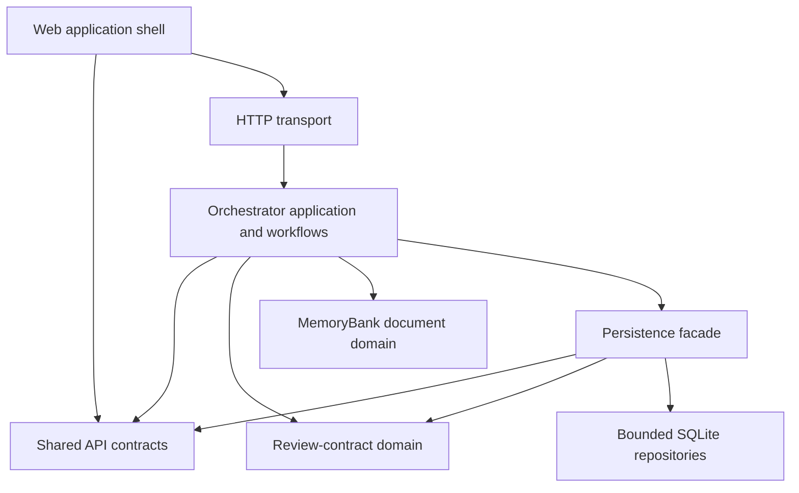
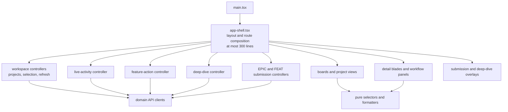
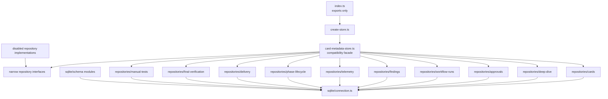
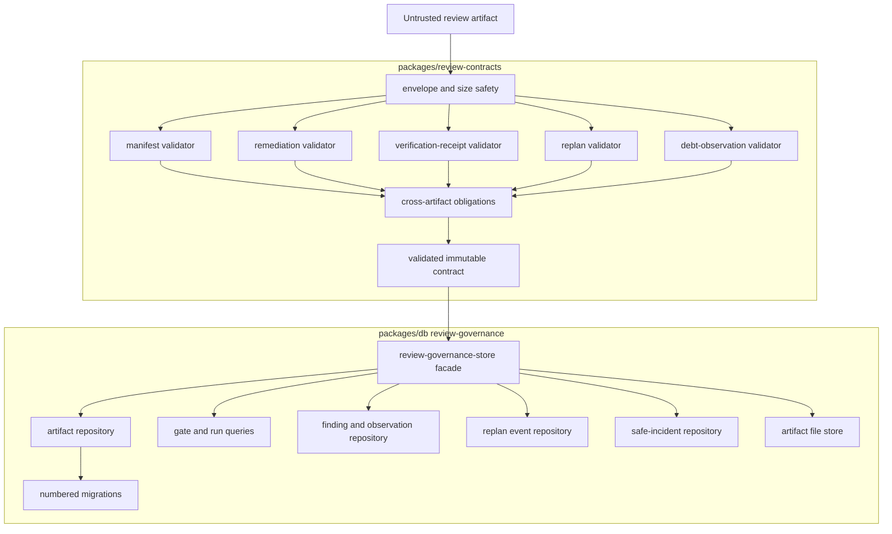
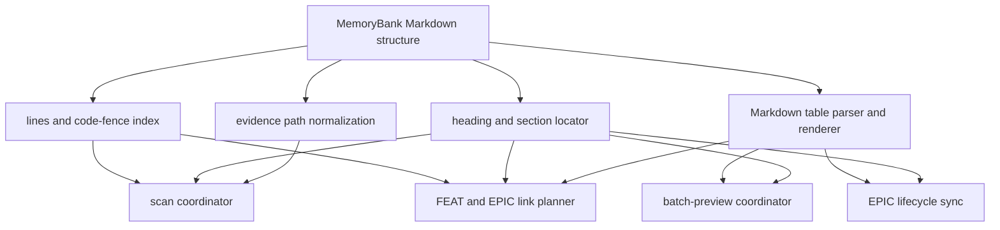
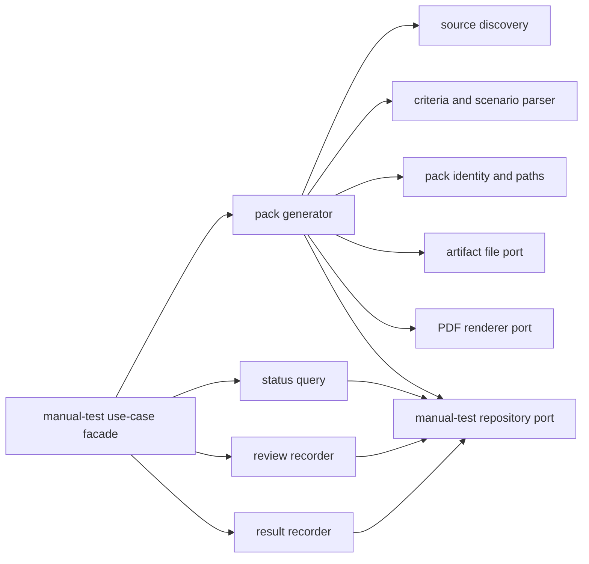

# Oversized Production Module Decomposition

## Purpose

This document is the companion to the
[Orchestrator Modularization Refactor](./orchestrator-modularization-refactor.md).
It explains how the additional oversized production files discovered during
the orchestrator audit should be decomposed. They are existing hotspots, not
proposed target files.

The same limits apply everywhere:

- prefer production files at or below 500 lines;
- permit 501–1,000 lines only for one demonstrably cohesive responsibility;
- never accept a production file above 1,000 lines as the end state;
- keep `index.ts` files as small public export surfaces, not implementations;
- delete unreachable production code after characterization instead of moving
  it into a new legacy module;
- move test data builders out of production source;
- preserve public imports temporarily with compatibility re-exports while
  callers migrate.

## Relationship Between The Hotspots

The files are not ten unrelated cleanup jobs. They form four dependency areas:



The decomposition must preserve this direction. The database package must not
own workflow policy, the shared package must not become a dumping ground, and
the web shell must not reproduce server-side workflow decisions.

## Target Size Summary

| Current file | Lines | End state | Expected target modules |
| --- | ---: | --- | ---: |
| `apps/web/src/app-shell.tsx` | 5,547 | Shell composition at most 300 lines | 12–18, including deletion of unreachable remnants |
| `packages/db/src/index.ts` | 5,458 | Export barrel at most 100 lines | 18–24 contracts, repositories, schema, and facade modules |
| `packages/db/src/review-governance-store.ts` | 4,182 | Facade at most 350 lines | 12–16 validation and persistence modules |
| `apps/orchestrator/src/review-contract-policy.ts` | 2,567 | Pipeline facade at most 150 lines | 8–10 contract validators and policies |
| `packages/shared/src/index.ts` | 2,561 | Export barrel at most 100 lines | 12–16 bounded API-contract modules |
| `apps/orchestrator/src/memorybank-scanner.ts` | 1,610 | Scan coordinator at most 250 lines | 7–9 scanner and parser modules |
| `apps/orchestrator/src/batch-preview.ts` | 1,501 | Preview coordinator at most 300 lines | 10–12 parser, planner, and renderer modules |
| `apps/orchestrator/src/epic-state.ts` | 1,328 | Lifecycle synchronization facade at most 250 lines | 7–9 policy and renderer modules |
| `apps/orchestrator/src/feature-epic-linking.ts` | 1,161 | Link-plan facade at most 250 lines | 5–7 parser and patch-planning modules |
| `apps/orchestrator/src/manual-test-verification-adapter.ts` | 1,043 | Use-case facade at most 300 lines | 8–11 domain and infrastructure modules |

Module counts are planning ranges, not quotas. Responsibility boundaries and
dependency direction decide the final count.

## Web Application Shell

### Current problem

`app-shell.tsx` combines process-wide UI state, project loading, MemoryBank
events, selection, navigation, feature workflow commands, deep-dive polling,
manual-test commands, submission forms, overlays, large presentation
components, formatting, and HTTP helpers.

The repository already contains extracted board, detail, workflow, workspace,
provider, and governance modules. Static reachability inspection also found
old local components in `app-shell.tsx` that have no current production caller,
including workflow-history, workflow-console, evidence, and validation
presentation remnants. Those candidates require characterization and deletion,
not another extraction.

### Target



### Proposed ownership

| Module area | Responsibility |
| --- | --- |
| `app-shell.tsx` | Compose navigation, active view, blades, and overlays |
| `workspace/use-workspace-controller.ts` | Project list, selected project, scans, and refresh lifecycle |
| `workspace/use-work-item-selection.ts` | Selected item/source issue and blade state |
| `workflow/use-feature-actions.ts` | Start, continue, cancel, complete, findings, and human-review commands |
| `deep-dive/use-deep-dive-controller.ts` | Session lifecycle, polling, answers, chat, and completion |
| `submissions/use-epic-submission.ts` | EPIC form and submit/refine behavior |
| `submissions/use-feature-submission.ts` | FEAT form and submit behavior |
| `manual-tests/manual-test-api.ts` | Verification-pack HTTP operations |
| `api/http-client.ts` | JSON transport and error normalization only |
| Existing `boards/`, `details/`, and `workflow/` modules | Presentation and interaction components |
| `presentation/` | Pure labels, status classes, duration, and path formatting |

The first web change should perform a reachability audit. An unreachable local
component with an already-used replacement is deleted together with obsolete
tests. It is not moved to `legacy/`.

## Shared Contracts And General Persistence

### Shared contracts

`packages/shared/src/index.ts` currently defines unrelated project, work-item,
workflow, manual-test, deep-dive, policy, approval, Git, event, trace, metrics,
receipt, delivery, and governance contracts. It should become a compatibility
barrel over bounded modules:

```text
packages/shared/src/
  index.ts                         # re-exports only
  projects/contracts.ts
  work-items/contracts.ts
  feature-workflows/contracts.ts
  manual-tests/contracts.ts
  deep-dive/contracts.ts
  batch-preview/contracts.ts
  safety/path-policy-contracts.ts
  safety/command-policy-contracts.ts
  safety/approval-contracts.ts
  safety/git-guardrail-contracts.ts
  telemetry/invocation-contracts.ts
  telemetry/live-activity-contracts.ts
  telemetry/trace-contracts.ts
  telemetry/metrics-contracts.ts
  telemetry/receipt-contracts.ts
  delivery/contracts.ts
  governance/contracts.ts
```

The root barrel preserves `@hepha/shared` imports during migration. New code
imports the bounded module directly so dependencies remain visible.

### Database package

`packages/db/src/index.ts` currently combines configuration, a very broad
`CardMetadataStore`, disabled and SQLite implementations, schema migration,
SQL for many aggregates, and all row mapping.



The compatibility facade may continue implementing the existing
`CardMetadataStore` initially, but it delegates each call to a narrow
repository. Application code then migrates to the smallest required port.

Suggested persistence modules include:

- `contracts/card-repository.ts`, `approval-repository.ts`,
  `workflow-run-repository.ts`, `finding-repository.ts`,
  `telemetry-repository.ts`, `delivery-repository.ts`, and
  `manual-test-repository.ts`;
- `sqlite/connection.ts`, `sqlite/schema/card-schema.ts`, and one numbered
  migration module per schema change;
- one SQLite repository per aggregate;
- row types and row mappers colocated with their owning repository;
- disabled adapters implementing the same narrow ports without duplicating one
  enormous class.

## Review Contract And Governance Persistence

### Current problem

`review-contract-policy.ts` validates six artifact families in one pipeline:
manifest, active-rule snapshot/surface, remediation response, verification
receipt, replan plan, and architecture-debt observation. The database
`review-governance-store.ts` repeats external-shape and safety validation while
also owning three migrations, artifact files, lineage, ingestion, gate reads,
findings, remediation events, replan events, safe incidents, and queries.

Validation should have one authoritative pure domain implementation. SQLite
must enforce persistence and lineage invariants, but it should not become a
second independently evolving contract parser.

### Target



Proposed pure contract modules:

- `envelope-safety.ts`;
- `manifest-validator.ts`;
- `rule-snapshot-validator.ts`;
- `surface-validator.ts`;
- `remediation-validator.ts`;
- `verification-receipt-validator.ts`;
- `replan-validator.ts`;
- `debt-observation-validator.ts`;
- `cross-artifact-policy.ts`;
- `validation-pipeline.ts` as a small facade.

Proposed persistence modules:

- `review-governance/contracts.ts` for stored records only;
- `review-governance/migrations/v1.ts`, `v2.ts`, and `v3.ts`;
- `review-governance/artifact-repository.ts`;
- `review-governance/gate-repository.ts`;
- `review-governance/finding-repository.ts`;
- `review-governance/replan-event-repository.ts`;
- `review-governance/safe-incident-repository.ts`;
- `review-governance/artifact-file-store.ts`;
- `review-governance/store.ts` as the transaction/facade boundary.

The current global `setReviewArtifactFileOperationsForTest` hook is referenced
only by tests. It should be replaced by constructor injection of an artifact
file port, eliminating process-global test mutation.

## MemoryBank Document Processing

Five hotspots manipulate related Markdown structures. They should share small
structural primitives without merging all document behavior into a new
`markdown-utils.ts` monolith.



### `memorybank-scanner.ts`

| Target module | Responsibility |
| --- | --- |
| `memory-bank/scanner/scan-memory-bank.ts` | Directory traversal and scan coordination |
| `memory-bank/scanner/read-work-item.ts` | Primary document selection, identity, title, and summary |
| `memory-bank/scanner/phase-scanner.ts` | Phase discovery, status, timing, and routing projection |
| `memory-bank/scanner/evidence-scanner.ts` | Changed files and evidence artifact discovery |
| `memory-bank/scanner/quality-gate-scanner.ts` | Explicit gate decisions, warnings, and resolution |
| `memory-bank/scanner/source-issue-classifier.ts` | EPIC and FEAT source issue construction |
| `memory-bank/evidence/evidence-path.ts` | Evidence-path token extraction and normalization |
| `infrastructure/filesystem/safe-reader.ts` | Controlled directory and text reads |

### `batch-preview.ts`

| Target module | Responsibility |
| --- | --- |
| `batch-preview/epic-feature-table.ts` | Parse and render the feature breakdown table |
| `batch-preview/preview-identity.ts` | FEAT ID, slug, path, and deterministic hashes |
| `batch-preview/candidate-extractor.ts` | Extract planned candidates from EPIC content |
| `batch-preview/existing-feature-scanner.ts` | Read existing child FEAT identities from disk |
| `batch-preview/epic-detail-parser.ts` | Parse feature detail and progress sections |
| `batch-preview/mermaid-parser.ts` | Parse only the EPIC dependency diagram contract |
| `batch-preview/dependency-order.ts` | Validate and topologically order candidates |
| `batch-preview/classification.ts` | Existing/new/ambiguous candidate decisions |
| `batch-preview/plan-builder.ts` | Assemble the immutable preview plan |
| `batch-preview/render-feature-details.ts` | Render feature detail changes |
| `batch-preview/render-progress.ts` | Render progress tracking changes |
| `batch-preview/render-mermaid.ts` | Render dependency-diagram changes |

### `epic-state.ts`

| Target module | Responsibility |
| --- | --- |
| `epic-state/epic-state-field.ts` | Extract, normalize, format, and upsert EPIC state |
| `epic-state/feature-state-policy.ts` | Normalize FEAT state and derive EPIC state |
| `epic-state/progress-policy.ts` | Snapshots, counts, and completion percentage |
| `epic-state/render-metadata.ts` | Metadata progress rendering |
| `epic-state/render-feature-table.ts` | Feature status table rendering |
| `epic-state/render-progress-tracking.ts` | Progress section rendering |
| `epic-state/render-mermaid-classes.ts` | Diagram class rendering and node mapping |
| `epic-state/sync-epic-lifecycle.ts` | Coordinate the pure region transformations |

### `feature-epic-linking.ts`

| Target module | Responsibility |
| --- | --- |
| `feature-epic-linking/contracts.ts` | Link input and immutable patch-plan contracts |
| `feature-epic-linking/document-locator.ts` | Locate metadata, source, table, and progress regions |
| `feature-epic-linking/feat-metadata-patch.ts` | Plan the FEAT parent/backlink patch |
| `feature-epic-linking/epic-child-patch.ts` | Plan EPIC child table/detail/progress patches |
| `feature-epic-linking/link-plan.ts` | Combine link, relink, unlink, blockers, and no-op decisions |
| `test/fixtures/feature-epic-linking.ts` | Test-only FEAT and EPIC Markdown builders |

Repository-wide reference inspection found `buildFeatFixture` and
`buildEpicFixture` used by tests and historical documentation but not by
production. They should leave `src/` and become test fixtures. If compatibility
is temporarily necessary, a test-only re-export may exist during one migration
step; production must not import it.

## Manual-Test Verification

`manual-test-verification-adapter.ts` currently owns source discovery,
acceptance-criteria and Gherkin extraction, pack identity and paths, atomic file
writes, PDF rendering, reuse, generation, status queries, review recording,
result recording, archive retention, and legacy compatibility.



Suggested modules:

- `manual-tests/source-discovery.ts`;
- `manual-tests/specification-parser.ts`;
- `manual-tests/pack-identity.ts`;
- `manual-tests/generate-pack.ts`;
- `manual-tests/query-pack-status.ts`;
- `manual-tests/record-pack-review.ts`;
- `manual-tests/record-test-result.ts`;
- `manual-tests/legacy-status.ts`;
- `infrastructure/filesystem/atomic-artifact-writer.ts`;
- `infrastructure/pdf/manual-test-pack-renderer.ts`.

Pack generation depends on injected filesystem, PDF, clock/ID, and persistence
ports. This replaces module-global behavior and makes failure/retry tests
deterministic.

## Migration And Verification Order


Recommended execution sequence:

1. Perform reachability and caller inventory for the selected responsibility.
2. Add or identify unit coverage and a generic Gherkin behavior through the
   public seam.
3. Remove confirmed dead production code and relocate test-only fixtures.
4. Split `packages/shared` contracts while preserving the root barrel.
5. Split the general database facade into narrow repositories.
6. Establish one authoritative review-contract validation package, then split
   review-governance persistence.
7. Extract the MemoryBank pure parsers, policies, and renderers.
8. Extract manual-test use cases and infrastructure ports.
9. Reduce the web shell using the existing workspace/workflow modules and new
   capability-specific controllers.
10. Remove compatibility exports only after repository-wide callers use the
    bounded entry points.

Each migration slice records production callers, unit tests, generic Gherkin
coverage, side effects, compatibility behavior, and resulting file sizes. A
pure helper does not need an artificial one-helper Gherkin scenario; it must be
unit tested and exercised by the public capability's Gherkin integration path.

## Execution Ledger

### Slice 224 — Shared agent-task contracts

**Responsibility:** Move agent task lifecycle, event, input, and HTTP response
contracts from the shared implementation barrel to one bounded contract module.

| Evidence | Result |
| --- | --- |
| Production callers | Agent runtime, Pi argument building, and HTTP task routes continue importing the stable `@hepha/shared` public surface |
| Unit tests | `agent-task-contracts.test.ts` proves the bounded and compatibility-barrel task types remain identical and exercises event presentation data |
| Gherkin | Three generic scenarios specify task creation, task collection, and lifecycle-event reporting without fixed work-item or product identities |
| Integration | The executable binding verifies the barrel re-export and the production runtime/route use of task and response contracts |
| Side effects | The extracted module contains types only and performs no runtime work |
| Compatibility | Existing `@hepha/shared` imports remain valid through the root compatibility re-export |
| Resulting sizes | `packages/shared/src/index.ts`: 2,488 lines; `agent-tasks/contracts.ts`: 73 lines |

### Slice 225 — Shared workflow safety contracts

**Responsibility:** Move path policy, command policy, command serialization,
approval, and Git guardrail transport types into five bounded safety modules.

| Evidence | Result |
| --- | --- |
| Production callers | Path/command/serialization evaluators, approval application, and Git guard continue using the stable public contract surface |
| Unit tests | `safety-contracts.test.ts` proves each bounded type family is identical to its compatibility-barrel export and exercises the Git-to-approval status link |
| Gherkin | Four generic scenarios specify path, concurrent command, approval, and Git guardrail decisions without fixed workflow or product identities |
| Integration | The executable binding verifies all five barrel exports and production safety owners while rejecting duplicate path-policy declarations in the barrel |
| Side effects | All five modules contain types only and perform no runtime work |
| Authority rule | Evaluators and applications continue deciding policy; shared contracts carry safe results and no execution authority |
| Compatibility | Existing `@hepha/shared` imports remain valid; command decisions still depend on serialization classification and Git evidence still uses approval status |
| Resulting sizes | `packages/shared/src/index.ts`: 2,132 lines; bounded safety modules: 13–49 lines each |

### Slice 226 — Shared telemetry contracts

**Responsibility:** Move normalized events, invocation/timeline storage,
live-activity replay, traces, metrics, and receipt transport into six bounded
telemetry modules.

| Evidence | Result |
| --- | --- |
| Production callers | Event normalization, timeline persistence, live SSE, trace assembly, analytics, and receipt applications continue using the stable shared surface |
| Unit tests | `telemetry-contracts.test.ts` proves representative types from all six bounded modules are identical to the compatibility barrel and exercises receipt-to-artifact linking |
| Gherkin | Four generic scenarios specify event storage, live replay, evidence presentation, and receipt inspection without fixed workflow or product identities |
| Integration | The executable binding verifies all six barrel exports and production normalizer, SSE, analytics, and receipt owners while rejecting duplicate normalized-event declarations |
| CI hardening | The governance evidence matrix reuses one isolated SQLite store instead of repeatedly creating and migrating ten stores; all evidence variants and mutation assertions remain unchanged while the test no longer depends on runner filesystem speed |
| Side effects | The extracted modules contain types only and perform no runtime work |
| Authority rule | Runtime, persistence, and application services still create telemetry; shared modules carry records and read models without mutation authority |
| Compatibility | Existing `@hepha/shared` imports remain valid; invocation records import normalized event names and receipt records import trace artifact links explicitly |
| Resulting sizes | `packages/shared/src/index.ts`: 1,263 lines; bounded telemetry modules: 66–201 lines each |

### Slice 227 — Shared governance transport contracts

**Responsibility:** Move detached governance read projection and closed action
transport into separate bounded governance modules.

| Evidence | Result |
| --- | --- |
| Production callers | Governance read/action services and the web governance boundary continue using the stable `@hepha/shared` surface |
| Unit tests | `governance-contracts.test.ts` proves direct and compatibility-barrel types are identical, validates detachment and deep freezing, and refuses malformed transport |
| Gherkin | Three generic scenarios specify detached reads, malformed transport refusal, and authority-safe action requests without fixed work-item identities |
| Integration | The executable binding verifies both bounded exports and their read-service, action-service, and browser-boundary production owners |
| Side effects | The read module validates, clones, and freezes caller data; the action module contains closed transport types only |
| Authority rule | Projection never grants authority, action requests contain no actor or role, and server application services remain responsible for authorization |
| Compatibility | Existing `@hepha/shared` imports remain valid, while the compile-time DTO allowlist now imports its bounded read contract directly |
| Resulting sizes | `packages/shared/src/index.ts`: 1,121 lines; `governance/read-contracts.ts`: 122 lines; `governance/action-contracts.ts`: 24 lines |

### Slice 228 — Shared start-transition and delivery contracts

**Responsibility:** Separate local start-transition recovery evidence from
remote delivery configuration and presentation contracts.

| Evidence | Result |
| --- | --- |
| Production callers | Start-transition presentation, delivery policy, delivery application, and the web shell continue using the stable `@hepha/shared` surface |
| Unit tests | `delivery-contracts.test.ts` proves both bounded families match the compatibility barrel and exercises recoverable existing-branch evidence |
| Gherkin | Three generic scenarios specify branch preparation, transition recovery, and delivery readiness without fixed work-item identities |
| Integration | The executable binding verifies both bounded exports and their transition, policy, and application production owners |
| Side effects | Both extracted modules contain types only and perform no Git, filesystem, or remote operations |
| Authority rule | Contracts record decisions and evidence; orchestrator policies and applications continue owning branch and delivery actions |
| Compatibility | Existing `@hepha/shared` imports remain valid through the root compatibility re-exports |
| Resulting sizes | `packages/shared/src/index.ts`: 965 lines; `workflow/start-transition-contracts.ts`: 78 lines; `delivery/contracts.ts`: 77 lines |

### Slice 229 — Complete shared work-management contract boundaries

**Responsibility:** Convert the remaining shared root declarations into
bounded project, work-item, workflow, manual-test, finding, EPIC, deep-dive,
and feature contract modules.

| Evidence | Result |
| --- | --- |
| Production callers | Project registry, scanner, workflow projection, manual verification, batch preview, deep-dive, and feature-link applications keep the stable `@hepha/shared` imports |
| Unit tests | `work-management-contracts.test.ts` proves representative types from every bounded family match the compatibility barrel and exercises inert project and verification data |
| Gherkin | Four generic scenarios cover work-item listing, workflow/verification status, EPIC preview, and interactive/linking results without fixed identities |
| Integration | The executable binding enforces an export-only root barrel and verifies the bounded families remain connected to their production owners |
| Side effects | All extracted modules contain data contracts only; no scanner, workflow, verification, Git, filesystem, or remote behavior moved into shared code |
| Authority rule | Orchestrator applications continue owning decisions and mutations; shared contracts only transport their inputs, evidence, and read models |
| Compatibility | All existing `@hepha/shared` imports remain valid through 38 bounded re-exports; type-only circular domain references remain erased at runtime |
| Resulting sizes | `packages/shared/src/index.ts`: 39 lines; new bounded modules: 9–218 lines each |

### Slice 230 — Database metadata contracts

**Responsibility:** Separate durable metadata records and the metadata-store
port from SQLite/disabled adapter implementation.

| Evidence | Result |
| --- | --- |
| Production callers | Existing `@hepha/db` consumers and both metadata adapters retain the package barrel while the facade imports the bounded contracts explicitly |
| Unit tests | `database-contracts.test.ts` proves representative card, delivery, telemetry, manual-test, and store-port types match the public barrel and exercises inert record data |
| Gherkin | Four generic scenarios specify card reconciliation, workflow/finding evidence, telemetry queries, and delivery/verification persistence without fixed identities |
| Integration | The executable binding verifies ten contract exports and confirms both disabled and SQLite adapters still implement `CardMetadataStore` |
| Side effects | Contract modules contain types only; connection, schema, query, transaction, and filesystem behavior remain in the existing adapters |
| Authority rule | Persistence records application decisions but does not decide workflow, review, delivery, or verification policy |
| Compatibility | All existing `@hepha/db` type imports remain valid through `contracts/index.ts`; `FeatureWorkflowCommand` is now explicitly shared between card and workflow records |
| Resulting sizes | `packages/db/src/index.ts`: 4,663 lines; bounded contract modules: 3–185 lines each |

### Slice 231 — SQLite row mappers

**Responsibility:** Move raw SQLite row shapes, value normalization, and pure
row-to-domain projections out of the metadata-store facade.

| Evidence | Result |
| --- | --- |
| Production callers | The SQLite adapter imports seven bounded mapper families while retaining all existing queries and public results |
| Unit tests | `sqlite-row-mappers.test.ts` directly exercises every extracted normalizer and mapper across card, approval, workflow, telemetry, transition, review, verification, and manual-test records |
| Gherkin | Four generic scenarios specify row projection for workflow, telemetry, delivery/review, and manual verification without fixed identities |
| Integration | The executable binding verifies all mapper families remain connected to the SQLite facade and old row/mapping declarations are absent |
| Side effects | Mappers are pure projections; they do not open databases, run SQL, mutate rows, or decide policy |
| Authority rule | Queries and transactions remain in the adapter; mappers only translate already-returned SQLite values into durable contracts |
| Compatibility | Public `@hepha/db` records and store methods are unchanged; mapper exports are internal bounded seams for direct unit coverage |
| Resulting sizes | `packages/db/src/index.ts`: 3,845 lines; row-mapper modules: 42–242 lines; `value-normalizers.ts`: 25 lines |

### Slice 232 — Disabled metadata adapter

**Responsibility:** Move the complete disabled-persistence null object out of
the SQLite facade while keeping factory selection explicit.

| Evidence | Result |
| --- | --- |
| Production callers | `createCardMetadataStore` remains the composition point and imports the bounded disabled adapter |
| Unit tests | `disabled-card-metadata-store.test.ts` exhaustively inventories every adapter method and exercises all no-op, absent, empty, pass-through, transient finding, and delivery behaviors |
| Gherkin | Four generic scenarios specify harmless writes, absent reads, pass-through records, and explicit factory composition without fixed work-item identities |
| Integration | The executable binding selects the adapter through the production factory and proves representative workflow reads remain empty without opening SQLite |
| Side effects | The adapter performs no filesystem, SQLite, network, Git, or workflow mutations |
| Authority rule | Disabling persistence changes storage availability only; it does not decide workflow outcomes or manufacture durable evidence |
| Compatibility | `createCardMetadataStore` and the `CardMetadataStore` port are unchanged; the adapter becomes a directly testable internal seam |
| Resulting sizes | `packages/db/src/index.ts`: 3,485 lines; `disabled-card-metadata-store.ts`: 390 lines |

### Slice 233 — Database configuration and bootstrap

**Responsibility:** Separate SQLite path resolution and PostgreSQL database
bootstrap from metadata-adapter implementation.

| Evidence | Result |
| --- | --- |
| Production callers | The SQLite factory resolves its path through the bounded module, while project startup retains the stable `@hepha/db` bootstrap export |
| Unit tests | `database-configuration.test.ts` exercises every path form, precedence rule, target projection, identifier/error helper, existing database, concurrent creation, unexpected failure, and pool closure |
| Gherkin | Four generic scenarios specify SQLite precedence/fallback and PostgreSQL reuse/concurrent creation without fixed work-item identities |
| Integration | The executable binding verifies configuration remains connected to both adapter composition and orchestrator project startup |
| Side effects | Path helpers are pure; only `ensurePostgresDatabaseExists` opens a maintenance pool, and it always closes that pool |
| Authority rule | Configuration selects storage targets but does not decide workflow or project delivery outcomes |
| Compatibility | All configuration/bootstrap exports remain available from `@hepha/db`; factory and startup call sites are unchanged |
| Resulting sizes | `packages/db/src/index.ts`: 3,356 lines; `database-configuration.ts`: 134 lines |

### Slice 234 — SQLite metadata schema lifecycle

**Responsibility:** Separate metadata DDL, idempotent initialization, additive
columns, indexes, and legacy constraint migration from repository queries.

| Evidence | Result |
| --- | --- |
| Production callers | The SQLite metadata adapter owns one `SqliteMetadataSchema` and asks it to ensure readiness before every repository operation |
| Unit tests | `sqlite-metadata-schema.test.ts` directly verifies complete creation, repeat initialization, additive columns, current constraints, transactional migration, and data preservation |
| Gherkin | Four generic scenarios specify new schema creation, idempotency, additive evolution, and legacy constraint migration without fixed work-item identities |
| Integration | The executable binding proves DDL ownership moved out of the facade while the production adapter retains schema composition and readiness calls |
| Side effects | Only the schema manager executes DDL; repository methods continue owning data queries and no workflow policy moved into persistence |
| Authority rule | Constraints protect record shape but do not decide workflow transitions; application services retain decision authority |
| Compatibility | The `CardMetadataStore` API and SQLite database layout remain unchanged, including legacy migration behavior |
| Resulting sizes | `packages/db/src/index.ts`: 2,579 lines; `sqlite-metadata-schema.ts`: 795 lines |

### Slice 235 — SQLite manual-test repository

**Responsibility:** Separate verification-pack, human-review, and manual-result
queries behind a bounded repository and shared ensured query context.

| Evidence | Result |
| --- | --- |
| Production callers | The SQLite metadata adapter composes `SqliteManualTestRepository` and delegates every `CardMetadataStore` manual-test method |
| Unit tests | `sqlite-manual-test-repository.test.ts` inventories every method and directly exercises query context, pack lifecycle, review invalidation, result idempotency, and both result projections |
| Gherkin | Four generic scenarios specify current/superseded packs, invalidated reviews, and idempotent results without fixed work-item identities |
| Integration | The executable binding persists and reads a pack through the production facade while proving SQL ownership moved to the repository |
| Side effects | The query context ensures schema readiness and owns prepared statements; the repository owns only its bounded SQLite reads/writes |
| Authority rule | Persistence records human evidence and invalidation state but does not decide whether feature completion is allowed |
| Compatibility | All `CardMetadataStore` manual-test methods retain their existing signatures and behavior through facade delegation |
| Resulting sizes | `packages/db/src/index.ts`: 2,397 lines; `sqlite-manual-test-repository.ts`: 249 lines; `sqlite-query-context.ts`: 28 lines |

### Slice 236 — SQLite transition and delivery repository

**Responsibility:** Separate start-transition attempts, rollback evidence, and
delivery configuration behind one branch/delivery persistence boundary.

| Evidence | Result |
| --- | --- |
| Production callers | The SQLite metadata adapter composes `SqliteDeliveryRepository` from the shared query context and delegates seven stable store methods |
| Unit tests | `sqlite-delivery-repository.test.ts` inventories every method and directly exercises transition retrieval/order, cleanup evidence, and delivery upsert/read/list behavior |
| Gherkin | Four generic scenarios specify resumable transitions, history order, cleanup durability, and current delivery projection without fixed work-item identities |
| Integration | The executable binding persists a transition through the production facade and proves transition SQL moved to the bounded repository |
| Side effects | Only the repository writes its transition/delivery tables; branch, worktree, Git, issue, and pull-request operations remain application concerns |
| Authority rule | Stored evidence describes preparation and delivery state but does not authorize or execute branch/delivery actions |
| Compatibility | All start-transition and delivery `CardMetadataStore` signatures and ordering semantics remain unchanged through delegation |
| Resulting sizes | `packages/db/src/index.ts`: 2,227 lines; `sqlite-delivery-repository.ts`: 213 lines |

### Slice 237 — SQLite review and final-verification evidence repositories

**Responsibility:** Separate review findings, decisions, repair/fingerprint
evidence, and final quality-check evidence behind two bounded repositories.

| Evidence | Result |
| --- | --- |
| Production callers | The SQLite metadata adapter composes dedicated review-evidence and final-verification repositories while preserving every `CardMetadataStore` method |
| Unit tests | `sqlite-review-evidence-repositories.test.ts` inventories both repositories and directly exercises finding resolution, review decisions, repair reruns, fingerprint recovery, and final run/check persistence |
| Gherkin | Four generic scenarios specify finding resolution, repair audit history, restart-survivable fingerprint decisions, and final-verification evidence without fixed work-item identities |
| Integration | The executable binding persists final-verification evidence through the production facade and proves both SQL families moved to their bounded owners |
| Side effects | The repositories only read and write their evidence tables; review, recovery, repair, and quality-gate decisions remain application concerns |
| Authority rule | Persistence makes decisions auditable and restart-survivable but does not approve reviews, authorize repair, or complete a phase |
| Compatibility | Review and final-verification store signatures, row projections, ordering, and existing fingerprint-recovery behavior remain unchanged through facade delegation |
| Resulting sizes | `packages/db/src/index.ts`: 1,966 lines; `sqlite-review-evidence-repository.ts`: 356 lines; `sqlite-final-verification-repository.ts`: 110 lines |

### Slice 238 — SQLite approval repository

**Responsibility:** Separate approval request queues, final decisions, and
timeout finalization behind one human-authorization persistence boundary.

| Evidence | Result |
| --- | --- |
| Production callers | The SQLite metadata adapter composes `SqliteApprovalRepository` and delegates all six stable approval-store methods |
| Unit tests | `sqlite-approval-repository.test.ts` inventories every method and directly exercises creation, retrieval, filters, limits, ordering, card history, idempotent decisions, missing requests, and timeout sweeping |
| Gherkin | Four generic scenarios specify restart durability, queue views, final-decision idempotency, and elapsed-deadline finalization without fixed work-item identities |
| Integration | The executable binding creates and resolves an approval through the production facade while proving approval SQL moved to the bounded repository |
| Side effects | Only the repository writes approval rows; protected actions, policy evaluation, operator interaction, and workflow continuation remain application concerns |
| Authority rule | Persistence records requested and final authorization states but never grants approval without an explicit application-supplied decision |
| Compatibility | All approval `CardMetadataStore` signatures, default filters/limits, ordering, idempotency, and timeout semantics remain unchanged through delegation |
| Resulting sizes | `packages/db/src/index.ts`: 1,837 lines; `sqlite-approval-repository.ts`: 180 lines; `sqlite-query-context.ts`: 28 lines |

### Slice 239 — SQLite execution telemetry repository

**Responsibility:** Separate agent invocation projections, normalized runtime
events, and phase lifecycle polling behind one execution-evidence boundary.

| Evidence | Result |
| --- | --- |
| Production callers | The SQLite metadata adapter composes `SqliteTelemetryRepository` and delegates all six invocation, event, and lifecycle methods |
| Unit tests | `sqlite-telemetry-repository.test.ts` inventories every method and directly exercises invocation upserts/all filters, event filters, parent integrity, metadata serialization, and cursor-exclusive lifecycle ordering |
| Gherkin | Four generic scenarios specify invocation updates, bounded timeline queries, normalized event queries, and cursor-based lifecycle polling without fixed work-item identities |
| Integration | The executable binding updates an invocation through the production facade, retains the prior timeline suite, and proves telemetry SQL moved to the bounded repository |
| Side effects | Only the repository writes telemetry rows; agent execution, event normalization, workflow routing, and live-stream delivery remain application concerns |
| Authority rule | Telemetry reports execution history and activity but does not select agents, change workflow state, or authorize recovery |
| Compatibility | All telemetry `CardMetadataStore` signatures, upsert/filter/pagination semantics, normalized projections, and lifecycle cursor ordering remain unchanged through delegation |
| Resulting sizes | `packages/db/src/index.ts`: 1,599 lines; `sqlite-telemetry-repository.ts`: 236 lines |

### Slice 240 — SQLite workflow-run repository

**Responsibility:** Separate feature workflow projections and implementation
phase, task, and worker run ledgers behind one execution-persistence boundary.

| Evidence | Result |
| --- | --- |
| Production callers | The SQLite metadata adapter composes `SqliteWorkflowRunRepository` and delegates all eight workflow/implementation run methods |
| Unit tests | `sqlite-workflow-run-repository.test.ts` inventories every method and directly exercises running/terminal feature projections, explicit completion, phase/task timestamps, latest-attempt selection, agent upserts/grouping, and empty queries |
| Gherkin | Four generic scenarios specify current workflow projection, latest phase attempts, durable task state, and complete worker timing history without fixed work-item identities |
| Integration | The executable binding persists a phase lifecycle through the production facade, retains card-metadata and reconciliation coverage, and proves execution SQL moved to the bounded repository |
| Side effects | Only the repository writes workflow execution rows/projections; task selection, worker dispatch, review, verification, recovery, and completion decisions remain application concerns |
| Authority rule | Persistence records application-supplied workflow outcomes but does not infer transitions or complete phases/tasks on its own |
| Compatibility | All workflow-run `CardMetadataStore` signatures, timestamps, upserts, ordering, grouping, and latest-phase-attempt semantics remain unchanged through delegation |
| Resulting sizes | `packages/db/src/index.ts`: 1,184 lines; `sqlite-workflow-run-repository.ts`: 438 lines |

### Slice 241 — SQLite card and preparation repository

**Responsibility:** Separate scanned card reconciliation, card preparation
evidence, human verification timestamps, and deep-dive session lifecycle.

| Evidence | Result |
| --- | --- |
| Production callers | The SQLite metadata adapter composes `SqliteCardRepository` and delegates all ten card, preparation, reconciliation, and session methods |
| Unit tests | `sqlite-card-repository.test.ts` inventories every method and directly exercises session lifecycle, atomic reconciliation/rollback, deep-dive identity, source confirmation, interface decisions, and human-review evidence; query-context tests cover commit and rollback |
| Gherkin | Four generic scenarios specify atomic reconciliation, complete session lifecycle, refined source identity, and idempotent human verification without fixed work-item identities |
| Integration | The executable binding reconciles and reads a card through the production facade, retains card SQL/deep-dive coverage, and proves card/session SQL moved to the bounded repository |
| Side effects | Only the repository writes card/session projections; scanning, requirements analysis, interface decisions, human review, and workflow progression remain application concerns |
| Authority rule | Persistence retains application-supplied preparation evidence but does not decide readiness, UI scope, review acceptance, or implementation transitions |
| Compatibility | All card/session `CardMetadataStore` signatures, reconciliation projections, transaction semantics, deep-dive identity, and timestamp behavior remain unchanged through delegation |
| Resulting sizes | `packages/db/src/index.ts`: 815 lines; `sqlite-card-repository.ts`: 348 lines; `sqlite-query-context.ts`: 40 lines |

### Slice 242 — Review-governance schema migrations

**Responsibility:** Separate the immutable review schema, additive contract
checks, and replan-governance schema into numbered migrations with one ordered,
atomic migration runner.

| Evidence | Result |
| --- | --- |
| Production callers | `ReviewGovernanceSqliteStore.ensureSchema` delegates schema ownership to `applyReviewGovernanceMigrations` and retains only its idempotent facade guard |
| Unit tests | `review-governance-migrations.test.ts` directly exercises ordered version inventory, deterministic ledger entries, repeat initialization, evidence preservation, and rollback without a false version record |
| Gherkin | Four generic scenarios specify new-database setup, idempotency, atomic failure, and facade delegation without fixed work-item identities |
| Integration | The executable binding runs the production migration boundary against SQLite and proves review DDL no longer resides in the store facade |
| Side effects | The migration runner changes only review-governance schema objects and its version ledger; it does not ingest evidence or make workflow decisions |
| Authority rule | Version ordering is code-owned and append-only; a migration is recorded only after its SQL commits successfully |
| Compatibility | V1, V2, and V3 SQL is unchanged, construction still initializes all versions, repeat setup remains safe, and failures retain the established `REVIEW_GOVERNANCE_SCHEMA_FAILED` boundary |
| Resulting sizes | `review-governance-store.ts`: 3,765 lines; migration runner: 57 lines; numbered migrations: 239, 32, and 92 lines |

### Slice 243 — Review-governance persistence contracts

**Responsibility:** Separate stable ingress, stored-record, replan-event, and
aggregate shapes together with their finite persisted value vocabularies.

| Evidence | Result |
| --- | --- |
| Production callers | The store imports its runtime value sets and contract types from `review-governance/contracts.ts`; the original store module re-exports every public type for compatibility |
| Unit tests | `review-governance-contracts.test.ts` directly inventories artifact, remediation-cycle, and gate-state vocabularies and compile-checks representative ingress and aggregate consumer types |
| Gherkin | Four generic scenarios specify artifact families, lifecycle values, gate values, and stable package consumption without fixed work-item identities |
| Integration | The executable binding consumes the production value sets and proves the facade no longer declares persistence record shapes |
| Side effects | The contract module is declarative and performs no database, filesystem, validation, or workflow operation |
| Authority rule | The module defines persisted shapes and finite values only; policy validation and transition decisions remain outside the persistence contract |
| Compatibility | All types remain exported through `review-governance-store.ts`, and runtime validators consume the same value arrays with no accepted-value change |
| Resulting sizes | `review-governance-store.ts`: 3,294 lines; `review-governance/contracts.ts`: 581 lines |

### Slice 244 — Review evidence content safety

**Responsibility:** Separate transport-text and recursively decoded JSON value
safety from SQLite persistence and artifact publication.

| Evidence | Result |
| --- | --- |
| Production callers | Store ingress, identifier validation, safe-incident validation, and artifact publication import the same content-safety boundary |
| Unit tests | `review-governance-content-safety.test.ts` directly exercises ordinary Unicode, benign vocabulary, control bytes, escape bytes, secret-like assignments, credential forms, paired/lone surrogates, and nested decoded values |
| Gherkin | Four generic scenarios specify accepted text, unsafe transport bytes, secret-like assignments, and recursive decoded-value scanning without fixed work-item identities |
| Integration | The executable binding invokes both production scan functions and proves the SQLite facade no longer owns secret patterns or string traversal |
| Side effects | Safety scans are pure fail-closed checks and perform no database, filesystem, logging, or workflow operation |
| Authority rule | The boundary can reject unsafe evidence but cannot validate artifact semantics, authorize ingestion, or decide a review gate |
| Compatibility | The deterministic `SECURITY_VIOLATION` behavior and all prior accepted/rejected content classes remain unchanged for every store caller |
| Resulting sizes | `review-governance-store.ts`: 3,215 lines; `review-governance/content-safety.ts`: 61 lines |

### Slice 245 — Review artifact path policy

**Responsibility:** Separate project-relative path validation and canonical
content-addressed artifact destination derivation from the SQLite store.

| Evidence | Result |
| --- | --- |
| Production callers | Ingress lineage validation and artifact publication import the same path policy; callers still cannot provide a destination path |
| Unit tests | `review-governance-artifact-path-policy.test.ts` directly exercises valid nesting, absolute/drive/URI paths, separators, NUL, traversal, empty segments, supported kinds, and lowercase SHA-256 syntax |
| Gherkin | Four generic scenarios specify canonical derivation, absolute-path refusal, traversal refusal, and closed kind/hash inputs without fixed work-item identities |
| Integration | The executable binding derives a production artifact path and proves both path-policy functions left the SQLite facade |
| Side effects | The path policy is pure and performs no filesystem, database, hashing, or workflow operation |
| Authority rule | The module derives one destination from validated identity; neither callers nor stored artifacts can select an alternate path |
| Compatibility | Valid paths and resulting destinations are unchanged, while all invalid inputs retain the deterministic `INVALID_INPUT` boundary |
| Resulting sizes | `review-governance-store.ts`: 3,204 lines; `review-governance/artifact-path-policy.ts`: 37 lines |

### Slice 246 — Atomic review artifact file store

**Responsibility:** Separate symlink-safe directory traversal, staged writes,
fsync, atomic no-replace publication, collision verification, and cleanup from
the SQLite persistence facade.

| Evidence | Result |
| --- | --- |
| Production callers | The stable `ReviewGovernanceSqliteStore.persistArtifactFileV1` API validates the closed raw request before dispatching to a default `ReviewArtifactFileStore` |
| Unit tests | `review-artifact-file-store.test.ts` directly exercises create/reuse, conflicting bytes, missing roots, and isolation between injected and production filesystem instances; the existing fault matrix remains green through explicit injection |
| Gherkin | Four generic scenarios specify atomic publication, idempotent reuse, collision refusal, and instance-scoped filesystem dependencies without fixed work-item identities |
| Integration | The executable binding proves validation precedes publisher dispatch and no filesystem publication or process-global test hook remains in the SQLite facade |
| Side effects | Only `ReviewArtifactFileStore` creates artifact directories, staging files, hard links, and cleanup operations; it never writes SQLite or changes workflow state |
| Authority rule | The publisher accepts only a prevalidated five-field request and derives its destination through the path policy; it cannot select review outcomes or alternate paths |
| Compatibility | Production callers retain the one-argument static API and all deterministic `INVALID_INPUT`, `FILE_COLLISION`, and `PERSISTENCE_FAILED` results; tests now inject dependencies per instance |
| Resulting sizes | `review-governance-store.ts`: 3,065 lines; `review-governance/artifact-file-store.ts`: 197 lines |

### Slice 247 — Review safe-incident repository

**Responsibility:** Separate closed-shape incident validation and append-only,
secret-safe incident persistence from review evidence ingestion.

| Evidence | Result |
| --- | --- |
| Production callers | `ReviewGovernanceSqliteStore.recordSafeIncident` delegates unchanged to one composed `ReviewSafeIncidentRepository` |
| Unit tests | `review-safe-incident-repository.test.ts` directly exercises complete/minimal projections, exact keys, safe strings, bounds, hashes, phase numbers, calendar-aware UTC timestamps, duplicate identities, and closed databases |
| Gherkin | Four generic scenarios specify complete/minimal incidents, validation-before-SQL, and sanitized storage failure without fixed work-item identities |
| Integration | The executable binding writes through the production repository and proves incident validation and SQL left the facade |
| Side effects | Only the repository appends `hepha_review_safe_incidents`; validation is fail-closed and neither path mutates review evidence or workflow state |
| Authority rule | Incident persistence records application-supplied safe metadata but does not infer scope, retry, recovery, or review decisions |
| Compatibility | The facade signature and deterministic `INVALID_INPUT`/`PERSISTENCE_FAILED` behavior remain unchanged, including optional-null refusal and duplicate handling |
| Resulting sizes | `review-governance-store.ts`: 3,005 lines; `review-governance/safe-incident-repository.ts`: 106 lines |

### Slice 248 — Immutable review artifact repository

**Responsibility:** Separate immutable artifact lookup, exact-scope artifact
listing, manifest-run provenance, lineage ordering, and artifact row mapping.

| Evidence | Result |
| --- | --- |
| Production callers | Four stable store APIs delegate to one composed `ReviewArtifactRepository`; ingestion continues to use those facade methods unchanged |
| Unit tests | `review-artifact-repository.test.ts` directly exercises complete/absent projections, scope isolation, newest-first ordering, nullable run provenance, lineage, empty results, and malformed identities |
| Gherkin | Four generic scenarios specify content lookup, scope isolation, manifest provenance, and deterministic lineage without fixed work-item identities |
| Integration | The executable binding inventories all four repository methods and proves artifact/run query SQL and row mapping left the facade |
| Side effects | The repository is read-only and neither changes immutable evidence nor derives review or workflow decisions |
| Authority rule | Reads require exact validated identities and only project stored provenance; the repository does not grant review authority or infer current gates |
| Compatibility | Facade signatures, null/empty results, projections, and ordering remain unchanged through delegation |
| Resulting sizes | `review-governance-store.ts`: 2,925 lines; `review-governance/artifact-repository.ts`: 128 lines |

### Slice 249 — Authoritative review gate repository

**Responsibility:** Separate current authoritative gate lookup, immutable gate
history, exact project review-scope inventory, and gate-decision row mapping.

| Evidence | Result |
| --- | --- |
| Production callers | Three stable store APIs delegate to one composed `ReviewGateRepository`; ingestion and authoritative-provider callers keep the same facade contract |
| Unit tests | `review-gate-repository.test.ts` directly exercises current/absent decisions, complete newest-first history, nullable fields, distinct ordered scopes, empty results, and malformed identities |
| Gherkin | Four generic scenarios specify current authority, immutable history, scope inventory, and identity validation without fixed work-item identities |
| Integration | The executable binding inventories all three repository methods and proves gate/scope query SQL and row mapping left the facade |
| Side effects | The repository is read-only and does not mutate evidence, gate decisions, runs, or workflow state |
| Authority rule | Current authority is projected only from the greatest persisted gate-decision identity; the repository never derives or upgrades a decision |
| Compatibility | Facade signatures, null/empty results, projections, and deterministic ordering remain unchanged through delegation |
| Resulting sizes | `review-governance-store.ts`: 2,853 lines; `review-governance/gate-repository.ts`: 105 lines |

### Slice 250 — Immutable review evidence repository

**Responsibility:** Separate finding, observation, remediation-cycle/item,
verification-receipt, and observation-context read projections.

| Evidence | Result |
| --- | --- |
| Production callers | Six stable store APIs delegate to one composed `ReviewEvidenceRepository`; provider and governance callers retain the facade contract |
| Unit tests | `review-evidence-repository.test.ts` directly exercises complete/absent findings and context, nullable fields, exact-scope cycles, ordered remediation/verification events, empty results, and malformed identities |
| Gherkin | Four generic scenarios specify provenance, scope isolation, immutable event ordering, and identity validation without fixed work-item identities |
| Integration | The executable binding inventories all six repository methods and proves evidence query SQL and row mapping left the facade |
| Side effects | The repository is read-only and does not mutate findings, cycles, receipts, authority, or workflow state |
| Authority rule | Reads project immutable stored evidence only; finding disposition and verification outcome never become workflow decisions in this repository |
| Compatibility | Facade signatures, null/empty results, projections, validation, and deterministic ordering remain unchanged through delegation |
| Resulting sizes | `review-governance-store.ts`: 2,752 lines; `review-governance/evidence-repository.ts`: 165 lines |

### Slice 251 — Restart-safe replan query repository

**Responsibility:** Separate exact V3 aggregate reconstruction, persisted-state
projection, review-scope discovery, and project-wide restart inventory.

| Evidence | Result |
| --- | --- |
| Production callers | Three stable store APIs delegate to one composed `ReviewReplanQueryRepository`; the mutation boundary uses the same facade read-back API |
| Unit tests | `review-replan-query-repository.test.ts` directly exercises state/evidence reconstruction, absent defaults, scope/project discovery, deterministic ordering, empty results, and malformed identities |
| Gherkin | Four generic scenarios specify persisted state, absent defaults, deterministic discovery, and identity validation without fixed work-item identities |
| Integration | The executable binding inventories all three repository methods and proves aggregate SQL and row mapping left the facade |
| Side effects | The repository is read-only and reconstructs state solely from append-only rows |
| Authority rule | Current replan state follows the greatest persisted transition version; query callers cannot supply or invent state |
| Compatibility | Facade signatures, empty-default aggregate behavior, projections, validation, and ordering remain unchanged through delegation |
| Resulting sizes | `review-governance-store.ts`: 2,654 lines; `review-governance/replan-query-repository.ts`: 177 lines |

### Slice 252 — Artifact publication request boundary

**Responsibility:** Move closed-request, canonical JSON, hash, safety, root,
kind, and feature-path validation beside atomic artifact publication.

| Evidence | Result |
| --- | --- |
| Production callers | The stable static store API delegates to `persistReviewArtifactFileV1`; direct callers may use the same exported boundary with an injected publisher |
| Unit tests | `review-artifact-file-store.test.ts` now directly proves malformed requests never dispatch and exact canonical requests reach the injected publisher, alongside atomic/reuse/collision behavior |
| Gherkin | Four generic scenarios specify atomic creation, reuse, collision refusal, and pre-dispatch public validation |
| Integration | The executable binding proves the publication function is production-exported and raw validation no longer lives in the facade |
| Side effects | Validation is pure until the injected publisher receives an exact canonical request; filesystem behavior remains instance scoped |
| Authority rule | Publication validates bytes and location only; it cannot grant review or workflow authority |
| Compatibility | The static facade signature, optional publisher injection, paths, return values, and deterministic errors remain unchanged |
| Resulting sizes | `review-governance-store.ts`: 2,620 lines; `review-governance/artifact-file-store.ts`: 250 lines |

### Slice 253 — Replan operation coherence policy

**Responsibility:** Separate exact replan scope validation, closed operation
record sets, and cross-record aggregate/trigger coherence before persistence.

| Evidence | Result |
| --- | --- |
| Production callers | All seven V3 row appenders use the extracted scope validator and the sole public mutation boundary uses the extracted record/coherence policy |
| Unit tests | `replan-operation-policy.test.ts` directly exercises closed kind mappings, coherent results, scope/aggregate/trigger mismatches, scope validation, and unknown kinds |
| Gherkin | Four generic scenarios specify closed operations, exact shared identity, trigger binding, and pre-write refusal without fixed work-item identities |
| Integration | The executable binding proves the pure policy is production-exported and the duplicate facade helpers are absent |
| Side effects | The policy is pure and rejects invalid bundles before any SQLite transaction or row write |
| Authority rule | Operation coherence validates consistency only; it does not authorize actors, outcomes, transitions, or dispatch |
| Compatibility | Accepted operation kinds, required record sets, deterministic errors, and cross-record rules remain unchanged |
| Resulting sizes | `review-governance-store.ts`: 2,529 lines; `review-governance/replan-operation-policy.ts`: 97 lines |

### Slice 254 — Atomic replan event repository

**Responsibility:** Move V3 operation transactions, dependency checks, event
appends, optimistic-state checks, and durable aggregate verification behind one
bounded repository while retaining the stable store API.

| Evidence | Result |
| --- | --- |
| Production callers | `ReviewGovernanceSqliteStore.commitReplanGovernanceOperation` delegates to the injected `ReviewReplanEventRepository`; no row appender remains public |
| Unit tests | `review-replan-event-repository.test.ts` directly proves a durable commit, rollback after failed read-back verification, and pre-write rejection of malformed records |
| Gherkin | Four generic scenarios specify atomic closed operations, dependency refusal, read-back rollback, and compatibility-facade delegation |
| Integration | The executable binding proves the production repository exposes one mutation boundary and the facade contains neither V3 transaction helpers nor replan event SQL |
| Side effects | One outer `begin immediate` owns every nested row append and aggregate read-back; any validation, SQLite, or verification failure rolls the complete operation back |
| Authority rule | The repository persists already coherent operation records and enforces stored dependencies; it cannot invent an operation kind, scope, actor role, transition, or artifact |
| Compatibility | Public method signature, operation kinds, SQL rows, optimistic versions, deterministic `INVALID_INPUT`/`PERSISTENCE_FAILED` failures, and returned aggregate remain unchanged |
| Resulting sizes | `review-governance-store.ts`: 2,219 lines; `review-governance/replan-event-repository.ts`: 317 lines |

### Slice 255 — Current-contract review ingest validation

**Responsibility:** Isolate the complete current-V1 artifact grammar, canonical
byte/hash checks, independently resolved catalog matching, safe-content limits,
and canonical finding/lineage derivation from SQLite persistence.

| Evidence | Result |
| --- | --- |
| Production callers | Store construction resolves catalog snapshots through the module and `ingestValidatedReviewEvidence` invokes its sole normalization boundary before storage lookup or transaction work |
| Unit tests | `review-ingest-validation.test.ts` directly proves valid canonical normalization, refusal of alternate bytes and caller-authored derivatives, catalog/hash validation, and durable read-back failure semantics |
| Gherkin | Four generic scenarios specify identity binding, independent catalog authority, derived evidence, and sanitized pre-transaction refusal |
| Integration | The executable binding proves the production exports and confirms current-contract grammar no longer lives in the SQLite facade |
| Side effects | Validation and normalization are pure; no database or filesystem handle enters the module |
| Authority rule | Canonical artifact bytes and construction-time catalog snapshots remain authoritative; caller-provided normalized fields can only assert an exact mirror |
| Compatibility | The facade re-exports `computeSha256Hex`; accepted schemas, limits, canonical paths, derived identities, and deterministic failures remain unchanged |
| Resulting sizes | `review-governance-store.ts`: 1,258 lines; `review-governance/review-ingest-validation.ts`: 968 lines |

### Slice 256 — Atomic immutable-review ingest repository

**Responsibility:** Move lineage and cross-artifact binding, lifecycle evidence
writes, one-transaction persistence, and complete durable read-back out of the
compatibility store.

| Evidence | Result |
| --- | --- |
| Production callers | The stable `ingestValidatedReviewEvidence` method delegates to an injected `ReviewIngestRepository`; all existing read APIs continue through their bounded repositories |
| Unit tests | `review-ingest-repository.test.ts` directly proves successful artifact/run/finding/observation persistence and zero partial rows after canonical refusal; the 99-case facade suite remains green |
| Gherkin | Four generic scenarios specify pre-transaction bindings, aggregate atomicity, complete read-back rollback, and facade delegation |
| Integration | The executable binding proves the production repository boundary and confirms lineage helpers, transaction SQL, and artifact inserts are absent from the facade |
| Side effects | One `begin immediate` owns artifact, lineage, run, finding, observation, cycle, gate, remediation-item, and receipt rows plus all read-back checks |
| Authority rule | The repository may persist only the validator's canonical aggregate and exact already-stored dependencies; it cannot derive workflow authority from filenames or caller-selected rows |
| Compatibility | Public ingest signature, table writes, binding rules, rollback semantics, sanitized failures, hash result, and all public read APIs remain unchanged |
| Resulting sizes | `review-governance-store.ts`: 370 lines; `review-governance/review-ingest-repository.ts`: 906 lines |

### Slice 257 — Dashboard HTTP transport boundary

**Responsibility:** Move raw fetch dispatch, JSON parsing, POST encoding, safe
server-error selection, and unknown-error presentation out of the application
shell and behind one injectable client.

| Evidence | Result |
| --- | --- |
| Production callers | The application shell retains its stable `apiGet`, `apiPost`, and `apiRequest` call sites through the bounded transport exports |
| Unit tests | `http-client.test.ts` directly exercises GET, POST, custom requests, JSON/non-JSON responses, safe server failures, status fallbacks, and unknown-error presentation |
| Gherkin | Four generic scenarios specify reads, command encoding, safe server failures, and deterministic fallback failures without fixed work-item identities |
| Integration | The executable binding proves the injectable client surface and confirms raw fetch, JSON headers, and response parsing left the shell |
| Side effects | Only the transport boundary invokes `fetch`; parsing and error selection cannot change UI, workflow, or MemoryBank state |
| Authority rule | The client transports an already-selected path and request; it does not choose commands, routes, retries, or workflow outcomes |
| Compatibility | Existing shell call sites retain their paths, request methods, bodies, return values, and displayed error messages |
| Resulting sizes | `app-shell.tsx`: 5,510 lines; `api/http-client.ts`: 61 lines |

### Slice 258 — Application-shell reachability cleanup

**Responsibility:** Delete production-unreachable local workflow history,
console, evidence, phase, validation, and presentation remnants after confirming
their bounded workflow and detail replacements are the active composition path.

| Evidence | Result |
| --- | --- |
| Production callers | `AppShell`, `ProjectCard`, and `DetailBlade` remain the exported roots; selected-item interaction continues through `WorkflowInteractionPanel` and `WorkItemDetailBlade` |
| Unit tests | Existing workflow interaction, detail-blade, board, shell-card, workflow-console backend, and extracted workflow-presentation suites continue exercising active behavior; obsolete assertions whose only subject was an uncalled local component were removed |
| Gherkin | Four generic scenarios specify composition roots, workflow delegation, detail delegation, and absence of superseded locals without fixed work-item identities |
| Integration | TypeScript AST traversal proves every remaining top-level shell function is transitively reachable from an exported production surface |
| Side effects | Removed code had no production caller; active HTTP, workflow, selection, detail, and overlay effects remain unchanged |
| Authority rule | The cleanup removes duplicate presentation only and does not change workflow command selection, authorization, or state transitions |
| Compatibility | Public `AppShell`, `ProjectCard`, and `DetailBlade` exports and their active child-component contracts remain unchanged |
| Resulting sizes | `app-shell.tsx`: 3,642 lines; 62 unreachable local functions and their unused imports/types removed |

### Slice 259 — Project portfolio presentation and analytics

**Responsibility:** Separate project-registry presentation, lifecycle metrics,
measured runtime aggregation, human-delivery gain, and acceleration display from
application-shell composition.

| Evidence | Result |
| --- | --- |
| Production callers | The projects route in `AppShell` composes `ProjectsView`; the view owns project cards and invokes the pure runtime analytics boundary |
| Unit tests | `project-runtime-analytics.test.ts` directly exercises lifecycle counts, empty projections, workflow/phase evidence, validation/review load, and duration formatting; the existing project-card presentation test imports its bounded owner |
| Gherkin | Four generic scenarios specify lifecycle visibility, measured execution, human-delivery comparison, and explicit missing evidence without fixed work-item identities |
| Integration | The executable binding renders the production empty registry and proves portfolio presentation and analytics no longer live in the shell |
| Side effects | Analytics is pure; the view only dispatches caller-provided refresh, selection, initialization, and board-navigation callbacks |
| Authority rule | Portfolio presentation reports stored counts and measured evidence but cannot start workflows, alter estimates, or grant delivery authority |
| Compatibility | Project card labels, actions, paths, lifecycle counts, measured AI runtime, human delivery gain, and acceleration semantics remain unchanged |
| Resulting sizes | `app-shell.tsx`: 3,261 lines; `projects/projects-view.tsx`: 274 lines; `projects/project-runtime-analytics.ts`: 121 lines |

### Slice 260 — Work-item submission overlays

**Responsibility:** Move EPIC and FEAT form contracts, defaults, field
presentation, mode switching, and submit/cancel dispatch out of the application
shell into separate submission capabilities.

| Evidence | Result |
| --- | --- |
| Production callers | `AppShell` owns overlay visibility and submit orchestration while composing the bounded `SubmitEpicOverlay` and `SubmitFeatOverlay` components |
| Unit tests | The executable component binding renders both production forms, exercises mode availability, and proves cancel dispatch; repository typecheck covers every bounded field contract |
| Gherkin | Four generic scenarios specify structured parent input, idea input, bounded child input, and caller-owned submission without fixed work-item identities |
| Integration | Both real overlays render through their exported default forms while shell source retains only composition and orchestration |
| Side effects | Overlay components update caller-owned form state and invoke callbacks only; they perform no HTTP, workflow, or MemoryBank operation |
| Authority rule | Forms collect intent but cannot select refinement, implementation, completion, or delivery outcomes |
| Compatibility | All labels, fields, defaults, mode behavior, disabled states, submit events, and close events remain unchanged |
| Resulting sizes | `app-shell.tsx`: 2,913 lines; `submissions/epic-submission-overlay.tsx`: 206 lines; `submissions/feature-submission-overlay.tsx`: 157 lines |

### Slice 261 — Dashboard application chrome

**Responsibility:** Separate primary navigation, project selection, live status,
refresh controls, and connection/notice/MemoryBank banners from route and
overlay composition.

| Evidence | Result |
| --- | --- |
| Production callers | `AppShell` composes the bounded sidebar, top bar, and three banner components through their existing callbacks and status inputs |
| Unit tests | The component binding directly renders error, notice, and initialization banners and proves initialization callback dispatch |
| Gherkin | Four generic scenarios specify navigation, live status, message roles, and caller-owned initialization without fixed work-item identities |
| Integration | The production chrome components render independently while the reachability guard confirms the remaining shell graph is live |
| Side effects | Chrome components emit provided navigation, refresh, selection, and initialization callbacks only; they own no transport or workflow operation |
| Authority rule | The frame presents status and user intent but cannot decide workflow, project, or MemoryBank outcomes |
| Compatibility | Navigation labels, active state, project selector, live indicators, refresh behavior, messages, and initialization controls remain unchanged |
| Resulting sizes | `app-shell.tsx`: 2,700 lines; `composition/app-chrome.tsx`: 218 lines |

### Slice 262 — Manual-test verification panel

**Responsibility:** Separate verification-pack status loading, artifact links,
review acknowledgement, pass/failure evidence collection, stale-pack handling,
and caller-owned operation dispatch from application-shell composition.

| Evidence | Result |
| --- | --- |
| Production callers | Feature detail composition uses the bounded `ManualTestVerificationPanel` with its existing generate, review, result, status, and artifact callbacks |
| Unit tests | The component binding directly loads a missing status, opens the production dialog, and verifies the generation action is available |
| Gherkin | Four generic scenarios specify missing, reviewable, recordable, and stale pack behavior without fixed work-item identities |
| Integration | The production panel renders through caller-provided status evidence while the shell reachability guard remains green |
| Side effects | The panel owns local dialog/form state and invokes supplied async operations; it performs no direct HTTP, workflow, or filesystem work |
| Authority rule | Verification presentation cannot invent pack currency, review status, test outcomes, or feature completion authority |
| Compatibility | Status refresh, artifact links, generate/review/pass/fail actions, stale handling, validation, and dialog behavior remain unchanged |
| Resulting sizes | `app-shell.tsx`: 2,510 lines; `manual-tests/manual-test-verification-panel.tsx`: 187 lines |

### Slice 263 — Active detail-surface composition

**Responsibility:** Separate selected-item routing, source diagnostics, project
detail fallback, delivery status, EPIC refinement, and feature-to-EPIC
relationship presentation from application-shell orchestration.

| Evidence | Result |
| --- | --- |
| Production callers | `AppShell` composes one `DetailBlade` router; the router selects the bounded work-item, source-issue, or project blade and composes feature/EPIC supporting panels |
| Unit tests | Existing work-item, source-issue, project, relation, delivery, refinement, and relationship component suites continue exercising the bounded owners; the detail contract test resolves the runtime router |
| Gherkin | Four generic scenarios specify work-item routing, source diagnostics, project fallback, and supporting-panel composition without fixed work-item identities |
| Integration | The executable binding renders all three router branches and verifies feature panel composition; the shell reachability guard refuses reintroduced local detail implementations |
| Side effects | The router selects and composes caller-provided state; delivery transport remains isolated in its capability component and every other panel emits supplied callbacks |
| Authority rule | Detail presentation exposes stored state and user intent but cannot choose workflow transitions, linkage results, refinement outcomes, or completion authority |
| Compatibility | Blade selection, refresh keys, visible relations, completion action, delivery/manual-test panels, relationship operations, and EPIC refinement behavior remain unchanged |
| Resulting sizes | `app-shell.tsx`: 2,087 lines; `details/detail-blade-router.tsx`: 196 lines; supporting detail panels: 36–100 lines each |

### Slice 264 — Deep-dive interaction overlay

**Responsibility:** Separate deep-dive question navigation, decision capture,
topic chat, progress and lifecycle presentation, and closed-state formatting
from application-shell orchestration.

| Evidence | Result |
| --- | --- |
| Production callers | `AppShell` retains session transport and lifecycle orchestration while composing the bounded `DeepDiveOverlay` with answer, chat, close, and completion callbacks |
| Unit tests | The formatter binding exercises every work-item, session, and agent-connection label; the interaction binding exercises option selection, trimmed detail, chat, and completion dispatch |
| Gherkin | Four generic scenarios specify generation, decision capture, clarification chat, and document-update readiness without fixed work-item identities |
| Integration | The production overlay renders generating, question-round, and ready-for-update states while the shell reachability guard refuses a reintroduced local overlay |
| Side effects | The overlay owns ephemeral input and active-question state and emits supplied callbacks; it performs no direct HTTP, workflow, SQLite, or filesystem operation |
| Authority rule | Interaction presentation cannot create questions, mark decisions durable, select workflow recovery, or authorize a document update |
| Compatibility | Labels, progress, option recommendation, chat transcript, disabled states, close behavior, and completion action remain unchanged |
| Resulting sizes | `app-shell.tsx`: 1,745 lines; `deep-dive/deep-dive-overlay.tsx`: 341 lines |

### Slice 265 — Dashboard live-activity controller

**Responsibility:** Separate live event interpretation, file-change debouncing,
selected-phase detail invalidation, attention announcements, refresh dispatch,
and timer cleanup from application-shell composition.

| Evidence | Result |
| --- | --- |
| Production callers | `AppShell` supplies current project/selection plus refresh and error callbacks to `useDashboardLiveActivity`; the controller composes the existing SSE transport hook |
| Unit tests | The hook binding directly proves repeated file changes coalesce, selected phase events invalidate detail, attention expires, and rejected refreshes reach the caller error boundary |
| Gherkin | Four generic scenarios specify debounce, phase refresh, temporary attention, and refresh failure without fixed work-item identities |
| Integration | The executable binding injects the live transport callback and drives real controller state/timers; the shell source guard proves the bounded hook is the active composition path |
| Side effects | The controller owns only debounce/expiry timers and delegates project refresh and error presentation through supplied callbacks; unmount clears pending timers |
| Authority rule | Live activity may invalidate read models and announce durable events but cannot choose workflow commands, outcomes, or phase transitions |
| Compatibility | Project stream enablement, 300 ms file debounce, selected-card refresh, attention event set, eight-second announcement, and connection status remain unchanged |
| Resulting sizes | `app-shell.tsx`: 1,656 lines; `workspace/use-dashboard-live-activity.ts`: 75 lines |

### Slice 266 — Deep-dive session controller

**Responsibility:** Separate deep-dive session state, durable polling, recovery
resume intent, start/answer/chat/completion commands, optimistic completion
status, and failure reconciliation from application-shell composition.

| Evidence | Result |
| --- | --- |
| Production callers | `AppShell` supplies current project, refresh, pending, error, and resume callbacks to `useDeepDiveController`; the overlay consumes only the returned state and commands |
| Unit tests | The hook binding directly proves polling reconciliation, project-bound start, close/reset, answer, chat, successful completion, work-item refresh, and deferred resume |
| Gherkin | Four generic scenarios specify polling, identity-bound start, conversational updates, and completion/resume without fixed work-item identities |
| Integration | The executable binding drives the production hook through mocked HTTP responses; the shell guard rejects direct deep-dive endpoints and local session setters |
| Side effects | One controller owns deep-dive transport and its polling interval; every workspace refresh, error, pending marker, and resume action is delegated through an explicit callback |
| Authority rule | The controller transports user decisions and reconciles server-authored session state; it cannot invent questions, answers, workflow success, or document completion |
| Compatibility | Two-second polling, optimistic updating state, start/answer/chat paths, completion refresh, recovery resume, close behavior, and deterministic errors remain unchanged |
| Resulting sizes | `app-shell.tsx`: 1,492 lines; `deep-dive/use-deep-dive-controller.ts`: 165 lines |

### Slice 267 — Feature action controller

**Responsibility:** Separate UI-requirement, refinement, implementation,
completion, cancellation, human-review, and finding command mapping plus their
shared pending/transport/reconciliation lifecycle from the application shell.

| Evidence | Result |
| --- | --- |
| Production callers | `AppShell` supplies current project and state reconciliation callbacks to `useFeatureActions`; detail/workflow panels consume the returned command functions unchanged |
| Unit tests | A table-driven binding invokes every public action and proves its exact endpoint, action-specific input, success reconciliation, selection policy, no-project refusal, failure reporting, and pending cleanup |
| Gherkin | Four generic scenarios specify identity binding, read-model reconciliation, selection policy, and failure cleanup without fixed work-item identities |
| Integration | The executable binding drives all thirteen production actions through the injectable HTTP boundary; the shell guard rejects direct feature lifecycle/finding endpoints |
| Side effects | One command helper owns transport and delegates project, item, selection, notice, error, and pending updates through explicit callbacks |
| Authority rule | The controller maps user intent to server commands and displays returned state; it cannot infer readiness, fabricate workflow outcomes, or locally advance a phase |
| Compatibility | Endpoints, request bodies, action IDs, selected-item fallback rules, summaries, state replacement, and deterministic errors remain unchanged |
| Resulting sizes | `app-shell.tsx`: 1,184 lines; `workflow/use-feature-actions.ts`: 124 lines |

### Slice 268 — Manual-test action controller and transport

**Responsibility:** Separate verification-pack generation, review, result
recording, status transport, and their shared pending/reconciliation lifecycle
from application-shell composition.

| Evidence | Result |
| --- | --- |
| Production callers | `AppShell` supplies current project, work-item refresh, notice, error, and pending callbacks to `useManualTestActions`; the manual-test panel consumes the returned commands unchanged |
| Unit tests | The binding proves exact generate, review, pass, fail, and encoded status contracts plus success reconciliation, evidence preservation, failure reporting, no-project refusal, and pending cleanup |
| Gherkin | Four generic scenarios specify identity binding, evidence-chain preservation, successful reconciliation, and recoverable failure without fixed work-item identities |
| Integration | The executable binding drives the production controller and transport through the injectable HTTP boundary; the shell guard rejects direct manual-test endpoints |
| Side effects | The adapter owns endpoint and payload mapping; one controller helper owns pending, notice, error, and refresh sequencing through explicit callbacks |
| Authority rule | The controller transports manual evidence and displays server responses; it cannot fabricate pack currency, review acceptance, test outcomes, or feature completion |
| Compatibility | Endpoints, encoded status lookup, optional evidence normalization, action IDs, summaries, state refresh, and deterministic errors remain unchanged |
| Resulting sizes | `app-shell.tsx`: 1,112 lines; `manual-tests/manual-test-api.ts`: 40 lines; `manual-tests/use-manual-test-actions.ts`: 64 lines |

### Slice 269 — Work-item submission controllers

**Responsibility:** Separate EPIC and FEAT form state, overlay lifecycle,
submission transport, EPIC refinement, and returned aggregate reconciliation
from application-shell composition.

| Evidence | Result |
| --- | --- |
| Production callers | `AppShell` supplies current project and explicit reconciliation callbacks to `useEpicSubmission` and `useFeatureSubmission`; the existing overlays consume their controlled state and commands |
| Unit tests | The binding edits and submits both form types, verifies exact project-bound payloads, reconciles returned aggregates, exercises EPIC refinement, Escape/close behavior, failure cleanup, and no-project refusal |
| Gherkin | Four generic scenarios specify parent submission, child submission, parent refinement, and recoverable lifecycle behavior without fixed work-item identities |
| Integration | The executable binding drives both production hooks through the injectable HTTP boundary; the shell guard rejects direct submission and refinement endpoints |
| Side effects | Each controller owns only its form/open state and Escape listener while delegating project, items, selection, detail visibility, notice, error, and pending updates through callbacks |
| Authority rule | Submission controllers bind user input to the current project and display server-authored outcomes; they cannot invent work-item identities, refinement completion, or workflow readiness |
| Compatibility | Form defaults, endpoint payloads, action IDs, overlay reset/close behavior, returned selection, detail opening, summaries, and deterministic errors remain unchanged |
| Resulting sizes | `app-shell.tsx`: 970 lines; `submissions/use-epic-submission.ts`: 94 lines; `submissions/use-feature-submission.ts`: 65 lines |

### Slice 270 — Missing-child preview controller

**Responsibility:** Separate missing-child preview state, evidence-preserving
apply transport, stale-plan recovery, cancellation, and outcome formatting from
application-shell composition.

| Evidence | Result |
| --- | --- |
| Production callers | `AppShell` supplies current project and reconciliation callbacks to `useMissingFeaturePreview`; the detail surface consumes only its preview, apply, cancel, plan, and loading contract |
| Unit tests | The binding verifies preview identity, exact apply hashes and payload, returned aggregate reconciliation, outcome formatting, recoverable-error classification, stale-plan clearing, cancellation, and no-project refusal |
| Gherkin | Four generic scenarios specify preview, evidence-preserving apply, stale evidence recovery, and side-effect-free cancellation without fixed work-item identities |
| Integration | The executable binding drives the production hook through the injectable HTTP boundary; the shell guard rejects direct missing-feature endpoints |
| Side effects | The controller owns only transient plan/source/loading state while delegating project, items, notice, error, and pending updates through explicit callbacks |
| Authority rule | Preview plans and creation outcomes remain server-authored; the controller cannot invent candidates, relax apply permission, or reuse rejected stale evidence |
| Compatibility | Endpoints, request hashes, action ID, candidate-empty notice, result summary, stale-error rules, cancellation notice, and state reconciliation remain unchanged |
| Resulting sizes | `app-shell.tsx`: 854 lines; `missing-feature-preview.ts`: 41 lines; `missing-features/use-missing-feature-preview.ts`: 97 lines |

### Slice 271 — Feature-to-EPIC relationship controller

**Responsibility:** Separate link, relink, and unlink transport, refreshed-item
reconciliation, blocker/warning interpretation, and transient relationship UI
state from application-shell composition.

| Evidence | Result |
| --- | --- |
| Production callers | `AppShell` supplies current project plus item and notice callbacks to `useFeatureEpicLink`; the relationship panel consumes only its link command and state |
| Unit tests | The binding table verifies all three operations, encoded project/external identities, exact payloads, item refresh, blocker aggregation, warning notices, transport failure, and no-project refusal |
| Gherkin | Four generic scenarios specify durable identity, refreshed items, blocker/warning separation, and recoverable transport failure without fixed work-item identities |
| Integration | The executable binding drives the production hook through injectable GET/POST boundaries; the shell guard rejects direct relationship endpoints |
| Side effects | The controller owns only linking/result/error state and delegates refreshed items and success notices through explicit callbacks |
| Authority rule | The controller displays server-authored blockers, warnings, and summaries; it cannot infer a relationship, bypass policy, or fabricate an accepted hierarchy |
| Compatibility | Encoded routes, external work-item identity, operation payloads, post-command refresh, warning text, blocker text, and deterministic failure behavior remain unchanged |
| Resulting sizes | `app-shell.tsx`: 812 lines; `relationships/use-feature-epic-link.ts`: 60 lines |

### Slice 272 — Production workspace controller adoption

**Responsibility:** Consolidate project registry, work-item scan state,
selection, document detail, project initialization, and project-scoped
MemoryBank events behind the production workspace controller.

| Evidence | Result |
| --- | --- |
| Production callers | `AppShell` consumes `useWorkspaceController`; the composition guard rejects direct HTTP transport from the shell |
| Unit tests | Hook assertions cover project loading, selection reconciliation, project creation, MemoryBank initialization, stream cleanup, errors, and document refresh |
| Gherkin | Four product-blind scenarios specify project selection, durable project commands, MemoryBank refresh, and document detail without fixed project or work-item identities |
| Integration | The executable binding drives the production controller through the injectable HTTP and EventSource boundaries |
| Dead-code removal | Removed the former workspace API, state, selector, and event-hook modules whose only callers were tests, together with their obsolete test-only suites |
| Side effects | The controller owns workspace state and project-scoped effects; the shell owns only composition callbacks and navigation |
| Authority rule | Project, scan, work-item, source-issue, and document values remain server-authored; the controller reconciles identities but cannot fabricate them |
| Compatibility | Project routes, encoded identities, work-item refresh, selected-item invalidation, document loading, SSE event names, and error handling remain unchanged |
| Resulting sizes | `app-shell.tsx`: 602 lines; `workspace/use-workspace-controller.ts`: 245 lines |

### Slice 273 — Application navigation controller

**Responsibility:** Separate board, project, detail, source-issue, submission,
and Escape-key transitions from application composition.

| Evidence | Result |
| --- | --- |
| Production callers | `AppShell` delegates navigation transitions to `useAppNavigation`; the composition guard rejects local transition functions and key listeners |
| Unit tests | Hook assertions cover compact and expanded item selection, project reset, source selection, view routing, submission exclusivity, and Escape ownership |
| Gherkin | Four product-blind scenarios specify item detail, project reset, mutually exclusive submissions, and higher-priority Escape ownership |
| Integration | The executable binding drives the production hook with observable state callbacks and browser keyboard events |
| Side effects | The controller owns transition sequencing and the Escape listener; the shell retains only top-level state and composition |
| Authority rule | Navigation changes visibility and selection only; it does not invent project, work-item, document, or workflow state |
| Compatibility | Document refresh, expanded-detail behavior, project-dependent reset, submission opening, completed view routing, and Escape behavior remain unchanged |
| Resulting sizes | `app-shell.tsx`: 512 lines; `composition/use-app-navigation.ts`: 111 lines |

### Slice 274 — Application shell view composition

**Responsibility:** Separate route selection, shared chrome, workspace banners,
detail presentation, and modal composition from controller construction and
cross-controller wiring.

| Evidence | Result |
| --- | --- |
| Production callers | `AppShell` constructs controllers and delegates rendering to `AppShellView`; the reachability guard verifies the new production seam |
| Unit tests | The pure view has no business methods; route, chrome, banner, detail, and overlay conditions are executable component assertions |
| Gherkin | Four product-blind scenarios specify route ownership, controller-selected surfaces, workspace status, and route-independent chrome |
| Integration | The executable binding renders every primary route plus detail, deep-dive, parent submission, child submission, error, and initialization states |
| Side effects | The view contains no transport or workflow effects; event and command behavior remain in bounded controllers |
| Authority rule | The view renders controller state and delegates commands; it does not derive workflow authority or fabricate domain outcomes |
| Compatibility | Board models, route precedence, shared banners, compact versus expanded detail, modal predicates, and callback wiring remain unchanged |
| Resulting sizes | `app-shell.tsx`: 156 lines; `composition/app-shell-view.tsx`: 282 lines; `composition/use-app-navigation.ts`: 115 lines |

### Slice 275 — Review-contract envelope safety boundary

**Responsibility:** Separate shared policy result contracts, common envelope
validation, bounded payload/depth checks, recursive content safety, path safety,
predecessor-context guards, schema support, and identifier uniqueness from the
artifact-specific review validators.

| Evidence | Result |
| --- | --- |
| Production callers | `review-contract-policy.ts` consumes the bounded safety functions internally and preserves its existing public compatibility exports for integration, presentation, and authoritative-review callers |
| Unit tests | The focused suite directly verifies every extracted function, including plain-object recognition, predecessor guards, cycle/depth detection, sanitized rejection mapping, version/envelope checks, path/content safety, and cross-collection uniqueness |
| Gherkin | Four product-blind scenarios specify supported envelopes, bounded transport, sanitized refusals, and duplicate prevention without fixed feature, EPIC, phase, task, title, filename, or product identity |
| Integration | The executable binding calls the production safety boundary and proves the compatibility facade delegates to it |
| Side effects | The extracted modules are pure; they perform no I/O, persistence, environment, clock, or workflow mutation |
| Authority rule | Common safety can admit an artifact to detailed validation or return a sanitized refusal, but it cannot grant an artifact-specific review decision |
| Compatibility | Existing `review-contract-policy.ts` imports, exported policy types, rejection codes/messages, schema support, recursion rules, size limits, and path semantics remain unchanged |
| Resulting sizes | `review-contract-policy.ts`: 2,218 lines; `review-contract-policy/envelope-safety.ts`: 205 lines; `review-contract-policy/policy-types.ts`: 72 lines |

### Slice 276 — Review finding authority validation

**Responsibility:** Separate immutable active-rule snapshot validation and
finding-authority resolution from manifest and descendant-artifact validation.

| Evidence | Result |
| --- | --- |
| Production callers | Manifest validation delegates finding authority and rule-snapshot checks to `review-contract-policy/authority-validation.ts`; the compatibility facade preserves existing imports and debt-observation validation retains its separate catalog lookup |
| Unit tests | The focused suite verifies exact snapshots, unknown and inactive rules, catalog mismatch, acceptance-criterion scope, invalid hashes, and unknown fields directly against both extracted methods |
| Gherkin | Four product-blind scenarios specify active authority, lifecycle refusal, scoped correctness authority, and mismatched snapshots without fixed feature, EPIC, phase, task, title, filename, or product identity |
| Integration | The executable binding runs active, inactive, acceptance-criterion, and changed-snapshot paths through the production authority boundary and proves facade delegation |
| Side effects | Authority validation is pure and performs no catalog load, filesystem access, persistence, clock, environment, or workflow mutation |
| Authority rule | Only an exact active catalog snapshot or a correctly scoped acceptance criterion can authorize a finding; the validator cannot activate rules or invent criteria |
| Compatibility | Existing facade exports, rejection codes/messages, full snapshot equality, catalog lifecycle distinction, source-shape checks, and feature-scope binding remain unchanged |
| Resulting sizes | `review-contract-policy.ts`: 2,046 lines; `review-contract-policy/authority-validation.ts`: 158 lines |

### Slice 277 — Review manifest validation pipeline

**Responsibility:** Separate manifest assembly and consistency validation from
surface structure and disposition-specific finding obligations while retaining
one pure manifest entry point.

| Evidence | Result |
| --- | --- |
| Production callers | The integration adapter continues calling `validateReviewManifest` through the compatibility facade; manifest validation directly composes envelope safety, authority, surface, and finding-obligation modules |
| Unit tests | Direct focused tests verify accepted manifest projection, approved/blocker inconsistency, surface overlap, complete blocker evidence, and observation field rules; the established 342-test contract characterization suite remains green |
| Gherkin | Four product-blind scenarios specify complete manifests, contradictory surfaces, blocker evidence, and result/finding consistency without fixed feature, EPIC, phase, task, title, filename, or product identity |
| Integration | The executable binding runs the production manifest, surface, and disposition policies and proves the facade retains all three compatibility seams |
| Side effects | All three extracted modules are pure and perform no I/O, catalog loading, persistence, clock, environment, or workflow mutation |
| Authority rule | Manifest validation composes already-declared catalog and criterion authority; it cannot activate rules, rewrite findings, or persist a review decision |
| Compatibility | Manifest result rules, identifier scopes, rule-snapshot bijection, surface overlap, remediation/test references, lifecycle dispositions, hashes, projections, and facade exports remain unchanged |
| Resulting sizes | `review-contract-policy.ts`: 1,302 lines; `review-contract-policy/manifest-validation.ts`: 554 lines; `review-contract-policy/surface-validation.ts`: 59 lines; `review-contract-policy/finding-obligations.ts`: 196 lines |

### Slice 278 — Descendant review artifact validators

**Responsibility:** Separate remediation-response, verification-receipt,
replan-plan, and debt-observation validation plus ordered pipeline execution
from the public compatibility facade.

| Evidence | Result |
| --- | --- |
| Production callers | The integration adapter and presentation callers retain the 46-line compatibility facade; each artifact validator now imports only shared policy boundaries and predecessor contracts, while lifecycle integration inspects the remediation owner directly |
| Unit tests | The established 342-test contract suite now imports every validator from its narrow production module and exercises valid, malformed, unsafe, duplicate, lineage, predecessor, scope, and catalog cases; pipeline ordering remains directly unit tested |
| Gherkin | Five product-blind scenarios specify remediation, verification, replanning, debt authority, and first-refusal ordering without fixed feature, EPIC, phase, task, title, filename, or product identity |
| Integration | The executable binding runs valid remediation, receipt, replan, and debt chains through their narrow modules and proves every facade re-export remains present |
| Side effects | All descendant validators and the pipeline executor are pure; they perform no I/O, catalog loading, persistence, clock, environment, or workflow mutation |
| Authority rule | Descendant artifacts may prove work against immutable predecessors; they cannot mutate reviewer findings, relax scope, activate catalog rules, or manufacture predecessor evidence |
| Compatibility | Function signatures, predecessor requirements, lineage/path checks, rejection codes/messages, hashes, projections, catalog binding, facade imports, and first-refusal ordering remain unchanged |
| Resulting sizes | `review-contract-policy.ts`: 46 lines; remediation: 316; receipt: 298; replan: 362; debt: 305; pipeline: 13 lines; every production module is below 1,000 lines |

### Slice 279 — Batch-preview planning boundaries

**Responsibility:** Separate EPIC feature-table parsing, preview identity and
path calculation, candidate extraction, and deterministic plan hashing/building
from existing-artifact inspection and Markdown projection.

| Evidence | Result |
| --- | --- |
| Production callers | The missing-feature batch application retains the compatibility facade while the facade delegates each planning operation to its narrow production module |
| Unit tests | Parser, identity, order-gap, candidate, and plan tests import their owning modules directly and cover every exported planning method |
| Gherkin | The generic missing-child batch feature specifies deterministic explicit planning, grounded discovery, stale-plan refusal, confirmed application, and ambiguous-state handling without fixed work-item identities |
| Integration | Isolated MemoryBank fixtures exercise the production plan builder and prove preview construction performs no filesystem mutation |
| Side effects | Table parsing, candidate extraction, and plan hashing are pure; preview identity performs read-only existence scans and never creates a folder or document |
| Authority rule | Planning derives candidates and hashes from declared parent content and discovered proposals; it cannot approve application or mutate MemoryBank state |
| Compatibility | Existing facade exports, candidate ordering, generated identities, warnings, hashes, apply eligibility, and planned EPIC updates remain unchanged |
| Resulting sizes | `batch-preview.ts`: 902 lines; table parser: 147; preview identity: 93; candidate extraction: 286; plan builder: 104 lines |

### Slice 280 — Batch-preview artifact and rendering boundaries

**Responsibility:** Separate existing-child discovery, EPIC section parsing,
dependency ordering, artifact classification, and idempotent Markdown rendering
from the public batch-preview compatibility surface.

| Evidence | Result |
| --- | --- |
| Production callers | The missing-feature batch application retains unchanged facade imports while the facade delegates to five bounded artifact and rendering modules |
| Unit tests | Existing-child, detail/progress/Mermaid parser, dependency, classification, ambiguity, and renderer suites import their owning modules directly and exercise every export |
| Gherkin | The generic missing-child batch feature covers confirmed dependency-ordered application, idempotent existing work, ambiguous-state refusal, and reconciled parent projections |
| Integration | Repeated-apply and partial-recovery fixtures run the production scanner, classifier, dependency order, and all four Markdown renderers across real temporary MemoryBank trees |
| Side effects | Scanning is read-only; parsers, ordering, classification, and renderers are pure string/data transformations and never persist their output |
| Authority rule | Artifact inspection classifies current state and renderers propose reconciled text; only the application layer may authorize and perform mutation |
| Compatibility | All former facade exports, ordering, ambiguity warnings, recovery classification, table/detail/progress/Mermaid updates, and idempotency semantics remain unchanged |
| Resulting sizes | `batch-preview.ts`: 9-line compatibility facade; scanner: 83; section parsers: 235; dependency order: 94; classification: 178; renderers: 311 lines |

### Slice 281 — EPIC lifecycle state and child snapshots

**Responsibility:** Separate explicit EPIC lifecycle metadata handling and
linked-child state normalization/counting from EPIC Markdown-region rendering.

| Evidence | Result |
| --- | --- |
| Production callers | The scanner and synchronization application retain the public `epic-state.ts` surface while render coordination imports the extracted helpers directly |
| Unit tests | Lifecycle metadata tests target the lifecycle owner; state normalization, snapshot, count, percentage, and Mermaid-class tests target the snapshot owner directly |
| Gherkin | Generic EPIC lifecycle and synchronization scenarios cover explicit state projection, linked-child derivation, ambiguity refusal, and reconciled lifecycle output without fixed identities |
| Integration | Real temporary MemoryBank fixtures exercise extracted state/snapshot functions together with the production scanner and synchronization pipeline |
| Side effects | Both extracted modules are pure Markdown/data policies; filesystem writes remain exclusively in the synchronization application |
| Authority rule | Explicit metadata and current child folders determine lifecycle state; the extracted policies cannot move work items or persist a derived state |
| Compatibility | State aliases, formatting, upsert placement, folder normalization, ambiguity evidence, count/percentage rules, Mermaid class mapping, and facade exports remain unchanged |
| Resulting sizes | `epic-state.ts`: 964 lines; lifecycle state: 161; feature snapshots: 231 lines |

### Slice 282 — EPIC lifecycle rendering pipeline

**Responsibility:** Separate Markdown structure inspection, metadata/feature
table rendering, progress rendering, Mermaid reconciliation, and ordered EPIC
synchronization from the public EPIC-state surface.

| Evidence | Result |
| --- | --- |
| Production callers | Scanner and synchronization application imports remain compatible through the 22-line facade; the synchronization pipeline composes only the four narrow rendering owners |
| Unit tests | Metadata/table, progress, Mermaid, mapping, and pipeline tests import the production owner directly and retain complete public-method coverage |
| Gherkin | Generic EPIC synchronization scenarios specify current-child derivation, ambiguity refusal, targeted region reconciliation, and idempotent repeat execution |
| Integration | Temporary MemoryBank fixtures execute state snapshots, all renderer families, Mermaid mapping, and the ordered production pipeline together |
| Side effects | Markdown structure and all renderers are pure; the coordinator returns changed text and evidence while filesystem persistence remains in the application layer |
| Authority rule | The pipeline can reconcile only declared lifecycle regions from current snapshots; it cannot select linked children, move state folders, or write documents |
| Compatibility | Metadata, feature-table, progress-section, tracking-table, Mermaid-class, warning/blocker, section-summary, idempotency, and facade behavior remain unchanged |
| Resulting sizes | `epic-state.ts`: 22-line facade; structure: 190; metadata/table: 196; progress: 304; Mermaid: 178; pipeline: 136 lines |

### Slice 283 — Manual-test verification adapter boundaries

**Responsibility:** Separate source discovery, artifact identity/storage, PDF
rendering, current-pack validation, pack generation/status, review recording,
test-result recording, and legacy compatibility from one I/O adapter.

| Evidence | Result |
| --- | --- |
| Production callers | The manual-test application retains the 9-line compatibility facade; each lifecycle operation now has a dedicated production owner |
| Unit tests | New direct tests cover every source extractor, path/version helper, and atomic writer; existing renderer and lifecycle suites import the exact PDF, generation, query, review, and result owners |
| Gherkin | Generic manual-test lifecycle and artifact scenarios cover pack generation, immutable review binding, results, completion eligibility, and durable artifact access without fixed feature identities |
| Integration | A real temporary feature tree and metadata-store harness exercises generation, PDF output, idempotent reuse, review binding, all-pass persistence, and fresh status projection |
| Dead-code removal | Removed the unused archive-retention constant; no extracted production method is referenced only by tests |
| Side effects | Filesystem discovery/storage, Playwright rendering, and metadata persistence have explicit owners; policy, presentation, and application authority remain separate |
| Authority rule | The adapter records only against the exact current pack/review and cannot mark feature completion; completion remains an application-layer decision |
| Compatibility | Public exports, artifact paths, atomic writes, PDF fallback, idempotent generation, supersession, freshness, review validation, failure findings, and legacy status remain unchanged |
| Resulting sizes | `manual-test-verification-adapter.ts`: 9-line facade; largest extracted module: pack generation at 246 lines; all others: 243 lines or less |

### Slice 284 — Feature-to-EPIC Markdown planning boundaries

**Responsibility:** Separate relationship contracts, shared Markdown structure,
feature metadata patching, EPIC child projection, and multi-document plan
coordination from one pure linking module.

| Evidence | Result |
| --- | --- |
| Production callers | The filesystem orchestrator retains the 11-line compatibility facade while plan coordination imports the two focused patch owners |
| Unit tests | The contract suite imports link types, feature patch, EPIC patch, and complete-plan owners directly and retains link/relink/unlink coverage |
| Gherkin | Generic feature-to-parent application scenarios cover durable identity, refreshed projections, blocker/warning separation, and recoverable transport behavior |
| Integration | Real temporary Markdown fixtures exercise the pure plan through filesystem orchestration and API response contracts |
| Side effects | All extracted modules remain pure; filesystem writes, rollback, rescanning, and linked-EPIC synchronization stay in the orchestrator/application layers |
| Authority rule | Patch planning reconciles only explicitly supplied documents and identities; it cannot select a parent, perform writes, or bypass ambiguity blockers |
| Compatibility | Public types/functions, code-fence protection, metadata/backlink updates, table reconciliation, idempotency, warnings, blockers, and plan composition remain unchanged |
| Resulting sizes | `feature-epic-linking.ts`: 11-line facade; shared Markdown structure: 460; feature patch: 212; EPIC patch: 177; coordinator: 100 lines |

### Slice 285 — Repository-wide production size guard and closure

**Responsibility:** Turn the production-module ceiling into a generic,
repository-wide CI policy and close the modularization plan against measured
source rather than a manually maintained list.

| Evidence | Result |
| --- | --- |
| Production callers | The quality evaluator measures all TypeScript and JavaScript production modules under every `apps/*/src` and `packages/*/src` tree |
| Unit tests | Focused tests cover production-file classification, nested discovery, physical-line measurement, missing source roots, configurable ceilings, and deterministic violation ordering |
| Gherkin | A generic production-module size feature specifies repository measurement, test-artifact exclusion, and rejection of a future oversized owner without any FEAT, EPIC, phase, filename, or product identity |
| Integration | The executable binding scans the real repository, proves both application and package coverage, and asserts that the current tree contains no hard-cap violation |
| Side effects | Discovery is read-only; it reads source text and returns deterministic measurements without modifying source, tests, inventories, or generated artifacts |
| Authority rule | The policy decides only whether a source module exceeds the 1,000-line ceiling; responsibility cohesion and approval within the 501–1,000 band remain architectural review decisions |
| Compatibility | Existing web inventory, coverage ratchet, journey, and test-discovery diagnostics remain unchanged; the workspace measurement adds a new failing diagnostic only for actual production hard-cap violations |
| Resulting sizes | No production source module exceeds 1,000 lines; largest owner: 968 lines; `apps/orchestrator/src/index.ts`: 957 lines |

### Slice 286 — Unreachable web presentation cleanup

**Responsibility:** Remove web presentation modules and one shared DTO contract
that no browser, service, package barrel, or production script can reach.

| Evidence | Result |
| --- | --- |
| Production callers | A TypeScript import-graph audit rooted at the browser entry point and every package/service entry point found no production caller for the removed modules |
| Unit tests | Tests whose only subject was unreachable production code were removed; the remaining workflow-position placement test continues covering the live card-stack and detail-blade owners |
| Gherkin | The generic application-shell reachability feature now requires every web production module to be reachable from the browser entry point without a test import |
| Integration | The executable shell binding parses all web imports, traces the real `main.tsx` graph, and fails with the relative path of any unreachable production module |
| Side effects | The audit is read-only; removal deletes inactive source and its test-only consumers without changing runtime routes, persistence, filesystem, Git, or workflow behavior |
| Dead-code removal | Removed eight unreachable web presentation modules, two tests that existed only to retain them, one obsolete synopsis assertion, and one unexported shared DTO contract |
| Compatibility | No public package export or runtime composition path referenced the removed files; live detail, workflow, metrics, receipt, trace, and Git presentation owners remain unchanged |
| Resulting sizes | Removed 1,805 lines of unreachable production code; every remaining web production module is reachable from `apps/web/src/main.tsx` |

The completion audit remains open until the same repository-level reachability
proof covers the orchestrator and package source trees.

### Slice 287 — Unreachable orchestrator capability-island cleanup

**Responsibility:** Remove disconnected extension, package-trust adapter,
skill migration/pilot, and superseded safety-kernel implementations that no
service entry point, package barrel, browser entry point, or production script
can reach.

| Evidence | Result |
| --- | --- |
| Production callers | The repository import graph found no production path from any runtime/package entry point to the 22 removed modules; only their mutually disconnected imports and test imports reached them. The audit restored the genuinely live skill validator, made its hidden `require()` dependency explicit, and retained the durable extension receipt contract used by workflow receipt reads |
| Unit tests | Tests whose complete production subject was an unreachable island were removed; the live strict rule-catalog suite remains and now tests its authoritative owner directly |
| Gherkin | Existing live generic workflow/review Gherkin bindings continue through current runtime owners; no removed island had a production-bound Gherkin integration path |
| Integration | Full typecheck and repository tests prove no live route, worker, package export, persistence adapter, or UI imports a removed island |
| Side effects | No runtime side effect was reachable; removed code described inactive extension dispatch, trust mediation, pilot comparison, migration, and legacy manifest persistence only |
| Dead-code removal | Removed 22 production modules and 15 test files that were their sole consumers; retained the live skill-contract validator plus package-level trust and safety persistence because runtime composition or public package exports still consume them |
| Compatibility | The strict review-contract catalog, workflow skill receipt types, tool profiles, database trust/safety stores, and current review-contract pipeline remain live and unchanged |
| Resulting sizes | Removed 5,432 lines of unreachable orchestrator production code and introduced one 36-line durable receipt-contract module |

### Slice 288 — Unreachable command-governance cleanup

**Responsibility:** Remove the disconnected approval resolver, command-policy
evaluator/validator, and command-serialization implementation while retaining
only the durable command-decision evidence shape used by workflow receipts.

| Evidence | Result |
| --- | --- |
| Production callers | The repository import graph found no production path from a runtime/package entry point to the six removed modules; the only live edge was the workflow receipt's type-only dependency on their broad types module |
| Unit tests | Removed nine suites whose production subjects were exclusively inside the unreachable island; live receipt-search and Git receipt contract suites continue to verify persisted command-decision compatibility |
| Gherkin | The generic safety-contract journey now binds compatibility assertions to the bounded shared contract modules themselves instead of reading disconnected evaluator source files; live workflow receipt and Git guardrail journeys remain unchanged |
| Integration | Orchestrator typecheck plus the generic safety-contract, focused receipt-search, and Git receipt contract suites prove public transport contracts and live receipt readers retain the optional command-decision evidence |
| Side effects | No runtime side effect was reachable; the removed files described inactive policy loading, approval persistence mediation, command classification, and serialization decisions |
| Dead-code removal | Removed six production modules and nine test files that were their sole consumers; extracted the one backward-compatible persisted receipt contract instead of retaining a 620-line inactive policy type catalog |
| Compatibility | Existing workflow receipts continue to accept the same command outcome, decision code, risk, serialization, conflict, and run evidence fields |
| Resulting sizes | Removed 2,630 lines of unreachable orchestrator production code and introduced one 46-line durable receipt-contract module |

### Slice 289 — Unreachable path and Git guardrail cleanup

**Responsibility:** Remove the disconnected path-policy and Git-action
guardrail implementations while retaining the live shared transport contracts,
workflow receipt evidence, and delivery adapters actually invoked by routes.

| Evidence | Result |
| --- | --- |
| Production callers | The repository import graph found the eight removed modules formed one disconnected cluster: the Git classifier depended on the path evaluator, but no runtime/package entry point reached either policy family |
| Unit tests | Removed eight suites whose complete production subjects were in that disconnected cluster; retained and identity-generalized the workflow receipt Git-evidence contract suite |
| Gherkin | The generic safety-contract journey remains bound to the shared safety contract owners and no longer relies on disconnected orchestrator source files |
| Integration | Orchestrator typecheck plus the generic safety-contract and live Git receipt-contract suites prove the bounded public DTOs and receipt compatibility remain intact |
| Side effects | No runtime side effect was reachable; the removed files described inactive path validation, path identity, Git classification, pending-action filtering, and guard decisions |
| Dead-code removal | Removed eight production modules and eight test files that were their sole consumers; live delivery adapters remain because the runtime route invokes them |
| Compatibility | Delivery behavior is unchanged. Stale comments that named the disconnected guards were replaced with the actual ownership boundary: callers own authorization and adapters own delivery translation |
| Resulting sizes | Removed 2,327 lines of unreachable orchestrator production code |

### Slice 290 — Unreachable event-normalization cleanup

**Responsibility:** Remove the disconnected legacy Pi event normalizer and
callback emitter while retaining the shared normalized-event transport
contract and the live database/timeline telemetry pipeline.

| Evidence | Result |
| --- | --- |
| Production callers | The repository import graph found only the emitter-to-normalizer edge; no runtime/package entry point reached either module |
| Unit tests | Removed three policy/presentation/emitter suites whose production subjects were exclusively disconnected; retained and identity-generalized the shared normalized-event transport contract suite |
| Gherkin | The generic telemetry-contract journey now binds normalized-event assertions to the bounded shared contract owner instead of reading the disconnected normalizer source file |
| Integration | Repository typecheck plus the normalized-event contract and generic telemetry-contract suites prove the shared DTO, SQLite telemetry store, timeline queries, and live telemetry applications remain compatible |
| Side effects | No runtime callback or persistence side effect was reachable from the removed modules; live telemetry storage and projection paths remain unchanged |
| Dead-code removal | Removed two production modules and three test files that were their sole behavioral consumers |
| Compatibility | Normalized event names, raw references, runtime inputs, database records, timeline queries, and public telemetry exports remain intact |
| Resulting sizes | Removed 538 lines of unreachable orchestrator production code |

### Slice 291 — Superseded implementation-resume cleanup

**Responsibility:** Remove the disconnected legacy resume selector, feature
task ledger, fingerprint recovery, and adapter/presentation stack after the
modular implementation applications replaced that workflow path.

| Evidence | Result |
| --- | --- |
| Production callers | The repository import graph found the seven removed modules only reached one another; current runtime composition instead uses `ContinueImplementationApplication`, `ContinueImplementationRunApplication`, recovery applications, and phase task ledgers under bounded workflow folders |
| Unit tests | Removed twelve suites whose imports resolved exclusively to the disconnected stack plus one assertion-only traceability file containing no production call; current continue-implementation, run, recovery, and phase-ledger application suites remain |
| Gherkin | Generic continue-implementation application/run, workflow evidence projection, recovery, and phase-ledger journeys remain bound to the current modular production owners |
| Integration | Repository typecheck and the retained generic implementation journeys prove bootstrap composition, state refresh, task resolution, worker dispatch, and recovery use the current application path |
| Side effects | No filesystem, SQLite, prompt, or worker side effect was reachable through the removed stack; those effects remain owned by the current applications and adapters |
| Dead-code removal | Removed seven production modules, twelve subject suites, and one test-only acceptance matrix whose assertions were all unconditional `true` |
| Compatibility | Runtime command names, skill dispatch, current resume decisions, recovery outcomes, and workflow evidence remain unchanged because no runtime entry imported the removed stack |
| Resulting sizes | Removed 2,837 lines of unreachable orchestrator production code |

### Slice 292 — Superseded governance helper cleanup

**Responsibility:** Remove disconnected architecture-debt ingestion, replan
integration, and review-contract presentation modules while retaining the
current review publication, recovery, debt policy, persistence, and artifact
contract owners.

| Evidence | Result |
| --- | --- |
| Production callers | The repository import graph found no runtime/package path to any of the three removed modules; current review and recovery composition uses bounded workflow applications instead |
| Unit tests | Removed three suites whose complete subjects were disconnected. The routing source-check was reduced and renamed to describe its live generic recovery invariant, and architecture-debt traceability no longer reads a deleted test file |
| Gherkin | Generic recovery, review publication, review contract, architecture-debt policy/future-touch, and authoritative ingestion journeys remain bound to current production owners |
| Integration | Repository typecheck plus focused generic recovery, architecture-debt, and phase-review publication suites prove current routing, persistence, and review transitions remain intact |
| Side effects | No reachable database write, artifact ingestion, prompt projection, or transition originated in the removed modules; current applications retain those effects |
| Dead-code removal | Removed three production modules and three subject suites; replaced a misleading replan-named source check with the single live generic recovery assertion it actually contained |
| Compatibility | Architecture-debt storage/policy, authoritative review ingress, phase review publication, and generic fatal-recovery routing remain unchanged |
| Resulting sizes | Removed 1,808 lines of unreachable orchestrator production code |

### Slice 293 — Disconnected context, trace, and staleness cleanup

**Responsibility:** Remove the final disconnected context-pack renderer,
legacy run-trace assembler, and stale-run predicate after their runtime
responsibilities moved to current receipt, timeline, and reconciliation owners.

| Evidence | Result |
| --- | --- |
| Production callers | The repository import graph found no runtime, package-barrel, browser, config, or production-script path to any removed module; each module was imported only by its own dedicated tests |
| Unit tests | Removed five suites whose complete production subjects were disconnected; current workflow-transition receipt, timeline query/application, run-summary, and phase-state reconciliation suites continue to exercise the live owners |
| Gherkin | Generic workflow-transition receipt, implementation-run summary, phase-state reconciliation, workflow context staleness, and telemetry contract journeys remain bound to the current production paths |
| Integration | Repository typecheck plus the focused live receipt, timeline, reconciliation, context-staleness, and telemetry integration suites prove current composition does not depend on the removed helpers |
| Side effects | The removed context and trace helpers were read-only transformations and the staleness predicate was pure; current filesystem, SQLite, SSE, and workflow-state effects remain in their application and adapter owners |
| Dead-code removal | Removed three production modules and five test files that were their sole consumers |
| Compatibility | Receipt context-pack references, shared trace DTOs/presentation, live timeline APIs, workflow context-staleness checks, and phase reconciliation behavior remain unchanged |
| Resulting sizes | Removed 973 lines of unreachable orchestrator production code; the strict audit now reports no disconnected production module in its current scope |

### Slice 294 — Repository-wide production reachability gate

**Responsibility:** Convert the one-time import-graph audit into a generic CI
policy that rejects production modules disconnected from every executable entry
point, regardless of work-item identity or responsibility name.

| Evidence | Result |
| --- | --- |
| Production callers | The quality evaluator runs the policy against application/package source, application configuration, and repository-script production modules on every CI build |
| Unit tests | Temporary workspaces cover discovery, entry roots, production/test classification, static imports, re-exports, dynamic imports, CommonJS requires, import-equals declarations, TypeScript import types, emitted `.js` resolution, directory indexes, workspace package aliases, and deterministic unreachable reporting |
| Gherkin | Four product-blind scenarios specify executable reachability, supported dependency forms, generic tool roots, and refusal to let tests retain disconnected production code |
| Integration | The executable binding traces the real repository from application `index`/`main`, package `index`, generic application config, and root script entries and requires zero unreachable modules |
| Side effects | Discovery and graph traversal are read-only; the policy reads manifests and source text without changing files, workflow state, SQLite, Git, or runtime processes |
| Authority rule | The policy proves only production reachability; it does not infer business necessity, approve architecture, or preserve code because a test imports it |
| Compatibility | Existing module-size, inventory, coverage, journey, and test-discovery diagnostics remain unchanged; disconnected production now adds a deterministic failing diagnostic |
| Resulting sizes | The policy module remains below 300 lines and protects every current production source tree without a filename-specific exception list |

### Slice 295 — Executable refactor-ledger integrity

**Responsibility:** Make the multi-document extraction history an executable
engineering contract whose numbering, ownership statements, and required
evidence cannot silently drift.

| Evidence | Result |
| --- | --- |
| Production callers | The repository quality evaluator loads both architecture-ledger documents and fails CI for a missing/duplicate slice, missing responsibility, or missing required evidence field |
| Unit tests | Temporary generic ledgers cover parsing, multiline responsibility normalization, complete histories, gaps, duplicates, missing responsibility/evidence, deterministic issue order, and multi-document loading |
| Gherkin | Three product-blind scenarios specify continuous history, explicit responsibility, and complete engineering evidence without fixed work-item identities |
| Integration | The executable binding validates the real two-document history from Slice 1 through the current slice and requires every slice to carry all seven mandatory evidence fields |
| Side effects | Ledger inspection is read-only and deterministic; it reads Markdown without changing source, documentation, workflow state, SQLite, Git, or runtime processes |
| Compatibility | Existing size and reachability gates remain unchanged; the missing Slice 133 side-effect record is restored to describe the original no-runtime-change cleanup accurately |
| Resulting sizes | The ledger policy is below 150 lines; all 295 slices are contiguous and evidence-complete |

### Slice 296 — Verification-output and closure hardening

**Responsibility:** Close the modularization with aligned verification tooling,
a correctly awaited concurrent-controller test, and an architecture status
that describes the executable size, reachability, and ledger guarantees.

| Evidence | Result |
| --- | --- |
| Production callers | No production caller changes; package-level verification uses matching Vitest and coverage versions, while the architecture status now describes the quality evaluator's actual repository scope |
| Unit tests | The existing workflow-controller suite still proves duplicate dispatch is refused while the first transport remains pending, using two explicitly awaited React `act` scopes |
| Gherkin | Generic application-shell and workflow-action journeys remain unchanged and continue exercising the same production controller and transport boundary |
| Integration | Full typecheck, lint, production build, repository tests, web coverage, architecture quality evaluation, and exact-sha GitHub Actions verify the completed tree |
| Side effects | Test scheduling changes only inside the test harness; dependency installation updates the lockfile and local package graph without changing runtime workflow, persistence, filesystem, Git, or agent behavior |
| Compatibility | Concurrent action refusal, returned error text, controller state, coverage provider, CI commands, and production dependency versions remain behaviorally compatible |
| Resulting sizes | All 587 production modules are reachable, no production module exceeds 1,000 lines, the composition root is 957 lines, and the 296-slice ledger is contiguous and evidence-complete |
