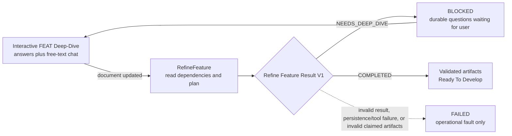

# Refinement And Deep-Dive Iteration Circuit

## Normative status

This document defines the required behavior of `WF-REFINE-EXECUTE`,
`WF-REFINE-DEEP-DIVE`, `WF-REFINE-RECOVER`, and `WF-REFINE-FAIL`. The
machine-readable transition records are in
[`workflow-transition-registry.json`](workflow-transition-registry.json), the
ordered command is in `.workflows/refine-feature.workflow.yaml`, and the exact
worker-result shape is in `.hepha/schemas/refine-feature-result.schema.json`.

Production code and tests must conform to these contracts. They may not add a
round limit, reinterpret unresolved user input as failure, skip the durable
question handoff, or promote a `COMPLETED` result without validation. The
worker may be routed to any eligible model; its result remains an untrusted
candidate under [Model-Agnostic Authority Boundaries](model-agnostic-authority-boundaries.md)
until the exact result, artifact, readiness, and transition contracts accept it. Changing
any of those invariants requires updating this specification, its transition
records, its unit and Gherkin acceptance evidence, and the workflow change
justification before changing runtime behavior.

## Purpose

Refinement is allowed to discover that a clarified FEAT still contains a
user-owned product, scope, architecture, interface, or test-strategy decision.
That discovery is useful planning output. It is not a failed FEAT and is not an
invalid-artifact result.

The circuit is intentionally repeatable:

There is no fixed round or retry limit. A completed Deep-Dive may be followed
by refinement, another new question round, and another refinement until the
worker can produce a complete, non-speculative implementation handoff.

The circuit therefore has four non-negotiable invariants:

1. Unresolved user-owned decisions produce `NEEDS_DEEP_DIVE`, never `FAILED`.
2. Every valid `NEEDS_DEEP_DIVE` result creates or resumes durable interactive
   work before refinement may run again.
3. Completing one Deep-Dive round permits another refinement round and does
   not consume a retry allowance.
4. `FAILED` is reserved for an invalid result contract, an operational/tool or
   persistence fault, or invalid artifacts claimed as `COMPLETED`.

## Result contract

The worker returns exactly one JSON object conforming to
`.hepha/schemas/refine-feature-result.schema.json`.

### Completed

`COMPLETED` means the worker has already written the declared files and moved
the FEAT as required. The result names every durable artifact. Hepha then runs
the independent artifact, debt-readiness, folder-state, and transition-receipt
checks before recording completion. New authoring must use
`hepha-phase-execution/v3`, with `gitCheckpoint: "commit_and_push"` on every
phase and the corresponding pending Markdown audit section. V1/V2 remain
readable only for existing features; they cannot authorize a new refinement
promotion.

### Needs Deep-Dive

`NEEDS_DEEP_DIVE` contains:

- a concise reason citing the conflicting or absent authority;
- one to eight self-contained questions;
- three or four mutually exclusive options per question;
- a recommended option label and consequence for every option.

Hepha normalizes those questions into the existing `DeepDiveQuestion` contract,
creates a durable `question_round` session, records the RefineFeature run as
`blocked`, and emits `workflow.blocked`. It does not validate refinement
artifacts, move the FEAT, or create a failure brief on this route.

The ordinary Deep-Dive UI opens the durable session. Its existing per-question
chat endpoint remains available, so the user can enter free-text context and
steer the conversation before selecting an option. Answers and chat messages
remain associated with the question and are supplied to the document-update
step.

## State and transition rules

| Input/result | Workflow status | FEAT folder | Deep-Dive session | Next permitted action |
| --- | --- | --- | --- | --- |
| Valid `NEEDS_DEEP_DIVE` | `blocked` | unchanged | new `question_round` | answer/chat, then complete Deep-Dive |
| Completed Deep-Dive | `completed` under `deep-dive-feature` | unchanged | completed | RefineFeature may run again |
| Valid `COMPLETED` plus valid durable artifacts | `completed` | Ready To Develop | none | Start Implementing |
| Invalid result JSON/schema | `failed` | unchanged | none | operational diagnosis/retry |
| Deep-Dive-session persistence failure | `failed` | unchanged | no invented partial handoff | operational diagnosis/retry |
| `COMPLETED` but artifacts invalid | `failed` | unchanged | none | repair/retry refinement |

An open refinement-generated Deep-Dive disables another RefineFeature dispatch.
This prevents concurrent question rounds and preserves the existing chat. It is
not a cycle limit: after that session completes, a later refinement may create
a new independent session.

## Ownership

| Responsibility | Owner |
| --- | --- |
| Parse and validate Refine Feature Result V1 | `parseRefineFeatureWorkerResult` |
| Decide promotion versus Deep-Dive handoff | `RefineFeatureExecutionApplication.execute` |
| Persist refinement-generated questions | `RefinementDeepDiveHandoffApplication.create` |
| Answer questions and preserve free-text chat | `DeepDiveSessionApplication.answer` and `.chat` |
| Update the FEAT document after answers | `DeepDiveCompletionApplication.complete` |
| Prevent refinement while questions are open | `FeaturePreparationApplication.startRefine` |
| Present the blocked run as a Deep-Dive action | `buildRecoveryActions` |

## Acceptance tests

### Unit acceptance

1. A `COMPLETED` result is accepted only when it names all generic mandatory
   artifacts and at least one `Phases/phase-<number>` document.
2. A `NEEDS_DEEP_DIVE` result is accepted only with a reason and valid
   interactive questions; questions are normalized with empty chat history.
3. Prose, malformed JSON, incomplete completion receipts, and malformed
   questions are operational errors.
4. A valid blocked result creates a durable `question_round`, records the
   refinement as `blocked`, and never calls artifact validation or promotion.
5. The handoff never overwrites an already-open Deep-Dive conversation.
6. A blocked refinement disables a second refinement dispatch and exposes the
   Continue FEAT Deep-Dive action.
7. Existing Deep-Dive chat stores both user and assistant messages on the exact
   refinement-generated question.
8. A structurally readable V1/V2 phase contract is rejected at the new
   refinement promotion boundary with `OBSOLETE_PHASE_EXECUTION_CONTRACT`,
   while the historical execution reader remains compatible.

### Gherkin integration acceptance

The executable scenarios in
`apps/orchestrator/test/generic-refine-feature-execution-application.feature`
cover:

- successful artifact promotion;
- refinement-to-Deep-Dive blocking without artifact validation;
- free-text steering of refinement-generated questions;
- unlimited sequential Deep-Dive/refinement rounds;
- malformed-result operational failure;
- invalid claimed artifacts;
- durable artifact recovery;
- architecture-debt readiness;
- exact refined-source confirmation.

All scenarios remain generic. No FEAT ID, phase number, phase title, provider,
credential mechanism, or incident-specific filename controls this circuit.
