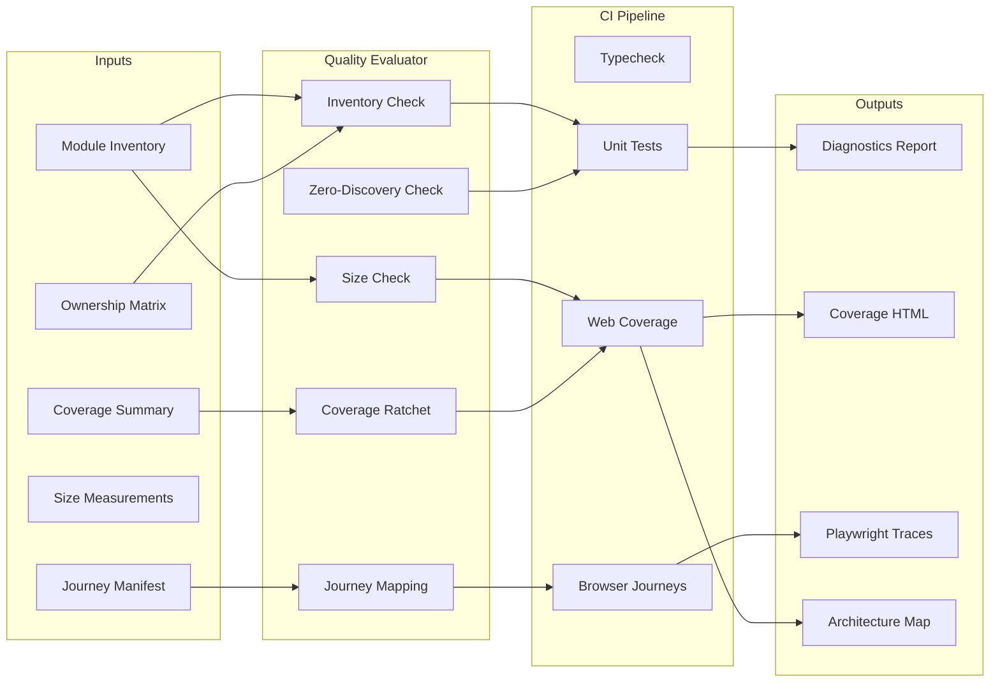

# Web Module Architecture Map

**Epic:** EPIC-012 — Web Application Architecture And Test Quality  
**Feature:** FEAT-057 — Web Quality Gates And Journey Coverage  
**Last updated:** 2026-07-21
**Ownership matrix:** `docs/quality/web-test-ownership-matrix.md`

## Module Hierarchy

```
apps/web/src/
├── main.tsx                        (bootstrap entry — 10 lines)
│
├── app-shell.tsx                   (controller wiring — 156 lines)
│   ├── Application shell view      (app-shell-view — 282 lines)
│   ├── Workspace controller        (useWorkspaceController, including project-scoped MemoryBank events)
│   ├── Navigation controller       (useAppNavigation — coherent view, detail, project, and overlay transitions)
│   ├── Board/Detail routing        (work-board, epic-board, feat-board)
│   ├── WorkItemDetailBlade         (detail/ directory — 12 modules)
│   │   ├── validation panel        (inline ValidationPanel ~800 lines — FEAT-057 cutover)
│   │   │   └── WorkflowInteractionPanel  (workflow/ — 11 modules)
│   │   └── Document/Relations/Etc  (document-preview, relation-panel, etc.)
│   ├── Live activity               (use-live-activity → live-activity-stream-lifecycle E2E)
│   ├── Approval queue              (approval-queue.tsx → approval-queue E2E)
│   ├── Delivery panel              (delivery-panel.tsx → feat-046-delivery E2E)
│   ├── Git state panel             (git-state-panel.tsx)
│   ├── Workflow position           (workflow-position-card-stack, workflow-position-synopsis)
│   ├── Receipt views               (receipt-detail, receipt-search)
│   ├── Trace view                  (trace-view)
│   ├── Run metrics summary         (run-metrics-summary)
│   ├── Phase invocation list       (phase-invocation-list)
│   └── Miscellaneous               (missing-feature-preview, use-live-activity)
│
├── boards/                         (9 modules — FEAT-055)
│   ├── Board selectors             (board-selectors, board-helpers, board-types)
│   ├── Board rendering             (epic-board, feat-board, work-board)
│   ├── Card components             (work-item-card, invalid-source-card)
│   ├── Board validation            (board-validation — FEAT-056 territory)
│   └── Completed features          (completed-features-view)
│
├── details/                        (12 modules — FEAT-055)
│   ├── Detail blade                (detail-blade, work-item-detail-blade, source-issue-detail-blade, project-blade)
│   ├── Document preview            (document-preview, mermaid-diagram, markdown-utils)
│   ├── Utilities                   (app-shell-utils, path-utils, error-utils)
│   └── Display components          (relation-panel, summary-tile)
│
├── workflow/                       (11 modules — FEAT-056/057)
│   ├── Types                       (types.ts)
│   ├── Data                        (workflow-mappers, workflow-api, workflow-presentation)
│   ├── Controller                  (use-workflow-controller)
│   ├── Integration                 (workflow-integration)
│   ├── UI panels                   (workflow-interaction-panel, workflow-overview-panel,
│   │                                workflow-phase-list-panel, lifecycle-controls-panel,
│   │                                completion-readiness-panel)
│   └── _Test browser journeys_     (feat-056-workflow-interactions — Gherkin gap, Phase 7)
│
├── workspace/                      (production workspace boundary)
│   └── Controller                  (use-workspace-controller — projects, scans, selection,
│                                    document detail, and MemoryBank events)
│
├── test/                           (web test directory)
│   └── feat-037-ui.test.tsx        (run-metrics-summary tests)
│
└── e2e/                            (Playwright browser tests)
    ├── features/                   (10 Gherkin feature files)
    └── *.spec.ts                   (6 implemented + 0 missing specs = 4 gaps → Phase 7)
```

## Quality Gate Map



## Seam Audit: ValidationPanel → WorkflowInteractionPanel

### Current State

| Location | Component | Lines | Action |
|----------|-----------|-------|--------|
| `app-shell.tsx:2560-2646` | Inline `panelContents` with `<ValidationPanel>` | ~86 | Replace with `WorkflowInteractionPanel` (Phase 5) |
| `app-shell.tsx:2668` | `function ValidationPanel(` | ~800 | Remove inline definition (Phase 5) |
| `workflow/workflow-integration.ts` | Integration adapter | 89 | Ready — maps legacy action IDs to WorkflowActionId |
| `workflow/workflow-interaction-panel.tsx` | Composition component | 202 | Ready — will receive panel data through integration adapter |
| `details/work-item-detail-blade.tsx` | `panelContents` slot | 169 | Ready — slot already accepts ReactNode at line 39 |

### Callback / State / Accessibility Contract

| Concern | Current (ValidationPanel) | Target (WorkflowInteractionPanel) | Status |
|---------|--------------------------|-----------------------------------|--------|
| Action callbacks | 19 inline callbacks passed as props | Typed WorkflowActionId dispatch via controller | ✅ Adapter ready |
| Item state | Props from app-shell | Snapshot from useWorkflowController | ✅ Existing |
| Pending indicator | Local state | Controller provides pending/isBusy | ✅ Existing |
| Error handling | Inline catch/promise | Structured rejection (validation_failure/blocked/unavailable/conflict) | ✅ Existing |
| Accessible labels | Within inline JSX | Within panel components | ✅ Existing (panels have labels) |
| Keyboard operation | Buttons in inline JSX | Buttons in panel components | ✅ Existing |
| Focus preservation | Not explicit | Not explicit | ⚠️ Verify in Phase 5 |
| Draft retention | Not explicit | Submissions preserve on failure | ✅ Existing |
| Live refresh | EventSource on workspace | Controller recovers on SSE | ✅ Existing |

### Cutover Strategy

1. Import `WorkflowInteractionPanel` and `createWorkflowIntegration` in `app-shell.tsx`
2. Create integration adapter instance in the detail blade selection path
3. Replace `<ValidationPanel>` call site with `<WorkflowInteractionPanel>` using the adapter
4. Remove the inline `ValidationPanel` function definition
5. Verify all 19 callback scenarios are covered by the mapped ActionId dispatch
6. Run focused tests + existing full suite

## Ownership Reference

See `docs/quality/web-test-ownership-matrix.md` for the complete module × gate matrix.

Key linkages:
- **Phase 5:** `app-shell.tsx` lines 2560–2668 (ValidationPanel inline region) + `workflow/workflow-interaction-panel.tsx`
- **Phase 6:** `.github/workflows/ci.yml` + quality evaluator integration
- **Phase 7:** `apps/web/e2e/features/*.feature` → matching `apps/web/e2e/*.spec.ts`
- **Phase 8:** Full reconciliation with acceptance criteria
