# Hepha Workflow Control-Flow Map

## Common phase policy and current conformance gap

The [common phase completion policy](phase-completion-policy.md) is the agreed
target for every phase. Task prompts define work; independent Need Code Review
and Need Test Coverage flags select their loops; configured commands/actions
produce evidence. Identifiers never select different completion rules. Ordinary
gate failures keep repair in the same phase, while an architectural/authority
impasse or repeated lack of meaningful progress requires explicit escalation.
All declared work and gates must pass before advancing.

For MCP actions, the MCP procedure owns phase repair inside one Pi session.
HEPHA validates the returned artifacts and declared evidence; it does not start
additional repair conversations. Pi alone owns that session's context and
compaction. A returned unresolved gate remains blocked; it is never a pass.
See WJ-2026-153 and the execution boundary below.

## Collective verification and diagnosis recovery

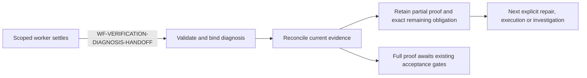

Planning, implementation, independent review and readiness share the versioned
`verificationContract` policy. The accepted project/phase contract owns test
layers, selection, repositories, fixtures and required integration boundaries;
HEPHA does not add a universal test stack or feature-specific test tags.

`WF-VERIFICATION-DIAGNOSIS-HANDOFF`: a still-owned phase repair invocation may
publish one `HEPHA_VERIFICATION_DIAGNOSIS_V1` handoff. HEPHA validates its exact
selected criterion IDs and bounded source-cited diagnoses, then persists the
latest outcome per phase before automatic refresh. Missing handoffs become
investigation, not a pass or a missing-test inference. Invalid handoffs fail
publication. Cancelled/replaced invocations cannot publish.

Readiness preserves valid partial evidence separately from approvable full
coverage. Complementary reports may collectively establish a criterion; an
unproved required boundary keeps only that criterion unresolved. Persisted
partial contributions are included in its phase repair instructions. Diagnoses
are routing context, not execution reports or a reason to repeat full assessment.

Reference/provenance validation treats each manual or automated contribution
independently. Completeness checks run on the full criterion group, never on an
isolated manual link: mixed evidence is allowed, manual-only proof cannot settle
an explicit automation requirement, and unrelated criteria cannot lend each other
automation. An explicit unresolved obligation retains all valid partial evidence.
An invalid additional link appends its diagnostic without replacing the original
reason, execution prerequisites or source-cited diagnosis. Approval revalidation
uses the same grouped rule; it never silently discards valid manual contributions.

Configured action routing receives current pack/review-bound manual outcomes,
validated partial links and preserved diagnoses. Historical phase prose cannot
revoke those outcomes. The routing stage owns only the exact remaining work,
not coverage, execution or acceptance. Assessment version v11 and configured
action version v3 invalidate old cached conclusions while preserving valid
source-bound approvals, test results and unchanged manual packs.

Current diagnoses refine only still-unresolved criteria. A cited missing
implementation routes to a subsequent explicit phase repair, not overwritten
by the presence of a configured suite. Evidence-linkage or unknown-context
findings route to investigation. Source/configuration changes invalidate stale
diagnoses; changing only an invocation ID does not invalidate unchanged evidence.
An unchanged repair/investigation requires new source context or human guidance.
Environment retry still requires prerequisite acknowledgement and real preflight;
acknowledgement is never proof. Documented runner-owned bounded setup/cleanup is
allowed only under existing project and action permissions. No automatic
external provisioning or feature completion is introduced.

Static command adapters remain intentionally bounded. Unsupported cases are
investigation, not missing tests. Action routing also receives phase source
context; model-suggested commands remain untrusted preflight inputs. The accepted
project verification matrix defines required tests and regression scope.

## Incremental manual verification and recoverable authoring

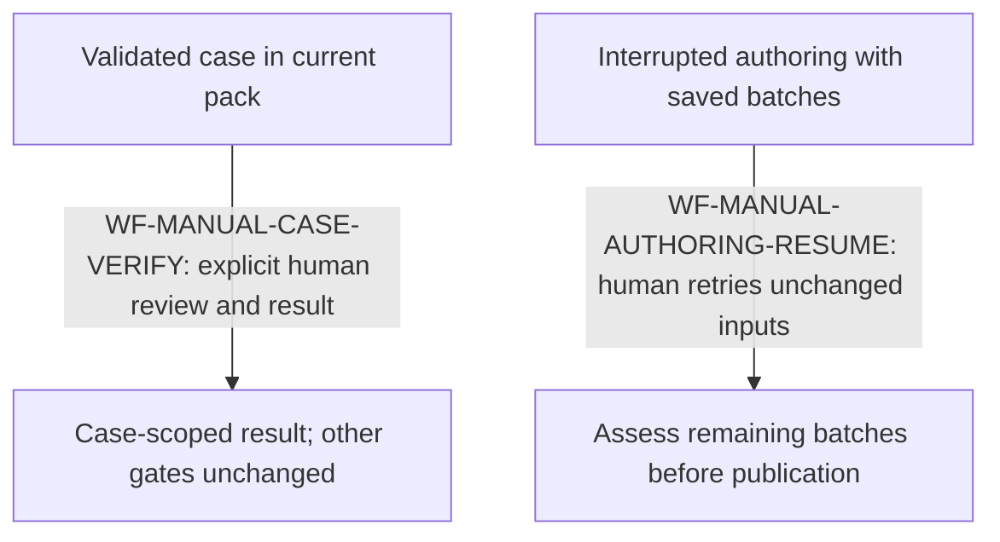

`WF-MANUAL-CASE-VERIFY` separates case validity from aggregate coverage. A human
can explicitly review a validated case in the exact current pack and record its
observed pass/fail even if another criterion is uncovered. A scoped review does
not approve the whole pack. Stale/superseded artifacts remain blocked. Bulk
acceptance still requires a ready, wholly reviewed pack. Individual results only
settle manual acceptance after every required case has passed and the whole pack
is ready and reviewed; other feature gates remain authoritative.

`WF-MANUAL-AUTHORING-RESUME` divides authoring into batches of at most three
criteria. Each complete, validated proposal batch is atomically checkpointed.
Timeouts preserve the published pack and saved drafts; retrying with identical
sources, guidance and pack identity resumes the remaining batches. Changed
inputs start a fresh assessment. Sources are rechecked at each batch boundary.
The dashboard shows durable progress and interrupted-run recovery. No draft,
checkpoint, regeneration or case review constitutes a passing test result.

## Completion readiness refresh (WF-COMPLETION-READINESS-REFRESH)

WF-COMPLETION-EXISTING-EXECUTION distinguishes identified tests from executed
coverage. Structured, validated execution suggestions carry test paths, a
configured command and any concrete environment prerequisite. The owning phase
shows these outside collapsed details and offers **Run existing verification**.
The phase action retains explicit setup acknowledgement. The user Refresh action
may instead authorize actual worker preflight without claiming setup is available;
neither acknowledgement nor discovery is evidence. Missing execution alone cannot
justify test creation or production edits. An actual failing run permits one
phase-scoped correction and rerun under the existing project authority, never
weakened assertions. Missing setup stays blocked; imported reports trigger
automatic reassessment.
Legacy pending proposals retain their valid links while unresolved decisions
are upgraded. Manual captions consume refreshed server status without creating
new human results. See WJ-2026-075 and paired Gherkin scenario CR-05.

```mermaid
flowchart LR
  DisplayedReadiness -->|WF-READINESS-EXECUTION-HANDOFF: explicit user refresh| FreshInspection[Inspect all feature phases and configured verification scope]
  FreshInspection --> FreshExecution[Snapshot sources and rerun every distinct related check]
  FreshInspection -->|plan or command admission diagnostic; continue while defects resolve| PlanCorrection[Correct check classification and scope without executing]
  FreshInspection -->|recoverable worker error; retain scope and saved progress| FreshInspection
  PlanCorrection --> FreshInspection
  FreshInspection -->|explicit spending cap reached| InspectionStopped[Preserve partial inspection; no tests or fallback]
  InspectionStopped -->|later user Refresh; validate source and checkpoint identity| FreshInspection
  FreshExecution -->|WF-COMPLETION-READINESS-REFRESH: validate reports and unchanged sources then assess| CurrentEvidence[Assess phases, gates, reviews and fresh collective coverage]
  FreshExecution -->|receipt or native-report validation diagnostic| EvidenceRepair[Return diagnostic, plan and current evidence to verification agent]
  EvidenceRepair -->|correct receipt or rerun affected configured checks; revalidate sources and reports| FreshExecution
  FreshExecution -->|recoverable worker error; retain completed reports| EvidenceRepair
  EvidenceRepair -->|correction worker error; include failure in next prompt| EvidenceRepair
  EvidenceRepair -->|repeated or cycling validation defects after diagnosis| FreshBlocked[Keep readiness blocked; retain attempts and specific diagnosis]
  FreshExecution -->|changed source, cancellation, runtime or authority boundary| FreshBlocked
  CurrentEvidence -->|owned refresh starts, notify project| RefreshingCard[Feature card shows spinning Refreshing readiness, not Idle]
  RefreshingCard -->|WF-COMPLETION-RECOVERY-UI-LOCK: server lock or local pending request| RecoveryControls[Disable refresh and conflicting mutations; preserve drafts and read-only navigation]
  RecoveryControls -->|server lock released and local request settled| SettledCard
  RefreshingCard -->|lock released on success or failure, notify project| SettledCard[Feature card shows current settled status]
  CurrentEvidence --> EvidenceSnapshot[Verify receipt reports and current pack-bound human results without changing pack]
  EvidenceSnapshot -->|complete index fits| ProposedCoverage[Tool-free evidence link proposals]
  ProposedCoverage -->|WF-CONFIGURED-VERIFICATION-ROUTING: unresolved execution actions| ConfiguredTargets[Select canonical target from static project configuration]
  CurrentEvidence -->|upgrade cached action decisions without repeating coverage| ConfiguredTargets
  ConfiguredTargets -->|known existing run, merge shared requirements| ExecutionPrerequisite[Phase shows required setup and existing verification]
  ConfiguredTargets -->|WF-VERIFICATION-SETUP-INSPECT: explicit phase repair request| VerificationInspection[Investigate findings, correct scoped defects and execute affected checks]
  VerificationInspection -->|publish results and automatically reassess| CurrentEvidence
  VerificationInspection -->|completed repair changed source; still owns run| FreshInspection
  ExecutionPrerequisite -->|WF-COMPLETION-EXISTING-EXECUTION: explicit request after setup acknowledgement| ExistingExecution[Preflight and run existing checks without implementing duplicates]
  ExistingExecution -->|actual report or explicit environment blocker, automatically reassess| CurrentEvidence
  EvidenceSnapshot -->|large index| EvidencePages[Inspect every identity in bounded extraction pages]
  EvidencePages -->|each validated stage| AssessmentCheckpoint[Atomic stage checkpoint bound to full prompt and current authority fingerprint]
  AssessmentCheckpoint -->|all pages validated| CompactAssessment[Lossless identity and source factoring, shortest catalogue with exact report-reference remapping, per-criterion final assessment]
  CompactAssessment -->|all decisions validated| ProposedCoverage
  CompactAssessment -->|WF-COVERAGE-RESPONSE-CORRECTION: invalid response schema| SchemaCorrection[Save value-free field diagnostic and correct using identical evidence]
  SchemaCorrection -->|corrected response passes unchanged validation| ProposedCoverage
  SchemaCorrection -->|distinct field defect; preserve evidence| SchemaCorrection
  SchemaCorrection -->|repeated defect or runtime boundary| AssessmentRetry
  CompactAssessment -->|failure or irreducible overflow| AssessmentRetry
  AssessmentRetry -->|same inputs after retry or restart| AssessmentCheckpoint
  EvidencePages -->|failure or context overflow| AssessmentRetry[Assessment incomplete - retry refresh without test repair]
  AssessmentRetry --> CurrentEvidence
  ProposedCoverage -->|WF-COMPLETION-COVERAGE-CONFIRM: explicit human confirmation| BoundCoverage[Pack and source-bound confirmation receipts]
  ProposedCoverage --> CoverageReview[Amber phase coverage review, no repair dispatch or generated repair instructions]
  BoundCoverage -->|new report, unchanged per-link bindings| RetainedCoverage[Retain unaffected explicit confirmations]
  RetainedCoverage --> CurrentEvidence
  BoundCoverage --> CurrentEvidence
  CurrentEvidence -->|WF-COMPLETION-PHASE-GAPS: unresolved verification evidence| PhaseGaps[Grouped gaps and managed repair instructions in owning phase]
  PhaseGaps -->|human selects phase repair| ScopedRepair[Existing phase repair worker with server-reloaded gap context]
  ScopedRepair -->|WF-PHASE-REPAIR-READINESS: settled attempt, not proof| CurrentEvidence
  CurrentEvidence -->|remaining human or environment blocker| RecoveryAction[Manual verification, user review or external prerequisite]
  CurrentEvidence -->|all gates satisfied| ReadyForExplicitCompletion
```

Receipt binding compares equivalent literal POSIX/Bash arguments and operators,
including quoted paths, escaped spaces and separately bound console capture.
Harmless presentation differences proceed directly to native report validation;
they require neither receipt rewriting nor a model repair. The raw command is
retained. Assignment syntax, empty arguments, descriptor order, selected tests
and native report destinations remain significant. No shell text is executed to
compare commands; unsupported expansion/grammar retains exact matching and the
existing diagnostic recovery path. This policy is independent of project and
runner. Evidence counts, freshness and coverage assessment remain independent.

`WF-READINESS-EXECUTION-HANDOFF` is owned by
`CompletionReadinessVerificationApplication.refresh`. The dashboard explicitly
sends `verifyExisting: true` with `reassess: true`; confirmation and assignment
cannot carry it. `FreshFeatureVerificationApplication` starts before coverage
assessment regardless of historical ready/blocked/investigation status.
A bounded read-only worker inspects all phases, accepted requirements, linked
repositories, configured runners and shared setup. The server validates phase
accounting only after the full inspection. Its sole write exception is a bounded
run-local partial inspection checkpoint. A spending stop preserves that checkpoint
and sessions; a later explicit Refresh reuses only structurally valid navigation
with unchanged primary-source and feature fingerprints, then re-reads selected
sources in all linked repositories. Missing, changed or malformed checkpoints
require fresh inspection. They never prove execution or coverage. Operator caps
are optional, separate from model context, and never bypassed with automatic
retries/fallback. The feature displays the actionable failure, not raw telemetry.
The server validates complete phase
accounting and unique cwd/command checks before a verification-only worker runs
all related checks, including previous passes and relevant existing regressions.
Before the execution snapshot, HEPHA publishes the admitted inventory into
FeatureDescription TestPlan and Phase Verification References. The inspection
worker may propose exact stale command-literal replacements using the shared
verification.inventory.commands JSON exchange. The host validates its schema,
allowed sections, admitted replacement commands and complete write set; it
preserves acceptance criteria, gate declarations, lifecycle and human evidence.
Corrections retain before/after documents and configuration reasons in the run
folder. Publication updates the feature fingerprint before saving a reusable plan;
cached plans never replay literal replacements. No framework-specific document
patches or production-code repair are authorized. Ordinary assessment-only refresh
still has no write authority. Generated-output snapshot handling remains separate.

One check may satisfy several phases; unrelated suites are excluded. A containing
suite is permitted when reliable filtering is unsupported, with explanation.
Run-local native reports and a run-bound receipt must account for every check.
Failed/skipped/zero checks and missing receipts cannot establish readiness;
receipt/import diagnostics return to the verification agent within the same Refresh.
The worker receives the exact diagnostic, rejected receipt, selected plan, current
native reports and references to project configuration and Phase/Task criteria.
It corrects recording/linkage defects from real execution or reruns only affected
configured checks and necessary dependencies. Unaffected passing evidence is reused.
The unchanged shared importer revalidates every result; worker prose never grants
success. Rejected receipts and responses are retained in run-local recovery audits.
Distinct validation defects can continue beyond two corrections. The same diagnostic
set appearing three times, including cycles, escalates after a diagnosis attempt;
new timestamps, hashes or assurance text alone do not reset this progress guard.
Source and workflow ownership are rechecked on every iteration. Provider/budget
errors are not receipt retries. Historical reports cannot fill current-run holes.
Source-content snapshots include tracked and nonignored untracked files across
selected repositories. Feature documents use a separate semantic fingerprint.
Filesystem read budgets are IO safety limits, not model token-window limits.
This recovery authorizes receipt repair and execution of selected checks, not
implementation/test edits or changed acceptance scope. Substantive plan changes,
production failures and external authority gaps require their owning repair path;
they cannot be resolved by relabelling evidence. Cancellation/replacement ownership
is checked before settlement.
Validated fresh checks may replace an old automated phase-gate verdict only when
the inspected plan explicitly maps that check to the phase and automated gate.
Code review and other human gates are never replaced, nor are unrelated layers.
This is a current evidence projection; historical phase files are not rewritten.

The worker's automatic refresh calls the assessment application directly, without
execution authority. It never starts another worker. A returned repair remains
failed/unresolved if its selected gate still lacks evidence, a report failed, or
assessment could not finish. Confirmation-only coverage may remain for the user;
it does not itself trigger another test run. Another explicit Refresh does run
all related checks again. WJ-2026-094 and FV-01 through FV-06 replace CR-13's
historical-pass reuse policy. CR-14 retains explicit repair settlement coverage;
CR-15 retains large routing coverage on the assessment/phase-action path.

Configured action routing is a separate bounded assessment, not another copy of
the large coverage prompt. Static Playwright configuration supplies target IDs,
commands and paths without evaluating project code. Unsupported or ambiguous
configuration leads to an explicit investigate-and-repair action. Shared runs retain all their
criteria and prerequisites in one execution action. Saved action bindings are
invalidated by configuration or decision changes; configuration is checked again
before dispatch. Failed preflight and reassessment cannot discard the prerequisite
gate. Existing proposals, passing results and human authority remain unchanged.
See WJ-2026-078 and paired Gherkin/server scenario CR-09.

Routing uses the same pinned model limits, token counter and shared whole-refresh
spending budget as coverage assessment (WJ-2026-093). Production requests are no
longer rejected by a fixed character ceiling. Output, framing, provider-wrapper
and schema-correction headroom are reserved. At 50% occupancy, exact source-line
factoring is attempted; at 80%, complete criteria are packed into smaller groups
targeting 75% occupancy. If a single criterion's source context still cannot fit,
the existing bounded, checkpointed source-fact extraction accounts for all pages
and retains citations, scope and negative qualifications. Irreducible non-source
context fails before buying extraction. Partitioning never drops criteria,
configuration targets, prerequisites or current manual outcomes. The legacy
injected runner without model metadata retains a conservative compatibility bound;
the production application always supplies its pinned session policy.

Repeated partial references are grouped in the routing wire projection by exact
criterion, evidence identity and manual-step sequence. Identical explanations
appear once; distinct explanations remain separate assertions, not extra test
executions. Original durable links and approval bindings are not rewritten.
Assessment instructions request reuse of unchanged explanation text instead of
creating new paraphrases and explicitly prohibit empty optional test-path arrays.
Compaction start/completion/failure notifications use the existing feature-card
activity channel. CR-15 pairs the full large-input routing-to-verification journey
with browser and server-only tests, without feature-specific thresholds or IDs.

The existing Refresh button POSTs to the project-scoped completion-readiness
application. Explicit Refresh first runs fresh feature verification. The
assessment-only service remains an opt-in recovery path for a feature that reached the end
but could not complete after verification gaps; ordinary unenrolled scans and
normal completion remain unchanged. It reads the configured project paths,
phases, explicit task/wave ledgers, quality gates, source readiness, findings,
code-review acceptance and current manual evidence. Only unresolved coverage
without implementation blockers invokes the bounded, tool-free model route.

Fresh inspection distinguishes test execution from static checks, preparation
and discovery. Non-test checks may have no test paths; their successful logs
are required for the plan but never provide automated coverage. Test source selections may overlap within one profile: distinct filters,
assemblies, namespaces and configurations can execute different tests from the
same files. Reject identical canonical cwd/command executions, not shared file
ownership. The inspector compares actual delegated selections before choosing
one covering execution for equivalent/full-subset runs; it preserves all source
references and phase obligations. One plan handoff decodes a single
unambiguous JSON value, including fenced or prose-wrapped output, locally before
the existing semantic validator. It never extracts nested fragments from malformed
JSON or chooses between competing payloads. Inspection and correction share a
valid JSON template with the required phase numbers and explicit placeholder
replacement instructions; examples are not execution authority. Raw responses remain diagnostic;
only the validated canonical `inspection-selected.json` plan proceeds to execution.
`FeatureDescription.md` describes or explicitly links the test inventory: owning
repositories, test locations/identities, configured checks and obligation mappings.
Implementation updates it when tests are added, renamed, moved, replaced or removed.
Legacy features may resolve existing authoritative phase/planning references and
record the inventory gap; verification does not rewrite feature documentation.

A validated inspection persists `manual-test-verification/inspection-baseline.json`
before execution. A later explicit Refresh revalidates feature identity, requirements,
inspection contract/project configuration, phase mappings and content snapshots for
the project, MemoryBank and selected repositories. Dirty source and newly added tests
invalidate the baseline. Invalid/missing configuration or test source, corrupt data
or unavailable snapshot support returns to inspection. Unchanged plans retain check
selection with new invocation/report destinations; every check still executes again.
No old report or approval is copied. Source drift during inspection stops before
execution. The baseline survives execution failure and process restart.
Inline-code prose such as glob patterns is not a competing payload; inline JSON
alternatives still are. Malformed output receives a categorized syntax, delimiter,
incomplete, ambiguous or missing-payload diagnostic with line/column and recovery
guidance, without echoing source excerpts. The correction worker receives this
diagnosis and the saved response; successful correction resumes normal execution.
Admission rejection is not an immediate workflow stop: only exhausted correction
or a runtime/authority failure ends the attempt without tests.
Unresolved typed plan and command-admission errors get targeted corrections while
validation progresses, each with the existing three-minute worker runtime limit.
The same diagnostic set recurring three times, including cycles, escalates after
a root-cause diagnosis attempt. Distinct defects can continue beyond two corrections.
Semantic correction reads the saved canonical candidate and aggregate diagnostics,
distinguishing original check failures from dependent references. Configuration
errors name the field, cwd and resolved path. A rejected check does not manufacture
a phase error, and check-ID ordering has no significance. Workers may return small
`checkUpdates`/`phaseUpdates` for diagnosed entries; HEPHA merges them into the saved
candidate, rejects duplicate/unrelated/unknown-field updates, and applies the same
complete validator before persisting the plan. Complete plans remain compatible.
Raw correction output remains auditable and runtime bounds stay unchanged.
Semantic correction
preserves unaffected scope, and is instructed to inspect only configuration needed
for those errors, not repeat feature/workspace inspection. Formatting wrappers
alone require no correction worker. Recoverable inspection worker errors resume
with the original scope, saved progress and exact failure. Execution and evidence
correction worker errors similarly return to the evidence-recovery boundary;
completed reports are retained and only unresolved configured work is rerun.
Runtime policy codes, provider route exhaustion, spending/authority errors and
cancellation do not enter these retries. Correction state records attempt, reason and start time; readiness
projects the reason and elapsed seconds while correction is active. See WJ-2026-098
and `verification-plan-handoff.feature` for shared parser/HTTP execution regressions.
For linked repository verification, command `cwd` is independent of source
ownership. Relative `configurationFiles` explicitly bind their owning Git
repositories; matching `testPaths` can reference those repositories without
rewriting a package wrapper or dropping the delegated runner. Unbound selections
and symlink escapes are rejected. Configured test directories enumerate tracked
and nonignored source for containment and freshness, without treating shared
files across command directories as proof of duplicate execution. Baseline reuse and execution freshness snapshot
all bound repositories, including owners from which no command launches. This
uses the existing plan fields and does not grant additional execution authority.
See WJ-2026-118 and `verification-multi-repository.feature`.

Receipt capture normalization applies to test and non-test checks. An added
checksum-bound run-owned console redirect, including a single parenthesized
literal AND-list, preserves the selected command and its exit semantics. Native
stdout reports still need verified identities/counts; health logs cannot certify
coverage. Scoped multi-repository working-tree claims must match the command
repository and explicitly configured source owners; unbound or alternative
hashes remain invalid. See WJ-2026-119 and `receipt-health-capture.feature`.

Native execution display names are not globally unique keys. The shared importer
retains every passing parameterized record and checks exact totals; repeated
labels use report-local execution references, or bound native execution IDs in
TRX. Available TRX assembly and method context remains visible. Multiple native
reports retain their checksum scope instead of rejecting shared method names.
Repeated report bytes, duplicated TRX execution IDs, failed/skipped results and
count mismatches remain invalid. These references identify report occurrences,
not stable TestPlan entries or unique coverage contributions. Assessment still
compares the documented inventory and actual assertions with acceptance criteria;
passing execution cannot certify an unasserted requirement. See WJ-2026-120 and
`execution-display-names.feature`.

The FEATURE card projects server-owned inspection, plan correction, preparation,
actual planned test-tool dispatch, report validation and evidence-assessment
stages. An active verification worker is not feature finalization. Failed or
interrupted runs clear active labels; labels never certify success. See WJ-2026-096
and paired browser/Twin scenario FV-08.

Phase/repair receipts and Refresh reports use one evidence importer:
`readRecoveryExecutionEvidence`. Refresh supplies its run directory, run ID
and inspected check identities to that importer; it has no separate report
validator. The importer owns checksums, reporter parsing, revision provenance,
counts, deduplication and diagnostics. Current-run/source-snapshot guards remain
at the Refresh orchestration boundary; historical results cannot substitute.
The shared execution prompt contract takes the output destination and rerun/repair
authority as parameters, rather than maintaining a Refresh-specific receipt format.
Successful static/preparation/discovery logs may be empty, but never prove test
coverage. Independent valid reports remain importable when another check is
rejected; required failures still block completion. See WJ-2026-097 and the shared
unit/HTTP integration scenarios in `unified-verification.feature`.

HEPHA creates `receipt-context.json` before dispatch with its own invocation ID
and selected checks. The shared JSON template includes that concrete `runId`.
After successful worker return, ownership and source checks, the receipt producer
normally supplies an omitted root ID in its fresh owned directory and preserves
the original as `receipt.worker.json`. This is best-effort enrichment, never an
admission gate: the shared importer accepts absent/null/empty receipt IDs without
rewriting the receipt. `verifiedAt` is optional audit metadata: missing, malformed,
old or future values alone do not block valid execution evidence. Validation never
compares this worker-authored field with the current wall clock, so an unchanged
receipt cannot change admission merely because time advances. Preserve the raw
value rather than guessing or repairing it. HEPHA's existing workflow start/end
records remain separate from any claimed test execution timestamp.
Current output-directory and source guards remain in force. An explicitly
conflicting ID, mismatched command or invalid native evidence remains rejected;
adding an ID cannot establish a pass. Receipt structure comes from the current
shared contract, not historical receipts. WJ-2026-101 supersedes the mandatory-ID
behavior of WJ-2026-100; FV-10 through FV-13 cover normal ID production, conflict,
successful ID-less import through HTTP and browser Refresh flows. WJ-2026-103
supersedes WJ-2026-101's timestamp gate. FV-13 and FV-15 through FV-17 execute real
test processes and reach readiness after human confirmation with old, absent,
malformed or future receipt timestamps, including when runId also remains absent.
Legacy multi-receipt conflict ordering remains unchanged: contradictory outcomes
still need resolution; a timestamp error alone is not a test failure.

The shared binding policy accepts a single literal `cd <configured cwd> &&`
prefix as equivalent command presentation. It decodes quoted literal paths,
escaped spaces and optional `cd --` without running a shell, then requires the
same configured cwd and unchanged remaining command. It does not rewrite the
receipt or native evidence. Different directories, filters, manifest options,
report destinations, shell expansions and extra commands cannot be dismissed as
formatting. FV-14 executes real synthetic tests through this shell prefix and
reaches readiness through both HTTP and browser while preserving the receipt.
See WJ-2026-102.

Before persisting the execution baseline or creating receipt context, the fresh
verification application runs `resolveVerificationCommands` on both inspected
and reused plans. For built-in Cargo metadata/fmt/clippy/test/build/check commands
with no explicit manifest option and no manifest discoverable from cwd, it binds
the single Cargo.toml already declared in that check's configurationFiles.
Multiple configured manifests require explicit selection; arbitrary command
wrappers and custom subcommands are not reinterpreted. Existing options, cwd,
test paths, phase mappings and report destinations are preserved. The result
passes shared plan admission before dispatch. Original plan and before/after
corrections are retained in run-local audit files; execution context, selected
plan, importer binding and reusable baseline all receive the corrected command.
No previous receipt is consulted and no evidence is rewritten to match a plan.
FV-18 covers current execution and the next Refresh; a server integration test
also upgrades a legacy cached omission without requiring another inspection.
This is configured command resolution, not code/test repair authority. See
WJ-2026-104. Optional runId and timestamp policies are unchanged.

The shared `verification-setup/v2` instruction contract requires dependencies to
be traced to actual runner configuration and fixture/hook implementations.
Generated planning, recovery prose, previous receipts, cached reasons and sibling
projects cannot establish a prerequisite. Inspection records precise setting/call
references; execution rechecks actual setup rather than copying old availability
claims. Runner-owned bounded setup is eligible under the existing authority and
does not require an already-running fixture. Missing scenario state arrangement
is diagnosed separately from missing service startup. Independent checks proceed.
The changed inspection prompt participates in the existing baseline contract hash:
older plans are reinspected automatically, without deleting historical evidence.
This is a model inspection policy, not a deterministic dependency-graph inference
engine; tests prove contract delivery, cache invalidation and actual execution with
a controlled inspection adapter, not arbitrary live-model reasoning.

Inspection follows aggregate wrappers to their underlying projects, filters and
reporters. A wrapper hiding `--no-build` or emitting only totals must be represented
by source-built native checks while retaining required guards/cleanup. Do not
reinterpret aggregate totals as native results. Shared receipt import supports a
bounded `reports: [{path, sha256}]` collection instead of legacy report fields,
validating each file, hash, outcome, unique identity and aggregate count. A separate
console log remains audit-only. Legacy and collection native bindings cannot be
mixed. Hash-first `<hash> @ working tree (...)` and existing working-tree formats
preserve full source qualifications and require one unambiguous hash. Optional
receipt metadata, source snapshots and human acceptance remain unchanged.
Both space-separated and hyphenated working-tree wording are accepted. Assessment
semantics advance to `complete-execution-index/v12` so old cached interpretations
cannot retain the formatting rejection.
WJ-2026-105; FV-19 and setup-contract HTTP/shared importer scenarios.

WJ-2026-106: shared invocation binding also accepts an added terminal
`> <run-owned console log> [2>&1]` on an otherwise unchanged simple test command.
The receipt binds that separate log and at least one independent native report;
all normal native validation follows. Preserve raw commands and receipt bytes.
Reject changed selection, replaced native outputs, existing redirect overrides,
append mode, shell expansions/statements and logs outside the current run.
No shell text is evaluated to establish equivalence. FV-20 runs an actual process
which writes native JSON separately from redirected console output and reaches
human-confirmable readiness. Negative cases retain real evidence rejection.

`verificationExecutionPlan` projects only configured check fields and phase IDs.
It excludes planner reasons and no-automation prose from the execution prompt.
`ExecutionReceiptProducer` independently allowlists id/kind/cwd/command instead
of serializing structurally wider check objects into receipt-context.json.
The full plan remains unchanged for audit and subsequent coverage assessment.
Execution starts from referenced configuration and fixture code and is instructed
not to import old inspections/recovery narratives as setup authority. FV-21 proves
the exclusion at both handoff boundaries and actual execution with a controlled
adapter. This prevents automatic propagation; it does not claim to guarantee an
arbitrary model's interpretation of repository files it subsequently reads.
Assessment semantics advance to `complete-execution-index/v13`.

Recovery additionally imports `verification/*.json` receipts using
`phase-verification-receipt/v1`. A bounded local reader verifies the feature,
command, working directory, tested revision, successful non-zero counts and
SHA-256-bound reporter artifacts. Supported reporters are assertion-level
Vitest/Jest JSON, native Playwright JSON, .NET TRX and Cargo test logs; unsupported reports remain explicit
diagnostics, not passes. Discovery, unproven prebuilt execution, mismatched
checksums, failed/empty reports and conflicting or superseded attempts do not
establish coverage. Repeated receipts do not add tests. Exact executed test
identities, not aggregate suite totals, inform human-reviewed criterion links.
This is historical execution evidence, not proof of clean/current source HEAD.
TRX is parsed with a bounded namespace-aware XML parser, rejects DTDs and
requires unique passing results bound to test definitions and execution IDs.
Playwright requires actual unqualified passing executions, not discovery,
expected failures, retries, skipped results or flaky runs. Both reporters must
reconcile every identity with complete non-zero totals. A `logPath/logSha256`
alongside `reportPath/reportSha256` is verified audit context, not another test
suite. Supplemental execution accepts `extraReportPath/extraReportSha256` or
legacy `extraPath/extraSha256`; contradictory aliases fail closed.
An explicit `working tree @ hash` or `hash + qualified working tree` baseline
retains its source-state qualifications verbatim; it is never promoted to a
clean-commit claim. New producers should use a hash and separate `treeState`.
Unproven `--no-build` results and aggregate-only .NET console summaries stay
excluded. Reuse existing source-built identity-level TRX rather than rerunning
unrelated passing suites. Missing fixtures remain environment limitations.
Importer semantics are included in the assessment version fingerprint so an
upgrade reassesses formerly unsupported evidence without clearing human passes.
Recovery also supplies bounded exact criterion mentions from source documents,
including late repair tables omitted by ordinary excerpts. These source claims
are mapping context only and cannot substitute for executed report evidence.

The same snapshot includes authoritative current pack/review-bound manual
results; an older Markdown PENDING claim cannot override a saved PASS. The
latest result is used, and stale review bindings are rejected. Receipt/report
and result fingerprints bind proposals and confirmations and are rechecked
before publication and during subsequent scans. Changing evidence invalidates
coverage decisions, not the unchanged package or its human review/results.
This recovery-only snapshot never enters the canonical manual-package hash.
Ordinary unenrolled flows still use their existing evidence policies.

Unchanged background refresh reuses its assessment and explicitly reports
that reuse; saved compaction details remain historical. The single supervised
Refresh Completion Readiness action sends `reassess: true` and `verifyExisting: true`, incompatible with
confirmation or phase assignment. After fresh execution, only this run's
validated automated reports reach assessment. All acceptance criteria are checked,
including criteria previously satisfied by historical automated evidence.
Old automated mappings lose applicability without deleting their audit history;
manual results remain saved and their applicability must be assessed separately.
Background assessment preserves valid current bindings and does not execute.
Current runtime capacity, spending limits, schema correction bounds and all
recovery locks still apply. Reassessment alone grants no execution authority;
the user-only handoff described above owns configured verification. Evidence
manufacture, automatic confirmation and completion are never authorized. A fresh unresolved decision may remain
blocked; reassessment is not a promise of approval.

The recovery index retains every verified identity, including supplemental
reports. There is no first-N identity or character prefix cutoff. A complete
prompt fitting the model-derived planning target is assessed directly. Production
readiness pins one approved plan and reads current local Pi SDK context/output limits for all
permitted routes; the most restrictive effective capacity controls planning. Missing
limits stop before dispatch. The provider hook checks the effective model again on
every complete wire request. The old 94,000-byte target is only a compatibility
default for injected assessment runners without model metadata, not the production
route. Available context subtracts the actual requested output allowance and 4,096
framing tokens. Readiness binds up to 16,384 output tokens on supported transports.
Codex subscription requests omit unsupported output fields and reserve catalogue
maximum output instead. Planning obtains the provider from the same connection
resolver as execution; model names and display labels cannot select the contract.
Local BPE token counts determine occupancy; bytes are diagnostics, not tokens.
Optional operator-owned cumulative input spending caps never change these thresholds.
At 50% use lossless identity/source/diagnostic compaction; remeasure, and at 80%
use cited fact extraction and bounded evidence/criterion partitioning. Target 75%
with another 2,048 tokens reserved for the provider wrapper. Local text token counts
are not billed usage or exact provider chat/image accounting. Model windows come
from effective SDK metadata, never model-family constants. Each refresh reads one
bounded, read-only SDK snapshot using provider plus model identity, including user
overrides, before planning. The display catalogue cache cannot trigger startup
compaction or enlarge capacity. A manual catalogue scan is not required; missing,
ambiguous or invalid live limits stop before dispatch rather than reverting to the
cache. No model request or catalogue mutation is involved in this lookup.
The server-owned recovery activity exposes running/completed/failed compaction,
level and request token counts. Legacy byte-only activity is not relabelled as tokens.
The card says Compacting context while running, then
Context compacted — refreshing readiness until recovery settles. Saved completion
of compaction remains visible in readiness; it is not completion approval. Locks
remain active through compaction and final assessment; terminal cleanup removes
the in-memory activity. A restart never revives a persisted compaction spinner.
Lossless identity/source compaction is attempted before any retrieval call.
If large source documents still prevent a fit, exact contiguous source passages
are inspected in bounded pages once for all requested criteria (maximum 48 pages).
Every page must account for every passage and criterion and cite only its supplied
passage IDs. Extract concise, exact additional operative clauses rather than whole
related paragraphs or repeated criteria. Keep conditions, prohibitions, uncertainty,
negative evidence, evidence references and prerequisites. Each page explicitly
attests completeness; incomplete extraction cannot produce a verdict. Quotes are
bounded to 1,200 characters, page facts to 12,000 serialized UTF-8 bytes, and final
source context to 24,000 locally counted tokens per criterion in production. The
quote and fact byte limits are artifact/schema bounds, not model window thresholds.
Oversized requests or valid JSON fact
arrays exceeding count/byte limits are recursively subdivided into strictly smaller
disjoint passage groups, with at most 96 stage visits. Successful children are
checkpointed. Invalid JSON, missing accounting and fabricated quotes are not
size retries. A single irreducible passage fails without repeated identical calls,
truncation or a missing-test inference. Count and byte overflows are distinguished
from an invalid facts array. Duplicate quote occurrences require
an explicit occurrence index. Scope is resolved at the quote, including document
changes inside a passage. Original text, offsets, scope, full-source digest and
exact criterion memberships survive aggregation; no model-written summary replaces
a requirement. A literal quote catalogue can share text while retaining separate
scope, memberships and citations. All selected cross-page clauses are reunited.
Criterion-scoped source selection avoids repeating discussions. It is
retrieval, not a proof that omitted context is irrelevant or implementation missing.
Already bounded complementary report evidence does not need raw identity retrieval.
Before identity retrieval, the planner checks a lower-bound payload retaining all
source clauses, manual steps, human outcomes and report metadata but no identities.
If even that cannot fit for a criterion, it stops without buying futile identity
retrieval. It does not discard requirements or infer missing client tests.
Otherwise larger evidence inputs use
lossless identity pages of at most 60,000 locally counted tokens (maximum 24),
further limited by the current model planning target, to retrieve potentially
relevant identities for the requested criteria. Every page must acknowledge
its full count and cite only supplied indexes. A final bounded assessment sees
the union of selected identities from all pages, the saved human outcomes and
source context. If that union is too large, criteria are greedily packed into
bounded groups (maximum 24), each retaining the exact union of selected cross-page
identity indexes from every member. This avoids repeating shared evidence in one
call per criterion. Each criterion remains whole;
individual criterion evidence is never truncated. Oversized final contexts factor
shared identity prefixes/suffixes and exact duplicate identities across reports.
Report-specific ordered references preserve membership and provenance. Repeated
source lines can be represented once with an ordered occurrence index. These
encodings also share diagnostic origins and exclusion reasons without changing any
diagnostic string, occurrence or ordering, or the adjacent saved human results. All
prompt-only encodings reconstruct the entire original selected evidence and
selected source excerpts; they are not model summaries or changes to package identity.
The production planning budget tokenizes serialized prompts, reserves 1,800 tokens
for each schema correction and enforces `HEPHA_READINESS_MAX_INPUT_TOKENS` when
configured. Checkpoint hits consume no dispatch budget. Compatibility-only
injected runners without model metadata retain their legacy byte-based test bounds.
Spending limits are separate from context occupancy; the actual-model runtime guard remains
authoritative and may reject a request for a smaller model context.
Extraction is not a coverage decision; no partial proposal is
published if extraction fails, references are invalid, or selected context
still exceeds the bound. Such failures are assessment-retry blockers, not
phase test-implementation gaps. Existing independent quality gates remain.

Each validated extraction and final-assessment stage is atomically checkpointed
under the feature's ignored manual-verification artifacts. Its key binds the
exact prompt and current algorithm, source, pack, report and human-result
fingerprints. Reloads run the same validation again; damaged, invalid or changed
stages are dispatched afresh. A retry or application restart reuses matching
completed work, never a failed stage. No partial proposal is published if a
later criterion fails. Checkpoints are neither approvals nor test outcomes.
An incomplete assessment is labelled as such in the manual-pass caption; it
cannot establish that no gaps exist. Only satisfied gates and explicit required
coverage confirmation produce green manual completion and enable the existing
human-triggered Complete Feature action. No automatic finalization is introduced.

Refresh activity notifications use the existing project-change stream. Start is
published with the server lock held; settlement is published only after release,
including failures. Card activity uses the existing `recovery-running` projection,
not a guessed workflow run or a stale blocked verdict. It replaces the Idle stack
and suppresses the generic completion-blocked badge only while the in-progress
feature owns this activity. Terminal features ignore stale activity. Other
features, stored results, approval requirements and completion gates are unchanged.

The assessment algorithm version is part of the recovery fingerprint and is
recorded alongside new decisions. A normal refresh after upgrade rejects old
proposals/confirmations and reassesses unchanged source evidence once, without
regenerating the manual package or clearing human results. Subsequent refreshes
may reuse an unchanged current-version proposal. Restart alone cannot make an
old decision current, and old proposals cannot be confirmed after upgrade.

Refresh separates existing links awaiting confirmation from missing evidence.
Confirmation-only criteria are amber review work, never red quality gaps or
worker instructions; direct repair requests for them are rejected before dispatch.
Mixed phases show only the genuine repair count, with both actions outside the
collapsible details. Refresh groups genuinely unresolved criteria into the verification owner's acceptance
coverage gap, and genuinely unfinished ledger evidence into its own phase's
task gap. Unique completed task sections with completion timestamps reconcile
stale ledger checkboxes without inventing work or changing recorded status.
Ownership uses phase responsibility, not fixed phase numbers or incidental
criterion mentions in planning; ambiguous ownership requires an explicit phase
selection. The readiness panel summarizes gap counts and focuses real phase
repair controls. It never creates generic findings for known coverage gaps.

Managed phase sections are idempotent repair instructions, excluded from source
fingerprints, manual coverage discovery and quality evidence parsing. They
cannot prove their own resolution. Repair and semantic-link confirmation
buttons remain outside collapsed phase details. Explicit repair reloads current
gaps on the server, binds the phase document timestamp and dispatches the existing
scoped worker. A worker return does not clear the gap; evidence reassessment does.

Verified receipt imports carry typed revision, qualified source state, executed
count and report hashes. Coverage validation consumes that proof rather than
searching free-form text for an incidental commit from another repository.
Human confirmation receipts also bind each link to its exact criterion, evidence
and (for manual links) current human outcome. Adding or repairing one report
preserves unchanged confirmations under the same source/package/algorithm;
changed evidence loses only its affected links on refresh. Source/package or
algorithm changes still require reassessment, and invalid execution never passes.

The four `CR-*` journeys in `apps/web/e2e/features/completion-loop.feature` have
one shared scenario catalog and one execution at each requested boundary:
`completion-loop.spec.ts` drives the built React UI over real HTTP;
`completion-loop-twin.integration.test.ts` drives the same production routes,
applications, files and SQLite store without a browser. Only model/worker
execution and unrelated portfolio data use controlled adapters. The contract
test rejects missing, duplicate or renamed Gherkin mappings. These are paired
test layers, not duplicate test implementations added to any client feature.
Run `pnpm exec playwright test --config playwright.completion.config.ts` after
building the web app for the isolated browser journeys; the ordinary Playwright
suite also discovers them. Every fixture owns and closes its ephemeral server
and database. No journey calls feature finalization or accesses a private project.

The server automatically invokes the existing readiness refresh once after a
phase quality repair settles, including failed attempts with partial evidence.
It first persists the terminal repair outcome so reassessment does not see an
active workflow. Cancelled or superseded runs do not trigger it. The repair lock
is retained through reassessment, and a final project-change event refreshes
the dashboard independently of popup lifetime. Refresh failures preserve the
repair outcome and record a manual retry instruction. No confirmation, waiver,
repair loop or finalization is dispatched automatically.

Semantic mappings cite known criterion IDs, existing case steps or passing
automation with command, revision, report and non-zero selection. They require
explicit confirmation through the same endpoint, not another reconciliation
button. Manual links cannot replace explicit automation requirements. Proposed
mappings are validated by criterion: one invalid or contradictory mapping
blocks that criterion without discarding unrelated valid proposals. Malformed
envelopes and unknown criteria remain fail-closed. Confirmed
links live in a separate recovery receipt bound to the exact pack, delivery model
hash and source-document fingerprint; the original pack, reviews and results are
not rewritten. A new source or pack invalidates the overlay. Duplicate recovery
and manual generation are rejected. Refresh never runs tests, grants review
approval, waives a gate, starts implementation or launches completion.

For enrolled features subsequent scans and final completion admission reassess
the recovery evidence. Current individually reviewed passing cases plus resolved
coverage can satisfy the derived manual gate without a fabricated bulk result.
Missing criteria offer an explicit repair-finding draft; known unique phase
references also show a phase coverage badge. Unknown ownership stays at feature
level, never arbitrarily Phase 7. Other blockers lead to existing phase/manual/
human-review controls or a precise external prerequisite. The board displays
remaining completion blockers separately from implementation phase completion.
Transport/model errors preserve evidence; stale proposals cannot be confirmed.

Compatibility header parsing accepts one structured status token followed by
an optional parenthesised descriptive note. The note never supplies status;
unknown tokens, conflicting folder states and unrelated trailing text remain
invalid. Read-only evaluation preserves the original document. Admitted alias
canonicalization preserves any descriptive note.

Evidence: `devcycle-refine-artifact-validator.test.ts`, the completion readiness
panel/controller tests, and the refresh scenario in `workflow-interactions.feature`
and its Playwright implementation. Clearing artifact blockers must reveal the
remaining human checks, not silently record acceptance.

## Phase verification recovery (WF-PHASE-QUALITY-RESOLVE)

`PhaseQualityResolutionApplication.resolve` owns the explicit human action
from each phase's verification disclosure. `POST /api/phase-quality/resolve`
selects a project, feature, phase and gate, never a client-supplied file path.
Admission requires an in-progress feature, one resolved phase, an unresolved
gate, a current contained phase document, and no active workflow or repair.

A blocked Refresh also supplies repairable `verification_failure` gaps from its
actual failed receipt entries and inspected phase/check mappings. The server
revalidates command binding and run-local report checksums before projecting or
dispatching **Fix failing tests / checks**. Historical satisfied gates cannot
hide newer failed executions. Shared checks retain their mapped phase context;
no phase number/title selects repair rules, and execution failures are not
automatically labelled missing acceptance coverage.

The repair goal requires tracing the owning tasks and comparing earlier green
commands/reports with current configuration and committed/uncommitted history.
The worker distinguishes regressions, changed verification scope, false-positive
rules, environment differences and previously incomplete evidence. It repairs
ordinary in-scope findings in its test/review loop, preserving real gates and
escalating concrete impasses or repeated lack of progress. After a successful
worker return for a fresh-failure repair, the server dispatches fresh verification
before coverage assessment; it cannot accept the worker's prose or old receipt.
Other completed repairs reassess first. When source changed since fresh verification,
the server starts fresh verification automatically; unrelated errors remain actionable
failures. Cancellation/successor ownership checks guard this handoff. See WJ-2026-121 and
`fresh-verification-repair.feature`.

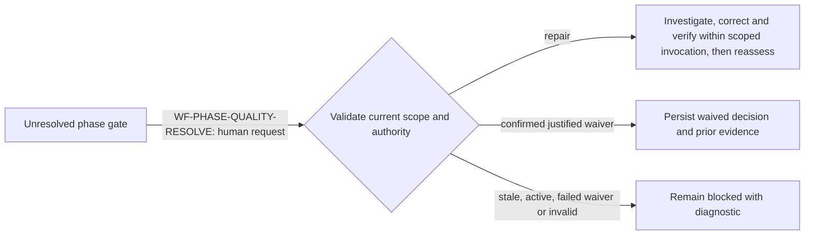

- **Verify / repair:** dispatch one bounded agent attempt with optional human
  instructions. Inspect existing evidence first, implement missing tests or
  minimal corrections when needed, and persist truthful phase verification.
  Retain stable execution-contract identity when available. The worker report
  is not a passing result. Do not advance phases or finalize automatically.
- **Waive:** require explicit confirmation and a meaningful justification;
  persist a dated human decision and preserve previous evidence. The result
  remains `waived`, not `satisfied`. Reject known failures, rejected reviews,
  stale state and concurrent work. Other gates and human acceptance remain.
- **Complete Feature:** remain visible but disabled while quality, artifact
  or human-check blockers exist. Clearing one gate does not authorize release.

Coverage: `phase-quality-resolution.integration.test.ts` exercises real file
writes and quality projection with an isolated worker; the corresponding
Gherkin contract and workflow-interactions Playwright journey cover human
repair instructions, waiver confirmation and remaining completion blockers.

## Authority and purpose

This is the diagnostic map for Hepha workflow behavior. Use it to answer three
questions without reading the whole orchestrator:

1. Which transition should have occurred?
2. Which production method owns that decision?
3. Which unit and Gherkin tests prove the decision?

The workflow specification is documentation-first and has three normative,
machine-checkable parts:

- [`workflow-transition-registry.json`](workflow-transition-registry.json)
  defines transition IDs, triggers, destinations, purposes, implementation
  owners, and test evidence;
- the YAML files under `.workflows/` define ordered command nodes; and
- referenced JSON schemas define agent result contracts.

This map is the human-readable projection of those declarative contracts. The
application methods referenced here implement and enforce the decisions; they
do not independently redefine them. If production behavior conflicts with the
documented contract, the implementation and its tests must be corrected, or
the documentation must first be deliberately changed through the workflow
change-justification process. The dashboard is never transition authority.

Model-produced output crosses a separate authority boundary before it may
trigger any transition in this map. The cross-provider rules, preparation
pipeline audit, schema requirements, and diagnostic checklist are defined in
[Model-Agnostic Authority Boundaries](model-agnostic-authority-boundaries.md).
A workflow working only because adjacent actions use the same model family is
not a complete contract: model output remains an untrusted candidate until a
deterministic Hepha parser, validator, and persistence boundary accepts it.

A transition is incomplete unless it has all of the following:

- a stable `WF-*` identifier in the registry and a Mermaid diagram;
- one production `Class.method` owner with a single stated purpose;
- a durable trigger and destination;
- unit-test evidence for the owner's decision boundary;
- Gherkin evidence for the externally observable route.

## Declared command workflows

This table is a complete index of the command definitions loaded by
`feature-workflow-spec.ts`. The node order comes from YAML; the application
owner supplies each action/prompt implementation and the runtime detours shown
later in this document.

| Command | Declared node sequence | Runtime owner |
| --- | --- | --- |
| `deep-dive-epic` | `create-session` → `generate-questions` → `wait-for-answers` → `answers-ready` → `update-document` → `sync-epic-state` → `record-completion` | `DeepDiveStartApplication.start` and `DeepDiveCompletionApplication.complete` |
| `deep-dive-feature` | `create-session` → `generate-questions` → `wait-for-answers` → `answers-ready` → `update-document` → `record-completion` | `DeepDiveStartApplication.start` and `DeepDiveCompletionApplication.complete` |
| `design-feature` | `collect-context` → `generate-design-artifacts` | `DesignFeatureExecutionApplication.execute` |
| `refine-feature` | `collect-context` → `generate-artifacts` → `evaluate-result` → `promote-ready` (completed result only) | `RefineFeatureExecutionApplication.execute` |
| `start-implementing` | `create-branch` → `move-in-progress` → `sync-linked-epic-state` → `post-process` → `implementation-loop` | `StartImplementationRunApplication.execute` |
| `continue-implementing` | `refresh-current-feature` → `resolve-next-task` → `implementation-loop` | `ContinueImplementationRunApplication.execute` |
| `complete-feature` | `collect-context` → `finalize-feature` → `verify-completed-state` → `sync-linked-epic-state` | `CompleteFeatureExecutionApplication.execute` |

The loader accepts the compatibility `.workflows/` layout and the target
`.hepha/workflows/` layout, but it rejects divergent duplicate definitions.
That path-resolution concern does not add a lifecycle transition.

## Temporary DevCycle MCP recipe-source compatibility

Design Feature, Refine Feature, Start Implementing, Continue Implementing, and
Complete Feature keep `native-hepha` as their default recipe source. An explicit
validated runtime policy may instead select `devcycle-mcp` globally or for one
of those action identities. The selection is made from the action key before
choosing the matching artifact validator, branch preparation, phase routing,
or completion gates. It never derives authority from a FEAT identifier, phase
number, title, status prose, or generated Markdown.

`FeatureWorkflowSummaryProjector.build` keeps preparation actions available
from the relevant FEAT lifecycle folder, but Start and Continue require the
selected provider's artifact contract to be valid. Dashboard enablement,
readiness explanations, direct HTTP admission, refinement promotion, and
manual-test seeding all use that same provider-selected authority. The HTTP
boundary also resolves stable project/FEAT identity and rejects an
already-running workflow.

The MCP gateway invocation uses an explicit server selector and the original
server tool name. HEPHA does not synthesize display prefixes or normalize tool
punctuation for a model/provider. The gateway resolves its configured display
aliases; changing the model does not change this contract. Explicit recipe
handoffs use the same lookup. Missing tools remain blocking failures.
For an installed compatibility gateway, run `pnpm test:mcp-adapter` to check
rendered invocations against its actual tool-name candidate resolver, under
all four display-prefix settings. This offline check uses the same runtime environment and MCP configuration
resolvers as HEPHA, including process-environment precedence over workspace
`.env`, configured path expansion and the workspace-scoped default. The configured
MCP config and adapter paths must exist; the check does not connect to the server. Missing adapters
or incompatible resolver exports fail the check; they are never skipped.
CI's isolated gateway fixture remains independent of a local Pi installation.
This contract check does not replace live provider/workflow verification.

MCP recipe launches contain transport instructions and host integration metadata
only. The returned MCP instructions own verification, TestPlan authoring,
acceptance, manual-test receipt formats and the phase-gate schema. HEPHA does not
prepend copies of native policy text or that schema. It supplies the requested
server/tool/arguments, current validation diagnostics, authorized session boundary,
phase record location and shell-observation ledger location. Deterministic artifact,
receipt and gate validation still runs when the worker returns.

The host refuses refinement before dispatch when the selected target has
unresolved Deep-Dive decisions (`WF-MCP-REFINE-DECISION-ADMISSION`). It rechecks
the target after execution, even if the worker has moved it to Ready, and uses
the existing blocked Deep-Dive recovery when decisions remain unresolved.
Sibling decisions never select this boundary. An independent MCP response
fixture exercises schema-to-record interoperability through real host admission;
incompatible exchange versions or missing mandatory flags remain blocked.

A host-directed phase-gate repair is a distinct recovery action: it does not fetch
an MCP recipe and therefore receives HEPHA's local gate contract. Native workflow
prompts continue to receive their own policies. This launch-prompt reduction does
not change Pi context-budget guards or the host-owned phase continuation loop.

Implementation actions resolve the feature's code checkout before launching Pi.
The resolver enumerates Git worktrees and matches the feature identifier at branch
component boundaries. A unique existing worktree owns the worker cwd and relative
gate evidence; ambiguity, locked/prunable worktrees and missing continuation
workspaces block before launch. Initial start may use a primary main/master checkout
when no feature worktree exists, leaving feature initialization to MCP. It cannot
silently start in another feature's checkout. Project registration, scanner identity
and the supplied MemoryBank feature path remain unchanged. Runtime receipts keep
the registered project identity independently of Pi cwd. Historical relative
execution/review reports can fall back to the registered checkout only for gate
records captured before worker launch whose entire payload remains unchanged;
new or changed records receive no historical fallback. When a report exists in
the selected checkout, current failures remain authoritative. Source validation
never uses that historical-report fallback. New gate records use absolute working
directories and report paths for stable reads by the project evidence view.

The launch declares repository authority separately from MCP procedure: code Git
operations and the clean-worktree gate apply to the selected code checkout. An
external MemoryBank permits scoped lifecycle-document updates, not Git authority
over its shared parent. The worker must not stage, commit, push, stash or clean that
parent, or demand that unrelated projects there be clean. Existing unfinished code
is preserved and still governed by MCP acceptance. This location contract adds no
new acceptance criteria and does not waive failed checks.

`DevCycleMcpCompatibilityApplication.start` owns `WF-RECIPE-SOURCE-MCP`. It
records one workflow run and dispatches a plan-bound Pi worker with the
registered action/model identity. That
worker receives the workspace-scoped `pi-mcp-adapter` and `.mcp.json`, calls the
mapped DevCycle recipe once, validates the recipe's `pending_execution` client
contract, and executes it locally. Preparation uses one session. Implementation
uses one phase per session, including its review and acceptance. HEPHA owns the
outer loop and selects each next action from rescanned durable evidence. Only
explicit `autonomous: true` authorizes advancing to subsequent phases and
finalization; false or omitted autonomy stops at the selected phase boundary.
Each new session resolves its own registered command plan. Native workflow applications and prompts
remain unchanged and are selected immediately when the policy says
`native-hepha`.

This route is a compatibility and diagnostic boundary, not new lifecycle
authority. Legacy MCP output is not forced through Hepha's native V3 document
shape, but it must satisfy the complete DevCycle artifact contract before
Refine may complete or implementation may start. It remains subject to
provider-neutral Hepha lifecycle invariants: Deep-Dive owns target
clarification; Refine may not publish human-sign-off, owner-attestation,
CODEOWNER-approval, manual-acceptance, or user-choice implementation tasks; and
autonomous/single-phase implementation has delegated decision authority plus
automated review and acceptance.

Refine is also a documentation-only planning boundary. Its worker discovers the
stack and configured quality commands from manifests, lockfiles, workflows,
source, and documentation, but does not execute package-manager, compiler,
build, test, lint, audit, dependency-search, or version-probe commands. It may
mutate only the target MemoryBank refinement artifacts and recipe-owned
lifecycle projections. This prevents planning research from compiling product
code, creating generated outputs, or tripping implementation command-safety
policies before an implementation phase exists.

Refinement activates stack-specific execution profiles only from static target
and feature-scope evidence. A Rust/Cargo profile is generated only when the
target product workspace contains `Cargo.toml` and the feature or configured
gates will invoke Cargo. The profile is recorded in `FeatureTasks.md` and
inherited by every generated phase; non-Cargo features receive no Cargo prose.
Sequential Cargo invocations may share one foreground shell tool call, while
background Cargo, sibling Cargo tool calls, overlap with an active Cargo call,
and timeout retries without process inspection remain prohibited.
Implementation compatibility dispatch remains technology-neutral and tells
workers to obey only activated inherited constraints. It also separates
implementation completion from release readiness: only in-scope tasks and
configured executable gates can block phase or feature implementation
acceptance. Separately owned repository work, future suites, physical
qualification, deployment certification, and organizational release evidence
are projected as findings, Lessons Learned, linked-epic updates, and follow-up
EPIC/FEAT recommendations without keeping implementation incomplete.
Configured zero-warning
gates remain red whenever output contains a warning, even if the process exits
zero; workers cannot relabel those warnings as pre-existing or benign to accept
a phase.

Provider ownership also selects artifact validation. DevCycle refinement and
in-progress plans use their durable `FeatureTasks.md` plus phase-file lifecycle
contract; native plans retain strict V3 validation. The selected validator is
evaluated after Refine returns, before its completion metadata is written, and
again before Start or Continue can dispatch. DevCycle refinement publication
also rejects deferred human decisions and manual obligations that are not bound
to exactly one stable `[contract:<taskId>]` phase-ledger item. Existing invalid
artifacts are supplied to the next Refine worker as deterministic repair
diagnostics rather than being mistaken for completed preparation.

Runtime receipts record the selected action/model and the workflow summary
records the MCP recipe source. For Start/Continue implementation telemetry, the
compatibility application selects the first unresolved lifecycle phase from the
provider-owned phase collection and attaches that phase identity to the worker
record. Phase number/title are copied only as display metadata; they do not
select control flow. The immutable handoff plan supplies the orchestrator
command model, while runtime receipts independently retain the observed route
and any fallback. Settled agent executions accumulate in the phase row even
when that phase remains in progress. If one autonomous MCP session crosses a
phase boundary, the durable phase-artifact update timestamp closes the previous
phase segment and the remaining execution time is attributed to the next phase.
Pre-fix MCP runs may use the same display-only reconciliation from the
refinement boundary plus the first phase artifact changed after dispatch; this
evidence never controls lifecycle. Their phase rows retain an expandable
runtime-evidence view backed by immutable orchestrator agent records (agent,
command model, measured segment, status, timestamps, and workflow identity).
The view explicitly distinguishes those facts from an observed provider or
fallback route, which is unavailable when the original invocation was not
phase-bound.

Missing adapter/config assets, invalid source values, MCP errors, a missing
recipe execution contract, or invalid provider-owned artifacts fail without
silently falling back to native instructions.

```mermaid
flowchart LR
  Action["Supported feature action request"]
  Policy["Validated recipe-source policy"]
  Admission["Provider-selected implementation admission"]
  Native["Existing native Hepha application"]
  McpWorker["One plan-bound Pi action + MCP adapter"]
  Invariants["Hepha lifecycle invariants<br/>Deep-Dive closure; no deferred human gates"]
  Recipe["DevCycle MCP recipe and autonomous handoffs"]
  ProviderArtifacts["Provider-specific artifact validator"]
  DeepDiveRecovery["Blocked result evaluation<br/>interactive FEAT Deep-Dive"]
  Failure["Refused admission or durable failed run"]

  Action --> Policy
  Policy -->|"native-hepha"| Native
  Policy -->|"WF-RECIPE-SOURCE-MCP<br/>preparation action"| McpWorker
  Policy -->|"Start / Continue"| Admission
  Admission -->|"valid provider artifacts"| McpWorker
  Admission -.->|"WF-MCP-REFINE-DECISION-ADMISSION<br/>unresolved target decision; no dispatch"| DeepDiveRecovery
  Admission -.->|"WF-MCP-ARTIFACT-VALIDATION-FAIL<br/>invalid provider artifacts"| Failure
  McpWorker -->|"valid pending_execution contract"| Invariants
  Invariants --> Recipe
  Recipe --> ProviderArtifacts
  ProviderArtifacts -->|"valid artifacts + lifecycle postconditions"| ActionDone["Action completed"]
  ProviderArtifacts -->|"WF-MCP-REFINE-POSTCONDITION-BLOCK<br/>outside Ready or target decisions unresolved"| DeepDiveRecovery
  McpWorker -.->|"asset, transport, or contract failure"| Failure
  ProviderArtifacts -.->|"WF-MCP-ARTIFACT-VALIDATION-FAIL<br/>invalid or deferred human gate"| Failure
  ProviderArtifacts -->|"WF-MCP-SESSION-CONTINUE<br/>requested scope incomplete"| Incomplete["Blocked; next explicit user action required"]
  ProviderArtifacts -->|"WF-MCP-PHASE-QUALITY-ADMISSION<br/>resolved phase with unresolved verification"| QualityBlocked["Unresolved evidence; no host repair session"]
  Admission -->|"existing gate diagnostic data; MCP owns repair"| McpWorker
  Admission -->|"WF-MCP-STATE-PROJECTION<br/>validate and canonicalize admitted state"| McpWorker
  Admission -->|"WF-MCP-LIFECYCLE-RECOVERY<br/>isolated stale Ready header"| LifecycleRepair["One bounded lifecycle repair"]
  ProviderArtifacts -->|"WF-MCP-LIFECYCLE-RECOVERY<br/>isolated stale header after a verified move"| LifecycleRepair
  LifecycleRepair -->|"unique In Progress location + valid unchanged evidence"| Admission
  LifecycleRepair -->|"unverified, unsafe or exhausted"| Failure
```

A terminal model process proves only that provider execution returned normally.
For MCP refinement, Hepha rescans lifecycle state and validates the complete
provider-owned artifact set before recording completion. If the FEAT remains
outside `02_READY_TO_DEVELOP`, the run is blocked at result evaluation and the
standard FEAT Deep-Dive action is exposed. If the FEAT was moved to Ready but
its artifacts are invalid, the run fails with stable file/code diagnostics and
Refine remains available to repair the existing output. Start is never exposed
and direct Start requests are rejected before a run, branch, worker, or
manual-test mutation is created.

### Compatibility execution settlement and continuation

Before evaluating `WF-MCP-PHASE-QUALITY-ADMISSION`, the legacy scanner reconciles
declared obligations with recorded checkpoint outcomes and explicit Quality
Metrics tables. Build/compile and lint results do not need duplicate rows in
Quality Gate Evidence. Named passing partition counts with explicit zero failures
are equivalent to repeated passed counts. Counted test, fixture, check, case,
scenario and spec outcomes share one vocabulary for discovery, passing results
and failures; a different count noun cannot turn a passing suite into unknown or
hide a failed check. An exit-zero empty supporting target
(`0 tests`, `zero tests`, or `no tests`) cannot certify testing alone, and does not
erase other executed suites. Expected columns, discovery-only commands, skipped
counts and timing/retry metadata cannot certify execution. Contradictory failures
or warnings remain unresolved even beside a green metric summary.

This representation reconciliation is deterministic and occurs before the guard:
it does not rerun successful checks, rewrite evidence, create a worker, or enlarge
the current phase's obligations. Remaining genuine gaps still block admission.
Native JSON verification remains authoritative; malformed native results never
fall back to Markdown. See WJ-2026-112 and WJ-2026-113.

`WF-MCP-PHASE-QUALITY-ADMISSION` validates persisted phase-quality evidence
when the requested Pi action returns. Existing unresolved gates are supplied as
diagnostic data at launch; the MCP procedure owns their repair inside Pi. A
resolved phase with missing or unknown evidence, or an unjustified waiver,
blocks acceptance. HEPHA does not dispatch another repair worker. New gate
records and revisions must satisfy the existing versioned contract; phase
checkboxes and model assertions cannot replace execution evidence.
An indexed review with a latest needs-changes, blocked or unknown verdict remains
unresolved even if a phase summary row claims approval. Unknown gate projections
must remain visible; the scanner cannot discard them as empty evidence.

Review field extraction excludes Markdown column headers: a `Decision` column
does not override a report's explicit approval verdict. Changed-file inventory
parsing retains wrapped list items and recognises supported non-JavaScript test
names. Compatibility checkpoint tables are read by their named command/result
columns, including nonzero recorded test outcomes even when no test file changed.
Suite labels need not contain the word test: recorded counts and test commands
also identify execution evidence, and Rust `_test.rs` / `_tests.rs` paths are
recognised. Failed, discovery-only, or incomplete checkpoint results remain
unresolved. Aggregate skipped/ignored counts are retained, not credited as passes
or inferred to be missing feature coverage; explicit required-check or coverage
gaps still block. Counted shorthand such as `32/32` and `6 OK` is recognised. Successful
command-only summaries and explicitly empty supporting targets contribute no
passing evidence but do not invalidate other executed suites. These supporting
summaries alone cannot satisfy verification. This is phase evidence projection, not a substitute for native
execution-report validation during fresh readiness verification.


### JSON verification exchanges and phase-specific applicability

`WF-PHASE-JSON-VERIFICATION` binds the native host verification result to the
admitted phase role and configured check set before the phase-quality scanner
uses it. JSON Schema controls shape; semantic validation controls phase/check
membership, outcomes and configured argv/cwd. The schema and prompt projection
share one contract source. Build and lint have separate quality-gate diagnostics.
A migrated phase never recovers a pass from Markdown if JSON is missing/invalid.
Unmigrated compatibility artifacts retain their existing explicit import lane.

Every phase uses independent declared test, integration and code-review gates.
Ordered tasks determine native obligations, including their required/profile/
condition flags; compatibility summary fields and role/file heuristics cannot
add gates. A no-verification phase automatically records N/A regardless of role.
Developers may revise scope applicability with a reason and synchronized
contract/ledger/gate rows; subsequent selection rereads the contract. Existing
failed execution and unresolved reviews are preserved. Checkpoints execute their
declared health checks without requiring edits or undeclared reviews. Browser
E2E is an explicit acceptance obligation, not a consequence of UI source files;
configured frontend/backend integration checks can satisfy phase acceptance.

`WF-VERIFICATION-JSON-REPAIR` exchanges typed repair requests and responses with
the exact phase/task binding and advisory authority. Invalid representation gets
one same-action correction request, with explicit instructions not to rerun tests
or edit source. Exhaustion is a protocol error, not a test failure. A valid repaired
response triggers independent host verification; it cannot certify itself.
Absent/unusable optional audit metadata never fails decision validation.

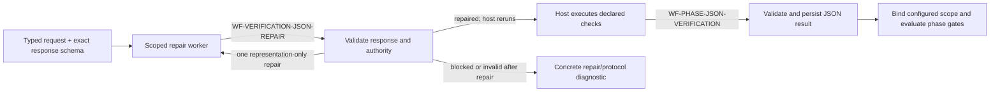

See [JSON exchange protocol](json-exchange-protocol.md) for implemented and
pending message families. The new envelope is not yet universal across legacy
worker actions.

Gate applicability is read from native Quality Gate Evidence rows or compatibility
checkpoint declarations. Justified Not Applicable applies independently of phase
number/name; an actual production-code change conflicting with that declaration
remains Unknown. Untouched-file preservation notes are not phase changes.
Explicit required gates survive an absent changed-file inventory. A required
code-review checkpoint with configured paired tests retains that test obligation;
an assertion of passing tests is not imported as an execution receipt. Native
decisions take precedence except for a recorded unresolved checkpoint failure.
Compatibility review reports are indexed recursively within the feature's
code-reviews folder without following symlink entries. Header Status verdicts are
recognised, while conflicting phase ownership cannot approve either phase.
Existing report verdicts are preserved as review evidence, not a fresh review or
proof of current-HEAD coverage. Applicable test execution remains independently
required; no product suites are invented for a documentation-only deliverable.

For in-progress features, all phase checkboxes being completed no longer hides
a failed implementation run. The dashboard keeps artifact errors visible and
lists each phase/gate diagnostic in a collapsed disclosure on its phase card, with recognised references and conditional
resolution steps: first inspect existing evidence, then repair references or run
missing verification; address actual failures before obtaining a fresh passing
result/review. Expanding verification issues is local, keyboard-accessible and launches no worker. Completion readiness retains the aggregate blockers without repeating the detailed phase list. Phase rows
with unresolved quality evidence show Verification blocked. Human code review
and manual outcomes remain separate obligations; this does not change release
readiness policy or authorize any waiver.

`DevCycleMcpCompatibilityApplication.executeImplementation` owns
`WF-MCP-SESSION-CONTINUE`. It launches the requested MCP command once with its
actual `autonomous` or `single_phase` mode. One autonomous Pi session owns the
whole action, including MCP-directed repair and finalization. A supervised
command owns only its selected phase. HEPHA does not force autonomous requests
into single-phase calls or dispatch follow-up phase, repair or finalization
workers after a return. An incomplete result blocks until another user action.

Pi owns session context and compaction. MCP launches omit HEPHA's
`model-request-guard` extension and host tokenizer admission. HEPHA supplies one
launch prompt, closes stdin and observes output/events. Native HEPHA workers
retain their request policies. An explicit host request-token/output cap is
rejected before an MCP launch rather than ignored; use Pi-owned controls or
process deadlines. Cancellation, idle/deadline enforcement, tool safety and
provider-reported usage audit remain active. No host context estimate rewrites
or kills an MCP conversation.

Progress uses the existing MemoryBank filesystem SSE watcher (or polling
fallback), dashboard rescan and phase-status projection. Current phase files
and the feature phase inventory are authoritative, including while Pi is still
running. No progress request is sent into the Pi conversation. A model's launch
phase is telemetry, not the current phase forever. After Pi returns, HEPHA
rescans the unique feature location, validates lifecycle artifacts, checks phase
inventory/supervised scope and regressions, and independently verifies declared
gates. Feature completion requires a completed folder and no unfinished phases.
Cancellation or replacement of the run wins over a late result.

`WF-MCP-STATE-PROJECTION` admits only declared folder aliases such as
`03_IN_PROGRESS` for canonical document status `IN_PROGRESS`. Readiness is
read-only; admitted execution normalizes the feature header. Arbitrary prefixes,
contradictions with the actual lifecycle folder, and disagreement between a
phase header and its inventory row fail validation. HEPHA reports these as
implementation-state repair needs, while unresolved target decision markers
remain Deep-Dive recovery. No feature identifier or phase ordinal selects an
exception.

`WF-MCP-LIFECYCLE-RECOVERY` adds a narrow exception to immediate failure, not
to validation. Continue may admit an isolated stale `READY_TO_DEVELOP` header
in an existing In Progress feature when all other implementation artifacts are
valid. Scans remain read-only and `hasContinuationArtifacts` remains false until
repair validates. The host changes only that header, once per action, and verifies the artifact
profile and unchanged evidence. It never launches a lifecycle repair session.
An authorized Start that returns without its required folder move fails with
an artifact diagnostic. Duplicate locations, inconsistent phase projections
and repeated mismatches remain rejected. Cancellation prevents late settlement.

## Action-scoped readiness projection

Readiness is not one feature-wide verdict. `FeatureWorkflowSummary.readiness`
describes the current lifecycle action only. For an in-progress FEAT, an
available Continue Implementing action is projected as `Ready to continue`,
even while Complete Feature correctly remains unavailable because later phases,
reviews, tests, or final quality evidence are unfinished.

`FeatureWorkflowSummaryProjector.build` owns the current-action projection and
must not copy Complete Feature obligations into it. The web overview renders
only current-action reasons. `buildCompletionReadiness` independently projects
finalization obligations in the `Complete Feature readiness` panel. Board
quality-gap badges stay hidden during active implementation and become visible
only after implementation phases resolve; future-phase absence is expected work,
not a current blocker.

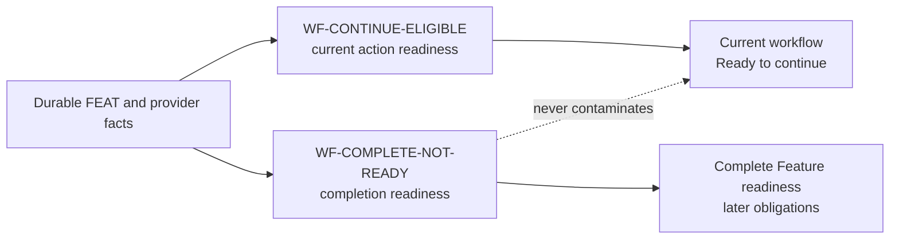

## Pre-dispatch routing guard

Every future worker-producing action reaches `RoutingPolicyService.resolve` before
an execution consumer may act. The guard resolves only a registered V1 action
against current catalog facts and the persisted Action → Action Type → Global
policy. A Web workflow first attempts the persisted policy without bootstrap
context. Only when that attempt returns `ROUTING_BOOTSTRAP_REQUIRED` may
`RoutingActionResolver.resolvePlan` supply the exact installation Pi Session
default selected in Pi settings. Startup binds that explicit provider/model to
exactly one active connection through code-owned endpoint identity and scans
that connection when the model is not yet cataloged. Mutable labels, workflow
model fields, environment model aliases, and static fallback models are not
bootstrap sources.

The policy resolver validates the supplied route against the registered action
and current catalog, then atomically creates the first Global revision. If that
mutation conflicts, it rereads the persisted winner exactly once and resolves
it only when its registry version matches; an absent, invalid, or mismatched
reread returns a sanitized rejection. It returns a typed primary plus
at-most-one recovery plan, or a sanitized rejection. It does not launch Pi,
inject a credential, write a receipt, or advance workflow state; those are
FEAT-062 execution concerns.

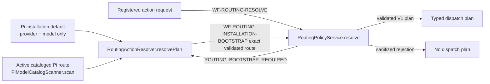

## Plan-bound isolated Pi execution

Every worker-producing application now passes the complete accepted
`HandoffPlanV1` to the runtime host. `HandoffPlanExecutor.executeAttempt`
revalidates that plan and its runtime context before any receipt, connection,
vault, filesystem, or process effect. A valid plan opens one normalized
invocation, binds the exact active connection and authentication version,
prepares a unique Pi configuration/session root, reads only the selected vault
secret when required, and marks the approved route as actual immediately before
one pinned process call. The executor never queries routing policy, reads a
model key, selects a default, or substitutes a route.

One-shot, detached, and dashboard task launches share this boundary. Detached
processes retain their isolated context until exit; every terminal outcome
settles normalized evidence and performs idempotent cleanup. Invalid plans and
contexts reject before side effects. A valid plan whose connection,
authentication, provider projection, secret, or context preparation is
unavailable records only a safe preparation failure and never spawns or claims
an actual route.

Every Pi launch pins `--thinking high`. Native HEPHA launches explicitly load
HEPHA's `model-request-guard`, even in no-tools/no-auto-extensions mode.
MCP compatibility actions omit this extension and delegate context to Pi, as
defined in the MCP execution boundary above. Immediately
before each provider request (including subsequent tool/session turns), the
guard checks the effective High level and the runtime model's context/output
limits. Unknown limits or unsupported reasoning reject instead of guessing.
Repeated user/tool text may use a lossless reference encoding; system messages,
tool arguments, signatures, source order and qualifications are not rewritten.
Unique context is never truncated or treated as successfully assessed.

The guard tokenizes the complete serialized provider payload with a local BPE
tokenizer. It keeps the optional `HEPHA_PI_MAX_ATTEMPT_INPUT_TOKENS` spending cap separate
from context capacity; there is no 64,000-token per-request ceiling. Capacity
reserves requested output (model maximum when unspecified) and 4,096 framing tokens,
then compares locally counted input tokens with remaining capacity. Readiness
explicitly binds its smaller task output allowance at this same provider boundary
only when supported. Codex subscription transport sends no output-limit field and
reserves the catalogue maximum consistently with planning, including fallbacks.
Catalogue discovery reads exact configured token capacities from the installed Pi
SDK without model-network access; the rounded CLI table is not a capacity source.
Provider identity is filtered before models enter the connection catalogue.
On native HEPHA routes, HEPHA's request guard still runs before every provider
call. MCP compatibility sessions use Pi's own compaction lifecycle exclusively. Readiness assessment has no five-minute absolute
deadline: a resettable 120-second observable-activity watchdog remains, alongside
token spending and checkpoint/assessment bounds. This is not a coverage waiver
or an automatic restart after a timeout. Manual-test authoring retains its existing deadline.
See [token accounting](token-accounting.md) for supported tokenizer mappings and
the distinction between local text counts and actual provider usage. These are
admission guards, not a whole-workflow spend guarantee or
a substitute for criterion-specific evidence aggregation. Diagnostics expose
counts only, never request content or credentials. Pi swallows ordinary hook
exceptions; policy refusal therefore exits the isolated child synchronously
with code 78 before provider dispatch. It is recorded as `safety_rejected` and
cannot consume a fallback/recovery route (`WF-MODEL-REQUEST-POLICY`).

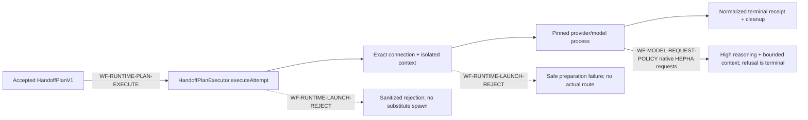

`RuntimeExecutionCoordinator.execute` now owns the only legal transition after
a failed primary attempt. It reads normalized durable work/checkpoint evidence,
not model output or phase labels. Work state `none` can consume the plan's
second route once as fallback; `checkpointed` requires a complete authorized
cursor and can consume it once as recovery; `started` without a checkpoint is
terminal. A failed second attempt, one-step/Global plan, malformed checkpoint,
or exhausted route sequence settles without policy re-resolution, recursive
routing, replay, or later workflow advance.

Direct-host execution is not a runtime chain transition. A user-invoked
portable skill stays in the active Pi, Codex, or Claude Code session and does
not query routing policy, compare routes, create a child worker, or write an
orchestrated receipt. Only a dashboard or explicit Hepha launcher enters the
orchestrated boundary.

At that boundary, the generic dashboard task and specialist applications admit
one explicit `agent_action`, validate registry membership and launch-node
equality, and reject unknown or conflicting values before route resolution,
state mutation, or process work. The accepted action resolves one immutable
plan; every plan-consuming public boundary must match its action ID, action
type, role ID, prompt version, minimum context-window requirement, and API,
reasoning, and tool capabilities to the same registry entry before task storage,
coordinator execution, or Pi provider/model injection. Review dispatch and
`RuntimeKnowledgeWorkerLifecycleApplication` reach the four exact nested
methods consumed in `index.ts`. Phase exit invokes Phase Lessons Capture, a run
that resolved at least one phase invokes Feature Lessons Writer, and successful
detached feature completion invokes the Post-Complete Curator. Each method
resolves its own exact action and persists a separate `nested` chain with a
primary first attempt, parent/root lineage, and sorted selected lesson IDs when
a real parent invocation exists in the current run. A fresh Continue run may
resume directly at Code Review or another specialist task before any model
invocation has run. In that topology, `WF-RUNTIME-RESUMED-SPECIALIST` executes
the independently planned specialist as one fully scoped root chain carrying
the current workflow, card, phase contract, phase, and task identity. It does
not fabricate a context-free parent receipt. Failed completion starts no
curator; curator input is project-only and forbids FEAT reopen or Second Brain
export. Persistence failure is terminal before classification and can never
authorize plan step 1.

```mermaid
flowchart LR
  PrimaryFail["Failed primary attempt"] --> WorkState["DurableWorkStatePort"]
  WorkState -->|"none / WF-RUNTIME-FALLBACK"| Fallback["One approved fallback attempt; lifecycle hooks rebound to fallback identity"]
  WorkState -->|"checkpointed / WF-RUNTIME-RECOVERY"| Recovery["One cursor-bound recovery attempt"]
  WorkState -.->|"started, malformed, or no step / WF-RUNTIME-TERMINAL"| Terminal["Terminal; no workflow advance"]
  Fallback -->|"success: primary failure retained + fallback completion / WF-RUNTIME-RECEIPT-SETTLE"| Receipt["Canonical normalized chain; invocation succeeds"]
  Recovery -->|"terminal / WF-RUNTIME-RECEIPT-SETTLE"| Receipt
  Direct["Direct-host skill"] -->|"WF-DIRECT-HOST-NO-LAUNCH"| Host["Current host session; no routing or receipt"]
  Host -->|"optional deterministic state sync / WF-DIRECT-HOST-EVIDENCE"| DirectEvidence["Route-incapable direct-host evidence"]
  DirectEvidence --> MixedProjection["Guarded mixed-mode FEAT Details projection"]
  Receipt --> MixedProjection
  Action["Explicit agent_action + matching launch node"] -->|"WF-RUNTIME-ACTION-ADMISSION"| Plan["Registered independently resolved plan"]
  Plan --> Child["Pinned root or nested chain"]
  Parent["Review or phase/feature knowledge lifecycle with current-run parent"] -->|"WF-RUNTIME-NESTED-DISPATCH"| Child
  Resume["Resumed specialist; no current-run parent"] -->|"WF-RUNTIME-RESUMED-SPECIALIST"| RootSpecialist["Fully scoped root specialist chain"]

  ReviewBasis["Existing immutable NEEDS_CHANGES report + manifest"] --> Fixer["Code-review fixer agent"]
  Fixer -->|"append/update one ## Fixer Response in the same report; preserve reviewer text and NEEDS_CHANGES"| UpdatedReport["Existing report with complete fixer proposals"]
  UpdatedReport -->|"one terminal worker output"| FixerOutput["Fixer Response + V1 successor JSON + gate handoff"]
  FixerOutput -->|"normal post-worker path"| GateParser["Strict Hepha Gate Evidence parser"]
  GateParser --> Gates["Quality Gate Evidence updated"]
  FixerOutput -->|"WF-REMEDIATION-SUCCESSOR-VALIDATE"| SuccessorParser["Parse exact remediation response and verification receipt"]
  SuccessorParser --> Binding["Check executor-owned IDs, scope, predecessor, and placeholders"]
  Binding --> ResponseIngress["Validate and persist canonical remediation response"]
  ResponseIngress -->|"invalid: return safe contract code/message"| SameFixer["Same fixer receives actionable repair brief"]
  SameFixer --> Fixer
  ResponseIngress -->|"persisted"| ReceiptIngress["Bind response hash/path, validate and persist receipt"]
  ReceiptIngress -->|"durable response + receipt / WF-FIXER-REREVIEW"| Reviewer["Independent code-review rerun"]
  Reviewer -->|"APPROVED"| ReviewApproved["New terminal APPROVED report"]
  Reviewer -->|"NEEDS_CHANGES"| NewFindings["New immutable NEEDS_CHANGES report + manifest"]
  NewFindings --> Fixer
  PhaseDoc["Phase document"] -.->|"recovery only"| DocumentHandoff["Durable gate handoff"]
  SessionJSON["Session JSON file"] -.->|"recovery fallback"| DocumentHandoff
  Complete["Successful detached feature completion"] -->|"post-complete curator"| Parent
```

A non-default Pi-session connection resolves its runtime provider from the
code-owned endpoint identity when that endpoint represents exactly one
provider (for example, `api.deepseek.com` → `deepseek`). For an endpoint that
represents multiple providers, Hepha first uses the explicit installation
default when it targets that connection. Otherwise it intersects the endpoint's
code-owned provider identities with the validated top-level provider identities
present in Pi's authentication store. Exactly one match is accepted; credential
values are neither projected nor retained. Zero or multiple matches fail closed.
`provider_unsupported` therefore means provider identity could not be safely
resolved before process spawn; it does not mean the model returned an API
error. Route-exhaustion presentation includes the failed route, durable cause,
fallback availability, and the Agent Routing recovery action instead of showing
only `RUNTIME_ROUTE_SEQUENCE_EXHAUSTED`.

On `WF-RUNTIME-FALLBACK`, the coordinator passes the same attempt lifecycle
hooks to the second executor call. The durable chain retains the primary
failure and route-change reason, while all mutation work-state/checkpoint
updates bind to the fallback attempt. A completed fallback settles the overall
invocation successfully and remains visibly distinct from the failed primary
attempt in runtime evidence.

`PiModelCatalogScanner.scan` accepts both the legacy JSON fixture contract and
Pi's supported `--list-models` table. Table rows are filtered by the
connection's code-owned provider endpoint before normalization, so scanning one
Pi Session connection cannot attach another provider's models to it. The
installation default is usable only after its exact connection/model identity
is present and available in the safe catalog. Failure to read settings, bind
one active connection, scan the route, or validate capabilities remains
`ROUTING_BOOTSTRAP_REQUIRED`/the resolver's exact sanitized rejection; it never
selects an arbitrary model.

## Level 1: complete feature lifecycle

The label in every high-level node names the application method responsible
for entering or leaving that workflow area.

```mermaid
flowchart LR
  Submitted["Submitted work item"]
  MarkerGate{"Unresolved validation markers?<br/>createValidationSummary"}
  Wait["Waiting for answers<br/>DeepDiveStartApplication.generateQuestions"]
  Clarified["Clarified document<br/>DeepDiveCompletionApplication.complete"]
  Designed["Design artifacts<br/>DesignFeatureExecutionApplication.execute"]
  RefineBlocked["Refinement needs decisions<br/>RefinementDeepDiveHandoffApplication.create"]
  Ready["Ready to develop<br/>RefineFeatureExecutionApplication.execute"]
  Running["Implementation running<br/>StartImplementationRunApplication.execute"]
  Phases["Generic phase loop<br/>AutonomousImplementationWorkflowApplication.execute"]
  Verify["Manual verification<br/>ManualTestVerificationApplication.recordResult"]
  Finalize["Completion finalizer<br/>CompleteFeatureExecutionApplication.execute"]
  Done["Completed feature"]
  Failed["Failed run; durable source state retained"]
  Cancelled["Cancelled<br/>FeatureWorkflowCancellationApplication.cancel"]

  Submitted --> MarkerGate
  MarkerGate -->|"WF-DEEP-DIVE-MARKER-GATE / WF-DD-START yes"| Wait
  MarkerGate -->|"no markers"| Clarified
  Wait -->|"WF-DD-WAIT"| Wait
  Wait -->|"WF-DD-ADAPTIVE-FOLLOW-UP"| Wait
  Wait -->|"WF-DD-COMPLETE"| Clarified
  Wait -.->|"WF-DD-FAIL"| Failed
  Clarified -->|"WF-DESIGN-EXECUTE when required"| Designed
  Clarified -->|"WF-PREPARATION-CONTROLS authorized actions"| PreparationControls["Design or Refine controls"]
  Clarified -->|"WF-DD-VOLUNTARY-FOCUS human exploration"| Wait
  Clarified -.->|"WF-DESIGN-FAIL"| Failed
  Clarified -->|"WF-REFINE-EXECUTE"| Ready
  Designed -->|"WF-REFINE-EXECUTE"| Ready
  Clarified -->|"WF-REFINE-DEEP-DIVE"| RefineBlocked
  Designed -->|"WF-REFINE-DEEP-DIVE"| RefineBlocked
  RefineBlocked -->|"open existing question round"| Wait
  Ready -.->|"WF-REFINE-RECOVER"| Ready
  Ready -.->|"WF-REFINE-FAIL"| Failed
  Ready -->|"WF-START-PREPARE"| Running
  Running -->|"WF-IMPLEMENT-QUEUE"| Phases
  Phases -->|"WF-QUEUE-COMPLETE"| Verify
  Verify -->|"WF-MANUAL-FAIL"| Phases
  Verify -->|"WF-MANUAL-PASS"| Finalize
  Finalize -->|"WF-COMPLETE-START"| Finalize
  Finalize -->|"WF-COMPLETE-DONE"| Done
  Finalize -.->|"WF-COMPLETE-FAIL"| Failed
  Running -.->|"WF-CANCEL"| Cancelled
  Phases -.->|"WF-CANCEL"| Cancelled
```

The design path is conditional. A feature can move directly from clarified to
refinement when UI artifacts are not required. Deep-dive waiting is a durable
human gate, not a failed workflow. Question discovery has no default absolute
wall-clock maximum: observable Pi/tool progress resets its inactivity circuit.
A timeout, malformed response, or empty question manifest follows `WF-DD-FAIL`
and remains visibly retryable; Hepha never substitutes generic `Accept current`
questions for failed model analysis. The adaptive route requires exactly one
opening question; compatibility manifests are normalized without a hidden count
ceiling. The generation overlay shows elapsed background work
instead of presenting productive research as a frozen spinner.
`WF-DD-ADAPTIVE-FOLLOW-UP` evaluates every saved answer without repository
tools, inserts one immediate dependent question after its parent when needed,
and runs a closure audit on the final pending answer. A static initial manifest
therefore does not claim authority over answer-dependent decisions. Refinement may
enter `WF-REFINE-DEEP-DIVE`
as many times as new user-owned decisions are discovered; there is no fixed
round limit. The detailed protocol and acceptance criteria are defined in
[`refinement-deep-dive-loop.md`](refinement-deep-dive-loop.md).

`WF-PREPARATION-CONTROLS` renders normal preparation controls directly from
backend availability flags. Submitted readiness may have no recovery reasons;
that must not hide an authorized Design action. Design appears once, Refine
remains disabled until authorized, and no-UI features do not show an unnecessary
Design button. Playwright journeys exercise the dashboard and typed API request
with synthetic server responses, including empty recovery diagnostics.

`WF-DD-VOLUNTARY-FOCUS` allows a human to revisit any non-terminal FEAT without
manufacturing validation markers. The dashboard offers an optional, bounded
focus field and resumes existing interviews. Focus is stored separately from
the source snapshot and supplied to opening and follow-up questions; only
answered decisions may change requirements. New focus cannot silently replace
an open interview. Another active workflow prevents Deep-Dive admission;
terminal items remain read-only. Voluntary completion does not implicitly
resume an unrelated implementation workflow.

UI classification attempts are keyed by project, feature, and specification
revision. Unknown or malformed decisions do not authorize refinement. Native
and compatibility refinement share the same UI-design prerequisite: explicit
no-UI classification, or requires-UI classification with design artifacts.
Deep-Dive remains an optional way to clarify the decision, not a substitute for
Design Feature. This gate currently checks the existing design artifact set;
it does not introduce a new design-content or freshness validator.

`WF-DEEP-DIVE-MARKER-GATE` makes required Deep-Dive readiness marker-only. An unresolved `[NEEDS VALIDATION]` or
`[NEEDS_VALIDATION]` marker in the authoritative work-item description requires
clarification; absence of those markers permits the next preparation action.
File changes, phase-link updates, missing Deep-Dive history, and preparation
source hashes are not workflow gates. Design documents remain available as
question context, while their hashes and historical Deep-Dive receipts remain
audit evidence only.

`WF-REFINE-EXECUTE` authorizes Ready only after the promotion validator accepts
the current `hepha-phase-execution/v3` contract and every phase's declared Git
checkpoint. The general phase-contract reader still accepts V1/V2 for existing
Ready or In Progress features; that compatibility path cannot promote newly
authored refinement output. `RefineFeatureExecutionApplication.execute` owns
this decision, and `validateRefinePromotionArtifacts` enforces it.

Refinement liveness is progress-based rather than an estimated completion
duration. The repository default has no wall-clock maximum. A configurable
stall timer resets on trusted Pi/process activity, while an optional operator
maximum remains an explicit safety policy. `RefinementArtifactProgressReporter`
projects authorized core files and the ordered documents declared by
`PhaseExecutionContract.json`; it never derives behavior from phase titles,
suffixes, or a fixed count. Each persisted milestone updates the current
workflow step and survives dashboard refresh.

The first write/edit event moves runtime work state away from `none`; the first
successful write records an artifact checkpoint. A stalled or maximum-runtime
attempt that mutated files therefore cannot consume a fallback as if no work
occurred. `RefineFeatureExecutionApplication` preserves the primary cause,
rescans durable artifacts, and records the last completed and next required
artifact. A later retry starts a new auditable run and follows the skill's
partial-artifact repair contract. Complete valid Ready output still uses the
existing `WF-REFINE-RECOVER` promotion route when transport fails or the worker
returns an invalid Result V1 envelope. That recovery remains fail closed on
artifact validation, architecture-debt readiness, source confirmation, and the
transition receipt. The architecture-debt adapter sorts independent path,
symbol, and rule-tag query facts before its strict store boundary; a valid
touch plan is ordered by relative path and must not become `store_unavailable`
merely because its extracted symbol names have a different lexical order.
Result V1 `COMPLETED.files` remain feature-folder-relative and may not include
project, MemoryBank, lifecycle, or FEAT-folder prefixes.

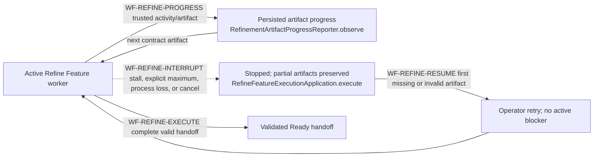

The complete decision and configuration contract is documented in
[Refine Feature Progress, Stall Detection, And Durable Resume](refine-feature-progress-timeout-and-resume.md).

## Level 2: start, continue, queue, and terminal routing

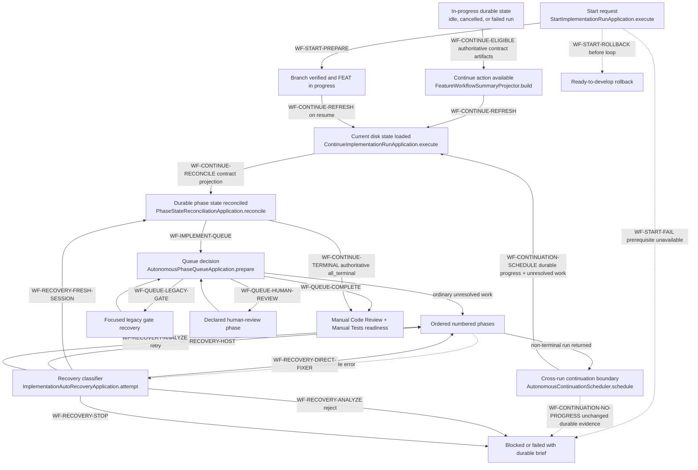

`StartImplementationRunApplication` owns only start-specific preparation and
rollback. `ContinueImplementationRunApplication` owns refresh, reconciliation,
terminal recording, and the outer failure boundary. Both delegate phase
selection and execution to the same generic implementation application.
`AutonomousContinuationScheduler` owns the separately registered cross-run
boundary. It is not a background implementation loop: it may create one fresh
Continue run only after the preceding run changed durable FEAT evidence and
unresolved phase work remains.

`WF-CONTINUE-ELIGIBLE` is evaluated from durable execution state. For a feature
with `PhaseExecutionContract.json`, the `Contract ID | Document | Role | Status`
inventory is authoritative. Validators select that table by its header schema;
they must not use an unrelated earlier Markdown table merely because it appears
first. A failed, blocked, cancelled, or idle run therefore remains manually
continuable when the declared execution contract, FeatureTasks inventory,
declared phase documents, and ordered task ledgers are valid and unresolved
work remains.

Refinement-time satellites are not continuation authority. A missing or
malformed planning-analysis report, architecture-debt touch plan, design
artifact, or other preparation diagnostic remains visible, but it cannot hide
`Continue Implementing` after implementation has started. Source-hash changes
never open a continuation Deep-Dive recovery; unresolved validation markers are
rejected before this boundary. A missing or malformed execution contract, missing
declared phase document, invalid task ledger, active workflow, terminal FEAT,
or no unresolved work still blocks the action with its exact diagnostic.

`WF-CONTINUE-RECONCILE` uses the same schema-selected Phase Inventory for every
read and write. Current inventories resolve `Contract ID -> Document ->
phase-<number> -> Status`; historical inventories without a contract resolve
`Phase -> Status`. The document suffix, contract ID, role, phase count, task
topology, and FEAT identity remain arbitrary. Reconciliation, phase scanning,
phase entry, phase completion, and recovery snapshots share this projection;
none may privately parse a different FeatureTasks status format.

**Terminal happy-path invariant:** `PhaseStateReconciliationApplication` is the
authority that proves task exhaustion, required phase-gate settlement, and
phase completion. When it returns `all_terminal`, Continue Implementation must
cross `WF-CONTINUE-TERMINAL` immediately. It must not dispatch a worker, enter
the queue again, or ask the continuation scheduler whether a secondary scanner
still reports work. The completed implementation run then asks the user for
Manual Code Review and Manual Tests before Complete Feature. Advisory coverage
remains visible telemetry but cannot veto this transition.

A non-terminal run reaches the scheduler only after its worker/reconciliation
boundary returns. `WF-CONTINUATION-SCHEDULE` requires both unresolved phase work
and a changed durable FEAT fingerprint. If unresolved work remains but the
before-and-after fingerprints are identical,
`WF-CONTINUATION-NO-PROGRESS` records the current run as blocked and does not
create a successor. The complete decision table, sequence, diagnostics, and
failure analysis are documented in
[Terminal And Cross-Run Continuation Circuit](autonomous-continuation-terminal-and-no-progress-circuit.md).

Implementation-worker liveness is based on observable progress, not estimated
completion duration. `WF-IMPLEMENTATION-PROGRESS` resets one stall circuit on
current-worker stdout or stderr, including Pi and tool events. The repository
default has no wall-clock maximum, so a productive multi-hour worker remains
alive. `WF-IMPLEMENTATION-STALL` stops a live process only after no observable
output changes for the configured stall interval. Process liveness by itself
does not reset the circuit. `WF-IMPLEMENTATION-MAXIMUM` remains available only
when an operator explicitly configures an absolute safety cap; it is separate
from inactivity detection and continuing output does not bypass it.

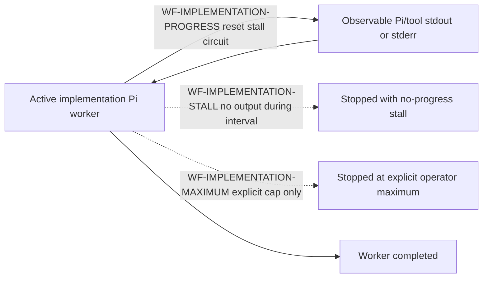

## Level 3: generic phase executor and all ordinary detours

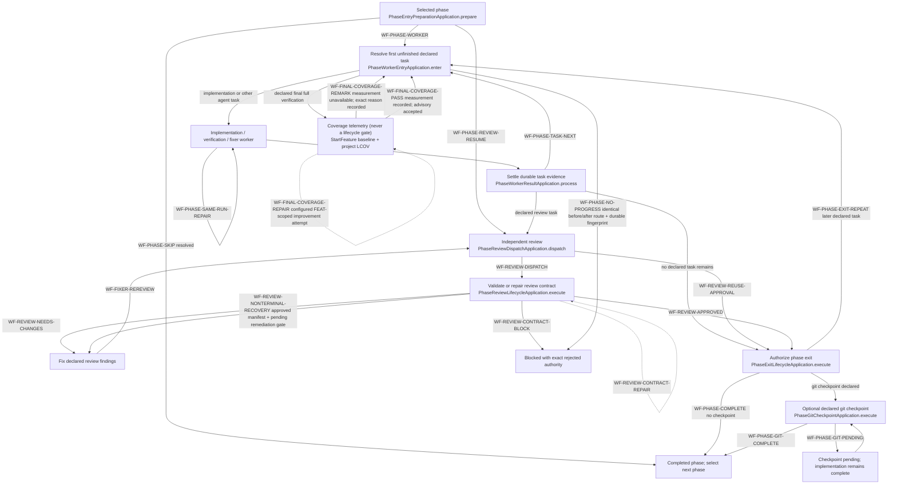

A Git checkpoint publishes to a valid branch-configured remote. Without one, it prefers a remote named `fork` before `origin`, so an upstream `origin` is never assumed writable; a sole remote remains valid, while any other multiple-remote topology is rejected as ambiguous. The same selected remote is used for push and remote-HEAD verification. When a prior attempt already recorded immutable checkpoint commits, retry verifies those commits remain reachable from the current feature branches and pushes them without staging the worktrees; unrelated later-phase or user changes remain unstaged and cannot manufacture a user-decision pause.

**Derived phase state (autonomous):** For autonomous workflows, phase lifecycle
state is derived from observable facts via `derivePhaseState(facts)` in
`phase-lifecycle-policy.ts`. The `**Status:**` field in the phase document is
display-only and must not drive lifecycle transitions. The facts are:

```
PhaseFacts {
  allTasksCompleted: boolean    // all task checkboxes checked
  needCodeReview: boolean        // phase contract declares code review
  codeReviewExists: boolean      // a code review artifact exists
  codeReviewState: APPROVED | NEEDS_CHANGES | BLOCKED | N/A
  isAutonomous: boolean          // workflow is self-driving
}
```

| Tasks | Need review? | Exists? | State | Autonomous | Derived |
|---|---|---|---|---|---|
| YES | NO | — | N/A | — | **COMPLETED** |
| YES | YES | NO | N/A | — | **AWAITING_REVIEW** |
| YES | YES | YES | APPROVED | YES | **COMPLETED** |
| YES | YES | YES | APPROVED | NO | **AWAITING_USER_ACCEPTANCE** |
| YES | YES | YES | NEEDS_CHANGES | — | **AWAITING_FIXES** |
| YES | YES | YES | BLOCKED | — | **BLOCKED** |
| YES | YES | YES | N/A | — | **AWAITING_REVIEW_RERUN** |

No impossible state is representable. A phase with all tasks done, an approved
review, and an autonomous workflow is always COMPLETED regardless of what the
`**Status:**` field says. The derived state is the single authority for
`areAllImplementationPhasesResolved` and the autonomous continuation scheduler.

**Declared-task exit invariant:** settling the final contract task may reconcile
the phase document display field, but that projection never authorizes the
coordinator to skip `PhaseExitLifecycleApplication`. The phase must still cross
`Exit`, then either `WF-PHASE-COMPLETE` or its declared git-checkpoint edge.
For V2/V3, `PhaseExecutionContract.json` is the canonical machine sequence and
`## Phase Task Ledger` is its required exact durable projection: one checkbox
per declared task, in the same order, with matching contract ID and executor.
Parity is validated at refinement promotion and every Start/Continue admission.
A missing, extra, reordered, uncontracted, or executor-mismatched ledger item
returns `CONTRACT_TASK_LEDGER_MISMATCH` before dispatch; no worker, gate,
checkpoint, or next-phase transition may run. Checkpoint sign-offs, acceptance
lists, manual-review lists, and other Markdown checkboxes cannot create a task.
Documents without an explicit contract retain the legacy explicit-ledger and
whole-document checklist compatibility fallback.

**Manual-test deferral invariant:** Refine Feature classifies qualification work
as `AUTOMATABLE` or `MANUAL_TEST_REQUIRED` without executing product tooling.
Manual-only work is never authored as a blocking executable gate; it is
represented by a SKIPPED task using the canonical reason and a validated
`ManualTestObligations.json` entry. Every obligation task ID must resolve to
exactly one durable ledger item in its declared phase before Ready promotion or
Start. V3 uses execution-contract identity. Legacy DevCycle output must project
the same stable ID through a `[contract:<taskId>]` checkbox marker; a numbered
heading or status prose is not task identity. Start preserves that stable
obligation ID while recording the separate derived SQLite ledger-task ID. If
implementation discovers the boundary later, the worker returns
`HEPHA_MANUAL_TEST_DEFERRAL_V1` rather than editing machine state. HEPHA
validates immutable fields, records SKIPPED in SQLite, checks the task in the
durable ledger, and writes the obligation projection. The Manual TestPack reads
that projection and renders the complete preconditions, steps, expected result,
and evidence requirements. Pending or failed manual qualification blocks
release readiness, not implementation completion. A real configured command
that executed red cannot be converted into a deferral. Pre-V3 documents use the
bounded legacy recovery adapter; V3 documents must use the SQLite settlement
path.

**Manual-test delivery invariant:** every acceptance criterion is classified as
`Manual`, `Automated`, `Deferred`, or `Uncovered` before delivery rendering.
Only an explicit `ManualTestObligations.json` or validated `ManualTestCases.json` procedure that names a concrete
application or interface, exact preconditions and setup data, executable user
actions, and observable results can become a manual case. Generic instructions
such as “navigate to the feature area” or “perform the expected workflow” fail
validation. Internal models, dependencies, catalogue contents, schemas,
digests, immutable structures, startup validation, and unit/source properties
use automated evidence instead of synthesized human steps. A backend-only
feature with no valid manual case produces an informational artifact and
`Manual Tests: Not Applicable`; it is never `Manual Test Pack Ready`.
Readiness requires at least one valid executable manual case and no uncovered
acceptance criteria or invalid cases. Partial coverage is not readiness. Automated evidence
records `executed-passed`, `executed-failed`, `zero-tests-discovered`, or
`not-executed`; an exit-zero command whose output reports no matching tests is
zero selection, not passing coverage.

### Manual pack recovery (`WF-MANUAL-PACK-REGENERATE`)

Regeneration is available for current as well as stale/incomplete packs. An
explicit replacement names the observed current pack; stale replacement requests
fail without superseding it. Every user-facing generation or regeneration
assesses criterion coverage and drafts missing human-executable scenarios,
including requests with omitted, empty or whitespace-only guidance. Artifact-only
internal calls may reuse unchanged inputs, but the HTTP application always
requests assessment. It cannot silently fall back to formatting when the model
is unavailable.

Coverage assessment invokes the configured refinement route as a tool-free
structured-output drafting call, not a refinement workflow. It receives bounded
feature-local Markdown, existing cases and criterion coverage. Large source sets
use explicitly labelled excerpts prioritising acceptance/scenario sections and
human guidance; a full-source fingerprint still detects edits to omitted text.
Missing prerequisites remain unresolved rather than inferred. Optional guidance
adds emphasis; it neither enables assessment nor limits it to the named topics. The model may
propose additional executable cases and report missing information; it cannot
write files, run tests, alter gates, waive criteria or grant acceptance. Case
schema, unique IDs, exact source references, unchanged sources and current-pack
identity are checked before proposals enter `ManualTestCases.json`. Existing
mandatory procedures are preserved. Guidance and proposal history remain local.

Generation, stored readiness and result recording share the executable case
contract. Recording uses manifest IDs, not a numeric-only Markdown naming rule.
Unknown IDs, incomplete/legacy artifacts and stale-source requests fail closed.
The dashboard shows cases, unresolved coverage, authoring progress and errors.

The replacement archives the previous version, invalidates its pack review and
clears only the manual-test acceptance timestamp. Old results remain evidence
for the old pack; user code-review acceptance is unchanged. Review and actual
human execution of the new applicable pack remain necessary before acceptance.

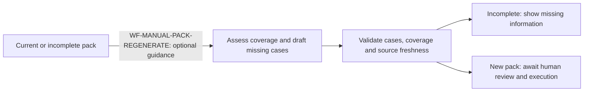

**No-progress invariant:** every same-phase repeat must either mutate durable
FEAT/task/review/checkpoint evidence or choose a different route. The
coordinator fingerprints the complete FEAT evidence folder after a repeat
request. If one recovery cycle returns to the same route and decision with the
same fingerprint, evidence—not an arbitrary attempt count—proves no progress
and enters `WF-PHASE-NO-PROGRESS`. The workflow becomes `blocked` and publishes
the phase, route, fingerprint, last decision, and recovery guidance. The user
may then repair and choose Continue Implementation, or Cancel. Completed tasks
remain checked. Production edits alone do not prove workflow progress because
source changes without task, review, or gate settlement are not durable
transition evidence.

That phase-local circuit is deliberately separate from
`WF-CONTINUATION-NO-PROGRESS`. The phase circuit detects repeated routes inside
one executor run; the continuation circuit detects a no-op run before another
workflow ID can be created. Neither circuit is part of the terminal happy path:
an authoritative `all_terminal` result exits directly to Manual Code Review and
Manual Tests.

**Runtime phase identity invariant:** contract phase indices are zero-based
non-negative integers. Phase `0` is an ordinary valid runtime context and must
reach `WF-PHASE-WORKER`; strict plan-bound validation may reject negative,
fractional, unpaired contract/phase, or malformed identities, but it must not
apply a positive-only identifier rule to the first declared phase. A context
rejection occurs before Pi launch and must be reported as a host runtime defect,
not as an implementation decision or production-code failure.

**Coverage invariant:** the `Coverage` node is telemetry, not a lifecycle gate.
An unavailable command, timeout, baseline, LCOV report, or instrumentation
record follows `WF-FINAL-COVERAGE-REMARK` and rejoins ordinary task selection;
it cannot fail or block the phase or FEAT. Only a successfully measured
below-reference result may take the bounded `WF-FINAL-COVERAGE-REPAIR` loop.
Independent build, lint/typecheck, and test checks remain lifecycle gates.

For V2/V3, the execution contract is the sequence authority and the verified
ledger is its durable checkbox-state projection. Code review, verification,
checkpoint, documentation, and git work are ordinary declared tasks when they
appear in that contract. Their names are not special routing keys. When no
declared task remains, the phase-exit guard decides whether the phase can
complete. Legacy phase documents without an execution contract retain their
existing Markdown sequence compatibility path.

An approved review therefore does not always mean “complete the phase.” Only
an `APPROVED` manifest whose exact-scope authoritative gate is terminal
`APPROVED / approved_terminal_review` means “complete that declared review task
and select the next declared task.” An `APPROVED` manifest with
`PENDING / terminal_remediation_required` keeps the same review task
unresolved and takes `WF-REVIEW-NONTERMINAL-RECOVERY`; phase exit is not
attempted. Likewise, a remediation response without its bound verification
receipt returns to the fixer on the same task, while a durable response plus
receipt hands control to the independent reviewer. If the terminally approved
review task is last, phase exit follows. If a final checkpoint follows, that
checkpoint runs first. A phase with one documentation task and no review or
checkpoint completes after that task and its applicable exit guards.

When refinement declares a `final_checkpoint`, its last ordered task is a full
verification task that also requests `test-coverage`. The project-owned final
verification profile supplies one or more final-checkpoint-only coverage
commands and LCOV report contracts. `DeclaredVerificationTaskApplication`
selects those checks only for the semantic `final_checkpoint` role;
`evaluateChangedLineCoverage` compares instrumented executable lines changed since the
durable StartFeature commit, including committed, staged, unstaged, and new
untracked production files that exist before the phase git checkpoint, and separately calculates overall instrumented
project coverage. FEAT changed-line coverage is the actionable scope; overall
coverage is context only and never expands the current FEAT into legacy repair.
The receipt classifies successfully measured coverage below 80% as needs improvement, 80% through 94.99% as
OK, 95% through 99.99% as excellent, and 100% as perfect. These percentages are
advisory and never fail or block a phase or FEAT. Coverage is not a gate action:
its percentage and its availability cannot deny lifecycle progression.
Below-reference FEAT coverage may enter
the project-configured improvement loop, but that worker may edit only code and
tests changed by the FEAT. Exhausting the configured attempts, finding no safe
valuable improvement, or losing the optional improvement worker records the
reminder and completes the verification task. A coverage command failure,
timeout, missing baseline, missing LCOV report, or missing instrumentation
records an exact `coverage-unavailable` code-quality remark and completes the
verification task without launching a repair worker. These measurement errors
never reinterpret independent build, lint/typecheck, or test failures, which
retain their normal repair/rerun circuit. RefineFeature creates or updates the
project-owned coverage profile when the existing test configuration makes the
LCOV command, report path, source selectors, improvement-attempt policy, and multi-stack ownership
deterministic. Numeric measurement is optional. A project without configured numeric coverage
continues with logical acceptance assessment and configured verification; missing
instrumentation does not trigger Deep-Dive. RefineFeature never guesses or installs
coverage tooling. Existing explicitly configured telemetry remains advisory. A workflow with no declared
final checkpoint does not receive an invented checkpoint, coverage task, or
profile mutation.

## Level 4: cancellation, recovery, and completion detours

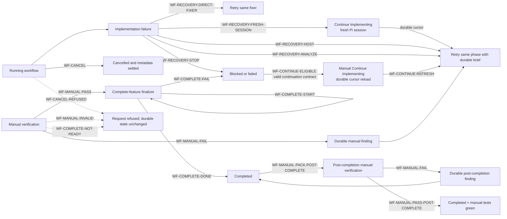

Cancellation is valid only for a cancellable active run. It requests process
cancellation, settles non-terminal phase metadata, records the workflow as
cancelled, and closes an open deep-dive session when applicable. Recovery does
not authorize arbitrary workflow-state edits by an agent; machine-owned state
is guarded and the retry re-enters the same generic executor.

A provider may complete and archive a FEAT before Hepha's local manual
verification is recorded. `04_COMPLETED` is not a read-only filesystem state.
`WF-MANUAL-PACK-POST-COMPLETE` therefore permits a resolved completed FEAT to
generate its SQLite-authoritative verification pack and derived Markdown/PDF
artifacts in the completed folder. A failed result records a durable finding
without reopening or moving the FEAT. `WF-MANUAL-PASS-POST-COMPLETE` records the
green manual-test timestamp without invoking Complete Feature a second time.
The same actions remain available to native and compatibility-provider runs;
recipe source is not part of this decision. Pack source discovery accepts
ordered, unordered, and checkbox entries under supported acceptance headings.
If no source can be discovered or rendering fails, the action returns a safe
HTTP error and the dialog retains that exact failure; an absent pack cannot
project Markdown/PDF links.

A terminal automatic-recovery decision ends only the current run. It does not
make the implementation terminal. When the continuation contract is valid,
unresolved work remains, and no run is active, `WF-CONTINUE-ELIGIBLE` must
project a manual `Continue Implementing` action. The Web client renders that
backend decision without adding a second readiness policy. Preparation-only
diagnostics may be shown beside the button; they cannot suppress it.

A provider prompt refusal is an operational session failure, not evidence that
the phase or active task failed. `WF-RECOVERY-FRESH-SESSION` changes the retry
command to `continue-implementing`, reloads the current feature and its durable
task cursor, and launches one new worker identity/session for the same first
unfinished task. Completed tasks, review findings, and gate evidence are not
replayed or discarded. The rejected session transcript is not reused. A second
provider refusal on that fresh attempt exhausts the bound and enters
`WF-RECOVERY-STOP`; Hepha never loops or rewrites the prompt to evade provider
policy.

## Responsibility index

| Workflow area | Production owner | One reason the method exists |
| --- | --- | --- |
| Route resolution | `RoutingPolicyService.resolve` | Resolve a registered action to a deterministic typed non-executing plan or rejection before dispatch. |
| Deep-dive start | `DeepDiveStartApplication.start` | Create the durable clarification session and run identity. |
| Deep-dive question handoff | `DeepDiveStartApplication.generateQuestions` | Persist generated questions or a precise failed session. |
| Deep-dive completion | `DeepDiveCompletionApplication.complete` | Enforce the answer gate and update the source document. |
| Design | `DesignFeatureExecutionApplication.execute` | Produce UI artifacts for a readiness-approved design run. |
| Refinement | `RefineFeatureExecutionApplication.execute` | Generate and validate the full planning contract, including executable project coverage capability when a final checkpoint is declared. |
| Coverage measurement | `evaluateChangedLineCoverage` | Measure FEAT-owned changed lines and overall project context without turning an advisory percentage into a lifecycle failure. |
| Coverage receipt projection | `readLatestTestCoverageSummary` | Recover the latest durable coverage measurements for the FEAT details page. |
| Pi installation default | `readPiInstallationDefault` | Read only Pi's explicit provider/model default and bind it to one active code-owned provider endpoint without labels or fallback inference. |
| Pi authenticated provider identities | `readPiAuthenticatedProviderIds` | Read only validated top-level provider IDs from Pi authentication state; never return or project credential values. |
| Pi catalog table parsing | `PiModelCatalogScanner.scan` | Convert bounded supported Pi model-list output into connection-filtered safe normalization input. |
| Web routing bootstrap | `RoutingActionResolver.resolvePlan` | Retry an unset policy exactly once with the validated installation route; never replace invalid or unavailable persisted policy. |
| Refinement result parsing | `parseRefineFeatureWorkerResult` | Distinguish a complete artifact claim from a user-decision handoff before promotion. |
| Refinement Deep-Dive handoff | `RefinementDeepDiveHandoffApplication.create` | Persist unresolved refinement questions in the existing interactive Deep-Dive contract. |
| Start implementation | `StartImplementationRunApplication.execute` | Establish branch/lifecycle prerequisites and enter the shared loop. |
| Continue implementation | `ContinueImplementationRunApplication.execute` | Rebuild runtime intent from durable state and enter the shared loop. |
| Manual continuation eligibility | `FeatureWorkflowSummaryProjector.build` | Keep stopped in-progress work resumable from execution authority without letting refinement-only satellites hide recovery. |
| Phase queue | `AutonomousPhaseQueueApplication.prepare` | Choose one generic queue route from contract and durable evidence. |
| Phase worker entry | `PhaseWorkerEntryApplication.enter` | Select exactly the next declared task or durable review route. |
| Same-run repair | `PhaseSameRunRepairApplication.prepare` | Keep a recoverable failure on the same active task. |
| Phase no-progress circuit | `PhaseNoProgressCircuit.observe` | Pause an identical before/after host transition when no durable FEAT/task/review/checkpoint evidence changes, preserving completed work and waiting for an explicit user decision. |
| Final test coverage | `DeclaredVerificationTaskApplication.execute` | Record FEAT and project coverage as non-gating telemetry; optionally run bounded FEAT-scoped improvement only after a successful below-reference measurement, and convert measurement failures into visible remarks that cannot fail the phase or FEAT. |
| Review dispatch | `PhaseReviewDispatchApplication.dispatch` | Reuse valid approval or launch exactly one independent review. |
| Review lifecycle | `PhaseReviewLifecycleApplication.execute` | Validate/repair reviewer output before publishing authority. |
| Nonterminal review recovery | `PhaseReviewPublicationApplication.publish` | Keep an approved-but-nonterminal remediation lifecycle on the same declared review task instead of attempting phase exit. |
| Fixer handback | `PhasePostWorkerReviewApplication.prepare` | Validate fixer evidence and require reviewer adjudication. |
| Phase exit | `PhaseExitLifecycleApplication.execute` | Authorize completion only after declared work and gates resolve. |
| Git checkpoint | `PhaseGitCheckpointApplication.execute` | Run an optional declared checkpoint without falsifying phase work. |
| Auto recovery | `ImplementationAutoRecoveryApplication.attempt` | Classify one bounded retry route or refuse unsafe continuation. |
| Cancellation | `FeatureWorkflowCancellationApplication.cancel` | Stop attached work and make durable state restart-safe. |
| Manual-test task deferral | `PhaseWorkerTaskSettlementApplication.settle` | Validate a worker deferral, persist SKIPPED task authority, and create mandatory Manual TestPack input without falsely completing the task. |
| Legacy manual-test recovery | `recoverLegacyManualTestTask` | Recover a pre-V3 blocked/manual task as SKIPPED with exact reason and obligation while rejecting V3 direct mutation. |
| Manual verification | `ManualTestVerificationApplication.recordResult` | Persist the human gate and trigger finding or completion routing. |
| Complete feature | `CompleteFeatureExecutionApplication.execute` | Perform final documentation/state/folder finalization. |

Methods not listed here may prepare data, persist evidence, render prompts, or
adapt infrastructure, but they must not create a new workflow transition. A
new transition-owning method requires a registry entry and diagram edge.

## Pin-pointing an incident

Use this sequence when a transition is wrong or absent:

1. Record the visible source state, expected destination, run ID, phase/task
   cursor, and durable evidence that should have triggered the edge.
2. Find the matching `WF-*` edge in the diagrams. If no edge matches, the
   behavior is either missing from the model or is not an authorized workflow
   transition.
3. Open that ID in `workflow-transition-registry.json`. The `ownerPath` and
   `ownerSymbol` identify the exact production decision boundary.
4. Inspect the run/phase receipt, task ledger, review artifact, and failure
   brief consumed by that owner. Logs explain execution; they do not override
   durable authority.
5. Reproduce the decision in the listed unit test, then reproduce the complete
   route in the listed Gherkin integration scenario.
6. Before changing code, add a workflow-change justification record as defined
   in [Workflow Change Justification](workflow-change-justification.md).

This makes “the orchestrator chose the wrong next step” a bounded diagnostic:
transition ID → owner method → input evidence → unit decision → Gherkin route.

## What this map deliberately does not encode

- FEAT IDs, phase numbers, task names, or phase filenames;
- UI labels as transition authority;
- prose parsing, formatting quirks, or report filenames as routing decisions;
- optional governance projections as hidden phase gates;
- infrastructure helpers that do not choose the next workflow state.

Those details may appear in evidence, but they cannot create a generic route.

Phase TwinTests and EPIC E2E obligations are complementary. EPIC slices define the
complete frontend-to-backend workflow; refinement assigns E2E test updates to
relevant phases (including UI-only changes) and full-suite execution to an explicit
phase/checkpoint. A green phase TwinTest never waives the assigned EPIC E2E gate.

The shared `acceptance-responsibility/v1` policy is injected into native EPIC
submission/refinement, FEAT extraction, Deep-Dive document/acceptance planning and
phase/task verification. Native EPIC and FEAT renderers persist its ownership table.
MCP planning/delivery recipes receive the same policy at the JSON-RPC boundary,
including submit-epic and create-epic-features. The policy preserves distinct EPIC,
FEAT, Phase and Task acceptance and many-to-many coverage; it creates no automatic
one-to-one browser obligations. See `acceptance-responsibility-policy.md`.

Every acceptance boundary applies the same meaningful-coverage assessment as bug
repair: sufficient evidence for the agreed scope, important behavior actually
asserted, and concrete remaining gaps. Inspect assertions and tested boundaries;
record criterion-level evidence or missing behavior/importance/owner. Numeric
coverage is diagnostic and never replaces behavioral acceptance evidence.

### Structured compatibility phase gates (WJ-2026-114)

The same reducer evaluates independent needCodeReview/needTestCoverage flags for
every phase, plus all configured required commands. Workers receive the exact
JSON schema. Missing/failed evidence returns to a scoped repair worker, which
first inspects existing executions. The outer workflow rescans its result and
continues once gates pass. Three returns with the same semantic evidence trigger
reassessment and then escalation; report prose and audit timestamps do not reset
progress. Unauthorized phase advancement is rejected. Justified applicability
revisions are checked against the original declaration throughout repair.

WJ-2026-115: a disabled acceptance-coverage flag with an active criterion
assessment enters the same generic repair transition. Absence of numeric
measurement does not enable/disable that gate. The producer schema and MCP
recipes distinguish these concepts explicitly; no phase-specific route is added.

### Declaration-based gate admission audit

WF-MCP-PHASE-QUALITY-ADMISSION reconciles absent declarations before acceptance;
changed-file inventory cannot invent applicability or certify execution. Canonical
coverage accepts passing supporting health checks alongside a behavioral test.
Required failures still return to same-phase repair. All producers use declared
flags/commands rather than project names, phase positions or content categories.
See phase-completion-policy.md for evidence reuse and legacy reconciliation.

### Tokenizer capability and model API aliases

WF-MODEL-REQUEST-POLICY starts with tokenizer capability resolution on the pinned
provider/model before the generic Pi worker is spawned. Readiness and the worker
request guard share that resolver. Asset-backed tokenizers prepare the correct
immutable, checksum-verified revision before request token counting. Unsupported
identities or invalid assets cannot proceed to provider/tool execution. Model API
aliases are verified provider contracts, never project or feature gate exceptions.

### Bound static command capture (WJ-2026-122)

The shared receipt importer accepts an unchanged literal AND-list with terminal audit-log capture for static, preparation and discovery checks. This preserves command selection and exit status; the log does not claim to include earlier commands’ stdout. A failed command remains failed, altered control flow remains invalid, and native stdout test evidence still requires whole-list capture. This rule is independent of runner, project and phase identity.

### Recovery control placement (WJ-2026-123)

Each phase owns its repair controls and artifact diagnostics. Readiness displays a phase-gap summary without duplicating phase action buttons. Artifact ownership is resolved by matching the validator’s affected document to a uniquely declared phase document, never by parsing a phase number from message text. Feature-level or unknown ownership stays at feature level. Manual-verification messages appear beside the manual controls. The presentation change neither clears blockers nor changes admission or repair authority.

### Phase applicability and optional health repair (WJ-2026-124)

`WF-PHASE-HEALTH-WARNINGS` uses the independent coverage and code-review flags,
never a project, phase identity, title or source-file heuristic. Legacy phase
scanning reads the JSON in `Phase Gate Declarations` and its scope justification.
Existing canonical gate records retain authority and justified revision checks.
Repair evidence cannot silently enable an explicitly disabled coverage gate.
Independently configured regression/E2E test failures still require resolution.

Build and lint findings, including actual failures and unrecognized evidence,
remain visible warnings with their original outcomes. They do not block phase
acceptance, invalidate behavioral coverage through a supporting health-check
reference, or trigger an automatic phase repair loop. Optional repair lives on
the owning phase and requires a user action. No warning is fabricated as passed.
Native verification task completion uses the same distinction and preserves the
executor's raw result. Unknown execution without identified health checks is
not automatically classified as a health warning.

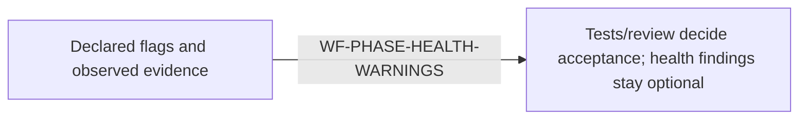

WJ-2026-125: required-review declarations express applicability, not a verdict.
An indexed report must reach the existing approval/rejection evaluator; it must
not be reduced to an evidence path behind a synthetic missing-review placeholder.


### Project-owned verification command handoff

Refinement supplies statically discovered commands in FeatureDescription.md TestPlan;
developers validate and maintain them and Phase Verification References. The
[authoring policy](project-test-plan-authoring.md) defines per-repository working
directories, preparation, source inputs, generated outputs and evidence ownership.
Native and MCP prompts share these responsibilities. Read-only coverage consumes
the declarations; this change does not implement runtime generated-output handling
or bypass the source snapshot guard. See WJ-2026-126.

Manual verification presentation and recording (`WF-MANUAL-CASE-VERIFY`): top
controls stay visible above scrolling instructions. Disabled actions explain stale
packs, missing cases, missing review or active operations; paused regeneration
explicitly says it did not finish. Reviewing all current validated manual cases
and recording their passes is allowed even with incomplete acceptance coverage.
Results remain bound to individual IDs and the exact current pack/review. Bulk
recording cannot bypass failed findings or grant finalization while overall
readiness is incomplete. Automated coverage assessment remains a separate concern.


### Independent assessment and recoverable manual authoring (WJ-2026-132)

Read-only completion coverage assessment uses available source-bound execution
reports even if manual-pack generation or review is outstanding, or a separate
phase/artifact gate remains unresolved. The evidence snapshot excludes stale
manual passes. Assessment neither clears those independent blockers nor grants
completion or human acceptance. Coverage confirmation retains its current-pack
and unchanged-source/report/result checks.

Manual generation returns rejected JSON/case-contract drafts to the same model
with the exact diagnostic, rejected draft and original source/guidance contract.
Recheck source and operation ownership before and after each dispatch; checkpoint
only validated complete batches. Use shared repeated-diagnostic tracking (including
cycles) to stop after three occurrences of the same unresolved defect; provider,
cancellation and authority failures are not invalid-draft retries. Publish progress
as correcting the current batch. Required case fields and placeholder rejection
remain structural guards; a fixed opening-verb vocabulary cannot certify whether
prose describes an executable action. Human review checks the complete procedure.

Compatibility status parsing reads explicit header metadata or a relocated field
block identifying its feature. Introductory section headings do not erase document
identity. Competing declarations are unresolved; child-task metadata, fenced
examples, quotations and comments cannot supply lifecycle authority. Canonicalization
at an admitted boundary edits only the located token. Read-only scans never write.

Phase recovery badges, artifact diagnostics and coverage controls occupy full-width
rows. Only the phase title and lifecycle status share the heading row. This layout
is independent of phase number, role, project and gate combination.


The feature detail page presents human code review, manual test verification,
and completion readiness in that order. After current manual passes are saved,
it directs the user to Refresh Completion Readiness below for acceptance coverage
assessment. This presentation order does not make manual completion a prerequisite
for executing automated verification or assessing its coverage.

### Explicit investigation must lead to repair (WJ-2026-133)

The owning phase action is **Investigate and fix phase findings**. Its explicit
repair authority covers diagnosis, minimal corrections to confirmed implementation,
assertion, command or evidence-mapping defects, and affected configured checks.
Mixed recovery groups retain every unresolved finding, configured target and
prerequisite; independent human coverage confirmation is excluded. Current
structured gap facts replace stale generated inspection-only prose in the prompt.
Assessment and automatic configured-execution routing retain their narrower authority.

Read earlier diagnoses and exact cited sources before repeating discovery. Continue
focused corrections while execution evidence shows progress, within the bounded
invocation. Stop on concrete scope/authority/environment blockers, an architectural
impasse or repeated unchanged failures. Do not weaken assertions or fabricate results.
Store narrative investigation detail as JSON under verification/, updating phase
gates and project-owned test inventories only for substantive changes.

After a completed repair, independent reassessment must validate actual evidence.
The canonical source-changed result starts fresh verification automatically for the
current feature, guarded by cancellation and successor ownership. It never grants
human acceptance. Other assessment errors or failed workers do not trigger another
execution; a failed handoff remains a truthful failed outcome.

### Logical coverage and action authority (WJ-2026-134)

Implementation gates, readiness assessment and phase repair share the logical
acceptance coverage contract. The model compares the accepted FEAT/EPIC behavior
with test setup, actions, assertions, shared helpers and required integration
boundaries. Multiple complementary tests may cover one criterion. Existing fitting
tests are recognized; neither duplicate tests nor an LCOV/line-percentage artifact
is required. Test execution and logical sufficiency remain independent decisions.

Readiness includes existing phase.gates criterion/assertion mappings and current
referenced test source contents. They are context, never automatic approval of a
previous sufficient verdict. Source bodies use the existing source-fact paging;
missing/out-of-project/oversized references remain explicit context limitations,
not missing-implementation conclusions. Logical-source changes invalidate the
assessment fingerprint and applicable automated link bindings without changing
the manual pack or recorded human results. Legacy Markdown and fresh inspection
mappings remain supported when structured phase records are absent. Direct test
file references from the current inspected plan also supply source bodies, without
requiring new phase artifacts or applying a language-specific parser.

Refresh Readiness inspects, runs configured checks, and assesses; it cannot create
tests or repair product code. An explicit phase fixer repairs confirmed in-scope
assertion/implementation/configuration gaps and reruns affected verification.
No project name, phase number/title, FEAT identity or technology selects this policy.

Numeric coverage is optional advisory telemetry. Final verification profiles need
configured build/test/lint intents but no numeric coverage command. A declared final
checkpoint cannot by itself require an LCOV profile, a universal percentage target
or a Deep-Dive handoff for missing instrumentation. Existing numeric checks remain
supported and their measurements never replace logical acceptance assessment.


### Shared sources and recoverable inspection failures (WJ-2026-135)

Plan admission keeps source containment, nonempty selections, unique check IDs,
exact duplicate cwd/command detection and phase mapping checks. It cannot infer
runtime scenario selection from overlapping files. Independent filtered groups
retain the same suiteKey and complete testPaths without a correction detour.
The inspector still eliminates proven redundant executions by inspecting runner
configuration; a shared filename or test name is not proof of redundancy.

Targeted correction may update either check named in a duplicate-execution
conflict or a legacy saved overlap diagnostic. Unrelated checks and phase
mappings remain protected, and the complete patched candidate is revalidated.
A correction runtime failure preserves the actual plan diagnostic and the
runtime cause, states that automated tests have not run, and points to Refresh
Completion Readiness after resolving the issue. This is a readiness operation
failure, not a new phase gate. Human review and manual results are unchanged;
no worker is started around a timeout/budget denial, and cancellation still wins.


### Host-owned execution receipt contract (WJ-2026-136)

Before fresh execution, HEPHA resolves its reserved output-directory placeholder
using literal shell quoting and uses the same bound plan for execution, identity
context, evidence binding and later assessment. This does not evaluate arbitrary
environment variables or shell substitutions. Documentation stays portable and
baselines rebind the owned run directory on later invocations.

Execution receives the common `verification.execution.receipt` JSON schema and a
host-generated template, with fixed feature/check identities and null outcome
placeholders. The importer validates the same schema before native evidence;
legacy receipts remain readable. Runtime failures, wrong reports, changed test
selection or invented counts cannot be hidden by valid JSON. Optional metadata
may be enriched without altering the worker's original result or granting human
acceptance. See `execution-receipt-template.feature` for schema, tampering,
literal path binding and legacy report reuse regressions.

## Accepted feature completion scope (WJ-2026-137)

`WF-VERIFICATION-VALIDATION-RESUME` handles explicit Refresh after a run stops
during report validation. HEPHA revalidates the selected plan, all configured
source owners and snapshots, and every checksum-bound native outcome. If all
remain valid, it resumes the same run into assessment without inspection or test
redispatch, preserving timestamps and human results. Changed source, missing or
failed evidence, and earlier inspection interruptions take the fresh path.

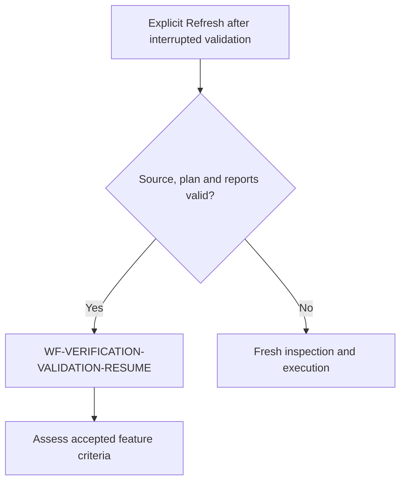

Native stdout may be both report and audit log; it counts once. Duplicate native
reports still cannot inflate counts. Multi-repository qualified revisions accept
the same hash-first and working-tree-first spellings as single-repository claims,
with execution owner first and every hash checked against configured owners.
Receipt repair searches stay within selected configuration and run artifacts.

`WF-READINESS-ACCEPTED-SCOPE` binds completion to the admitted feature plan.
Authorized Start captures `manual-test-verification/accepted-feature-scope.json`;
explicit Refresh imports compatible in-progress planning artifacts when absent.
A changed criterion requires the authorized planning/start boundary, which archives
its predecessor. Refresh cannot accept an amendment or change applicability.

Inspection → configured prerequisite order → fresh execution/report validation →
`feature.acceptance.assessment` → host-validated accepted criterion decisions → Ready
or an actionable accepted-scope failure. The shared schema produces and validates
the model exchange. Unknown/duplicate/omitted criteria, unsupported obligation
quotes and invalid evidence return concrete correction diagnostics. Missing
references get bounded read-only retrieval within admitted roots. An unresolved
context/protocol problem has a feature-level readiness retry; it is not proof of
missing implementation. A validated unmet obligation goes to its owning phase.
The phase fixer receives the baseline, preserves passing proof, repairs within
scope, and requests reassessment of unresolved obligations after settlement.

Complementary tests can collectively establish the accepted verification approach.
An additional model-generated coverage-link confirmation is not required. Native
reports, current-source binding, required phase tests/review, manual execution,
user review and the explicit final completion action retain independent checks.
Build/lint warnings remain advisory. Unrelated parent criteria and historical
manual authoring notes do not add gates.

Improvement observations persist in the recovery record and deduplicated feature
LessonsLearned proposals with `proposed-for-future-planning` status. They neither
become active rules nor invalidate fresh execution/manual results. Existing human
approvals remain readable; old assessment decisions are re-evaluated under the new
policy while applicable reports and human results are preserved.

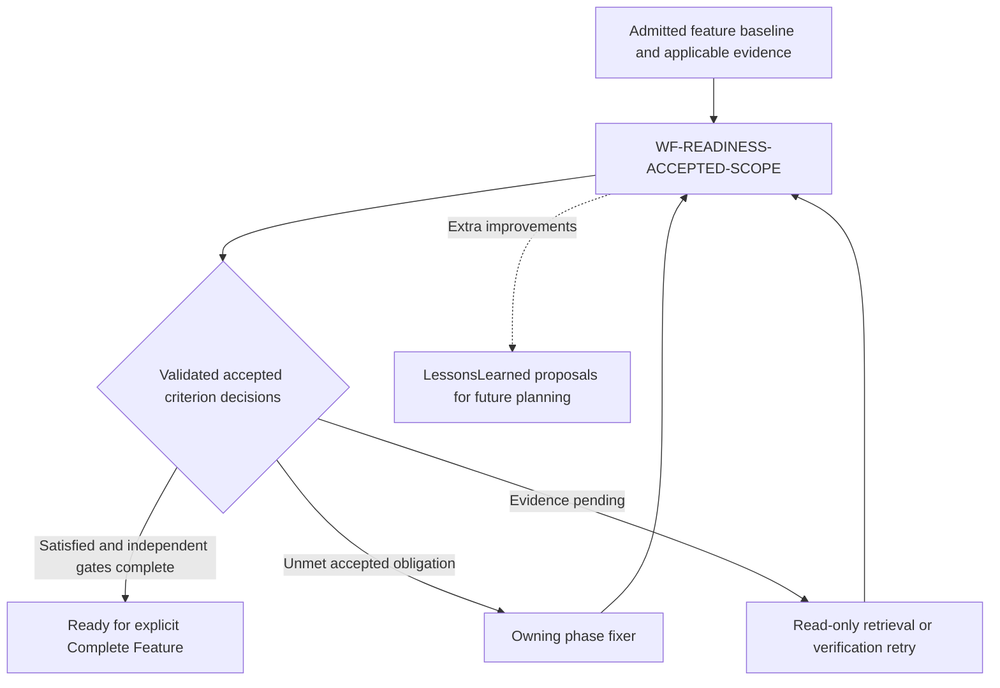


### Automated acceptance and independent manual acknowledgement (WJ-2026-139)

Readiness assesses accepted criteria using automated tests, inspected assertions
and independently validated passing execution only. The v2 feature acceptance
payload permits only `kind: automated`. Manual case IDs, steps, reviews and PASS
records cannot supply acceptance contributions. Explicit manual-only obligations
remain in the admitted plan and manual documents but are excluded from automated
assessment; this exclusion does not create replacement automation requirements.

The automated assessment record and cache bind to accepted scope, source documents
and automated execution evidence, independently of manual pack identity, authoring
issues or outcomes. Pack status describes executable manual cases and authoring
issues only; completion projection derives automated gaps from validated assessment
links, never from the manual package's coverage classification.

User code review and acknowledgement of manual execution remain separate required
completion steps. Already recorded current reviewed passes can project the missing
acknowledgement timestamp withheld by older coverage-coupled versions; this creates
no new result or approval. Acknowledgement cannot prove an automated criterion.
Actual unresolved findings and declared test/review gates remain blocking.

```mermaid
flowchart LR
  AutoEvidence[Accepted criteria and automated assertions] -->|WF-READINESS-AUTOMATED-EVIDENCE| AutoDecision[Validated automated coverage]
  AutoDecision --> Readiness[Completion readiness]
  HumanAcknowledgement[User code review and manual acknowledgement] --> Readiness
```

### Preserve evidence during acceptance retrieval (WJ-2026-140)

`WF-READINESS-CONTEXT-RECOVERY` keeps all retrieved assertion bodies across
read-only recovery calls. Each call assesses only the still-pending criteria;
validated decisions from the same source/evidence snapshot remain intact.
New references can advance beyond two delegation hops. Stop when references
repeat, no additional content is available, or the existing context/spending
limit is reached. None of those stops establishes a pass or missing code.

Resolve source line ranges and Markdown section anchors inside admitted source
roots and the selected feature folder. These are location hints, not filenames.
Realpath and root checks still reject escapes. Preserve the accepted test report's
allocation across browser, integration and component layers. Follow shared
handlers before requiring duplicate assertions for equivalent entry points;
missing source excerpts never authorize new test requirements.

```mermaid
flowchart TD
  A[Pending accepted criterion] --> B[WF-READINESS-CONTEXT-RECOVERY]
  B --> C[Read new references within admitted roots]
  C --> D{Additional context fits the budget?}
  D -->|Yes| E[Accumulate sources and assess pending criteria]
  E -->|New pending reference| B
  E -->|Satisfied or concrete unmet obligation| F[Merge validated decisions]
  D -->|No or no new source| G[Preserve evidence pending and retry action]
```

### Verification source recovery

An explicit completion-readiness Refresh owns source-drift recovery on the server.
Before execution HEPHA captures repository fingerprints plus a local manifest of
filenames and hashes. If execution changes a repository, it saves a changed-file
diagnosis and preserves that attempt's reports. It sends the diagnosis and prior
plan to inspection, establishes a new source baseline, and reruns every selected
check in a new invocation/output directory. Recovery cannot remove checks, demote
their kinds/gates, or remove phase assignments. Current configured command/setup
corrections use the existing validated inventory publication path. Production/test
code, accepted requirements and human acknowledgements are outside this recovery.

No generated filename is exempted and no LLM verdict can waive freshness. Only a
stable subsequent execution with valid native reports proceeds to logical
acceptance assessment. Two automatic retries are allowed; a third drifting
execution stops with changed filenames, preserved attempt reports and **Retry
verification** in the browser. Changed requirements require plan review.
The stopped-verification panel accepts optional guidance for the next explicit
retry. New guidance forces inspection instead of reusing a cached plan or report
assessment. It grants no acceptance or implementation authority and is kept out
of background assessment and confirmation requests.
Cancellation/ownership loss prevents further dispatch and acceptance. Ordinary
test failures remain unresolved under the existing evidence/phase repair rules.

Unknown historical build/lint prose cannot overwrite an explicit successful
repair decision that links evidence. Observed execution failures remain visible.

### Selected phase repair postcondition

A returned phase worker enters post-repair reassessment. If the selected gate or
phase completion gap remains unresolved, the next attempt receives the worker's
report and the host's current evidence/diagnosis. The selected scope, gate rules
and original user guidance remain fixed. Health warnings do not block feature
completion, but an explicitly requested health repair must resolve its warning
before that repair is reported successful. Three unsuccessful repair/verification
rounds end with a plain-English per-round account: work reported by the fixer,
independent verification, remaining issue, why automatic attempts stopped and
how to add guidance in the phase textbox before retrying. A new explicit repair
request starts a new bounded loop. The dashboard preserves the full per-round
report even when it mentions a code-review report; summary compaction must not
hide the verified failure reason or next action. Assessment/runtime failures retain their
specific cause rather than pretending a gate passed; cancellation and fresh
verification handoff retain ownership. No later phase or feature completion is
dispatched by this loop.

```mermaid
flowchart TD
  FreshExecution[Fresh execution changed source] -->|WF-READINESS-SOURCE-RECOVERY| SourceRecovery[Diagnose, reinspect and rerun; maximum three executions]
  RepairReturned[Selected phase repair returned] -->|WF-PHASE-REPAIR-POSTCONDITION| RepairCheck[Verify requested outcome; retry unresolved findings up to three rounds]
```

An explicit phase repair can proceed from execution investigation to an actual
implementation repair when host reassessment identifies an unmet accepted
obligation in that same phase. The next prompt removes execution-only guidance
and includes the current finding and phase repair contract. A read-only Refresh
handoff cannot expand into implementation repair.
