# Hepha Workflow Control-Flow Map

## Authority and purpose

This is the diagnostic map for Hepha workflow behavior. Use it to answer three
questions without reading the whole orchestrator:

1. Which transition should have occurred?
2. Which production method owns that decision?
3. Which unit and Gherkin tests prove the decision?

The workflow specification is documentation-first and has three normative,
machine-checkable parts:

- [`workflow-transition-registry.json`](workflow-transition-registry.json)
  defines transition IDs, triggers, destinations, purposes, implementation
  owners, and test evidence;
- the YAML files under `.workflows/` define ordered command nodes; and
- referenced JSON schemas define agent result contracts.

This map is the human-readable projection of those declarative contracts. The
application methods referenced here implement and enforce the decisions; they
do not independently redefine them. If production behavior conflicts with the
documented contract, the implementation and its tests must be corrected, or
the documentation must first be deliberately changed through the workflow
change-justification process. The dashboard is never transition authority.

Model-produced output crosses a separate authority boundary before it may
trigger any transition in this map. The cross-provider rules, preparation
pipeline audit, schema requirements, and diagnostic checklist are defined in
[Model-Agnostic Authority Boundaries](model-agnostic-authority-boundaries.md).
A workflow working only because adjacent actions use the same model family is
not a complete contract: model output remains an untrusted candidate until a
deterministic Hepha parser, validator, and persistence boundary accepts it.

A transition is incomplete unless it has all of the following:

- a stable `WF-*` identifier in the registry and a Mermaid diagram;
- one production `Class.method` owner with a single stated purpose;
- a durable trigger and destination;
- unit-test evidence for the owner's decision boundary;
- Gherkin evidence for the externally observable route.

## Declared command workflows

This table is a complete index of the command definitions loaded by
`feature-workflow-spec.ts`. The node order comes from YAML; the application
owner supplies each action/prompt implementation and the runtime detours shown
later in this document.

| Command | Declared node sequence | Runtime owner |
| --- | --- | --- |
| `deep-dive-epic` | `create-session` → `generate-questions` → `wait-for-answers` → `answers-ready` → `update-document` → `sync-epic-state` → `record-completion` | `DeepDiveStartApplication.start` and `DeepDiveCompletionApplication.complete` |
| `deep-dive-feature` | `create-session` → `generate-questions` → `wait-for-answers` → `answers-ready` → `update-document` → `record-completion` | `DeepDiveStartApplication.start` and `DeepDiveCompletionApplication.complete` |
| `design-feature` | `collect-context` → `generate-design-artifacts` | `DesignFeatureExecutionApplication.execute` |
| `refine-feature` | `collect-context` → `generate-artifacts` → `evaluate-result` → `promote-ready` (completed result only) | `RefineFeatureExecutionApplication.execute` |
| `start-implementing` | `create-branch` → `move-in-progress` → `sync-linked-epic-state` → `post-process` → `implementation-loop` | `StartImplementationRunApplication.execute` |
| `continue-implementing` | `refresh-current-feature` → `resolve-next-task` → `implementation-loop` | `ContinueImplementationRunApplication.execute` |
| `complete-feature` | `collect-context` → `finalize-feature` → `verify-completed-state` → `sync-linked-epic-state` | `CompleteFeatureExecutionApplication.execute` |

The loader accepts the compatibility `.workflows/` layout and the target
`.hepha/workflows/` layout, but it rejects divergent duplicate definitions.
That path-resolution concern does not add a lifecycle transition.

## Temporary DevCycle MCP recipe-source compatibility

Design Feature, Refine Feature, Start Implementing, Continue Implementing, and
Complete Feature keep `native-hepha` as their default recipe source. An explicit
validated runtime policy may instead select `devcycle-mcp` globally or for one
of those action identities. The selection is made from the action key before
native admission, V3 artifact validation, branch preparation, phase routing, or
completion gates run. It never derives authority from a FEAT identifier, phase
number, title, status prose, or generated Markdown.

`FeatureWorkflowSummaryProjector.build` keeps the selected compatibility action
available from the FEAT lifecycle folder without requiring native Deep-Dive,
V3 artifact, or continuation projections. The HTTP boundary still resolves
stable project/FEAT identity and rejects an already-running workflow.
`DevCycleMcpCompatibilityApplication.start` owns `WF-RECIPE-SOURCE-MCP`. It
records one workflow run and dispatches
one plan-bound Pi worker with the same registered action/model identity. That
worker receives the workspace-scoped `pi-mcp-adapter` and `.mcp.json`, calls the
mapped DevCycle recipe once, validates the recipe's `pending_execution` client
contract, and executes it locally. In autonomous mode the same Pi session and
model may follow explicit MCP recipe handoffs through implementation, review,
phase acceptance, and completion. Native workflow applications and prompts
remain unchanged and are selected immediately when the policy says
`native-hepha`.

This route is a compatibility and diagnostic boundary, not new lifecycle
authority. Legacy MCP output is intentionally not forced through Hepha's V3
promotion and phase-state machinery because doing so would change the variable
under comparison. It remains subject to provider-neutral Hepha lifecycle
invariants: Deep-Dive owns target clarification; Refine may not publish
human-sign-off, owner-attestation, CODEOWNER-approval, manual-acceptance, or
user-choice implementation tasks; and autonomous/single-phase implementation
has delegated decision authority plus automated review and acceptance.

Refine is also a documentation-only planning boundary. Its worker discovers the
stack and configured quality commands from manifests, lockfiles, workflows,
source, and documentation, but does not execute package-manager, compiler,
build, test, lint, audit, dependency-search, or version-probe commands. It may
mutate only the target MemoryBank refinement artifacts and recipe-owned
lifecycle projections. This prevents planning research from compiling product
code, creating generated outputs, or tripping implementation command-safety
policies before an implementation phase exists.

Refinement activates stack-specific execution profiles only from static target
and feature-scope evidence. A Rust/Cargo profile is generated only when the
target product workspace contains `Cargo.toml` and the feature or configured
gates will invoke Cargo. The profile is recorded in `FeatureTasks.md` and
inherited by every generated phase; non-Cargo features receive no Cargo prose.
Sequential Cargo invocations may share one foreground shell tool call, while
background Cargo, sibling Cargo tool calls, overlap with an active Cargo call,
and timeout retries without process inspection remain prohibited.
Implementation compatibility dispatch remains technology-neutral and tells
workers to obey only activated inherited constraints. It also separates
implementation completion from release readiness: only in-scope tasks and
configured executable gates can block phase or feature implementation
acceptance. Separately owned repository work, future suites, physical
qualification, deployment certification, and organizational release evidence
are projected as findings, Lessons Learned, linked-epic updates, and follow-up
EPIC/FEAT recommendations without keeping implementation incomplete.
Configured zero-warning
gates remain red whenever output contains a warning, even if the process exits
zero; workers cannot relabel those warnings as pre-existing or benign to accept
a phase.

Provider ownership also selects artifact validation. DevCycle refinement and
in-progress plans use their durable `FeatureTasks.md` plus phase-file lifecycle
contract; native plans retain strict V3 validation. This keeps Continue
readiness fail-closed without applying native V3 requirements to DevCycle-owned
artifacts. DevCycle refinement publication additionally rejects deferred human
decision tasks so a prompt violation cannot silently authorize Start.

Runtime receipts record the selected action/model and the workflow summary
records the MCP recipe source. For Start/Continue implementation telemetry, the
compatibility application selects the first unresolved lifecycle phase from the
provider-owned phase collection and attaches that phase identity to the worker
record. Phase number/title are copied only as display metadata; they do not
select control flow. The immutable handoff plan supplies the orchestrator
command model, while runtime receipts independently retain the observed route
and any fallback. Settled agent executions accumulate in the phase row even
when that phase remains in progress. If one autonomous MCP session crosses a
phase boundary, the durable phase-artifact update timestamp closes the previous
phase segment and the remaining execution time is attributed to the next phase.
Pre-fix MCP runs may use the same display-only reconciliation from the
refinement boundary plus the first phase artifact changed after dispatch; this
evidence never controls lifecycle. Their phase rows retain an expandable
runtime-evidence view backed by immutable orchestrator agent records (agent,
command model, measured segment, status, timestamps, and workflow identity).
The view explicitly distinguishes those facts from an observed provider or
fallback route, which is unavailable when the original invocation was not
phase-bound.

Missing adapter/config assets, invalid source values, MCP errors, a missing
recipe execution contract, or invalid provider-owned artifacts fail without
silently falling back to native instructions.

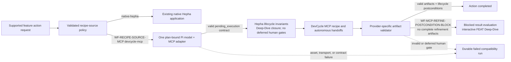

A terminal model process proves only that provider execution returned normally.
For MCP refinement, Hepha rescans provider-independent postconditions before
recording completion. The FEAT must be in `02_READY_TO_DEVELOP` and expose
complete provider refinement artifacts. Otherwise the durable run is blocked at
result evaluation, `refineCompletedAt` is withheld, repeat Refine is disabled,
and the standard FEAT Deep-Dive action is exposed. This current-action blocker
remains authoritative even when an earlier Deep-Dive consumed source markers;
historical hashes and receipts remain audit-only evidence.

## Action-scoped readiness projection

Readiness is not one feature-wide verdict. `FeatureWorkflowSummary.readiness`
describes the current lifecycle action only. For an in-progress FEAT, an
available Continue Implementing action is projected as `Ready to continue`,
even while Complete Feature correctly remains unavailable because later phases,
reviews, tests, or final quality evidence are unfinished.

`FeatureWorkflowSummaryProjector.build` owns the current-action projection and
must not copy Complete Feature obligations into it. The web overview renders
only current-action reasons. `buildCompletionReadiness` independently projects
finalization obligations in the `Complete Feature readiness` panel. Board
quality-gap badges stay hidden during active implementation and become visible
only after implementation phases resolve; future-phase absence is expected work,
not a current blocker.

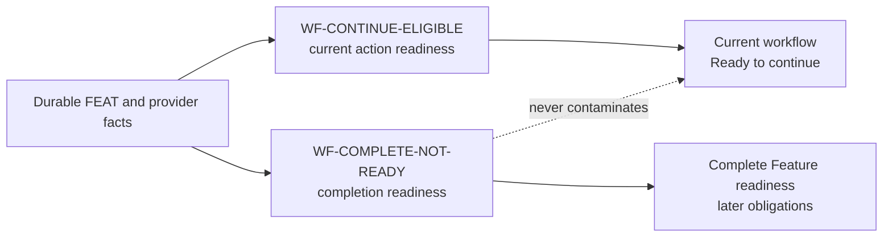

## Pre-dispatch routing guard

Every future worker-producing action reaches `RoutingPolicyService.resolve` before
an execution consumer may act. The guard resolves only a registered V1 action
against current catalog facts and the persisted Action → Action Type → Global
policy. A Web workflow first attempts the persisted policy without bootstrap
context. Only when that attempt returns `ROUTING_BOOTSTRAP_REQUIRED` may
`RoutingActionResolver.resolvePlan` supply the exact installation Pi Session
default selected in Pi settings. Startup binds that explicit provider/model to
exactly one active connection through code-owned endpoint identity and scans
that connection when the model is not yet cataloged. Mutable labels, workflow
model fields, environment model aliases, and static fallback models are not
bootstrap sources.

The policy resolver validates the supplied route against the registered action
and current catalog, then atomically creates the first Global revision. If that
mutation conflicts, it rereads the persisted winner exactly once and resolves
it only when its registry version matches; an absent, invalid, or mismatched
reread returns a sanitized rejection. It returns a typed primary plus
at-most-one recovery plan, or a sanitized rejection. It does not launch Pi,
inject a credential, write a receipt, or advance workflow state; those are
FEAT-062 execution concerns.

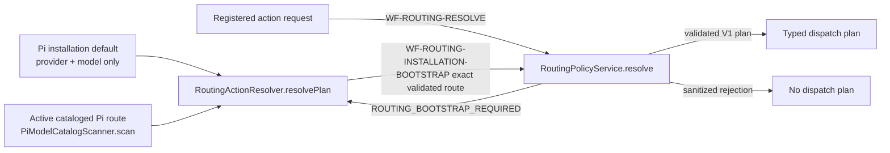

## Plan-bound isolated Pi execution

Every worker-producing application now passes the complete accepted
`HandoffPlanV1` to the runtime host. `HandoffPlanExecutor.executeAttempt`
revalidates that plan and its runtime context before any receipt, connection,
vault, filesystem, or process effect. A valid plan opens one normalized
invocation, binds the exact active connection and authentication version,
prepares a unique Pi configuration/session root, reads only the selected vault
secret when required, and marks the approved route as actual immediately before
one pinned process call. The executor never queries routing policy, reads a
model key, selects a default, or substitutes a route.

One-shot, detached, and dashboard task launches share this boundary. Detached
processes retain their isolated context until exit; every terminal outcome
settles normalized evidence and performs idempotent cleanup. Invalid plans and
contexts reject before side effects. A valid plan whose connection,
authentication, provider projection, secret, or context preparation is
unavailable records only a safe preparation failure and never spawns or claims
an actual route.

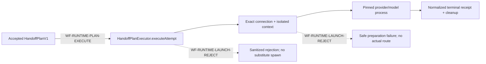

`RuntimeExecutionCoordinator.execute` now owns the only legal transition after
a failed primary attempt. It reads normalized durable work/checkpoint evidence,
not model output or phase labels. Work state `none` can consume the plan's
second route once as fallback; `checkpointed` requires a complete authorized
cursor and can consume it once as recovery; `started` without a checkpoint is
terminal. A failed second attempt, one-step/Global plan, malformed checkpoint,
or exhausted route sequence settles without policy re-resolution, recursive
routing, replay, or later workflow advance.

Direct-host execution is not a runtime chain transition. A user-invoked
portable skill stays in the active Pi, Codex, or Claude Code session and does
not query routing policy, compare routes, create a child worker, or write an
orchestrated receipt. Only a dashboard or explicit Hepha launcher enters the
orchestrated boundary.

At that boundary, the generic dashboard task and specialist applications admit
one explicit `agent_action`, validate registry membership and launch-node
equality, and reject unknown or conflicting values before route resolution,
state mutation, or process work. The accepted action resolves one immutable
plan; every plan-consuming public boundary must match its action ID, action
type, role ID, prompt version, minimum context-window requirement, and API,
reasoning, and tool capabilities to the same registry entry before task storage,
coordinator execution, or Pi provider/model injection. Review dispatch and
`RuntimeKnowledgeWorkerLifecycleApplication` reach the four exact nested
methods consumed in `index.ts`. Phase exit invokes Phase Lessons Capture, a run
that resolved at least one phase invokes Feature Lessons Writer, and successful
detached feature completion invokes the Post-Complete Curator. Each method
resolves its own exact action and persists a separate `nested` chain with a
primary first attempt, parent/root lineage, and sorted selected lesson IDs when
a real parent invocation exists in the current run. A fresh Continue run may
resume directly at Code Review or another specialist task before any model
invocation has run. In that topology, `WF-RUNTIME-RESUMED-SPECIALIST` executes
the independently planned specialist as one fully scoped root chain carrying
the current workflow, card, phase contract, phase, and task identity. It does
not fabricate a context-free parent receipt. Failed completion starts no
curator; curator input is project-only and forbids FEAT reopen or Second Brain
export. Persistence failure is terminal before classification and can never
authorize plan step 1.

```mermaid
flowchart LR
  PrimaryFail["Failed primary attempt"] --> WorkState["DurableWorkStatePort"]
  WorkState -->|"none / WF-RUNTIME-FALLBACK"| Fallback["One approved fallback attempt; lifecycle hooks rebound to fallback identity"]
  WorkState -->|"checkpointed / WF-RUNTIME-RECOVERY"| Recovery["One cursor-bound recovery attempt"]
  WorkState -.->|"started, malformed, or no step / WF-RUNTIME-TERMINAL"| Terminal["Terminal; no workflow advance"]
  Fallback -->|"success: primary failure retained + fallback completion / WF-RUNTIME-RECEIPT-SETTLE"| Receipt["Canonical normalized chain; invocation succeeds"]
  Recovery -->|"terminal / WF-RUNTIME-RECEIPT-SETTLE"| Receipt
  Direct["Direct-host skill"] -->|"WF-DIRECT-HOST-NO-LAUNCH"| Host["Current host session; no routing or receipt"]
  Host -->|"optional deterministic state sync / WF-DIRECT-HOST-EVIDENCE"| DirectEvidence["Route-incapable direct-host evidence"]
  DirectEvidence --> MixedProjection["Guarded mixed-mode FEAT Details projection"]
  Receipt --> MixedProjection
  Action["Explicit agent_action + matching launch node"] -->|"WF-RUNTIME-ACTION-ADMISSION"| Plan["Registered independently resolved plan"]
  Plan --> Child["Pinned root or nested chain"]
  Parent["Review or phase/feature knowledge lifecycle with current-run parent"] -->|"WF-RUNTIME-NESTED-DISPATCH"| Child
  Resume["Resumed specialist; no current-run parent"] -->|"WF-RUNTIME-RESUMED-SPECIALIST"| RootSpecialist["Fully scoped root specialist chain"]

  ReviewBasis["Existing immutable NEEDS_CHANGES report + manifest"] --> Fixer["Code-review fixer agent"]
  Fixer -->|"append/update one ## Fixer Response in the same report; preserve reviewer text and NEEDS_CHANGES"| UpdatedReport["Existing report with complete fixer proposals"]
  UpdatedReport -->|"one terminal worker output"| FixerOutput["Fixer Response + V1 successor JSON + gate handoff"]
  FixerOutput -->|"normal post-worker path"| GateParser["Strict Hepha Gate Evidence parser"]
  GateParser --> Gates["Quality Gate Evidence updated"]
  FixerOutput -->|"WF-REMEDIATION-SUCCESSOR-VALIDATE"| SuccessorParser["Parse exact remediation response and verification receipt"]
  SuccessorParser --> Binding["Check executor-owned IDs, scope, predecessor, and placeholders"]
  Binding --> ResponseIngress["Validate and persist canonical remediation response"]
  ResponseIngress -->|"invalid: return safe contract code/message"| SameFixer["Same fixer receives actionable repair brief"]
  SameFixer --> Fixer
  ResponseIngress -->|"persisted"| ReceiptIngress["Bind response hash/path, validate and persist receipt"]
  ReceiptIngress -->|"durable response + receipt / WF-FIXER-REREVIEW"| Reviewer["Independent code-review rerun"]
  Reviewer -->|"APPROVED"| ReviewApproved["New terminal APPROVED report"]
  Reviewer -->|"NEEDS_CHANGES"| NewFindings["New immutable NEEDS_CHANGES report + manifest"]
  NewFindings --> Fixer
  PhaseDoc["Phase document"] -.->|"recovery only"| DocumentHandoff["Durable gate handoff"]
  SessionJSON["Session JSON file"] -.->|"recovery fallback"| DocumentHandoff
  Complete["Successful detached feature completion"] -->|"post-complete curator"| Parent
```

A non-default Pi-session connection resolves its runtime provider from the
code-owned endpoint identity when that endpoint represents exactly one
provider (for example, `api.deepseek.com` → `deepseek`). For an endpoint that
represents multiple providers, Hepha first uses the explicit installation
default when it targets that connection. Otherwise it intersects the endpoint's
code-owned provider identities with the validated top-level provider identities
present in Pi's authentication store. Exactly one match is accepted; credential
values are neither projected nor retained. Zero or multiple matches fail closed.
`provider_unsupported` therefore means provider identity could not be safely
resolved before process spawn; it does not mean the model returned an API
error. Route-exhaustion presentation includes the failed route, durable cause,
fallback availability, and the Agent Routing recovery action instead of showing
only `RUNTIME_ROUTE_SEQUENCE_EXHAUSTED`.

On `WF-RUNTIME-FALLBACK`, the coordinator passes the same attempt lifecycle
hooks to the second executor call. The durable chain retains the primary
failure and route-change reason, while all mutation work-state/checkpoint
updates bind to the fallback attempt. A completed fallback settles the overall
invocation successfully and remains visibly distinct from the failed primary
attempt in runtime evidence.

`PiModelCatalogScanner.scan` accepts both the legacy JSON fixture contract and
Pi's supported `--list-models` table. Table rows are filtered by the
connection's code-owned provider endpoint before normalization, so scanning one
Pi Session connection cannot attach another provider's models to it. The
installation default is usable only after its exact connection/model identity
is present and available in the safe catalog. Failure to read settings, bind
one active connection, scan the route, or validate capabilities remains
`ROUTING_BOOTSTRAP_REQUIRED`/the resolver's exact sanitized rejection; it never
selects an arbitrary model.

## Level 1: complete feature lifecycle

The label in every high-level node names the application method responsible
for entering or leaving that workflow area.

```mermaid
flowchart LR
  Submitted["Submitted work item"]
  MarkerGate{"Unresolved validation markers?<br/>createValidationSummary"}
  Wait["Waiting for answers<br/>DeepDiveStartApplication.generateQuestions"]
  Clarified["Clarified document<br/>DeepDiveCompletionApplication.complete"]
  Designed["Design artifacts<br/>DesignFeatureExecutionApplication.execute"]
  RefineBlocked["Refinement needs decisions<br/>RefinementDeepDiveHandoffApplication.create"]
  Ready["Ready to develop<br/>RefineFeatureExecutionApplication.execute"]
  Running["Implementation running<br/>StartImplementationRunApplication.execute"]
  Phases["Generic phase loop<br/>AutonomousImplementationWorkflowApplication.execute"]
  Verify["Manual verification<br/>ManualTestVerificationApplication.recordResult"]
  Finalize["Completion finalizer<br/>CompleteFeatureExecutionApplication.execute"]
  Done["Completed feature"]
  Failed["Failed run; durable source state retained"]
  Cancelled["Cancelled<br/>FeatureWorkflowCancellationApplication.cancel"]

  Submitted --> MarkerGate
  MarkerGate -->|"WF-DEEP-DIVE-MARKER-GATE / WF-DD-START yes"| Wait
  MarkerGate -->|"no markers"| Clarified
  Wait -->|"WF-DD-WAIT"| Wait
  Wait -->|"WF-DD-ADAPTIVE-FOLLOW-UP"| Wait
  Wait -->|"WF-DD-COMPLETE"| Clarified
  Wait -.->|"WF-DD-FAIL"| Failed
  Clarified -->|"WF-DESIGN-EXECUTE when required"| Designed
  Clarified -.->|"WF-DESIGN-FAIL"| Failed
  Clarified -->|"WF-REFINE-EXECUTE"| Ready
  Designed -->|"WF-REFINE-EXECUTE"| Ready
  Clarified -->|"WF-REFINE-DEEP-DIVE"| RefineBlocked
  Designed -->|"WF-REFINE-DEEP-DIVE"| RefineBlocked
  RefineBlocked -->|"open existing question round"| Wait
  Ready -.->|"WF-REFINE-RECOVER"| Ready
  Ready -.->|"WF-REFINE-FAIL"| Failed
  Ready -->|"WF-START-PREPARE"| Running
  Running -->|"WF-IMPLEMENT-QUEUE"| Phases
  Phases -->|"WF-QUEUE-COMPLETE"| Verify
  Verify -->|"WF-MANUAL-FAIL"| Phases
  Verify -->|"WF-MANUAL-PASS"| Finalize
  Finalize -->|"WF-COMPLETE-START"| Finalize
  Finalize -->|"WF-COMPLETE-DONE"| Done
  Finalize -.->|"WF-COMPLETE-FAIL"| Failed
  Running -.->|"WF-CANCEL"| Cancelled
  Phases -.->|"WF-CANCEL"| Cancelled
```

The design path is conditional. A feature can move directly from clarified to
refinement when UI artifacts are not required. Deep-dive waiting is a durable
human gate, not a failed workflow. Question discovery has no default absolute
wall-clock maximum: observable Pi/tool progress resets its inactivity circuit.
A timeout, malformed response, or empty question manifest follows `WF-DD-FAIL`
and remains visibly retryable; Hepha never substitutes generic `Accept current`
questions for failed model analysis. The adaptive route requires exactly one
opening question; compatibility manifests are normalized without a hidden count
ceiling. The generation overlay shows elapsed background work
instead of presenting productive research as a frozen spinner.
`WF-DD-ADAPTIVE-FOLLOW-UP` evaluates every saved answer without repository
tools, inserts one immediate dependent question after its parent when needed,
and runs a closure audit on the final pending answer. A static initial manifest
therefore does not claim authority over answer-dependent decisions. Refinement may
enter `WF-REFINE-DEEP-DIVE`
as many times as new user-owned decisions are discovered; there is no fixed
round limit. The detailed protocol and acceptance criteria are defined in
[`refinement-deep-dive-loop.md`](refinement-deep-dive-loop.md).

`WF-DEEP-DIVE-MARKER-GATE` makes Deep-Dive readiness marker-only. An unresolved `[NEEDS VALIDATION]` or
`[NEEDS_VALIDATION]` marker in the authoritative work-item description requires
clarification; absence of those markers permits the next preparation action.
File changes, phase-link updates, missing Deep-Dive history, and preparation
source hashes are not workflow gates. Design documents remain available as
question context, while their hashes and historical Deep-Dive receipts remain
audit evidence only.

`WF-REFINE-EXECUTE` authorizes Ready only after the promotion validator accepts
the current `hepha-phase-execution/v3` contract and every phase's declared Git
checkpoint. The general phase-contract reader still accepts V1/V2 for existing
Ready or In Progress features; that compatibility path cannot promote newly
authored refinement output. `RefineFeatureExecutionApplication.execute` owns
this decision, and `validateRefinePromotionArtifacts` enforces it.

Refinement liveness is progress-based rather than an estimated completion
duration. The repository default has no wall-clock maximum. A configurable
stall timer resets on trusted Pi/process activity, while an optional operator
maximum remains an explicit safety policy. `RefinementArtifactProgressReporter`
projects authorized core files and the ordered documents declared by
`PhaseExecutionContract.json`; it never derives behavior from phase titles,
suffixes, or a fixed count. Each persisted milestone updates the current
workflow step and survives dashboard refresh.

The first write/edit event moves runtime work state away from `none`; the first
successful write records an artifact checkpoint. A stalled or maximum-runtime
attempt that mutated files therefore cannot consume a fallback as if no work
occurred. `RefineFeatureExecutionApplication` preserves the primary cause,
rescans durable artifacts, and records the last completed and next required
artifact. A later retry starts a new auditable run and follows the skill's
partial-artifact repair contract. Complete valid Ready output still uses the
existing `WF-REFINE-RECOVER` promotion route when transport fails or the worker
returns an invalid Result V1 envelope. That recovery remains fail closed on
artifact validation, architecture-debt readiness, source confirmation, and the
transition receipt. The architecture-debt adapter sorts independent path,
symbol, and rule-tag query facts before its strict store boundary; a valid
touch plan is ordered by relative path and must not become `store_unavailable`
merely because its extracted symbol names have a different lexical order.
Result V1 `COMPLETED.files` remain feature-folder-relative and may not include
project, MemoryBank, lifecycle, or FEAT-folder prefixes.

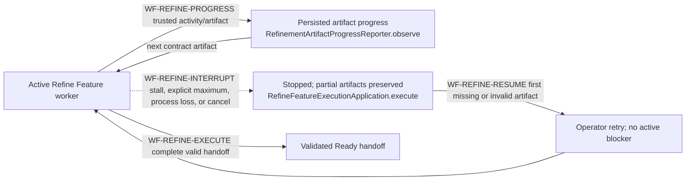

The complete decision and configuration contract is documented in
[Refine Feature Progress, Stall Detection, And Durable Resume](refine-feature-progress-timeout-and-resume.md).

## Level 2: start, continue, queue, and terminal routing

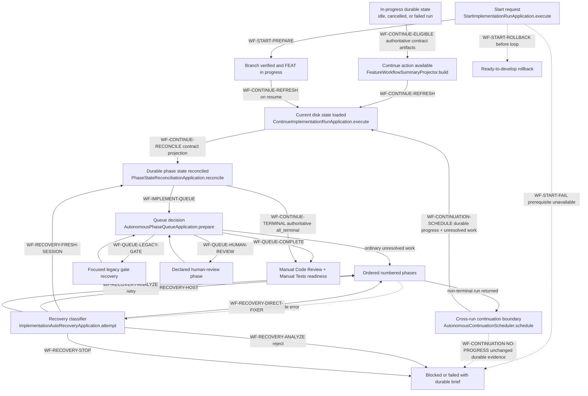

`StartImplementationRunApplication` owns only start-specific preparation and
rollback. `ContinueImplementationRunApplication` owns refresh, reconciliation,
terminal recording, and the outer failure boundary. Both delegate phase
selection and execution to the same generic implementation application.
`AutonomousContinuationScheduler` owns the separately registered cross-run
boundary. It is not a background implementation loop: it may create one fresh
Continue run only after the preceding run changed durable FEAT evidence and
unresolved phase work remains.

`WF-CONTINUE-ELIGIBLE` is evaluated from durable execution state. For a feature
with `PhaseExecutionContract.json`, the `Contract ID | Document | Role | Status`
inventory is authoritative. Validators select that table by its header schema;
they must not use an unrelated earlier Markdown table merely because it appears
first. A failed, blocked, cancelled, or idle run therefore remains manually
continuable when the declared execution contract, FeatureTasks inventory,
declared phase documents, and ordered task ledgers are valid and unresolved
work remains.

Refinement-time satellites are not continuation authority. A missing or
malformed planning-analysis report, architecture-debt touch plan, design
artifact, or other preparation diagnostic remains visible, but it cannot hide
`Continue Implementing` after implementation has started. Source-hash changes
never open a continuation Deep-Dive recovery; unresolved validation markers are
rejected before this boundary. A missing or malformed execution contract, missing
declared phase document, invalid task ledger, active workflow, terminal FEAT,
or no unresolved work still blocks the action with its exact diagnostic.

`WF-CONTINUE-RECONCILE` uses the same schema-selected Phase Inventory for every
read and write. Current inventories resolve `Contract ID -> Document ->
phase-<number> -> Status`; historical inventories without a contract resolve
`Phase -> Status`. The document suffix, contract ID, role, phase count, task
topology, and FEAT identity remain arbitrary. Reconciliation, phase scanning,
phase entry, phase completion, and recovery snapshots share this projection;
none may privately parse a different FeatureTasks status format.

**Terminal happy-path invariant:** `PhaseStateReconciliationApplication` is the
authority that proves task exhaustion, required phase-gate settlement, and
phase completion. When it returns `all_terminal`, Continue Implementation must
cross `WF-CONTINUE-TERMINAL` immediately. It must not dispatch a worker, enter
the queue again, or ask the continuation scheduler whether a secondary scanner
still reports work. The completed implementation run then asks the user for
Manual Code Review and Manual Tests before Complete Feature. Advisory coverage
remains visible telemetry but cannot veto this transition.

A non-terminal run reaches the scheduler only after its worker/reconciliation
boundary returns. `WF-CONTINUATION-SCHEDULE` requires both unresolved phase work
and a changed durable FEAT fingerprint. If unresolved work remains but the
before-and-after fingerprints are identical,
`WF-CONTINUATION-NO-PROGRESS` records the current run as blocked and does not
create a successor. The complete decision table, sequence, diagnostics, and
failure analysis are documented in
[Terminal And Cross-Run Continuation Circuit](autonomous-continuation-terminal-and-no-progress-circuit.md).

Implementation-worker liveness is based on observable progress, not estimated
completion duration. `WF-IMPLEMENTATION-PROGRESS` resets one stall circuit on
current-worker stdout or stderr, including Pi and tool events. The repository
default has no wall-clock maximum, so a productive multi-hour worker remains
alive. `WF-IMPLEMENTATION-STALL` stops a live process only after no observable
output changes for the configured stall interval. Process liveness by itself
does not reset the circuit. `WF-IMPLEMENTATION-MAXIMUM` remains available only
when an operator explicitly configures an absolute safety cap; it is separate
from inactivity detection and continuing output does not bypass it.

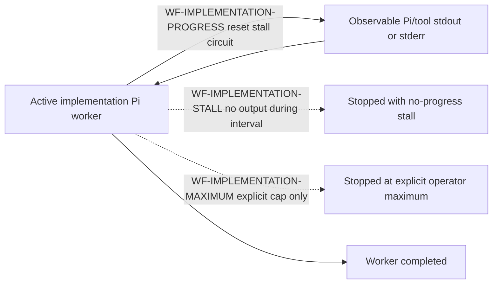

## Level 3: generic phase executor and all ordinary detours

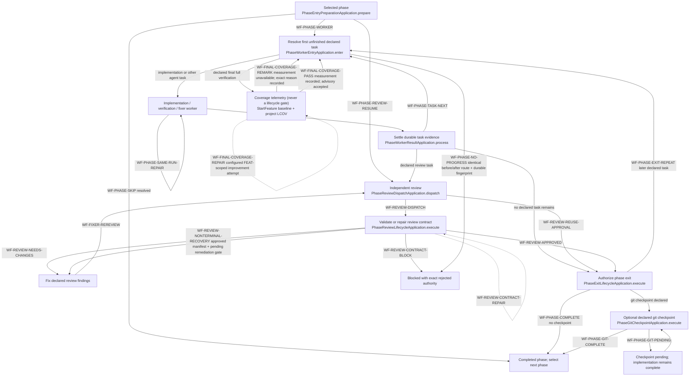

A Git checkpoint publishes to a valid branch-configured remote. Without one, it prefers a remote named `fork` before `origin`, so an upstream `origin` is never assumed writable; a sole remote remains valid, while any other multiple-remote topology is rejected as ambiguous. The same selected remote is used for push and remote-HEAD verification. When a prior attempt already recorded immutable checkpoint commits, retry verifies those commits remain reachable from the current feature branches and pushes them without staging the worktrees; unrelated later-phase or user changes remain unstaged and cannot manufacture a user-decision pause.

**Derived phase state (autonomous):** For autonomous workflows, phase lifecycle
state is derived from observable facts via `derivePhaseState(facts)` in
`phase-lifecycle-policy.ts`. The `**Status:**` field in the phase document is
display-only and must not drive lifecycle transitions. The facts are:

```
PhaseFacts {
  allTasksCompleted: boolean    // all task checkboxes checked
  needCodeReview: boolean        // phase contract declares code review
  codeReviewExists: boolean      // a code review artifact exists
  codeReviewState: APPROVED | NEEDS_CHANGES | BLOCKED | N/A
  isAutonomous: boolean          // workflow is self-driving
}
```

| Tasks | Need review? | Exists? | State | Autonomous | Derived |
|---|---|---|---|---|---|
| YES | NO | — | N/A | — | **COMPLETED** |
| YES | YES | NO | N/A | — | **AWAITING_REVIEW** |
| YES | YES | YES | APPROVED | YES | **COMPLETED** |
| YES | YES | YES | APPROVED | NO | **AWAITING_USER_ACCEPTANCE** |
| YES | YES | YES | NEEDS_CHANGES | — | **AWAITING_FIXES** |
| YES | YES | YES | BLOCKED | — | **BLOCKED** |
| YES | YES | YES | N/A | — | **AWAITING_REVIEW_RERUN** |

No impossible state is representable. A phase with all tasks done, an approved
review, and an autonomous workflow is always COMPLETED regardless of what the
`**Status:**` field says. The derived state is the single authority for
`areAllImplementationPhasesResolved` and the autonomous continuation scheduler.

**Declared-task exit invariant:** settling the final contract task may reconcile
the phase document display field, but that projection never authorizes the
coordinator to skip `PhaseExitLifecycleApplication`. The phase must still cross
`Exit`, then either `WF-PHASE-COMPLETE` or its declared git-checkpoint edge.
For V2/V3, `PhaseExecutionContract.json` is the canonical machine sequence and
`## Phase Task Ledger` is its required exact durable projection: one checkbox
per declared task, in the same order, with matching contract ID and executor.
Parity is validated at refinement promotion and every Start/Continue admission.
A missing, extra, reordered, uncontracted, or executor-mismatched ledger item
returns `CONTRACT_TASK_LEDGER_MISMATCH` before dispatch; no worker, gate,
checkpoint, or next-phase transition may run. Checkpoint sign-offs, acceptance
lists, manual-review lists, and other Markdown checkboxes cannot create a task.
Documents without an explicit contract retain the legacy explicit-ledger and
whole-document checklist compatibility fallback.

**Manual-test deferral invariant:** Refine Feature classifies qualification work
as `AUTOMATABLE` or `MANUAL_TEST_REQUIRED` without executing product tooling.
Manual-only work is never authored as a blocking executable gate; it is
represented by a SKIPPED task using the canonical reason and a validated
`ManualTestObligations.json` entry. Every obligation task ID must resolve to
exactly one durable ledger item in its declared phase before Ready promotion or
Start. V3 uses execution-contract identity. Legacy DevCycle output must project
the same stable ID through a `[contract:<taskId>]` checkbox marker; a numbered
heading or status prose is not task identity. Start preserves that stable
obligation ID while recording the separate derived SQLite ledger-task ID. If
implementation discovers the boundary later, the worker returns
`HEPHA_MANUAL_TEST_DEFERRAL_V1` rather than editing machine state. HEPHA
validates immutable fields, records SKIPPED in SQLite, checks the task in the
durable ledger, and writes the obligation projection. The Manual TestPack reads
that projection and renders the complete preconditions, steps, expected result,
and evidence requirements. Pending or failed manual qualification blocks
release readiness, not implementation completion. A real configured command
that executed red cannot be converted into a deferral. Pre-V3 documents use the
bounded legacy recovery adapter; V3 documents must use the SQLite settlement
path.

**Manual-test delivery invariant:** every acceptance criterion is classified as
`Manual`, `Automated`, `Deferred`, or `Uncovered` before delivery rendering.
Only an explicit `ManualTestObligations.json` procedure that names a concrete
application or interface, exact preconditions and setup data, executable user
actions, and observable results can become a manual case. Generic instructions
such as “navigate to the feature area” or “perform the expected workflow” fail
validation. Internal models, dependencies, catalogue contents, schemas,
digests, immutable structures, startup validation, and unit/source properties
use automated evidence instead of synthesized human steps. A backend-only
feature with no valid manual case produces an informational artifact and
`Manual Tests: Not Applicable`; it is never `Manual Test Pack Ready`.
Readiness requires at least one valid executable manual case, and a package in
which every case or criterion is missing cannot be ready. Automated evidence
records `executed-passed`, `executed-failed`, `zero-tests-discovered`, or
`not-executed`; an exit-zero command whose output reports no matching tests is
zero selection, not passing coverage.

**No-progress invariant:** every same-phase repeat must either mutate durable
FEAT/task/review/checkpoint evidence or choose a different route. The
coordinator fingerprints the complete FEAT evidence folder after a repeat
request. If one recovery cycle returns to the same route and decision with the
same fingerprint, evidence—not an arbitrary attempt count—proves no progress
and enters `WF-PHASE-NO-PROGRESS`. The workflow becomes `blocked` and publishes
the phase, route, fingerprint, last decision, and recovery guidance. The user
may then repair and choose Continue Implementation, or Cancel. Completed tasks
remain checked. Production edits alone do not prove workflow progress because
source changes without task, review, or gate settlement are not durable
transition evidence.

That phase-local circuit is deliberately separate from
`WF-CONTINUATION-NO-PROGRESS`. The phase circuit detects repeated routes inside
one executor run; the continuation circuit detects a no-op run before another
workflow ID can be created. Neither circuit is part of the terminal happy path:
an authoritative `all_terminal` result exits directly to Manual Code Review and
Manual Tests.

**Runtime phase identity invariant:** contract phase indices are zero-based
non-negative integers. Phase `0` is an ordinary valid runtime context and must
reach `WF-PHASE-WORKER`; strict plan-bound validation may reject negative,
fractional, unpaired contract/phase, or malformed identities, but it must not
apply a positive-only identifier rule to the first declared phase. A context
rejection occurs before Pi launch and must be reported as a host runtime defect,
not as an implementation decision or production-code failure.

**Coverage invariant:** the `Coverage` node is telemetry, not a lifecycle gate.
An unavailable command, timeout, baseline, LCOV report, or instrumentation
record follows `WF-FINAL-COVERAGE-REMARK` and rejoins ordinary task selection;
it cannot fail or block the phase or FEAT. Only a successfully measured
below-reference result may take the bounded `WF-FINAL-COVERAGE-REPAIR` loop.
Independent build, lint/typecheck, and test checks remain lifecycle gates.

For V2/V3, the execution contract is the sequence authority and the verified
ledger is its durable checkbox-state projection. Code review, verification,
checkpoint, documentation, and git work are ordinary declared tasks when they
appear in that contract. Their names are not special routing keys. When no
declared task remains, the phase-exit guard decides whether the phase can
complete. Legacy phase documents without an execution contract retain their
existing Markdown sequence compatibility path.

An approved review therefore does not always mean “complete the phase.” Only
an `APPROVED` manifest whose exact-scope authoritative gate is terminal
`APPROVED / approved_terminal_review` means “complete that declared review task
and select the next declared task.” An `APPROVED` manifest with
`PENDING / terminal_remediation_required` keeps the same review task
unresolved and takes `WF-REVIEW-NONTERMINAL-RECOVERY`; phase exit is not
attempted. Likewise, a remediation response without its bound verification
receipt returns to the fixer on the same task, while a durable response plus
receipt hands control to the independent reviewer. If the terminally approved
review task is last, phase exit follows. If a final checkpoint follows, that
checkpoint runs first. A phase with one documentation task and no review or
checkpoint completes after that task and its applicable exit guards.

When refinement declares a `final_checkpoint`, its last ordered task is a full
verification task that also requests `test-coverage`. The project-owned final
verification profile supplies one or more final-checkpoint-only coverage
commands and LCOV report contracts. `DeclaredVerificationTaskApplication`
selects those checks only for the semantic `final_checkpoint` role;
`evaluateChangedLineCoverage` compares instrumented executable lines changed since the
durable StartFeature commit, including committed, staged, unstaged, and new
untracked production files that exist before the phase git checkpoint, and separately calculates overall instrumented
project coverage. FEAT changed-line coverage is the actionable scope; overall
coverage is context only and never expands the current FEAT into legacy repair.
The receipt classifies successfully measured coverage below 80% as needs improvement, 80% through 94.99% as
OK, 95% through 99.99% as excellent, and 100% as perfect. These percentages are
advisory and never fail or block a phase or FEAT. Coverage is not a gate action:
its percentage and its availability cannot deny lifecycle progression.
Below-reference FEAT coverage may enter
the project-configured improvement loop, but that worker may edit only code and
tests changed by the FEAT. Exhausting the configured attempts, finding no safe
valuable improvement, or losing the optional improvement worker records the
reminder and completes the verification task. A coverage command failure,
timeout, missing baseline, missing LCOV report, or missing instrumentation
records an exact `coverage-unavailable` code-quality remark and completes the
verification task without launching a repair worker. These measurement errors
never reinterpret independent build, lint/typecheck, or test failures, which
retain their normal repair/rerun circuit. RefineFeature creates or updates the
project-owned coverage profile when the existing test configuration makes the
LCOV command, report path, source selectors, improvement-attempt policy, and multi-stack ownership
deterministic. A project without configured coverage returns to the existing
Deep-Dive circuit to collect those decisions; RefineFeature never guesses or
installs coverage tooling. The answer is persisted in that project profile, so
later FEATs reuse it without another question unless the profile becomes
missing, invalid, or ambiguous after a stack change. A workflow with no declared
final checkpoint does not receive an invented checkpoint, coverage task, or
profile mutation.

## Level 4: cancellation, recovery, and completion detours

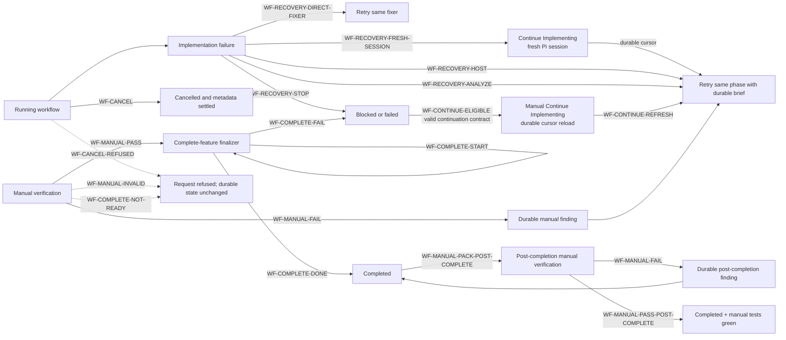

Cancellation is valid only for a cancellable active run. It requests process
cancellation, settles non-terminal phase metadata, records the workflow as
cancelled, and closes an open deep-dive session when applicable. Recovery does
not authorize arbitrary workflow-state edits by an agent; machine-owned state
is guarded and the retry re-enters the same generic executor.

A provider may complete and archive a FEAT before Hepha's local manual
verification is recorded. `04_COMPLETED` is not a read-only filesystem state.
`WF-MANUAL-PACK-POST-COMPLETE` therefore permits a resolved completed FEAT to
generate its SQLite-authoritative verification pack and derived Markdown/PDF
artifacts in the completed folder. A failed result records a durable finding
without reopening or moving the FEAT. `WF-MANUAL-PASS-POST-COMPLETE` records the
green manual-test timestamp without invoking Complete Feature a second time.
The same actions remain available to native and compatibility-provider runs;
recipe source is not part of this decision. Pack source discovery accepts
ordered, unordered, and checkbox entries under supported acceptance headings.
If no source can be discovered or rendering fails, the action returns a safe
HTTP error and the dialog retains that exact failure; an absent pack cannot
project Markdown/PDF links.

A terminal automatic-recovery decision ends only the current run. It does not
make the implementation terminal. When the continuation contract is valid,
unresolved work remains, and no run is active, `WF-CONTINUE-ELIGIBLE` must
project a manual `Continue Implementing` action. The Web client renders that
backend decision without adding a second readiness policy. Preparation-only
diagnostics may be shown beside the button; they cannot suppress it.

A provider prompt refusal is an operational session failure, not evidence that
the phase or active task failed. `WF-RECOVERY-FRESH-SESSION` changes the retry
command to `continue-implementing`, reloads the current feature and its durable
task cursor, and launches one new worker identity/session for the same first
unfinished task. Completed tasks, review findings, and gate evidence are not
replayed or discarded. The rejected session transcript is not reused. A second
provider refusal on that fresh attempt exhausts the bound and enters
`WF-RECOVERY-STOP`; Hepha never loops or rewrites the prompt to evade provider
policy.

## Responsibility index

| Workflow area | Production owner | One reason the method exists |
| --- | --- | --- |
| Route resolution | `RoutingPolicyService.resolve` | Resolve a registered action to a deterministic typed non-executing plan or rejection before dispatch. |
| Deep-dive start | `DeepDiveStartApplication.start` | Create the durable clarification session and run identity. |
| Deep-dive question handoff | `DeepDiveStartApplication.generateQuestions` | Persist generated questions or a precise failed session. |
| Deep-dive completion | `DeepDiveCompletionApplication.complete` | Enforce the answer gate and update the source document. |
| Design | `DesignFeatureExecutionApplication.execute` | Produce UI artifacts for a readiness-approved design run. |
| Refinement | `RefineFeatureExecutionApplication.execute` | Generate and validate the full planning contract, including executable project coverage capability when a final checkpoint is declared. |
| Coverage measurement | `evaluateChangedLineCoverage` | Measure FEAT-owned changed lines and overall project context without turning an advisory percentage into a lifecycle failure. |
| Coverage receipt projection | `readLatestTestCoverageSummary` | Recover the latest durable coverage measurements for the FEAT details page. |
| Pi installation default | `readPiInstallationDefault` | Read only Pi's explicit provider/model default and bind it to one active code-owned provider endpoint without labels or fallback inference. |
| Pi authenticated provider identities | `readPiAuthenticatedProviderIds` | Read only validated top-level provider IDs from Pi authentication state; never return or project credential values. |
| Pi catalog table parsing | `PiModelCatalogScanner.scan` | Convert bounded supported Pi model-list output into connection-filtered safe normalization input. |
| Web routing bootstrap | `RoutingActionResolver.resolvePlan` | Retry an unset policy exactly once with the validated installation route; never replace invalid or unavailable persisted policy. |
| Refinement result parsing | `parseRefineFeatureWorkerResult` | Distinguish a complete artifact claim from a user-decision handoff before promotion. |
| Refinement Deep-Dive handoff | `RefinementDeepDiveHandoffApplication.create` | Persist unresolved refinement questions in the existing interactive Deep-Dive contract. |
| Start implementation | `StartImplementationRunApplication.execute` | Establish branch/lifecycle prerequisites and enter the shared loop. |
| Continue implementation | `ContinueImplementationRunApplication.execute` | Rebuild runtime intent from durable state and enter the shared loop. |
| Manual continuation eligibility | `FeatureWorkflowSummaryProjector.build` | Keep stopped in-progress work resumable from execution authority without letting refinement-only satellites hide recovery. |
| Phase queue | `AutonomousPhaseQueueApplication.prepare` | Choose one generic queue route from contract and durable evidence. |
| Phase worker entry | `PhaseWorkerEntryApplication.enter` | Select exactly the next declared task or durable review route. |
| Same-run repair | `PhaseSameRunRepairApplication.prepare` | Keep a recoverable failure on the same active task. |
| Phase no-progress circuit | `PhaseNoProgressCircuit.observe` | Pause an identical before/after host transition when no durable FEAT/task/review/checkpoint evidence changes, preserving completed work and waiting for an explicit user decision. |
| Final test coverage | `DeclaredVerificationTaskApplication.execute` | Record FEAT and project coverage as non-gating telemetry; optionally run bounded FEAT-scoped improvement only after a successful below-reference measurement, and convert measurement failures into visible remarks that cannot fail the phase or FEAT. |
| Review dispatch | `PhaseReviewDispatchApplication.dispatch` | Reuse valid approval or launch exactly one independent review. |
| Review lifecycle | `PhaseReviewLifecycleApplication.execute` | Validate/repair reviewer output before publishing authority. |
| Nonterminal review recovery | `PhaseReviewPublicationApplication.publish` | Keep an approved-but-nonterminal remediation lifecycle on the same declared review task instead of attempting phase exit. |
| Fixer handback | `PhasePostWorkerReviewApplication.prepare` | Validate fixer evidence and require reviewer adjudication. |
| Phase exit | `PhaseExitLifecycleApplication.execute` | Authorize completion only after declared work and gates resolve. |
| Git checkpoint | `PhaseGitCheckpointApplication.execute` | Run an optional declared checkpoint without falsifying phase work. |
| Auto recovery | `ImplementationAutoRecoveryApplication.attempt` | Classify one bounded retry route or refuse unsafe continuation. |
| Cancellation | `FeatureWorkflowCancellationApplication.cancel` | Stop attached work and make durable state restart-safe. |
| Manual-test task deferral | `PhaseWorkerTaskSettlementApplication.settle` | Validate a worker deferral, persist SKIPPED task authority, and create mandatory Manual TestPack input without falsely completing the task. |
| Legacy manual-test recovery | `recoverLegacyManualTestTask` | Recover a pre-V3 blocked/manual task as SKIPPED with exact reason and obligation while rejecting V3 direct mutation. |
| Manual verification | `ManualTestVerificationApplication.recordResult` | Persist the human gate and trigger finding or completion routing. |
| Complete feature | `CompleteFeatureExecutionApplication.execute` | Perform final documentation/state/folder finalization. |

Methods not listed here may prepare data, persist evidence, render prompts, or
adapt infrastructure, but they must not create a new workflow transition. A
new transition-owning method requires a registry entry and diagram edge.

## Pin-pointing an incident

Use this sequence when a transition is wrong or absent:

1. Record the visible source state, expected destination, run ID, phase/task
   cursor, and durable evidence that should have triggered the edge.
2. Find the matching `WF-*` edge in the diagrams. If no edge matches, the
   behavior is either missing from the model or is not an authorized workflow
   transition.
3. Open that ID in `workflow-transition-registry.json`. The `ownerPath` and
   `ownerSymbol` identify the exact production decision boundary.
4. Inspect the run/phase receipt, task ledger, review artifact, and failure
   brief consumed by that owner. Logs explain execution; they do not override
   durable authority.
5. Reproduce the decision in the listed unit test, then reproduce the complete
   route in the listed Gherkin integration scenario.
6. Before changing code, add a workflow-change justification record as defined
   in [Workflow Change Justification](workflow-change-justification.md).

This makes “the orchestrator chose the wrong next step” a bounded diagnostic:
transition ID → owner method → input evidence → unit decision → Gherkin route.

## What this map deliberately does not encode

- FEAT IDs, phase numbers, task names, or phase filenames;
- UI labels as transition authority;
- prose parsing, formatting quirks, or report filenames as routing decisions;
- optional governance projections as hidden phase gates;
- infrastructure helpers that do not choose the next workflow state.

Those details may appear in evidence, but they cannot create a generic route.
